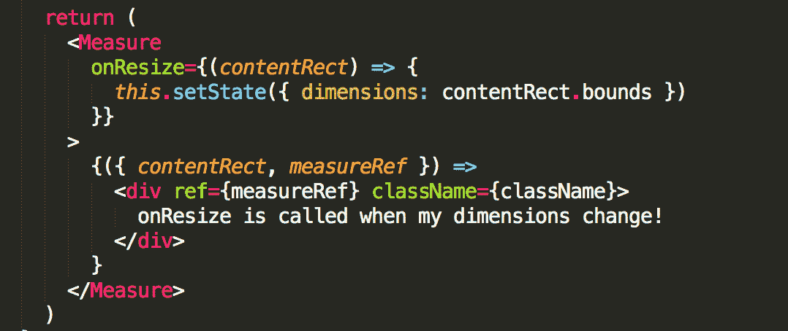
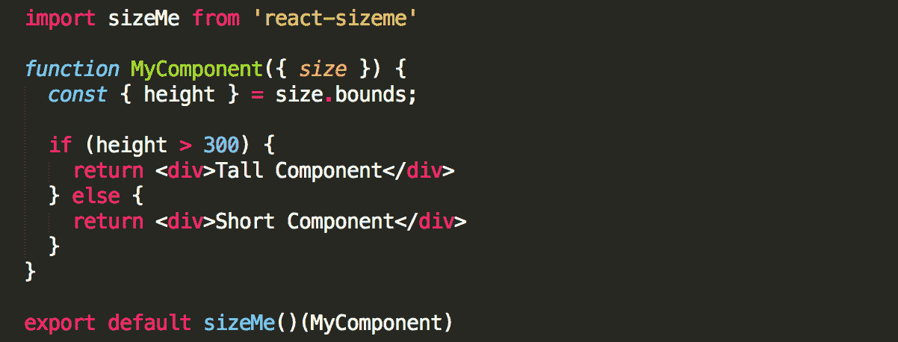

# 构建大小敏感的 React 组件

> 原文：<https://blog.logrocket.com/building-size-aware-react-components-b4c37e7d96e7/>

# 构建感知大小的 React 组件

## 

2017 年 6 月 27 日 2 分钟阅读 639

当构建 React 应用程序时，组件知道它们在屏幕上的大小和位置有时是有利的。这对于最初呈现内容很有用，对于需要知道其大小何时改变的组件也很有用。这方面的一些例子有:

*   需要根据大小对内容进行不同布局的组件。例如，从 1 列变为 2 列的响应式布局，或者在宽度受限时切换到汉堡包的下拉式菜单。
*   当使用 HTML5 画布时，每当其大小改变时都必须重新绘制
*   当构建用户可以调整不同窗格大小的布局时
*   当使用需要已知大小的元素或第三方库时，如 react-virtualized、固定数据表等。
*   当呈现具有绝对定位的元素时，需要在容器大小改变时调整其位置。
*   当用 CSS 动画显示元素的大小时，附加逻辑依赖于这个动画的大小

其中一些行为可以通过 CSS 实现，或者通过用`onResize`事件管理窗口大小来实现，但是为了构建可最大程度重用的 React 组件，将这个逻辑封装到组件本身是有意义的。这样，无论组件在哪里/如何使用，它都将正确运行。

幸运的是，有一些优秀的库可以帮助解决这个问题。在这里，我将对每一个进行简单介绍，并说明何时使用它。

### 反应-测量

react-measure 是一个有用的库，用于构建大小感知组件。它包装一个组件并公开一个用元素的 contentRect(有边界和位置)调用的`onResize`函数。每当组件的大小或位置发生变化时，都会调用此方法，它可用于触发副作用或使维度进入状态。

这解决了大多数早期的例子，但是有一个问题——一个*鸡和蛋的问题*。当组件第一次呈现时，它的尺寸并不总是已知的，因为它的宽度/高度可能由其内容决定。因此，我们并不总是知道`render`函数中的维度，所以组件基于其维度来呈现逻辑是不完全可能的。

### react-sizeme

为了解决这个问题，我们求助于一个名为`react-sizeme`的库。这个库类似于`react-measure`，但是使用了一个聪明的解决方案来解决前面提到的问题。

对组件进行初始的、不可见的渲染，以测量其大小。它是以一种轻量级的方式来实现的，没有完全渲染组件那么强烈。然后，当组件呈现时，大小是已知的，并且组件可以从头开始正确呈现。因此，组件可以基于自己的维度拥有`render`逻辑！

使用`react-sizeme`看起来像这样:

### 警告

对于这两个库，有一些需要注意的地方。`react-sizeme`决定组件尺寸的初始渲染不是免费的，并且确实增加了渲染组件的可见性时间。对于只挂载一次的组件来说，这通常是不明显的，但是对于挂载多次的组件(例如，虚拟列表中的项目)，会有明显的性能影响。因为`react-measure`不做这个初始渲染，它应该在这些情况下被理想地使用。

两个库用来检测大小变化的方法也有轻微的延迟(大约 20 毫秒)。通常这感觉起来很快，但在实践中，我注意到在检测变化时会有轻微的延迟，这会导致组件感觉很慢。

一般来说，`react-measure`对性能的影响较小，所以如果可能的话应该使用它，但是如果组件的初始渲染依赖于它的大小，那么`react-sizeme`是一个好的选择。

### 资源

> 计算反应组分测量值。使用 ResizeObserver 来检测元素的尺寸何时发生了变化。在不支持的浏览器中包含一个用于 ResizeObserver 的 polyfill。yarn add react-measure NPM install react-measure–save Wrap 任何子组件并计算其客户端 rect。将以下内容添加到子函数中返回的 contentRect.client。

> 让您的 React 组件知道它们的宽度和/或高度！超灵敏元件！表演。好用。广泛的浏览器支持。支持函数和类组件类型。小捆尺寸。演示:[https://4mkpc.csb.app/](https://4mkpc.csb.app/)通过渲染道具模式使用它(支持子元素或渲染道具):或者，通过一个更高级的组件:让你的组件能够根据它们的高度和/或宽度来渲染逻辑。

## [LogRocket](https://lp.logrocket.com/blg/react-signup-general) :全面了解您的生产 React 应用

调试 React 应用程序可能很困难，尤其是当用户遇到难以重现的问题时。如果您对监视和跟踪 Redux 状态、自动显示 JavaScript 错误以及跟踪缓慢的网络请求和组件加载时间感兴趣，

[try LogRocket](https://lp.logrocket.com/blg/react-signup-general)

.

  

LogRocket 结合了会话回放、产品分析和错误跟踪，使软件团队能够创建理想的 web 和移动产品体验。这对你来说意味着什么？

LogRocket 不是猜测错误发生的原因，也不是要求用户提供截图和日志转储，而是让您回放问题，就像它们发生在您自己的浏览器中一样，以快速了解哪里出错了。

不再有嘈杂的警报。智能错误跟踪允许您对问题进行分类，然后从中学习。获得有影响的用户问题的通知，而不是误报。警报越少，有用的信号越多。

LogRocket Redux 中间件包为您的用户会话增加了一层额外的可见性。LogRocket 记录 Redux 存储中的所有操作和状态。

现代化您调试 React 应用的方式— [开始免费监控](https://lp.logrocket.com/blg/react-signup-general)。