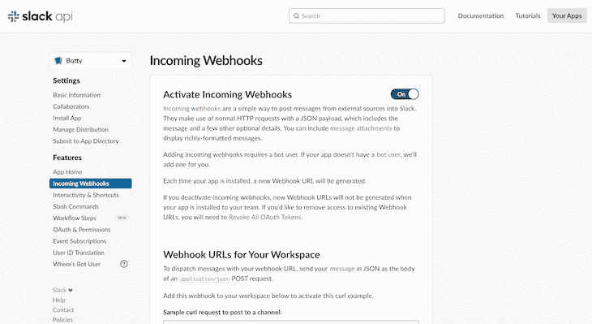
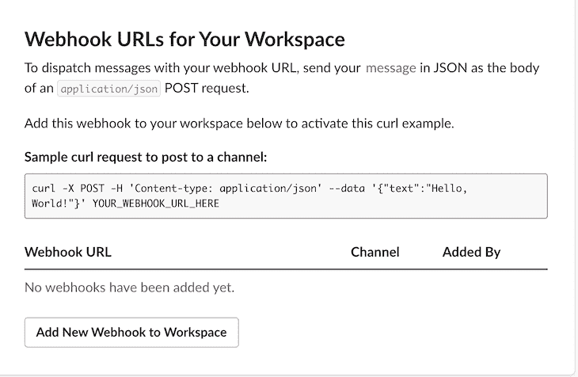
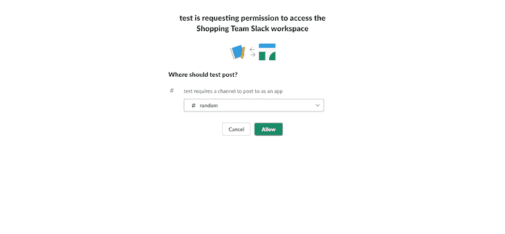
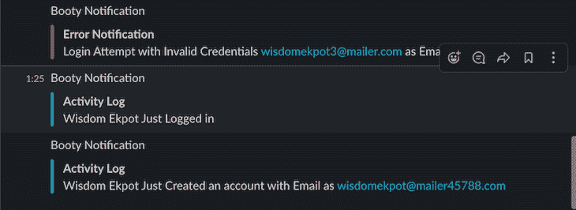

# 为记录 Node.js 应用程序活动构建 Slackbot

> 原文：<https://blog.logrocket.com/building-slackbot-logging-nodejs-application-activities/>

Slack 是一个基于云的即时通讯平台，旨在为公司补充电子邮件，作为一种沟通和共享数据的方法。它还有一些很酷的功能，比如用它的网络钩子*向频道发送消息。*

Webhooks 是当有事情发生时，应用程序自动发送的有效负载。这基本上是应用程序向其他应用程序发送自动消息或信息的一种方式。

在本文中，我们将使用 Node.js 构建一个 Slackbot 来记录应用程序中发生的所有活动。

### 先决条件

*   基本熟悉 JavaScript
*   安装在开发机器上的 Node.js
*   安装在开发机器上的 MongoDB
*   对[REST API](https://codesource.io/building-crud-api-using-restify-framework/)的基本理解

## 项目设置

在开始构建我们的 bot 之前，我们必须创建一个简单的 Node.js 应用程序，用户可以在其中创建一个帐户并登录。我们的机器人将在用户创建帐户时登录；当帐户创建过程中出现错误时；当用户使用正确的凭据登录时；以及当用户试图用不正确的凭证登录时。

我们将使用 Express generator 创建一个新的 Express 应用程序，然后我们将安装我们的应用程序所需的所有必需的依赖项。为此，请打开您的终端并键入以下内容:

```
npx express-generator --no-view
```

搭建应用程序后，运行`npm install`来安装项目依赖项。

```
npm i axios bcrypt cors jsonwebtoken mongoose dotenv
```

安装好这些之后，您将修改您的`app.js`文件，如下所示:

```
require('dotenv').config()
var express = require('express');
var path = require('path');
var cookieParser = require('cookie-parser');
var logger = require('morgan');
var indexRouter = require('./routes/index');
var usersRouter = require('./routes/users');
var app = express();
app.use(logger('dev'));
app.use(express.json());
app.use(express.urlencoded({
    extended: false
}));
app.use(cookieParser());
app.use(express.static(path.join(__dirname, 'public')));
require("./config/mongoose")(app);

app.use('/', indexRouter);
app.use('/users', usersRouter);
module.exports = app;
```

现在我们需要为我们的应用程序设置 Mongoose。创建一个`config/mongoose.js`文件并添加以下代码:

```
const mongoose = require("mongoose");
module.exports = app => {
    mongoose.connect("mongodb://localhost:27017/slackbot", {
        useUnifiedTopology: true,
        useNewUrlParser: true,
        useFindAndModify: false
    }).then(() => console.log("conneceted to db")).catch(err => console.log(err))
    mongoose.Promise = global.Promise;
    process.on("SIGINT", cleanup);
    process.on("SIGTERM", cleanup);
    process.on("SIGHUP", cleanup);
    if (app) {
        app.set("mongoose", mongoose);
    }
};
function cleanup() {
    mongoose.connection.close(function () {
        process.exit(0);
    });
}
```

运行`npm start`将在控制台上显示`connected to db`,这就是你所想的那样。

现在让我们为应用程序设置模型和控制器。创建一个`models/users.js`文件并添加以下内容:

```
const mongoose = require("mongoose");
const bcrypt = require("bcrypt");
const jwt = require("jsonwebtoken");
const Schema = mongoose.Schema;
const userSchema = new Schema({
    name: {
        type: String,
        required: true,
    },
    password: {
        type: String,
        required: true
    },
    email: {
        type: String,
        required: true,
    },
}, {
    timestamps: true,
});

userSchema.methods.hashPassword = async password => {
    return await bcrypt.hashSync(password, 10);
}
userSchema.methods.compareUserPassword = async (inputtedPassword, hashedPassword) => {
    return await bcrypt.compare(inputtedPassword, hashedPassword)
}
userSchema.methods.generateJwtToken = async (payload, secret, expires) => {
    return jwt.sign(payload, secret, expires)
}
module.exports = mongoose.model("User", userSchema);
```

这里，我们为我们的用户模型创建了一个简单的 Mongoose 模式，并定义了一些函数，这些函数将散列用户的密码，比较用户的密码，并在用户登录凭证正确时生成一个 JWT 令牌。

我们还将创建一个`controllers/users.js`文件，并向其中添加以下代码:

```
const User = require("../models/user");
exports.createNewUser = async (req, res) => {
    try {
        const user = new User({
            name: req.body.name,
            email: req.body.email,
            phone_number: req.body.phone_number,
            role: req.body.role
        });
        user.password = await user.hashPassword(req.body.password);
        let addedUser = await user.save()
        res.status(200).json({
            msg: "Your Account Has been Created",
            data: addedUser
        })
    } catch (err) {
        console.log(err)
        res.status(500).json({
            error: err
        })
    }
}
exports.logUserIn = async (req, res) => {
    const {
        email,
        password
    } = req.body
    try {
        let user = await User.findOne({
            email: email
        });
        //check if user exit
        if (!user) {
            return res.status(400).json({
                type: "Not Found",
                msg: "Wrong Login Details"
            })
        }
        let match = await user.compareUserPassword(password, user.password);
        if (match) {
            let token = await user.generateJwtToken({
                user
            }, "secret", {
                expiresIn: 604800
            })
            if (token) {
                res.status(200).json({
                    success: true,
                    token: token,
                    userCredentials: user
                })
            }
        } else {
            return res.status(400).json({
                type: "Not Found",
                msg: "Wrong Login Details"
            })
        }
    } catch (err) {
        console.log(err)
        res.status(500).json({
            type: "Something Went Wrong",
            msg: err
        })
    }
}
```

这些是创建用户帐户和用户登录的基本功能。

我们必须修改我们的`routes/user.js`文件来监听我们创建的控制器:

```
var express = require('express');
const controller = require('../controllers/user')
var router = express.Router();
/* GET users listing. */
router.get('/', function (req, res, next) {
  res.send('respond with a resource');
});

router.post('/register', controller.createNewUser)
router.post('/login', controller.logUserIn)

module.exports = router;
```

您可以使用 POSTMAN 来测试您的登录和注册路线。

## 建造懒人机器人

在我们开始构建我们的 bot 之前，我们必须创建一个新的 slack 应用程序。前往[https://api.slack.com](https://api.slack.com)并确保你已登录。点击**开始构建**按钮，这将把你带到一个页面，提示你给你的机器人起一个名字，并指定你想要集成它的工作空间。

设置完成后，导航到传入的 webhooks 路径并激活它:



我们需要一个 webhook URL 来与我们的工作区进行通信。



点击**添加新的 Webhook 到工作区**按钮。这将要求您选择一个通道来发布来自 bot 的消息。选择您选择的频道，然后单击“允许”按钮:



单击 **Allow** 将为我们的应用程序生成一个 webhook URL。我们可以复制它并将其存储在我们的`.env`文件中:

```
HOOK=<hook>
```

不要忘记在`.gitignore`文件中添加你的`.env`文件。

现在创建一个`util/bot.js`文件——这是我们设置机器人的地方。我们将有一个向 Slack API 发送请求的函数。这个函数将接受两个参数:`error`和`payload`。

为了使用 webhook URL 发送消息，我们将在 JSON 中发送一个有效负载(无论是错误还是实际的有效负载)作为`application/json` POST 请求的主体。这就是 Axios 的用武之地。

像这样修改您的`bot.js`文件:

```
const axios = require("axios");
const hook = process.env.HOOK;
exports.sendNotificationToBotty = async (error, log) => {
    try {
        let slackbody;
        if (log) {
            slackbody = {
                mkdwn: true,
                attachments: [{
                    pretext: "Booty Notification",
                    title: "Activity Log",
                    color: "good",
                    text: log,
                }, ],
            };
        } else if (error) {
            slackbody = {
                mkdwn: true,
                attachments: [{
                    pretext: "Booty Notification",
                    title: "Error Notification",
                    color: "#f50057",
                    text: error,
                }, ],
            };
        }
        await axios.post(
            `https://hooks.slack.com/services/${hook}`,
            slackbody
        );
    } catch (err) {
        console.log(err);
    }
};
```

我们现在可以在我们的应用程序中使用它。我们使用 Slack 提供的消息附件来显示我们的消息。

所以现在我们必须将这个模块引入到我们的`controllers/user.js`文件中，以便我们的机器人可以在活动发生时发送自定义消息。像这样修改`controllers/user.js`文件:

```
const User = require("../models/user");
const bot = require("../util/bot")
exports.createNewUser = async (req, res) => {
    try {
        const user = new User({
            name: req.body.name,
            email: req.body.email,
            phone_number: req.body.phone_number,
            role: req.body.role
        });
        user.password = await user.hashPassword(req.body.password);
        let addedUser = await user.save()
        await bot.sendNotificationToBotty(null, `${addedUser.name} Just Created an account with Email as ${addedUser.email}`)
        res.status(200).json({
            msg: "Your Account Has been Created",
            data: addedUser
        })
    } catch (err) {
        console.log(err)
        res.status(500).json({
            error: err
        })
    }
}
exports.logUserIn = async (req, res) => {
    const {
        email,
        password
    } = req.body
    try {
        let user = await User.findOne({
            email: email
        });
        //check if user exit
        if (!user) {
            await bot.sendNotificationToBotty(`Login Attempt with Invalid Credentials ${email} as Email and ${password} as Password`)
            return res.status(400).json({
                type: "Not Found",
                msg: "Wrong Login Details"
            })
        }
        let match = await user.compareUserPassword(password, user.password);
        if (match) {
            let token = await user.generateJwtToken({
                user
            }, "secret", {
                expiresIn: 604800
            })
            if (token) {
                await bot.sendNotificationToBotty(null, `${user.name} Just Logged in`)
                res.status(200).json({
                    success: true,
                    token: token,
                    userCredentials: user
                })
            }
        } else {
            await bot.sendNotificationToBotty(`Login Attempt with Invalid Credentials ${email} as Email and ${password} as Password`)
            return res.status(400).json({
                type: "Not Found",
                msg: "Wrong Login Details"
            })
        }
    } catch (err) {
        await bot.sendNotificationToBotty(`An Error Occured`)
        console.log(err)
        res.status(500).json({
            type: "Something Went Wrong",
            msg: err
        })
    }
}
```

现在，当一个新用户创建一个帐户时，机器人会将用户名和电子邮件发送到频道，当用户登录时也会发生同样的事情。



当发生错误时，例如当用户试图用错误登录详细信息登录时，将发送错误消息。

## 结论

日志记录是任何应用程序的重要组成部分，必须认真对待。在本文中，我们学习了如何在我们的自定义 Node.js 应用程序中使用 Slack webhooks。它可以用来构建更有趣的应用程序。要获取应用程序源代码，请单击此处的。

## 200 只显示器出现故障，生产中网络请求缓慢

部署基于节点的 web 应用程序或网站是容易的部分。确保您的节点实例继续为您的应用程序提供资源是事情变得更加困难的地方。如果您对确保对后端或第三方服务的请求成功感兴趣，

[try LogRocket](https://lp.logrocket.com/blg/node-signup)

.

[](https://lp.logrocket.com/blg/node-signup)[https://logrocket.com/signup/](https://lp.logrocket.com/blg/node-signup)

LogRocket 就像是网络和移动应用程序的 DVR，记录下用户与你的应用程序交互时发生的一切。您可以汇总并报告有问题的网络请求，以快速了解根本原因，而不是猜测问题发生的原因。

LogRocket 检测您的应用程序以记录基线性能计时，如页面加载时间、到达第一个字节的时间、慢速网络请求，还记录 Redux、NgRx 和 Vuex 操作/状态。

[Start monitoring for free](https://lp.logrocket.com/blg/node-signup)

.