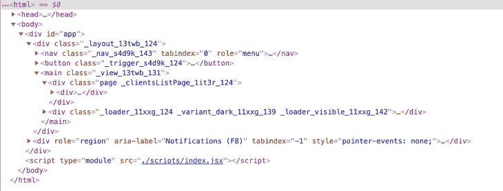

# 不用 React 构建有状态的 web 应用程序

> 原文：<https://blog.logrocket.com/building-stateful-web-apps-without-react/>

React、Angular 和 Vue 是用一致的结构快速启动和运行 web 应用程序的优秀框架。不过它们都是建立在 JavaScript 之上的，所以让我们看看如何只用普通的 JavaScript 就能做大型框架做的好事。

对于那些过去使用过这些框架，但从来没有真正理解它们在做什么的开发人员来说，这篇文章可能会很有意思。我们将通过演示如何仅使用普通 JavaScript 构建有状态 web 应用程序来探索这些框架的不同方面。

*向前跳转:*

## 状态管理

管理状态是 React、Angular 和 Vue 在内部或通过 Redux 或 Zustand 等库完成的。然而，状态可以像 JavaScript 对象一样简单，包含应用程序感兴趣的所有属性-值键对。

如果你正在构建经典的待办事项列表应用程序，你的状态可能会包含一个类似于`currentTodoItemID`的属性，如果它的值是`null`，你的应用程序可能会显示所有待办事项的完整列表。

如果`currentTodoItemID`被设置为特定`todoItem`的 ID，应用程序可能会显示该`todoItem's`的详细信息。如果你正在构建一个游戏，你的状态可能包含属性和值，比如`playerHealth = 47.5`和`currentLevel = 2.`

国家的形状和大小并不重要。重要的是应用程序的组件如何改变其属性，以及其他组件如何对这些改变做出反应。

这给我们带来了第一点魔力:[代理对象](https://developer.mozilla.org/en-US/docs/Web/JavaScript/Reference/Global_Objects/Proxy)。

代理对象是从 ES6 开始的 JavaScript 的原生对象，可以用来监控对象的变化。为了了解如何在 JavaScript 中利用代理对象，让我们看看下面的示例代码`index.js file`，它使用了一个名为 [on-change](https://www.npmjs.com/package/on-change) 的 npm 模块。

```
import onChange from 'on-change';

class App = {
  constructor() {
    // create the initial state object
    const state = {
      currentTodoItemID: null
    }
    // listen for changes to the state object
    this.state = onChange(state, this.update);
  }
  // react to state changes
  update(path, current, previous) {
    console.log(`${path} changed from ${previous} to ${current}`);
  }
}

// create a new instance of the App
const app = new App();

// this should log "currentTodoItemID changed from null to 1"
app.state.currentTodoItemID = 1;
```

***注意，*** *代理对象在 Internet Explorer 中不工作，所以如果这是您的项目的要求，您应该考虑这个警告。没有办法多填充一个代理对象，所以你需要使用轮询，每秒钟检查几次状态对象，看看它是否已经改变，这不是优雅或有效的。*

## 建筑构件

React 中的组件只是 HTML 的结构、JavaScript 的逻辑和 CSS 的样式的模块化部分。有些应该独立显示，有些应该按顺序显示，有些可能只使用 HTML 来存放完全不同的东西，比如可更新的 SVG 图像或 WebGL 画布。

无论你构建的是什么类型的组件，它都应该能够访问你的应用程序的状态，或者至少是与它相关的部分状态。以下代码来自`src/index.js`):

```
import onChange from 'on-change';
import TodoItemList from 'components/TodoItemList';

class App = {
  constructor() {
    const state = {
      currentTodoItemID: null,
      todoItems: [] // *see note below
    }
    this.state = onChange(state, this.update);

    // create a container for the app
    this.el = document.createElement('div');
    this.el.className = 'todo';

    // create a TodoItemList, pass it the state object, and add it to the DOM
    this.todoItemList = new TodoItemList(this.state);
    this.el.appendChild(this.todoItemList.el);
  }

  update(path, current, previous) {
    console.log(`${path} changed from ${previous} to ${current}`);
  }
}

const app = new App();
document.body.appendChild(app.el);
```

随着你的应用程序规模的扩大，把像`state.todoItems`这样可能会变得很大的东西从你的状态对象转移到像数据库这样的持久存储方法是一个很好的实践。

如下面的`src/components/TodoItemList.js`和`src/components/TodoItem.js`所示，在状态中保持对这些组件的引用更好。

```
import TodoItem from 'components/TodoItem';

export default class TodoItemList {
  constructor(state) {
    this.el = document.createElement('div');
    this.el.className = 'todo-list';

    for(let i = 0; i < state.todoItems.length; i += 1) {
      const todoItem = new TodoItem(state, i);
      this.el.appendChild(todoItem);
    }
  }
}
```

```
export default class TodoItem {
  constructor(state, id) {
    this.el = document.createElement('div');
    this.el.className = 'todo-list-item';
    this.title = document.createElement('h1');
    this.button = document.createElement('button');

    this.title.innerText = state.todoItems[id].title;
    this.button.innerText = 'Open';
    this.button.addEventListener('click', () => { state.currentTodoItemID = id });

    this.el.appendChild(this.title);
    this.el.appendChild(this.button);
  }
}
```

React 也有视图的概念，它类似于组件，但不需要任何逻辑。我们可以使用这种普通模式构建类似的容器。我不会包括任何具体的例子，但它们可以被认为是框架组件，只是将应用程序的状态传递给其中的功能组件。

## DOM 操作

DOM 操作是 React 这样的框架大放异彩的领域。因此，虽然我们通过用普通 JavaScript 自己处理标记获得了一点灵活性，但我们失去了与这些框架如何更新相关的许多便利。

让我们在我们的待办事项应用程序示例中尝试一下，看看我在说什么。以下代码来自`src/index.js`和`src/components/TodoItemList.js`:

```
import onChange from 'on-change';
import TodoItemList from 'components/TodoItemList';

class App = {
  constructor() {
    const state = {
      currentTodoItemID: null,
      todoItems: [
        { title: 'Buy Milk', due: '3/11/23' },
        { title: 'Wash Car', due: '4/13/23' },
        { title: 'Pay Rent', due: '5/15/23' },
      ]
    }
    this.state = onChange(state, this.update);

    this.el = document.createElement('div');
    this.el.className = 'todo';

    this.todoItemList = new TodoItemList(this.state); 
    this.el.appendChild(this.todoItemList.el);
  }

  update(path, current, previous) {
    if(path === 'todoItems') {
      this.todoItemList.render();
    }
  }
}

const app = new App();
document.body.appendChild(app.el);

app.state.todoItems.splice(1, 1); // remove the second todoListItem
app.state.todoItems.push({ title: 'Eat Pizza', due: '6/17/23'); // add a new one
```

```
import TodoItem from 'components/TodoItem';

export default class TodoItemList {
  constructor(state) {
    this.state = state;
    this.el = document.createElement('div');
    this.el.className = 'todo-list';
    this.render();
  }

  // render the list of todoItems to the DOM 
  render() {
    // empty the list
    this.el.innerHTML = '';
    // fill the list with todoItems
    for (let i = 0; i < this.state.todoItems.length; i += 1) {
      const todoItem = new TodoItem(state, i);
      this.el.appendChild(todoItem);
    }
  }
}
```

在上面的例子中，我们创建了一个`TodoItemList`，在我们的状态中预加载了三个`todoListItems`。然后，我们删除中间的`TodoItem`并添加一个新的。

虽然这种策略可以正常工作和显示，但它的效率很低，因为它需要删除所有现有的 DOM 节点，并在每次渲染时创建新的节点。

React 在这方面比 JavaScript 聪明；它在内存中保存对每个 DOM 节点的引用。您可能已经注意到 React 标记中奇怪的标识符，如下所示:



我们也可以通过存储对每个节点的引用来进行类似的 DOM 操作。对于`todoListItems`，它可能看起来像这样:

```
 for(let i = 0; i < this.state.todoItems.length; i += 1) {
   // instead of making anonymous elements, attach them to state
   this.state.todoItems[i].el = new TodoItem(this.state, i);
   this.el.appendChild(this.state.todoItems[i].el);
 }
```

虽然这些操作可以工作，但是在向状态中添加 DOM 元素时应该小心。它们不仅仅是对它们在 DOM 树中位置的引用；它们包含自己的属性和方法，这些属性和方法可能会在应用程序的整个生命周期中发生变化。

如果您走这条路，最好使用`ignoreKeys`参数告诉 on-change 模块忽略添加的 DOM 元素。

## 生命周期挂钩

React 有一套一致的生命周期挂钩，使得开发人员可以非常容易地开始一个新项目，并快速了解应用程序运行时会发生什么。最引人注目的两个钩子是`ComponentDidMount()`和`ComponentWillUnmount()`。

* * *

### 更多来自 LogRocket 的精彩文章:

* * *

让我们举一个非常基本的例子，在`src/index.js`文件中，简单地称它们为`show()`和`hide()`。

```
import onChange from 'on-change';
import Menu from 'components/Menu';

class App = {
  constructor() {
    const state = {
      showMenu: false
    }
    this.state = onChange(state, this.update);

    this.el = document.createElement('div');
    this.el.className = 'todo';
    // create an instance of the Menu
    this.menu = new Menu(this.state);

    // create a button to show or hide the menu
    this.toggle = document.createElement('button');
    this.toggle.innerText = 'show or hide the menu';

    this.el.appendChild(this.menu.el);
    this.el.appendChild(this.toggle);

    // change the showMenu property of our state object when clicked
    this.toggle.addEventListener('click', () => { this.state.showMenu = !this.state.showMenu; })
  }

  update(path, current, previous) {
    if(path === 'showMenu') {
      // show or hide menu depending on state
      this.menu[current ? 'show' : 'hide']();
    }
  }
}

const app = new App();
document.body.appendChild(app.el);
```

现在，这里有一个例子(来自`src/components/menu.js`)说明我们如何用 JavaScript 编写定制钩子:

```
export default class Menu = {
  constructor(state) {
    this.el = document.createElement('div');
    this.title = document.createElement('h1');
    this.text = document.createElement('p');

    this.title.innerText = 'Menu';
    this.text.innerText = 'menu content here';

    this.el.appendChild(this.title);
    this.el.appendChild(this.text);

    this.el.className = `menu ${!state.showMenu ? 'hidden' : ''}`;
  }

  show() {
    this.el.classList.remove('hidden');
  }

  hide() {
    this.el.classList.add('hidden');
  }
}
```

这种策略允许我们编写任何我们喜欢的内部方法。例如，您可能想要根据菜单是被用户关闭，还是因为应用程序中发生了其他事情而关闭，来更改菜单的动画方式。

React 通过使用一组标准的钩子来加强一致性，但是我们可以用普通的 JavaScript 为我们的组件编写定制的钩子，从而获得更大的灵活性。

## 按指定路线发送

现代网络应用的一个重要方面是能够跟踪当前位置，并通过应用的用户界面或浏览器的后退和前进按钮在历史中后退和前进。当你的应用程序尊重“深层链接”的时候也很好，比如[https://todoapp.com/currentTodoItem/5](http://daveseidman.com/About)。

React 路由器在这方面工作得很好，我们可以使用一些技术做类似的事情。一个是 JavaScript 的本地[历史 API](https://developer.mozilla.org/en-US/docs/Web/API/History_API) 。通过推入和弹出它的数组，我们可以跟踪我们希望保存到页面历史中的状态变化。我们还可以监听它的变化，并将这些变化应用于我们的状态对象(下面的代码来自`index.js`)。

```
import onChange from 'on-change';

class App = {
  constructor() {
    // create the initial state object
    const state = {
      currentTodoItemID: null
    }
    // listen for changes to the state object
    this.state = onChange(state, this.update);

    // listen for changes to the page location
    window.addEventListener('popstate', () => {
      this.state.currentTodoItemID = window.location.pathname.split('/')[2];
    });

    // on first load, check for a deep link
    if(window.location.pathname.split('/')[2]) {
      this.state.currentTodoItemID = window.location.pathname.split('/')[2];
    }
  }
  // react to state changes
  update(path, current, previous) {
    console.log(`${path} changed from ${previous} to ${current}`);
    if(path === 'currentTodoItemID') {
      history.pushState({ currentTodoItemID: current }, null, `/currentTodoItemID/${current}`);
    }
  }
}

// create a new instance of the App
const app = new App();
```

您可以尽可能地扩展它；对于复杂的应用程序，您可能有 10 个或更多不同的属性影响它应该显示什么。这种技术比 React Router 需要更多的设置，但使用普通 JavaScript 可以达到相同的效果。

## 文件组织

React 的另一个好的副产品是它鼓励你从一个入口点开始组织目录和文件，这个入口点通常被命名为 `index.js`或`app.js`，靠近项目文件夹的根。

接下来，你通常会在同一个位置找到`/views`和`/components`文件夹，里面装满了应用程序将利用的各种视图和组件，可能还有几个`/subviews`或`/subcomponents`。

这种清晰的划分使得原作者或加入项目的新开发人员更容易进行更新。

以下是待办事项应用程序的文件夹结构示例:

```
src
├── assets
│   ├── images
│   ├── videos
│   └── fonts
├── components
│   ├── TodoItem.js
│   ├── TodoItem.scss
│   ├── TodoItemList.js
│   └── TodoItemList.scss
├── views
│   ├── nav.js
│   ├── header.js
│   ├── main.js
│   └── footer.js
├── index.js
└── index.scss
```

在我的应用程序中，我通常通过 JavaScript 创建标记，这样我就有了对它的引用，但是你也可以使用你最喜欢的模板引擎，甚至包括`.html`文件来搭建每个组件。

## 排除故障

React 有一套调试工具，将在 Chrome 的开发者控制台上运行。

使用这种普通的 JavaScript 方法，您可以在`onChange`的监听器中创建一些中间件，您可以设置这些中间件来做许多类似的事情。就我个人而言，当应用程序看到它正在本地运行时，我喜欢控制所有的状态更改(`window.location.hostname === 'localhost'`)。

有时，您希望只关注特定的变化或组件，这也很容易。

## 结束语

显然，学习和使用大框架有巨大的优势，但是记住，它们都是用 JavaScript 编写的。重要的是我们不能依赖他们。

有一大批 React、Angular 或 Vue 开发人员设法避免学习 JavaScript 的基础，如果他们只想从事 React、Angular 或 Vue 项目，那也没关系。对于我们其他人来说，了解底层语言、它的功能和缺点是有好处的。

我希望这篇文章能让你对这些大型框架的工作原理有一点了解，并给你一些在它们不工作时如何调试它们的想法。

请在下面的评论中提出如何改进这个系统的建议，或者指出我犯的任何错误。我发现这种设置是一个直观的薄层脚手架，支持所有大小和功能的应用程序，但我会继续在每个项目中改进它。

通常，其他开发人员看到我的应用程序，会认为我在使用一个大框架。当他们问“这是用什么建造的？”，能够用“JavaScript”来回应真好🙂

## 通过理解上下文，更容易地调试 JavaScript 错误

调试代码总是一项单调乏味的任务。但是你越了解自己的错误，就越容易改正。

LogRocket 让你以新的独特的方式理解这些错误。我们的前端监控解决方案跟踪用户与您的 JavaScript 前端的互动，让您能够准确找出导致错误的用户行为。

[](https://lp.logrocket.com/blg/javascript-signup)

LogRocket 记录控制台日志、页面加载时间、堆栈跟踪、慢速网络请求/响应(带有标题+正文)、浏览器元数据和自定义日志。理解您的 JavaScript 代码的影响从来没有这么简单过！

[Try it for free](https://lp.logrocket.com/blg/javascript-signup)

.