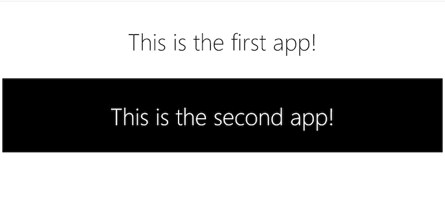

# 用讲台构建苗条的微前端

> 原文：<https://blog.logrocket.com/building-svelte-micro-frontends-podium/>

微前端是一个应用程序，是更大架构的一部分，而不是一个独立的应用程序。基本上，这是一个由更小的应用程序(或微前端)组成的复合应用程序，每个微前端可以由单独的团队拥有、开发和维护。

这种方法通常用于复杂的应用程序，如 Ikea 和 Upwork 的网站以及 Spotify 的桌面应用程序，这些应用程序往往会变得太大，变得太乱，难以维护。

在本教程中，我们将创建两个不同的基本苗条应用程序，并使用 Podium 将各个片段编译成一个应用程序，以了解微前端。

对于本教程，请确保您对 Svelte 和 Node.js 有基本的了解。

## 创建苗条的应用程序

为了[开始创建 Svelte 应用程序](https://blog.logrocket.com/how-to-build-a-simple-svelte-js-app/)，我们必须首先创建一个名为`svelte-app-one`的新文件夹，并在里面运行以下命令来克隆 Svelte 的 GitHub 模板:

```
npx degit sveltejs/template

```

要创建第二个应用程序，在另一个名为`svelte-app-two`的文件夹中重复相同的过程。

接下来，让我们对这些应用做一些小的改动。由于这两个应用程序将被合并，并且每个应用程序都有自己的`body`元素，我们必须通过向它们添加唯一的 id 来区分这两个 body 元素。

对于第一个应用程序，导航到`public/index.html`，在 body 标签中添加一个 div，并给它一个惟一的 ID:

```
<body>
        <div id="svelte-app-one"></div>
</body>

```

接下来，导航到文件夹的`src/main.js`文件，并确保`querySelector`函数指向您刚刚添加的 ID:

```
import App from './App.svelte';

const app = new App({
        target: document.querySelector( '#svelte-app-one' )
});

export default app;

```

对`public/index.html`中的第二个应用程序重复相同的过程:

```
<body>
        <div id="svelte-app-two"></div>
</body>

```

然后又在`src/main.js`:

```
import App from './App.svelte';

const app = new App({
        target: document.querySelector("#svelte-app-two")
});

export default app;

```

### 在苗条的应用程序中显示消息

在这两个应用程序中，我们将显示非常简单的信息，并继续[将它们与讲台](https://podium-lib.io/)结合在一起。对于 app one，导航到`App.svelte`，添加一个带有简单消息的标题标签，并赋予它一些样式:

```
<script>
</script>

<main>
        <h1>This is the first app!</h1>
</main>

<style>
        main {
                text-align: center;
                padding: 1em;
                max-width: 300px;
                margin: 0 auto;
                padding: 20px 5px;
        }
        h1 {
                color: #000;
                font-size: 5em;
                font-weight: 150;
        }
</style>

```

接下来，对第二个应用程序进行同样的操作:

```
<script>
</script>

<main>
        <h1>This is the second app!</h1>
</main>

<style>
        main {
                text-align: center;
                padding: 1em;
                max-width: 300px;
                margin: 0 auto;
                padding: 20px 5px;
                background-color: #000;
                color:#fff;
        }
        h1 {
                color: #fff;
                font-size: 5em;
                font-weight: 150;
        }
</style>

```

## 为讲台准备苗条的应用程序

为了让 Podium 将这两个应用程序结合在一起，它需要知道应用程序的 HTML、CSS 和 JavaScript 文件的位置。这可以通过一个`manifest.json`文件和[一个叫做 podlet](https://www.npmjs.com/package/@podium/podlet) 的工具来生成这个`manifest.json`文件来实现。

我们可以用下面的命令在`svelte-app-one`文件夹中安装 podlet 的包:

```
npm install express @podium/podlet

```

接下来，我们将使用 podlet 工具使两个应用程序的 CSS、JavaScript 和 HTML 文件对 Podium 可用。在`svelte-app-one`的根文件夹中，创建一个名为`podlet.js`的文件，并添加以下代码:

```
const express = require("express");
const Podlet = require("@podium/podlet");
const fs = require("fs");

const app = express();

const podlet = new Podlet({
  name: "svelte-app-one", 
  version: "0.1.0",
  pathname: "/", 
  manifest: "/manifest.json", 
  development: true, 
});

podlet.css({ value: "http://localhost:3100/css/global.css" });
app.use("/css", express.static("public/css/"));

let buildfiles = fs.readdirSync('public/build');
buildfiles.forEach((element, index) => {
  if(element.indexOf('.css') !== -1 && element.indexOf('.css.map') === -1){
    podlet.css({ value: "http://localhost:3100/build/" + element });
  }else if(element.indexOf('.js') !== -1 && element.indexOf('.js.map') === -1) {
    podlet.js({ value: "http://localhost:3100/build/" + element, defer: true });
  }
});
app.use("/build", express.static("public/build/"));

app.use(podlet.middleware());

app.get(podlet.content(), (req, res) => {
  res.status(200).podiumSend('<div id="svelte-app-one"></div>');
});

app.get(podlet.manifest(), (req, res) => {
  res.status(200).send(podlet);
});

app.listen(3100);

```

这里，我们首先导入 podlet 和文件系统包，并创建一个 podlet 实例，给它一个名称、版本和路径。我们还指定它将创建的清单文件。

接下来，我们将应用程序中的 JavaScript 和 CSS 文件添加到我们的 podlet 中(这些文件在我们的`public/build`文件夹中)，我们使用`readdirSync`函数访问`public/build`文件夹，并使用`foreach`语句遍历它。

使用一个`if`语句，我们指定每个具有`.css`扩展名的文件都应该使用`podlet.css`函数添加到 podlet 中。

然后，使用一个`else if`语句，我们指定每个具有`.js`扩展名的文件都应该使用`podlet.js`函数添加到 podlet 中。

对于生产，应将本地主机 URL 更改为托管文件的 URL。

接下来，我们可以使用`express.static`创建指向这些文件的静态链接，使这些文件公开可用。为了让我们的应用程序中的路由工作，为了让 podlet 正确运行，我们必须使用`middleware`函数安装中间件。

指定了 CSS 和 JavaScript 文件后，我们可以使用`podiumSend`函数将 podlet 指向我们的 HTML——我们之前在 body 标签中添加的 div。

现在我们的 podlet 知道了我们的 CSS、JavaScript 和 HTML 文件的位置，我们可以使用`manifest`函数为 Podium 创建一个`manifest.json`文件，并指定我们的应用程序应该服务的端口。

最后，我们将按照完全相同的过程为我们的第二个苗条应用程序创建一个 podlet。

```
const express = require("express");
const Podlet = require("@podium/podlet");
const fs = require("fs");

const app = express();

const podlet = new Podlet({
  name: "svelte-app-two", 
  version: "0.1.0",
  pathname: "/", 
  manifest: "/manifest.json", 
  development: true, 
});

podlet.css({ value: "http://localhost:3101/css/global.css" });
app.use("/css", express.static("public/css/"));

let buildfiles = fs.readdirSync('public/build');
buildfiles.forEach((element, index) => {
  if(element.indexOf('.css') !== -1 && element.indexOf('.css.map') === -1){
    podlet.css({ value: "http://localhost:3101/build/" + element });
  }else if(element.indexOf('.js') !== -1 && element.indexOf('.js.map') === -1) {
    podlet.js({ value: "http://localhost:3101/build/" + element, defer: true });
  }
});
app.use("/build", express.static("public/build/"));

app.use(podlet.middleware());

app.get(podlet.content(), (req, res) => {
  res.status(200).podiumSend('<div id="svelte-app-two"></div>');
});

app.get(podlet.manifest(), (req, res) => {
  res.status(200).send(podlet);
});

app.listen(3101);

```

## 使用 Podium 结合两个苗条的应用程序

要开始组合这两个[苗条应用](https://blog.logrocket.com/whats-new-svelte-summer-2021)，让我们首先创建一个名为`podium-merger`的文件夹，并在其中运行以下命令来创建一个`package.json`文件:

```
npm init

```

接下来，导航到该文件夹并创建一个名为`layout.js`的文件。在这个文件中，我们将评估我们之前创建的两个 podlet，获取这些 podlet 中指定的 HTML、CSS 和 JavaScript 文件，并将它们组合成一个应用程序。

在 Podium 中，我们可以按照我们希望的方式排列我们正在组合的应用程序。这种排列称为布局:

```
const express = require("express");
const app = express();

const Layout = require("@podium/layout");

const layout = new Layout({
  name: "podiumLayout",
  pathname: "/",
});

const svelteAppOne = layout.client.register({
  name: "svelte-app-one",
  uri: "http://localhost:3100/manifest.json",
});
const svelteAppTwo = layout.client.register({
  name: "svelte-app-two",
  uri: "http://localhost:3101/manifest.json",
});

app.use(layout.middleware());

app.get("/", async (req, res) => {
  const podiumLayout = res.locals.podium;

  const data = await Promise.all([
    svelteAppOne.fetch(podiumLayout),
    svelteAppTwo.fetch(podiumLayout),
  ]);

  podiumLayout.podlets = data;
  podiumLayout.view.title = "Composite App";

  res.podiumSend(`<div>
    ${data[0]}
    ${data[1]}
  </div>
  `);
});

app.listen(3000);

```

让我们分解代码:首先，我们导入`layout`包并创建它的一个实例，给它一个名称和一个路径。

接下来，我们使用`client.register`函数将我们的苗条应用程序注册到布局中。注意我们是如何将布局指向`manifest.json`文件的。这就是它如何找到要组合的 CSS、HTML 和 JavaScript 文件。

然后，我们从我们的布局包中安装`middleware`功能，以确保我们的应用程序中的所有路线都能正常工作。

接下来，我们指定当我们的应用程序的根 URL 被访问时，应该返回讲台布局。然后，我们使用`fetch`函数从两个应用程序中获取数据，并将数据保存在名为`data`的常量中，并使用`podiumLayout.podlets = data;`将数据绑定到我们的布局。

通过使用`podiumSend`函数，我们在 div 标签中指定应用程序的显示排列。请注意，`data[0]`是来自我们第一个应用的数据，`data[1]`是来自我们第二个应用的数据。

最后，我们指定为我们的应用提供服务的端口。

## 结论

这是我们最后的应用程序:



微前端帮助你用你的前端实现微服务为你的后端所做的事情，这给你一个在大型组织中简化开发过程的机会。

有了微前端，你可以让小团队独立开发特定的功能，从而消除进度上的阻力和瓶颈。

## 使用 [LogRocket](https://lp.logrocket.com/blg/signup) 消除传统错误报告的干扰

[](https://lp.logrocket.com/blg/signup)

[LogRocket](https://lp.logrocket.com/blg/signup) 是一个数字体验分析解决方案，它可以保护您免受数百个假阳性错误警报的影响，只针对几个真正重要的项目。LogRocket 会告诉您应用程序中实际影响用户的最具影响力的 bug 和 UX 问题。

然后，使用具有深层技术遥测的会话重放来确切地查看用户看到了什么以及是什么导致了问题，就像你在他们身后看一样。

LogRocket 自动聚合客户端错误、JS 异常、前端性能指标和用户交互。然后 LogRocket 使用机器学习来告诉你哪些问题正在影响大多数用户，并提供你需要修复它的上下文。

关注重要的 bug—[今天就试试 LogRocket】。](https://lp.logrocket.com/blg/signup-issue-free)