# 构建一个顺风 CSS 表格组件

> 原文：<https://blog.logrocket.com/building-tailwind-css-table-component/>

***编者按:**本帖更新于 2022 年 2 月 4 日，更新任何过时的信息，并添加了* *[添加顺风 CSS 表格边框](#adding-table-borders-tailwind-css)部分。*

Tailwind CSS 附带了一组默认的实用程序类，帮助开发人员在默认情况下以非常简单的方式构建好看的组件。

在本教程中，我们将通过创建一个表格组件并使用 Tailwind 设计一个更好的变体来了解使用 Tailwind CSS 构建组件是多么容易。我们将涵盖:

## 你如何用顺风制造一个组件？

我们将从构建一个样本卡组件开始，如下所示:

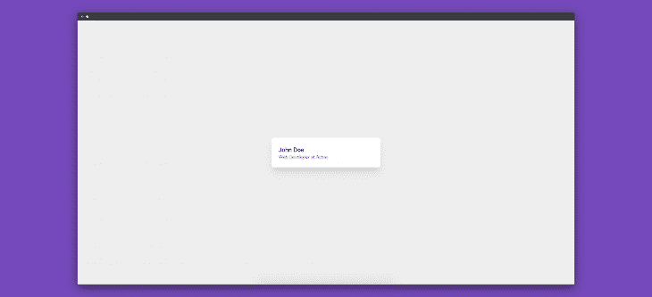

为了创建上面的卡片组件，我们需要下面的 HTML:

```
<div class="card">
  <div class="card-content">
    <h4 class="card-title">John Doe</h4>
    <p class="card-message">Web Developer at Acme</p>
  </div>
</div>
<style>
  .card {
    display: flex;
    width: 25%;
    margin: 0 auto;
    padding: 1.5rem;
    border-radius: 0.5rem;
    background-color: #fff;
    box-shadow: 0 20px 25px -5px rgba(0, 0, 0, 0.1),
      0 10px 10px -5px rgba(0, 0, 0, 0.04);
  }
  .card-content {
    padding-top: 0.25rem;
  }
  .card-title {
    color: #1a202c;
    font-size: 1.25rem;
    line-height: 1.25;
  }
  .card-message {
    color: #718096;
    font-size: 1rem;
    line-height: 1.5;
  }
</style>

```

使用 Tailwind 的上述 HTML 和 CSS 的等效代码如下:

```
<div class="w-1/4 mx-auto flex p-6 bg-white rounded-lg shadow-xl">
  <div class="pt-1">
    <h4 class="text-xl text-gray-900 leading-tight">John Doe</h4>
    <p class="text-base text-gray-600 leading-normal">
      Web Developer at Acme
    </p>
  </div>
</div>

```

正如我们在使用 Tailwind 时看到的，我们可以更快地创建组件，并使用更少的代码。

## 设置顺风 CSS

要开始制作我们的表组件，让我们首先创建我们的项目目录:

```
mkdir build-components-using-tailwind && cd build-components-using-tailwind

```

这将创建一个空的`build-components-using-tailwind`目录，并改变我们当前的工作目录。

接下来，让我们用 npm 初始化我们的项目:

```
npm init -y

```

这个命令在我们当前的工作目录中创建一个`package.json`文件:

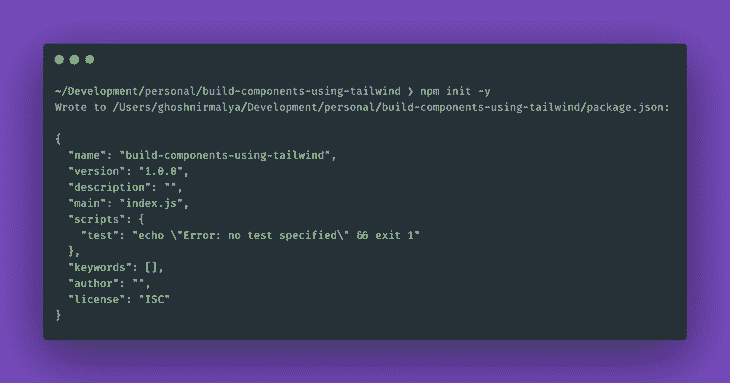

### 安装顺风 CSS

我们可以从 npm 安装顺风:

```
# Using npm
npm install tailwindcss

# Using Yarn
yarn add tailwindcss

```

这将`tailwindcss`添加到我们的依赖列表中。

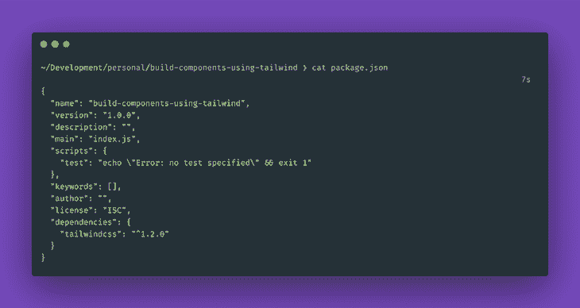

### 将顺风添加到我们的项目依赖项中

接下来，我们将创建一个包含一些默认内容的 HTML 文件:

```
// index.html

<!DOCTYPE html>
<html lang="en">
  <head>
    <meta charset="utf-8" />
    <meta
      name="viewport"
      content="width=device-width, initial-scale=1, shrink-to-fit=no"
    />
    <link rel="stylesheet" href="tailwind.css" />
    <title>Tailwind</title>
  </head>
  <body>
  </body>
</html>

```

我们还需要创建一个空的`styles.css`文件，以便稍后使用 Tailwind CLI 工具编译一个新的`tailwind.css`文件。

接下来，我们必须使用`@tailwind`指令将 Tailwind 的`base`、`components`和`utilities`样式注入 CSS:

```
// tailwind.css

@tailwind base;
@tailwind components;
@tailwind utilities;

```

如果我们想要[定制我们的顺风安装](https://tailwindcss.com/docs/configuration/)，我们也可以创建一个顺风配置文件:

```
npx tailwindcss init

```

上面的命令创建了一个最小的`tailwind.config.js`文件:

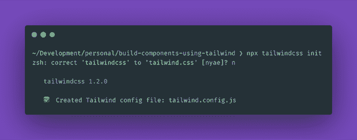

```
// tailwind.config.js

module.exports = {
  theme: {
    extend: {},
  },
  variants: {},
  plugins: [],
}

```

### 处理 CSS

接下来，让我们使用 Tailwind CLI 工具来处理我们的 CSS:

```
npx tailwindcss build styles.css -o tailwind.css

```

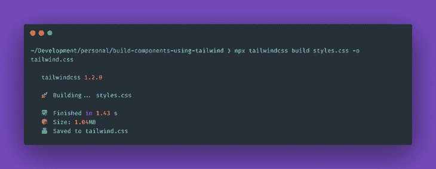

我们也可以使用 [PostCSS](https://blog.logrocket.com/getting-started-with-postcss-in-2019-484262a4d725/) 来配置我们的顺风装置。为此，请将必要的依赖项安装到项目中:

```
# Using npm
npm install postcss-cli --save-dev

# Using Yarn
yarn add postcss-cli -D

```

这将`postcss-cli`添加到我们的`devDependencies`中:

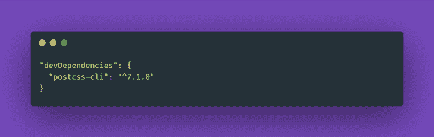

我们将只在开发期间编译我们的样式；在部署到产品时，我们将发布我们编译的样式。因此，我们只在开发期间需要`postcss-cli`。

我们还必须创建一个`postcss.config.js`文件来配置 PostCSS:

```
// postcss.config.js

module.exports = {
  plugins: [require("tailwindcss")]
};

```

接下来，我们需要在我们的`package.json`文件中添加一个脚本来编译我们的顺风风格:

```
// package.json

"scripts": {
  "tailwind:watch": "postcss styles.css -o tailwind.css"
},

```

这个脚本编译出现在`styles.css`文件中的样式，并生成一个新的`tailwind.css`文件。所以，让我们运行我们的脚本，用下面的命令生成一个`tailwind.css`文件:

```
yarn tailwind:watch

```

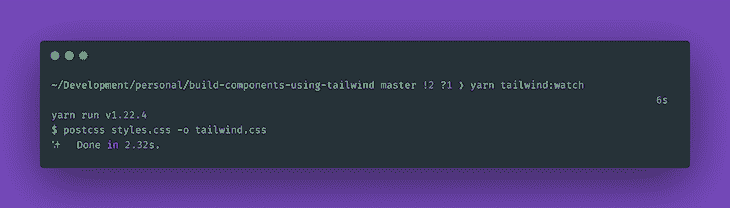

现在，让我们使用 Tailwind 构建我们的第一个组件。

## 如何在 Tailwind 中创建表格？

在这一节中，我们将使用 HTML 创建一个表格，并使用 Tailwind 实用程序类使它看起来更好。

因此，让我们用 HTML 编写一个表格组件:

```
// index.html

<table>
  <tr>
    <th>Company</th>
    <th>Contact</th>
    <th>Country</th>
  </tr>
  <tr>
    <td>Alfreds Futterkiste</td>
    <td>Dante Sparks</td>
    <td>Italy</td>
  </tr>
  <tr>
    <td>Centro comercial Moctezuma</td>
    <td>Neal Garrison</td>
    <td>Spain</td>
  </tr>
  <tr>
    <td>Ernst Handel</td>
    <td>Maggie O'Neill</td>
    <td>Austria</td>
  </tr>
</table>

```

上面的 HTML 创建了下面的基本表格组件:

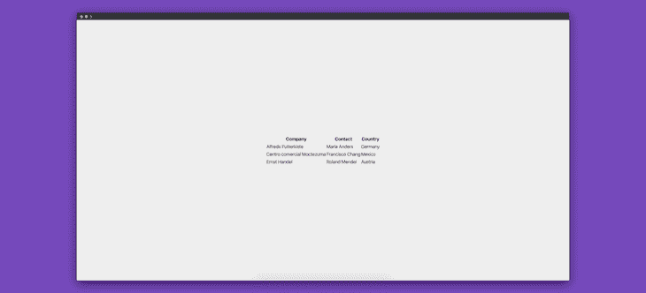

### 将 Tailwind 添加到我们的表组件中

现在，让我们添加一些顺风实用程序类来使我们的组件更好:

```
// index.html

<table class="shadow-lg bg-white">
  <tr>
    <th class="bg-blue-100 border text-left px-8 py-4">Company</th>
    <th class="bg-blue-100 border text-left px-8 py-4">Contact</th>
    <th class="bg-blue-100 border text-left px-8 py-4">Country</th>
  </tr>
  <tr>
    <td class="border px-8 py-4">Alfreds Futterkiste</td>
    <td class="border px-8 py-4">Dante Sparks</td>
    <td class="border px-8 py-4">Italy</td>
  </tr>
  <tr>
    <td class="border px-8 py-4">Centro comercial Moctezuma</td>
    <td class="border px-8 py-4">Neal Garrison</td>
    <td class="border px-8 py-4">Spain</td>
  </tr>
  <tr>
    <td class="border px-8 py-4">Ernst Handel</td>
    <td class="border px-8 py-4">Maggie O'Neill</td>
    <td class="border px-8 py-4">Austria</td>
  </tr>
</table>

```

将上述类添加到 HTML 后，我们的表组件如下所示:

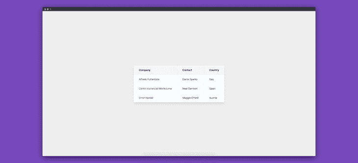

## 添加顺风 CSS 表格边框

### 用顺风 CSS 添加表格边框`border-separate`

目前，我们的表格组件让每个单元格共享一个公共边框。


这里，每个单元格从相邻的、顶部的或底部的单元格借用一些边界。例如，最右边的单元格与其兄弟单元格共享其左、上、下边框。

现在，我们可以强制表格中的每个单元格都有自己的边框。为此，我们使用了 Tailwind CSS 属性`border-separate`。

因此，让我们将`border-separate`添加到`table`元素中:

```
<table class="shadow-lg bg-white border-separate">
  <tr>
    <th class="bg-blue-100 border text-left px-8 py-4">Company</th>
    <th class="bg-blue-100 border text-left px-8 py-4">Contact</th>
    <th class="bg-blue-100 border text-left px-8 py-4">Country</th>
  </tr>
  <tr>
    <td class="border px-8 py-4">Alfreds Futterkiste</td>
    <td class="border px-8 py-4">Dante Sparks</td>
    <td class="border px-8 py-4">Italy</td>
  </tr>
  <tr>
    <td class="border px-8 py-4">Centro comercial Moctezuma</td>
    <td class="border px-8 py-4">Neal Garrison</td>
    <td class="border px-8 py-4">Spain</td>
  </tr>
  <tr>
    <td class="border px-8 py-4">Ernst Handel</td>
    <td class="border px-8 py-4">Maggie O'Neill</td>
    <td class="border px-8 py-4">Austria</td>
  </tr>
</table>

```

我们的表组件现在看起来像这样:

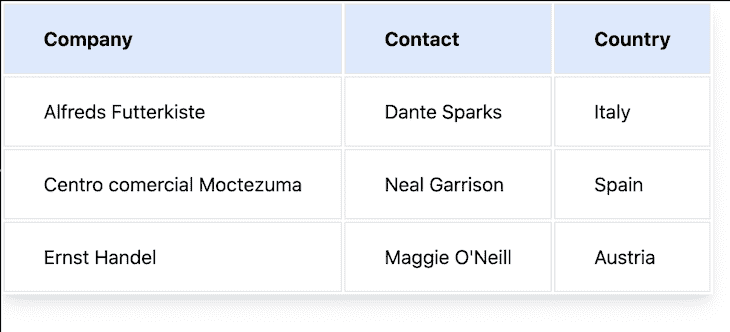

现在，每个单元格都有自己的边界。还要注意，添加了一些填充来描述分隔。

这个`border-separate`和 CSS 中的`border-collapse: separate`一样。

### 将`border-collapse`添加到 Tailwind CSS 中的表格组件

现在反过来，我们可以用`border-collapse`让表格组件的单元格与其相邻的单元格共享一个公共边界。

因此，让我们在顶层的`table`元素上添加`border-collapse`:

```
<table class="shadow-lg bg-white border-collapse">
  <tr>
    <th class="bg-blue-100 border text-left px-8 py-4">Company</th>
    <th class="bg-blue-100 border text-left px-8 py-4">Contact</th>
    <th class="bg-blue-100 border text-left px-8 py-4">Country</th>
  </tr>
  <tr>
    <td class="border px-8 py-4">Alfreds Futterkiste</td>
    <td class="border px-8 py-4">Dante Sparks</td>
    <td class="border px-8 py-4">Italy</td>
  </tr>
  <tr>
    <td class="border px-8 py-4">Centro comercial Moctezuma</td>
    <td class="border px-8 py-4">Neal Garrison</td>
    <td class="border px-8 py-4">Spain</td>
  </tr>
  <tr>
    <td class="border px-8 py-4">Ernst Handel</td>
    <td class="border px-8 py-4">Maggie O'Neill</td>
    <td class="border px-8 py-4">Austria</td>
  </tr>
</table>

```

我们的表组件现在看起来像这样:

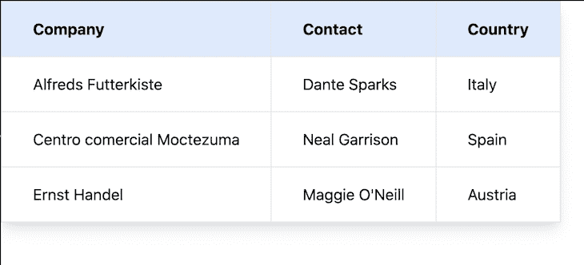

注意，在 Tailwind CSS 中使用`border-collapse`与在 CSS 中使用`border-collapse: collapse`属性是一样的。

## 结论

我们在这里构建的表格组件可以在 [GitHub](https://github.com/ghoshnirmalya/build-components-using-tailwind) 上获得。在 Tailwind 的帮助下，开发漂亮的组件变得非常容易，通过使用实用程序类，我们可以用非常少的代码行构建组件。

## 你的前端是否占用了用户的 CPU？

随着 web 前端变得越来越复杂，资源贪婪的特性对浏览器的要求越来越高。如果您对监控和跟踪生产环境中所有用户的客户端 CPU 使用、内存使用等感兴趣，

[try LogRocket](https://lp.logrocket.com/blg/css-signup)

.

[](https://lp.logrocket.com/blg/css-signup)[https://logrocket.com/signup/](https://lp.logrocket.com/blg/css-signup)

LogRocket 就像是网络和移动应用的 DVR，记录你的网络应用或网站上发生的一切。您可以汇总和报告关键的前端性能指标，重放用户会话和应用程序状态，记录网络请求，并自动显示所有错误，而不是猜测问题发生的原因。

现代化您调试 web 和移动应用的方式— [开始免费监控](https://lp.logrocket.com/blg/css-signup)。