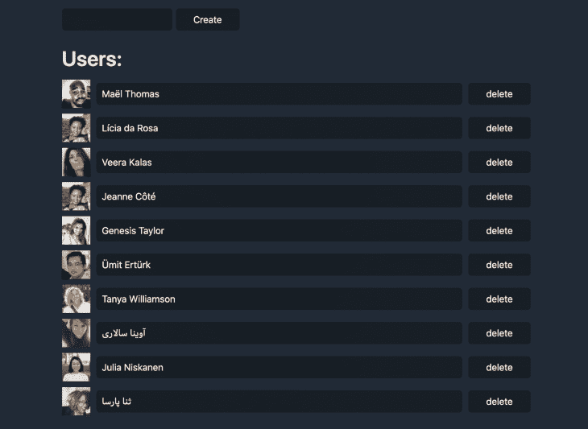

# 用实体管理构建最简单的 CRUD

> 原文：<https://blog.logrocket.com/building-the-simplest-crud-out-there-with-entity-management/>

在某种程度上，所有的应用程序都只是数据库的漂亮接口。试想一下——一条推文、一条 facebook 帖子、一条 instagram 评论——每一条都只是某处数据库中的一行。

## 一开始就有实体

对于作为前端开发人员的我来说，学习一点 SQL(用于数据库管理的语言)带来了一个小小的启示:所以这就是它的终点。每个用户的旅程从登录屏幕，通过搜索栏，流畅的动画，消除讨厌的弹出窗口，看广告，直到最终到达他们需要的信息。

最后就像这样一句台词:

`sql SELECT * FROM movies WHERE id='42';`
它说:“从名为`movies`的表中选择所有字段，其中名为`id`的字段的值为`42`”。

那么这整个努力的结果是什么呢？一部电影，一个用户，一本书，我们简单地称之为…一个实体。挺有哲理的吧？

根据字典的解释，实体是“一个具有独特和独立存在的事物”。而实体的管理，一般来说，叫做 CRUD。

## 那么，实际上什么是污垢呢？

CRUD 代表创建、读取、更新和删除。这是管理任何数据集合所需的一组基本操作。

让我们看看一组简单的 CRUD 函数是如何实现的。

数据将是一个数组，数组中的每一项都必须满足一个要求——一个惟一的 id。该数组可能如下所示:

```
const data = [
  {id: 1, name: 'Foo'},
  {id: 2, name: 'Bar'},
]
```

让我们先解决**创造**的问题。这很简单——它只是向数组(一个“表”)添加一个实体(在数据库语言中是一个“行”):

```
const createEntity = (entity, data) => [entity, ...data]
```

很好。接下来— **读取**给定 id 的单个实体:

```
const getEntity = (idToFind, data) => data.find(
  ({ id }) => id === idToFind
)
```

**更新**一件物品是所有物品中最复杂的:

```
const updateEntity = ({ id, changes }, data) => {
 const entity = getEntity(id, data)
 if (entity) {
   const dataCopy = data.slice() // in order to keep the original array intact
   const itemIndex = dataCopy.findIndex(({ id: _id }) => _id === id)
    dataCopy[itemIndex] = { ...dataCopy, ...changes }
   return dataCopy
  }
 return data
}
```

最后，**删除**:

```
const deleteEntity = (id, data) => data.filter(
  ({ id: _id }) => _id !== id
)
```

上面的函数可能看起来不自然——为什么移除动作是通过过滤完成的？这些例子遵循编程中的函数式风格——它们不改变原始数据数组，而是返回它的副本。这种方法不容易出错，而且更加模块化——每个功能都是独立的操作，不依赖于任何外部状态。

这组函数还可以，但是对于真实世界的使用来说还不完整。没有在一次操作中处理多个项目的功能。另外，一个类似于`updateEntity`的函数怎么样，如果没有找到实体，它会创建一个实体。

最后，在较大规模下，将数据存储为数组在性能上是次优的。这就好像你把所有的东西都放在没有标签的盒子里，在寻找东西的时候不得不(最多)打开所有的盒子。更简单的方法是标记盒子——这意味着使用一个关联数组，也就是一个对象。

当然，某处肯定有人已经编写了一个优化的函数式 CRUD 工具集？

## 见面`createEntityAdapter`

碰巧的是，在令人惊叹的 [redux-toolkit](https://redux-starter-kit.js.org/) 的最近[版本](https://github.com/reduxjs/redux-toolkit/releases/tag/v1.3.0)中，添加了一个新的 API，叫做`createEntityAdapter`。

这很好，因为在前端开发中，实体管理是一个需要重新发明轮子的领域。redux-toolkit 通过这个新 API 带来的简化就像一股新鲜空气。

如果重复编写 CRUD 代码的经历与你无关，那么一个没有它的未来值得从 NPM 安装。

### 项目概述

每个开发人员都知道，学习的最好方法是构建一些东西。

这里的项目将非常简单，但它将代表大多数 web 应用程序的核心。

结果将看起来像一个漂亮而相当复杂的 web 应用程序，它在上班的路上遇到了一个喷砂工，但掉进了一个淡水池，所以看起来不太可怕(你会明白我的意思)。

最基本的，纯粹的商业逻辑，野兽派的学习材料。或者在某些情况下我们称之为公司内部工具。

它看起来是这样的:



它显示用户列表(读取)，允许创建新用户，以及删除和更新样本。

### 让我们开始吧

下面假设对 Redux 和 React 有基本的熟悉。如果前者对你来说是全新的，也许值得阅读官方文件的这一部分。我将链接到 Github 上的具体提交，但如果你不喜欢克隆 git 库，最相关的部分将在本帖中转载。

这里是储存库。要快速开始，只需克隆它，安装我们在这个短暂的旅程中需要的所有东西，并启动服务器:

```
$ git clone [email protected]:adekbadek/crude.git
$ cd crude
$ npm install
$ npm start
```

这组法术完成后，你应该可以在 [http://localhost:1234](http://localhost:1234) 惊叹这个站点了。

我们将在这里逐个提交，所以这个列表就像一个目录表。

### 关于设置的说明

除了我们显而易见的朋友 Redux & React， [parcel](https://parceljs.org/) 用于捆绑代码，而 [water](https://watercss.kognise.dev/) 则是为了让我们在看一个没有风格的网站时不会掉出眼睛。

所有这些 boiler-platey 代码都添加到[这个 commit](https://github.com/adekbadek/crude/commit/f176ba64dcceddf4a41b31b1244a5c6959f5b06a) 中。

### 创造

现在到了重要的部分，这是在[这里](https://github.com/adekbadek/crude/commit/7d9d46c94c26169d30ed06671f4ae3fdc4aeeba1)。 [store.js 文件](https://github.com/adekbadek/crude/commit/7d9d46c94c26169d30ed06671f4ae3fdc4aeeba1#diff-3bf35cd41da51153dcca3003656f7c67)超级小，因为所有繁重的工作都外包给了`@reduxjs/toolkit`——开发人员需要做的就是理解和复制粘贴技能:

```
const usersAdapter = createEntityAdapter()
```

注意`createEntityAdapter`不需要任何参数。

它甚至不关心实体是如何命名的。

* * *

### 更多来自 LogRocket 的精彩文章:

* * *

调用这个函数的结果是[一个 CRUD 函数](https://redux-starter-kit.js.org/api/createEntityAdapter#crud-functions)的工具带，其中有超过四个——尽管在这个应用程序中只使用最基本的。

```
const usersSlice = createSlice({
  name: 'users',
  initialState: usersAdapter.getInitialState(),
  reducers: {
    usersAddOne: usersAdapter.addOne,
    usersAddMany: usersAdapter.addMany,
    userUpdate: usersAdapter.updateOne,
    userRemove: usersAdapter.removeOne,
  },
})
```

对`createSlice`的调用增加了一点复杂性，与实体没有直接关系。这是因为`createEntityAdapter`返回多个“case reducers”，它们是单动作处理的 reducer。

在 redux 的经典形式中，通常只有一个缩减器，一个 switch 语句处理多种情况。redux 基于切片的风格可以说比传统风格简单一点，更类似于编程中的函数式范式。

为了创建一个用户，必须分派`usersAddOne`动作:

```
dispatch(
  actions.usersAddOne({
    id: String(Math.random()),
    name: newUserName,
  })
)
```

如您所见，分配了一个随机 id。

只要数据存储在本地(而不是发送到服务器)，这是可以的。本文的最后一节描述了拥有服务器的意义，以及为现实世界的应用程序编写 CRUD 的意义。

### 阅读

读取数据通常被称为选择数据—还记得本文开头的 SQL 片段吗？

实体适配器有一个名为`getSelectors`的方法，它有一个可选的参数——一个将它指向状态的特定部分的函数。在我们的例子中，状态看起来像这样:

```
{
  users: {ids: [], entities: {}}
}
```

在用户切片的位置提示选择器获取逻辑非常简单。然后:

```
const selectors = usersAdapter.getSelectors(state => state.users)
```

`getSelectors`方法返回[五个选择符](https://redux-starter-kit.js.org/api/createEntityAdapter#selector-functions)，其中最重要的是`selectAll`和`selectById`，这一点不言自明。

我们的应用程序只会利用前者。剩下的三个是`selectEntities`、`selectTotal`、`selectIds`，都是蛮不言自明的。

### 更新

更新实体与创建实体非常相似。事实上如此相似，以至于有一个词代表“如果不存在就更新或插入”——up sert。理论上，你可以在一生中不创建实体，而只是增加它们。但这是一个少一点简洁就多一点清晰的例子。当您阅读创建实体的代码时，您知道该实体被认为是新的，这可能意味着很多。如果到处都有向上插入，就很难在代码中分辨出实体的旅程，好的代码是可读的代码。

在我们的应用中，我们将只通过`updateOne`函数处理单个用户([在这里看一下](https://github.com/adekbadek/crude/commit/1b50561257feff73ae96483a634b244d52d5a2a1))上的单个字段的**更新**，该函数已经映射到`userUpdate` case reducer:

```
dispatch(
  actions.userUpdate({
    id: user.id,
    changes: { name: newName },
  }),
)

```

注意动作负载的特殊形状:`{id, changes}`。

嘿，但是如果实体 A 的 id 是实体 B 变化的一部分呢？在这种奇怪的情况下，仍然会有两个实体，但是 A 的属性将被 B 的替换。请记住，`updateOne`执行浅层更新，这意味着实体的任何嵌套属性都必须完整传递。这可以在创建特殊的 case reducers 时解决——记住，您不必使用 1:1 的 CRUD 函数。

还有空间用于一些额外的逻辑，例如在某些情况下阻止更新:

```
reducers: {
  updateUser(state, action) {
    if (!state.isDisabled) {
      usersAdapter.updateOne(state, action.payload)
    }
  }
}
```

## 删除

其中最简单的操作。只有一句台词:

```
dispatch(actions.userRemove(user.id))
```

在这个简单的应用程序中，我们不关心删除用户可能带来的任何事情——但是在实体之间存在关系的大型应用程序中，事情就更复杂了。例如，在博客应用程序中删除用户时，他们的帖子会发生什么变化？和其他用户共同创建的帖子呢？

### 少了什么？

显然，这篇文章的主题是从与数据库的通信开始的！到目前为止，所有显示的代码都处理只存储在浏览器内存中的数据更新。请注意，这完全没问题——无论是出于隐私还是简单的原因。

## 乐观的更新

然而，大多数 web 应用程序遵循客户机-服务器模型，其中客户机(在本例中是浏览器)将数据与存储在服务器上的数据库同步。当用户更新数据时，应用程序向服务器发送一个更新数据的请求。

这种流程的一个含义是，在更新操作(例如单击按钮)和在屏幕上呈现更新的数据之间通常有一个滞后。一种流行的方法是在这个延迟期间禁用 UI，但是在这个时代，互联网用户期望即时反馈。

由于这个原因，许多应用程序实现了乐观更新策略，这正是我们在这个示例应用程序中所做的——假设我们知道数据在更新后的样子。

让我们立即呈现更新的数据。然后，在服务器的响应返回后，我们处理任何错误和差异。

## 结论

我希望这篇文章解释了实体的概念和它们在 web 开发中的管理，并且 CRUD 的缩写现在已经很清楚了。

谢谢！

## [LogRocket](https://lp.logrocket.com/blg/react-signup-general) :全面了解您的生产 React 应用

调试 React 应用程序可能很困难，尤其是当用户遇到难以重现的问题时。如果您对监视和跟踪 Redux 状态、自动显示 JavaScript 错误以及跟踪缓慢的网络请求和组件加载时间感兴趣，

[try LogRocket](https://lp.logrocket.com/blg/react-signup-general)

.

[ ](https://lp.logrocket.com/blg/react-signup-general) [](https://lp.logrocket.com/blg/react-signup-general) 

LogRocket 结合了会话回放、产品分析和错误跟踪，使软件团队能够创建理想的 web 和移动产品体验。这对你来说意味着什么？

LogRocket 不是猜测错误发生的原因，也不是要求用户提供截图和日志转储，而是让您回放问题，就像它们发生在您自己的浏览器中一样，以快速了解哪里出错了。

不再有嘈杂的警报。智能错误跟踪允许您对问题进行分类，然后从中学习。获得有影响的用户问题的通知，而不是误报。警报越少，有用的信号越多。

LogRocket Redux 中间件包为您的用户会话增加了一层额外的可见性。LogRocket 记录 Redux 存储中的所有操作和状态。

现代化您调试 React 应用的方式— [开始免费监控](https://lp.logrocket.com/blg/react-signup-general)。