# 用新的输入系统构建第三人称控制器

> 原文：<https://blog.logrocket.com/building-third-person-controller-unity-new-input-system/>

如果你随机挑选几个游戏，每个游戏可能都有不同的艺术风格和机制，不同的故事，甚至根本没有故事，但有一点它们都有共同点:所有游戏都需要读取和处理来自键盘、鼠标、游戏手柄、操纵杆、VR 控制器等设备的输入。

在这篇文章中，我将向你展示如何在 Unity 中使用新的[输入系统](https://docs.unity3d.com/Packages/com.unity.inputsystem@1.4/manual/QuickStartGuide.html)包以及由 [Cinemachine](https://docs.unity3d.com/Packages/com.unity.cinemachine@2.3/manual/CinemachineOverview.html) 驱动的跟随相机构建第三人称控制器，这是 Unity Technologies 的另一个强大的包。

我们的第三人称控制器将处理来自键盘和鼠标以及标准游戏手柄的输入，因为 Unity 中的新输入系统非常智能，正如你很快就会看到的那样，添加对另一种输入设备的支持不需要任何额外的代码。

除此之外，您将看到如何设置空闲、奔跑、跳跃和坠落动画，以及如何在它们之间平滑过渡。我们将把控制器的核心实现为一个状态机，重点关注干净的架构和可扩展性。

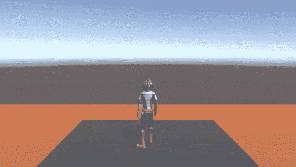

如果你以前从未听说过状态机或[状态](https://gameprogrammingpatterns.com/state.html)设计模式，不用担心，我会一步一步地解释一切。然而，我假设你对 C#和 OOP 概念有基本的理解，比如[继承](https://docs.microsoft.com/en-us/dotnet/csharp/fundamentals/object-oriented/inheritance)和[抽象](https://docs.microsoft.com/en-us/dotnet/csharp/language-reference/keywords/abstract)类。

在这篇文章结束时，你将能够很容易地用你自己的状态扩展我们的控制器，并且你将有一个在许多不同的上下文中有用的设计模式。

说到设计模式，除了状态模式，我们还将使用另一种模式，在游戏开发中非常常见，如果不是最常见的话:观察者模式。

## 新旧 Unity 输入系统的对比

在我们开始构建我们的播放器控制器之前，让我们简单谈谈新旧 Unity 输入系统的区别。我不会重复您在文档中可以读到的内容，而是强调主要的区别。

如果你以前用过 Unity，你可能已经知道如何使用旧的输入系统。当您希望某些代码仅在按下给定的键时才在每一帧执行时，您可以这样做:

```
void Update()
{
  if (Input.GetKeyDown(KeyCode.Space)) 
  { 
    // Code executed every frame when Space is pressed
  }
}

```

您可以通过将键和轴与**项目设置** > **输入管理器**中的名称绑定，然后编写您的脚本，这样会好一点:

```
{ 
  if (Input.GetKeyDown("Jump")) 
  { 
    // Code executed every frame when key bound to "Jump" is pressed
  }
}

```

当你想从坐标轴上读取数值时，你可以这样做:

```
void Update()
{
  float verticalAxis = Input.GetAxis("Vertical");
  float horizontalAxis = Input.GetAxis("Horizontal");

  // Do something with the values here
}

```

很简单，对吧？新的输入系统稍微复杂一点，但是带来了很多好处。我想在本教程结束时，你会完全理解它们。现在，我仅举几个例子:

*   基于事件的 API 取代了`Update`方法中的状态轮询，这带来了更好的性能
*   添加对新输入设备的支持不需要额外的编码，这很棒，尤其是对于跨平台游戏
*   新的输入系统带有一套强大的调试工具

新输入系统的要点在于在输入设备和动作以及基于事件的 API 之间增加了一个抽象层。您创建一个**输入动作**资产，它通过编辑器中的 UI 将输入与动作绑定在一起，并让 Unity 为您生成 API。

然后编写一个简单的类，实现`IPlayerActions`来为玩家控制器提供输入事件和值，这正是我们在这篇博文中要做的。

## 创建新的 Unity 项目

如果你想跟进，我鼓励你这样做，我推荐使用 [Unity 2021.3.6f1](https://unity3d.com/unity/qa/lts-releases) 。创建一个新的空 3D 项目，首先，进入**窗口** > **包管理器**。从**软件包**下拉列表中选择 **Unity Registry** ，在搜索字段中键入`Cinemachine`，选择软件包，然后点击**安装**。然后对`InputSystem`包做同样的操作。

安装`InputSystem`时，Unity 会提示你重启。之后，返回**包管理器**窗口，选择**包:在项目**中，确认两个包都已安装。

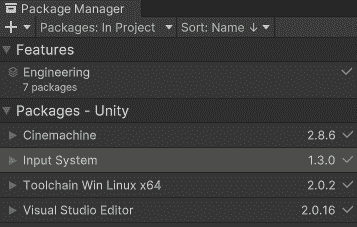

您也可以删除其他包，除了 IDE 的代码集成支持。在我的例子中，它是 Visual Studio 编辑器包。

## 设置输入系统

要设置新的 Unity 输入系统，我们首先需要将输入绑定到动作。为此，我们需要一个`.inputactions`资产。让我们通过在**项目**选项卡中右击并选择**创建** > **输入动作来添加一个。**

将其命名为`Controls.inputactions`，并通过双击这个新资产打开绑定输入的窗口。

在右上角点击**所有控制方案**，在弹出的菜单中选择**添加控制方案…** ，将新方案命名为`Keyboard and Mouse`，通过空列表底部的加号添加**键盘**，然后添加**鼠标**输入设备。

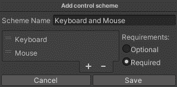

重复上一段的过程，但这次将新方案命名为**游戏手柄**，并将**游戏手柄**添加到输入设备列表中。另外，从两个需求选项中选择**可选**。

回到**控件(输入动作)**窗口，点击最左边标有**动作的列，将**映射到一个加号，并将新添加的记录命名为`Player`。中间一栏是我们现在将输入与动作绑定的地方。

已经添加了一个动作，标记为`New Action`。右键单击该动作，将其重命名为`Jump`，然后用小三角形图标展开，选择绑定`<No Binding>`，在右栏的**绑定属性**中，单击**路径**旁边的下拉图标。

你可以在**键盘**部分找到**空格**，或者点击**收听**按钮，然后简单地按下键盘上的空格键。回到绑定属性，在**路径**下，勾选**下的**键盘鼠标**用于控制方案**。请注意，这些是我们之前添加的方案。

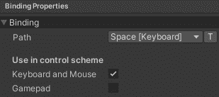

空间现在被分配给了跳跃动作，但是我们也想要游戏手柄的另一个绑定。在**动作**栏中，点击加号。选择**添加绑定**，在**路径**，从**游戏手柄**部分设置**按钮南**。这次，在**使用控制方案**下，勾选**游戏手柄**。

让我们添加另一个动作，这次是为了移动。使用**动作**标签旁边的加号，添加新动作并将其命名为`Move`。保持`Move`动作被选中，在右栏中，将**动作类型**改为**值**，将**控制类型**改为**矢量 2** 。

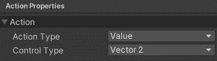

已经添加了第一个绑定槽，默认标记为`<No Binding>`。让我们把它用在游戏手柄上，因为对于键盘，我们要添加一种不同类型的动作。在**路径中，**从**游戏手柄**部分找到并分配**左摇杆**。

现在，使用**移动**动作旁边的加号，添加一个新的绑定，但是这次选择**添加上/下/左/右复合**。您可以将新绑定的名称保存为一个 **2D 向量**，重要的是为每个组件分配一个键。

将 **W** 、 **S** 、 **A** 和 **D** 分别指定为上、下、左、右，或者箭头键，如果你喜欢的话。不要忘记在控制方案中的**使用下勾选**键盘**和**鼠标**。**

我们需要添加的最后一个动作是旋转摄像机，以便环顾四周。我们把这个动作命名为`Look`。对于该动作，也将**动作类型**设置为**值**，将**控制类型**设置为**向量**。对于**键盘和鼠标**控制方案，从**鼠标**部分绑定**增量**，这是鼠标从前一帧到当前帧的 X 和 Y 位置的变化量，对于**游戏手柄**方案，绑定**右摇杆**。

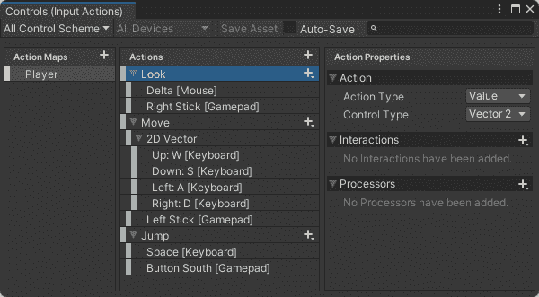

我们现在有了键盘和鼠标以及游戏手柄设置的所有输入绑定。在**控件(输入动作)**窗口中我们需要做的最后一件事是点击**保存资产**按钮。

注意，当我们保存资产时，Unity 在`Assets`文件夹中为我们生成了一个`Controls.cs`文件，就在`Controls.inputactions`旁边。在构建我们的`InputReader`类时，我们将需要在这个文件中生成的代码，这将在下一节中进行。

## 构建一个`InputReader`类

到目前为止，我们只在 Unity 编辑器中工作。现在是时候写一些代码了。在您的资产中创建一个新的 C#脚本，并将其命名为`InputReader`。`InputReader`类应该从`MonoBehavior`继承，因为我们将把它作为一个组件附加到我们的`Player`游戏对象上，稍后我们会有一个。

除此之外，`InputReader`将实现`Controls.IPlayerActions`接口。这个界面是 Unity 为我们生成的，当时我们在上一节的末尾保存了`Controls.inputactions`资产。

因为我们创建了 **Look** 、 **Move** 和 **Jump** 动作，所以该接口用类型为`InputAction.CallbackContext`的`context`参数定义了`OnLook`、`OnMove`和`OnJump`方法。

你还记得我写过新的 Unity 输入系统是基于事件的吗？这就是了。我们在我们的`InputReader`类中定义了一个类型为`Vector2`的成员`MoveComposite`，并像这样实现`OnMove`:

```
public void OnMove(InputAction.CallbackContext context)
{
  MoveComposite = context.ReadValue<Vector2>();
}

```

每当我们为移动动作绑定的输入(W、S、A、D 键和游戏手柄上的右键)被注册时，这个`OnMove`就被调用。从生成的代码中的一个事件和传递的`context`参数中，我们读取输入值。

例如，当按下 W 键时，分配给我们的`MoveComposite`的`context`值在 x 轴上为 0，在 y 轴上为 1。当我们同时按下 W 和 A 时，x 轴上的值为-1，y 轴上的值为 1，当我们松开键时，两个轴上的值都为 0。

`OnLook`将以同样的方式实现，类似的还有`OnJump`方法，稍有不同的是，我们不是赋值，而是在`InputReader`本身中引发一个事件:

```
public void OnJump(InputAction.CallbackContext context)
{
  if (!context.performed)
    return;

  OnJumpPerformed?.Invoke();
}

```

请注意，如果`context.performed`是`false`，我们会提前从函数中返回。如果没有这个，`OnJumpPerformed`事件将被调用两次:一次是当我们按下空格键时，另一次是当我们放开它时。我们不想在释放空格键后再次跳跃。

我们还使用了一个[空条件操作符](https://docs.microsoft.com/en-us/dotnet/csharp/language-reference/operators/member-access-operators#null-conditional-operators--and-) ( `?.`)来跳过`invoke`，当`OnJumpPerformed`事件上没有注册处理程序时。在这种情况下，对象是`null`。如果您喜欢在`OnJumpPerformed`上没有注册处理程序时抛出异常，那么删除操作符，只留下`OnJumpPerformed.Invoke();`

以下是`InputReader.cs`文件的完整代码:

```
using System;
using UnityEngine;
using UnityEngine.InputSystem;

public class InputReader : MonoBehaviour, Controls.IPlayerActions
{
    public Vector2 MouseDelta;
    public Vector2 MoveComposite;

    public Action OnJumpPerformed;

    private Controls controls;

    private void OnEnable()
    {
        if (controls != null)
            return;

        controls = new Controls();
        controls.Player.SetCallbacks(this);
        controls.Player.Enable();
    }

    public void OnDisable()
    {
        controls.Player.Disable();
    }

    public void OnLook(InputAction.CallbackContext context)
    {
        MouseDelta = context.ReadValue<Vector2>();
    }

    public void OnMove(InputAction.CallbackContext context)
    {
        MoveComposite = context.ReadValue<Vector2>();
    }

    public void OnJump(InputAction.CallbackContext context)
    {
        if (!context.performed)
            return;

        OnJumpPerformed?.Invoke();
    }
}

```

`OnEnable`和`OnDisable`方法分别在一个附加了脚本作为组件的游戏对象被启用和禁用时被调用。当我们运行游戏时，`OnEnable`会在`Awake`之后被调用一次。更多信息，请参见 Unity 文档中事件功能的[执行顺序。](https://docs.unity3d.com/Manual/ExecutionOrder.html)

这里重要的是创建一个`Control`类的实例，它是 Unity 基于`Control.inputactions`资产和`Player`动作图生成的。注意名称是如何匹配的，以及我们如何将`this` ( `InputReader`)的实例传递给`SetCallbacks`方法。还要注意当我们`Enable`和`Disable`行动时的地图。

## 设置一个`Player`

对于我们的`Player`游戏对象，我们需要一个装配有空闲、奔跑、跳跃和跌倒动画的人形模型。下载这个[宇航服. fbx](https://github.com/marianpekar/unity-third-person-controller/blob/master/Assets/Models/Spacesuit.fbx) 由[四元数](https://www.quaternius.com)制作的模式以及所有[动画(。anim 文件)从这里](https://github.com/marianpekar/unity-third-person-controller/tree/master/Assets/Animations)。

将`.fbx`和所有`.anim`文件移动到项目中**资产**文件夹内的某个地方。然后，将 **Spacesuit.fbx** 拖放到你的场景中，并将**层次**选项卡中的`Spacesuit`游戏对象重命名为`Player`。

保持`Player`游戏对象被选中，在**检查器**标签中，添加`Character Controller`、`Animator`和我们的`InputReader`作为组件。

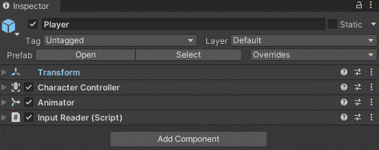

在我们进入下一部分之前，右键单击**层次**选项卡，并从上下文菜单中添加 **3D 对象** > **立方体**。移动这个立方体到玩家下面，改变它的比例来创造一些地面。如果你愿意，你也可以添加更多的立方体，并从它们建立几个平台。

### 设置`Character Controller`

正如在 [Unity 文档](https://docs.unity3d.com/ScriptReference/CharacterController.html)中所述，一个`Character Controller`组件允许我们做受碰撞约束的运动，而不必处理刚体。这意味着我们需要设置它的碰撞器，它在**场景**标签中显示为一个绿色线框胶囊。

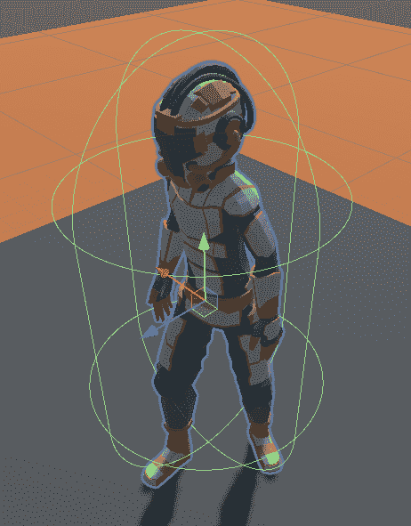

对于这个特殊的角色模型，碰撞器位置和形状的合适值是`Center X: 0, Y: 1, Z: 0.12`、`Radius 0.5`和`Height 1.87`。您可以保留其他属性的默认值。

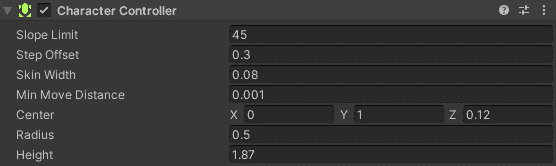

现在右击**层级**中的`Player`，并选择**创建空**；这将创建一个空的游戏对象，只有一个`Transform`组件作为`Player`的子对象。将其重命名为`CameraLookAtPoint`，并在**检查器**中将其`Y-position`设置为`1.5`。在下一节中，您将看到我们为什么这样做。


### 设置 Cinemachine

Cinemachine 是一个非常强大的 Unity 软件包。它允许你创建一个自由外观的跟随相机，具有高级功能，如完全在编辑器 UI 中避免障碍，无需任何编码。这正是我们现在要做的！

在**层级**选项卡中点击右键，添加**cinema Chine**>**free look Camera**。添加到我们场景中的`CMFreeLook`对象不是摄像机本身，而是`Main Camera`的驱动程序。在运行时，它设置主摄像机的位置和旋转。

当`CMFreeLook`对象被选中时，从**层次结构**选项卡拖放到**检查器**选项卡，在`CinemachineFreeLook`组件下，我们的`Player`到`Follow`属性及其子对象`CameraLookAtPoint`到`Look At`。

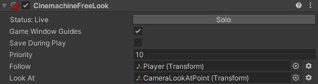

现在向下滚动并设置顶部、中部和底部摄影机装配的值。将`TopRig` `Height`设置为`4.5`，将`Radius`设置为`5`，将`MiddleRig`设置为`2.5`和`6`，将`BottomRig`设置为`0.5`和`5`。

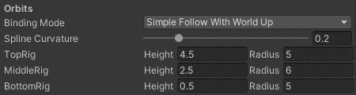

注意在`Scene`视图中，当`CMFreeLook`被选中时，我们的玩家周围有三个红色的圆圈用一条样条线垂直连接。这些圆圈是顶部，中部和底部钻机。

垂直样条线是相机的虚拟轨道，当我们垂直移动鼠标时，它将上下滑动，当水平移动鼠标时，整个样条线将围绕这些圆旋转。

借助新的输入系统，将这些鼠标输入与相机连接起来变得超级简单。你所需要做的就是将`Cinamechine Input Provider`组件添加到`CMFreeLook`对象中，并将`Control.inputactions`资产中的`Player/Look (Input Action Reference)`分配给`XY Axis`属性。

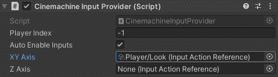

要完成 Cinemachine 的设置，将最后一个组件添加到`CMFreeLook`:即`Cinemachine Collider`。这将使相机避免障碍，而不是剪辑通过。您可以保持它的所有值不变。

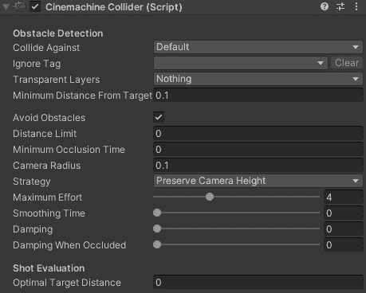

这是我们用 Cinemachine 安装的播放器摄像头，完全没有编码。如果你现在玩这个游戏，你应该能够使用鼠标或游戏手柄上的左摇杆围绕玩家旋转相机。

然而，这真的只是冰山一角。Unity Technologies 的聪明人在这个包上投入了大量时间，你可以在 Unity 网站上的 [Cinemachine 部分了解更多信息。](https://unity.com/unity/features/editor/art-and-design/cinemachine)

### 设置动画制作人

在下一节从头开始构建自定义状态机之前，我们需要做的最后一件事是设置一个动画制作程序。

在**动画师**中，我们将为空闲和移动动画之间的平滑过渡创建一个混合树，并为跳跃和坠落添加两个独立的动画。

如果你以前在 Unity 中使用过 Animator，你可能知道这个 Animator 也是一个状态机，但是你可能会惊讶于我们没有在混合树和动画之间添加任何过渡。这是一种有效的方法，因为稍后我们将在自己的状态机中启动这些动画之间的转换。

首先，我们需要创建一个[动画师控制器](https://docs.unity3d.com/Manual/class-AnimatorController.html)资产。在项目选项卡中点击右键，选择**cinema Chine**>**Animator Controller**。将这个新资产命名为`PlayerAnimator`。

现在，在**层级**选项卡中选择我们的`Player`游戏对象，并在**检查器**中，将该资产拖动到**动画师**组件的**控制器**插槽中。

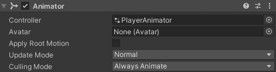

现在，在菜单栏中进入**窗口** > **动画** > **动画师**。如果你还没有下载动画文件(`.anim`)，现在[下载](https://github.com/marianpekar/unity-third-person-controller/tree/master/Assets/Animations)。

让我们首先为空闲和移动动画之间的过渡创建一个混合树。在 **Animator** 窗口的网格空间内右击，选择**创建状态→从新混合树**。

这是我们的第一个状态，Unity 自动用橙色标记为默认状态。当我们运行游戏时，动画师立即将当前状态设置为这个。它也显示在 UI 中，橙色箭头从入口指向我们的混合树状态。

选择混合树状态，并在**检查器**选项卡中，将其重命名为`MoveBlendTree`。注意不要出现任何拼写错误，并将其命名为您在此处看到的名称，一个好主意是从这里复制并粘贴该名称，因为稍后我们将通过该名称在代码中引用它。

在**动画师**窗口的左侧面板，从图层切换到**参数**选项卡，点击加号，选择 **float** 作为参数类型，将新参数命名为`MoveSpeed`。同样，确保名称正确，原因与混合树的名称相同。

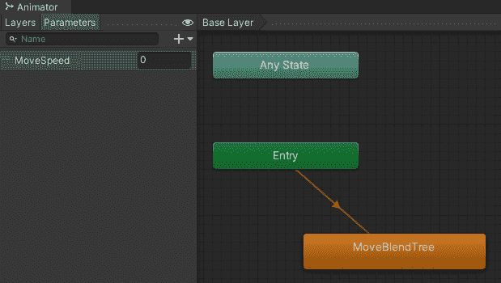

现在双击`MoveBlendTree`，打开另一层。然后选择标记为**混合树**的灰色框(它也应该有一个标记为`MoveSpeed`的滑块和一个带有`0`的输入框)，并在**检查器**中点击空运动列表下的小加号，然后点击**添加运动场**。

再做一次以获得另一个槽，然后从下载的动画(`.anim`文件)中拖放**空闲的**到第一个槽中，**运行的**到第二个槽中。


混合树就是将更多的动画组合成一个最终的动画。这里我们有两个动画和一个参数`MoveSpeed`。当`MoveSpeed`为`0`时，最终动画全部闲置不运行。当`MoveSpeed`是`1`时，那么它将完全相反。而有了`0.5`的值，最终的动画将是两者的结合，50%的空闲和 50%的运行。

想象你站着不动，然后你需要跑向某个地方。你需要做一个特定的动作来从静止过渡到跑步，对吗？这正是我们在下一节设置代码中的`MoveSpeed`值时要使用的混合树。


目前，我们几乎完成了动画。我们只需要添加跳跃和坠落的独立动画。这就简单多了——从 **MoveBlendTree** 返回到**基础层**，只需将**跳转**和**下降**动画拖放到 Animator 窗口上。

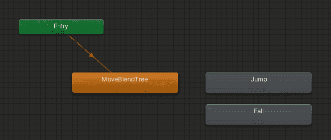

我故意把跳跃动画做得太慢，这样你就可以看到如何调整 Unity 中任何动画的速度。点击 Animator 窗口中的**跳转**动画，在检查器中，将`Speed`属性的值从`1`更改为`2`。动画的播放速度将会加快一倍。

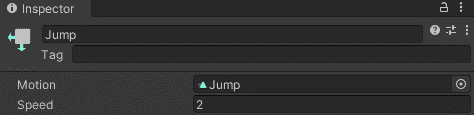

## 构建一个状态机

到目前为止，我们大部分时间都在 Unity 编辑器中度过。本教程的最后一部分是关于编码的。正如我在开头所写的，我们将使用一种叫做状态模式的东西，它与状态机密切相关。

首先，我们将编写一个纯抽象的 `State`类(一个只有抽象方法，没有实现和数据的类)。从这个类中，我们继承了一个抽象的`PlayerBaseState`类，并提供了在具体状态中有用的逻辑的具体方法，这些方法将从这个类中继承。

这些将是我们的状态:`PlayerMoveState`、`PlayerJumpState`和`PlayerFallState`。它们每个都将不同地实现`Enter`、`Tick`和`Exit`方法。

所有的类、它们之间的关系、它们的成员和方法都在下面的 UML 类图中进行了说明。像`CrossFadeDuration`、`JumpHash`等具体状态的成员用于动画之间的过渡。

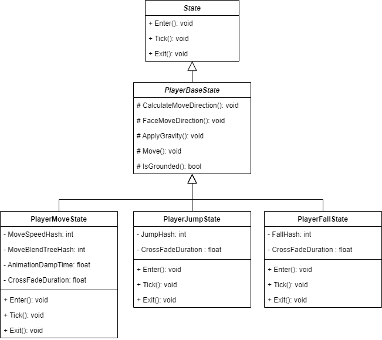

状态机本身将由两个类组成。第一个会是`StateMachine`。这个类将从`MonoBehavior`继承，并将拥有切换状态和执行它们的`Enter`、`Exist`和`Tick`方法的核心逻辑。

第二类会是`PlayerStateMachine`；这一个将从`StateMachine`继承，因此也间接地从`MonoBehavior`继承。我们将把`PlayerStateMachine`作为另一个组件附加到我们的**玩家**游戏对象上。这就是为什么我们需要它是一个`MonoBehavior`。

`PlayerStateMachine`将通过我们从状态传递来的状态机实例，公开引用我们将在状态中使用的其他组件和其他成员。

如果这对你来说是新的，你很困惑，不要担心——仔细看看下图和上图，暂停一下，思考一会儿。如果你还不明白，就继续吧，我相信在你写代码的时候你会明白的。
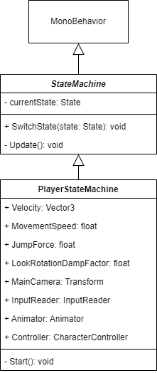

Well, enough theory, let’s get coding! Create a new C# script and name it `State`. It will be super simple. The entire code is just this:

```
public abstract class State
{
    public abstract void Enter();
    public abstract void Tick();
    public abstract void Exit();
}

```

现在添加`StateMachine`类，该类与`State`类一起构成了状态模式的本质:

```
using UnityEngine;

public abstract class StateMachine : MonoBehaviour
{
    private State currentState;

    public void SwitchState(State state)
    {
        currentState?.Exit();
        currentState = state;
        currentState.Enter();
    }

    private void Update()
    {
        currentState?.Tick();
    }
}

```

你可以看到逻辑非常简单。它有一个成员，类型为`State,`的`currentState`和两个方法，一个用于切换状态，在切换到新的状态之前调用当前状态的`Exit`方法，然后在新的状态下调用`Enter`。

`Update`方法来自`MonoBehavior`,每帧被 Unity 引擎调用一次，因此当前分配状态的`Tick`方法也将每帧执行一次。还要注意空条件运算符的用法。

我们要实现的另一个类是`PlayerStateMachine`。你可能会问为什么创建一个`PlayerStateMachine`而不使用`StateMachine`本身作为我们播放器的一个组件。

这背后的原因，部分也是因为`PlayerBaseState`是其他状态的直接父代而不是`State`本身，在于可重用性。状态机通常对敌人也很有用。

敌人会使用相同的核心状态模式逻辑，但是他们的状态会有不同的依赖和逻辑。你不想把它们和玩家的依赖和逻辑混在一起。

对于敌人，你可以实现不同的`EnemyStateMachine`和`EnemyBaseState`，而不是`PlayerStateMachine`和`PlayerBaseState`，但是作为状态机的状态，其背后的核心思想是相同的。

然而，这超出了本教程的范围，所以让我们回到我们的播放器并添加`PlayerStateMachine`类:

```
using UnityEngine;

[RequireComponent(typeof(InputReader))]
[RequireComponent(typeof(Animator))]
[RequireComponent(typeof(CharacterController))]
public class PlayerStateMachine : StateMachine
{
    public Vector3 Velocity;
    public float MovementSpeed { get; private set; } = 5f;
    public float JumpForce { get; private set; } = 5f;
    public float LookRotationDampFactor { get; private set; } = 10f;
    public Transform MainCamera { get; private set; }
    public InputReader InputReader { get; private set; }
    public Animator Animator { get; private set; }
    public CharacterController Controller { get; private set; }

    private void Start()
    {
        MainCamera = Camera.main.transform;

        InputReader = GetComponent<InputReader>();
        Animator = GetComponent<Animator>();
        Controller = GetComponent<CharacterController>();

        SwitchState(new PlayerMoveState(this));
    }
}

```

使用`RequireComponent`属性并不是强制性的，但是这是一个很好的实践。作为玩家游戏对象上的组件的`PlayerStateMachine`也需要将`InputReader`、`Animator`和`CharacterController`组件附加到玩家上。

没有它们会导致运行时错误。有了`[RequireComponent](https://docs.unity3d.com/ScriptReference/RequireComponent.html)`属性，我们可以在编译时更快地发现最终问题，这通常会更好。此外，当你添加一个这样装饰的游戏对象时，Unity editor 会自动将所有需要的组件添加到游戏对象中，并防止你意外删除它们。

注意我们是如何在`Start`方法中使用`[GetComponent](https://docs.unity3d.com/ScriptReference/GameObject.GetComponent.html)`方法将引用分配给所需组件的。当 Unity 加载一个场景时，Start 被调用一次。在`Start`方法中，我们也给主摄像机的`Transform`组件分配一个引用，这样我们就可以在玩家状态下访问它的位置和旋转。

从美国，我们将通过`PlayerStateMachine`访问所有这些成员。这就是为什么当我们创建一个新的`PlayerMoveState`实例时，我们传递一个对`this`实例的引用，同时将它作为一个参数传递给`SwitchState`方法。

你可以说`PlayerMoveState`是`PlayerStateMachine`的默认状态，我们仍然需要实现它，但是在我们这样做之前，我们首先要实现它的父类`PlayerBaseState`类:

```
using UnityEngine;

public abstract class PlayerBaseState : State
{
    protected readonly PlayerStateMachine stateMachine;

    protected PlayerBaseState(PlayerStateMachine stateMachine)
    {
        this.stateMachine = stateMachine;
    }

    protected void CalculateMoveDirection()
    {
        Vector3 cameraForward = new(stateMachine.MainCamera.forward.x, 0, stateMachine.MainCamera.forward.z);
        Vector3 cameraRight = new(stateMachine.MainCamera.right.x, 0, stateMachine.MainCamera.right.z);

        Vector3 moveDirection = cameraForward.normalized * stateMachine.InputReader.MoveComposite.y + cameraRight.normalized * stateMachine.InputReader.MoveComposite.x;

        stateMachine.Velocity.x = moveDirection.x * stateMachine.MovementSpeed;
        stateMachine.Velocity.z = moveDirection.z * stateMachine.MovementSpeed;
    }

    protected void FaceMoveDirection()
    {
        Vector3 faceDirection = new(stateMachine.Velocity.x, 0f, stateMachine.Velocity.z);

        if (faceDirection == Vector3.zero)
            return;

        stateMachine.transform.rotation = Quaternion.Slerp(stateMachine.transform.rotation, Quaternion.LookRotation(faceDirection), stateMachine.LookRotationDampFactor * Time.deltaTime);
    }

    protected void ApplyGravity()
    {
        if (stateMachine.Velocity.y > Physics.gravity.y)
        {
            stateMachine.Velocity.y += Physics.gravity.y * Time.deltaTime;
        }
    }

    protected void Move()
    {
        stateMachine.Controller.Move(stateMachine.Velocity * Time.deltaTime);
    }

```

这个类比前几个稍长一些，因为它包含了其他状态的所有公共逻辑。我将从构造函数开始，从上到下，一个方法一个方法地解释这个逻辑。

构造函数接受`PlayerStateMachine`，然后将引用赋给`stateMachine`。在受保护的`CalculateMoveDirection`中，我们然后根据相机的方向和来自`InputReader.MoveComposite`的输入值计算玩家移动的方向，这些值由游戏手柄上的 **W** 、 **S** 、 **A** 和 **D** 键或**左摇杆**设置。

然而，我们不直接在这个方法中在计算的方向上移动播放器。我们将`Velocity` x 和 z 值设置为计算方向的各自值，乘以`MovementSpeed`。

在`FaceDirection`方法中，我们旋转播放器，使它总是面向移动的方向，也就是从`Velocity`开始的方向，同时将`y`值归零，因为我们不希望我们的播放器上下倾斜。

我们通过`stateMachine`来设置我们玩家的`Transform`组件的旋转，因为我们可以从游戏对象上的任何其他组件获取对`Transform`组件的引用，而`PlayerStateMachine`将是其中之一。

旋转值本身是使用`[Slerp](https://docs.unity3d.com/ScriptReference/Quaternion.Slerp.html)`和`[LookRotation](https://docs.unity3d.com/ScriptReference/Quaternion.LookRotation.html)`方法计算的，这些方法由 Unity 作为`Quaternion`类的静态方法提供。球面插值是一个需要开始和目标旋转以及插值的 t 值的函数。

我们要从`PlayerMoveState`中的`Tick`方法调用`CalculateMoveDirection`和`FaceMoveDirection`，为了实现平滑和帧率独立旋转，我们通过我们的`LookRotationDampTime`乘以`[Time.deltaTime](https://docs.unity3d.com/ScriptReference/Time-deltaTime.html)`。

在`ApplyGravity`中，如果`Velocity` y 值大于`Physics.gravity.y,`,我们不断地将它的值乘以`Time.deltaTime`相加。重力的 y 值在默认情况下统一设置为`-9.81`。

这会导致玩家不断被拉向地面。你会在`PlayerJumpState`和`PlayerFallState`中看到效果，但是我们也要在`PlayerMoveState`中调用这个方法，让玩家保持稳定。

`Move`是我们使用其`CharacterController`组件实际移动播放器的方法。我们简单地在`Velocity`乘以 delta 时间的方向上移动播放器。

接下来，我们将添加第一个具体的状态实现，`PlayerMoveState`:

```
using UnityEngine;

public class PlayerMoveState : PlayerBaseState
{
    private readonly int MoveSpeedHash = Animator.StringToHash("MoveSpeed");
    private readonly int MoveBlendTreeHash = Animator.StringToHash("MoveBlendTree");
    private const float AnimationDampTime = 0.1f;
    private const float CrossFadeDuration = 0.1f;

    public PlayerMoveState(PlayerStateMachine stateMachine) : base(stateMachine) { }

    public override void Enter()
    {
        stateMachine.Velocity.y = Physics.gravity.y;

        stateMachine.Animator.CrossFadeInFixedTime(MoveBlendTreeHash, CrossFadeDuration);

        stateMachine.InputReader.OnJumpPerformed += SwitchToJumpState;
    }

    public override void Tick()
    {
        if (!stateMachine.Controller.isGrounded)
        {
            stateMachine.SwitchState(new PlayerFallState(stateMachine));
        }

        CalculateMoveDirection();
        FaceMoveDirection();
        Move();

        stateMachine.Animator.SetFloat(MoveSpeedHash, stateMachine.InputReader.MoveComposite.sqrMagnitude > 0f ? 1f : 0f, AnimationDampTime, Time.deltaTime);
    }

    public override void Exit()
    {
        stateMachine.InputReader.OnJumpPerformed -= SwitchToJumpState;
    }

    private void SwitchToJumpState()
    {
        stateMachine.SwitchState(new PlayerJumpState(stateMachine));
    }
}

```

`MoveSpeedHash`和`MoveBlendTreeHash`整数是我们`Animator`中`MoveSpeed`参数和`MoveBlendTree`的数值标识符。我们使用来自`Animator`类`[StringToHash](https://docs.unity3d.com/ScriptReference/Animator.StringToHash.html)`的静态方法将字符串转换成“唯一的”数字。

我将 unique 放在引号中，因为从理论上讲，哈希算法可以对两个不同的输入字符串产生相同的结果。这就是所谓的哈希冲突。这里只是一个旁注，真的不用担心。几率极小。

如果你向下看我们设置参数`MoveSpeed`的浮点值`stateMachine.Animator.SetFloat(MoveSpeedHash…`的地方，你可以看到我们如何使用这个散列来标识参数`MoveSpeed`的名称。

不直接使用字符串`"MoveSpeed"`的原因是因为比较整数比比较字符串更有效。虽然可以将一个字符串传递给`Animator.SetFloat`方法——相对来说，在我们的小例子中，这并没有太大的区别——但我希望您展示正确的、更具性能的方法。

让我们回到`PlayerMoveState`类的顶端。从公共构造函数，我们将`stateMachine`传递给基构造函数；那是父类的构造函数，`PlayerBaseState`。

然后我们有`Enter`方法，当状态机将状态设置为当前状态时调用一次。在这里，我们将`Velocity`向量的 y 值设置为`Physics.gravity`向量的 y 值，因为我们希望我们的玩家不断被下拉。

然后，我们在固定的时间内将我们的动画器交叉渐变到`MoveBlendTree`状态，在我们的例子中，这导致了秋天动画和`MoveBlendTree`结果动画之间的平滑过渡，稍后我们将从`PlayerFallState`切换回`PlayerMoveState`。

我们还将`SwitchToJumpState`方法注册到我们的`InputReader`中的`OnJumpPerformed`事件。当我们按下游戏手柄上的空格键或**南按钮**时，`SwitchToJumpState`将被调用，正如你在最底部看到的，在函数体中，将状态机切换到新的`PlayerJumpState`。

在`Exit`函数中，在状态机将状态切换到新状态之前调用的函数，我们简单地从事件中取消订阅`SwitchToJumpState`方法，以断开输入和动作之间的连接。

这就给我们留下了每一帧都执行的`Tick`方法。首先，我们检查玩家是否被禁足。如果没有，玩家应该开始下落，因此我们立即将状态机中的当前状态切换到`PlayerFallState`，传递给`stateMachine`一个构造函数参数。

如果玩家被禁足，我们从`PlayerBaseState`调用`CalculateMoveDirection`、`FaceMoveDirection`和`Move`方法，这是它的父类，很快也是其他两个状态的父类，我们还需要实现它们。

当我们不久前实现这些方法时，我们已经知道了它们是如何工作的。这里我们只是调用它们，每一帧，一次又一次，直到状态改变。

最后，我们根据来自我们的`InputReader`的`MoveComposite`的平方大小来设置我们的`Animator`的`MoveSpeed`参数。

我们用平方值，因为我们对实际值不感兴趣；我们只需要知道值是否为 0，从平方幅度计算幅度需要一个额外的步骤，平方根。这只是在执行`Tick`方法时，压缩一点点性能，每帧节省几个周期。

如果值为 0，我们将 MoveSpeed 参数也设置为 0，否则，我们将其设置为 1，有效地将我们的`MoveBlendTree`从`Idle`过渡到`Run`动画。其他参数`AnimationDampTime`和`Time.deltaTime`使这种过渡平滑且与帧速率无关。

我们差不多完成了；我们只需要实现`PlayerJumpState`和`PlayerFallState`。让我们从后者开始:

```
using UnityEngine;

public class PlayerJumpState : PlayerBaseState
{
    private readonly int JumpHash = Animator.StringToHash("Jump");
    private const float CrossFadeDuration = 0.1f;

    public PlayerJumpState(PlayerStateMachine stateMachine) : base(stateMachine) { }

    public override void Enter()
    {
        stateMachine.Velocity = new Vector3(stateMachine.Velocity.x, stateMachine.JumpForce, stateMachine.Velocity.z);

        stateMachine.Animator.CrossFadeInFixedTime(JumpHash, CrossFadeDuration);
    }

    public override void Tick()
    {
        ApplyGravity();

        if (stateMachine.Velocity.y <= 0f)
        {
            stateMachine.SwitchState(new PlayerFallState(stateMachine));
        }

        FaceMoveDirection();
        Move();
    }

    public override void Exit() { }
}

```

一看就知道这个简单多了。在顶部，我们有用于`Jump`字符串的散列，用于在`Animator`中跳转的独立动画的名称，我们通过构造函数传递`stateMachine`实例。这对我们来说并不新鲜。

在`Enter`方法中，除了将动画交叉渐变到`Jump`之外，类似地，当我们在`PlayerMoveState`中交叉渐变时，我们将`Velocity`设置为具有相同 x 和 z 值以及当前速度的`new Vector3`，但是将 y 值设置为`JumpForce`。

然后，在`Tick`方法中，当我们调用`Move`时，我们的播放器被拉高，因为`Velocity` y 值现在是正的，但我们也调用`ApplyGravity`所以它的值在每一帧都慢慢减少，一旦它达到 0 或以下，我们就切换到`PlayerFallState`。

`FaceMoveDirection`在这里不是强制的；它是相当装饰性的。就我个人而言，我觉得玩家即使在跳跃时也总是面向移动的方向会更好。

强制性的是覆盖一个抽象父类的所有抽象方法，除非子类也是抽象的，但事实并非如此，所以我们必须为`Exit`方法提供一个实现，即使它什么也不做。

如果你想一想，它是有意义的:当从这个状态退出时，在`currentState.Exit()`上的`SwitchState`方法会调用什么？

我们现在非常接近完整的实现，最后一个状态`PlayerFallState`，甚至是最简单的一个:

```
using UnityEngine;

public class PlayerFallState : PlayerBaseState
{
    private readonly int FallHash = Animator.StringToHash("Fall");
    private const float CrossFadeDuration = 0.1f;

    public PlayerFallState(PlayerStateMachine stateMachine) : base(stateMachine) { }

    public override void Enter()
    {
        stateMachine.Velocity.y = 0f;

        stateMachine.Animator.CrossFadeInFixedTime(FallHash, CrossFadeDuration);
    }

    public override void Tick()
    {
        ApplyGravity();
        Move();

        if (stateMachine.Controller.isGrounded)
        {
            stateMachine.SwitchState(new PlayerMoveState(stateMachine));
        }
    }

    public override void Exit() { }
}

```

这一次，在`Enter`方法中，我们交叉渐变到`Fall`独立动画中，我们将 y 轴上的初始`Velocity`值设置为 0。然后在`Tick`方法中，我们调用`ApplyGravity`和`Move`，这将我们的播放器拉下来，直到它落地，我们再次将状态切换到`PlayerMoveState`。

仅此而已。我们的第三人称控制器基于一个状态机，允许我们的玩家通过移动、跳跃和跌倒状态进行转换。

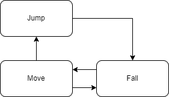

我们需要做的最后一件事是回到 Unity 编辑器，通过将`StateMachine.cs`脚本作为组件添加到**玩家**游戏对象来使用它。

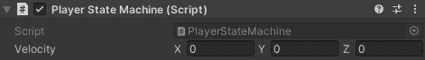

本教程中完整的 Unity 项目[可以在 GitHub](https://github.com/marianpekar/unity-third-person-controller) 上找到。

## 结论

如果你是 Unity 的初学者，并且这是你第一次接触到我们所介绍的大部分或全部内容，并且你成功地让它工作了，干得好！拍拍自己的背，因为这是一个不小的成就，你学到了很多。

除了状态模式，我们还看到了观察者模式，我们学习了如何使用新的 Unity 输入系统，如何使用 Cinemachine 和 Animator，以及如何使用`CharacterController`组件。

最重要的是，我们已经看到了如何将所有这些放在一起构建一个易于扩展的第三人称玩家控制器。说到可扩展性，我想在最后留给你一个小小的挑战。试着自己实现一个`PlayerDeadState`。

挑战的一个提示:创建一个具有`Health`属性的`HealthComponent`类，将它附加到玩家游戏对象，并在`PlayerStateMachine`中存储对它的引用。然后使用观察者模式。当`Health`属性达到零时，调用一个将状态从任何状态切换到`PlayerDeadState`的事件。

## 使用 [LogRocket](https://lp.logrocket.com/blg/signup) 消除传统错误报告的干扰

[](https://lp.logrocket.com/blg/signup)

[LogRocket](https://lp.logrocket.com/blg/signup) 是一个数字体验分析解决方案，它可以保护您免受数百个假阳性错误警报的影响，只针对几个真正重要的项目。LogRocket 会告诉您应用程序中实际影响用户的最具影响力的 bug 和 UX 问题。

然后，使用具有深层技术遥测的会话重放来确切地查看用户看到了什么以及是什么导致了问题，就像你在他们身后看一样。

LogRocket 自动聚合客户端错误、JS 异常、前端性能指标和用户交互。然后 LogRocket 使用机器学习来告诉你哪些问题正在影响大多数用户，并提供你需要修复它的上下文。

关注重要的 bug—[今天就试试 LogRocket】。](https://lp.logrocket.com/blg/signup-issue-free)