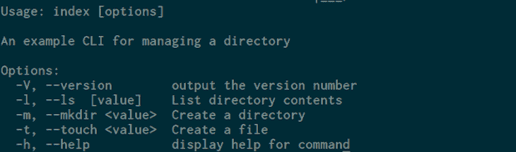
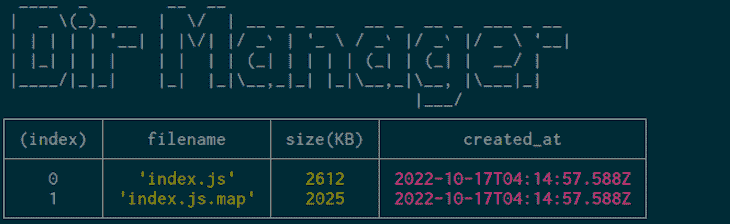
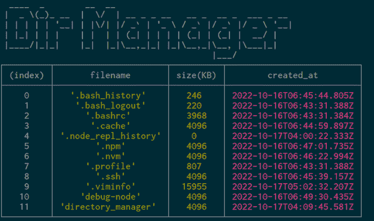
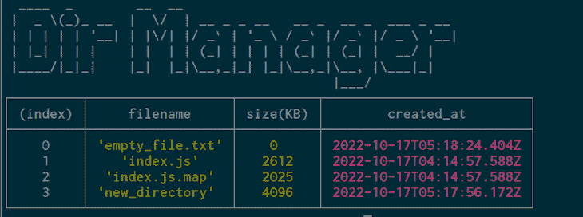
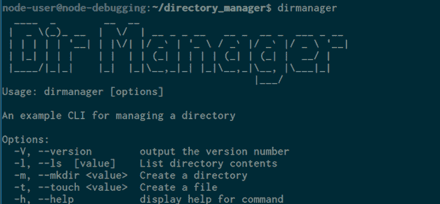

# 使用 Node.js 和 Commander 构建 TypeScript CLI

> 原文：<https://blog.logrocket.com/building-typescript-cli-node-js-commander/>

命令行有数以千计的工具，如`awk`、`sed`、`grep`和`find`供您使用，这些工具可以减少开发时间并自动化繁琐的任务。在 Node.js 中创建命令行工具并不复杂，这要感谢像 [Commander.js](https://github.com/tj/commander.js) 这样强大的库。

将 Node.js 与 TypeScript 配对有助于您在开发过程的早期捕捉错误，以便您可以发布更可靠、错误更少的 CLI。

在本教程中，我们将讨论 CLI is 以及如何使用 Commander.js 和 TypeScript 来构建一个。然后，我们将使 CLI 可以全局访问，以便用户可以在其系统中的任何位置访问它。

*向前跳转:*

## 先决条件

要学习本教程，您需要:

## 为什么是 Commander.js？

命令行界面，通常称为 CLI，是一种允许用户键入指令并与处理输入并产生输出的脚本进行交互的程序。Node.js 有很多可以让你构建 CLI 的包，比如 [args](https://github.com/leo/args) 、[minimit](https://github.com/minimistjs/minimist)和 [oclif](https://github.com/oclif/oclif) 。

Commander.js 提供了许多特性，允许您简洁地构建命令行界面。此外，Node.js 社区提供了诸如 [Chalk](https://github.com/chalk/chalk) 和 [Figlet](https://github.com/patorjk/figlet.js) 之类的库来补充 Commander.js CLIs，使它们看起来更具视觉吸引力。

由于以下特性，我们将使用 Commander.js:

*   支持子命令
*   支持各种命令行选项，如 required、variadic 或 optional
*   自定义事件侦听器
*   自动化帮助

## 了解命令行界面

在我们开始构建 CLI 之前，让我们看看现有 CLI 是如何工作的。

如果您正在学习本教程，那么您的机器上可能已经安装了 Node.js。Node.js 提供了一个 CLI，您可以通过在终端中键入`node`来访问它:

```
node

```

键入命令允许您访问 node . js read–eval–print 循环(REPL ),您可以在其中输入和执行 JavaScript 代码。

您可以修改 Node.js CLI，使用命令行标志或选项来做其他事情。用`CTRL+D`退出 REPL，然后用`-v`选项检查 Node.js 版本:

```
node -v
// v18.11.0

```

正如您在输出中看到的，传递`-v`选项改变了`node` CLI 的行为，以显示 Node.js 版本。您还可以选择长格式选项:

```
node --version
// v18.11.0

```

其他 Node.js CLI 选项需要将参数与选项一起传递。例如，`-e`选项是`--eval`的缩写，它接受包含 JavaScript 代码的字符串参数。节点执行代码并将结果记录在终端中:

```
node -e "console.log(4 * 2)"
// 8

```

如果没有传递参数，`-e`选项会返回一个错误:

```
node -e
// node: -e requires an argument

```

现在我们已经了解了 CLI 的工作原理。让我们来看看 Commander.js 术语，这些术语是我们到目前为止看到的节点 CLI 选项:

*   布尔选项:这些选项不需要参数。`-v`是布尔选项的一个例子；其他熟悉的例子有`ls -l`或`sudo -i`
*   必需选项:这些选项需要参数。例如，如果参数没有通过，`node -e "console.log(4 * 2)"`就会抛出一个错误
*   Option-argument:这些是传递给选项的参数。在`node -e "console.log(4 * 2)"`命令中，`"console.log(4 * 2)"`是一个选项参数；另一个例子是`git status -m "commit message"`，这里的`"commit message"`是`-m`选项的选项参数

现在您已经了解了什么是 CLI，我们将创建一个目录，并将其配置为使用 TypeScript 和 Commander.js。

## 开始使用和配置 TypeScript

在本节中，我们将为项目创建一个目录，将其初始化为 npm 包，安装所有必需的依赖项，并配置 TypeScript。

首先，为项目创建目录:

```
mkdir directory_manager

```

转到目录:

```
cd directory_manager

```

将目录初始化为 npm 项目:

```
npm init -y

```

这将创建一个`package.json`文件，其中包含关于您的项目和跟踪依赖项的重要信息。

接下来，运行以下命令:

```
npm install commander figlet

```

Commander.js 是我们构建 CLI 的库，Figlet 将用于将 CLI 文本转换为 ASCII 艺术。

接下来，下载 TypeScript 和`ts-node`包:

```
npm install @types/node typescript --save-dev

```

现在，在文本编辑器中创建一个`tsconfig.json`文件，并为 TypeScript 添加以下配置设置:

```
{
  "compilerOptions": {
    "rootDir": "src",
    "outDir": "dist",
    "strict": true,
    "target": "es6",
    "module": "commonjs",
    "sourceMap": true,
    "esModuleInterop": true,
    "moduleResolution": "node"
  }
}

```

让我们回顾一些选项:

*   `rootDir`:一个包含 CLI 的类型脚本文件(`.ts`文件)的目录，我们将这些文件保存在`src`目录中
*   `outDir`:包含 TypeScript 编译的 JavaScript 源代码的目录。我们将使用`dist`目录
*   `strict`:这将禁用可选类型，并确保您编写的所有 TypeScript 代码都有类型
*   【TypeScript 将 JavaScript 编译到的 [ECMAScript](https://en.wikipedia.org/wiki/ECMAScript) 的版本

要全面了解所有选项，请访问 [TypeScript 文档](https://www.typescriptlang.org/tsconfig)。

接下来，在`package.json`文件中，创建一个用于编译 TypeScript 的`build`脚本:

```
{
  ...
  "scripts": {
    // add the following line
    "build": "npx tsc",
    "test": "echo \"Error: no test specified\" && exit 1"
  },
  ...
}

```

为了编译 TypeScript，您将运行带有`npm run build`的构建脚本，它将运行将 TypeScript 编译成 JavaScript 的`npx tsc`命令。

我们现在已经配置了 TypeScript，并添加了一个用于编译 TypeScript 的脚本。接下来，我们将开始构建 CLI。

## 使用 TypeScript 创建 CLI

在本节中，我们将开始使用 TypeScript 和 Commander.js 构建一个 CLI。


CLI 将用于管理目录，它将有一个`-l`选项，以表格格式列出目录内容。对于每个项目，它将显示其名称、大小和创建日期。它还有一个用于创建目录的`-m`和一个用于创建空文件的`-t`选项。

现在，您已经知道我们将构建什么了，我们将把 CLI 分成更小的块，并开始构建每个部分。

### 创建 CLI 的名称

在本节中，我们将创建 CLI 的名称，并使用 Figlet 包将其转换为 ASCII 艺术文本。

完成后，它将看起来像这样:


在您的项目目录中，创建`src`目录并导航到该目录:

```
mkdir src && cd src

```

该目录将包含 TypeScript 文件。您可能还记得，在本教程前面用`tsconfig.js`文件配置 TypeScript 时，我们在`rootDir`选项中指定了这个目录。

接下来，创建一个`index.ts`文件，并添加以下内容:

```
const figlet = require("figlet");

console.log(figlet.textSync("Dir Manager"));

```

在第一行中，我们导入 Figlet 模块。接下来，我们调用带有字符串`Dir Manager`作为参数的`figlet.textSync()`方法，将文本转换成 ASCII 艺术。最后，我们在控制台中记录文本。

要验证更改是否有效，请保存您的文件。使用以下命令将 TypeScript 文件编译为 JavaScript:

```
npm run build

```

当 TypeScript 完成编译时，您将看到如下输出:

```
// output
> [email protected] build
> npx tsc

```

如果成功，您将不会在这里看到任何错误。

您可能还记得，我们添加了一个`outDir`选项，并将其设置为`tsconfig.json`文件中的`dist`目录。编译完 TypeScript 后，会在根目录下自动创建目录。

进入`dist`目录:

```
cd ../dist

```

列出目录内容:

```
ls

// output
index.js  index.js.map

```

您将看到`index.js`文件已经创建。您可以使用 Node.js 运行该文件，如下所示:

```
node index.js

```

运行该命令后，您将看到 ASCII 艺术形式的 CLI 名称:


现在，回到根目录:

```
cd ..

```

接下来，我们不会登录到`dist`目录来运行该文件。我们将在根目录中以`node dist/index.js`的身份执行此操作。

既然您可以用 ASCII 文本创建 CLI 的名称，我们将创建 CLI 选项。

### 使用 Commander.js 创建 CLI 选项

在本节中，我们将使用 Commander.js 为 CLI 及其选项创建描述。

我们将创建以下选项:



`-V`选项将调用 Commander.js `version()`方法，默认提供`-h`。我们现在需要定义三个选项:

*   `-l` / `--ls`:修改 CLI，在表格中列出目录内容。它还将接受一个可选的目录路径参数
*   `-m` / `--mkdir`:用于创建目录。它需要一个选项参数，即要创建的目录的名称
*   `-t` / `--touch`:修改 CLI 创建空文件。它需要一个选项参数，即文件的名称

现在我们知道了将要创建的选项，我们将使用 Commander.js 来定义它们。

### 使用 Commander.js 定义选项

在文本编辑器中，打开`index.ts`文件，添加以下代码以导入并初始化 Commander.js:

```
const { Command } = require("commander"); // add this line
const figlet = require("figlet");

//add the following line
const program = new Command();

console.log(figlet.textSync("Dir Manager"));

```

在第一行中，我们导入 Commander.js 模块并提取`Command`类。然后我们将`program`变量设置为`Command`类的一个实例。该类为我们提供了几种可用于设置版本、描述和 CLI 选项的方法。

接下来，在您的`index.ts`文件中定义 CLI 选项:

```
...

program
  .version("1.0.0")
  .description("An example CLI for managing a directory")
  .option("-l, --ls  [value]", "List directory contents")
  .option("-m, --mkdir <value>", "Create a directory")
  .option("-t, --touch <value>", "Create a file")
  .parse(process.argv);

const options = program.opts();

```

在前面的代码中，我们使用包含 Commander 实例的`program`变量来调用`version()`方法。该方法接受一个包含 CLI 版本的字符串，Commander 会为您创建`-V`选项。

接下来，我们将`description()`方法调用与描述 CLI 程序的文本链接起来。接下来，您将调用 Commander package 的`option()`方法，该方法带有两个参数:一个选项和一个描述。第一个参数是一个字符串，指定了`-l`选项和长名称`--ls`。然后我们将`value`包装在`[]`中，这样选项就可以接受可选参数。第二个参数是当用户使用`-h`标志时显示的帮助文本。

之后，我们链接另一个`option()`方法调用来定义`-m` / `--mkdir`选项。`<value>`中的`<>`表示它需要一个参数。接下来，我们链接另一个`option()`来定义`-t`选项和长名称`--touch`，这也需要一个参数。

然后我们链接`parse()`方法调用，它处理`process.argv`中的参数，这是一个包含用户传递的参数的数组。第一个参数是`node`，第二个参数是程序文件名，其余都是附加参数。

最后，我们将`options`变量设置为`program.opts()`调用，该调用返回一个对象。该对象将 CLI 选项作为属性，其值是用户传递的参数。

此时，`index.ts`文件将如下所示:

```
const { Command } = require("commander");
const figlet = require("figlet");

const program = new Command();

console.log(figlet.textSync("Dir Manager"));

program
  .version("1.0.0")
  .description("An example CLI for managing a directory")
  .option("-l, --ls  [value]", "List directory contents")
  .option("-m, --mkdir <value>", "Create a directory")
  .option("-t, --touch <value>", "Create a file")
  .parse(process.argv);

const options = program.opts();

```

完成更改后，保存文件，然后编译 TypeScript:

```
npm run build

```

使用`-h`选项运行`index.js`以查看 CLI 帮助页面:

```
node dist/index.js -h

```

运行该命令后，页面将如下所示:


让我们也试试`-V`选项:

```
node dist/index.js -V
// 1.0.0

```

到目前为止，`-h`和`-V`选项工作正常，没有任何问题。如果您尝试我们定义的其他选项，您将只能看到 CLI 名称。

```
node dist/index.js -l

```


这是因为我们没有为其他选项定义操作。

## 为 CLI 创建操作

到目前为止，我们已经为 CLI 定义了选项，但是没有与之关联的操作。在本节中，我们将为选项创建操作，以便当用户使用这些选项时，CLI 将执行相关任务。

我们将从`-l`选项开始。我们希望 CLI 在包含以下字段的表格中显示目录内容:

*   文件名
*   大小(KB)
*   `created_at`

用户还可以提供可选的目录路径:

```
node dist/index.js -l /home/username/Documents

```

如果用户没有传递任何选项参数，CLI 将只显示我们正在执行的`index.js`文件位置中的内容:

```
node dist/index.js -l

```

在您的`index.ts`文件中，导入`fs`和`path`模块:

```
const { Command } = require("commander");
// import fs and path modules
const fs = require("fs");
const path = require("path");
const figlet = require("figlet");

```

在文件末尾定义一个带有[异常处理程序](https://blog.logrocket.com/exception-handling-in-javascript/)的`listDirContents()`函数:

```
const { Command } = require("commander");
...
const options = program.opts();

//define the following function
async function listDirContents(filepath: string) {
  try {

  } catch (error) {
    console.error("Error occurred while reading the directory!", error);
  }
}

```

`listDirContents()`异步函数接受一个`filepath`参数，该参数有一个`string`的 TypeScript 类型声明。该类型确保函数只接受字符串作为参数，并且您添加的关键字`async`使函数异步。这将允许我们在函数中使用`await`关键字，我们很快就会这么做。

在这个函数中，我们定义了`try`块，它现在是空的。它将包含列出目录内容并将结果格式化成表格的功能。之后，我们定义了`catch`块，如果`try`块中包含的代码有异常，它将在控制台中记录一条消息。

让我们在`listDirContents()`函数中添加列出目录内容的代码:

```
async function listDirContents(filepath: string) {
  try {
    // add the following
    const files = await fs.promises.readdir(filepath);
    const detailedFilesPromises = files.map(async (file: string) => {
      let fileDetails = await fs.promises.lstat(path.resolve(filepath, file));
      const { size, birthtime } = fileDetails;
      return { filename: file, "size(KB)": size, created_at: birthtime };
    });
  } catch (error) {
    console.error("Error occurred while reading the directory!", error);
  }
}

```

首先，我们用参数`filepath`中的值调用`fs.promises.readdir()`来读取目录内容。该函数返回一个承诺，所以我们在它前面加上`await`关键字，等待它的解析。解析后，`files`被设置为一个数组。

其次，我们迭代`files`数组中的每个元素，并使用`map()`方法返回一个新数组，该方法采用异步回调。回调接受`file`参数。在回调中，我们用文件的完整路径调用`fs.promises.lstat()`来获得文件的更多细节，比如`size`、`birthtime`和`info`。然后我们提取`size`和`birthtime`属性，并将带有`filename`、`size(KB)`和`created_at`属性的对象返回到数组中，由`map()`方法返回到`detailedFilesPromise`变量中。

现在，将以下代码添加到`try`块的末尾，以创建一个显示目录内容的表:

```
async function listDirContents(filepath: string) {
  try {
    const files = await fs.promises.readdir(filepath);
    const detailedFilesPromises = files.map(async (file: string) => {
      let fileDetails = await fs.promises.lstat(path.resolve(filepath, file));
      const { size, birthtime } = fileDetails;
      return { filename: file, "size(KB)": size, created_at: birthtime };
    });
    // add the following
    const detailedFiles = await Promise.all(detailedFilesPromises);
    console.table(detailedFiles);
  } catch (error) {
    console.error("Error occurred while reading the directory!", error);
  }
}

```

现在，`detailedFilesPromise`中的每个元素将返回一个承诺，并在解析后对一个对象求值。为了等待它们全部解决，我们调用了`Promise.all()`方法。

最后，我们用`detailedFiles`数组调用`console.table()`来记录控制台中的数据。

现在让我们为`-m`选项定义一个动作。为此，在`listDirContents()`函数下面定义`createDir()`函数:

```
async function listDirContents(filepath: string) {
  ...
}

// create the following function
function createDir(filepath: string) {
  if (!fs.existsSync(filepath)) {
    fs.mkdirSync(filepath);
    console.log("The directory has been created successfully");
  }
}

```

在`CreateDir()`函数中，我们检查给定的目录路径是否存在。如果它不存在，我们调用`fs.mkdirSync()`来创建一个目录，然后记录一个成功消息。

在我们调用函数之前，为`-t`标志定义一个`createFile()`函数:

```
async function listDirContents(filepath: string) {
  ...
}

function createDir(filepath: string) {
  ...
}
// create the following function
function createFile(filepath: string) {
  fs.openSync(filepath, "w");
  console.log("An empty file has been created");
}

```

在`createFile()`函数中，我们调用`fs.openSync()`在给定的路径中创建一个空文件。然后，我们向终端记录一条确认消息。

到目前为止，我们已经创建了三个函数，但是还没有调用它们。为此，我们需要检查用户是否使用了选项，这样我们就可以调用合适的函数。

要检查用户是否使用了`-l`或`--ls`选项，在`index.ts`中添加以下内容:

```
...
function createFile(filepath: string) {
  ...
}
// check if the option has been used the user
if (options.ls) {
  const filepath = typeof options.ls === "string" ? options.ls : __dirname;
  listDirContents(filepath);
}

```

如果`options.ls`被设置为一个值，我们将`filepath`变量设置为用户提供的路径，如果`option.ls`是一个字符串；否则，它被设置为`dist`目录中`index.js`文件的文件路径。之后，我们用`filepath`变量调用`listDirContents()`。

现在让我们在用户使用适当的选项时调用`createDir()`和`createFile()`函数:

```
if (options.ls) {
  ...
}

// add the following code
if (options.mkdir) {
  createDir(path.resolve(__dirname, options.mkdir));
}
if (options.touch) {
  createFile(path.resolve(__dirname, options.touch));
}

```

如果用户使用了`-m`标志并传递了一个参数，我们就用`index.js`文件的完整路径调用`createDir()`来创建目录。

如果用户使用了`-t`标志并传递了一个参数，我们将调用带有`index.js`位置完整路径的`createFile()`函数。

此时，完整的`index.ts`文件将如下所示:

```
const { Command } = require("commander");
const fs = require("fs");
const path = require("path");
const figlet = require("figlet");

const program = new Command();

console.log(figlet.textSync("Dir Manager"));

program
  .version("1.0.0")
  .description("An example CLI for managing a directory")
  .option("-l, --ls  [value]", "List directory contents")
  .option("-m, --mkdir <value>", "Create a directory")
  .option("-t, --touch <value>", "Create a file")
  .parse(process.argv);

const options = program.opts();

async function listDirContents(filepath: string) {
  try {
    const files = await fs.promises.readdir(filepath);
    const detailedFilesPromises = files.map(async (file: string) => {
      let fileDetails = await fs.promises.lstat(path.resolve(filepath, file));
      const { size, birthtime } = fileDetails;
      return { filename: file, "size(KB)": size, created_at: birthtime };
    });
    const detailedFiles = await Promise.all(detailedFilesPromises);
    console.table(detailedFiles);
  } catch (error) {
    console.error("Error occurred while reading the directory!", error);
  }
}
function createDir(filepath: string) {
  if (!fs.existsSync(filepath)) {
    fs.mkdirSync(filepath);
    console.log("The directory has been created successfully");
  }
}

function createFile(filepath: string) {
  fs.openSync(filepath, "w");
  console.log("An empty file has been created");
}

if (options.ls) {
  const filepath = typeof options.ls === "string" ? options.ls : __dirname;
  listDirContents(filepath);
}
if (options.mkdir) {
  createDir(path.resolve(__dirname, options.mkdir));
}
if (options.touch) {
  createFile(path.resolve(__dirname, options.touch));
}

```

保存文件并编译 TypeScript:

```
npm run build

```

让我们验证一下这些选项是否有效。在您的终端中，输入以下内容以尝试`-l`选项:

```
node dist/index.js -l

```

您将在类似如下的表格中看到目录内容:



接下来，将您选择的目录路径作为参数传递:

```
node dist/index.js -l /home/node-user/

```

在输出中，您将看到所选路径的目录内容:



使用`-m`选项，用您喜欢的任何名称创建一个新目录:

```
node dist/index.js -m new_directory
// The directory has been created successfully

```

让我们使用`-t`选项创建一个空文件:

```
node dist/index.js -t empty_file.txt
// An empty file has been created

```

接下来，让我们检查目录和空文件是否是用以下代码创建的:

```
node dist/index.js -l

```



输出显示了`new_directory`和`empty_file.txt`文件，确认它们已被创建。

现在，如果您使用不带任何选项的`node dist/index.js`命令，它将显示 CLI 名称:

```
node dist/index.js

```


## 显示帮助页面

当没有选项被传递时，显示帮助页面是一个好主意。在`index.ts`文件中，在文件末尾添加以下内容:

```
...
if (!process.argv.slice(2).length) {
  program.outputHelp();
}

```

如果传递的参数个数等于 2——也就是说，`process.argv`只有`node`和文件名作为参数——您可以调用`outputHelp()`来显示输出。

与任何更改一样，将 TypeScript 编译为 JavaScript:

```
npm run build

```

运行以下命令:

```
node dist/index.js

```


## 使 CLI 可全局访问

至此，我们的 CLI 已经完成。您可能会注意到，使用 CLI 非常繁琐。每天，我们必须将目录更改为 CLI 项目目录，然后调用`index.js`来使用它。如果我们能给它起一个像`dirmanager`这样的名字，它在我们的系统中的任何地方都有效，就更容易了，就像这样:

```
dirmanager -l

```

为此，打开`package.json`文件并添加以下内容:

```
{
  ...
  "main": "dist/index.js",
  "bin": {
    "dirmanager": "./dist/index.js"
  },
  ...
}

```

在前面的代码中，我们将`main`更新为编译后的`index.js`文件。然后添加`bin`,用一个对象作为它的值。在对象中，我们将`dirmanager`设置为`./dist/index.js`，这是编译后脚本的位置。我们将使用`dirmanager`来访问 CLI，但是您可以使用任何您喜欢的名称。

接下来，打开`index.ts`文件，在文件顶部添加以下一行:

```
#! /usr/bin/env node

const { Command } = require("commander");
const fs = require("fs");

```

这条线被称为 [shebang 线](https://en.wikipedia.org/wiki/Shebang_(Unix))，它告诉操作系统用`node`解释器运行文件。

保存文件并再次编译 TypeScript:

```
npm run build

```

运行以下命令:

```
npm install -g . 
```

`-g`选项告诉 npm 全局安装软件包。

此时，您可以打开一个新的终端或使用当前的终端，然后输入以下命令:

```
dirmanager

```



您也可以尝试其他选项，它们会工作得很好:

```
dirmanager -l

```

我们现在已经成功地创建了一个可以在系统中任何地方工作的 TypeScript CLI。

## 结论

在本文中，我们了解了什么是 CLI，然后使用 Commander.js 和 TypeScript 构建了一个 CLI。然后，我们让 CLI 在系统中的任何地方都可以全局访问。现在，您已经掌握了如何使用 TypeScript 创建 CLI 的知识。

下一步，你可以访问 [Commander 文档](https://www.npmjs.com/package/commander)来了解更多信息。要继续您的打字之旅，请访问[打字文档](https://www.typescriptlang.org/docs/handbook/2/basic-types.html)。你也可以在[博客](https://blog.logrocket.com/tag/typescript/)上查看打字教程。

## 200 只显示器出现故障，生产中网络请求缓慢

部署基于节点的 web 应用程序或网站是容易的部分。确保您的节点实例继续为您的应用程序提供资源是事情变得更加困难的地方。如果您对确保对后端或第三方服务的请求成功感兴趣，

[try LogRocket](https://lp.logrocket.com/blg/node-signup)

.

[](https://lp.logrocket.com/blg/node-signup)[https://logrocket.com/signup/](https://lp.logrocket.com/blg/node-signup)

LogRocket 就像是网络和移动应用程序的 DVR，记录下用户与你的应用程序交互时发生的一切。您可以汇总并报告有问题的网络请求，以快速了解根本原因，而不是猜测问题发生的原因。

LogRocket 检测您的应用程序以记录基线性能计时，如页面加载时间、到达第一个字节的时间、慢速网络请求，还记录 Redux、NgRx 和 Vuex 操作/状态。

[Start monitoring for free](https://lp.logrocket.com/blg/node-signup)

.