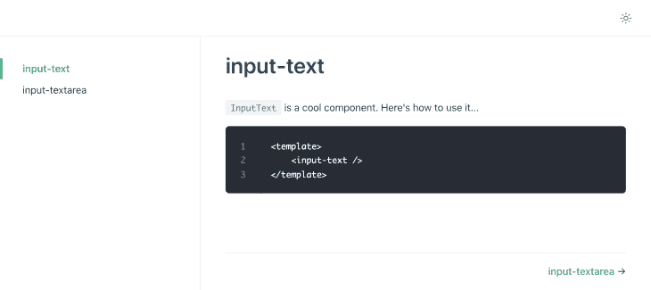
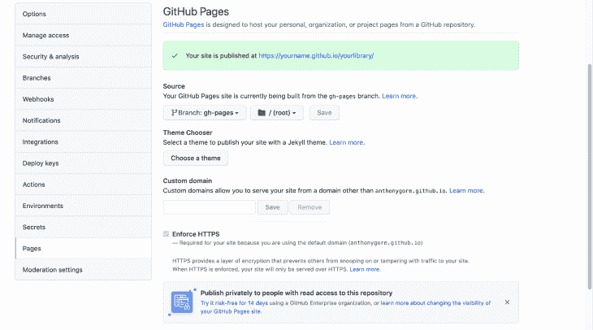

# 构建 Vue 3 组件库

> 原文：<https://blog.logrocket.com/building-vue-3-component-library/>

组件库是将通用 UI 解决方案收集到一个包中的好方法，您可以在自己的项目中重用该包，或者与 Vue 开源社区共享该包。

在本指南中，您将学习创建 [Vue 3](https://v3.vuejs.org/) 组件库的关键步骤，包括:

*   使用 Vue 3 设置组件库
*   创建插件以在项目中安装组件库
*   在 npm 上发布库
*   使用 [VuePress](https://vuepress.vuejs.org/) 创建文档
*   在 GitHub 上发布文档

我们开始吧！

## 基本设置

为了创建我们的组件库，我们不会使用 Vue.js 项目的正常搭建过程，即 Vue CLI。相反，我们将从头开始创建一个项目文件夹，在那里我们将初始化 npm 和 [Git](https://git-scm.com/) 。

```
$ mkdir vue3-component-library
$ cd vue3-component-library
$ npm init -y
$ git init
$ touch .gitignore
$ echo 'node_modules' >> .gitignore

```

在本教程结束时，我们将拥有如下所示的文件夹结构:

```
.gitignore
package.json
rollup.config.js
dist/
  library.mjs
  library.js
docs/
  .vuepress
  components
node_modules/
src/
  InputText.vue
  InputTextarea.vue

```

## 在 Vue 中创建组件

当然，组件库需要一些组件。让我们创建一个`src`文件夹，并添加以下两个简单的 Vue 3 组件:

> 请注意，我有意将这些组件保持简单，以确保本文将重点放在发布组件上。实际上，您的组件要比这些复杂和有趣得多。

`src/InputText.vue`

```
<template>
    <input type="text" />
</template>
<script>
export default {
  name: 'InputText'
}
</script>

```

`src/InputTextarea.vue`

```
<template>
    <textarea />
</template>
<script>
export default {
  name: 'InputTextarea'
}
</script>

```

## 创建插件

接下来，我们将创建一个文件，注册我们希望在库中共享的所有组件。我们称之为`components.js`，在其中，我们简单地导入组件，然后在单个对象中导出它们。

`src/components.js`

```
import InputText from './InputText.vue'
import InputTextarea from './InputTextarea.vue'

export default { InputTextarea, InputText }

```

我们现在将创建一个 Vue 3 插件，它将在一个消费项目中从你的库中全局注册组件。

在文件的顶部，我们将导入注册的组件。然后，在插件安装方法中，我们将迭代 components 对象，并在 Vue 实例上全局注册每个组件。

`src/index.js`

```
import components from'./components'

const plugin = {
  install (Vue) {
    for (const prop in components) {
      if (components.hasOwnProperty(prop)) {
        const component = components[prop]
        Vue.component(component.name, component)
      }
    }
  }
}

export default plugin

```

任何使用这个库的项目都需要安装 Vue 3，所以让我们把它作为一个对等依赖添加到`package.json`中，这样如果用户没有 Vue 3，npm 就会警告用户。

```
{
  "peerDependencies": {
    "vue": "^3.2.21"
  }
}

```

## 构建插件

我们现在需要创建一个将在 npm 模块中共享的库版本。为此，我们将使用[汇总](https://rollupjs.org/guide/en/)捆绑器结合 [Vue 汇总插件](https://rollup-plugin-vue.vuejs.org/)和[汇总插件对等 Deps 外部](https://www.npmjs.com/package/rollup-plugin-peer-deps-external)。使用这些，我们将能够轻松地为多种环境创建高效的构建:

```
$ npm i -D rollup rollup-plugin-vue rollup-plugin-peer-deps-external

```

> 注意安装命令中的`-D`标志。重要的是将这些插件作为开发依赖项安装，以确保它们不会被安装在用户的项目中！

现在让我们通过在项目的根目录下创建一个`rollup.config.js`文件来配置 Rollup。为了提供足够的灵活性，您可能需要为这些场景创建不同的版本:

然而，我刚刚在下面展示了如何配置 CommonJS 和 ES 模块。您可以在 [Vue 汇总文档](https://rollup-plugin-vue.vuejs.org/examples.html)中找到其他构建类型的详细信息。

注意，我们添加了`vue`插件，它编译我们的组件模板，还添加了`peerDepsExternal`插件，它自动将对等依赖(即 Vue 3)外部化，以确保它们不包含在您的构建中。

`rollup.config.js`

```
import vue from 'rollup-plugin-vue'
import peerDepsExternal from 'rollup-plugin-peer-deps-external'

export default [
  {
    input: 'src/index.js',
    output: [
      {
        format: 'esm',
        file: 'dist/library.mjs'
      },
      {
        format: 'cjs',
        file: 'dist/library.js'
      }
    ],
    plugins: [
      vue(), peerDepsExternal()
    ]
  }
]

```

为了运行构建，我们将在`package.json`中创建一个构建脚本。

```
{
    "scripts": {
      "build": "rollup -c"
    }
}

```

一旦我们运行`npm run build`，您将看到两个新文件被创建，`dist/library.mjs`和`dist/library.js`，它们分别是您的 es 模块和 CommonJS 构建。

## 发布插件

为了分发我们的组件库，我们将把它发布到 npm 注册中心。第一步是确保您的`package.json`文件具有发布所需的配置。您需要的基本价值是:

*   `name`:这在整个 npm 中必须是唯一的，因此可以在前面加上`@yourname/`
*   `version`:从 0.0.1 开始(或者你喜欢的任何地方)，每次更新你的库时递增。在这里了解更多关于语义版本的信息
*   这是访问您的包的“入口文件”。这应该指向 CommonJS 构建文件
*   `module`:与`main`相同，但应指向 ES 模块构建文件
*   这是 npm 将在发布的包中包含的文件的白名单。因为我们的构建文件是自包含的，所以我们只需要包含`dist`

```
{
  "name": "@yourname/yourlibrary",
  "version": "0.0.1",
  "main": "dist/library.js",
  "module": "dist/library.mjs",
  "files": [
    "dist/*"
  ]
}
```

> 如果您想允许您的组件在没有插件的情况下单独导入，您可能还想将您的组件源文件添加到`package.json`中的`files`白名单中。

既然我们的包配置正确，让我们发布它。在终端中运行`npm login`以确保您登录到 npm。然后运行`npm publish --access=public`来发布您的包。

```
$ npm login
$ npm publish --access=public

```

一旦完成，我们就可以检查 npm 注册表，看看是否能找到我们发布的包。运行`npm view @yourname/yourlibrary`。如果发布成功，您将在控制台中看到软件包信息。

## 使用已发布的 Vue 3 库

现在我们的组件库已经在 npm 上公开发布了，我们可以像使用任何其他 npm 模块一样在项目中使用它。

* * *

### 更多来自 LogRocket 的精彩文章:

* * *

以下是如何使用 ES 模块将库包含在 Vue 3 项目中。一旦插件安装完毕，你就可以在这个项目的任何 Vue 模板中引用你的组件了。

```
import { createApp } from 'vue'
import App from './App.vue'

import plugin from '@yourname/yourlibrary'

createApp(App)
  .use(plugin)
  .mount('#app')

```

## 设置文档网站

您的库现在可以使用了，但是我们还没有完成！如果你要发布一个组件库，你需要提供文档以便开发者知道如何使用它。

幸运的是，Vue 生态系统有自己的文档框架，非常适合这项工作:VuePress。VuePress 允许你创建一个简单但好看的静态文档网站，里面有降价内容。

因为我们的项目是 Vue 3，我们需要 VuePress v2。这个版本还在测试中，我们可以用包版本`[[email protected]](/cdn-cgi/l/email-protection)`来安装。

```
$ npm i -D [email protected]

```

为了设置我们的文档，我们将首先创建一个目录`docs`，并添加文件 [README.md](http://README.md) ，VuePress 将使用该文件作为主页的内容。

与您见过的大多数 docs 站点一样，主页是提供库简介、快速入门说明等的好地方。

```
# My Component library

Here's a brief introduction.

### Installation

$ npm install @yourname/yourlibrary

```

## 运行 vexpress dev 服务器

我们现在将向`package.json`添加两个脚本，一个用于运行 VuePress dev 服务器，另一个用于创建生产版本。

```
"scripts": {
  "build": "rollup -c",
  "docs:dev": "vuepress dev docs",
  "docs:build": "vuepress build docs"
},

```

让我们用命令`npm run docs:dev`运行开发服务器。第一次运行时，VuePress 会创建一个名为`docs/.vuepress`的子文件夹，稍后我们会添加更多的配置。

## 在 Vue 3 中记录组件

为了在库中记录这两个组件，让我们在另一个新的子文件夹`docs/components`中创建两个 markdown 文件。在这些文件中，您将解释组件 API，提供使用示例，以及任何对用户有帮助的东西。

```
# input-text

`InputText` is a cool component. Here's how to use it...

<template>
  <input-text />
</template>

```

> 除了常规的降价文本和代码，VuePress 还允许通过将组件安装到 docs 页面中的 Vue 实例来进行交互式组件演示。你可以在这里了解更多关于那个[。](https://dev.to/siegerts/creating-a-vue-js-component-library-part-iv-documentation-with-vuepress-56h5)

当 VuePress 运行时，这些降价文件将作为页面发布。为了使这些页面可访问，我们将通过向 VuePress 配置文件添加以下主题信息来将它们添加到 docs 侧栏:

```
module.exports = {
  themeConfig: {
    sidebar: [
      {
        title: 'Components',
        collapsable: false,
        children: [
          '/components/input-text.md',
          '/components/input-textarea.md'
        ]
      }
    ]
  }
}

```

检查浏览器。您的 VuePress 网站现在看起来像这样:



## 将文档发布到 GitHub 页面

为了公开发布我们的文档，我们可以使用 [GitHub Pages](https://pages.github.com/) ，它允许免费的静态托管。

假设您不想要自定义域，您的 Pages 站点 URL 可能是这样的:

```
https://<yourname>.github.io/<yourlibrary>/

```

需要注意的重要一点是，它将位于一个子文件夹中，而不是根目录中。因此，您需要在 VuePress 配置中提供一个`base`配置选项，以便相对路径能够正确工作。

`docs/.vuepress/config.js`

```
module.exports = {
  ...
  base: '/yourlibrary/'
}

```

完成后，我们现在将创建一个部署脚本。这个脚本将构建文档，将构建提交到分支`gh-pages`，然后将提交推送到 GitHub，在那里发布。

如果您还没有，请确保您的组件库已经发布到 GitHub `(yourname/yourlibrary)`。运行脚本，您的静态构建将被推送到 repo。

`deploy.sh`

```
#!/usr/bin/env sh

set -e

npm run docs:build
cd docs/.vuepress/dist

git init
git add -A
git commit -m 'deploy'

git push -f [email protected]:yourname/yourlibrary.git master:gh-pages

cd -

```

要让 GitHub 发布站点，可以在 repo 设置中打开 Pages 功能。确保从根目录中选择分支`gh-pages`和源文件。



## 结论

在本文中，我们看到了如何创建 Vue 3 组件库并将其发布到 npm，以及在 GitHub 页面上发布文档。

有了这个方法，您可以创建库，这些库将允许您自己的项目之间的一致性，或者向 Vue 社区提供一些优秀的开源组件。

## 像用户一样体验您的 Vue 应用

调试 Vue.js 应用程序可能会很困难，尤其是当用户会话期间有几十个(如果不是几百个)突变时。如果您对监视和跟踪生产中所有用户的 Vue 突变感兴趣，

[try LogRocket](https://lp.logrocket.com/blg/vue-signup)

.

[](https://lp.logrocket.com/blg/vue-signup)[https://logrocket.com/signup/](https://lp.logrocket.com/blg/vue-signup)

LogRocket 就像是网络和移动应用程序的 DVR，记录你的 Vue 应用程序中发生的一切，包括网络请求、JavaScript 错误、性能问题等等。您可以汇总并报告问题发生时应用程序的状态，而不是猜测问题发生的原因。

LogRocket Vuex 插件将 Vuex 突变记录到 LogRocket 控制台，为您提供导致错误的环境，以及出现问题时应用程序的状态。

现代化您调试 Vue 应用的方式- [开始免费监控](https://lp.logrocket.com/blg/vue-signup)。