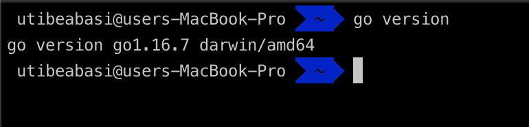
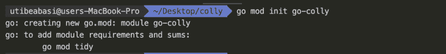
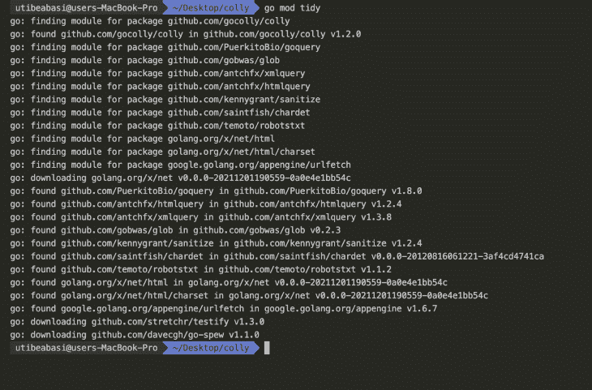
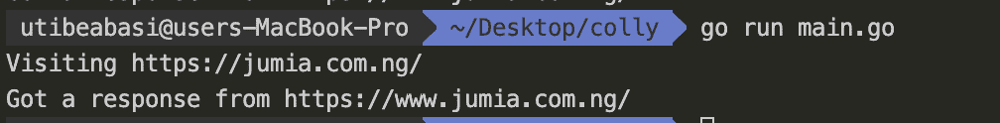
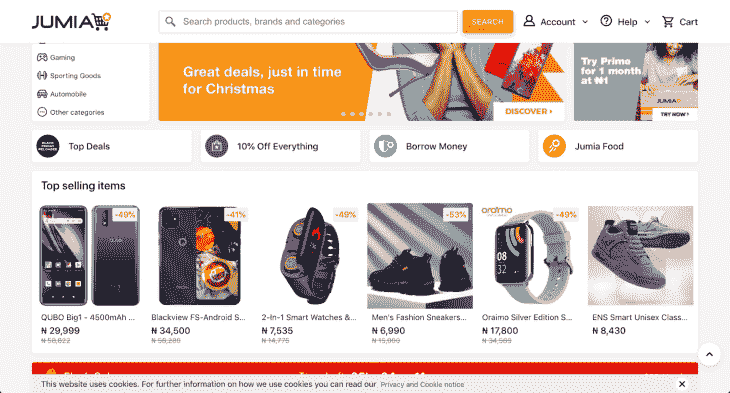
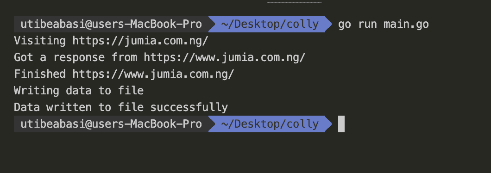

# 使用 Colly 构建 web scraper

> 原文：<https://blog.logrocket.com/building-web-scraper-go-colly/>

## 介绍

构建应用程序时，您可能需要从一些网站或其他来源提取数据，以便与您的应用程序集成。有些网站公开了一个 API，你可以用它来获取这些信息，而有些网站没有。在这种情况下，您可能需要自己从网站中提取数据。这就是所谓的网页抓取。

Web 抓取是通过获取数据、选择相关部分并以可读或可解析的格式呈现它们来从网站中提取数据。

在本教程中，我们将了解一个允许我们构建 web scrapers 的 Go 包，Colly，我们将构建一个基本的 web scraper，它从电子商务商店获取产品信息并将数据保存到 JSON 文件中。事不宜迟，我们开始吧！

## 科里简介

Colly 是一个 Go 框架，允许你创建网页抓取器、爬虫或蜘蛛。根据官方文档，Colly 允许您轻松地从网站中提取结构化数据，这些数据可用于广泛的应用程序，如数据挖掘、数据处理或归档。以下是 Colly 的一些特点:

*   速度:Colly 快。单核上超过 1k 请求/秒
*   同步/异步/并行抓取
*   支持缓存
*   支持 robots.txt

这里有一个 [Colly 官网](http://go-colly.org)的链接，可以了解更多。现在我们对 Colly 有了一些了解，让我们用它来构建一个 web scraper。

## 先决条件

要跟随本教程，您需要在您的本地机器上安装 Go，并且您至少需要有 Go 的基本知识。[按照这里的步骤](https://go.dev/dl/)进行安装。

确保您可以在终端中运行 Go 命令。要检查这一点，请在终端中键入命令和 go 版本。您应该会得到类似如下的输出



## 钻研代码

好了，让我们开始写一些代码。创建一个名为`main.go`的文件，并添加以下代码:

```
package main

import (
   "github.com/gocolly/colly"
)

func main() {
   c := colly.NewCollector()
   c.Visit("https://jumia.com.ng")
}

```

让我们看看每一行代码都做了什么。首先，`package main`指令告诉 Go 这个文件是主包的一部分。接下来，我们正在导入 Colly，最后，我们有我们的主函数。main 函数是任何 Go 程序的入口点，这里我们实例化了一个 Colly collector 对象的新实例。

收集器对象是使用 Colly 进行网页抓取的核心。它允许您在事件发生时触发某些功能，例如请求成功完成、收到响应等。

让我们来看看这些方法中的一些。将您的`main.go`文件修改为:

```
package main

import (
   "fmt"
   "time"

   "github.com/gocolly/colly"
)

func main() {
   c := colly.NewCollector()
   c.SetRequestTimeout(120 * time.Second)
   c.OnRequest(func(r *colly.Request) {
       fmt.Println("Visiting", r.URL)
   })

   c.OnResponse(func(r *colly.Response) {
       fmt.Println("Got a response from", r.Request.URL)
   })

   c.OnError(func(r *colly.Response, e error) {
       fmt.Println("Got this error:", e)
   })

   c.Visit("https://jumia.com.ng/")
}

```

首先，我们导入 Go fmt 包，它允许我们将文本打印到控制台。我们也在导入时间包。这允许我们增加 Colly 的超时持续时间，以防止我们的 web scraper 过快失败。

接下来，在我们的 main 方法中，我们将请求超时设置为`120`秒，并调用三个回调函数。

首先是`OnRequest`。每当 Colly 发出请求时，这个回调就会运行。这里我们只是打印出`"Visiting"`和请求 URL。

接下来是`OnResponse`。每当 Colly 收到响应时，这个回调就会运行。我们还将打印出`"Got a response from"`以及请求 URL。

我们收到的最后一个回电是`OnError`。每当 Colly 在发出请求时遇到错误，它就会运行。

在运行之前，您需要做几件事情:

首先，初始化当前目录中的 Go 模块。为此，使用`go mod init`命令:



接下来，运行`go mod tidy`获取所有依赖项:



现在，让我们测试目前为止的代码。运行`go run main.go`运行 Go 程序:



正如你所看到的，我们已经成功地向 jumia.com.ng 提出了请求，并得到了回应。

## 分析 Jumia 网站

好了，我们已经建立了我们的网页抓取器的基础，但在我们继续之前，让我们分析一下我们要抓取的网站。在浏览器中导航到 URL[https://jumia.com.ng](https://jumia.com.ng)，让我们看看 DOM 结构。



如你所见，网站上有一堆卡片，上面有产品信息。让我们在浏览器的开发工具中检查这些卡。右键点击卡片，点击**检查**，或者点击**Shift+Ctrl+J**(Windows 上)或者**option+command+J**(Mac 上)，打开开发工具。


从上面我们可以看到，单品卡是一个`a`标签，带有一个`core`类。这里面有各种各样的`div`元素，嵌套有`name`、`prc`和`tag _dsct`类。这些`div`分别包含产品名称、价格和折扣。在 Colly 中，我们可以使用 CSS 选择器来选择这些元素并提取标签。

现在，让我们定义单个产品的结构。在 main 方法上方，添加以下代码:

```
type Product struct {
   Name     string
   Image    string
   Price    string
   Url      string
   Discount string
}

```

这里，我们定义一个结构来保存每个产品的名称、图片(URL)、价格、URL 和折扣。现在，将您的 main 方法修改为:

```
func main() {
   c := colly.NewCollector()
   c.SetRequestTimeout(120 * time.Second)
   products := make([]Product, 0)

   // Callbacks

   c.OnHTML("a.core", func(e *colly.HTMLElement) {
       e.ForEach("div.name", func(i int, h *colly.HTMLElement) {
           item := Product{}
           item.Name = h.Text
           item.Image = e.ChildAttr("img", "data-src")
           item.Price = e.Attr("data-price")
           item.Url = "https://jumia.com.ng" + e.Attr("href")
           item.Discount = e.ChildText("div.tag._dsct")
           products = append(products, item)
       })

   })

   c.OnRequest(func(r *colly.Request) {
       fmt.Println("Visiting", r.URL)
   })

   c.OnResponse(func(r *colly.Response) {
       fmt.Println("Got a response from", r.Request.URL)
   })

   c.OnError(func(r *colly.Response, e error) {
       fmt.Println("Got this error:", e)
   })

   c.OnScraped(func(r *colly.Response) {
       fmt.Println("Finished", r.Request.URL)
       js, err := json.MarshalIndent(products, "", "    ")
       if err != nil {
           log.Fatal(err)
       }
       fmt.Println("Writing data to file")
       if err := os.WriteFile("products.json", js, 0664); err == nil {
           fmt.Println("Data written to file successfully")
       }

   })

   c.Visit("https://jumia.com.ng/")
}

```

哇，这里发生了很多事。让我们看看这段代码在做什么。

首先，我们创建一个产品数组，并将其赋给`products`变量。

接下来，我们再添加两个回调:`OnHTML`和`OnScraped`。

当 web scraper 收到一个 HTML 响应时，`OnHTML`回调就会运行。它接受两个参数:CSS 选择器和要运行的实际函数。这个回调用 CSS 选择器选择元素，并调用响应的第二个参数中定义的函数。

向该函数传递从 CSS 选择器返回的 HTML 元素，并对其执行一些操作。这里，我们选择类名为`core`的所有`a`元素。然后我们遍历结果，再次选择所有嵌套在其中的带有类`name`的`div`。从那里，我们创建了一个`Product`结构的实例，并将其名称指定为从`div`获得的文本。

* * *

### 更多来自 LogRocket 的精彩文章:

* * *

我们使用`e.ChildAttr`函数获取嵌套在其中的第一个图像标签的`data-src`属性，并将其指定为产品的图像。我们使用`e.Attr`函数获取元素的`data-price`属性，并将其设置为产品的价格。我们用同样的方法从`href`属性中获得它的 URL。最后，我们使用`e.ChildText`函数从具有`tag _dsct`类的`div`元素中选择文本，并将其设置为产品的折扣。

接下来，我们将产品添加到我们之前创建的产品列表中。

我们定义的第二个回调是`OnScraped`回调。当程序成功完成 web 抓取作业并即将退出时运行。这里，我们打印出``"`完成的``"`以及请求 URL，然后将产品列表转换成 JSON 对象。

确保首先导入编码/json 包。注意，我们使用`json.MarshalIndent`函数来对 JSON 对象应用一些格式和缩进。最后，我们将抓取结果保存到一个文件中。

## 运行我们的程序

现在代码都完成了，让我们运行我们的程序。在我们这样做之前，这里有完整的代码作为参考:

```
package main

import (
   "encoding/json"
   "fmt"
   "log"
   "os"
   "time"

   "github.com/gocolly/colly"
)

type Product struct {
   Name     string
   Image    string
   Price    string
   Url      string
   Discount string
}

func main() {
   c := colly.NewCollector()
   c.SetRequestTimeout(120 * time.Second)
   products := make([]Product, 0)

   // Callbacks

   c.OnHTML("a.core", func(e *colly.HTMLElement) {
       e.ForEach("div.name", func(i int, h *colly.HTMLElement) {
           item := Product{}
           item.Name = h.Text
           item.Image = e.ChildAttr("img", "data-src")
           item.Price = e.Attr("data-price")
           item.Url = "https://jumia.com.ng" + e.Attr("href")
           item.Discount = e.ChildText("div.tag._dsct")
           products = append(products, item)
       })

   })

   c.OnRequest(func(r *colly.Request) {
       fmt.Println("Visiting", r.URL)
   })

   c.OnResponse(func(r *colly.Response) {
       fmt.Println("Got a response from", r.Request.URL)
   })

   c.OnError(func(r *colly.Response, e error) {
       fmt.Println("Got this error:", e)
   })

   c.OnScraped(func(r *colly.Response) {
       fmt.Println("Finished", r.Request.URL)
       js, err := json.MarshalIndent(products, "", "    ")
       if err != nil {
           log.Fatal(err)
       }
       fmt.Println("Writing data to file")
       if err := os.WriteFile("products.json", js, 0664); err == nil {
           fmt.Println("Data written to file successfully")
       }

   })

   c.Visit("https://jumia.com.ng/")
}

```

在您的终端中，运行命令`go run main.go`。



太好了！有用！现在，您应该看到一个名为`products.json`的新文件已经创建。


打开这个文件，你会看到刮结果。

## 包扎

在这篇文章中，我们成功地用 Go 构建了一个 web scraper。我们研究了如何从电子商务商店获取产品信息。我希望你学到了很多，并将这些应用到你的个人项目中。

## 使用 [LogRocket](https://lp.logrocket.com/blg/signup) 消除传统错误报告的干扰

[](https://lp.logrocket.com/blg/signup)

[LogRocket](https://lp.logrocket.com/blg/signup) 是一个数字体验分析解决方案，它可以保护您免受数百个假阳性错误警报的影响，只针对几个真正重要的项目。LogRocket 会告诉您应用程序中实际影响用户的最具影响力的 bug 和 UX 问题。

然后，使用具有深层技术遥测的会话重放来确切地查看用户看到了什么以及是什么导致了问题，就像你在他们身后看一样。

LogRocket 自动聚合客户端错误、JS 异常、前端性能指标和用户交互。然后 LogRocket 使用机器学习来告诉你哪些问题正在影响大多数用户，并提供你需要修复它的上下文。

关注重要的 bug—[今天就试试 LogRocket】。](https://lp.logrocket.com/blg/signup-issue-free)