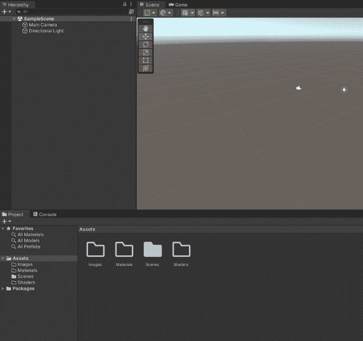
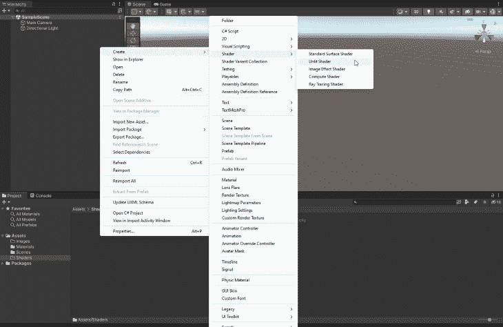
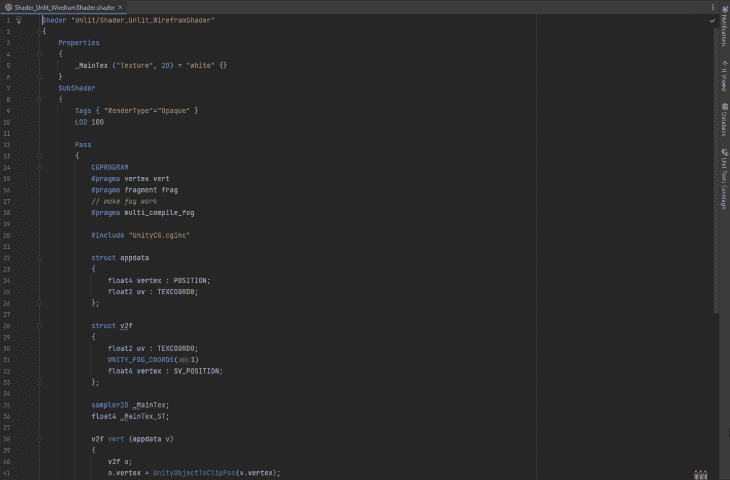
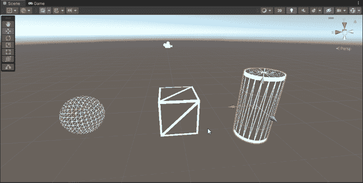
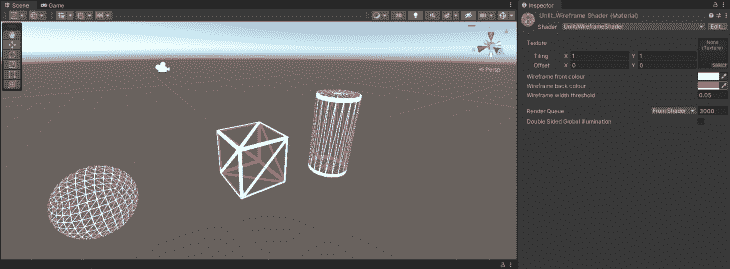

# 使用 Unity 和 Unity 着色器图形构建线框着色器

> 原文：<https://blog.logrocket.com/building-wireframe-shader-unity/>

在这个 Unity 教程中，我们将使用 Unity 的 ShaderLab 代码在 Unity 中创建一个线框着色器。本教程适合熟悉 Unity 编辑器界面和熟悉代码的人。

线框着色器可以在许多不同的情况下使用，包括原型制作，为游戏中的对象创建一个酷的 AR 或控制论的感觉，创建一个类似网络的材料，或者只是帮助您查看您正在处理的对象的线框形状(尽管，由于 Unity 在场景窗口中将此作为着色模式选项之一，我建议您只是使用它而不是构建一个着色器来查看对象形状)。


## 项目设置

太好了！现在我们已经创建了线框纹理，我们可以继续创建项目，我们将在其中工作，并创建我们的着色器。为此，在 Unity Hub 中创建新的 3D 项目，并等待 Unity 完成项目创建。

然后我创建了三个文件夹，即一个**材质**文件夹，一个**着色器**文件夹，和一个**图像**文件夹。



## 创建着色器

让我们通过创建材质来设置我们的着色器。在**着色器**文件夹中，右击空白区域，从上下文菜单中选择**创建**，然后选择**着色器**和**无光着色器**。



让我们按照我们项目的命名约定来命名吧，在我的项目中是**Type _ Description _ subdescriptionifneed**，称之为**Shader _ Unlit _ WireframShader**。

双击你新创建的着色器，它应该在分配给你的 Unity 编辑器的 IDE 中打开。(我将编辑默认的着色器，这样你就可以按照每一步的方式。)



让我们将我们想要执行的队列**更改为**透明**，并将**混合**设置为 **SrcAlpha OneMinusSrcAlpha** :**

```
Shader "Unlit/Shader_Unlit_WireframShader"
{
    Properties
    {
        _MainTex ("Texture", 2D) = "white" {}
    }
    SubShader
    {
        **Tags { "RenderType"="Opaque" "Queue"="Transparent" }**
        LOD 100
                **Blend SrcAlpha OneMinusSrcAlpha**

        Pass
        {
            CGPROGRAM
            #pragma vertex vert
            #pragma fragment frag
            // make fog work
            #pragma multi_compile_fog

            #include "UnityCG.cginc"

            struct appdata
            {
                float4 vertex : POSITION;
                float2 uv : TEXCOORD0;
            };

            struct v2f
            {
                float2 uv : TEXCOORD0;
                UNITY_FOG_COORDS(1)
                float4 vertex : SV_POSITION;
            };

            sampler2D _MainTex;
            float4 _MainTex_ST;

            v2f vert (appdata v)
            {
                v2f o;
                o.vertex = UnityObjectToClipPos(v.vertex);
                o.uv = TRANSFORM_TEX(v.uv, _MainTex);
                UNITY_TRANSFER_FOG(o,o.vertex);
                return o;
            }

            fixed4 frag (v2f i) : SV_Target
            {
                // sample the texture
                fixed4 col = tex2D(_MainTex, i.uv);
                // apply fog
                UNITY_APPLY_FOG(i.fogCoord, col);
                return col;
            }
            ENDCG
        }
    }
},

```

在我们的属性中，让我们为线框的正面、背面、颜色和宽度添加变量:

```
Shader "Unlit/Shader_Unlit_WireframShader"
{
    Properties
    {
        _MainTex ("Texture", 2D) = "white" {}
                **_WireframeFrontColour("Wireframe front colour", color) = (1.0, 1.0, 1.0, 1.0)
        _WireframeBackColour("Wirefram back colour", color) = (0.5, 0.5, 0.5, 1.0)
        _WireframeWidth("Wireframe Width", float) = 0.05**
    }
    SubShader
    {
        **Tags { "RenderType"="Opaque" "Queue"="Transparent" }**
        LOD 100
                **Blend SrcAlpha OneMinusSrcAlpha**

        Pass
        {
            CGPROGRAM
            #pragma vertex vert
            #pragma fragment frag
            // make fog work
            #pragma multi_compile_fog

            #include "UnityCG.cginc"

            struct appdata
            {
                float4 vertex : POSITION;
                float2 uv : TEXCOORD0;
            };

            struct v2f
            {
                float2 uv : TEXCOORD0;
                UNITY_FOG_COORDS(1)
                float4 vertex : SV_POSITION;
            };

            sampler2D _MainTex;
            float4 _MainTex_ST;

            v2f vert (appdata v)
            {
                v2f o;
                o.vertex = UnityObjectToClipPos(v.vertex);
                o.uv = TRANSFORM_TEX(v.uv, _MainTex);
                UNITY_TRANSFER_FOG(o,o.vertex);
                return o;
            }

            fixed4 frag (v2f i) : SV_Target
            {
                // sample the texture
                fixed4 col = tex2D(_MainTex, i.uv);
                // apply fog
                UNITY_APPLY_FOG(i.fogCoord, col);
                return col;
            }
            ENDCG
        }
    }
},

```

## 创建着色器的过程

我们必须为这个着色器创建两个过程。首先，我们将为前向三角形创建通道。然而，由于创建后向三角形的过程与创建前向三角形的过程几乎相同，所以我们将创建前向三角形，我也将向您展示后向三角形的代码。

我们可以从关注前向三角形开始，使用**剔除后向**来移除后向三角形:

```
Shader "Unlit/Shader_Unlit_WireframShader"
{
    Properties
    {
        _MainTex ("Texture", 2D) = "white" {}
                **_WireframeFrontColour("Wireframe front colour", color) = (1.0, 1.0, 1.0, 1.0)
        _WireframeBackColour("Wirefram back colour", color) = (0.5, 0.5, 0.5, 1.0)
        _WireframeWidth("Wireframe Width", float) = 0.05**
    }
    SubShader
    {
        **Tags { "RenderType"="Opaque" "Queue"="Transparent" }**
        LOD 100
                **Blend SrcAlpha OneMinusSrcAlpha**

        Pass
        {
                        **Cull Back**
            CGPROGRAM
            #pragma vertex vert
            #pragma fragment frag
            // make fog work
            #pragma multi_compile_fog

            #include "UnityCG.cginc"

            struct appdata
            {
                float4 vertex : POSITION;
                float2 uv : TEXCOORD0;
            };

            struct v2f
            {
                float2 uv : TEXCOORD0;
                UNITY_FOG_COORDS(1)
                float4 vertex : SV_POSITION;
            };

            sampler2D _MainTex;
            float4 _MainTex_ST;

            v2f vert (appdata v)
            {
                v2f o;
                o.vertex = UnityObjectToClipPos(v.vertex);
                o.uv = TRANSFORM_TEX(v.uv, _MainTex);
                UNITY_TRANSFER_FOG(o,o.vertex);
                return o;
            }

            fixed4 frag (v2f i) : SV_Target
            {
                // sample the texture
                fixed4 col = tex2D(_MainTex, i.uv);
                // apply fog
                UNITY_APPLY_FOG(i.fogCoord, col);
                return col;
            }
            ENDCG
        }
    }
},

```

太好了。`#pragma`行定义了我们将要使用的每个函数。`fragment`着色器是我们处理三角形颜色的地方，但是我们不需要改变`vertex`函数。

然而，我们确实需要添加一个自定义的`geometry`函数，因为我们想要为每个三角形添加坐标:

```
Shader "Unlit/Shader_Unlit_WireframShader"
{
    Properties
    {
        _MainTex ("Texture", 2D) = "white" {}
                **_WireframeFrontColour("Wireframe front colour", color) = (1.0, 1.0, 1.0, 1.0)
        _WireframeBackColour("Wirefram back colour", color) = (0.5, 0.5, 0.5, 1.0)
        _WireframeWidth("Wireframe Width", float) = 0.05**
    }
    SubShader
    {
        **Tags { "RenderType"="Opaque" "Queue"="Transparent" }**
        LOD 100
                **Blend SrcAlpha OneMinusSrcAlpha**

        Pass
        {
                        **Cull Back**
            CGPROGRAM
            #pragma vertex vert
            #pragma fragment frag
                        **#pragma geometry geom**
            // make fog work
            #pragma multi_compile_fog

            #include "UnityCG.cginc"

            struct appdata
            {
                float4 vertex : POSITION;
                float2 uv : TEXCOORD0;
            };

            struct v2f
            {
                float2 uv : TEXCOORD0;
                UNITY_FOG_COORDS(1)
                float4 vertex : SV_POSITION;
            };

            sampler2D _MainTex;
            float4 _MainTex_ST;

            v2f vert (appdata v)
            {
                v2f o;
                o.vertex = UnityObjectToClipPos(v.vertex);
                o.uv = TRANSFORM_TEX(v.uv, _MainTex);
                UNITY_TRANSFER_FOG(o,o.vertex);
                return o;
            }

            fixed4 frag (v2f i) : SV_Target
            {
                // sample the texture
                fixed4 col = tex2D(_MainTex, i.uv);
                // apply fog
                UNITY_APPLY_FOG(i.fogCoord, col);
                return col;
            }
            ENDCG
        }
    }
},

```

现在，让我们创建一个`g2f` **(几何)**结构来存放三角形的[重心坐标](https://en.wikipedia.org/wiki/Barycentric_coordinate_system)。我们需要添加`position`以及一个名为`barycentric`的额外浮点，我们将把它分配给`TEXCOORD0`:

```
Shader "Unlit/Shader_Unlit_WireframShader"
{
    Properties
    {
        _MainTex ("Texture", 2D) = "white" {}
        _WireframeFrontColour("Wireframe front colour", color) = (1.0, 1.0, 1.0, 1.0)
        _WireframeBackColour("Wirefram back colour", color) = (0.5, 0.5, 0.5, 1.0)
        _WireframeWidth("Wireframe Width", float) = 0.05
    }
    SubShader
    {
        Tags { "RenderType"="Opaque" "Queue"="Transparent" }
        LOD 100
        Blend SrcAlpha OneMinusSrcAlpha

        Pass
        {
            Cull Back
            CGPROGRAM
            #pragma vertex vert
            #pragma fragment frag
            #pragma geometry geom
            // make fog work
            #pragma multi_compile_fog

            #include "UnityCG.cginc"

            struct appdata
            {
                float4 vertex : POSITION;
                float2 uv : TEXCOORD0;
            };

            struct v2f
            {
                float2 uv : TEXCOORD0;
                UNITY_FOG_COORDS(1)
                float4 vertex : SV_POSITION;
            };

                        **struct g2f
            {
                float4 pos : SV_POSITION;
                float3 barycentric : TEXTCOORD0;
            };**

            sampler2D _MainTex;
            float4 _MainTex_ST;

            v2f vert (appdata v)
            {
                v2f o;
                o.vertex = UnityObjectToClipPos(v.vertex);
                o.uv = TRANSFORM_TEX(v.uv, _MainTex);
                UNITY_TRANSFER_FOG(o,o.vertex);
                return o;
            }

            fixed4 frag (v2f i) : SV_Target
            {
                // sample the texture
                fixed4 col = tex2D(_MainTex, i.uv);
                // apply fog
                UNITY_APPLY_FOG(i.fogCoord, col);
                return col;
            }
            ENDCG
        }
    }
}

```

我们的`geometry`函数将一次处理一个三角形，每个三角形有三个顶点。对于每个三角形，我们将通过顶点的`position`(这是默认的几何函数会做的)，但是我们还想在我们刚刚创建的结构中填充我们的`barycentric`变量:

```
Shader "Unlit/Shader_Unlit_WireframShader"
{
    Properties
    {
        _MainTex ("Texture", 2D) = "white" {}
        _WireframeFrontColour("Wireframe front colour", color) = (1.0, 1.0, 1.0, 1.0)
        _WireframeBackColour("Wirefram back colour", color) = (0.5, 0.5, 0.5, 1.0)
        _WireframeWidth("Wireframe Width", float) = 0.05
    }
    SubShader
    {
        Tags { "RenderType"="Opaque" "Queue"="Transparent" }
        LOD 100
        Blend SrcAlpha OneMinusSrcAlpha

        Pass
        {
            Cull Back
            CGPROGRAM
            #pragma vertex vert
            #pragma fragment frag
            #pragma geometry geom
            // make fog work
            #pragma multi_compile_fog

            #include "UnityCG.cginc"

            struct appdata
            {
                float4 vertex : POSITION;
                float2 uv : TEXCOORD0;
            };

            struct v2f
            {
                float2 uv : TEXCOORD0;
                UNITY_FOG_COORDS(1)
                float4 vertex : SV_POSITION;
            };

                        **struct g2f
            {
                float4 pos : SV_POSITION;
                float3 barycentric : TEXTCOORD0;
            };**

            sampler2D _MainTex;
            float4 _MainTex_ST;

            v2f vert (appdata v)
            {
                v2f o;
                o.vertex = UnityObjectToClipPos(v.vertex);
                o.uv = TRANSFORM_TEX(v.uv, _MainTex);
                UNITY_TRANSFER_FOG(o,o.vertex);
                return o;
            }

            fixed4 frag (v2f i) : SV_Target
            {
                // sample the texture
                fixed4 col = tex2D(_MainTex, i.uv);
                // apply fog
                UNITY_APPLY_FOG(i.fogCoord, col);
                return col;
            }

                        **// This applies the barycentric coordinates to each vertex in a triangle.
            [maxvertexcount(3)]
            void geom(triangle v2f IN[3], inout TriangleStream<g2f> triStream) {
                g2f o;
                o.pos = IN[0].vertex;
                o.barycentric = float3(1.0, 0.0, 0.0);
                triStream.Append(o);
                o.pos = IN[1].vertex;
                o.barycentric = float3(0.0, 1.0, 0.0);
                triStream.Append(o);
                o.pos = IN[2].vertex;
                o.barycentric = float3(0.0, 0.0, 1.0);
                triStream.Append(o);
            }**
            ENDCG
        }
    }
}

```

现在我们已经创建了`geometry`函数，让我们来看看片段着色器(它为每个像素调用)，我们的目标是如果像素靠近边缘，它就变成白色，而离边缘越远，它就越透明。

既然知道边上的最小坐标值是 0，就可以取我们三个重心坐标的最小值。如果我们靠近门槛，靠近边缘，我们应该把它涂成白色:

```
Shader "Unlit/Shader_Unlit_WireframShader"
{
    Properties
    {
        _MainTex ("Texture", 2D) = "white" {}
        _WireframeFrontColour("Wireframe front colour", color) = (1.0, 1.0, 1.0, 1.0)
        _WireframeBackColour("Wirefram back colour", color) = (0.5, 0.5, 0.5, 1.0)
        _WireframeWidth("Wireframe Width", float) = 0.05
    }
    SubShader
    {
        Tags { "RenderType"="Opaque" "Queue"="Transparent" }
        LOD 100
        Blend SrcAlpha OneMinusSrcAlpha

        Pass
        {
            Cull Back
            CGPROGRAM
            #pragma vertex vert
            #pragma fragment frag
            #pragma geometry geom
            // make fog work
            #pragma multi_compile_fog

            #include "UnityCG.cginc"

            struct appdata
            {
                float4 vertex : POSITION;
                float2 uv : TEXCOORD0;
            };

            struct g2f
            {
                float4 pos : SV_POSITION;
                float3 barycentric : TEXTCOORD0;
            };

            struct v2f
            {
                float2 uv : TEXCOORD0;
                UNITY_FOG_COORDS(1)
                float4 vertex : SV_POSITION;
            };

            sampler2D _MainTex;
            float4 _MainTex_ST;

            v2f vert (appdata v)
            {
                v2f o;
                o.vertex = UnityObjectToClipPos(v.vertex);
                o.uv = TRANSFORM_TEX(v.uv, _MainTex);
                UNITY_TRANSFER_FOG(o,o.vertex);
                return o;
            }

            fixed4 frag (v2f i) : SV_Target
            {
                // sample the texture
                fixed4 col = tex2D(_MainTex, i.uv);
                // apply fog
                UNITY_APPLY_FOG(i.fogCoord, col);
                return col;
            }

            [maxvertexcount(3)]
            void geom(triangle v2f IN[3], inout TriangleStream<g2f> triStream)
            {
                g2f o;
                o.pos = IN[0].vertex;
                o.barycentric = float3(1.0, 0.0, 0.0);
                triStream.Append(o);
                o.pos = IN[1].vertex;
                o.barycentric = float3(0.0, 1.0, 0.0);
                triStream.Append(o);
                o.pos = IN[3].vertex;
                o.barycentric = float3(0.0, 0.0, 1.0);
                triStream.Append(o);
            }

                        **fixed4 _WireframeBackColour;
            float _WireframeWidth;

            fixed4 frag(g2f i) : SV_Target
            {
                // Find the barycentric coordinate closest to the edge.
                float closest = min(i.barycentric.x, min(i.barycentric.y, i.barycentric.z));
                // Set alpha to 1 if within the threshold, else 0.
                float alpha = step(closest, _WireframeWidth);
                // Set to our backwards facing wireframe colour.
                return fixed4(_WireframeBackColour.r, _WireframeBackColour.g, _WireframeBackColour.b, alpha);
            }**
            ENDCG
        }
    }
}

```

很棒的东西！如果此时保存着色器，然后通过右键单击着色器并创建材质来创建着色器，则应该有了基本的线框着色器。你甚至可以把它拖到一个物体上，观察它的着色效果。



不过，在这一点上我们确实有一个问题，那就是我们只显示了我们的正面三角形(正如你在立方体和圆柱体中可以非常清楚地看到的)。

因此，让我们为面向后的三角形添加`pass`来解决我们的第一个问题:

```
Shader "Unlit/WireframeShader"
{
    Properties
    {
        _MainTex("Texture", 2D) = "white" {}
        _WireframeFrontColour("Wireframe front colour", color) = (1.0, 1.0, 1.0, 1.0)
        _WireframeBackColour("Wireframe back colour", color) = (0.5, 0.5, 0.5, 1.0)
        _WireframeWidth("Wireframe width threshold", float) = 0.05
    }
    SubShader
    {
        Tags { "RenderType" = "Opaque" "Queue" = "Transparent"}
        LOD 100
        Blend SrcAlpha OneMinusSrcAlpha

        Pass
        {
            // Removes the front facing triangles, this enables us to create the wireframe for those behind.
            Cull Front
            CGPROGRAM
            #pragma vertex vert
            #pragma fragment frag
            #pragma geometry geom
            // make fog work
            #pragma multi_compile_fog

            #include "UnityCG.cginc"

            struct appdata
            {
                float4 vertex : POSITION;
                float2 uv : TEXCOORD0;
            };

            struct v2f
            {
                float2 uv : TEXCOORD0;
                UNITY_FOG_COORDS(1)
                float4 vertex : SV_POSITION;
            };

            // We add our barycentric variables to the geometry struct.
            struct g2f {
                float4 pos : SV_POSITION;
                float3 barycentric : TEXCOORD0;
            };

            sampler2D _MainTex;
            float4 _MainTex_ST;

            v2f vert(appdata v)
            {
                v2f o;
                o.vertex = UnityObjectToClipPos(v.vertex);
                o.uv = TRANSFORM_TEX(v.uv, _MainTex);
                UNITY_TRANSFER_FOG(o,o.vertex);
                return o;
            }

            // This applies the barycentric coordinates to each vertex in a triangle.
            [maxvertexcount(3)]
            void geom(triangle v2f IN[3], inout TriangleStream<g2f> triStream) {
                g2f o;
                o.pos = IN[0].vertex;
                o.barycentric = float3(1.0, 0.0, 0.0);
                triStream.Append(o);
                o.pos = IN[1].vertex;
                o.barycentric = float3(0.0, 1.0, 0.0);
                triStream.Append(o);
                o.pos = IN[2].vertex;
                o.barycentric = float3(0.0, 0.0, 1.0);
                triStream.Append(o);
            }

            fixed4 _WireframeBackColour;
            float _WireframeWidth;

            fixed4 frag(g2f i) : SV_Target
            {
                // Find the barycentric coordinate closest to the edge.
                float closest = min(i.barycentric.x, min(i.barycentric.y, i.barycentric.z));
                // Set alpha to 1 if within the threshold, else 0.
                float alpha = step(closest, _WireframeWidth);
                // Set to our backwards facing wireframe colour.
                return fixed4(_WireframeBackColour.r, _WireframeBackColour.g, _WireframeBackColour.b, alpha);
            }
            ENDCG
        }

        Pass
        {
            // Removes the back facing triangles.
            Cull Back
            CGPROGRAM
            #pragma vertex vert
            #pragma fragment frag
            #pragma geometry geom
            // make fog work
            #pragma multi_compile_fog

            #include "UnityCG.cginc"

            struct appdata
            {
                float4 vertex : POSITION;
                float2 uv : TEXCOORD0;
            };

            struct v2f
            {
                float2 uv : TEXCOORD0;
                UNITY_FOG_COORDS(1)
                float4 vertex : SV_POSITION;
            };

            // We add our barycentric variables to the geometry struct.
            struct g2f {
                float4 pos : SV_POSITION;
                float3 barycentric : TEXCOORD0;
            };

            sampler2D _MainTex;
            float4 _MainTex_ST;

            v2f vert(appdata v)
            {
                v2f o;
                o.vertex = UnityObjectToClipPos(v.vertex);
                o.uv = TRANSFORM_TEX(v.uv, _MainTex);
                UNITY_TRANSFER_FOG(o,o.vertex);
                return o;
            }

            // This applies the barycentric coordinates to each vertex in a triangle.
            [maxvertexcount(3)]
            void geom(triangle v2f IN[3], inout TriangleStream<g2f> triStream) {
                g2f o;
                o.pos = IN[0].vertex;
                o.barycentric = float3(1.0, 0.0, 0.0);
                triStream.Append(o);
                o.pos = IN[1].vertex;
                o.barycentric = float3(0.0, 1.0, 0.0);
                triStream.Append(o);
                o.pos = IN[2].vertex;
                o.barycentric = float3(0.0, 0.0, 1.0);
                triStream.Append(o);
            }

            fixed4 _WireframeFrontColour;
            float _WireframeWidth;

            fixed4 frag(g2f i) : SV_Target
            {
                // Find the barycentric coordinate closest to the edge.
                float closest = min(i.barycentric.x, min(i.barycentric.y, i.barycentric.z));
                // Set alpha to 1 if within the threshold, else 0.
                float alpha = step(closest, _WireframeWidth);
                // Set to our forwards facing wireframe colour.
                return fixed4(_WireframeFrontColour.r, _WireframeFrontColour.g, _WireframeFrontColour.b, alpha);
            }
            ENDCG
        }
    }
}

```

如果保存并创建一个着色器，您应该能够将其拖动到场景中的基本体上，并看到背面的三角形现在也是可见的。(我给它们涂了红色，让它们更明显。)



精彩！您刚刚创建了自己的线框着色器！我希望这能对你有所帮助，并祝你在通往着色器魔法的旅途中一切顺利。你可以在本指南中[了解更多关于着色器效果和节点的信息。](https://blog.logrocket.com/getting-started-unity-shader-graph-nodes/)

## 使用 [LogRocket](https://lp.logrocket.com/blg/signup) 消除传统错误报告的干扰

[](https://lp.logrocket.com/blg/signup)

[LogRocket](https://lp.logrocket.com/blg/signup) 是一个数字体验分析解决方案，它可以保护您免受数百个假阳性错误警报的影响，只针对几个真正重要的项目。LogRocket 会告诉您应用程序中实际影响用户的最具影响力的 bug 和 UX 问题。

然后，使用具有深层技术遥测的会话重放来确切地查看用户看到了什么以及是什么导致了问题，就像你在他们身后看一样。

LogRocket 自动聚合客户端错误、JS 异常、前端性能指标和用户交互。然后 LogRocket 使用机器学习来告诉你哪些问题正在影响大多数用户，并提供你需要修复它的上下文。

关注重要的 bug—[今天就试试 LogRocket】。](https://lp.logrocket.com/blg/signup-issue-free)