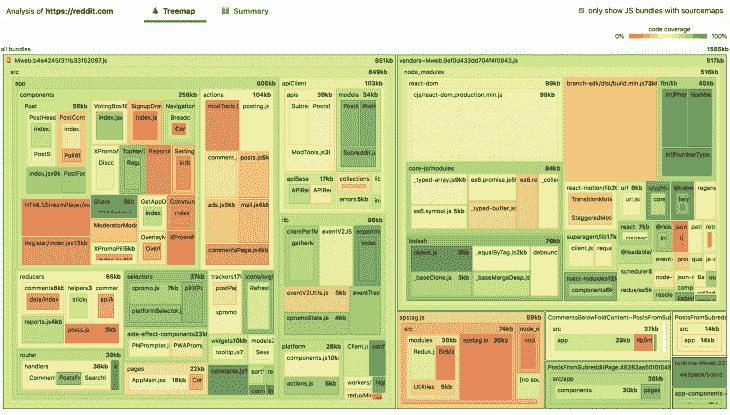
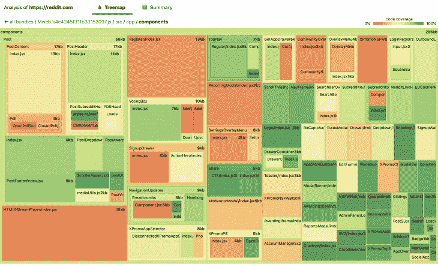
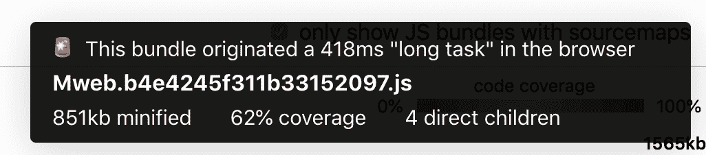
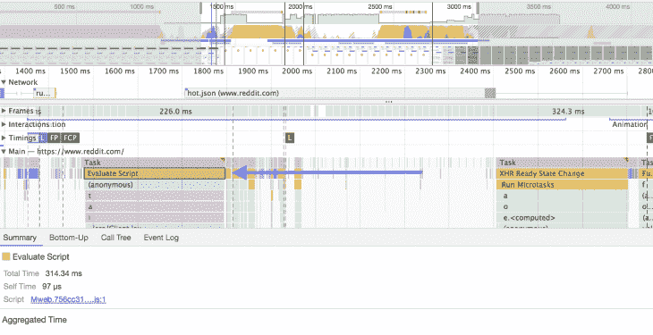

# 如何使用捆绑向导帮助你构建更快的网络应用

> 原文：<https://blog.logrocket.com/bundle-wizard-can-help-build-faster-web-apps/>

第一次访问你的 web app，会下载什么代码？这个问题相当宽泛，所以让我试着更具体一点。

假设我正在访问你的应用程序最流行的入口点——可能是登录、注册或登陆页面——我将加载哪些 JS 库，比如`React`或`lodash`?构建页面需要哪些定制的第一方代码，比如 UI 组件、路由和数据获取？最后，将获取哪些第三方脚本，如 Google Analytics 或 Intercom？

如果你不确定答案，你并不孤单。

虽然流行的现代 JavaScript 捆绑工具，如 webpack，是打包供应商库和自定义第一方代码的强大方法，但它们创建的输出可能有点神秘。当我们构建 JavaScript 时，我们都希望像树抖动和代码分割这样的优化能够最大限度地减少发送给客户端的 JavaScript 代码量，但是很难确定。

当涉及到第三方脚本时，情况会变得更加混乱，比如那些执行跟踪和分析的脚本。有时，这些脚本通过标签管理器添加到页面中，这意味着前端开发人员通常无法控制或了解页面上加载了哪些第三方脚本。

我将向你们展示一个我自己制作的名为`bundle-wizard`的小工具，它可以让你毫不费力地回答这样一个问题:到底是什么样的 JavaScript 真正进入了你的用户手中。但是在我们这样做之前，让我们花点时间回顾一下为什么首先要知道加载的是什么 JavaScript 是如此重要。

## JavaScript 降低应用程序启动性能的方法

出于几个原因，JavaScript 是一种昂贵的资产。虽然很明显大的 JavaScript 文件比小的要花更长的时间供浏览器下载，但是对于浏览器来说，大的 JavaScript 文件的处理(解析和编译)也比相应的类似大小的图像更昂贵。

一旦下载并编译了 JavaScript，浏览器就必须执行它。这里有两个潜在的用户体验问题。首先，除非你已经在服务器上渲染了你的应用程序，否则当你的应用程序从头开始构建页面时，用户可能会在很长一段时间内看到一个空白的白屏或加载视图。

但是，即使您预先呈现了发送给客户端的页面，在用户能够与页面交互之前，您的 JavaScript 仍然需要被下载、解析和执行。如果任何 JavaScript 需要很长时间来运行——创建所谓的[长任务](https://web.dev/long-tasks-devtools/)——您的用户可能会面临一个完全无响应的应用程序，它不会注册桌面上的点击或键盘输入，也不会注册移动设备上的点击，只要他们的浏览器完成 JavaScript 启动工作。

许多开发人员在高速互联网连接上使用功能强大的笔记本电脑，他们的应用程序在开发机器上加载速度很快，掩盖了性能问题。但是对于偶尔需要处理连接问题的手机用户来说，尤其是那些使用 CPU 能力较弱的低端设备的用户，过多的 JavaScript 可能会带来真正的问题。

## 使用捆绑包向导

既然我已经很有希望地确定了了解您发送给用户的代码有多重要，那么让我们来看看 bundle-wizard 是如何提供帮助的。

通过运行命令`npx bundle-wizard [site name]`，您可以生成一个交互式可视化，允许您探索由生产站点的任何入口点加载的 JavaScript。例如，运行`npx bundle-wizard reddit.com`会创建以下代码的可视化，该代码被加载以显示 Reddit 的移动站点:

(你可以在这里查看 2010 年 3 月 31 日在 Reddit 移动网站上创建的这个可视化的实时版本)。

让我们快速看一下如何解读这个观点。首先，我们可以看到两个非常大的包和一些较小的包。大的包分为左边的`Mweb.b4e4245f311b33152097.js`和右边的`vendors~Mweb.9ef0d432dd704f4f0943.js`两部分，左边的`Mweb.b4e4245f311b33152097.js`包含页面的大部分定制代码，右边的`vendors~Mweb.9ef0d432dd704f4f0943.js`包含像 React 和 polyfill 库`core-js`这样的 JavaScript 库。

在进入`bundle-wizard`提供的其他信息之前，我们可以开始看到一些有趣的进一步探索的途径。第一，即使是现代浏览器的用户，真的有必要加载 84kb 的`core-js` polyfill 吗？第二，考虑到为了获得最佳性能，[包通常应该小于 100kb】，是否有可能将这两个大包分成多个较小的包？](https://v8.dev/blog/cost-of-javascript-2019)

如果你点击一个矩形，例如，`Mweb.b4e4245f311b33152097.js`内的`src/app/components`方块，你可以看到一个详细视图:

正如您对留言板站点的期望一样，`Post`组件是主要包中包含的所有组件中最大的。

## 代码覆盖率

所有框的背景颜色表示页面在启动时实际运行了多少代码:

1.  红色代码块几乎没有被浏览器触及。这些包很可能是唾手可得的果实，你可以不花太多力气推迟装载
2.  橙色和黄色的代码块有一部分是由浏览器运行的——看看部分代码是否可以被分块和延迟可能是值得的
3.  绿色块完全由浏览器在页面启动时运行。但是请注意！这并不一定意味着代码不能被推迟或删除——例如，一大块 polyfill 代码可能没有必要加载到最新版本的 Chrome 上，但它仍然可以完全由浏览器运行。

在我们寻找优化的时候，有一件事需要记住，那就是首先关注容易成功的地方。例如，您可能会看到,`Register/index.js`在初始页面加载时基本上没有变化。这很有意义——大多数用户只需要注册一次。但是由于组件只缩小了 13kb，所以立即进行优化可能没有意义。(一个例外是，围绕注册流的其他代码会增加组合大小。但是从捆绑包的初步观察来看，情况似乎并非如此)。

## 第三方脚本

`Bundle-wizard`通过取消选中“仅显示包含 sourcemaps 的 JS 包”选项，提供切换所有脚本的可见性的能力，而不仅仅是包含 sourcemaps 的包。这将帮助您将第三方脚本(如分析和跟踪脚本)的大小与捆绑并发送到浏览器的 JavaScript 模块代码进行比较:

一旦我们在可视化中呈现了所有脚本，我们可以看到一个广告脚本`[https://securepubads.g.doubleclick.net](https://securepubads.g.doubleclick.net)`接管了页面上加载的第三大 JS 包。只有 17%的覆盖率，看起来这个脚本可能加载了大量不必要的代码。然而，公平地说，与其他网站相比，Reddit 似乎加载了相当少量的第三方脚本。

## 脚本优先级

当用户加载您的站点时，他们的浏览器会根据每个请求的紧急程度，按照一定的顺序加载 JavaScripts 文件。作为[关键请求链](https://web.dev/critical-request-chains/)的一部分的任何包应该具有高优先级，而包含最初不可见视图的代码的包以及包含附属功能的第三方脚本通常应该具有较低的优先级。如果你访问 [Reddit 捆绑向导示例](https://bundle-wizard.netlify.com/)上的“Summary Tab ”,你会看到两个捆绑列表——一个“高优先级”列表，如我们所料，主要显示第一方捆绑代码，一个“低优先级”列表，主要是第三方脚本。

相反，如果我们发现一些关键路径束在低优先级列表中，那么使用优先级提示来更早地加载它们是值得的。相反，我们可能会遇到一些具有高优先级的大型或计算开销大的第三方脚本。在这种情况下，我们可以尝试给脚本标签添加一个`defer`属性，以较低的优先级加载它，或者如果确定它们的商业利益没有抵消它们造成的性能影响，甚至完全删除它们。

## 长期任务

到目前为止，我们已经看到了主要旨在减少下载时间和脚本解析时间的优化。我们还没有触及脚本执行时间，尽管这可能是所有步骤中最昂贵的步骤。

有用的是，bundle-wizard 会警告你它在应用程序启动时检测到的由 JS 脚本执行启动的长任务。在 Reddit 示例中，我们可以看到一点🚨大`Mweb.b4e4245f311b33152097.js`包旁边的图标。当我们将鼠标悬停在它上面时，我们会在工具提示中看到这个长任务有多长:

不幸的是，虽然 bundle-wizard 可以提醒我们注意这个问题，但是它并不能帮助我们解决这个问题。为此，我们可以在一个隐姓埋名的窗口中启动 Chrome Devtools，并在`reddit.com`移动网站上运行一个性能分析。

正如所料，我们创建的配置文件有一个由`Mweb.b4e4245f311b33152097.js`上的“评估脚本”操作生成的长任务，当我们选择灰色长任务指示器下面的黄色条并查看底部的摘要选项卡时，我们可以看到它:

要了解哪些功能可能会占用此任务时间，我们可以采取以下步骤:

1.  确保您在第一步中选择的黄色“评估脚本”栏仍处于选中状态
2.  选择“自下而上”选项卡
3.  确保选择了“无分组”选项
4.  按“自己的时间”降序排序

(注意:这一步通常在 localhost 开发版本上效果最好，因为通过单击右边的链接直接跳到有问题的代码行往往更容易)。

您可能还会注意到概要文件中的其他长任务，这些任务并不直接归属于 JS 包——可以用类似的方式来研究。

## 结论

请在你自己的项目上试一试，看看你学到了什么！关于如何使用该工具的完整细节，包括如何使用它来测量本地运行的应用程序的说明，请查看[项目的自述文件](https://github.com/aholachek/bundle-wizard)。