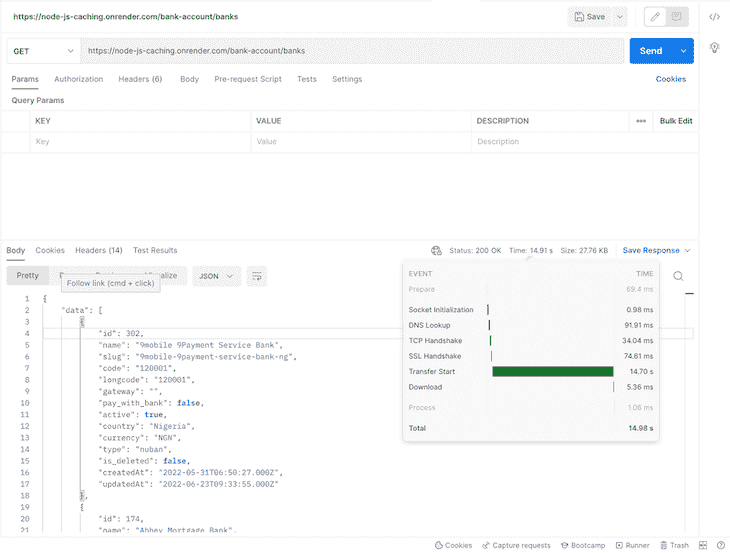
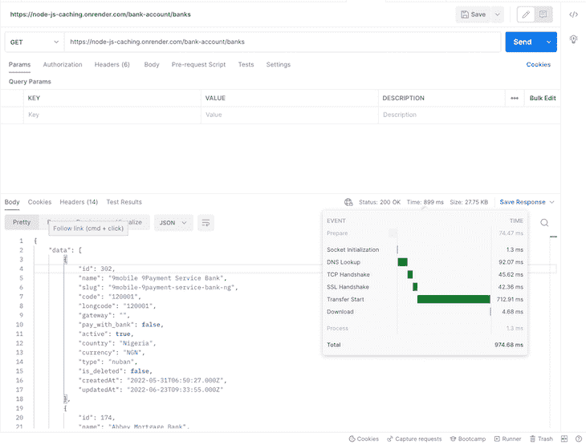

# Node.js 中的缓存可优化应用性能

> 原文：<https://blog.logrocket.com/caching-node-js-optimize-app-performance/>

***编者按**:本文最后一次更新是在 2022 年 10 月 14 日，包含了常见缓存包的信息，比如`node-cache`和 Memcached。*

缓存是 web 开发中使用的一种技术，用于处理与如何管理、存储和检索数据相关的性能瓶颈。缓存层或服务器充当辅助存储层，通常速度更快、性能更高，可以临时存储数据子集。预计存储在缓存中的数据不会经常改变。

其思想是，将来对存储在缓存中的频繁访问的数据的请求可以很快得到满足，并且通常比访问数据的主存储位置(通常是数据库)更快。高速缓存层通常提供一种更有效的方式来重用先前检索或计算的数据。

在本文中，我们将讨论以下内容:

## 为什么首先要缓存数据？

对于应用程序中特定点的数据状态很少发生变化的情况，通常建议使用缓存。想想产品列表、国家电话代码或商店位置。举例来说，对于最近的一个特性，我需要从外部 API 获取一个银行列表。最有效方法是进行一次 API 调用，并将响应存储在缓存中。

这意味着，随后，我们将不需要通过互联网进行同样的 API 调用；相反，我们可以从缓存中检索数据，因为我们不希望它突然改变。在该层缓存数据或 API 响应可以显著提高我们的应用性能。

使用缓存系统，数据检索过程已经得到优化，因为数据存储在内存中。这与大多数传统数据库中的磁盘存储机制形成对比，在磁盘存储机制中，读取和写入(就查询而言)不如内存存储系统快。

内存数据库通常由管理大量数据并依赖快速响应时间的应用程序使用。考虑到这一点，我们可以总结内存数据库的一些主要优势:

*   更少的 CPU 往返/处理，导致更快的事务或查询
*   更快的读/写速度，确保多用户并发，从而降低数据库基础架构的开支
*   低延迟和可扩展性
*   简单数据访问检索

另一方面，内存数据库比传统数据库更不稳定，因为如果 RAM 崩溃，我们很容易丢失数据。传统数据库在这方面表现出色，因为在出现任何问题时，数据仍然可以从磁盘中恢复。

## 数据库缓存类型

缓存数据的类型或方法在很大程度上取决于缓存的种类(可以分为应用程序级或本地缓存、数据库集成缓存以及独立或远程缓存)以及应用程序缓存设置的目的。虽然应用程序级或本地缓存是有益的，因为当底层数据发生变化时，数据库可以自动更新其缓存，但缓存在内存或资源的大小和可用性方面是有限的。

本地缓存存储应用层中频繁访问的数据。这种方法消除了与检索数据相关的网络流量，与其他缓存架构相比，数据检索速度更快。然而，因为我们知道大多数应用程序使用多个服务器，如果每个服务器都有自己的缓存，那么管理和同步它们之间的数据的工作就会成为一个巨大的问题。

此外，存储在本地缓存中的数据在发生故障时很容易丢失。这可能会否定缓存数据。使用远程缓存可以缓解这些缺点。对于远程缓存，存在专门用于在内存中存储数据的单独实例。例如 Redis、Memcached 等等。

远程缓存存储在隔离的专用服务器上，通常构建在键值存储上。它们可以每秒提供大量请求，并且具有高可用性和低延迟，适用于任务关键型工作负载。在这篇文章中，我们将利用远程缓存。

## 缓存模式和策略

两种常见的缓存方法是备用缓存和直写缓存范例。

### 缓存备用模式

旁边缓存模式，也称为延迟加载，是最常见的可用缓存模式。它的工作方式是在请求数据后更新缓存。这样，为了从数据库中读取数据，首先检查缓存以确定数据是否可用。如果数据可用(也称为缓存命中)，则返回缓存的数据，并向调用者发出响应。

另一方面，如果数据不可用(也称为缓存未命中)，则向数据库查询数据。然后用从数据库中检索到的数据填充缓存。这种方法的主要优点是，它为框架提供了一种直接的缓存方式，可以在幕后或自定义代码中处理惰性缓存。此外，这种方法可以立即提高性能。

另一个优点是缓存只包含应用程序请求的数据，这有助于保持缓存较小且成本较低。另一方面，这种方法的一个常见缺点是，只有在缓存未命中后才会将数据加载到缓存中，因为最初没有数据存储在缓存中。此外，查询的初始响应时间也有一些开销，因为需要往返于缓存和数据库。

### 直写高速缓存模式

或者，使用直写缓存模式，当主数据库更新时，缓存会立即更新。在这种模式下，缓存的填充顺序通常是相反的。方法是在主数据库更新后立即更新缓存。使用直写缓存策略，当应用程序或后端进程更新主数据库时，缓存中的数据也会更新。

在由于缓存内的数据过期或数据缺失而导致缓存未命中的情况下，使用延迟加载模式来更新缓存。因此，直写模式总是与延迟加载模式一起使用。

这种模式的一个优点是数据库读取更少，因此数据库的性能是顶级的。另一个优点是，它提供了更好的应用程序性能，并且保证了用户体验，因为在缓存中找到数据的可能性很高。

* * *

### 更多来自 LogRocket 的精彩文章:

* * *

这种方法的缺点是，即使不经常访问的数据也会写入缓存，从而导致缓存更大、更昂贵。总之，要实现行业标准的缓存策略，建议使用这两种模式，并为数据设置适当的过期限制，以保持数据最新。

## 探索常见的缓存包

在这篇文章中，我们将重点使用 Redis 作为我们的缓存服务器，但是其他同样可以使用的行业缓存服务器包括[节点缓存](https://www.npmjs.com/package/node-cache)、[内存缓存](https://www.npmjs.com/package/memcache)、[平面缓存](https://www.npmjs.com/package/flat-cache)、 [cacache](https://www.npmjs.com/package/cacache) 等。下面我们来简单探讨一下`node-cache`和 Memcache。

### `Node-cache`

`Node-cache`是一个简单的内部节点内部缓存模块，它有类似于其他缓存库的`set`、`get`和`delete`方法。它在 npm 上可用，可以用`npm install node-cache --save`命令安装。

作为一种普遍的做法，这些键可以有一个超时(TTL ),超时后它们会自动过期并从缓存中删除。要初始化该库，请参见以下内容:

```
const NodeCache = require( "node-cache" ); 
const myCache = new NodeCache();

```

然后，我们可以使用`set`方法存储一个密钥。用 TTL(以秒为单位)设置键/值对的格式如下所示:

`myCache.set( key, val, [ ttl ] )`

如果成功，它将返回`true`:

```
obj = { name: "Alexander", age: 42 };
data = myCache.set( "key", obj, 20000 ); 
//true 

```

关于可用方法以及如何使用它们的更多细节和信息可以在[Git](https://github.com/node-cache/node-cache)[H](https://github.com/node-cache/node-cache)[ub repo](https://github.com/node-cache/node-cache)中找到。

### Memcached

然而，Memcached 是一个免费、开源、高性能的分布式内存对象缓存系统。它是一个内存中的键值存储，用于存储字符串、对象等小块的任意数据。Memcached 是一个功能全面的 Node.js 客户机，其核心是可伸缩性、性能和高可用性。

要安装 Memcached，我们可以运行:

`npm install memcached`

在 other 中，为了设置客户机，构造函数接受两个不同的参数:服务器位置和选项。语法如下所示:

```
var Memcached = require('memcached'); 
var memcached = new Memcached (Server locations, options);

```

注意:公共方法的链接可以在[文档](https://www.npmjs.com/package/memcached#public-methods)中找到。

## 节点应用中的缓存技术

在设计应用程序架构时，应用程序处理数据的速度是一个主要的性能考虑因素。作为工程师，我们需要明确地确定我们的数据处理/处理周期的哪些部分应该被缓存。

缓存系统不是孤立使用的。缓存基本上是一个抽象层，包括一个中间存储机制和一个后端系统(在我们的例子中是 Node.js ),通常还有一个传统的数据库。重点是实现一个高效的数据检索过程，而缓存系统就是为这一特定目的而优化的。

对于 Node.js 应用程序，缓存策略应该解决以下问题:

*   **更新或作废来自******缓存**的陈旧数据:web 开发中一个非常常见的问题是处理缓存过期逻辑以维护最新的缓存**
***   **缓存经常访问的数据**:缓存在这里很有意义，因为我们可以一次性处理数据，将其存储在缓存中，然后稍后直接检索，而无需进行任何昂贵或耗时的操作。然后，我们需要定期更新缓存，以便用户可以看到最新的信息**

 **### 可扩展性问题

大型应用程序必须处理、转换和存储大型数据集。因为数据是这些应用功能的基础，我们处理数据的方式决定了我们的应用在野外的表现。

Web 应用程序最终会发展到能够满足大量数据的需求。通常，我们需要将这些数据存储在存储系统中，例如数据库。说到数据检索，有时从中间存储机制获取数据比执行几次数据库查询更快。

当我们有很多用户时，需要找到替代的解决方案来检索数据，而不是总是从磁盘读取。当涉及到 I/O 时，应用程序存储系统具有局限性，因此我们应该仔细了解以最快方式存储和检索数据的最佳机制。欢迎来到 Redis 的缓存世界。

### node . js caching with redis 节点. js 快取

Redis 是一个首选的缓存解决方案，因为[它的整个数据库都存储在内存](https://blog.logrocket.com/guide-to-fully-understanding-redis/)中，并且它使用磁盘数据库进行数据持久化。因为 Redis 是一个内存数据库，它的数据访问操作比任何其他基于磁盘的数据库都要快，这使得 Redis 成为缓存的完美选择。

它的键值数据存储系统是另一个优势，因为它使存储和检索更加简单。使用 Redis，我们可以分别使用`SET`和`GET`方法在缓存中存储和检索数据。除此之外，Redis 还可以处理复杂的数据类型，比如列表、集合、字符串、散列、位图等等。

使用 Redis 进行缓存的过程非常简单。当我们收到用户对启用了缓存的路由的请求时，我们首先检查所请求的数据是否已经存储在缓存中。如果是，我们可以从 Redis 缓存中快速检索它，并将响应发送回来。

但是，如果数据没有存储在缓存中，我们称之为“缓存未命中”，我们必须首先从数据库或外部 API 调用中检索数据，并将其发送给客户端。我们还确保将检索到的数据存储在缓存中，以便下次发出相同的请求时，我们可以简单地将缓存的数据发送回用户。

既然我们对要做的事情有了清晰的想法，让我们开始实施吧。

### 在 Node.js 中创建自定义缓存服务

查询有时需要几项操作，如从数据库中检索数据、执行计算、从第三方服务中检索附加数据等等。所有这些都可能影响应用程序的整体性能。缓存的目标是提高这些数据访问操作的效率。

在这一节中，我们将了解如何使用 Redis 为 Node.js 应用程序创建一个简单的缓存，然后检查它如何影响其性能。下面重点介绍了这些步骤:

1.  启动一个简单的 Node.js 应用程序
2.  编写可重用的自定义 Redis 实现/缓存服务
3.  展示如何使用 Redis 缓存来自外部 API 调用的数据来帮助提高我们应用程序的性能

创建简单的自定义缓存服务将使我们能够:

*   创建一个可重用的服务，我们可以在应用程序的多个部分使用它
*   规范化缓存 API，并随着应用的增长添加更多我们需要的方法
*   轻松地用另一个模块替换我们选择的缓存模块(如果需要)

现在，我们走吧！您可以使用 [GitHub repo](https://github.com/firebase007/Node.js_performance_with_caching) 来跟进我们的进展。

首先，我们将快速引导一个简单的 Node.js 应用程序。我们可以通过运行`npm init`来做到这一点，它为我们创建了一个`package.json`文件:

```
{
  "name": "performance_at_scale_node.js",
  "version": "1.0.0",
  "description": "A sample app to showcase Redis caching and how it affects an app overall performance benchmark",
  "main": "app.js",
  "scripts": {
    "start": "node app.js"
  },
  "keywords": [
    "Node.js",
    "Redis",
    "Performance",
    "Cache",
    "Caching",
    "JavaScript",
    "Backend",
    "LogRocket",
    "Frontend_Monitoring"
  ],
  "author": "Alexander Nnakwue",
  "license": "MIT",
  "dependencies": {
    "@hapi/joi": "^15.0.1",
    "axios": "^0.21.1",
    "body-parser": "^1.19.0",
    "dotenv": "^8.2.0",
    "express": "^4.17.1",
    "global": "^4.4.0",
    "redis": "^3.0.2",
    "util": "^0.12.3"
  }
}

```

在上面的文件中，我们已经安装了应用程序所需的一些依赖项。我们安装了 Redis 用于缓存，Axios 用于 HTTP 请求，@hapi/joi 用于模式/ `(req.body)`验证，`global`用于要求全局变量，Express 用于我们的基本 Express 服务器，以及其他一些。

接下来，让我们在我们的项目目录的根目录中设置一个简单的 Express 服务器；我们可以给它起任何我们想要的名字。参见下面`app.js`文件中的 Express 服务器:

```
require('dotenv').config()
const express = require('express')
const bodyParser = require('body-parser')
const config = require('./config')
const routes = require('./app/routes')

const app = express()
require("./cacheManager");

app.use(bodyParser.json())
// parse application/x-www-form-urlencoded
app.use(bodyParser.urlencoded({ extended: true }))

// parse application/json
app.use(bodyParser.json())
app.get('/', (req, res) => {
    // eslint-disable-next-line no-tabs
    res.status(200).send('Welcome to the Node.js Cache and Performance App')
})
// add routes here
routes(app)

// catch 404 and forward to error handler
app.use((req, res, next) => {
    const err = new Error('Not Found')
    err.status = 404
    res.send('Route not found')
    next(err)
})
app.listen(process.env.PORT || config.port, () => {
    console.log(`${config.name} listening on port ${config.port}!`)
})

module.exports = app

```

在上面的服务器文件中，我们可以看到我们正在导入一个`cacheManager`文件，它基本上使用`util`模块处理 Redis 中与异步缓存有关的所有事情。

让我们看看该文件的内容:

```
"use strict";

const redis = require("redis");
const {promisify} = require("util");
const config = require('./config')
const redisClient = redis.createClient(
    {
        host: config.redis_host,
        port: config.redis_port
    }
);
const password = config.redis_password || null;
if(password && password != "null"){
    redisClient.auth(password, (err,res) => {
        console.log("res",res);
        console.log("err",err);
    });
}
try{
    redisClient.getAsync = promisify(redisClient.get).bind(redisClient);
    redisClient.setAsync = promisify(redisClient.set).bind(redisClient);
    redisClient.lpushAsync = promisify(redisClient.lpush).bind(redisClient);
    redisClient.lrangeAsync = promisify(redisClient.lrange).bind(redisClient);
    redisClient.llenAsync = promisify(redisClient.llen).bind(redisClient);
    redisClient.lremAsync = promisify(redisClient.lrem).bind(redisClient);
    redisClient.lsetAsync = promisify(redisClient.lset).bind(redisClient);
    redisClient.hmsetAsync = promisify(redisClient.hmset).bind(redisClient);
    redisClient.hmgetAsync = promisify(redisClient.hmget).bind(redisClient);
    redisClient.clear = promisify(redisClient.del).bind(redisClient);
}catch (e) {
    console.log("redis error", e);
}

redisClient.on("connected", function () {
    console.log("Redis is connected");
});
redisClient.on("error", function (err) {
    console.log("Redis error.", err);
});
setInterval(function() {
    console.log("Keeping alive - Node.js Performance Test with Redis");
    redisClient.set('ping', 'pong');
}, 1000 * 60 * 4);

global.cache = redisClient;
module.exports = redisClient;

```

从上面的文件中我们可以看到，我们已经创建了一个 Redis 客户端，并使用我们的`env`变量中的`config`连接到一个 Redis 集群。此外，我们正在设置每四分钟运行一次的保持活动脚本:

```
09:02:42 web.1   |  Keeping alive - Node.js Performance Test with Redis
09:06:42 web.1   |  Keeping alive - Node.js Performance Test with Redis
09:10:42 web.1   |  Keeping alive - Node.js Performance Test with Redis
09:14:42 web.1   |  Keeping alive - Node.js Performance Test with Redis
09:18:42 web.1   |  Keeping alive - Node.js Performance Test with Redis
09:22:42 web.1   |  Keeping alive - Node.js Performance Test with Redis
09:26:42 web.1   |  Keeping alive - Node.js Performance Test with Redis
09:30:42 web.1   |  Keeping alive - Node.js Performance Test with Redis
09:34:42 web.1   |  Keeping alive - Node.js Performance Test with Redis
09:38:42 web.1   |  Keeping alive - Node.js Performance Test with Redis
09:42:42 web.1   |  Keeping alive - Node.js Performance Test with Redis
09:46:42 web.1   |  Keeping alive - Node.js Performance Test with Redis

```

保存所有`env`变量的`config`文件如下所示:

```
require('dotenv').config()
const { env } = process
module.exports = {
    name: env.APP_NAME,
    baseUrl: env.APP_BASE_URL,
    port: env.PORT,
    redis_host: env.REDIS_HOST,
    redis_port: env.REDIS_PORT,
    redis_password: env.REDIS_PASSWORD,
    paystack_secret_key: env.PAYSTACK_SECRET_KEY
}

```

现在我们已经完成了所有的设置，我们可以继续这个练习中最重要的部分:允许我们应用 Redis 缓存策略的实际业务逻辑。请参见下面我们应用程序的文件夹结构:


在`app`文件夹中，我们可以看到在`paystack`文件夹中有一个名为`paystackRepository.js`的文件。这个文件调用 Paystack API，它获取银行列表并解析银行帐号。可以在这里[找到这个 Paystack API 特性的文档链接。](https://paystack.com/docs/identity-verification/resolve-account-number/)

`paystackRepository.js`文件的内容如下:

```
const axios = require("axios");
const config = require('../../config')
const {handleAxiosError} = require("../../helpers");
const _axios = axios.create({
    baseURL: "https://api.paystack.co",
    headers: {
        Authorization: `Bearer ${config.paystack_secret_key}`
    }
});

exports.banks = async () => {
    try {
        return {
            data: (await _axios
                .get(`bank`)).data.data
        };
    } catch (error) {
        console.log('An Error Occurred', error, handleAxiosError(error));
        return {error: error.message};
    }
};

exports.resolveAccountNumber = async (bankCode, accountNumber) => {
    try {
        return {
            data: (await _axios
                .get(`bank/resolve`, {
                    params: {
                        bank_code: bankCode,
                        account_number: accountNumber
                    }
                })).data.data
        };
    } catch (error) {
        console.log('An Error Occurred', error, handleAxiosError(error));
        return {error: error.message};
    }
};

```

从上面的文件中，我们可以看到我们使用 Axios 和存储在我们的`env`变量中的`PAYSTACK_SECRET_KEY`头向 Paystack 的 API 发出 HTTP 请求。

在`bankAccount`文件夹里面，我们来看看`BankService.js`文件。它调用`paystackRepository.js`文件来获取银行列表并解析银行账号，正如我们前面所讨论的。我们还在进行第一次 API 调用后缓存结果，以消除后续调用的需要:

```
"use strict";

const paystackRepository = require("../paystack/PaystackRepository");

exports.fetchAllBanks = async () => {
    // incase we are calling this endpoint a second time, we do not need to make a new API request 
    let banks = await cache.getAsync("bank-list");
    console.log("Data from cache", banks);
    if(banks)
        return {data: JSON.parse(banks)};
  const {error, data} = await paystackRepository.banks();
  if(error) return {error};
  // Store the bank list in a cache, since it rarely changes
  let cacheResponse = await cache.setAsync("bank-list", JSON.stringify(data));
  console.log("Cache", cacheResponse);
  return {
      data
  }
};

exports.resolveAccount = async (bankName, accountNumber) => {
    // Relying on the cached data is faster, as it rarely changes
let banks = JSON.parse(await cache.getAsync("bank-list"));

console.log(banks, 'banks')
    // Incase the data is not stored in the cache yet (but we expect it to be), make an API call to get bank lists 
    if(!banks){
        const {error, data} = await paystackRepository.banks();
        if(error)return {error};
        banks = data;
    }
    const bank = banks.find(bank => {
        return bank.name == bankName
    })
    if(!bank)
        return {error: "Bank Not Found"};
    console.log(bank.code)
    const {error, data} =  await paystackRepository.resolveAccountNumber(bank.code, accountNumber);
    if(error)return {error };
    return {
        data: {
            accountNumber,
            bankName,
            accountName: data.account_name
        }
    }
};

exports.resolveAccountPerfTest = async (bankName, accountNumber) => {
    // if there were no cache mechanism in place we needed to go fetch the bank lists compulsorily at every API call
    let banks;
    if(bankName && accountNumber) {
        const {error, data} = await paystackRepository.banks();
        if(error)return {error};
        banks = data;
    }

    const bank = banks.find(bank => {
        return bank.name == bankName
    })
    if(!bank)
        return {error: "Bank Not Found"};
    const {error, data} =  await paystackRepository.resolveAccountNumber(bank.code, accountNumber);
    if(error)return {error };
    return {
        data: {
            accountNumber,
            bankName,
            accountName: data.account_name
        }
    }
};

```

对于`fetchAllBanks`服务，我们从 Redis 获取银行列表，但在发出初始 API 请求时，必须先将结果保存到 Redis 缓存中。此外，我们可以看到我们复制了`resolveAccount`方法，并删除了名为`resolveAccountPerfTest`的第二个方法的 Redis 实现。

接下来，我们可以导航到控制器文件，在这里我们实际使用这些方法:

```
"use strict";
const bankService = require("./BankService");
const {
    sendErrorResponse,
    sendResponse
  } = require("../../helpers");

exports.fetchAllBanks = async (req, res, next) => {
    const {error, data} = await bankService.fetchAllBanks();
    if(error)
        return sendErrorResponse({res, message: error});
    return sendResponse({res, responseBody: data});
};

exports.resolveAccountNumber = async (req, res) => {
    const {bankName, accountNumber} = req.body;
    const {error, data} = await bankService.resolveAccount(bankName, accountNumber);
    if(error)
        return sendErrorResponse({res, message: error});
    return sendResponse({res, responseBody: data});
};

exports.resolveAccountPerfTest = async (req, res) => {
    const {bankName, accountNumber} = req.body;
    const {error, data} = await bankService.resolveAccountPerfTest(bankName, accountNumber);
    if(error)
        return sendErrorResponse({res, message: error});
    return sendResponse({res, responseBody: data});
};

```

最后，在测试我们的实现之前，我们可以看一下位于`routes`文件夹中的 routes 文件:

```
"use strict";

const router = require("express").Router();
const accountValidator = require("../bankAccount/BankAccountValidator");
const accountController = require("../bankAccount/BankAccountController");

router.get("/banks", accountController.fetchAllBanks);
router.post("/resolve", accountValidator.resolveAccount, accountController.resolveAccountNumber);
// TEST ROUTE TO SIMULATE PERFORMANCE METRICS BASED ON CACHING OUR ROUTES
router.post("/resolve/perf/test", accountValidator.resolveAccount, accountController.resolveAccountPerfTest);

module.exports = router;

```

要了解其他导入文件的实现细节，[参考 GitHub](https://github.com/firebase007/Node.js_performance_with_caching) 上的源代码。此外，请注意，我们已经在 Render 上部署了我们的应用程序，以便在模拟的真实环境中测试我们的实现。基础 URL 是`[https://node-js-caching.onrender.com](https://node-js-caching.onrender.com)`。虽然这不是严格要求的，但也可以随意阅读关于部署自己的 Node.js 应用程序来渲染的文章。

现在是时候测试我们的 API 端点了，以亲眼见证缓存的性能优势。在我们开始之前，当我第一次测试这个 API 时，用了 14.91 秒才返回一个响应。我猜是因为冷启动。请参见下图:



在第一次请求之后，我从缓存中删除了银行列表，并提出了另一个新的请求。这是结果:



从上面的截图可以看出，我们在第二个请求上获得了更快的响应周期，大约 899 毫秒。快多了，对吧？注意，在这个初始请求之后，我们现在在 Redis 缓存中有了我们的银行列表。

第二次发出请求不会一直查询外部支付堆栈 API 它只是从我们的缓存中获取数据，这样效率更高。见下文:


正如我们所看到的，在缓存了银行列表之后，我们从 API 获得了更快的响应——大约 304 毫秒。

总之，我们的想法是比较对第三方服务进行外部 API 调用与缓存结果的性能，而不是再次进行相同的 API 调用。我们现在已经亲眼看到了结果。

作为另一个例子，我使用 Redis 来存储在后端应用程序上生成的一次性密码(OTP)令牌。与将令牌保存到数据库并在用户在客户端应用程序上输入值时查询记录相比，这种方法提供了更快的查找速度。下面是一个示例片段:

```
exports.verifyOTP = async (req,res) => {
const {otp} = req.body
// get the OTP stored in the cache earlier
const getOTPDetails = await cache.getAsync('otpKey');
const otpCode = JSON.parse(getDetails).code;
if (Number(otp) == Number(otpCode) ) {
    return sendResponse(res, "OTP Verified Successfully", 201)
}
return sendErrorResponse(res, "Unable to verify OTP. Please check the code sent to your email gain", 400)
}

```

另外，不要忘记，在生成或请求 OTP 时，必须已经在缓存中设置了 OTP。

## 结论

对于任何数据密集型应用程序来说，缓存都是一项近乎强制性的操作。它缩短了应用程序响应时间，甚至降低了与带宽和数据量相关的成本。通过在服务器上本地保存以前请求结果的副本，它有助于最小化昂贵的数据库操作、第三方 API 调用和服务器到服务器的请求。

在某些情况下，我们可能需要将缓存委托给另一个应用程序或键值存储系统，以允许我们在需要时存储和使用数据。Redis 就是这样一个选项，我们也可以将其用于缓存。它支持一些很好的特性，包括数据结构，比如字符串、散列、列表、集合、带有范围查询的排序集合、位图、超级日志等等。

在本教程中，我们回顾了提高 Node.js 应用程序性能的缓存策略的快速介绍。虽然有其他工具可以实现这一目的，但我们选择了 Redis，因为它是开源的，在业界非常受欢迎。现在，我们可以使用 Redis 来缓存应用程序中频繁查询的数据，并获得可观的性能提升。下次见！🙂

## 200 只显示器出现故障，生产中网络请求缓慢

部署基于节点的 web 应用程序或网站是容易的部分。确保您的节点实例继续为您的应用程序提供资源是事情变得更加困难的地方。如果您对确保对后端或第三方服务的请求成功感兴趣，

[try LogRocket](https://lp.logrocket.com/blg/node-signup)

.

[](https://lp.logrocket.com/blg/node-signup)[https://logrocket.com/signup/](https://lp.logrocket.com/blg/node-signup)

LogRocket 就像是网络和移动应用程序的 DVR，记录下用户与你的应用程序交互时发生的一切。您可以汇总并报告有问题的网络请求，以快速了解根本原因，而不是猜测问题发生的原因。

LogRocket 检测您的应用程序以记录基线性能计时，如页面加载时间、到达第一个字节的时间、慢速网络请求，还记录 Redux、NgRx 和 Vuex 操作/状态。

[Start monitoring for free](https://lp.logrocket.com/blg/node-signup)

.**