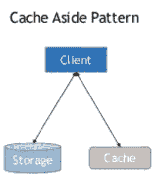
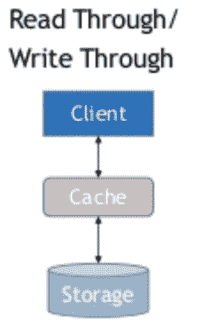
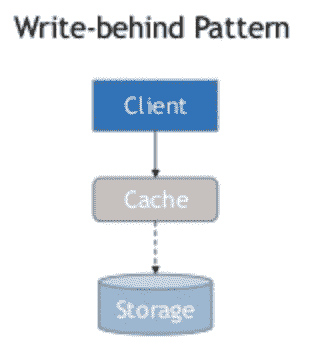
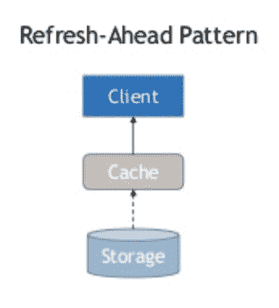

# 加速 API - LogRocket 博客的缓存策略

> 原文：<https://blog.logrocket.com/caching-strategies-to-speed-up-your-api/>

## 介绍

缓存是更快提供内容的一种方式。缓存发生在 web 应用程序的不同级别:

*   边缘缓存或 CDN
*   数据库缓存
*   服务器缓存(API 缓存)
*   浏览器缓存

**CDN** 用于缓存地理上分散的服务器中的静态资产。它可以更快地将资产从缓存发送给最终用户。

**数据库缓存**是每个数据库本地使用的缓存。每个数据库都有智能算法来优化读写。这种缓存主要取决于数据库的结构。您可以通过调整模式来优化数据库缓存。

数据库中的索引是优化数据库读取的一种方式。数据库在内存中还有一个工作数据集，用于处理对相同数据的频繁请求。

**服务器缓存**是服务器应用程序中数据的自定义缓存。通常，这种缓存很大程度上取决于业务需求。对于没有足够并发用户的小型应用程序来说是高度可选的。

**浏览器**根据缓存到期头缓存静态资产。此外，浏览器智能地缓存 GET 请求，以避免不必要的数据调用。

在本文中，我们将看到 API 中不同的缓存策略(即服务器级缓存)。

### 为什么需要缓存？

当你创建一个 API 时，你希望它简单。但是，一旦并发请求增加，您将面临一些问题。

*   数据库将需要更多的时间来响应
*   CPU 峰值出现在流量高峰期
*   根据并发请求的数量，服务器响应时间会变得不一致

在大多数情况下，水平缩放可以很好地解决这些问题。水平扩展增加了更多的资源和机器能力来处理流量。然而，不管流量如何，您的数据库最终将无法处理这些请求。

在 API 层面上，您可以做许多优化来解决此类问题。一些解决方案包括对从数据库获取的数据进行分页，缓存对许多用户或访问者都相同的读取数据，以及数据库分片。

当您有高度并发的读取相同数据的需求时，或者对于任何有大量读写的应用程序，您可以使用缓存。您还可以对频繁访问的信息使用缓存。

例如，缓存对于 COVID APIs 很有用。

世界各地的许多用户都在阅读这个主题，但它的写作频率不是很高。因此，您可以简单地将响应缓存在内存中，并非常快速地提供服务。一旦有新数据，就将其写入数据库，使缓存失效，并异步更新。

缓存对于用户元信息也很有用。当您登录到任何网站时，用户数据将出现在每个页面上。

您不需要一次又一次地请求它，相反，您可以将该信息保存在缓存中以便更快地提供服务。当信息更新时，也要更新缓存。服务器会话是一种类型的用户元信息。

缓存实时记分卡也很有帮助。在线记分卡是任何体育比赛直播时数百万用户访问的直播数据。

您不需要一直从数据库中获取数据来提供实时记分卡信息，您只需缓存数据几秒钟来服务数百万个相同的请求，然后在设定的时间间隔内重新缓存实时数据。

使用这种方法，每秒钟只有一个用户访问您的数据库，而不是数百万用户直接访问。

* * *

### 更多来自 LogRocket 的精彩文章:

* * *

在大多数情况下，缓存位于内存中。这就是从缓存中获取数据比从数据库中获取数据更快的原因。甚至数据库也在内存中缓存它们的工作集。

但是这些不是由业务需求定义的自定义缓存。这些缓存机制基于数据库内部操作。

让我们通过真实的用例来学习一些缓存策略。

### 缓存生存期和到期时间

缓存的生命周期起着重要的作用。使高速缓存无效是最困难的计算机科学问题之一。

我们将讨论带生存时间(TTL)的缓存和不带 TTL 的缓存。

**带 TTL 的缓存**

带 TTL 的缓存是最常用的缓存。当您的数据频繁更新并且您希望定期终止缓存时，您可以使用有时间限制的缓存。时间间隔过后，缓存将被自动删除。

服务器会话和实况体育比分就是 TTL 缓存的例子。

**无 TTL 缓存**

没有 TTL 的缓存用于不需要频繁更新的缓存需求。

课程网站中的课程内容和像多作者博客这样的大量静态内容网站经常使用没有 TTL 的缓存。没有 TTL 的高速缓存的真实例子有，

内容将很少发布和更新，因此更容易缓存。缓存失效也很容易。

缓存有几种策略。其中包括备用缓存(或延迟加载)、读通缓存和写通缓存。

### 缓存搁置(延迟加载)

缓存备用通过应用程序异步更新缓存。

首先，应用程序检查数据是否存在于缓存中。如果它存在，您可以从缓存中读取。如果没有，就从数据源读取。

然后，它将写入缓存并返回数据作为响应。后续请求将通过缓存来处理。



缓存很容易实现，但是很难管理。缓存失效是困难的。每当源中的数据更新时，我们都需要检查缓存并使其无效。如果您使用多个来源来更新存储中的数据，将会非常困难且成本高昂。

伪代码:为 COVID API 留出高速缓存:

```
app.get('/summary', async (req, res) => {
  // Check the cache
  if (cache.has('summary')) {
    const data = await cache.get('summary');
    return res.json({ data });
  }
  // If no cache, then get data from datastore
  const data = await getSummary();
  // Set the cache for future request
  await cache.set('summary', data);
  // Send the response
  return res.json({ data });
});
```

### 通读缓存

对于通过缓存读取，每次都将通过缓存读取数据。

首先，检查数据是否存在于缓存中。如果是，从缓存中读取并发送响应。如果没有，缓存将从数据源更新。然后，缓存会将响应发送回客户端。



读通缓存与备用缓存存在相同的问题—如果数据存储通过许多来源进行更新，缓存将会过时。

一旁缓存和通读缓存主要用于高读取量的站点。使用直写缓存可以解决缓存失效问题。

伪代码:通过缓存读取 COVID API:

```
app.get('/summary', async (req, res) => {
  // If no cache exist
  if (!cache.has('summary')) {
    await getSummaryFromStoreAndSetCache();
  }
  const data = await cache.get('summary'); // Always exist at this point
  // Send the response
  return res.json({ data });
});
```

“读通缓存”与“备用缓存”相似，唯一的区别是它总是从缓存中发送结果。

### 直写缓存

数据将首先写入缓存，然后缓存将更新数据存储。

首先，写入缓存，然后写入主数据库。

直写缓存只能解决写入问题。它需要与读通缓存结合使用才能获得正确的结果。

当两者结合时，数据总是通过缓存从缓存中读取并写入数据库，因此缓存中不会有任何过时的数据。

但是，如果您想将所有内容都保存在缓存中，这将很容易使资源变得昂贵。有一些云数据库支持本地读取和写入缓存，而无需编写自定义的缓存层。

伪代码:COVID API 的直写缓存:

```
// Sample creation endpoint
app.post('/summary', async (req, res) => {
  const { payload } = req.body;
  // Create cache first
  await cache.set('summary', payload);
  // Send the response
  return res.json({ success: 'Content updated successfully' });
});

// Sample updation endpoint
app.put('/summary', async (req, res) => {
  const { payload } = req.body;
  // Get previous cache and update payload
  const previousCache = await cache.get('summary') || [];
  const data = [...previousCache, payload];
  // Update or overwite cache first
  await cache.set('summary', data);
  // Send the response
  return res.json({ success: 'Content modified successfully' });
});
```

### 缓存后写入

缓存将在写入数据存储之前发送响应。它根据负载异步写入数据存储。

它只是一种特殊类型的直写缓存。它不会等待数据存储库确认数据是否已存储。

这种技术在每个 NoSQL 和 SQL 数据库内部使用。首先，数据将被写入内存。数据库确认响应，并将其异步写入磁盘。这样，数据库可以灵活地处理大量的写操作。



同样，这种策略本身是不够的。它应该与读通缓存结合使用，以解决缓存失效问题。大多数关系数据库本身支持写后和读通缓存。

### 提前刷新缓存

提前刷新缓存用于在数据过期前刷新数据。它是异步发生的，因此最终用户不会看到任何问题。

这种缓存在实时网站上大量使用，例如直播体育比分网站和股市金融仪表板。您总是可以从缓存中读取。缓存将在过期前用实时数据刷新。



### 如何选择缓存键

每个人在缓存中都面临两个问题:什么时候使缓存失效，如何为缓存命名键。

对于简单明了的缓存，可以用静态字符串键轻松命名。如果必须缓存分页数据，可以使用包含页码和限制信息的键。

示例:`tweets:${pageNumber}:${limit}`

您可以选择自己的分隔符。如果您已经知道过滤信息，这是有效的。如果您有更多的过滤器，那么就很难处理动态密钥。

一旦你的缓存很深并且有很多级别的变量，选择一个键是一个困难的问题。保持缓存数据和密钥足够简单，以便最终用户能够更容易、更快地检索和加载，这始终是一个好主意。

### 案例研究:你是如何缓存 Twitter 数据的？

Twitter 是一个复杂的大规模分布式应用。考虑每个用例并不容易。

让我们考虑一个拥有数百名用户的简单 Twitter 应用程序。

如何通过可靠的缓存机制尽可能快地为用户服务？

您可以构建多种级别的缓存。

一种选择是使用 TTL 缓存基于用户的视图。到期持续时间将足够短，不到一分钟。这样，您可以向用户显示相同的分页结果，以便进行后续刷新。

你也可以缓存不常用的标签。将缓存保存在分页的集合中，并根据这些标签的新 tweets 更新最后一个集合。

缓存基于趋势标签的推文成本很高，因为许多实时用户都在推文上谈论它。

对于前几页，可以使用与 TTL 缓存相同的方法。

缓存单个 tweet 及其相关线程很容易。一个更简单的缓存策略，如缓存放在一边，将很容易工作。由于线程的顺序并不重要，所以当新的线程开始进入时，您可以使其无效并重新缓存。

## 结论

缓存是一个庞大的主题。我们用一些策略触及了表面。

大多数应用程序不需要定制的缓存解决方案，因为数据库和服务器本身通过它们内置的缓存机制智能地处理请求。

一旦规模达到一定水平，缓存是第一个要解决的问题。它改善了最终用户体验，并有助于避免不必要的资源成本。

希望你学会了一些在你的网络应用上实施的策略！

## 通过理解上下文，更容易地调试 JavaScript 错误

调试代码总是一项单调乏味的任务。但是你越了解自己的错误，就越容易改正。

LogRocket 让你以新的独特的方式理解这些错误。我们的前端监控解决方案跟踪用户与您的 JavaScript 前端的互动，让您能够准确找出导致错误的用户行为。

[](https://lp.logrocket.com/blg/javascript-signup)

LogRocket 记录控制台日志、页面加载时间、堆栈跟踪、慢速网络请求/响应(带有标题+正文)、浏览器元数据和自定义日志。理解您的 JavaScript 代码的影响从来没有这么简单过！

[Try it for free](https://lp.logrocket.com/blg/javascript-signup)

.