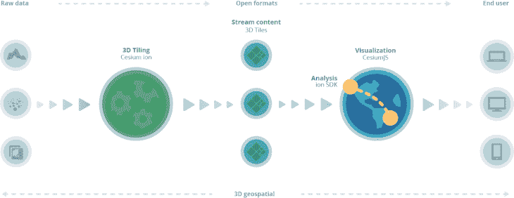
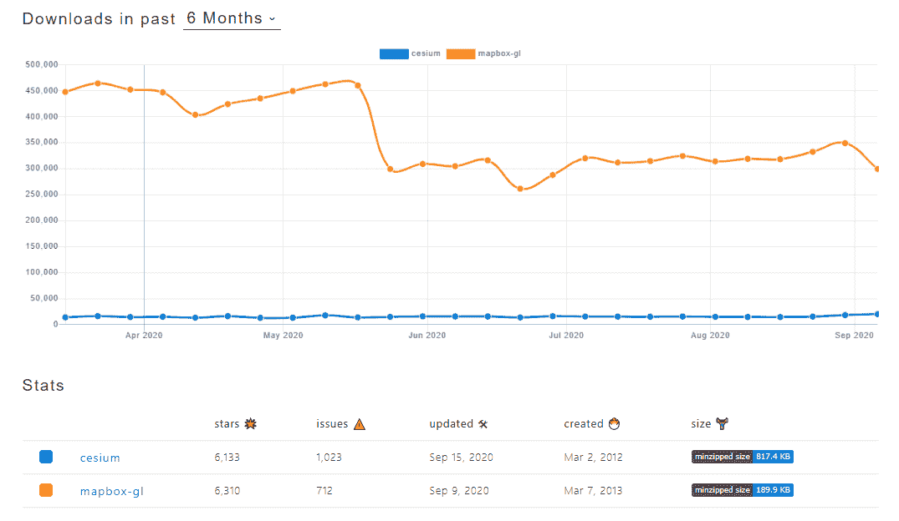
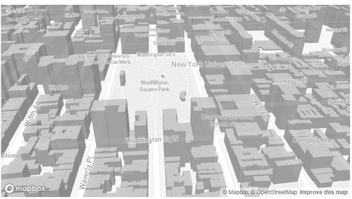
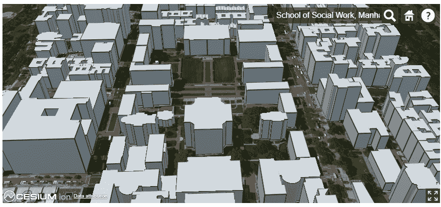

# 铯与 Mapbox:哪种地图服务最好？

> 原文：<https://blog.logrocket.com/cesium-vs-mapbox-which-mapping-service-is-best/>

当考虑将 3D 地图或元素集成到应用程序中时，铯和 Mapbox 是不错的选择。

本文的目的是解释这两种流行的地图服务，并基于以下关键要素对其进行重要比较:

*   定制选项
*   API 和 SDK
*   外观和感觉

我们还将更全面地了解每种地图服务的优缺点。

## 铯是什么？

铯为切片、可视化、共享和分析 3D 地理空间数据提供了一个快速、简单的端到端平台。

铯有助于将大量不同的 3D 地理空间数据转换为可流式传输的 3D 内容，以便在您的应用程序和任何其他环境中使用。

### 铯 Pros

**全球视图支持**

铯支持在 3D 地球视图模型中表示地球。它让你能够通过改变视角和位置在虚拟环境中自由移动。globe view 的一个额外功能是，它允许您呈现地球表面的许多不同视图。

**全 3D**

与 Mapbox 不同，铯是完全 3D 开箱即用的。这允许从多个角度旋转和可视化对象。这使得在地图服务中实现和合成 3D 对象的体验更加无缝。

**3D 数据平铺和流式传输**

铯提供 3D 切片，将大量不同的 3D 地理空间数据转换为可在您的应用程序中使用的流式 3D 内容。您还可以整理和汇集来自多个来源的数据，使其成为一个整体。

**慷慨的免费试用选项和灵活的定价方案**

在撰写本文时，铯提供了一个高达 15 GB/月的社区(或免费层)计划，用于数据流、无限应用程序、最终用户和 5gb 存储空间来托管和共享您的 3D 内容。此选项适用于非商业项目。

### 铯元素

**相对较大的 SDK 大小**

与 Mapbox 相比，铯具有相对更大的 SDK 大小，最新的未打包版本铯. js(2020 年 10 月 1 日发布)，重达 79.4 MB。

**不完整的建筑信息**

与地图框不同，铯不提供建筑信息(在外观和感觉部分有更多信息)。

**较慢的响应时间**

铯的响应时间较慢，在稳定的 7.2Mbps 互联网连接上，与 globe view 交互时的更新加载速度约为+3 秒。

## Mapbox 怎么样？

另一方面，Mapbox 帮助开发者在不同平台上构建更好的地图、导航和搜索体验。

与铯不同，Mapbox 提供 3D 制图之外的大量制图服务，其中包括:

*   增强现实导航
*   汽车(驾驶体验)

### Mapbox Pros

**选择不同的地图样式**

Mapbox 提供了几种地图样式，可以直接在应用程序中使用，也可以作为在 Mapbox Studio 中创建新的自定义样式的起点。

**慷慨的免费试用**

Mapbox 还提供了一个慷慨的免费层，为网络提供高达 50，000/月的免费地图加载，为他们的移动 SDK 提供高达 25，000 个月的活跃用户。

**更快的加载/更新时间**

在一个样本 3D 建筑显示测试中，Mapbox 更新地图的速度似乎比铯快。在稳定的 7.2Mbps 互联网连接下，它的加载时间不到 2 秒。

**地图框提供建筑信息**

与铯不同，Mapbox 提供了对 3D 建筑信息的支持(在外观和感觉部分有更多的介绍)。

## 地图框缺点

**Mapbox 使用 2.5D 而不是 3D**

铯使用现成的 3D，而 Mapbox 使用 2.5D (2D 形状与高度)。这使得使用其他第三方库(如 Three.js)收集和组合多个 3D 对象变得有点复杂。

Image credit – npmtrends.com

## 定制选项

铯有一个强大而安全的云平台，铯离子，3D 数据可以轻松地托管，编辑，并在多个设备上流动。

在该平台上，您还可以访问精选的 3D 内容，包括铯世界地形、Bing 地图图像和铯 OSM 建筑。

铯离子的另一个令人惊讶的特性是，它允许您创建和共享基于地图的故事，而无需编写代码。

虽然你可以从 Mapbox 现成的样式模板中进行选择，比如铯离子，但 Mapbox 也提供了一个类似的平台:Mapbox Studio。但是，它有更多的功能。例如，它允许您向地图添加兴趣点标签，允许您更改地图颜色，调整道路宽度，以及其他强大的功能。您可以轻松地将您的设计集成到他们所有的 SDK 中。

**API/SDK**

铯主要是为网络制造的。它的主要 SDK 是铯. js，这是一个开源的 JavaScript 库，从铯离子流数据来创建 3D 地球仪和地图。

另一方面，Mapbox 提供了 Mapbox GL。Mapbox GL 是一套开源库，用于在 web、移动和桌面应用程序中嵌入可定制和响应的客户端地图。

除了 Mapbox GL，他们还为其他服务提供商业 SDK。

### 外观、感觉和地图交互

**地图框**

上面的图像是 Mapbox 中 3D 建筑物的一个例子，清楚地提供了周围建筑物的信息，这使得在地图上导航更加容易。

下面是一个类似的铯的 3D 建筑的例子。与 Mapbox 不同，它没有建筑信息，这使得导航地图变得更加复杂。

## 结论

在这篇文章中，我们讨论了铯和 Mapbox 的区别。我们讨论了每种地图的优缺点，比较了两种地图的外观，并确定了哪种更受欢迎。虽然这两个平台都提供了很好的地图服务，但显然 Mapbox 提供的功能要比铯多得多。

如果你想在多个平台上托管和共享 3D 内容，铯可能是你想要的选择。另一方面，如果您的目标是显示 3D 数据并利用更多的地图功能，那么 Mapbox 是最佳选择。

## 通过理解上下文，更容易地调试 JavaScript 错误

调试代码总是一项单调乏味的任务。但是你越了解自己的错误，就越容易改正。

LogRocket 让你以新的独特的方式理解这些错误。我们的前端监控解决方案跟踪用户与您的 JavaScript 前端的互动，让您能够准确找出导致错误的用户行为。

LogRocket 记录控制台日志、页面加载时间、堆栈跟踪、慢速网络请求/响应(带有标题+正文)、浏览器元数据和自定义日志。理解您的 JavaScript 代码的影响从来没有这么简单过！

[Try it for free](https://lp.logrocket.com/blg/javascript-signup)

.