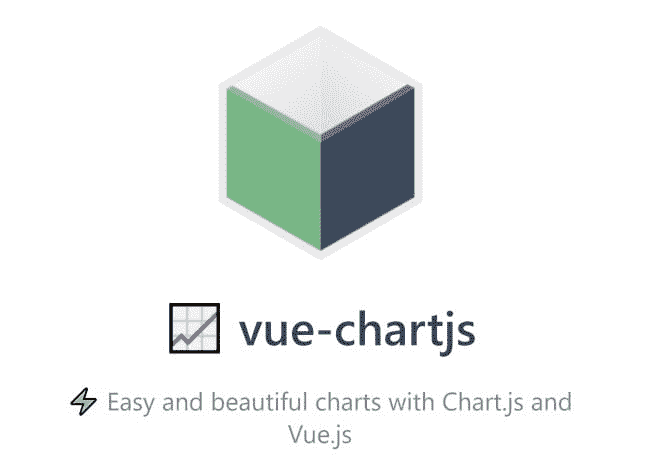
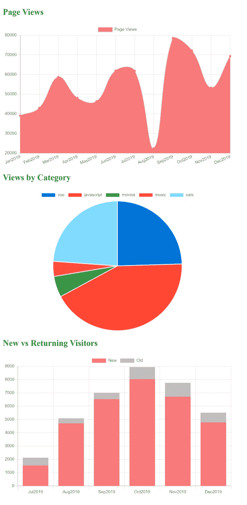
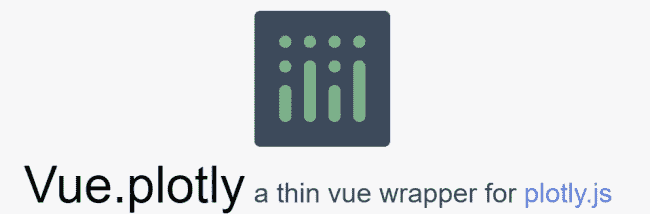
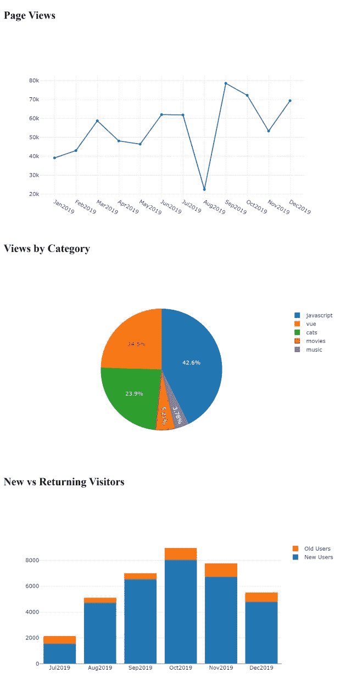
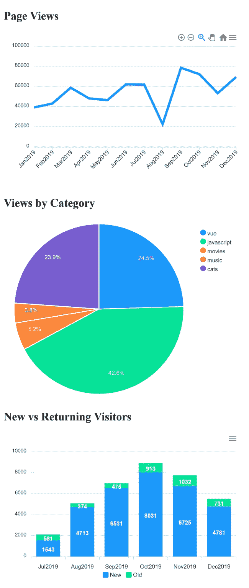

# 用 Vue 制图:一个比较日志火箭博客

> 原文：<https://blog.logrocket.com/charting-with-vue-a-comparison/>

当谈到客户端图表库时，开发人员有丰富的选择——有些是免费的，有些是付费的，有些专注于特定类型的图表，有些有许多不同的类型。

我想分享我使用几个不同的图表引擎和我最喜欢的前端框架的经验。但是在我们开始之前，让我们建立一些基本规则:

*   对于所有的库，我将使用相同的 JSON 数据集。这将是来自博客统计引擎的“富有想象力”的数据。我很好奇每个图表解决方案会让我改变多少数据才能正常工作。
*   对于我将要构建或者试图构建的所有库，我将使用相同的图表集:一个折线图、一个包含两组数据的条形图和一个饼图。
*   虽然不是一个交易破坏者，但我想看看哪些项目将让我使用“非 Vue 应用程序”——这是我描述对使用 Vue 来逐步增强简单 HTML 页面而不是构建整个应用程序的人的支持的笨拙方式。这是我最讨厌的事情；因为 Vue 支持这两种场景，所以我希望我的代码也支持这两种场景。

## 数据

为了支持我的三个图表，我在[https://api.jsonbin.io/b/5e2b4f673d75894195de48ff/1](https://api.jsonbin.io/b/5e2b4f673d75894195de48ff/1)有一个 JSONBin.io 端点，如下所示:

```
{
  "pageViews": [
    { "date": "Jan2019", "views": 39101 },
    { "date": "Feb2019", "views": 42983 },
    { "date": "Mar2019", "views": 58741 },
    { "date": "Apr2019", "views": 48071 },
    { "date": "May2019", "views": 46391 },
    { "date": "Jun2019", "views": 62001 },
    { "date": "Jul2019", "views": 61829 },
    { "date": "Aug2019", "views": 22412 },
    { "date": "Sep2019", "views": 78547 },
    { "date": "Oct2019", "views": 72190 },
    { "date": "Nov2019", "views": 53291 },
    { "date": "Dec2019", "views": 69341 }
  ],
  "pageViewsByCategory": {
    "vue": 51290,
    "javascript": 89125,
    "movies": 10892,
    "music": 7901,
    "cats": 49901
  },
  "newVsReturning": [
    { "date": "Jul2019", "new": 1543, "old": 581 },
    { "date": "Aug2019", "new": 4713, "old": 374 },
    { "date": "Sep2019", "new": 6531, "old": 475 },
    { "date": "Oct2019", "new": 8031, "old": 913 },
    { "date": "Nov2019", "new": 6725, "old": 1032 },
    { "date": "Dec2019", "new": 4781, "old": 731 }
  ]
}

```

第一组数据代表了一个博客 12 个月的浏览量。这将显示在折线图中。第二组包括关于独特类别的页面浏览量的统计数据。我将使用一个饼图来说明这一点。

最后，有一组统计数据来表示访问者是新的还是再次访问博客。为此，我将创建一个堆积条形图，其中每个条形显示两个值，以便您可以比较并查看随时间的变化。如果堆叠条形很困难，两个条形相邻就可以了，只要你还能分辨出你在看什么。

让我们看一些例子。

## `vue-chartjs`



[`vue-chartjs`](https://vue-chartjs.org/) 是 [Chart.js](https://www.chartjs.org/) 项目的包装器。Chart.js 是一个强大而漂亮的图表库，包括无数的图表类型——足以满足我对这个项目的需求。

安装支持基于应用程序和基于脚本的支持，这涵盖了所有的基础。但由于它的工作方式，我的直觉告诉我，这个项目将比基于脚本的场景更适合 Vue 应用程序。

从本质上来说，这个库并没有做太多开箱即用的事情。[文件](https://vue-chartjs.org/guide/)明确了这一点:

> vue-chartjs 背后的想法是提供易于使用的组件，具有最大的灵活性和可扩展性。为此，您需要创建自己的图表组件，并用提供的 vue-chartjs 组件扩展它。

因此，尽管我认为我可以简单地在代码中加入一个`<pie>`标签，但是`vue-chartjs`要求你首先构建自己的组件。

这不一定是一件坏事；它增强了一定程度的灵活性，您将在以后体会到这一点。但在我的情况下，我不得不花一些额外的时间来解决问题。

我也很难决定通过什么考试。由于该库提供了开箱即用的最小特性集，所以您需要了解更多关于 Chart.js 的工作原理。同样，我不是说这不好，但如果我知道这一点，我会在查看库之前先花更多时间在 Chart.js 本身上。我也希望`vue-chartjs`文档包含更多完整的演示。

举个例子，文档中的“[创建你的第一个图表](https://vue-chartjs.org/guide/#creating-your-first-chart)”部分实际上并没有告诉你你需要知道的一切。我会在这里提供更多的上下文和示例代码，理想情况下会导致用户可以运行的 CodePen 或 CodeSandbox 演示。还是那句话，如果你已经知道 Chart.js，那么这就不是问题了。但对我来说是。

话虽如此，一旦我度过了最初的学习难关，我就被深深打动了。让我们看看我构建的代码。

首先，顶层组件负责获取我的数据，然后使用我为图表构建的组件。下面是简单的布局:

```
><template>
  <div id="app">
    <h2>Page Views</h2>
    <LineChart v-if="loaded" :data="pageViews" :styles="styles"/>
    <h2>Views by Category</h2>
    <PieChart v-if="loaded" :data="pageViewsByCategory" :styles="styles"/>
    <h2>New vs Returning Visitors</h2>
    <BarChart v-if="loaded" :data="visitors" :styles="styles"/>
  </div>
</template>

```

每个图表组件都被传递了它需要的数据和一组一致的样式，它将在我的数据被加载后显示。

下面是 JavaScript 代码:

```
import LineChart from "./components/LineChart";
import PieChart from "./components/PieChart";
import BarChart from "./components/BarChart";

export default {
  name: "App",
  components: {
    LineChart,
    PieChart,
    BarChart
  },
  data() {
    return {
      loaded: false,
      pageViews: null,
      pageViewsByCategory: null,
      visitors: null,
      styles: {
        width: "650px",
        height: "400px",
        position: "relative"
      }
    };
  },
  async created() {
    let resp = await fetch(
      "https://api.jsonbin.io/b/5e2b4f673d75894195de48ff/1"
    );
    let data = await resp.json();
    this.pageViews = data.pageViews;
    this.pageViewsByCategory = data.pageViewsByCategory;
    this.visitors = data.newVsReturning;
    this.loaded = true;
  }
};

```

这只是点击远程 API(它只是一个托管的 JSON 包)，然后将结果数据分配到适当的位置。

现在让我们看看图表组件。

```
<script>
import { Line } from "vue-chartjs";

export default {
  extends: Line,
  name: "LineChart",
  props: ["data"],
  mounted() {
    // reformat in the way the lib wants
    let chartData = {
      labels: [],
      datasets: [
        {
          label: "Page Views",
          backgroundColor: "#f87979",
          data: []
        }
      ]
    };

    for (let i = 0; i < this.data.length; i++) {
      chartData.labels.push(this.data[i].date);
      chartData.datasets[0].data.push(this.data[i].views);
    }

    this.renderChart(chartData, {
      responsive: true,
      maintainAspectRatio: false
    });
  }
};
</script>

```

注意这里没有`<template>`。这是因为我包装的组件将处理布局。我的组件接收原始数据并将其重新格式化为 Chart.js 需要的格式。为了让这个工作，我查阅了每个相关图表类型的 [Chart.js 文档](https://www.chartjs.org/docs/latest/)。

基本就是这样。我的饼状图简单地转换了它处理数据的方式。

```
<script>
import { Pie } from "vue-chartjs";

export default {
  extends: Pie,
  name: "PieChart",
  props: ["data"],
  mounted() {
    // color list below came from https://stackoverflow.com/a/45489530/52160
    // reformat in the way the lib wants
    let chartData = {
      labels: [],
      datasets: [
        {
          label: "Views by Category",
          data: [],
          backgroundColor: [
            "#0074D9",
            "#FF4136",
            "#2ECC40",
            "#FF851B",
            "#7FDBFF",
            "#B10DC9",
            "#FFDC00",
            "#001f3f",
            "#39CCCC",
            "#01FF70",
            "#85144b",
            "#F012BE",
            "#3D9970",
            "#111111",
            "#AAAAAA"
          ]
        }
      ]
    };

    for (let category in this.data) {
      chartData.labels.push(category);
      chartData.datasets[0].data.push(this.data[category]);
    }

    this.renderChart(chartData, {
      responsive: true,
      maintainAspectRatio: false
    });
  }
};
</script>

```

注意 Chart.js 不提供开箱即用的默认颜色(据我所知)。这意味着我需要为我的图表提供一个颜色列表。如果这个库有一组我可以应用的默认颜色就好了。

最后，这里是条形图。默认情况下，图表是不堆叠的，但是您可以在底部看到选项来启用它。

```
<script>
import { Bar } from "vue-chartjs";

export default {
  extends: Bar,
  name: "BarChart",
  props: ["data"],
  mounted() {
    // reformat in the way the lib wants
    let chartData = {
      labels: [],
      datasets: [
        {
          label: "New",
          backgroundColor: "#f87979",
          data: []
        },
        {
          label: "Old",
          backgroundColor: "#c0c0c0",
          data: []
        }
      ]
    };

    for (let i = 0; i < this.data.length; i++) {
      chartData.labels.push(this.data[i].date);
      chartData.datasets[0].data.push(this.data[i].new);
      chartData.datasets[1].data.push(this.data[i].old);
    }

    this.renderChart(chartData, {
      responsive: true,
      maintainAspectRatio: false,
      scales: {
        xAxes: [
          {
            stacked: true
          }
        ],
        yAxes: [
          {
            stacked: true
          }
        ]
      }
    });
  }
};
</script>

```

我们可以让这三个组件看起来更好。例如，我硬编码了一些标签。

他们看起来怎么样？让我们看看:



请记住，我没有花任何时间试图让这些漂亮。你可以在我的 [CodeSandbox](https://codesandbox.io/s/vue-chartjs-demo-j73wd) 找到完整的源代码(和工作演示)。

## `vue-plotly`



接下来是`[vue-plotly](https://github.com/David-Desmaisons/vue-plotly)`，它自称是 [Plotly](https://plot.ly/) 的“薄包装器”，这是一个我以前从未听说过的图表库。`vue-plotly`仅支持通过 npm 安装，因此您不会在基于脚本的 Vue 应用程序中使用它。

一旦安装完毕，您只能获得一个组件`<Plotly>`，它使用一些属性。这使得它真的很快开始。您可以简单地指定您的数据和布局属性(开始时可以是空白的)并开始编码。虽然我的`vue-chartjs`演示花了一些时间来写，这一个是轻而易举的。

我试图遵循上一个例子中的相同模式和布局。首先，让我们看看 HTML。

```
<template>
  <div>

    <h2>Page Views</h2>
    <Plotly v-if="loaded" 
    :data="pageViewData" 
    :layout="layout" 
    :display-mode-bar="false" />

  <h2>Views by Category</h2>
    <Plotly v-if="loaded"
    :data="pageViewsByCategoryData"
    :layout="layout"
    :display-mode-bar="false" />

  <h2>New vs Returning Visitors</h2>
    <Plotly v-if="loaded"
    :data="visitorsData"
    :layout="layout"
    :display-mode-bar="false" />

  </div>
</template>

```

如您所见，我重复使用了同一个`<Plotly>`标签，只改变了我绑定到图表的数据。现在让我们看看代码。

```
import { Plotly } from 'vue-plotly'

export default {
    components: { Plotly },
    data() {
        return {
            loaded: false, 
            pageViewData:null, 
            pageViewsByCategoryData: null,
            visitorsData: null,
            layout: {
                autosize: false, 
                width:750,
                barmode:'stack'
            }
        }
    },
    async created() {
        let resp = await fetch("https://api.jsonbin.io/b/5e2b4f673d75894195de48ff/1");
        let data = await resp.json();

        let pageViews = data.pageViews;
        let pageViewsByCategory = data.pageViewsByCategory;
        let visitors = data.newVsReturning;

        // setup data for line chart
        this.pageViewData = [
            { x:[], y:[], type:'scatter' }
        ];

        pageViews.forEach(pv => {
            this.pageViewData[0].x.push(pv.date);
            this.pageViewData[0].y.push(pv.views);
        });

        // setup data for pie chart
        this.pageViewsByCategoryData = [
            {
                values: [],
                labels: [], 
                type: 'pie'
            }
        ];

        for(let cat in pageViewsByCategory) {
            this.pageViewsByCategoryData[0].labels.push(cat);
            this.pageViewsByCategoryData[0].values.push(pageViewsByCategory[cat]);
        }

        this.visitorsData = [
            { 
                x: [], 
                y: [],
                name:'New Users',
                type:'bar'
            },
            { 
                x: [], 
                y: [],
                name:'Old Users',
                type:'bar'
            }
        ]

        // setup data for stacked bar
        visitors.forEach(v => {
            this.visitorsData[0].x.push(v.date);
            this.visitorsData[0].y.push(v.new);
            this.visitorsData[1].x.push(v.date);
            this.visitorsData[1].y.push(v.old);
        });

        this.loaded = true;
    }
}

```

我的核心`data`包含我的图表数据的空值和一个它们共享的`layout`值。但是，请注意，`barmode`只适用于条形图。

我的`created`再次点击我的假 API，然后一个接一个地格式化每个图表的数据。 [Plotly JavaScript 文档](https://plot.ly/javascript/)做得很好，比 Chart.js 更直接一点。注意，我没有指定任何颜色；如果我想的话，我可以这样做，但是 Plotly 有一些很好的默认设置。

这是成品。



不幸的是，`vue-plotly`包在 CodeSandbox 上运行时出现了问题。不过，我在 Zeit 上复制了一份，你可以在这里运行它。

## `vue-apexcharts`


对于我的第三个也是最后一个图表库，我使用了`[vue-apexcharts](https://github.com/apexcharts/vue-apexcharts)`，这是一个 [ApexChart.js](https://apexcharts.com/) 图表库的包装器，和`vue-plotly`一样，我以前从未听说过。这个库对我来说是最简单的——尽管，公平地说，到目前为止，我已经有了很多构建图表的实践。

AppChart.js 只能通过 npm 安装。接着在你的`main.js`文件中快速添加一条:

```
import VueApexCharts from "vue-apexcharts";
Vue.use(VueApexCharts);
Vue.component("apexchart", VueApexCharts);

```

接下来，在组件中使用`<apexcharts/>`标签。

即使我发现这个库最容易使用，我仍然发现参数的组织是违反直觉的。我们来看一下样本，但首先是标签:

```
<apexchart width="500" type="bar" :options="chartOptions" :series="series"></apexchart>

```

到目前为止，一切顺利。

我喜欢将类型和宽度指定为顶级属性，但是请注意两个属性`chartOptions`和`series`。这些值如下所示:

```
chartOptions: {
  chart: {
    id: 'vuechart-example'
  },
  xaxis: {
    categories: [1991, 1992, 1993, 1994, 1995, 1996, 1997, 1998]
  }
},
series: [{
  name: 'series-1',
  data: [30, 40, 35, 50, 49, 60, 70, 91]
}]
}

```

`axis`信息似乎与数据值联系在一起，但是它在选项块中，而不是在数据块中。这可能看起来像是我在吹毛求疵，我肯定不是所有的开发人员都会同意，但这对我来说似乎很奇怪。话虽如此，但这并没有真正让我慢下来。以下是我的设计结果:

```
<h2>Page Views</h2>
<apexchart v-if="loaded" width="500" type="line" 
:options="pvOptions" :series="pvSeries"></apexchart>

<h2>Views by Category</h2>
<apexchart v-if="loaded" width="500" type="pie" 
:options="catOptions" :series="catSeries"></apexchart>

<h2>New vs Returning Visitors</h2>
<apexchart v-if="loaded" width="500" type="bar"
  :options="visitorOptions" :series="visitorSeries"></apexchart>

```

可读性很强，非常容易理解。代码与以前的版本非常相似——它获取数据，然后转换数据。

```
export default {
  name: "App",
  data() {
    return {
      loaded: false,
      pvOptions: null,
      pvSeries: null,
      catOptions: null,
      catSeries: null,
      visitorOptions: null,
      visitorSeries: null
    };
  },
  async created() {
    let resp = await fetch(
      "https://api.jsonbin.io/b/5e2b4f673d75894195de48ff/1"
    );
    let data = await resp.json();

    let pageViews = data.pageViews;
    let pageViewsByCategory = data.pageViewsByCategory;
    let visitors = data.newVsReturning;

    this.pvOptions = {
      xaxis: {
        categories: []
      }
    };

    this.pvSeries = [
      {
        name: "Page Views",
        data: []
      }
    ];

    pageViews.forEach(pv => {
      this.pvOptions.xaxis.categories.push(pv.date);
      this.pvSeries[0].data.push(pv.views);
    });

    this.catOptions = {
      labels: []
    };

    this.catSeries = [];

    for (let cat in pageViewsByCategory) {
      this.catOptions.labels.push(cat);
      this.catSeries.push(pageViewsByCategory[cat]);
    }

    this.visitorOptions = {
      chart: {
        stacked: true
      },
      xaxis: {
        categories: []
      }
    };

    this.visitorSeries = [
      {
        name: "New",
        data: []
      },
      {
        name: "Old",
        data: []
      }
    ];

    visitors.forEach(v => {
      this.visitorOptions.xaxis.categories.push(v.date);

      this.visitorSeries[0].data.push(v.new);
      this.visitorSeries[1].data.push(v.old);
    });

    this.loaded = true;
  }
};

```

唯一耗时的任务是弄清楚如何将最后一个条形图转换成堆叠条形图——但我说的是五分钟，不是五个小时。

结果是这样的。请注意，我从来没有指定任何样式数据，我认为它们出来相当不错。



你可以在我的 [CodeSandbox](https://codesandbox.io/s/apex-charts-tcfbz) 查看完整的源代码和在线演示。

## 结论

我希望这些例子对你有帮助。您可以在`[awesome-vue](https://github.com/vuejs/awesome-vue)`资源库中找到更多信息，这是一个与一切相关的 Vue 项目列表。我从[图表](https://github.com/vuejs/awesome-vue#charts)部分选择了我的项目。

## 像用户一样体验您的 Vue 应用

调试 Vue.js 应用程序可能会很困难，尤其是当用户会话期间有几十个(如果不是几百个)突变时。如果您对监视和跟踪生产中所有用户的 Vue 突变感兴趣，

[try LogRocket](https://lp.logrocket.com/blg/vue-signup)

.

[](https://lp.logrocket.com/blg/vue-signup)[https://logrocket.com/signup/](https://lp.logrocket.com/blg/vue-signup)

LogRocket 就像是网络和移动应用程序的 DVR，记录你的 Vue 应用程序中发生的一切，包括网络请求、JavaScript 错误、性能问题等等。您可以汇总并报告问题发生时应用程序的状态，而不是猜测问题发生的原因。

LogRocket Vuex 插件将 Vuex 突变记录到 LogRocket 控制台，为您提供导致错误的环境，以及出现问题时应用程序的状态。

现代化您调试 Vue 应用的方式- [开始免费监控](https://lp.logrocket.com/blg/vue-signup)。