# 为你的颤振项目选择正确的姿态

> 原文：<https://blog.logrocket.com/choosing-the-right-gestures-for-your-flutter-project/>

## 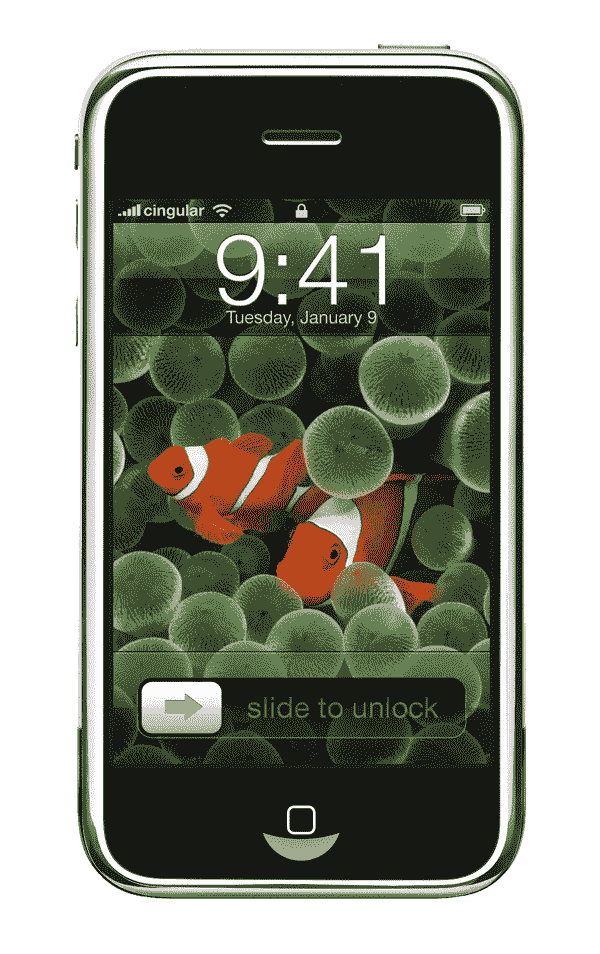

看到上面这张图，让你有点怀旧的感觉。虽然微软在市场上推出了触摸屏手机，但与苹果向全球推出的产品相比，它就相形见绌了:一款完全由人类触摸控制的手机。

当你从左向右滑动箭头按钮时，它解锁了你的手机，这就是众所周知的手势，这是令人难以置信的。

## 什么是移动设备上的手势？

手势是一个人与另一个人交流的方式。同样，它现在是一种与所有设备通信的方法，无论是移动电话、平板电脑、笔记本电脑还是大型触摸屏显示器。

手势已经跨越了物理数字的障碍，允许我们用身体与数字媒体互动。它让使用设备、数字应用和软件变得更加愉快和互动。此外，一个设计良好的应用程序或软件总是有更短的学习曲线，因为他们感觉很自然，很容易使用。

## 手势在移动设备上有什么优势？

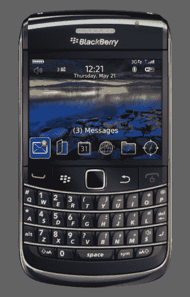

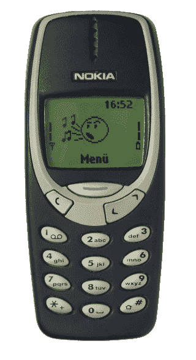

大约十年前，我们通过按键、拨号和在 qwerty 键盘或数字小键盘的帮助下键入冗长的信息来与移动电话进行交互。现在，只需轻轻点击、滑动或轻拂，用户就可以完全控制他们的设备。

手势对我们来说很自然，因为它与我们与现实世界中的物体互动的方式有关。

举一个人看报纸的例子。很自然，一个人会用食指翻页。以非常相似的方式，用户可以使用食指的滑动手势在他们的数字设备上翻页来阅读报纸、杂志和小说。

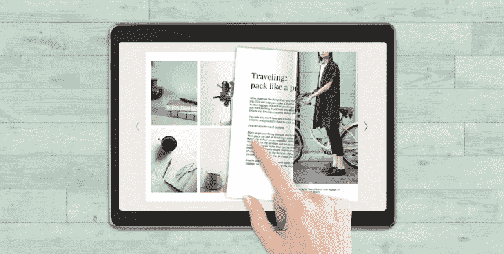

图片来自[blog.flipsnack.com](https://blog.flipsnack.com/how-to-start-a-digital-magazine/)。

如果我们总结手势的优点，我们可以说我们会有:

1.  更简洁的界面
2.  易用性
3.  更好地完成任务
4.  增加用户互动
5.  轻松的用户界面

## 手势的类型

现在让我们看看 Flutter 平台提供的手势类型，以及哪些小部件可以用来执行这些手势。我们还将看一些用例，根据材料指南，在这些用例中应该使用手势。

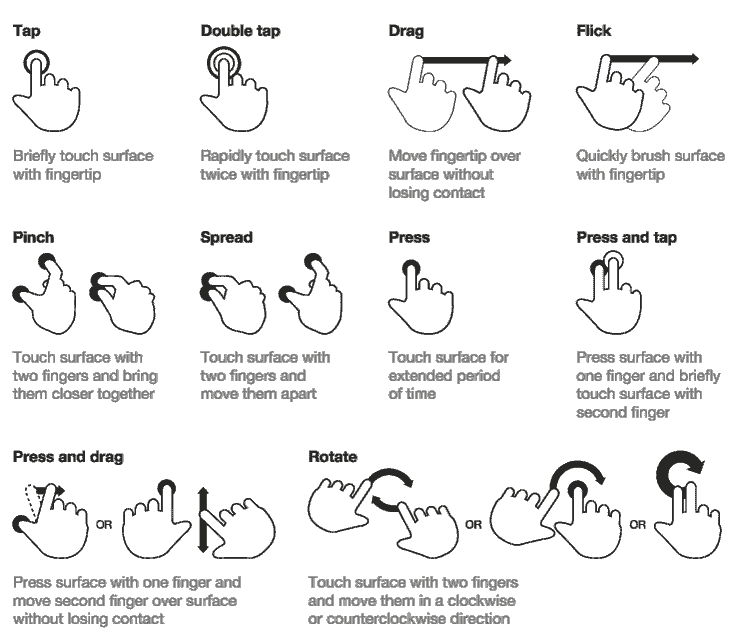

图片来自[uxplanet.org](https://uxplanet.org/in-app-gestures-and-mobile-app-usability-d2e737bd5250)。

所以，根据 Google here 提供的[素材指南，手势有三种类型。](https://material.io/design/interaction/gestures.html#types-of-gestures)

### 导航手势

在屏幕之间快速轻松移动的手势，这并不一定意味着你需要一个按钮来切换屏幕。它可以是文本、图标甚至图像。

导航手势包括:

1.  轻敲，水龙头
2.  滚动和平移
3.  拖
4.  偷窃
5.  少量

### 动作手势

顾名思义，一个突出的按钮，如浮动操作按钮，可以通过单击、长按或滑动在当前屏幕上执行快速操作。以 Gmail 为例，用户可以滑动来存档电子邮件，或者点击扩展 FAB 按钮来撰写电子邮件。

动作手势包括:

1.  轻敲，水龙头
2.  龙出版社
3.  偷窃

### 变换手势

使用两个或更多手指变换大小、位置和旋转。一个普遍的例子是谷歌地图。用户可以使用捏合缩放手势、双击缩放、拖放大头针或旋转地图。

变换手势包括:

1.  双击
2.  少量
3.  复合手势(旋转)
4.  选择并移动

请看下面的思维导图，解释了 Flutter 在其小部件中提供了前面提到的所有手势。

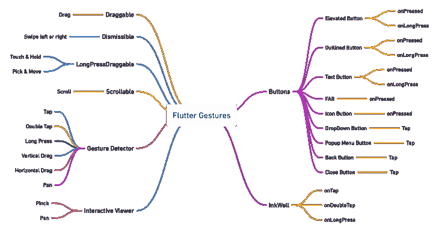

免责声明:下面我将使用的例子来自数百万人正在使用的流行应用程序。我不是在推广这些应用或拥有它们的公司，也没有直接或间接与它们有关联。我只是将它作为本文的参考，纯粹是为了学习。

## 为 WhatsApp 这样的文字应用选择正确的手势

让我告诉你为什么我决定使用真实世界的应用程序作为例子。每个程序员或设计师在学习阶段一定都尝试过克隆流行的应用，比如 Whatsapp、Telegram、Instagram 等。我知道我也努力过。

在构建这些类型的应用程序的背后有很多 R&D。此外，伟大的头脑聚集在一起设计和建造它。由于数百万人使用它，它已经过全面测试，使这些应用程序成为学习功能和 UI/UX 设计的理想选择。

所以我们来仔细考察一下 Whatsapp。虽然这些应用程序不是在 Flutter 平台上构建的，但我们仍然可以看到他们在哪里实现了手势，什么类型的手势，什么时候，为什么。如果我们必须使用 Flutter 平台构建类似的东西，我们应该使用哪些小部件来精确实现呢？

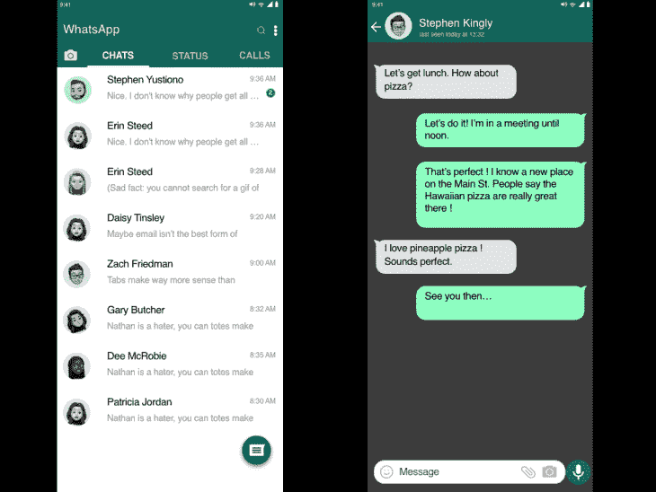

在继续之前，请花点时间考虑一下上面的图片。然后，从程序员的角度来审视用户界面。你认识多少种手势？

您可能在使用该应用程序时没有注意到它，但是如果您仔细观察，您会看到下面列出的所有手势。

### WhatsApp 使用哪些类型的手势？

1.  自动实现滑动手势以在屏幕之间切换的标签栏
2.  如果您点击个人资料图标，将会打开一个大图
3.  如果您点击任何单个列表项，它将打开一个新的聊天屏幕窗口
4.  长按特定列表项将选择它
5.  捏合以放大其他用户发送的个人资料图片和图像

### 如果我必须在 **Flutter** 中克隆这个屏幕，我会使用哪些小工具？

1.  [选项卡](https://blog.logrocket.com/flutter-tabbar-a-complete-tutorial-with-examples/)小部件
2.  [ListView](https://blog.logrocket.com/creating-listviews-in-flutter/) 带生成器功能
3.  [手势检测器](https://blog.logrocket.com/handling-gestures-flutter-gesturedetector/)点击个人资料图标
4.  手势检测器对单个项目进行`LongPress`
5.  手势检测器在特定列表项目上环绕`ListTile`到`Tap`
6.  手势检测器从左至右指向`Swipe`
7.  [交互查看器](https://api.flutter.dev/flutter/widgets/InteractiveViewer-class.html)小部件使用`Pinch`和`Pan`手势

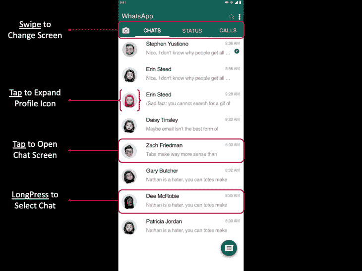

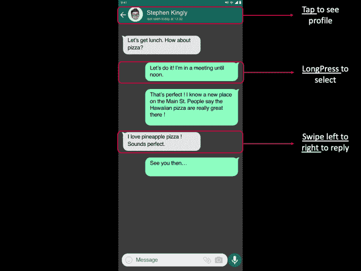

### 手势在哪里实现？

如果你看 UI，它很简单。这里没有学习曲线，因为它对任何用户来说都是自然而然的。此外，主屏幕和聊天屏幕上都有手势，因此用户可以轻松地与应用程序进行交互。例如，仅 ListView 就有三种不同的手势。

### 什么时候用手势？

当用户想要阅读消息时，用户点击列表中的单个项目。

当用户想要删除一个聊天时，用户将长按它。

当用户想要查看个人资料图片时，他们可以点击放大图片。

### 一个重要的问题:为什么？

让我们想象一个替代的 UI。如果我们没有手势，用户将如何选择聊天？

以前，我们有带物理按钮的手机，我们用四个箭头按钮来滚动电话信息。要选择一条消息，我们必须点击中间的按钮。然后，我们必须单击选项来删除消息，并向下滚动以选择删除。这是一个漫长的过程。

在聊天屏幕的当前场景中考虑上述情况。然后，看看下面的模型，想象一下用户对它的感觉以及与应用程序的交互。

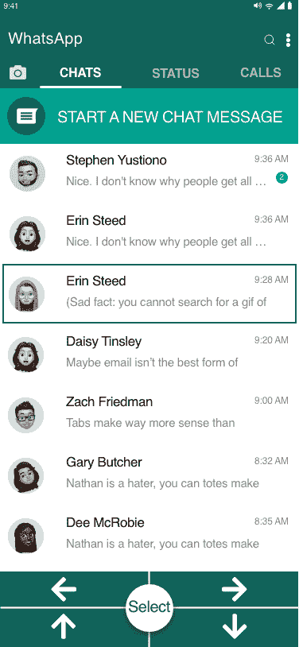

今天，我们有不同尺寸的手机，所以这里有一个拇指区域。如果用户用右手或左手握住手机，任何设计师或程序员都会考虑拇指能伸多远来操作手机。然后，设计师考虑实现手势，用另一只手与应用程序的其他部分进行交互。

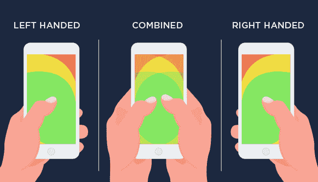

图片由 [dev 提供给](https://dev.to/jason_kane7/what-makes-a-great-mobile-ui-ux-design-opo)。

再次，回到 WhatsApp 例子的主屏幕，用户可以用拇指点击、滚动、滑动，并通过点击浮动操作按钮开始新的聊天。只有当用户想要点击屏幕上方时，他们才需要用另一只手。

## 让我们看看其他例子

在 Gmail 中，用户界面类似于 WhatsApp 的主屏幕。用户可以通过点击圆形图标或长按消息本身来选择消息。Flutter 使用 GestureDetector 小部件提供了类似的功能。然而，Gmail 增加了一个手势:使用[可缩小的小工具](https://api.flutter.dev/flutter/widgets/Dismissible-class.html)滑动以存档，或滑动以删除。

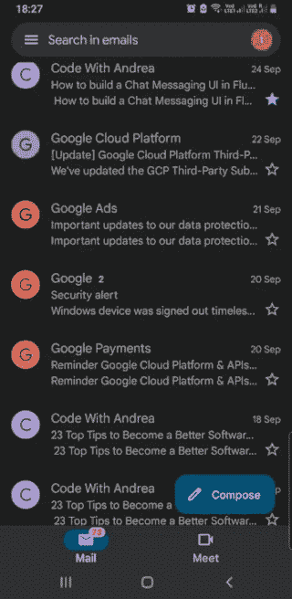

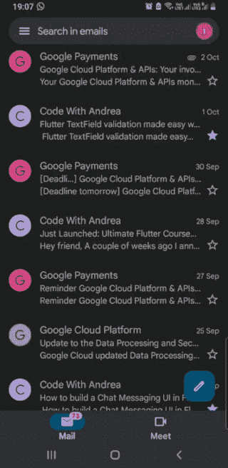

其次，在 Keep Notes 应用程序中，用户可以根据他们的优先级对笔记重新排序，如上图所示。此外，用户可以滑动来存档特定的笔记。由 Flutter 提供的一个[可拖动部件](https://blog.logrocket.com/drag-and-drop-ui-elements-in-flutter-with-draggable-and-dragtarget/)和一个[可缩小部件](https://api.flutter.dev/flutter/widgets/Dismissible-class.html)可以在你的应用程序中创建一个类似的 UI。

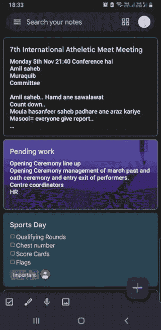

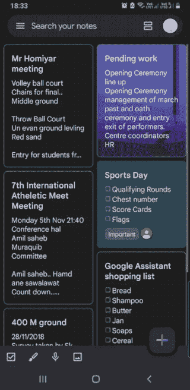

同样，Instagram 有一个双击的手势来喜欢一个帖子，两个手指的手势来放大图像，并且在每个帖子下面还有一个心形图标。虽然点击心形图标需要少点击一次，但 Instagram 仍然实现了双击来喜欢帖子。为什么？因为它允许用户更快地滚动并有更大的区域来点击，并且点击你喜欢的图像或视频是直观的。

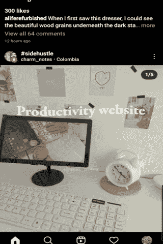

如果我在 Flutter 中构建类似的东西，一个卡片部件结合一个[手势检测器](https://blog.logrocket.com/handling-gestures-flutter-gesturedetector/)或一个[墨水池](https://api.flutter.dev/flutter/material/InkWell-class.html)部件就能做到这一点。

## 结论

这是我成为开发人员后学到的东西。首先，我开始是一名 Android 开发者，然后是一名 Flutter 开发者。接下来，我创建了自己的 UI，并围绕它开发了应用程序。最后，经过大量的阅读和研究，我认为人们应该考虑根据你正在构建的应用程序的类型来问这些问题:

1.  你应该实现什么类型的按钮或手势？
2.  你应该在哪里放置一个按钮或手势？
3.  用户应该在什么时候能够与之交互？
4.  你为什么要实施它？

有常见的移动应用类别，如生产力、社交媒体、教育、游戏等。如果你的应用属于这些类别中的任何一个，你应该考虑检查属于这些类别的应用。

学习应用程序可以让你深入了解如何设计 UI/UX。因为无论你在编写什么类型的应用程序，很少有小部件是常用的。用户界面也彼此非常相似，所以根据已经测试过的应用程序实现手势将使你的应用程序直观且具有交互性。而 Flutter 提供了构建一个奇妙应用程序的所有工具。

我想以这最后一点来结束我的演讲，一个有效的产品总是最有用的。

## 使用 [LogRocket](https://lp.logrocket.com/blg/signup) 消除传统错误报告的干扰

[LogRocket](https://lp.logrocket.com/blg/signup) 是一个数字体验分析解决方案，它可以保护您免受数百个假阳性错误警报的影响，只针对几个真正重要的项目。LogRocket 会告诉您应用程序中实际影响用户的最具影响力的 bug 和 UX 问题。

然后，使用具有深层技术遥测的会话重放来确切地查看用户看到了什么以及是什么导致了问题，就像你在他们身后看一样。

LogRocket 自动聚合客户端错误、JS 异常、前端性能指标和用户交互。然后 LogRocket 使用机器学习来告诉你哪些问题正在影响大多数用户，并提供你需要修复它的上下文。

关注重要的 bug—[今天就试试 LogRocket】。](https://lp.logrocket.com/blg/signup-issue-free)