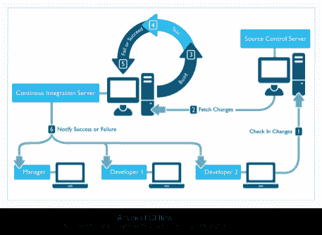
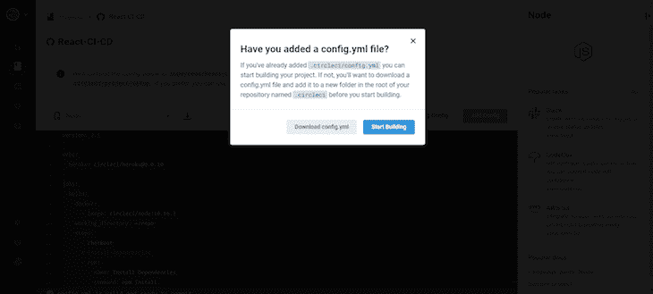
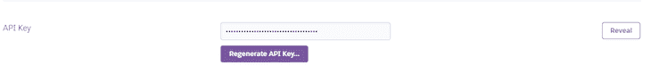
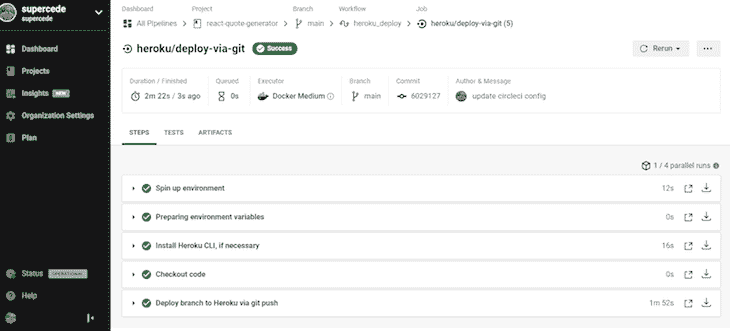
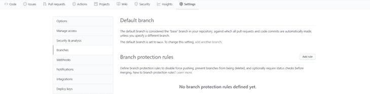
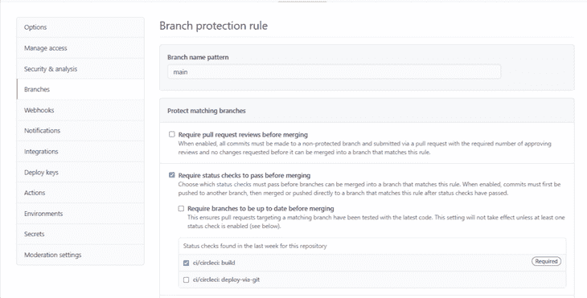
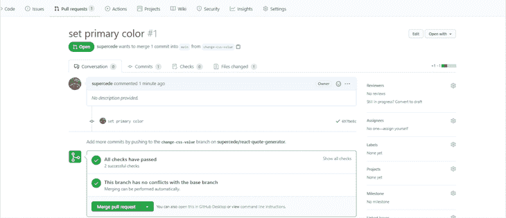

# CI/CD 和 React:使用 Heroku 和 CircleCI 创建管道

> 原文：<https://blog.logrocket.com/ci-cd-and-react-create-a-pipeline-using-heroku-and-circleci/>

当构建 React 应用程序，尤其是更大的应用程序时，你将经常与不同 Git 分支和不同环境(登台、开发、生产等)中的不同开发人员团队[一起工作。).尽管人多力量大，但在 web 开发中，许多单独的代码会让人非常头疼。](https://blog.logrocket.com/the-git-workflow-you-need-how-to-deal-with-multiple-teams-in-a-single-repository-faf5bb17a6e4/)

像合并分支和将新的变更集成到现有代码库中这样的处理实例可能会成为一些开发人员所称的“集成地狱”。幸运的是，这些麻烦可以很容易地避免，或者至少最小化，有一个强大的 CI/CD 管道。

## 基础:了解 CI 和 CD

在开始演示之前，让我们回顾一下 CI 和 CD 的基础知识。提醒您一下，持续集成(CI)和持续交付(CD)是 DevOps 中采用的一系列自动化步骤。

### 连续累计

CI 创建了一种一致的、自动化的方式，将开发团队的多个成员的代码变更集成到一个中央存储库或项目中。

如前所述，大型项目通常需要开发人员处理不同的特性和分支，然后将它们合并成一个共享的分支。当开发人员签入他们更新的工作时(例如，通过一个 pull 请求)，通过自动构建应用程序并运行不同的测试(通常是单元测试和集成测试)来验证这些更改，以确保这些更改没有破坏应用程序。然后团队会立即被告知测试的状态，根据测试的结果，可以将变更合并到主工作中。

下图显示了典型的 CI 流程:



值得注意的是，一个好的 CI 系统非常依赖于开发人员编写的测试。您可以在 React [这里](https://blog.logrocket.com/jest-and-enzyme-unit-testing-in-react-in-2021/)开始编写测试。

### 连续交货

不出所料，持续集成之后就是持续交付(CD)。CD 确保在成功合并新特性或分支后，立即自动部署您的应用程序。

一旦您的单元和集成测试已经通过，并且分支已经与主共享分支合并，CD 会自动将您的应用程序部署到您的目标环境中。这可以是生产环境，也可以是用于实时测试的试运行环境。

## 为 React 应用程序创建 CI/CD 管道

现在，我们已经了解了 CI 和 CD 的基础知识，我们可以将我们的知识付诸实践，为 React 应用程序创建 CI/CD 管道。对于这个演示，假设您已经掌握了 git 和 GitHub 的基本知识。我们还将使用 CircleCI for CI/CD 和 Heroku 作为我们的托管服务。

在我们开始之前，这里有一些基本的设置步骤:

*   创建 [GitHub](https://github.com/join) 和 [Heroku](https://signup.heroku.com/) 账户，如果你还没有的话
*   [将](https://circleci.com/signup/)您的 GitHub 帐户连接到 CircleCI
*   为这个项目派生并克隆我们的[示例 repo](https://github.com/supercede/React-CI-CD) 。

### CircleCI 和 Heroku 是什么？

CircleCI 是一个 CI/CD 服务，可以集成到您的存储库中(GitHub、GitHub Enterprise 或 Bitbucket)。每当您将代码提交到 repo 中时，它都会创建并运行您在 config.yml 文件中创建的管道，并为您提供测试的状态报告。CircleCI 对开源项目(包括在 GitHub 上公开的项目)是免费的。

Heroku 是一个云托管服务。我们将在 Heroku 上托管我们的应用程序，我们将配置 CircleCI，以便在应用程序更新时自动将其部署到我们的 Heroku URL 上。

### 设置 React 应用程序

克隆应用程序后，运行以下命令启动它:

```
npm install
npm start
```

您的应用程序应该在端口 3000 上启动(如果可用)。如果成功，您将看到如下所示的报价生成器:


这个应用程序从一个文件中检索辛普森一家的引用，并随机提供给他们。您可以通过单击箭头按钮来生成新报价，或者通过单击 Twitter 图标来发布报价。

### 设置您的 Heroku 托管环境

首先，我们将创建一个新的 Heroku 应用程序来托管 React 应用程序。请注意，在部署的剩余部分，我们将通过命令行工作。

如果您还没有安装 Heroku CLI，您需要通过运行以下命令进行全局安装:

```
npm i -g heroku
```

然后，您可以通过命令行(这将打开一个浏览器窗口)登录 Heroku，运行:

```
heroku login
```

我们可以通过使用 buildpack 来部署 React 应用程序。Buildpacks 是一组用于在 Heroku 上编译应用程序的脚本。它们使部署更容易，并且通常是开源的。对于我们的 React 应用程序，我们将使用 [create-react-app](https://github.com/mars/create-react-app-buildpack) 的构建包。

我们的下一步是通过命令行使用我们的 buildpack 创建一个 Heroku 应用程序，命令如下(将`$APP_NAME` 改为您喜欢的应用程序名称):

```
heroku create $APP_NAME --buildpack https://github.com/mars/create-react-app-buildpack.git
```

对于这个演示，在这个 URL 创建一个应用程序:[https://APP _ name . heroku APP . com](https://APP_NAME.herokuapp.com)。当您访问该网址时，您将看到股票 Heroku 页面:


### 确认您的 Git 存储库

您可能已经在命令行中注意到了，Heroku 还为您的应用程序创建了一个 git 存储库。您可以通过键入 Git remote -v 来确认这一点，您将看到 origin 和 Heroku 远程分支。

此时，添加并提交您的代码(如果它已被修改)，然后通过以下步骤推送到远程 Heroku git 存储库:

```
git add .
git commit -m 'commit message here'
```

如果您当前在主分支上，您可以使用以下命令直接推送至 Heroku:

```
git push heroku master
```

如果不是，使用这个命令从当前分支推送到 Heroku 主分支(记住用当前分支替换' $BRANCH_NAME '):

```
git push heroku $BRANCH_NAME:master
```

然后 Heroku 会推送你的 app，部署到[https://APP _ name . heroku APP . com](https://APP_NAME.herokuapp.com)。您可以访问网站，查看您的应用程序是否处于活动状态。

既然我们已经成功地将我们的应用程序部署到 Heroku，那么是时候设置 CircleCI 了。

### 在与 CircleCI 反应中配置 CI/CD

下一步是配置 CircleCI。首先，用你的 GitHub 档案登录 CircleCI。

在 Projects 侧选项卡上，您将看到所有公共 GitHub 项目的列表。若要设置 CircleCI，请点按“设置项目”您应该看到一个弹出的编辑器，带有“添加配置文件”或“使用现有配置”的选项。选择“使用现有配置”选项这表明您正在手动设置配置文件，而不是使用显示的示例。



当您选择“使用现有配置”时，应该会弹出一个如上图所示的窗口。点击“开始构建”因为我们还没有设置我们的配置属性，所以单击 start building 将启动一个最初会失败的构建。

要设置正确的配置，您需要为 Heroku 应用程序创建环境变量。你可以点击项目右上角的项目设置按钮，然后点击环境变量侧菜单。


在这里，您将设置您的`HEROKU_APP_NAME`和`HEROKU_API_KEY`。您的`HEROKU_APP_NAME`是您的 Heroku 应用程序(使用 buildpack 创建的应用程序)的名称。你的`HEROKU_API_KEY`是你注册 Heroku 后为你创建的一把钥匙，应该保密。你可以在你的[账户设置](https://dashboard.heroku.com/account)中得到你的 Heroku API 密匙，就在页面的末尾。它是隐藏的，但可以通过单击旁边的显示按钮来显示



稍后我们将回到为什么你需要这些。

至此，我们将在本地设置我们的 CircleCI 配置。在项目文件夹的根目录下，创建一个名为`.circleci`的文件夹(注意句号)。在该文件夹中，我们将创建一个`config.yml`文件。

在里面。yml 文件中，粘贴以下代码:

```
version: 2.1

orbs:
  heroku: circleci/[email protected]

jobs:
  build:
    docker:
      - image: circleci/node:10.16.3
    working_directory: ~/repo
    steps:
      - checkout
      # install dependencies
      - run:
          name: Install Dependencies
          command: npm install
      - run:
          name: Run tests
          command: npm run test

workflows:
  heroku_deploy:
    jobs:
      - build
      - heroku/deploy-via-git: # Use the pre-configured job, deploy-via-git
          requires:
            - build
          filters:
            branches:
              only: main
```

起初，这段代码看起来可能很多，但是当我们分解它时，它实际上非常简单。

我们从`version`开始。这表明我们正在运行哪个版本的 CircleCI。每个版本都有可能在其他版本中不存在的特性，所以陈述你的构建版本是很重要的。对于我们的演示，我们使用的是版本 2.1

接下来，`orbs`。还记得 Heroku 的构建包吗？圆形对 CircleCI 来说有点像。orb 是一个准备好的包，其中包含可重用的 CircleCI 配置，可以跨项目重用。在我们的项目中，我们将使用 Heroku orb，它包括像`heroku/deploy-via-git`这样的作业，通过 Git 库部署你的应用程序，帮助我们跳过许多配置。

接下来:`jobs`。作业是在 CircleCI 构建过程中运行的步骤的集合。在我们的配置文件中，我们创建了一个作业(build ),它有两个步骤:安装依赖项和运行测试。我们正在使用的 Heroku orb 也有一个我们在工作流部分使用的作业:`heroku/deploy-via-git`。

最后，工作流指的是一组用于定义一组作业及其运行顺序的规则。工作流还指示其他作业运行所需的作业。例如，`heroku/deploy-via-git`作业要求构建作业成功。因此，除非我们的测试通过，否则我们的应用程序不会部署到 Heroku。由于我们还将工作限制在我们的主分支，我们的代码将只部署到这个分支的变更上。

### 使用 React 和酶编写测试

在这个阶段，按原样提交和推送我们的文件将会导致错误，因为我们的测试将会失败。在本节中，我们将使用 React 测试库和 Enzyme 在 App.test.js 文件[中编写一些测试。](https://blog.logrocket.com/enzyme-vs-react-testing-library-a-mindset-shift/)

首先，安装酵素:

```
npm i enzyme
```

然后，根据您的 React 版本，您需要安装一个酶适配器(见下文)。你可以在 [npm 主页](https://www.npmjs.com/package/enzyme)找到更多适配器。

```
# For React 17
npm i @wojtekmaj/enzyme-adapter-react-17

# For react 16.4 
npm i enzyme-adapter-react-16
```

现在，将以下测试添加到 App.test.js 中:

```
import { render } from '@testing-library/react';
import Enzyme, { mount } from 'enzyme';
import App from './App';
import Quotes from './components/Quotes';

// Add your adapter version below
import Adapter from '@wojtekmaj/enzyme-adapter-react-17';

Enzyme.configure({ adapter: new Adapter() });

test('displays a quote', () => {
  render(<App />);
  const quote = document.querySelector('#text p');
  expect(quote).toBeInTheDocument();
  expect(quote).not.toBeEmptyDOMElement();
});

it('calls generateRandomQuote prop function when next button is clicked', () => {
  const generateRandomQuoteFn = jest.fn();
  const quote = mount(
    <Quotes generateRandomQuote={generateRandomQuoteFn} quote={{}} />
  );
  const generateBtn = quote.find('#new-quote');

  generateBtn.simulate('click');
  expect(generateRandomQuoteFn).toHaveBeenCalledTimes(1);
});
```

设置好测试后，我们现在可以提交代码并将其推送到我们的存储库:

```
git add .
git commit -m 'add circleci config'
git push
```

这应该会触发 CircleCI 上的另一个构建，应该会成功。如果是这样，您将看到所有绿色复选标记，如下所示:



### 管理拉取请求

接下来，我们将确保我们的主 GitHub 分支受到保护，确保除非我们的构建通过，否则拉请求不能被合并。

为此，在 GitHub 存储库上，转到 settings 选项卡。从那里，点击**分支**选项卡中的**添加规则**:



将`main`添加到分支名称模式。

在**合并前需要通过状态检查**菜单下，选择 **ci/circleci: build** 选项:



现在，您可以签入存储库中的一个新分支，创建一个拉请求，并对其进行测试。

例如，在 index.css 文件中，您可以通过更改 css 值(如背景色)来更改应用程序的背景色。然后，提交您的更改并创建一个 PR。



成功！我们有绿色，我们可以合并！

一旦我们将我们的分支合并到 main 中，构建和 heroku/deploy-via-git 作业将开始运行。如果成功，我们的应用程序将被部署到 Heroku。你也可以对失败的测试做同样的尝试。

对于 CircleCI 配置的完整项目，请查看 [GitHub](https://github.com/supercede/react-quote-generator) 上的报价生成器演示。

### 最后的想法

在本教程中，我们已经能够使用 React 设置 CI/CD 管道。我们创建的配置文件适用于我们可能希望在 Heroku 上托管的任何和所有 React 应用程序。对于具有不同环境的应用程序，您可以创建多个作业，并针对特定的分支对它们进行过滤(就像我们在上面对 main 所做的那样)。

这样做的配置应该是这样的:

```
version: 2.1

orbs:
  heroku: circleci/[email protected]

jobs:
  build:
    docker:
      - image: circleci/node:10.16.3
    working_directory: ~/repo
    steps:
      - checkout
      # install dependencies
      - run:
          name: Install Dependencies
          command: npm install
      - run:
          name: Run tests
          command: npm run test

workflows:
  heroku_deploy:
    jobs:
      - build
      - heroku/deploy-via-git: # Use the pre-configured job, deploy-via-git
          app-name: $HEROKU_PRODUCTION_APP_NAME
          requires:
            - build
          filters:
            branches:
              only: main
      - heroku/deploy-via-git: # Use the pre-configured job, deploy-via-git
          app-name: $HEROKU_STAGING_APP_NAME
          requires:
            - build
          filters:
            branches:
              only: develop
```

注意`HEROKU_PRODUCTION_APP_NAME`和`HEROKU_STAGING_APP_NAME`是环境变量，应该在 CircleCI 中设置。

## 结论

在现代应用程序开发中，持续集成和持续交付的重要性不能被夸大。从现在开始，您可以调整 CircleCI 配置以适应您的应用程序需求，或者尝试其他 CI/CD 工具，如 TravisCI、Azure DevOps 和 Jenkins。

为了与您的开发运营团队进行最佳协作，我建议使用 CI 和 CD 来避免集成噩梦。

## 使用 LogRocket 消除传统反应错误报告的噪音

[LogRocket](https://lp.logrocket.com/blg/react-signup-issue-free)

是一款 React analytics 解决方案，可保护您免受数百个误报错误警报的影响，只针对少数真正重要的项目。LogRocket 告诉您 React 应用程序中实际影响用户的最具影响力的 bug 和 UX 问题。

[ ](https://lp.logrocket.com/blg/react-signup-general) [  ](https://lp.logrocket.com/blg/react-signup-general) [LogRocket](https://lp.logrocket.com/blg/react-signup-issue-free)

自动聚合客户端错误、反应错误边界、还原状态、缓慢的组件加载时间、JS 异常、前端性能指标和用户交互。然后，LogRocket 使用机器学习来通知您影响大多数用户的最具影响力的问题，并提供您修复它所需的上下文。

关注重要的 React bug—[今天就试试 LogRocket】。](https://lp.logrocket.com/blg/react-signup-issue-free)