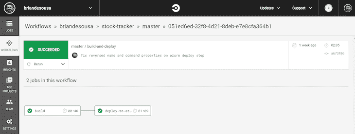
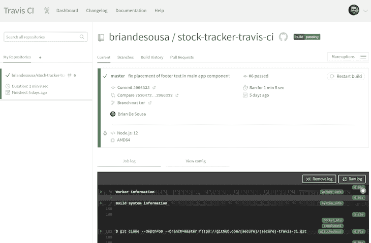
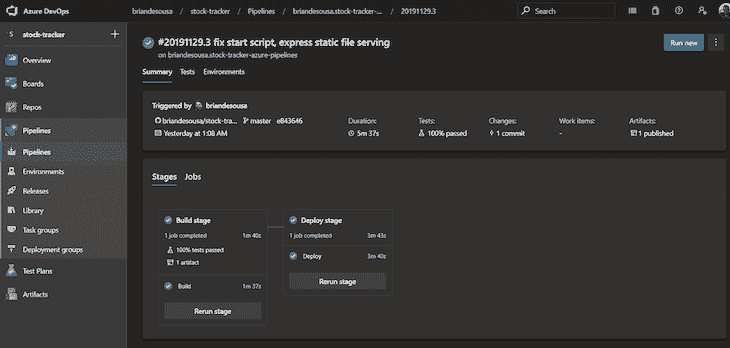
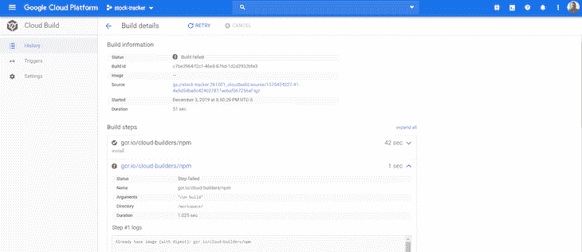
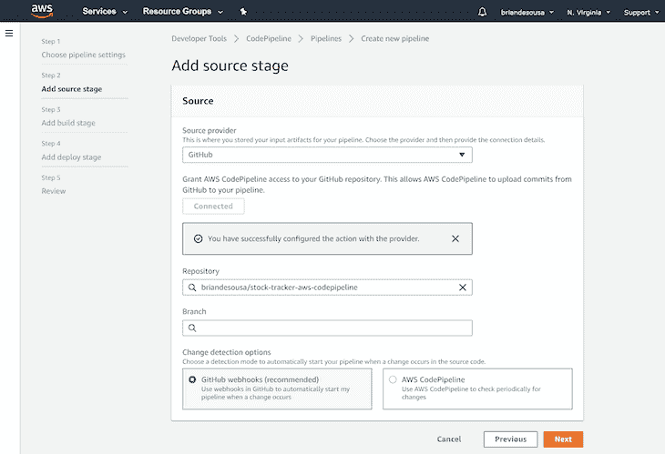

# CI/CD 工具比较:CircleCI 和 Travis CI 与主要 CSP-log rocket 博客

> 原文：<https://blog.logrocket.com/ci-cd-tools-compared-circleci-travis-ci-vs-major-csps/>

近年来，软件行业在持续集成和持续部署领域出现了创新爆炸。已经建立了许多工具和服务来提供 CI/CD 管道的关键部分，但是只有少数几个组织建立了完整的 CI/CD 系统，并且将自己确立为事实上的标准。其中最重要的是 CircleCI 和 Travis CI。

然后是大型云服务提供商(CSP ),如微软、谷歌和亚马逊，它们都在构建自己的 CI/CD 系统。但是，为什么您要使用他们的工具，而不是来自成熟的、有目的的组织的工具呢？是否有任何供应商锁定问题需要考虑？这些只是我将试图回答的几个问题。

我将从简要回顾被比较的五个工具开始，分为两类:目的驱动工具(CircleCI 和 Travis CI)和 CSP 工具(Azure Pipelines、Google Cloud Build、AWS CodePipeline)。我将重点介绍每种工具的突出特点，然后再深入一点，比较五个方面的工具:

1.  初始 CI/CD 管道设置经验
2.  随着您的组织的成长和任何潜在的成长烦恼的可扩展性
3.  CI/CD 渠道的灵活性和可扩展性
4.  供应商锁定问题
5.  您可能希望使用 CSP 工具而不是目的驱动工具的原因

## CI/CD 工具概述

除非另有说明，否则您可以假设每个工具都有一套标准的功能，包括:

*   支持多种语言和运行时
*   用代码定义您的构建和部署过程(通常以 YAML 格式)
*   能够运行单元测试并报告结果
*   当管道成功或失败时发送通知
*   在构建时支持动态环境变量
*   安全管理构建时所需的机密输入

这些都是开发人员在 CI/CD 管道中所期望的功能。相反，我将强调每个工具的一些独特功能。

## 目的驱动的工具:CircleCI 和 Travis CI

CircleCI 和 Travis CI 都是 CI/CD 工具领域的重量级人物。每种工具都有独特的功能，适合稍微不同的受众。

### 绕圈圈圈圈圈圈圈圈圈圈圈圈圈圈圈圈圈圈圈圈圈圈圈圈圈圈圈圈圈圈圈圈圈圈圈圈圈圈圈圈圈圈圈圈圈圈圈圈

CircleCI 提供了一个名为 CircleCI Cloud 的托管工具和一个名为 CircleCI Server 的自托管工具。这些工具有许多相似之处，也有一些关键的不同之处。

这两个工具都允许您在 Linux 上使用各种语言和运行时进行构建。只有 CircleCI Cloud 支持 Windows 或 Mac 版本，这意味着 CircleCI Server 不再支持。NET、Swift 和 Objective-C 构建。两者都允许您指定一个您希望您的构建在其中运行的容器。

CircleCI 通常将 CI/CD 管道称为“工作流”，它让您可以将多个构建作业以一种漂亮的可视化表示方式连接在一起。CircleCI Cloud 支持在工作流中添加“orb”。orb 是预先打包的、可重用的构建步骤，允许您快速集成许多第三方功能，例如向 Slack 通道发送通知或部署到 AWS。不幸的是，CircleCI 服务器不支持 orb。

### 特拉维斯·CI

Travis CI 还提供了一个托管工具，以及一个名为 Travis CI Enterprise 的自托管工具。这两个工具都允许您在 Linux、Windows 或 macOS 上使用各种语言和运行时进行构建。

您还可以在这两个工具中定义“构建矩阵”。构建矩阵本质上允许您针对不同版本的语言、运行时、环境和/或包版本并行运行多次构建。与本文中涉及的所有其他工具相比，这个功能是强大而独特的。

Travis CI 托管工具专注于开源社区支持，甚至包括免费使用层和对所有开源项目的测试。另一方面，Travis CI Enterprise 专注于添加大型企业通常需要的功能，如 GitHub Enterprise integration(它与 Active Directory 集成一起提供)和具有高可用性和负载平衡的本地服务器设置。

### 比较 CircleCI 和 Travis CI

正如您到目前为止所看到的，CircleCI 和 Travis CI 的自托管版本有很大不同。另一个很大的区别是如何在每个工具的代码中定义 CI/CD 管道。

CircleCI `config.yml`文件可以包含多个作业，这些作业包含您想要在任何容器上运行的任何步骤(命令)。您还可以定义工作流，将作业串联到管道中。

另一方面，Travis CI `travis.yml`文件更加结构化。您可以在 YAML 文件的顶部指定一种构建语言。每种构建语言都有一个定义良好的作业生命周期，如果没有明确指定任何步骤，还会有指定的阶段和逻辑默认步骤(命令)。

## CSP 工具:Azure Pipelines、Google Cloud Build 和 AWS CodePipeline

现在我们来看看三大云服务提供商提供的工具。毫不奇怪，这些工具都紧密集成到各自的云平台中。

### 天蓝色管道

Azure Pipelines 被宣传为一个完整的 CI/CD 系统，可以构建任何东西并在任何地方部署。虽然它肯定能够支持部署到其他云提供商，但文档和示例都侧重于部署到 Azure。它提供了与更大的 Azure DevOps 平台和一个相当大的市场的深度集成，该市场具有可以向您的管道添加新集成的扩展。

它还包含一个智能的基于 web 的管道创建向导，该向导可以检测您的应用程序使用的技术，然后生成一个详细的`azure-pipelines.yml`文件作为起点。与其他工具相比，该向导可能不是最快的设置体验，但它在生成定制管道以适应开箱即用的应用程序方面做得很好。

Azure 管道在构建可以运行的地方非常灵活。一个管道可以有多个作业，这些作业在运行不同操作系统(Linux、Windows 或 macOS)的不同构建代理上运行，支持多种语言和运行时。

生成代理可以是 Microsoft 托管的，也可以是自托管的。构建可以直接在构建代理上运行，也可以在构建代理上的容器中运行，整个 Azure Pipelines 产品本身可以使用自托管选项在内部运行。

### 谷歌云构建

与同类产品相比，Google Cloud Build 是一款更新的工具。这个工具主要关注于构建容器化的应用程序。该工具有一些区别于其他工具的特征和限制。

构建在“云构建器”中运行，云构建器本质上是一个容器。有几个官方支持的云构建器运行 Linux 并支持各种通用语言和运行时。不幸的是，没有 Windows 或 macOS 云构建器。

Google Cloud Build 主要关注持续集成。如果您想要持续地将应用程序部署到一个环境中，您将需要集成其他工具，如 Spinnaker 或 Jenkins。也就是说，有相当多的文档介绍了如何将这些流行的工具集成到您的构建中。

Google Cloud SDK (CLI)可用于远程触发构建，甚至在本地运行构建，以进行测试和调试。

### AWS 代码管道

AWS CodePipeline 是几个紧密集成在一起的 Amazon 工具之一，是构建 CI/CD 管道所必需的。CodeBuild 和 CodeDeploy 是另外两个您最想安装的工具。事实上，亚马逊在确保其所有 AWS 工具和服务获得一流待遇方面做得很好。

还有大量第三方集成到其他 CI/CD 工具，包括 CircleCI、Travis CI、GitHub Enterprise 等等。可用的第三方集成的数量甚至可以与 Azure Pipelines 相媲美。

在 AWS CodePipeline 中，构建在容器中运行。有三个由 Amazon 管理的容器提供 Linux 或 Windows 版本，每个容器都预装了各种随时可用的运行时和语言。您还可以使用来自 DockerHub 等其他注册中心的其他容器，并且使用 AWS 提供的 CodeBuild 代理脚本可以实现内部构建代理。

鉴于 AWS CodePipeline 的组件化性质，您可以自由地使用其他 CI 或 CD 工具作为您的管道的一部分，而不是 CodeBuild 或 CodeDeploy。例如，如果您更喜欢 Travis CI 体验，有现成的说明可以在 AWS 中设置一个 Travis CI 实例，并将其与您的管道集成。

## 比较目的驱动工具和 CSP 工具

### 工具之间的管道设置体验如何？

本文中的每个工具都提供了不同的方法来设置新的 CI/CD 管道，包括手工编写 YAML 文件或运行基于 web 的可视化向导。如果您不熟悉每个工具的 YAML 语法，可视化向导会很有帮助。

目的驱动的工具为建立新管道提供了快速、简单、基于网络的界面。CircleCI 和 Travis CI 的托管版本通过用户现有的 GitHub 帐户对用户进行身份验证，并提取 GitHub 存储库列表来激活管道。

CircleCI 收集了一些额外的信息，并根据您的回答提供了一个样本 YAML 文件。另一方面，Travis CI 要求您按照文档预先手工编写 YAML 文件。

根据您的构建过程的标准程度，如果您能够使用 Travis CI YAML 文件提供的逻辑默认值，它可能会非常简单。例如，如果您正在构建一个典型的 Node.js 应用程序，您可以指定`language`和`node_js`属性，Travis CI 将假设您使用`npm install`和`npm test`来安装、构建和测试您的应用程序。当您的管道成功或失败时，这两个工具还提供现成的电子邮件通知。

云服务提供商工具包括基于 web 的界面，这些界面更加详细，允许您在一开始就对管道进行更多的设计。Azure Pipelines 接口特别强大，因为它试图根据你的源代码来检测你的应用程序使用了什么工具和配置。

AWS CodePipeline 接口非常详细，让用户有机会彻底定制管道，并同时可选地设置其他 AWS 工具，如 CodeBuild 和 CodeDeploy。

谷歌云构建提供了三个云服务提供商中最不完美的体验。开发人员最终按照 Google 的文档手动编写 YAML 配置文件。

不幸的是，当您的管道成功或失败时，只有 Azure Pipelines 提供现成的电子邮件通知。AWS CodePipeline 和 Google Cloud Build 需要额外的配置来设置任何类型的自动通知。

对于快速简单的管道设置过程，CircleCI 凭借其漂亮的 YAML 配置生成器胜出，该生成器减少了生成管道 YAML 文件所需的前期研究。对于一个彻底的、开发者友好的管道设置过程，让你有机会预先设计你的管道，Azure Pipelines 胜出**。**

### 随着组织的发展，该工具的可伸缩性如何？

CI/CD 工具环境中的可伸缩性不仅仅由基础设施可伸缩性来衡量。让我们来看看成长型组织的一些可伸缩性因素。

#### 用户管理

随着您的组织接纳更多用户，您需要能够快速配置这些用户，将他们组织成团队，并在必要时限制访问。

CircleCI(云和服务器)和 Travis CI(仅限企业)都与 GitHub Enterprise 集成，GitHub Enterprise 提供了到内部用户目录的 LDAP 连接，这意味着在使用这些工具时，您不需要为现有用户创建新帐户。

同样，CircleCI 和 Travis CI Enterprise 都与 GitHub 组织集成，用于对用户进行分组。CircleCI 提供了一些有限的权限设置来控制谁可以更改 CircleCI 项目的设置。Travis CI Enterprise 可以从 GitHub Enterprise 同步其权限设置。

每种 CSP 工具都利用了它们自己的完善且强大的身份管理和组织服务。Azure Pipelines 与 Azure DevOps 集成，后者支持用户级权限、组织，并与 Azure AD 集成，将用户映射到其他用户目录中的帐户。

Google Cloud Build 有一组有限的用户角色，用于控制对单个云版本的访问，并与 Google Cloud IAM 集成，以将用户映射到其他用户目录中的帐户。

AWS CodePipeline 具有细粒度的用户级访问控制，与 AWS IAM 集成以将用户映射到其他用户目录中的帐户，以及用于分析单个用户对您组织的管道的访问级别的工具。

AWS CodePipeline 凭借其强大的访问控制和访问分析工具在竞争中胜出。Azure Pipelines(和 Azure DevOps)紧随其后。

#### 基础设施

随着您的组织在越来越多的平台上开发更多的应用程序，您需要可伸缩的后台基础设施来运行您的构建并同时运行更多的管道。

CircleCI Cloud 和 Travis CI 都有有限的基础架构供所有用户(不仅仅是您组织中的用户)共享。虽然这两种工具都努力确保它们有足够的容量，但当使用量达到峰值时，管道可能会被延迟。

事实上，CircleCI 文档指出，当所有客户的服务器达到最大容量时，就会触发一个“运行队列”。CircleCI Server 和 Travis CI Enterprise 允许组织拥有自托管的专用基础架构，可根据需要进行扩展。Travis CI Enterprise 对高可用性和负载平衡的支持略胜 CircleCI 一筹。

鉴于通信服务提供商的工具运行在他们自己庞大的云平台上，他们在这一领域最具优势。Azure Pipelines 可以根据您的需要扩展到几乎任意多的托管构建代理，并且可以运行的并发管道的数量实际上只受您付费的限制。

AWS CodePipeline 与 Azure Pipelines 非常相似，只是每个用户帐户每个区域有 300 个管道的人为上限。Google Cloud Build 允许你在构建中使用尽可能多的云构建器。但是，每个帐户有 10 个并行构建的严格限制。

Azure DevOps 赢得了基础设施可扩展性之战，因为它拥有几乎无限的容量、管道并发性以及直接在 Azure 或内部托管构建代理的能力。

#### 费用

当开发团队的规模和管道的数量不可预测地增长时，成本是一个非常重要的考虑因素。

CircleCI Cloud 和 Travis CI 都有按用户定价的模式。假设这些提供商中的每一个都控制可用托管基础设施容量的数量，并限制并发管道的数量，则他们不需要在基础设施级别收费。CircleCI Server 和 Travis CI Enterprise 也有按用户定价的模式，基础设施成本由您的组织单独处理。

Azure Pipelines 有一个按用户定价的模型，以及支持额外并行管道的额外成本。构建代理是有成本的，Microsoft 托管的构建代理比自托管的构建代理成本更高。如果您使用其他管道特性，比如工件存储或测试功能，可能会有额外的成本。

谷歌云构建对使用云构建器的时间按分钟收费。并行构建没有额外的成本，但是如果您使用其他特性，比如工件存储，可能会有额外的成本。

AWS 代码管道成本有点复杂。在 AWS CodePipeline 中创建的每个管道都有每月费用。在 AWS CodeBuild 中，运行构建的基础设施的成本取决于规模和地区。使用 AWS CodeDeploy 将您的代码部署到本地服务器是有成本的(部署到 AWS 服务器是免费的)，如果您使用存储等其他管道功能，可能会有额外的成本。

AWS CodePipeline 和 Google Cloud Build 提供的基于使用的定价模式对您的组织来说可能更便宜。然而，鉴于开发团队规模和管道数量的不可预测性，Azure Pipelines、CircleCI 和 Travis CI 使用的按用户定价模型允许更可预测的支出。

Azure Pipelines 有一点优势，因为它可以灵活地上下扩展管道并发性，从而控制成本。您可以减少并发管道的数量来节省一些资金，代价是在使用高峰期可能会降低团队的速度。

#### 内部或区域要求

您的组织可能对国际或本地 CI/CD 服务器有法规要求或其他需求。除了 Google Cloud Build，几乎所有的工具都提供了内部解决方案。

CircleCI Cloud 和 Travis CI 不允许您控制您的构建在哪个区域运行，但是 CircleCI Server 和 Travis CI Enterprise 自托管选项可以在您选择的任何地方运行。

Azure Pipelines 和 AWS CodePipeline 允许您选择构建服务器在世界各地的位置，本地构建服务器可以位于您选择的任何位置。Google Cloud Build 不允许您选择您的云构建器在哪个区域运行。

除了 Google Cloud Build 之外，我们审查的所有工具都应该能够满足您组织的内部和/或区域要求。

### 该工具的灵活性和可扩展性如何？

随着时间的推移，您的应用程序及其 CI/CD 管道将会发展并变得更加复杂——例如，您可能需要在管道中引入新的定制步骤。无论如何，您都希望您的 CI/CD 工具允许您以适合您的操作的方式设置管道。让我们仔细看看这些工具有多灵活和可扩展。

这五个工具都包含某种形式的 REST API，您可以用它来以编程方式访问您的管道。CircleCI API 仅允许您读取项目信息，而其他四个工具具有允许您以编程方式读取、交互以及在某些情况下修改管道部分的 API。

所有五个工具都包括一个命令行界面(CLI ),用于与工具进行远程交互。CircleCI、Google Cloud Build 和 AWS 的 CLIs 允许您在本地测试您的构建，而不是在云中，在云中您可能会使用付费资源。您将不得不在本地安装 Travis CI 或 Azure 构建代理来为这些工具做同样的事情。

根据管道的复杂程度，管道 YAML 文件可能会增长得非常快。能够将您的 YAML 文件分解成多个文件，或者甚至跨管道重用公共步骤，可能有助于您设计更易于维护的管道。

Travis CI 允许您将复杂的脚本移动到存储在同一个代码存储库中的独立脚本中。CircleCI 允许您创建自己的自定义 orb，它可以包含一组步骤，甚至是一个可重用格式的整个作业。Azure Pipelines 允许你将你的 YAML 文件分解成单独的文件，甚至跨多个管道共享公共部分。Google Cloud Build 和 AWS CodePipeline 不允许你拆分你的 YAML 文件。

每天都有新的云托管服务出现，这五种工具都提供了一些可扩展的部署到远程主机的方法。CircleCI 有一个托管和开源 orb 集合，可以部署到各种目标。Travis-CI 有一个超过 40 个内置部署目标的列表，涵盖了一些主要的可用服务，如果您的服务不在该列表中，您仍然可以为您的部署编写一个定制脚本。

Google Cloud Build 完全依赖于与各种第三方工具的集成来实现持续部署。AWS CodePipeline 集成了大量 CD 工具。Azure Pipelines 允许从市场安装扩展，您可以使用它直接从您的管道部署到许多不同的目标。

Azure Pipelines 因其扩展市场、跨管道的配置拆分和共享以及健壮的 REST API 赢得了灵活性和可扩展性奖。

### 您应该担心供应商锁定吗？

考虑到专有的 YAML 语法和并非所有工具都具备的独特功能，使用任何 CI/CD 工具时，您总会感到有点受束缚。也就是说，这些工具中的一些肯定会让你感觉不那么受束缚。

如果您正在使用 CircleCI 或 Travis CI，但还希望利用其中一个 CSP 平台的功能，您可以随时迁移到其中一个自托管版本，直接在您的 CSP 基础架构上托管它，并完全控制您的管道。Azure 和 AWS 使得托管 CircleCI Server 或 Travis CI Enterprise 的实例变得特别容易。

鉴于 CSP 的 CI/CD 工具与他们的其他云工具和服务的集成程度，CSP 工具肯定会让你觉得更局限于他们的云平台。在这三个人中，Azure 感觉你是最不受束缚的。Azure Pipelines 产品是一个相当独立的工具，有大量关于如何与其他 Azure 服务一起使用的文档，还有一个市场，可以让你找到与许多第三方工具集成的扩展。

Google Cloud Build 的 CI 部分感觉受到了限制，尽管有一个开源社区创建了 cloud builders 来与其他第三方工具集成。另一方面，Google Cloud Build 的 CD 部分对第三方工具完全开放。

AWS CodePipeline 给人最大的感觉就是厂商锁定。在设置管道时，您将需要集成其他几个单独管理的 AWS 服务。假设您以前没有使用过 AWS，您甚至可能会学到比您想知道的更多的关于 AWS 计算基础设施和定价模型的知识。

如果 CircleCI 或 Travis CI 能够提供您的组织所需的功能和规模，那么从他们开始可能会更安全。如果您的组织已经在使用 Azure、AWS 或 Google Cloud，那么利用它们各自的 CI/CD 工具可能更有意义，因为它们紧密集成，并且提供了大量的文档和支持——当然，这样做有进一步被锁定的风险。

### 为什么您可能想要使用 CSP 工具而不是目的驱动的工具？

我已经探讨了您可能希望使用云服务提供商工具而不是目的驱动工具的一些原因，但是让我们总结其中的一些原因:

*   如果您已经将您的应用程序部署到同一个提供商的云上，那么您将很难获得与 CSP 一起建立 CI/CD 管道所带来的文档和支持水平相匹敌的水平
*   如果您的组织不想管理自己的 CI/CD 基础设施，但您也需要运行您的构建并在特定区域存储您的代码，那么 Azure Pipelines 和 AWS CodePipeline 是最佳选择
*   如果您需要细粒度的访问控制、高级用户和组管理功能，以及与内部用户目录的集成，那么 Azure 管道和 AWS 代码管道是最佳选择

## 最后的想法

CircleCI 和 Travis CI 拥有功能强大、易于使用的托管和自托管工具，非常适合个人用户、小型到大型组织以及开源社区。很明显，大型云服务提供商凭借其雄厚的资金、庞大的基础设施和庞大的客户群，开始生产有吸引力的 CI/CD 工具，这些工具肯定能够窃取一部分市场份额。

在所有这些工具中，我将最密切地关注 Azure Pipelines(和 Azure DevOps)。Azure Pipelines 已经拥有了一套良好的基础能力，并准备快速增长，扩展其与第三方工具的集成。持续集成和持续部署的未来令人激动！

## 在网络应用中发布新功能？确保新功能能够实际工作。

使用 CI 工具发布新代码让生活变得更加轻松。让生活变得更艰难的是，当你将某样东西投入生产，却在几小时或几天后发现它已经坏了。为了抢先监控生产 web 应用中的新特性，[试试 LogRocket](https://logrocket.com/signup/) 。[https://logrocket.com/signup/](https://logrocket.com/signup/)

LogRocket 就像是网络应用的 DVR，记录下你网站上发生的每一件事。您可以汇总并报告性能问题以快速了解根本原因，而不是猜测问题发生的原因。

LogRocket 让你的应用程序记录带有标题+正文的请求/响应，以及关于用户的上下文信息，以全面了解问题。它还记录页面上的 HTML 和 CSS，甚至可以重建最复杂的单页面应用程序的像素级完美视频。

优先考虑性能–[开始免费监控](https://logrocket.com/signup/)。