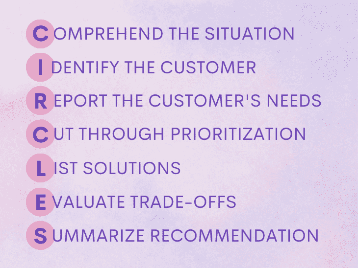
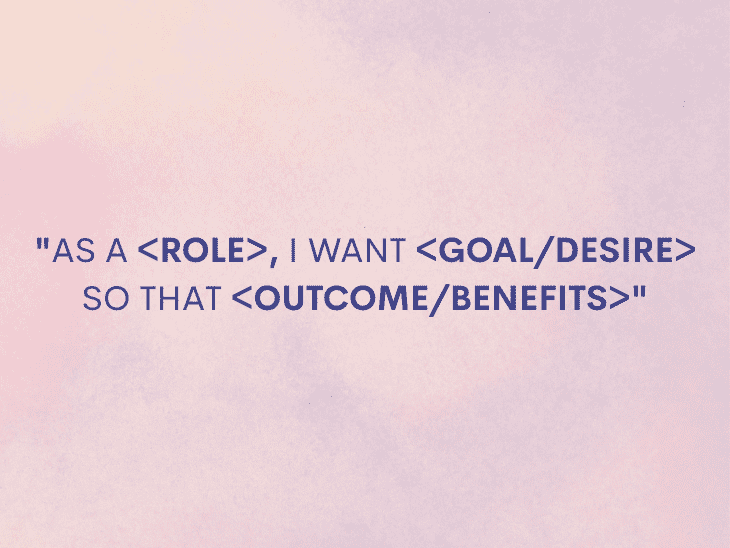
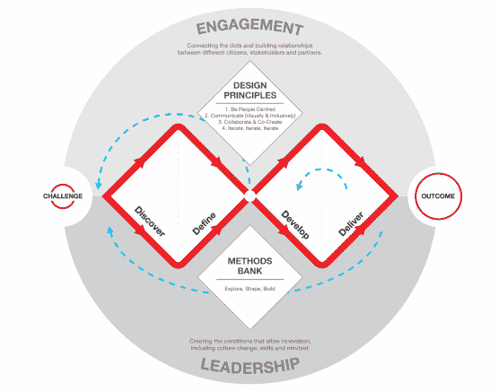

# 圆圈法:谈论设计的项目经理指南

> 原文：<https://blog.logrocket.com/product-management/circles-method-pm-guide-talking-about-design/>

产品经理的职责是识别产品用户的需求，同时创造和改进满足这些需求的特性。在这样做的时候，项目经理有时可能会在没有完全理解这些解决方案将解决的问题的情况下直接奔向解决方案。这有时会导致需求得不到充分满足，或者解决方案只能得到部分解决。

作家兼企业家 Lewis C. Lin 创建了 CIRCLES 方法框架，作为对任何设计问题给出完整而周到的回答的指南。这是一个很好的方法来减缓这个过程，并避免 PMs 直接跳到解决方案。

产品设计问题是[产品管理面试流程](https://blog.logrocket.com/product-management/product-manager-interview-questions-how-to-answer/)中最难回答的问题之一。CIRCLES 方法提供了一种结构来准确地解决这些设计问题，并赢得下一次 PM 面试。

* * *

## 目录

* * *

## 圆圈代表什么？

CIRCLES 是一个首字母缩写词，描述了解决设计问题的七个步骤。这些线性步骤是:

1.  [了解情况](#comprehend-the-situation)
2.  [识别客户](#identify-the-customer)
3.  [报告客户需求](#report-the-customers-needs)
4.  [按优先顺序切割](#cut-through-prioritization)
5.  [列出解决方案](#list-solutions)
6.  [评估取舍](#evaluate-tradeoffs)
7.  [总结建议](#summarize-the-recommendation)

让我们深入了解其中的每个阶段。

### 1.理解形势

这是解决设计问题的第一步。圆圈法建议你应该尽可能多地澄清信息。

你可以问一些基本的问题，如谁、什么、在哪里、为什么和如何。这可以让你在进一步行动之前理解情况，把握背景。

例如，你可以问:

*   这是什么？
*   是给谁的？
*   它发生在哪里？
*   他们为什么需要它？
*   它是如何工作的？

如果面试官无法澄清这些问题，你应该根据你所知道的做出假设，并将这些假设传达给面试官。这使得面试官可以纠正你的假设，如果他们有不同的想法。

### 2.识别客户

CIRCLES 方法指南在访谈过程中关注单个客户群，让您推荐一款令人惊叹的产品。在面试过程中，面试官可能无法与你建立的细分市场联系起来。因此，一个 2X2 矩阵是可视化你的人物角色的一个强有力的方法，它列出了原型的行为、人口统计、需求、目标和挫折。

### 4.报告客户的需求

在第三步中，候选人描述客户的需求、用户要求或用例。通常，它以一种叫做用户故事的流行格式呈现，以捕捉用户需求。

它通常遵循以下格式:

> *“作为一个**【角色】**，我要**【目标/欲望】**这样**【结果/收益】**。”*

要记住的一点是，用户故事并没有描述解决方案是如何工作的。尽管如此，它还是很受欢迎，因为用户故事简洁、随意且简洁。

### 5.通过优先顺序切入

圈子方法的第四步是打破优先顺序。这只是一个 PM 根据价值、时间和努力确定优先级的[待办事项](https://blog.logrocket.com/product-management/product-vs-sprint-vs-release-backlog/#what-is-a-backlog-in-product-management)。特别是在面试期间，当候选人没有足够的时间浏览多个用户案例时，选择一个有助于缩小选择范围，并展示优先排序和做出决策的能力。

优先级标准可以是主观的，不像实时情况下采用更定量的方法。优先级矩阵是一种更好的表达和思考所有标准的方式。通常，候选人可以使用矩阵来决定什么是重要的，并且每个标准都要进行权衡。

### 6.列出解决方案

一旦确定了优先级，就归结为集思广益解决方案。在这里，项目经理提出尽可能多的想法，并可以在下一阶段根据可行性、客户和收入标准缩小这些想法的范围。

在这个阶段，人们有机会提出创造性的解决方案，展示横向思维和创新思维的能力。此外，没有完美的解决方案，这种方法有助于完成这一阶段，同时照顾到其他潜在的事实。

### 7.评估权衡

这个阶段非常关键，因为项目经理会根据权衡和风险来评价他们的解决方案。除非权衡是公正的，否则可能会出现令人印象深刻的解决方案。找到正确的解决方案还取决于所有列出的解决方案的短期和长期利弊。

### 8.总结建议

这是项目经理候选人总结最终建议的最后一步。面试官可能希望摘要清晰、简洁，并渴望听到为什么推荐的产品或功能对用户有益，并举出比其他解决方案更受欢迎的原因。应聘者只有在面试官要求的情况下才会做这个阶段；因此，它是可选的。权衡步骤已经强调了一种解决方案相对于另一种解决方案的优缺点。

## CIRCLES 框架如何应用于产品管理？

产品经理需要把注意力集中在他们试图解决问题的人物角色上。此外，对他们来说，交流“为什么”建造它也很重要。CIRCLES 方法帮助项目经理区分特性、反馈、实验和总体路线图的优先级。

其次，该框架还允许项目经理在[发现](https://blog.logrocket.com/product-management/product-discovery-vs-delivery/#product-discovery)过程中提出正确的问题，以便在采用解决方案之前了解客户的实际痛点。这种整体方法帮助项目经理在解决问题时使用横向思维，而不是线性思维。

横向思维是构建产品的一种创新方式，而线性思维是连续的，通常会很快找到解决方案。

* * *

订阅我们的产品管理简讯
将此类文章发送到您的收件箱

* * *

## 圆框架的替代方法

CIRCLES 框架的目的是避免自己陷入解决方案模式。然而，在面试中并不总是需要明确使用 CIRCLES 方法框架。也有其他框架可以用来替代 CIRCLES 方法。

一些更受欢迎的替代方法是:

这些方法也处理定义问题、区分问题的优先级、推荐解决方案、挑选最令人垂涎的解决方案(理想的、可用的和可行的)和原型。所有这些替代品都包含了在头脑中没有解决方案的情况下解决设计问题的概念。下面我们来详细了解一下这些替代方法。

### 双菱形

[双钻石模型](https://blog.logrocket.com/product-management/6-product-management-frameworks-you-should-know/#double-diamond)是英国设计委员会在 2005 年基于聚合和发散思维模式开发的流行框架。这个框架被广泛用于解决和探索各种各样的问题和解决方案，然后再集中于一个。

这个双菱形的结果分为四个阶段:

1.  发现
2.  设计
3.  发展
4.  传递

再次，它是一个非线性的思维过程，从发散的思维过程出发去探究问题和根源，汇聚起来去定义问题。此外，在开发阶段，通过优先考虑高价值和低工作量的解决方案，发散方法被应用于寻找 MVP。随后，解决方案被交付并根据反馈进行改进。

双菱形方法在研讨会模式中更受设计师青睐，因为它以辅导员为中心。相比之下，在面试中尝试解决设计问题时，圆圈法最适用。

Double Diamond 通过详细的原型制作、测试、验证解决方案和耗时的过程来解决设计问题。

[Double Diamond framework by Design Council UK](%E2%80%9Chttps://www.designcouncil.org.uk/our-work/skills-learning/tools-frameworks/framework-for-innovation-design-councils-evolved-double-diamond/%E2%80%9D)

### 瘦圈

精益圈只是常规圈方法的简化版。它将七个阶段简化为三个简单的阶段:

1.  探索这个问题
2.  定义、优先排序和测试选项
3.  交付解决方案

它特别用于创新思维和避免陷入线性思维的陷阱。候选人应该明白，在时间紧迫的情况下，一步一步地遵循圈子框架并不是一个硬性规定。它展示了简洁沟通的能力，同时展示了横向思维，以避免一刀切的方法。

## 使用 CIRCLES 框架的好处

在 [*解码并征服*](https://www.amazon.com/Decode-Conquer-Answers-Management-Interviews/dp/0615930417) 中，Lewis C. Lin 特别提到他开发了 CIRCLES 方法来回答产品访谈中的任何设计问题。然而，除了面试，它也可以用在现实生活中，并作为一个临时的解决方案。

CIRCLES 框架的一些好处是:

### 允许有效的头脑风暴

PM 可以使用 CIRCLES 方法来集思广益，以解决新的特性问题。这也有助于项目经理就新想法与团队进行清晰简洁的沟通。

### 确定最佳解决方案

当预算和工作成为设计冲刺或双钻石研讨会的障碍时，CIRCLES 方法可以确定最佳解决方案，设计团队可以进一步与用户一起验证和测试。

### 提供结构化的答案

当然，这是在产品经理面试中快速解决简单、复杂或未知产品设计问题的最佳方法。这个框架提供了澄清面试官提出的问题，然后浏览这些问题的机会。

此外，圈圈法可以让你有条理地回答问题，并从头到尾给面试官留下深刻印象。

## 圈子框架的弱点

CIRCLES 框架的主要缺点是它基于几个需要澄清的问题。解决方案的列表是基于那些澄清问题、人物角色的假设而出现的，并且可能在优先顺序上有所偏差。

因此，在实际情况下，设计师和项目经理更喜欢使用设计专用工具，比如双菱形。

这种方法的另一个基本问题是，它缩小了使用实际原型测试和验证解决方案的范围。相反，解决方案是基于预先设想的标准的权衡来评估的，包括客户体验、可行性和收入。

*精选图片来源:[icon scout](https://iconscout.com/icon/game-center-3273929)*

## [LogRocket](https://lp.logrocket.com/blg/pm-signup) 产生产品见解，从而导致有意义的行动

[LogRocket](https://lp.logrocket.com/blg/pm-signup) 确定用户体验中的摩擦点，以便您能够做出明智的产品和设计变更决策，从而实现您的目标。

使用 LogRocket，您可以[了解影响您产品的问题的范围](https://logrocket.com/for/analytics-for-web-applications)，并优先考虑需要做出的更改。LogRocket 简化了工作流程，允许工程和设计团队使用与您相同的[数据进行工作](https://logrocket.com/for/web-analytics-solutions)，消除了对需要做什么的困惑。

让你的团队步调一致——今天就试试 [LogRocket](https://lp.logrocket.com/blg/pm-signup) 。