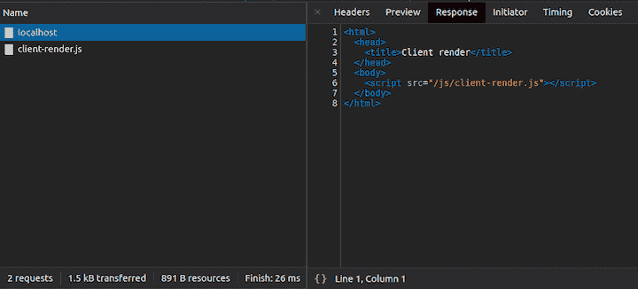
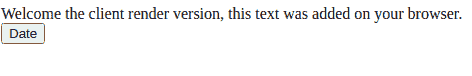
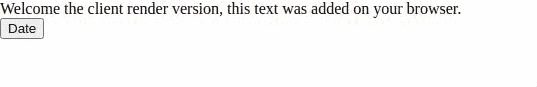
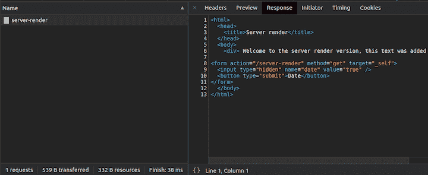
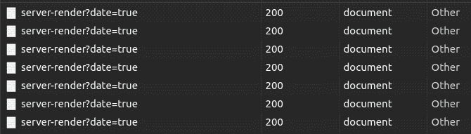
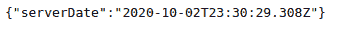
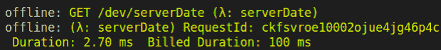
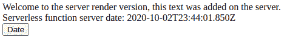

# 客户端渲染对比服务器渲染对比无服务器-日志火箭博客

> 原文：<https://blog.logrocket.com/client-render-vs-server-render-vs-serverless/>

客户端渲染，服务器渲染，无服务器渲染有什么区别？

客户端呈现是指服务器向用户发送少量代码，并让这些代码在用户的计算机或电话上构建页面。另一方面，服务器呈现发送已经构建好的页面，所以用户的机器只需要显示它发送的页面。

还有第三种向用户传递信息的方式，它消除了维护服务器的负担:无服务器。无服务器意味着让 Google 或 Amazon 这样的提供商来处理服务器及其资源(例如 RAM 和 CPU)，它们可以根据需要进行扩展。

## 客户端渲染、服务器渲染和无服务器实现的工作原理

在本教程中，我们将演示客户端和服务器渲染的一个小实现，并展示如何包含一个[无服务器框架](https://www.npmjs.com/package/serverless)，您可以稍后将其部署到您首选的云服务。

我们项目的基本结构如下。

```
src/
  |-private // folder with the templates to be rendered by the server with handlebars
    |-layouts
      main.handlebars
    server-render.handlebars
  |-public // folder with the content that we will feed to the browser
    |-js
      client-render.js
    index.html
  handler.js // serverless function will be here
  package.json
  server.js // our Node.js server
  serverless.yml // configuration of the serverless server

```

#### `package.json`

```
{
  "name": "client-server-serverless",
  "version": "1.0.0",
  "description": "Client vs server render vs serverless",
  "main": "server.js",
  "scripts": {
    "start": "node server.js",
    "server-debug": "nodemon --inspect server.js"
  },
  "author": "daspinola",
  "license": "MIT",
  "devDependencies": {
    "nodemon": "2.0.4",
    "serverless-offline": "6.8.0"
  },
  "dependencies": {
    "express": "4.17.1",
    "express-handlebars": "5.1.0",
    "handlebars": "4.7.6",
    "node-fetch": "2.6.1",
    "serverless": "2.4.0"
  }
}

```

别忘了`npm install`。上述所有其他文件将根据需要在以下部分归档。

## 客户端渲染

目标是让客户机处理 div、按钮和导航的所有构造，让服务器资源尽可能地自由和快速。

为此，创建一个 HTTP 服务器，当在`/`中访问它时，它将返回一个 HTML 文件。

#### `server.js`

```
const express = require('express')
const path = require('path')

const app = express()

app.use(express.static(path.join(__dirname, 'public')))

app.get('/', function(req, res) {
  res.sendFile(path.join(__dirname, 'public/client-render.html'))
})

app.listen(7000, function () {
  console.log(`Listening on port ${7000}!`)
})

```

HTML 文件将引用生成页面所需的所有资源，这些资源可以在`public`文件夹中找到。

#### `public/index.html`

```
<html>
  <head>
    <title>Client render</title>
  </head>
  <body>
    <script src="/js/client-render.js"></script>
  </body>
</html>

```

在这种情况下，只要 HTML 文件加载到用户浏览器中，就只需要获取`client-render.js`。

#### `public/js/client-render.js`

```
document.addEventListener('DOMContentLoaded', init, false);

async function init() {
  const body = document.querySelector('body')
  const welcomeDiv = document.createElement('div')
  const hourDiv = document.createElement('div')
  const dateButton = document.createElement('button')

  dateButton.innerHTML = 'Date'
  welcomeDiv.innerHTML = `Welcome to the client render version, this text was added on your browser.`

  body.appendChild(welcomeDiv)
  body.appendChild(dateButton)

  dateButton.addEventListener('click', () => {
    const date = new Date()
    hourDiv.innerHTML = `It's now ${date}`
    body.appendChild(hourDiv)
  })
}

```

一旦用户在浏览器中下载了该文件，它就开始就地构建页面。



请求被发送到`/`路由(在这个场景中是 localhost)，浏览器加载`index.html`文件，资源`client-render.js`被发现是一个依赖项。浏览器请求获取该文件，该文件在加载后将构建页面。



如果按下**日期**按钮，将检索浏览器的日期，而不会在开发工具的**网络**选项卡中看到任何新请求。



如果目标是获取服务器的日期，就必须发出请求并更新文本。不管怎样，页面不会重新加载，因为请求和更新文本的是我们的`client-render.js`,而不是服务器。

让我们放大使用客户端渲染的利与弊。

### 赞成的意见

*   服务器使用更少的资源
*   页面加载后，导航速度非常快
*   无需重新加载页面

### 骗局

*   渲染时间因客户端浏览器和计算机而异
*   它很慢，因为 JavaScript 的有效负载和对服务器的请求数量较大
*   如果 JavaScript 被禁用，网站可能根本无法加载

## 服务器渲染

现在，假设我们现在希望服务器处理页面的呈现，并简单地将完整的结果返回给用户的浏览器。

为了简化我们的例子，我已经删除了客户端渲染部分。您可以用下面的替换`server.js`，或者用下面的路线内容添加一条新路线。

#### `server.js`

```
const express = require('express')
const exphbs = require('express-handlebars')
const path = require('path')
const app = express()

app.engine('handlebars', exphbs());

app.set('views', path.join(__dirname, 'private'))
app.set('view engine', 'handlebars');

app.get('/', function(req, res) {
  const welcomeText = 'Welcome to the server render version, this text was added on the server'
  const date = req.query.date === 'true'
    ? new Date()
    : undefined

  res.render('server-render', { welcomeText, date })
})

app.listen(7000, function () {
  console.log(`Listening on port ${7000}!`)
})

```

这是另一个 HTTP 服务器，但是这次我们用 handlebars 来呈现 HTML 文件，并将完整的结果发送回客户端，而不是用 JavaScript 来呈现。

#### `private/layouts/main.handlebars`

```
<html>
  <head>
    <title>Server render</title>
  </head>
  <body>
    {{{ body }}}
  </body>
</html>

```

#### `private/server-render.handlebars`

```
<div> {{ welcomeText }} </div>

<form action="/server-render" method="get" target="_self">
  <input type="hidden" name="date" value="true" /> 
  <button type="submit">Date</button>
</form>

{{#if date}}
<div>It's now {{ date }}</div>
{{/if}}

```

为了使使用服务器端渲染更容易，您可以指定一个视图引擎，允许 HTML 包含变量、条件和循环。

对于这个例子，引擎是 handlebars，当客户端请求路由时，上面的最终结果是 HTML。



传输的资源也比客户端呈现的资源少三倍，因为在单个请求中检索的只是文本。


与我们的客户端渲染示例相比，此实现需要考虑两件事情:

1.  检索的日期将来自服务器，而不是客户端浏览器
2.  当按下日期按钮时，整个页面被重新加载



### 赞成的意见

*   快速初始页面加载
*   不同设备之间的渲染时间一致，因为服务器承担了所有负载
*   更好的搜索引擎优化评分

### 骗局

*   由于每个动作都是一个新请求，服务器使用的资源增加
*   导航需要重新加载
*   根据所使用的技术堆栈，设置可能会更复杂

## 无服务器

您可以将上述两种方法应用于无服务器架构。这意味着可以在一个无服务器函数中运行客户机或服务器呈现来生成页面，就像普通的 HTTP 服务器一样。

对于整个网站来说，这种方法会带来很大的成本，因为在应用程序中不经常出现的单个功能上触发无服务器是最有优势的。

下面是一种运行无服务器服务器并在本地调用分配给它的函数的方法，而不需要部署到提供者。

#### `serverless.yml`

```
service: client-server-serverless
frameworkVersion: '2'
provider:
  name: aws
  runtime: nodejs12.x
functions:
  serverDate:
    handler: handler.serverDate
    events:
      - http:
         path: serverDate
         method: get
         cors: true
plugins:
  - serverless-offline

```

除了允许测试在本地进行的`serverless-offline`插件，唯一感兴趣的是`functions`，在这里您应该指定哪些函数可以被触发。

该配置负责生成 rout。这种情况下会是`/serverDate`，应该在`handler.js`文件中定义。

#### `handler.js`

```
module.exports.serverDate = async event => {
  const serverDate = new Date()
  return {
    statusCode: 200,
    body: JSON.stringify({
      serverDate
    }),
  };
};

```

要运行服务器，`npx sls offline start`和功能将在`localhost:3000/dev/serverDate`中可用。





当一个类似这样的请求被发送到一个无服务器的功能时，你需要为这个请求的持续时间付费(计费的参数因提供商而异。通过查看在本地无服务器服务器的控制台上完成的估算，您可以了解在无服务器中运行一项功能的成本。

下面是在服务器端渲染示例中调用的无服务器函数的示例。

#### `server.js`

```
const express = require('express')
const exphbs = require('express-handlebars')
const fetch = require('node-fetch')

const path = require('path')

const app = express()

app.engine('handlebars', exphbs());

app.set('views', path.join(__dirname, 'private'))
app.set('view engine', 'handlebars');

app.get('/', function(req, res) {
  const welcomeText = 'Welcome to the server render version, this text was added on the server'
  const date = req.query.date === 'true'
    ? new Date()
    : undefined
  const serverlessResponse = await fetch('http://localhost:3000/dev/serverDate')
    .then(res => res.json())
  res.render('server-render', { welcomeText, date, serverlessResponse: serverlessResponse.serverDate })
})

app.listen(7000, function () {
  console.log(`Listening on port ${7000}!`)
})

```

#### `private/server-render.handlebars`

```
<div> {{ welcomeText }}. </div>

<div>Serverless function server date: {{ serverlessResponse }}</div>

<form action="/server-render" method="get" target="_self">
  <input type="hidden" name="date" value="true" /> 
  <button type="submit">Date</button>
</form>

{{#if date}}
<div>It's now {{ date }}</div>
{{/if}}

```



### 赞成的意见

*   随着使用情况自动扩展
*   如果运行的功能不会使用普通服务器的全部容量，则成本较低
*   不需要服务器维护

### 骗局

*   价格由请求和使用的数量决定，这可能会很快变得昂贵
*   当向一个已经有一段时间没有被调用的端点发出请求时，它必须“引导”这个函数。这需要一些时间。—通常是毫秒，根据操作的不同，这可能很有价值
*   更难与提供商(AWS、Google 等)分离。)因为实现方式往往各不相同

## 结论

像工程中的大多数话题一样，没有神奇的公式来帮助你决定选择哪条道路。通常，混合方法是合适的。

例如，您可以利用服务器端的呈现速度，在服务器端呈现初始页面，而在客户端呈现后续页面。

同样，一次性的功能，如跟踪页面或发送电子邮件，应该与无服务器架构很好地结合在一起。

您可以在我的 [GitHub](https://github.com/daspinola/client-server-serverless) 上访问本文引用的所有代码。

## 通过理解上下文，更容易地调试 JavaScript 错误

调试代码总是一项单调乏味的任务。但是你越了解自己的错误，就越容易改正。

LogRocket 让你以新的独特的方式理解这些错误。我们的前端监控解决方案跟踪用户与您的 JavaScript 前端的互动，让您能够准确找出导致错误的用户行为。

[](https://lp.logrocket.com/blg/javascript-signup)

LogRocket 记录控制台日志、页面加载时间、堆栈跟踪、慢速网络请求/响应(带有标题+正文)、浏览器元数据和自定义日志。理解您的 JavaScript 代码的影响从来没有这么简单过！

[Try it for free](https://lp.logrocket.com/blg/javascript-signup)

.