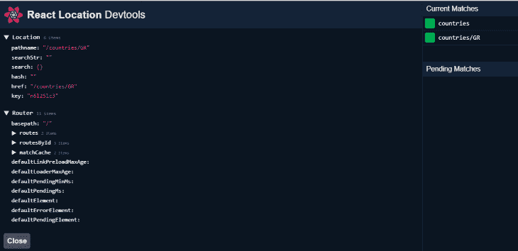
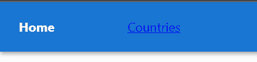

# React 中的客户端路由与 React Location 

> 原文：<https://blog.logrocket.com/client-side-routing-react-react-location/>

路由是单页面应用程序(SPAs)的一个重要方面，但是因为 React 没有提供路由解决方案，React 开发人员必须集成第三方库来将路由实现到他们的应用程序中。

有几个可用的路由库，例如 [React Router](https://reactrouter.com/) ，这是用于服务器端或客户端 React 应用程序的最流行的库之一。尽管 React Router 是用于路由的首选库，但它有一些限制，例如:

*   基于搜索的路线匹配
*   路由数据缓存
*   路径加载器预取

为了解决这些问题， [React Query](https://react-query.tanstack.com/) 的创建者 Tanner Linsley 开发了一个名为 [React Location](https://react-location.tanstack.com/) 的新路由库，其中包括一些简洁的功能，使 React 开发者的生活更加轻松。

## 什么是反应位置？

React Location 是 React 应用程序的一个强大的企业级路由工具。React Location 是作为 React Router v6 beta 版本的包装器构建的，该版本修补了一些限制，但它已经发展成为一个成熟的路由解决方案。

React Location 提供了其他路由解决方案中没有的异步功能:

*   基于承诺的数据加载器
*   异步路径加载器
*   基于阈值的待定路由元素
*   后期渲染异步加载程序 API

React Location 的灵感来自全栈 React 框架，如 Next.js 和 Remix，它们带有内置路由，并提供了数据加载器和搜索参数等概念。

## 使用 React Location 的好处

React Location 引入了一些非常有用的独特功能，我将在下面详细介绍。

### 数据加载器

React Location 提供了一种在渲染每条路线之前执行异步函数的新方法。您可以使用这种方法通过 Axios、fetch 等工具获取数据。，以便在呈现组件之前数据可用。

在传统的应用程序中，您需要在加载路线或使用生命周期方法钩子(如`componentDidmount`或 useEffect)呈现组件后获取数据。数据加载器将延迟加载路由，直到异步函数执行。

### 反应位置开发工具

与 React Router 或任何其他 React 路由库不同，React Location 提供了 [Devtools](https://react-location.tanstack.com/tools/devtools) ，使您能够可视化应用程序幕后发生的事情。此外，这对于调试您的应用程序非常有帮助。要启用 React Location Devtools，请安装插件并将组件添加到 React 组件树中。

### 代码拆分

用 React Location 实现代码拆分相对容易。首先，您需要传递一个 React 组件的动态导入作为元素，并为该组件定义一个加载器。

使用 react-router，您需要安装额外的插件，如[babel/plugin-syntax-dynamic-import](https://babeljs.io/docs/en/babel-plugin-syntax-dynamic-import)和 [loadable-components](https://www.npmjs.com/package/@loadable/component?activeTab=versions) 或使用 React experimental [悬念](https://reactjs.org/docs/concurrent-mode-suspense.html)来实现代码拆分。

### 搜索参数

React Location 使我们能够在 URL 中存储状态，从而释放了 URL 搜索参数的威力。React Location 提供了匹配、使用和操作 URL 搜索参数的能力。因此，这些 URL 更易于共享，可以加入书签，并且更加一致。

搜索参数使用 JavaScript [JSON](https://developer.mozilla.org/en-US/docs/Web/JavaScript/Reference/Global_Objects/JSON) API ( `[JSON.parse](https://developer.mozilla.org/en-US/docs/Web/JavaScript/Reference/Global_Objects/JSON/parse)`和`[JSON.stringify](https://developer.mozilla.org/en-US/docs/Web/JavaScript/Reference/Global_Objects/JSON/stringify)`)，这在处理 URL 查询参数中的复杂值和对象时很方便。React Location 还允许您使用类似于 [JSURL](https://github.com/Sage/jsurl) 的插件或自定义方法(用于`stringifySearch`和解析搜索 API 方法)来扩展搜索参数功能。

即使您使用一个插件或默认的搜索参数实现，React Location 也将保证搜索参数表现为存储在应用程序内存中的不可变对象。

### 嵌套路由

定义嵌套路由非常清晰，易于维护。

### 路线元素

定义路线和数据加载器后，可以根据加载器或路线的状态呈现页面。React Location 允许您通过以下方式处理或呈现页面:

1.  当你的路线匹配时，这将呈现你需要呈现的默认组件
2.  当你的路线或你的数据加载器有错误时，这允许你渲染一个组件
3.  `pendingElement`:这允许您在数据加载器运行时呈现一个组件，使其非常适合呈现加载页面或加载器。它还提供了更多的属性，允许您定义需要呈现挂起状态组件多长时间

## 探索 React 位置 API

让我们深入 React 位置 API。如果您熟悉 React 路由器，您会发现 React Location 的大多数 API 看起来都非常相似。

`[Router](https://react-location.tanstack.com/docs/api#router)`是根提供者组件，其行为类似于 React 路由器中的提供者组件。`[Link](https://react-location.tanstack.com/docs/api#link)`的行为类似于 React 路由器的`link` API，但内置了更多功能，如更新搜索参数和哈希的能力。它还支持“在新标签页中打开”和“在新窗口中打开”等事件，并有一个`active`道具，显示`link`处于活动状态。

`[Navigate](https://react-location.tanstack.com/docs/api#navigate)`将在渲染时导航到路线，`[useNavigate](https://react-location.tanstack.com/docs/api#usenavigate)`的行为类似于 React Router 中的`useNavigate` API 方法，使您能够以编程方式导航您的应用程序。

接下来，`[useRouter](https://react-location.tanstack.com/docs/api#userouter)`是一个钩子，用于访问父组件的状态或`<Route>`。它返回位置的当前转换状态或位置的下一个转换状态。

`[useMatchRoute](https://react-location.tanstack.com/docs/api#usematchroute)`返回当前或待定路线的相对和绝对路径。如果路径匹配，它将返回一个路径为`params`的对象。这有助于查找特定的深层路线匹配，以及导航发生时特定路线是下一个待定位置。`[useMatch](https://react-location.tanstack.com/docs/api#usematch)`返回已匹配的最近路线，用于获取路线参数、路线数据和下一个子匹配。

`[useSearch](https://react-location.tanstack.com/docs/api#usesearch)`允许您访问应用程序当前路线的搜索参数和状态。首先，您需要通过使用`MakeGenerics` API 方法声明一个 JSON 对象来定义您需要收集的信息。然后，在 React 组件中，可以使用 JSON 的`useSearch`来收集细节。这个通用对象是不可变的，所以我们可以用它来检测搜索参数的变化。

`[useResolvePath](https://react-location.tanstack.com/docs/api#useresolvepath)`提供了一个函数，我们可以用它来检查相对于调用它的路由的路径(返回名称)。使用这个钩子，您可以检索当前、先前、子或父路由名称的名称。

最后，对于有表单的页面，您可能需要 [`usePrompt`](https://react-location.tanstack.com/docs/api#useprompt) ，因为它允许您以编程方式向用户提示一个对话框，就像用户在提交表单之前开始路由到另一个路由一样。

## React 定位的最佳工具和插件

React Location 为您提供了使用多个插件的灵活性，因此您可以扩展其功能。以下是一些‌plugins，在使用 React Location 时可能会派上用场。

*   [React Location Simple Cache](https://www.npmjs.com/package/react-location-simple-cache) 为您提供了缓存路径的数据加载器值的功能，因此，如果您在相同的路径中移动，它将维护一个缓存并减少加载时间。这个插件还提供了处理缓存的特性，比如获取策略和手动缓存失效
*   React Location Devtools 是你可以用这个插件启用的最好的和最独特的特性之一，因为它帮助你可视化 React Location 的所有内部工作，并使调试应用程序变得容易
*   [React Location JSURL](https://www.npmjs.com/package/@tanstack/react-location-jsurl) 在您需要扩展搜索参数特性时非常有用。它使用了 [JSURL](https://github.com/Sage/jsurl) ，这是 JSON 和 URL 编码(或 JSON 和 base64 编码)的一种替代方案，使用它，您可以通过 URL 查询参数轻松传递复杂的值

## 使用 React Location 构建应用程序

让我们通过构建一个 React 应用程序来看看如何使用 React Location。我们将使用 [REST 国家](https://restcountries.com/) REST API。首先，让我们通过以下命令使用 create-react-app 创建一个应用程序:

```
npx create-react-app react-location-router --template typescript

```

我们还需要其他几个库，包括 [Material UI](https://blog.logrocket.com/using-material-ui-with-react-hook-form/) 和 [Axios](https://blog.logrocket.com/understanding-axios-post-requests/) 来构建组件获取数据:

`yarn add axios @mui/material @mui/styled-engine-sc @emotion/react @emotion/styled`

让我们为我们的应用程序创建几个组件:`[card](https://github.com/TRomesh/react-location-routing/tree/main/src/components/card)`、`[select](https://github.com/TRomesh/react-location-routing/tree/main/src/components/form)`和`[navigation(HOC)](https://github.com/TRomesh/react-location-routing/tree/main/src/components/navigation)`组件，以及[本国](https://github.com/TRomesh/react-location-routing/blob/main/src/pages/Home.tsx)、[国家](https://github.com/TRomesh/react-location-routing/blob/main/src/pages/Countries.tsx)、[国家](https://github.com/TRomesh/react-location-routing/blob/main/src/pages/Country.tsx)组件。您可以使用提供的链接找到它们的代码示例。现在我们已经有了几个组件，让我们安装 React Location 并配置路由:

```
yarn add @tanstack/react-location

```

现在是时候定义`App.tsx`中的路线了。

```
import { Outlet, ReactLocation, Router } from "@tanstack/react-location";
import Home from "./pages/Home";
import Error from "./components/error/Error";
import Countries from "./pages/Countries";
import Country from "./pages/Country";
import Loader from "./components/loader/Loader";
import Navigation from "./components/navigation/Navigation";
import { getCountries, getCountry } from "./services";

// Set up a ReactLocation instance
const location = new ReactLocation();

function App() {
  return (
    <Router
      location={location}
      routes={[
        { path: "/", element: <Home /> },
        {
          path: "countries",
          element: <Countries />,
          loader: async () => {
              let { data } = await getCountries();
              return {
                countries: data,
              };
           },
          pendingElement: async () => <Loader />,
          pendingMs: 1000 * 2, // 2 seconds
          errorElement: <Error />,
          children: [
            { path: "/", element: <div>Select Country</div> },
            {
              path: ":code",
              element: <Country />,
              loader: async ({ params: { code } }) => {
                let { data } = await getCountry(code);
                return {
                  country: data,
                };
              },
              errorElement: <Error />,
            },
          ],
        },
      ]}
    >
      <Navigation>
        <Outlet /> {/* Start rendering router matches */}
      </Navigation>
    </Router>
  );
}

export default App;

```

您可以看到当前匹配路径的待定匹配，以及通过数据加载器提供的数据。现在，让我们访问数据加载器:

```
import { MakeGenerics } from "@tanstack/react-location";

export interface Country {
  name: {
    common: string;
    official: string;
  };
  borders: string[];
  population: number;
  cca2: string;
}

export type CountryGenerics = MakeGenerics<{
  LoaderData: {
    countries: Country[];
    country: Country;
  };
}>;

```

为了访问数据，我们将使用`MakeGenerics` API 并定义 JSON 对象来检索我们想要的数据。在本例中，我们将获取的数据是一个国家数组和一个国家详细信息对象。让我们使用`useMatch`来消费组件内部的数据。

```
import { useMatch } from "@tanstack/react-location";

// hook should be called inside the functional component
const { data } = useMatch<CountryGenerics>();

```

我们需要分解结构并访问属性来获取数据:

```
 let { countries, country } = data;

```

为了便于调试，安装 react-location-devtools 插件:

```
yarn add @tanstack/react-location-devtools

```

接下来，在`App.tsx`中配置并导入 React Location Devtools。

```
import { ReactLocationDevtools } from "@tanstack/react-location-devtools";

```

现在添加`ReactLocationDevtools`组件:

```
      <Navigation>
        <Outlet /> {/* Start rendering router matches */}
        <ReactLocationDevtools /> {/* enable Devtools */}
      </Navigation>

```

打开浏览器，在屏幕的左下方可以看到一个小小的 React Location 徽标。


点按它以查看路由详细信息以及调试您的应用程序有多容易。



接下来，通过一个简单的缓存插件添加一些数据缓存。您可以使用以下命令安装它。

```
yarn add @tanstack/react-location-simple-cache

```

现在让我们通过导入简单缓存并启动一个缓存实例来配置它。

```
import { ReactLocationSimpleCache } from "@tanstack/react-location-simple-cache";

// Set up a ReactLocation SimpleCache instance
const routeCache = new ReactLocationSimpleCache();

```

我们还将定义缓存到期/失效时间。

```
{
          path: "countries",
          element: <Countries />,
          loader: routeCache.createLoader(
            async () => {
              let { data } = await getCountries();
              return {
                countries: data,
              };
            },
            {
              maxAge: 1000 * 10, // 10 seconds
            }
          ),
  …..
}

```

让我们看看如何浏览`Link`组件和`useNavigation.`。

让我们在`Navigation(HOC)`中使用`Link`组件，它将包含一个带有几个链接的导航栏。

```
import React from "react";
import AppBar from "@mui/material/AppBar";
import Grid from "@mui/material/Grid";
import Toolbar from "@mui/material/Toolbar";
import { Link } from "@tanstack/react-location";

const getActiveProps = () => {
  return {
    style: {
      fontWeight: "bold",
      color: "white",
      textDecoration: "none",
    },
  };
};

const Navigation = ({
  children,
}: {
  children: React.ReactNode;
}): JSX.Element => {
  return (
    <Grid container spacing={4}>
      <Grid item xs={12}>
        <AppBar position="static">
          <Toolbar>
            <Grid container spacing={1}>
              <Grid item xs={1}>
                <Link
                  to="/"
                  getActiveProps={getActiveProps}
                  activeOptions={{ exact: true }}
                >
                  Home
                </Link>
              </Grid>
              <Grid item xs={1}>
                <Link to="countries" getActiveProps={getActiveProps}>
                  Countries
                </Link>
              </Grid>
            </Grid>
          </Toolbar>
        </AppBar>
      </Grid>
      <Grid item xs={12} />
      <Grid item xs={12}>
        {children}
      </Grid>
    </Grid>
  );
};

export default Navigation;

```

如果仔细观察，您会发现我们已经用一些样式属性定义了`getActiveProps` ,帮助我们识别当前的路线。



你可以通过这个 [GitHub repo](https://github.com/TRomesh/react-location-routing) 来浏览完整的演示项目源代码，或者使用部署的[链接](https://react-location-routing.netlify.app/)来玩。

## React 位置与其他 React 路由解决方案

React Location 和 React Router 有许多相似之处，但是 React Location 提供了许多功能，可以提供更好的开发人员体验。下面是 React Location 与 [React Router](https://reactrouter.com/) 和 [Reach Router](https://reach.tech/router/) 的详细功能对比:


## 结论

React Location 是 React 应用程序的优秀路由解决方案。React Location 具有高级搜索参数、开发工具、代码分割、路由加载器和异步路由等功能，是 React Router 的一个有价值的替代产品。

您可以轻松地将 React Location 与外部缓存和存储集成，如 [React Query](https://react-query.tanstack.com/) 、 [Apollo](https://www.apollographql.com/docs/react/) 、 [SWR](https://swr.vercel.app/) 和 [RTKQuery](https://redux-toolkit.js.org/) 。React Location 唯一的缺点是它还不支持 SSR 路线匹配或加载和水合，但这些功能很快就会推出。

React Location 当然需要 React 社区更多的关注。React Location 还有一个切槽社区，你可以在 [StackOverflow](https://stackoverflow.com/questions/tagged/react-location) 、 [Discord](https://discord.com/invite/WrRKjPJ) 和 [GitHub discussions](https://github.com/tanstack/react-location/discussions) 上找到。最后，我邀请大家试用 React Location，看看路由解决方案有多棒。

## [LogRocket](https://lp.logrocket.com/blg/react-signup-general) :全面了解您的生产 React 应用

调试 React 应用程序可能很困难，尤其是当用户遇到难以重现的问题时。如果您对监视和跟踪 Redux 状态、自动显示 JavaScript 错误以及跟踪缓慢的网络请求和组件加载时间感兴趣，

[try LogRocket](https://lp.logrocket.com/blg/react-signup-general)

.

[ ](https://lp.logrocket.com/blg/react-signup-general) [](https://lp.logrocket.com/blg/react-signup-general) 

LogRocket 结合了会话回放、产品分析和错误跟踪，使软件团队能够创建理想的 web 和移动产品体验。这对你来说意味着什么？

LogRocket 不是猜测错误发生的原因，也不是要求用户提供截图和日志转储，而是让您回放问题，就像它们发生在您自己的浏览器中一样，以快速了解哪里出错了。

不再有嘈杂的警报。智能错误跟踪允许您对问题进行分类，然后从中学习。获得有影响的用户问题的通知，而不是误报。警报越少，有用的信号越多。

LogRocket Redux 中间件包为您的用户会话增加了一层额外的可见性。LogRocket 记录 Redux 存储中的所有操作和状态。

现代化您调试 React 应用的方式— [开始免费监控](https://lp.logrocket.com/blg/react-signup-general)。