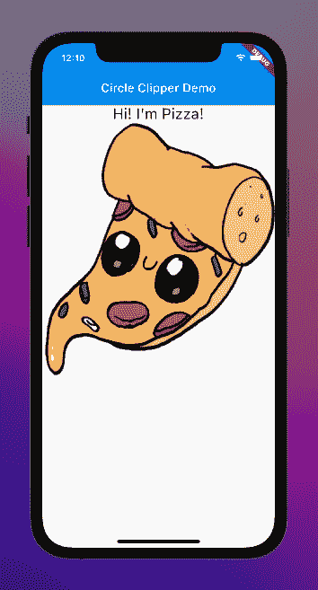
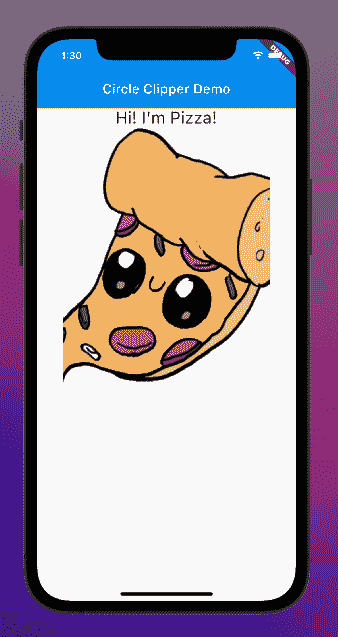
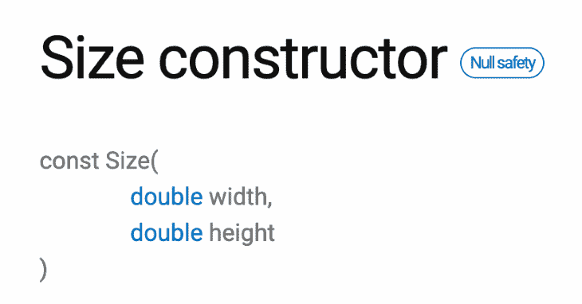

# 在 Flutter 中剪贴圆圈(以及更多)

> 原文：<https://blog.logrocket.com/clipping-circles-flutter/>

### 目录

剪裁图像[可以在 UI](https://doopic.com/en/blog-why-are-clipped-images-important-for-an-online-shop/) 中占用的空间、图像吸引力和风格方面提供更多的灵活性。剪辑还允许您删除图片中不必要的部分，帮助用户关注感兴趣的点。

例如，在社交媒体平台上以圆形布局看到你的个人资料图片是很常见的。这是因为你上传了一张循环照片吗？大多数情况下，不需要。你只需上传你喜欢的任何照片，剪辑就会自动完成，从而减少你的个人资料照片在网站上所占的空间。这对于手机 app 来说尤为重要。

在这篇文章中，我将介绍几种你可以在 Flutter 应用程序中圈出剪辑(和更多)图像的方法。在我们使用第一个小部件进行图像剪辑之前，让我们设置我们的应用程序并获得一个实际的图像来使用。

## 设置 Flutter 应用

使用`flutter create circle_clipper_demo`创建一个应用。

在您的小部件`build`主体中，使用`SingleChildScrollView`小部件。对于这个小部件的`child`属性，使用`Column`小部件并将其居中对齐。对于`Column's`孩子，使用一个`Widget`列表，它将包含一个`Text`小部件和一个`Center`小部件。见下文。

```
SingleChildScrollView(
       child: Column(      
         mainAxisAlignment: MainAxisAlignment.center,
         children: <Widget>[
           const Text(
             "Hi! I'm Pizza!",
             style: TextStyle(fontSize: 25),
           ),
           Center(
             child: /// widget for picture,
           ),
         ],
       ),
     ),

```

接下来，我们需要添加用于我们的图像的小部件。为此，我们可以使用一个`Image`小部件。

```
const Image(image: AssetImage('./assets/pic.png'));

```

现在剩下要做的就是在我们项目的根目录下创建一个资产目录，并找到一张我们可以使用的图片。我从 T2 得到了一张图片。当您创建目录并将图片添加到其中时，您需要在您的`pubspec.yaml`中指定您的新资产。

```
# To add assets to your application, add an assets section like this:
 assets:
   - assets/

```

运行`flutter pub get`以确保您的`pubspec.yaml`更改被采纳，然后让我们在任何剪辑之前看看我们的应用程序看起来如何。


现在我们已经建立了我们的应用程序，让我们看看如何利用`ClipRRect`来剪辑我们的图像。

## 在颤振中使用`ClipRRect`来修剪圆

`[ClipRRect](https://api.flutter.dev/flutter/widgets/ClipRRect-class.html)`是一个小工具，专门用来裁剪其带有圆角矩形形状的子对象。我们可以用这个在我们的图像周围创建一个圆形剪辑。这相对容易实现，因为它本质上包装了我们最初的`Image`小部件，并对其应用了边框半径。

```
ClipRRect(
     borderRadius: BorderRadius.circular(300.0),
     child: const Image(image: AssetImage('./assets/pic.png')),
   );

```

我们使用相同的原始`Image`小部件，但是我们将它包装在`ClipRRect`中，并应用边界半径来圆化提供的剪辑。请看下面两张对比图。



No clipping


With `ClipRRect`

请注意，我们右边的图像有一个圆边，它切掉(或剪切)了我们原始图像的一部分。您也可以通过更改边框半径值来改变裁剪级别。半径越大，越圆。简单，不是吗？

让我们来看看下一种方法，我们可以循环剪辑我们的图像。我们可以使用一个小部件，它不仅可以让我们轻松地圈出剪辑，还可以为我们的剪辑图像分配背景颜色(假设您的图片已经移除了背景)。这个小部件叫做`CircleAvatar`。

## 使用`CircleAvatar`在 Flutter 中剪辑图像

`[CircleAvatar](https://api.flutter.dev/flutter/material/CircleAvatar-class.html)`是 Material 提供的 widget。这是一个代表用户的圆圈。我发现它特别有用，因为它像`ClipRRect`一样容易实现，但它也允许简单的`backgroundColor`添加到你的图像中。

```
CircleAvatar(
         backgroundColor: Colors.amber,
         backgroundImage: AssetImage('./assets/pic.png'),
         radius: 200.0
);

```

它与`ClipRRect`相似，使用`radius`(在`ClipRRect`中称为`borderRadius`)来确定应用于裁剪图像的圆形度。然而，需要指出的是，如果你想要你的图片被正确剪辑，你必须把它分配给`backgroundImage`属性，而不是`child`。如果你将它应用到`child`，图像将脱离剪辑。下面我们来看这两个例子。


Using `child`


Using `backgroundImage`

我喜欢这个小部件，因为它的工作方式类似于`ClipRRect`，允许背景颜色的灵活性，如果您想在图像之外包含一些东西(如徽章或“在线”灯)，可以添加一个`child`，它保存在图像本身的独立属性中(而不是设置一个分配给`child`的`Widget`列表)。从语法上来说，我觉得更干净。

例如，您可以使用一个`AssetImage`而不是将`AssetImage`包装在一个`Image`小部件中。另外，`radius`只是一个 double，而不是必须成为`BorderRadius`的属性。对于`ClipRRect`来说`clipBehavior`有更多的灵活性，但是对于快速的圆圈剪辑(比如说，对于社交媒体头像来说，这是很方便的)，我真的很喜欢`CircleAvatar`。

然而，如果您想要更接近椭圆形而不是圆形的剪裁，那么下一个小部件非常适合您。

## 用`ClipOval`在颤动中创建椭圆

`[ClipOval](https://api.flutter.dev/flutter/widgets/ClipOval-class.html)`是一个将孩子剪成椭圆形的小部件。如果你需要剪指甲，它很容易使用。见下文。

```
ClipOval(
         child: Image(image: AssetImage('./assets/pic.png'))
);

```

它与`ClipRRect`非常相似，无需添加一个`borderRadius`属性。

如果你不想要一个圆形或椭圆形的裁剪路径，而是想把你的图像裁剪成一个规则的矩形，该怎么办？对此，可以使用`ClipRect`。

## 使用`ClipRect`在 Flutter 中裁剪矩形

`[ClipRect](https://api.flutter.dev/flutter/widgets/ClipRect-class.html)`可以被认为与`ClipRRect`相似，只是去掉了圆形部分(因此它缺少了第二个“R”)。它将矩形剪辑路径应用到子部件，而不是固有地应用圆形边缘。当使用‌with 和其他有越界倾向的小部件时，比如`Align`，这很棒。见下文。

```
ClipRect(
         child: Align(
           alignment: Alignment.center,
           widthFactor: 0.8,
           heightFactor: 1.0,
           child: Image(
             image: AssetImage('./assets/pic.png')
           ),
       ),
     );

```

这里，我们使用`Align`来保持我们的图像居中，并将`widthFactor`调整为小于 1。请看下面与我们原图的对比。


Original image



`ClipRect`

通过将它包装在我们的裁剪器中，我们可以为我们的图像创建一个矩形裁剪效果。您可以通过更改`Align`子对象上的`widthFactor`来调整剪辑的级别。

我们用`ClipRRect`和`CircleAvatar`讲述了圆形裁剪，用`ClipRect`讲述了椭圆形裁剪和矩形裁剪。但是我们还可以裁剪其他什么形状呢？如果我们想要创建一个更加定制的形状来裁剪我们的图像呢？有了这篇文章的最后一个小部件，我们就可以做到这一点。

## `ClipPath`在飘动中

`[ClipPath](https://api.flutter.dev/flutter/widgets/ClipPath-class.html)`是一个小部件，允许开发者定制他们的剪辑形状(或路径),以适应他们想要的效果。参见下面的启动代码。

```
ClipPath(
         clipper: MyTriangle(),
         child: const Image(image: AssetImage('./assets/pic.png')),
     );

```

其结构类似于我们的其他裁剪小部件，但是我们使用了一个叫做`clipper`的重要属性。

让我们试着剪成三角形。我们可以通过创建自己的裁剪小部件来扩展`CustomClipper`类。在我们新的裁剪小部件中——姑且称之为`MyTriangle`——我们可以定义两个函数。

第一个是`getClip`，每当自定义剪辑需要更新时，就会调用它，比如当我们的`ClipPath`小部件第一次使用我们的图像进行渲染时。当提供 clipper 类的新实例时，调用`shouldReclip`。目前，这个函数将只返回`false`。

然而，我们的`getClip`是我们定制剪裁的主要部分。

```
Path getClip(Size size) {
     final path = Path();
     path.moveTo(size.width/2, 0.0);
     path.lineTo(size.width, size.height);
     path.lineTo(0.0, size.height);
     path.close();
     return path;
 }

```

这里发生了一些事情。首先，我们实例化`[Path](https://api.flutter.dev/flutter/dart-ui/Path-class.html)`类。你可以把这个类想象成一条从 A 点画到 UI 上的线，通过使用内置方法(`moveTo`和`lineTo`)，你可以让它移动到 B 点、C 点、D 点等等。

然后，当你准备好了，你可以关闭路径(`close`)，这就把它带回了起点。该函数将一个固有的`Size`实例作为参数，该实例有两个属性，`width`和`height`。



Image from the [Flutter docs](https://api.flutter.dev/flutter/dart-ui/Size/Size.html).

`moveTo`和`lineTo`创建所谓的子路径。`moveTo`在给定的一组坐标开始一个新子路径(这就是为什么在我们的例子中它是第一个)，并且`moveTo`从当前点到一个新提供的点添加一条直线段。这是我们坐标的运算顺序。

1.  提供的第一个 X 坐标是`size.width/2`,因为这给了我们图像宽度的中点(或水平中点)。Y 坐标是`0.0`，因为它在我们图像的顶部。总的来说，这让我们从图像的顶部中间开始——三角形的第一个角
2.  第二个 X 坐标是`size.width`，因为这是我们图像的最右边的点。Y 坐标是`size.height`，因为它在图像的底部。总之，这给了我们图像的右下角，三角形上的第二个点
3.  第三个 X 坐标是简单的`0.0` ，因为它是我们图像的最左边部分(水平方向)。Y 坐标仍然是`size.height`，因为我们还不想让我们的路径上下移动。通过保持图像的高度，绘制的路径创建了三角形的底边——最后一个坐标的汇聚形成了三角形的第三个也是最后一个角
4.  `close`在我们的最后一个点(`0.0, size.height`)和第一个点(`size.width/2, 0.0`)之间建立一个最终的子路径。

现在，我们只需要将`MyTriangle`传递给我们的`ClipPath`小部件的 clipper 属性。我们应该得到下面的结果。


Original image


With triangular `CustomClipper`

你可以使用`ClipPath`创建任何你能想到的怪异和狂野的形状，只要简单地为你想要执行的`lineTo`函数添加不同的坐标。你可以从 [GitHub](https://github.com/macro6461/circle_clipper_demo) 中克隆这个项目的代码，并亲自试验这些裁剪部件！感谢阅读！

## 使用 [LogRocket](https://lp.logrocket.com/blg/signup) 消除传统错误报告的干扰

[](https://lp.logrocket.com/blg/signup)

[LogRocket](https://lp.logrocket.com/blg/signup) 是一个数字体验分析解决方案，它可以保护您免受数百个假阳性错误警报的影响，只针对几个真正重要的项目。LogRocket 会告诉您应用程序中实际影响用户的最具影响力的 bug 和 UX 问题。

然后，使用具有深层技术遥测的会话重放来确切地查看用户看到了什么以及是什么导致了问题，就像你在他们身后看一样。

LogRocket 自动聚合客户端错误、JS 异常、前端性能指标和用户交互。然后 LogRocket 使用机器学习来告诉你哪些问题正在影响大多数用户，并提供你需要修复它的上下文。

关注重要的 bug—[今天就试试 LogRocket】。](https://lp.logrocket.com/blg/signup-issue-free)