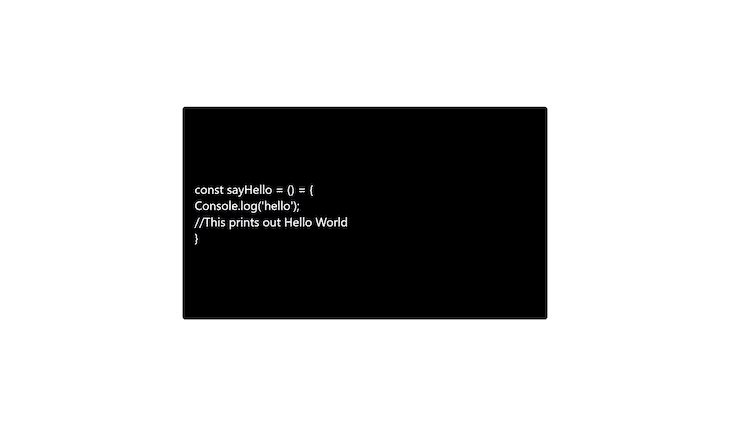

# 使用 React 为代码块创建打字机效果

> 原文：<https://blog.logrocket.com/code-block-typewriter-effect-react/>

使用打字机效果，单词一次显示一个字母，而不是一次显示所有字母，使文本看起来像是实时书写的。你可以在 [Codepen 的](https://codepen.io/)登录页面上找到一个代码块打字机效果的例子，它使用语法高亮，一种特殊的颜色格式，以代码的形式轻松显示书面文本。

在本文中，我们将学习如何使用 React 从头开始构建一个类似的代码块打字机效果。我们还将演示另一种方法，它使用预先存在的打字机包。要跟随本教程，您需要 React 的基本知识。我们将讨论以下内容:

你可以在这个 GitHub repo 找到这个教程[的完整源代码。我们开始吧！](https://github.com/Victory-ET/Code-TypeWriter-Effect)

## 安装依赖项

如果您还没有安装 React，请在系统中导航到您的项目目录，打开一个命令行窗口，并在其中运行以下 bash 脚本:

```
npx create-react-app typewriter

```

上面的命令创建了一个名为`typewriter`的 React 项目文件夹，其中包含构建我们的应用程序所需的所有依赖项。为了让我们的应用程序更加简单，我们将使用 Tailwind CSS 。您可以通过在 CLI 中运行以下命令来安装 Tailwind CSS:

```
npm install -D tailwindcss postcss autoprefixer
npx tailwindcss init -p

```

安装完成后，修改`tailwind.config.js`文件以支持`jsx`元素，如下所示:

```
/** @type {import('tailwindcss').Config} */
module.exports = {
  content: [
    "./src/**/*.{js,jsx,ts,tsx}",
  ],
  theme: {
    extend: {},
  },
  plugins: [],
}

```

最后，将下面的 Tailwind CSS 指令添加到`index.css`的顶层:

```
@tailwind base;
@tailwind components;
@tailwind utilities;

```

## 构建打字机效果

我们的打字机效果将由两个主要部分组成，一个用来保存我们想要动画的文本的容器和一个模仿打字机的闪烁光标。

### 打字机显示区

首先，在我们的`App.js`文件中，我们将为打字机效果构建显示窗口:

```
import "./App.css";
import {React, useState, useEffect} from "react";

function App() {
  const [text1, setText1] = useState("const sayHello = () = {");
  const [text2, setText2] = useState("Console.log('hello')");
  const [text3, setText3] = useState("//This prints out Hello World");
  return (
    <div className=" flex h-screen justify-center items-center">
      <div className=" h-1/2 w-1/2 bg-black rounded-md flex items-center pl-6">
        {/* type writer display */}
        <span>
          <div className=" text-white text-2xl blinking-cursor">{text1}</div>
          <div className=" text-white text-2xl blinking-cursor">{text2}</div>
          <div className=" text-white text-2xl blinking-cursor">{text3}</div>
          <div className=" text-white text-2xl blinking-cursor">{`}`}</div>
        </span>
      </div>
    </div>
  );
}

export default App;

```

上面的代码创建了一个容器，我们将在其中保存想要用打字机效果制作动画的文本。如果我们用`npm start`命令运行上面的代码，我们将得到一个“Hello，World！”类似下图的结果:



### 添加闪烁光标

接下来，我们将构建一个闪烁的光标并将其附加到文本的末尾。将以下代码添加到`index.css`:

```
.bg-code{
  background-color: rgb(40, 42, 54);
}

.blinking-cursor::after {
  content: "|";
  animation: blink 1s step-end infinite;
}
@keyframes blink {
  from,
  to {
    opacity: 1;
  }
  50% {
    opacity: 0;
  }
}

```

上面的 CSS 样式在每个文本的末尾添加了一个`|`，产生了一种类似光标的闪烁效果。

## 给文本添加打字机效果

为了创建我们的打字机效果，我们将使用 React `useEffect`钩子。为此，请在代码中添加以下修改:

```
const first_text = "const sayHello = () = {";
  const second_text = "console.log('hello')";
  const third_text = "//This prints out Hello World";

  const [text1, setText1] = useState("");
  const [text2, setText2] = useState("");
  const [text3, setText3] = useState("");

  useEffect(() => {
    const timeout = setTimeout(() => {
      setText1(first_text.slice(0, text1.length + 1));
    }, 100);
    return () => clearTimeout(timeout);
  }, [text1]);

  useEffect(() => {
    const timeout = setTimeout(() => {
      setText2(second_text.slice(0, text2.length + 1));
    }, 250);

    return () => clearTimeout(timeout);
  }, [text2]);

  useEffect(() => {
    const timeout = setTimeout(() => {
      setText3(third_text.slice(0, text3.length + 1));
    }, 300);

    return () => clearTimeout(timeout);
  }, [text3]);

```

在上面的代码中，我们使用了一个`setTimeout`函数和一个切片操作符。`setTimeout`函数在指定的时间间隔后执行代码块。我们使用 splice 操作符将整个字符串分成字符，并一次返回一个字符。

对于回调，我们使用状态。每当我们输入一个新字符，状态就会更新，并且执行`setTimeout`函数。因此，`setTimeout`会一直运行，直到整个文本被完全输入。

## 删除和重新键入文本

为了循环打字机效果，我们将添加两种状态，`isdeleting`和`istyping`，分别用于用户想要删除文本的时候和他们完成键入的时候:

```
const textState = ["istyping", "isdeleting"];
const [typing, setTyping] = useState(textState[0]);

function sleep(ms) {
    return new Promise((resolve) => setTimeout(resolve, ms));
}

```

现在我们已经创建了输入和删除文本的状态，让我们使用`sleep`函数来创建两种状态之间的切换延迟。因此，当用户完全输入完文本时，我们将实现暂停。让我们继续修改我们的代码以使用这些状态，如下所示:

```
useEffect(() => {
    const timeout = setTimeout(() => {
      if (typing === "istyping" && text1 !== first_text) {
        setText1(first_text.slice(0, text1.length + 1));
      }
      else if (text1 === first_text && typing === "istyping"){
        sleep(2000).then(()=>{
        setTyping(textState[1])
        })
      }
      else if ( (text1 === first_text && typing==="isdeleting") || typing === "isdeleting" ) {
        setText1(first_text.slice(0, text1.length - 1));
        if(text1.length<=2){
            setTyping(textState[0])
        }
      }
    }, 100);
  return () => clearTimeout(timeout);
}, [text1, typing1]);

```

在上面的代码中，我们检查了`typing`是否等于`istyping`以及文本是否等于完整的字符串。如果返回`true`，我们将运行输入效果。当文本与完整字符串相似时，我们使用`sleep`功能在两秒钟后切换到`isdeleting`状态。

最后，我们使用最后一个条件一次删除一个字符，直到只剩下一个字母。此时，`typing`状态被设置回`istyping`，整个过程再次开始。我们也会为`text2`和`text3`做同样的事情。

## 突出显示代码语法

为了突出显示我们的文本，使其看起来像一个代码块，我们将通过 CLI 安装 [React 语法高亮器](https://github.com/react-syntax-highlighter/react-syntax-highlighter):

```
npm i react-syntax-highlighter

```

当这个包被安装后，我们可以在`App.js`中导入它并如下使用它:

```
import SyntaxHighlighter from 'react-syntax-highlighter';
import { docco } from 'react-syntax-highlighter/dist/esm/styles/hljs';
//...
<span>
  <div className=" text-2xl">
    <SyntaxHighlighter className="blinking-cursor" language="javascript" style={dracula}>
      {text1}
    </SyntaxHighlighter>
  </div>
  <div className=" text-2xl">
    <SyntaxHighlighter className="blinking-cursor" language="javascript" style={dracula}>
      {text2}
    </SyntaxHighlighter>
  </div>
  <div className=" text-2xl">
    <SyntaxHighlighter className="blinking-cursor" language="javascript" style={dracula}>
      {text3}
    </SyntaxHighlighter>
  </div>
  <div className=" text-2xl">
    <SyntaxHighlighter className="blinking-cursor" language="javascript" style={dracula}>
      {`}`}
    </SyntaxHighlighter>
  </div>
</span>

```

现在我们已经实现了我们的`Syntax Higlighter`组件，我们可以结束我们的打字机效果了。

## 使用预建的打字库

作为编码和定制我们自己的打字机效果的替代方法，我们可以使用预建的库来节省时间。

处理打字机效果的库的一个例子是`[react-typewriter-effect](https://www.npmjs.com/package/typewriter-effect)`。我们可以使用以下命令通过 CLI 安装该软件包:

```
npm i react-typewriter-effect

```

安装完成后，我们可以在应用程序中使用它，如下所示，以获得打字机效果:

```
import TypeWriterEffect from 'react-typewriter-effect';
//...

<TypeWriterEffect
  textStyle={{ fontFamily: 'Red Hat Display' }}
  startDelay={100}
  cursorColor="black"
  text="Text for typewriting effect here"
  typeSpeed={100}
  eraseSpeed={100}
/>

```

上面的代码将为指定的文本字符串产生打字机效果。

## 结论

在本文中，我们学习了如何使用 React 轻松创建打字机效果。在你的网站或应用程序中实现这一功能可以通过增加视觉趣味和引导用户的注意力到你想要的地方来改善你的用户界面。您可以添加到我们从头构建的打字机效果中，以实现更多您自己的定制，或者您可以使用为您实现该功能的库，如`react-typewriter-effect`。

我希望你喜欢这篇文章，如果你有任何问题，一定要留下评论。编码快乐！

## 使用 LogRocket 消除传统反应错误报告的噪音

[LogRocket](https://lp.logrocket.com/blg/react-signup-issue-free)

是一款 React analytics 解决方案，可保护您免受数百个误报错误警报的影响，只针对少数真正重要的项目。LogRocket 告诉您 React 应用程序中实际影响用户的最具影响力的 bug 和 UX 问题。

[ ](https://lp.logrocket.com/blg/react-signup-general) [  ](https://lp.logrocket.com/blg/react-signup-general) [LogRocket](https://lp.logrocket.com/blg/react-signup-issue-free)

自动聚合客户端错误、反应错误边界、还原状态、缓慢的组件加载时间、JS 异常、前端性能指标和用户交互。然后，LogRocket 使用机器学习来通知您影响大多数用户的最具影响力的问题，并提供您修复它所需的上下文。

关注重要的 React bug—[今天就试试 LogRocket】。](https://lp.logrocket.com/blg/react-signup-issue-free)