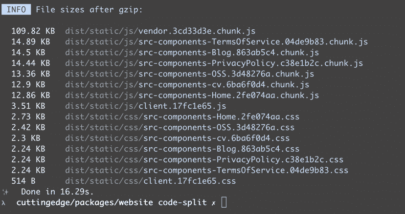

# 代码分割用类型脚本和没有巴别塔-日志火箭博客来反应组件

> 原文：<https://blog.logrocket.com/code-splitting-react-components-with-typescript-and-no-babel/>

## web 性能的秘密在于代码更少

随着现在臭名昭著的单页面应用程序的出现，大量的 JavaScript 开始被推到浏览器上。JavaScript 的重量是一个问题，但是浏览器也必须解析下载的 JavaScript。浏览器的 UI 线程可能会在这种压力下挂起，因为它超出了预期目的。显而易见的答案是发布更少的代码。代码分割允许我们在不减少功能的情况下做到这一点。

代码分割是一件复杂的事情，一束代码被分割成可以按需加载的小块。值得庆幸的是，像 webpack 这样的工具将这种复杂性抽象在一个不太复杂的 API 后面。不幸的是，这个不太复杂的 API 仍然非常复杂。在 React 生态系统中，像[loadable-components](https://github.com/gregberge/loadable-components)这样的工具为[动态导入](https://javascript.info/modules-dynamic-imports)添加了一层更简单的外表。

## 按路由进行代码拆分

我希望看到更多的渲染控制返回到服务器。浏览器不是用来呈现 HTML 的，有很多很好的理由说明为什么在服务器端呈现 React 更好。我预测我们将会看到更多的服务器端 HTML 渲染的回归。

下面是来自我的公司网站的一些代码，该网站使用动态导入来创建更小的代码文件，这些文件可以按需加载。

```
import React from 'react';
import loadable from '@loadable/component';
import * as Urls from '../urls';
import { RouteProps, Route, Switch } from 'react-router';

export type Page<P = unknown> = RouteProps & {
  heading: string;
  path: string;
  footerPage?: boolean;
} & P;

const fallback = <div>loading....</div>;

const Home = loadable(() => import('src/components/Home'), {
  fallback,
});
const OSS = loadable(() => import('src/components/OSS'), {
  fallback: <div>Loading...</div>,
});
const Blog = loadable(() => import('src/components/Blog'), {
  fallback: <div>Loading...</div>,
});

export const routable: Page[] = [
  {
    heading: 'Home',
    path: Urls.Home,
    component: Home,
    exact: true,
  },
  {
    heading: 'OSS',
    path: Urls.OSS,
    component: OSS,
    exact: true,
  },
// etc.
```

`loadable`函数将动态导入作为一个参数，它将为我们完成这项艰巨的工作。运行 webpack 构建会创建几个可以延迟加载的较小文件:



## @可加载/巴别塔插件

我是一个超级打字迷，我总是远离任何需要 Babel 的东西，因为不得不维护两种不同的 transpiler 配置不是我愿意走的路。

`@loadable/babel-plugin`像这样转换代码:

```
import loadable from '@loadable/component';

export const LazyFoo = loadable(() => import('./input/AsyncDefaultComponent'));
```

变成这样的代码:

```
import loadable from 'loadable-components';

export const LazyFoo = loadable({
  chunkName() {
    return 'input-AsyncDefaultComponent';
  },
  isReady(props) {
    return (
      typeof __webpack_modules__ !== 'undefined' &&
      Boolean(__webpack_modules__[this.resolve(props)])
    );
  },
  requireAsync: () =>
    import(
      /* "webpackChunkName":"input-AsyncDefaultComponent" */ './input/AsyncDefaultComponent'
    ),
  requireSync(props) {
    return typeof '__webpack_require__' !== 'undefined'
      ? __webpack_require__(this.resolve(props))
      : eval('module.require')(this.resolve(props));
  },
  resolve() {
    if (require.resolveWeak)
      return require.resolveWeak(
        /* "webpackChunkName":"input-AsyncDefaultComponent" */ './input/AsyncDefaultComponent',
      );
    else
      return eval('require.resolve')(
        /* "webpackChunkName":"input-AsyncDefaultComponent" */ './input/AsyncDefaultComponent',
      );
  },
});
```

## 可装载变压器

现在该片的主角登场了，即 [loadable-ts-transformer](https://github.com/Quramy/loadable-ts-transformer) ，它与它的 Babel 对应物做着同样的工作，只是它通过创建一个[类型脚本转换器](https://blog.logrocket.com/using-typescript-transforms-to-enrich-runtime-code-3fd2863221ed/)来完成这项工作。TypeScript transformer 允许我们挂接编译管道并转换代码，就像上面列出的 Babel 插件一样。一个完整的 AST 由开发人员按照他们的意愿处理。

## 将 loadable-ts-transformer 连接到 webpack 构建

第一步是用[可加载组件的可加载函数](https://loadable-components.com/docs/api-loadable-component/#loadable)定义我们想要分割成更小块的组件:

```
const Home = loadable(() => import('src/components/Home'), {
  fallback,
});
```

接下来，需要配置 webpack。通常，在 webpack ssr(服务器端呈现)构建中，您有一个服务器 webpack 配置文件和一个客户端 webpack 配置文件。

webpack 服务器配置负责捆绑呈现 react 组件服务器端的节点 [express 代码](https://expressjs.com/)。

为了减少两个配置文件之间的重复，我使用 [webpack-merge](https://www.npmjs.com/package/webpack-merge) 来创建一个`common.config.js`文件，该文件被合并到`client.config.js`和`server.config.js`文件中。

下面是一个`common.config.js`文件的例子，它包含 webpack 客户端和服务器配置文件的通用组件:

```
const path = require("path");
const { loadableTransformer } = require('loadable-ts-transformer');

module.exports = {
  resolve: {
    extensions: ['.ts', '.tsx', '.js'],
  },
  module: {
    rules: [
      {
        test: /\.tsx?$/,
        exclude: /node_modules/,
        loader: 'ts-loader',
        options: {
          transpileOnly: true,
          getCustomTransformers: () => ({ before: [loadableTransformer] }),
        },
      }
    ],
  },
};
```

我使用 [ts-loader](https://github.com/TypeStrong/ts-loader) 将类型脚本转换成 JavaScript，`ts-loader`有一个 [getCustomTransformers](https://github.com/TypeStrong/ts-loader#getcustomtransformers) 选项，我们可以用它来添加`loadable-ts-transformer`。

`client.config.js`文件如下所示:

```
const path = require("path");
const merge = require('webpack-merge');
const LoadablePlugin = require('@loadable/webpack-plugin');
const commonConfig = require('./webpack.config');
const webpack = require('webpack');

module.exports = () => {
  return merge(commonConfig, {
    output: {
      path: path.resolve(__dirname, 'public'),
      publicPath: '/assets/',
      filename: '[name].[chunkhash].js',
    },
    entry: {
      main: path.resolve(__dirname, 'src/client.tsx'),
    },
    optimization: {
      splitChunks: {
        name: 'vendor',
        chunks: 'initial',
      },
    },
    plugins: [
      new LoadablePlugin(),
      new webpack.DefinePlugin({ __isBrowser__: "true" })
    ],
  });
};
```

注意[网络包的使用。定义插件](https://webpack.js.org/plugins/define-plugin/)将`__isBrowser__`属性添加到捆绑代码中。这不再需要使用无休止的`typeof window === 'undefined'`检查来确定代码是否在服务器或浏览器上执行。

`client.config.js`文件还将 [@loadable/webpack-plugin](https://loadable-components.com/docs/api-loadable-webpack-plugin/#loadablewebpack-plugin) 添加到插件数组中。不要将其添加到`server.config.js`中。

`server.config.js`文件如下所示:

```
const path = require("path");
const merge = require('webpack-merge');
const commonConfig = require('./webpack.config');
const webpack = require('webpack');
const nodeExternals = require('webpack-node-externals');

module.exports = () => {
  return merge(commonConfig, {
    target: 'node',
    externals:  nodeExternals({
      whitelist: [
          /^@loadable\/component$/,
          /^react$/,
          /^react-dom$/,
          /^loadable-ts-transformer$/,
        ]
      }),
    ],
    output: {
      path: path.resolve(__dirname, 'dist-server'),
      filename: '[name].js',
    },
    entry: {
      server: path.resolve(__dirname, 'src/server.tsx'),
    },
   plugins: [
     new webpack.DefinePlugin({ __isBrowser__: "false" })
   ]
  });
};
```

[webpack externals](https://webpack.js.org/configuration/externals/) 部分曾多次绊倒我。externals 属性允许您将 webpack 服务器构建中捆绑的内容列入白名单。您不希望捆绑整个`node_modules`文件夹。我发现 [webpack-node-externals 包](https://www.npmjs.com/package/webpack-node-externals)非常有用，它有一个白名单选项。

## 可加载组件服务器端

`server.config.js`文件定义了`src/server/index.ts`的[入口点](https://webpack.js.org/concepts/#entry)，如下所示:

```
export const app = express();
const rootDir = process.cwd();

const publicDir = path.join(rootDir, isProduction ? 'dist/public' : 'public');
app.use(express.static(publicDir));

app.use(bodyParser.urlencoded({ extended: false }));
app.use(bodyParser.json());

app.get('/*', async (req, res) => {
  await render({
    req,
    res,
  });
});
```

上述代码的要点是:

*   `app.use(express.static(publicDir));`代码点表示 webpack 使用 [express 静态函数](https://expressjs.com/en/starter/static-files.html)输出的静态文件
*   一个包罗万象的`app.get('/*. async (req. res) => {`路径指向一个可重用的`render`函数，我将在下面解释这个函数

`render`功能如下:

```
const statsFile = path.resolve(process.cwd(), 'dist/loadable-stats.json');

export async function render({ req, res }: RendererOptions): Promise<void> {
  const extractor = new ChunkExtractor({
    entrypoints: ['client'],
    statsFile,
  });

  const context: StaticRouterContext = {};

  const html = renderToString(
    extractor.collectChunks(
      <StaticRouter location={req.url} context={context}>
        <Routes />
      </StaticRouter>,
    ),
  );

  res.status(HttpStatusCode.Ok).send(`
    <!doctype html>
    <html lang="en">
      <head>
        <meta http-equiv="Content-Type" content="text/html; charset=UTF-8">
        <meta httpEquiv="X-UA-Compatible" content="IE=edge" />
        <meta charSet="utf-8" />
        <meta name="viewport" content="width=device-width, initial-scale=1" />
        ${extractor.getStyleTags()}   
      </head>
      <body>
        <div id="root">${html}</div>
        ${extractor.getScriptTags()}
      </body>
    </html>
`);
}
```

上面的代码利用了 [ChunkExtractor 组件](https://loadable-components.com/docs/api-loadable-server/#chunkextractor)，它收集服务器端的块，然后创建可以在输出的 HTML 中使用的脚本标签或脚本元素。

`${extractor.getStyleTags()}`将输出 CSS 链接标签，而`${extractor.getScriptTags()}`将输出 JavaScript 脚本标签。

当运行您的构建时，@loadable/webpack-plugin 生成一个名为`loadable-stats.json`的文件，它包含来自 webpack 的所有条目和块的信息。

一旦就位，`ChunkExtractor`负责从该文件中找到您的条目。

`ChunkExtractor`组件的[入口点数组](https://loadable-components.com/docs/server-side-rendering/#chunkextractor-entrypoints)被设置为`['client']`，映射到 webpack `client.config.js`文件的`client`属性；

```
entry: {
  client: path.join(process.cwd(), 'src/client.tsx'),
 },
```

## 客户补液

客户端配置文件的[入口点](https://webpack.js.org/concepts/#entry)现在是一个具有客户端属性的对象。

下面列出了`client.tsx`文件:

```
import React from 'react';
import { hydrate } from 'react-dom';
import { loadableReady } from '@loadable/component';

import { App } from '../containers/App';

const bootstrap = (): void => {
  const root = document.getElementById('root');

  if (!root) {
    return;
  }

  hydrate(<App />, root);
};

loadableReady(() => bootstrap());
```

通常，当重新水合 React 服务器端呈现的代码时，您会使用 [ReactDom 的水合物函数](https://reactjs.org/docs/react-dom.html#hydrate)，但是在上面的`loadable-component's`世界中，可加载组件的 [loadableReady 函数](https://loadable-components.com/docs/api-loadable-component/#loadableready)用于等待所有脚本异步加载，以确保最佳性能。所有脚本都是并行加载的，所以您必须使用`loadableReady`等待它们准备好。

## 收场白

由于对 Babel 的需求，我已经避免使用许多代码分割包。 [loadable-ts-transformer](https://github.com/Quramy/loadable-ts-transformer) 已经解决了这个问题。

如果你想看到这个被添加到[可加载组件的源](https://github.com/gregberge/loadable-components)中，那么请在[这个问题](https://github.com/gregberge/loadable-components/issues/458)上插话，我在那里发现了它的存在。

## [LogRocket](https://lp.logrocket.com/blg/react-signup-general) :全面了解您的生产 React 应用

调试 React 应用程序可能很困难，尤其是当用户遇到难以重现的问题时。如果您对监视和跟踪 Redux 状态、自动显示 JavaScript 错误以及跟踪缓慢的网络请求和组件加载时间感兴趣，

[try LogRocket](https://lp.logrocket.com/blg/react-signup-general)

.

[ ](https://lp.logrocket.com/blg/react-signup-general) [](https://lp.logrocket.com/blg/react-signup-general) 

LogRocket 结合了会话回放、产品分析和错误跟踪，使软件团队能够创建理想的 web 和移动产品体验。这对你来说意味着什么？

LogRocket 不是猜测错误发生的原因，也不是要求用户提供截图和日志转储，而是让您回放问题，就像它们发生在您自己的浏览器中一样，以快速了解哪里出错了。

不再有嘈杂的警报。智能错误跟踪允许您对问题进行分类，然后从中学习。获得有影响的用户问题的通知，而不是误报。警报越少，有用的信号越多。

LogRocket Redux 中间件包为您的用户会话增加了一层额外的可见性。LogRocket 记录 Redux 存储中的所有操作和状态。

现代化您调试 React 应用的方式— [开始免费监控](https://lp.logrocket.com/blg/react-signup-general)。

## [LogRocket](https://lp.logrocket.com/blg/typescript-signup) :全面了解您的网络和移动应用

[](https://lp.logrocket.com/blg/typescript-signup)

LogRocket 是一个前端应用程序监控解决方案，可以让您回放问题，就像问题发生在您自己的浏览器中一样。LogRocket 不需要猜测错误发生的原因，也不需要向用户询问截图和日志转储，而是让您重放会话以快速了解哪里出错了。它可以与任何应用程序完美配合，不管是什么框架，并且有插件可以记录来自 Redux、Vuex 和@ngrx/store 的额外上下文。

除了记录 Redux 操作和状态，LogRocket 还记录控制台日志、JavaScript 错误、堆栈跟踪、带有头+正文的网络请求/响应、浏览器元数据和自定义日志。它还使用 DOM 来记录页面上的 HTML 和 CSS，甚至为最复杂的单页面和移动应用程序重新创建像素级完美视频。

[Try it for free](https://lp.logrocket.com/blg/typescript-signup)

.