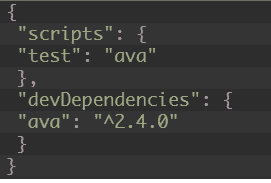
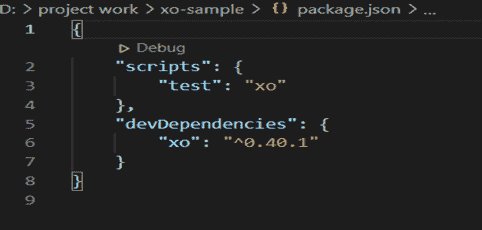
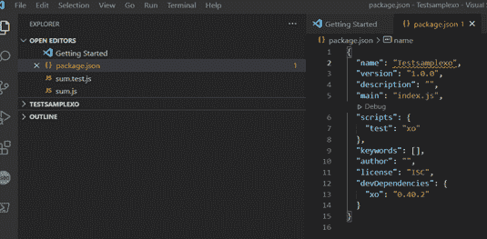
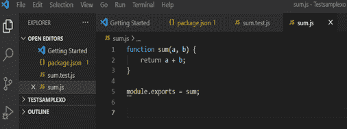
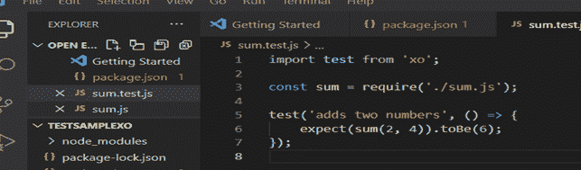
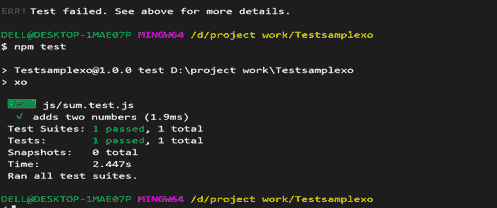

# 代码测试和林挺使用 AVA 和 XO 

> 原文：<https://blog.logrocket.com/code-testing-and-linting-using-ava-and-xo/>

## 介绍

在过去的几年中，web 开发编码技术已经发生了变化，开发人员已经开始采用各种 JavaScript 框架，因为它们具有多种功能，而不是像 Java 和 PHP 这样的传统编程语言。下一个大问题是如何测试在这些新框架上编写的代码。

你知道哪个是最好的 JavaScript 测试框架吗？几乎不可能说某个特定的测试工具是最好的，但是 JEST、Mocha、Karma 和 AVA 等名字通常被认为是性能最好的。

大多数测试人员没有意识到 AVA 的力量。这篇文章将解释 AVA 的基础知识并帮助你理解它的不同特性，包括如何创建测试用例文件。这可以帮助您为您的特定测试用例选择正确的工具。

除了 AVA，我还会谈到林挺和 XO，一个新的林挺工具。这篇文章应该让您更好地了解什么是林挺，以及它在测试时是如何有益的。

## 自动话频警报器(automatic voice alarm)ˌ视听教具(audiovisual aids)

[AVA](https://github.com/avajs/ava) 是 Node.js 的开源测试运行器，它使代码测试变得简单方便，测试用例更加稳定、易读和有组织。它是由 Sindre Sorhus 和 Kevin mrtensson 在 2014 年开发的。

AVA 为测试用例提供了详细的错误输出，这个特性叫做“神奇断言”，它以一种简单而信息丰富的方式处理并显示错误。它还支持新的语言功能。它将完全控制权交给了测试人员，其简单的语法使其相对于同类的其他工具更受欢迎。

## AVA 的特色

下面列出了 AVA 的一些最佳特征。

### 并行测试运行

默认情况下，AVA 并行执行测试用例，这比其他工具花费的时间要少。并行运行迫使测试人员确保所有的测试完全相互独立，这总是一个好的实践。

### 唯一

AVA 的另一个伟大的特性是你可以选择只运行你正在进行的一个测试。如果您有许多失败的测试用例，并且您想要一个接一个地修复它们，这是非常有用的。

### 观看模式

AVA 能够识别受影响的测试文件，并且只在那些特定的文件中重新运行测试。这是可能的，由于“手表模式”的功能，这是了不起的。如果你改变了一个测试用例文件，它将只重新运行那个文件。如果你改变了一个源文件，它将重新运行所有依赖于它的测试用例。

### 插件支持

AVA 包含了自己的插件，设计灵活，可配置用于不同的用例。

### 过程隔离功能

对于每个测试文件，AVA 启动一个新的 Node.js 进程，这意味着您可以安全地修改全局状态，而不会影响不相关的测试。它还可以一起运行多个测试文件，每个文件都有自己的进程。

### 明显的支持

Observable support 是一种数据类型，可用于对基于推的数据源进行建模，例如套接字、DOM 事件和计时器间隔等。如果您想发出一组流数据值，最好使用它。它可以由更高阶的组合构成，并且直到观察者订阅后才开始发送数据。

### 编辑器插件

AVA 有很多插件可以连接不同的文本编辑器，比如 Sublime、Atom 和 VS Code。

## AVA 的缺点

和其他工具一样，AVA 也有一些缺点。

一个主要的缺点是 AVA 不支持浏览器测试，这限制了它的使用。幸运的是，AVA 开发团队正在努力解决这个问题。

AVA 也没有任何对 DOM 的内置支持。因为这是一个相对较新的工具，艾娃仍然有许多开放的问题。

社区仍在增长，但仍然很小，所以与其他测试框架相比，文档或教程更少。

## 安装 AVA

AVA 的安装过程很快，你只需要遵循一些简单的步骤。在开始之前，您必须安装 Node.js 以便安装 AVA。

然后，在命令提示符下输入以下代码:

```
mkdir ava_folder
cd    ava_folder
npm init ava

```

这将创建一个名为`ava_folder`的文件夹。下一行代码`cd ava_folder`将移到该文件夹中，最后一个命令将安装 AVA。文件夹里会有一些新文件。

要验证安装，打开`package.json`文件，如果它包含下面的代码(版本除外)，那么一切都应该设置好了:



如果你更喜欢使用纱线，那么遵循下面的命令:

```
yarn add ava --dev

```

您也可以使用以下命令手动安装 AVA:

```
npm install --save-dev ava

```

## 创建您的测试文件

要创建测试文件，打开安装 AVA 的根目录，并创建一个名为`SampleTest.js`的文件。

出于测试目的，在文件中编写以下代码:

```
const SampleTest= require('ava');

SampleTest('foo', t => {
                         t.pass();
                        }
           );
SampleTest('bar', async t => {
                              const bar = Promise.resolve('bar');
                              t.is(await bar, 'bar');
                             });

```

## 运行测试文件

一旦创建了测试文件，下一个问题就是如何执行它们。您可以使用以下命令来执行:

```
npm SampleTest

```

如前所述，AVA 有一个智能手表模式。要在启用监视模式的情况下运行测试，请使用以下命令:

```
npx ava --watch

```

## 向测试文件传递参数

AVA 提供了一个将命令行参数传递给测试文件的选项。

通过 npm 脚本调用 AVA 时，您需要两个`--`参数终止符:

```
npm SampleTest -- -- --hello world

```

## 最上乘的白兰地酒（特陈级）

XO 是一个强大的林挺工具。如果你不熟悉林挺工具，不用担心，我会在这里解释它们。

林挺通过分析源代码来标记编程错误、bug、风格错误和可疑结构，从而帮助您改进代码。Linters 可以让你和你的代码更有效率，节省你的时间和金钱。

## XO 的特点

XO 因其众多特性而成为棉绒中最受欢迎的选择之一。在编写 JavaScript 代码时，它可以避免和控制语法中的愚蠢错误。将 XO 添加到项目文件夹是一项简单的任务，可以通过执行一个单行命令来实现。

最好的特性之一是它用简单的命令`xo --fix`自动修复了许多问题。

XO 的另一个很棒的品质就是支持不同的插件。一些编辑器插件包括 Sublime Text、Atom、Vim、TextMate 2、VSCode、Emacs 和 WebStorm。XO 还支持 ESLint 插件，如`unicorn`、`import`、`ava`、`node`等等。

类型脚本文件(。ts，d.ts 和。tsx)由 XO 支持。假设您有许多要配置的文件——没有必要指定 lint 的文件路径，因为 XO lint 会全部配置。js 文件(通常被忽略的路径除外)。

XO 在数据库方面有强大的支持。它可以为数据库模式或自定义查询生成 Go 代码。它是一个命令行工具，通过使用元数据和 SQL 自省查询来识别模式中的类型和关系，并根据发现的关系应用一组标准的 Go 模板。

目前，它可以为不同的数据库(如 PostgreSQL、Oracle、MySQL、Microsoft SQL Server 和 SQLite3)生成表、存储过程、枚举和定制 SQL 查询的类型。

## 安装 XO

XO 需要 Node.js，建议先安装 Node.js 再安装 XO。

要通过控制台安装，请使用以下命令:

```
npm install — global xo

```

您也可以在命令提示符下使用以下命令手动安装 XO:

```
npm init xo

```

一旦它被安装在一个特定的目录中，找到 package.json 文件。如果文件包含与下图相同的代码(版本除外)，则安装成功:



## 使用 XO 进行代码测试

在本节中，您将学习如何使用 XO 测试 Node.js 代码。出于演示目的，我们将为一个将两个数字相加的应用程序编写测试用例，并使用 Visual Studio 插件来运行测试。

首先，创建一个用于编写代码的文件夹。在下面的截图中，你可以看到我创建了一个名为`TESTSAMPLEXO`的文件夹。

在 Visual Studio 的终端中运行以下命令:

```
Npm init -y

```

一旦上面的命令被执行，`package.json`文件应该看起来像这个截图:



现在在前面步骤中创建的同一个文件夹中创建一个测试文件`sum.js`。应该是这样的:



下一步是在目录中添加 XO(`TESTSAMPLEXO`**)**。为此，请执行以下命令:

```
npm init xo

```

需要在同一个目录下再创建一个名为`sum.text.js`(在我的例子中)的文件。编写测试用例，如下图所示:



最后，是时候执行测试命令了。使用下面的语法来执行测试用例:

```
npm test

```

如果在运行命令时出现错误，请按照显示的说明逐一清除它们。

每次清除错误后，必须在命令提示符或终端执行命令`npm test`，测试输出如下所示:



## 结论

在本文中，您了解了 JavaScript 测试工具 AVA 和林挺工具 XO。现在您已经熟悉了这些工具的强大功能。

XO 是一个有用的工具，可以改进和精炼代码，并在错误变成大问题之前将其捕获。

如前所述，AVA 确实值得一试。它结合了 Jasmine 的易用性和磁带的简单性。它支持前端和后端 JavaScript 应用程序，并且可以让测试 JS 代码变得轻而易举。

## 使用 [LogRocket](https://lp.logrocket.com/blg/signup) 消除传统错误报告的干扰

[](https://lp.logrocket.com/blg/signup)

[LogRocket](https://lp.logrocket.com/blg/signup) 是一个数字体验分析解决方案，它可以保护您免受数百个假阳性错误警报的影响，只针对几个真正重要的项目。LogRocket 会告诉您应用程序中实际影响用户的最具影响力的 bug 和 UX 问题。

然后，使用具有深层技术遥测的会话重放来确切地查看用户看到了什么以及是什么导致了问题，就像你在他们身后看一样。

LogRocket 自动聚合客户端错误、JS 异常、前端性能指标和用户交互。然后 LogRocket 使用机器学习来告诉你哪些问题正在影响大多数用户，并提供你需要修复它的上下文。

关注重要的 bug—[今天就试试 LogRocket】。](https://lp.logrocket.com/blg/signup-issue-free)