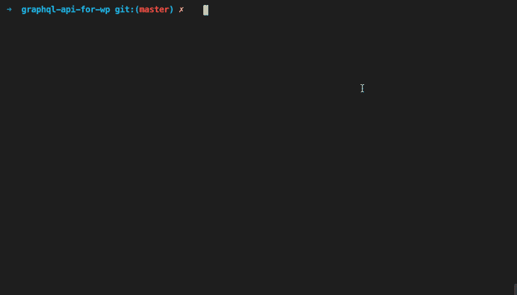
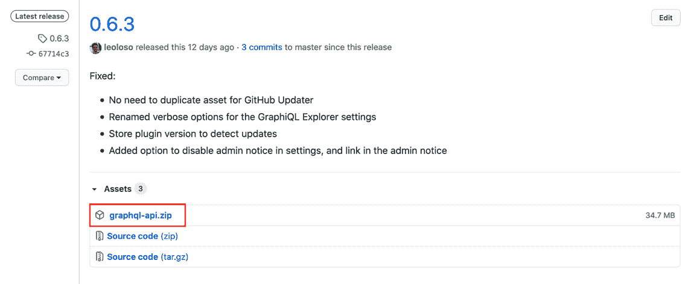

# 在 PHP 7.4 中编码并通过 Rector 和 GitHub Actions 部署到 7.1

> 原文：<https://blog.logrocket.com/coding-in-php-7-4-and-deploying-to-7-1-via-rector-and-github-actions/>

PHP 开发人员希望获得该语言的最新特性，但是由于各种原因，他们可能无法获得。这可能是因为客户端的服务器运行在旧版本上，无法升级，或者 CMS 必须支持遗留代码，或者用户群会显著缩小，或者其他原因。

但是有一个解决方案:我们可以使用 transpiler 将使用新语法的代码转换为遗留语法。Transpilers 提供了两个世界的精华；开发人员可以使用最新的特性进行编码，并生成一个可与该语言以前版本一起工作的生产资产。

在我的[上一篇文章](https://blog.logrocket.com/transpiling-php-code-from-8-0-to-7-x-via-rector/)中，我介绍了 [Rector](https://github.com/rectorphp/rector/) ，一个 PHP 的重构工具。现在让我们把它付诸实践。在本文中，我们将探索如何使用 PHP 7.4 代码开发一个 WordPress 插件，并通过 Rector 和 [GitHub Actions](https://github.com/features/actions) 发布包含 PHP 7.1 及更低版本代码的插件。

## 为什么选择 PHP 7.1

由于 WordPress 决定将[而非](https://make.wordpress.org/core/2020/08/24/proposal-dropping-support-for-old-php-versions-via-a-fixed-schedule/) [升级为](https://make.wordpress.org/core/2020/08/24/proposal-dropping-support-for-old-php-versions-via-a-fixed-schedule/) [，我开始移植我的 WordPress 插件，目前是 5.6。你可能会想，为什么我要转换到 PHP 7.1，而不是 PHP 5.6？](https://make.wordpress.org/core/2020/08/24/proposal-dropping-support-for-old-php-versions-via-a-fixed-schedule/)

这有两个原因。首先，Rector 基于[规则](https://github.com/rectorphp/rector/blob/master/docs/rector_rules_overview.md)进行转换，比如[arrow functiontoanonymousfuncorctor](https://github.com/rectorphp/rector/blob/master/docs/rector_rules_overview.md#arrowfunctiontoanonymousfunctionrector)，将代码从 PHP 7.4 的箭头函数降级为 PHP 7.3 及以下的匿名函数:

```
class SomeClass
 {
     public function run()
     {
         $delimiter = ",";
-        $callable = fn($matches) => $delimiter . strtolower($matches[1]);
+        $callable = function ($matches) use ($delimiter) {
+            return $delimiter . strtolower($matches[1]);
+        };
     }
 }
```

从迄今实施的大约 [20 个降级规则](https://github.com/rectorphp/rector/blob/master/docs/rector_rules_overview.md#downgradephp71)来看，只有少数是从 PHP 7.1 到 7.0，没有一个是从 7.0 到 5.6。所以对达到 7.0 的支持是有限的，对目标 5.6 还没有支持。

这并不意味着 Rector 不能支持 PHP 5.6，但这项工作必须完成。如果这些规则最终得以实现(在 WordPress 将其最低版本提升到 7.1 之前，否则就不再需要它们了)，那么我可以瞄准一个更低的 PHP 版本。

第二个原因与第三方 PHP 依赖有关。这些也必须与我们的应用程序代码一起传输，这样做可能需要大量的工作。

例如，如果一个依赖项需要 PHP 7.1，而我的应用程序的目标是 PHP 7.1，那么这个依赖项就被直接支持，我不需要转换它的代码。但是如果我的目标是 PHP 7.0 或 5.6，那么我需要转换它。

传输第三方依赖项会变得很有挑战性，因为它们不在我的控制之下。仅仅浏览它的代码是不够的；我需要做彻底的研究，以确保依赖关系中的所有 PHP 7.1 代码都可以被编译。我没有注意到的一个特性很可能会使应用程序在运行时失败。

在我的例子中，我的应用程序有一个依赖项需要 PHP 7.2，几十个依赖项需要 PHP 7.1(稍后会详细介绍)。因为我没有无限的资源，所以我选择了 PHP 7.1 和 transpile 一个依赖项，而不是 7.0 和 transpile 几十个。

因此，运行 WordPress 5.6 和 7.0 的用户将无法使用我的 WordPress 插件，但这是一个我很满意的权衡。

## 支持的 PHP 特性

当声明一个应用程序现在可以使用 PHP 7.4 代码时，这并不一定意味着它可以使用 PHP 7.4 中引入的每一个特性。相反，它只能使用那些有 Rector 规则来降级的功能。

而且，[不是所有的特性都可以被传输](https://blog.logrocket.com/transpiling-php-code-from-8-0-to-7-x-via-rector/#avoiding-features-needed-on-runtime)，有些特性因为这样那样的原因不会被传输。

例如，在 PHP 7.4 引入的[新常量](https://www.php.net/manual/en/migration74.constants.php)中，常量`SO_LABEL`、`SO_PEERLABEL`和其他常量是 FreeBSD 特定的套接字选项。这似乎太具体了，所以我不希望有人为他们实现一个 Rector 规则。

这样一来，应用程序将不会完全支持 PHP 7.4(如果有人确实需要 constant `SO_LABEL`，那也不会有)；相反，它可以完全支持 PHP 7.1，并通过 PHP 7.2、7.3 和 7.4 中的一组特性得到增强。

下面的列表列出了当前支持的 PHP 7.1 版本的特性。该列表(随着社区实施[剩余降级规则](https://github.com/rectorphp/rector/projects/3)而必定会扩大)还包括由 [Symfony polyfill 软件包](https://blog.logrocket.com/transpiling-php-code-from-8-0-to-7-x-via-rector/#backporting-functionalities)支持的功能:

你有没有注意到一些 PHP 8.0 的特性已经被支持了？一旦 PHP 8.0 在今年年底发布，您就可以立即开始在您的应用程序代码中使用[联合类型](https://github.com/rectorphp/rector/blob/master/docs/rector_rules_overview.md#downgradenullcoalescingoperatorrector)，而不会放弃对 PHP 7.1 的支持……这多酷啊？

## 蒸腾输入和输出

我将使用我自己的插件 [GraphQL API for WordPress](https://github.com/GraphQLAPI/graphql-api-for-wp) 和它的包来演示如何通过 Rector 传输一个 WordPress 插件。

插件中的代码使用了 PHP 7.4、7.3 和 7.2 的特性，即:

*   PHP 7.4 中的类型化属性、箭头函数、零合并赋值操作符、数组内部的解包和数字文字分隔符
*   PHP 7.3 中数组析构和灵活的 Heredoc 语法中的引用赋值
*   PHP 7.2 中的`object`返回和参数类型

当 transpiling 时，这些特性被转换成 PHP 7.1 中的等价代码。

此表显示了来自源代码的示例，以及当[为生产](https://github.com/GraphQLAPI/graphql-api-for-wp/releases/tag/0.6.3)生成资产时，Rector 将它们转换成什么:

| **PHP 特性** | **源代码** | **传输码** |
| [类型化属性](https://github.com/GraphQLAPI/graphql-api-for-wp/blob/1b08b9ad1654edf8488c7ca40127fc25d56d883a/src/Registries/ModuleTypeRegistry.php#L15) | 

```
class ModuleTypeRegistry { -  protected array $moduleTypeResolvers = []; }
```

 | 

```
class ModuleTypeRegistry { +  /** +   * @var array +   */ +  protected $moduleTypeResolvers = []; }
```

 |
| [箭头功能](https://github.com/GraphQLAPI/graphql-api-for-wp/blob/ca7094317080ab2bab374e3f0926c361db77b733/src/Registries/ModuleRegistry.php#L36) | 

```
$modules = array_filter(   $modules, -  fn ($module) => !$this->getModuleResolver($module)->isHidden($module) );
```

 | 

```
$modules = array_filter(   $modules, +  function ($module) { +    return !$this->getModuleResolver($module)->isHidden($module); +  } );
```

 |
| [零合并赋值运算符](https://github.com/getpop/api/blob/0bade110afe33506902fff4a58cee6d89940b2b6/src/Schema/FieldQueryConvertor.php#L57) | 

```
-$fragments ??= $this->getFragments();
```

 | 

```
+$fragments = $fragments ?? $this->getFragments();
```

 |
| [打开数组内部的包装](https://github.com/GraphQLAPI/graphql-api-for-wp/blob/a92efc2e1e7d03d551196a17d2c717e5f1a74962/src/BlockCategories/AbstractBlockCategory.php#L59) | 

```
-return [ -  ...$categories, -  [ -    'slug' => $this->getBlockCategorySlug(), -    'title' => $this->getBlockCategoryTitle(), -  ], -];
```

 | 

```
+return array_merge( +  $categories, [[ +    'slug' => $this->getBlockCategorySlug(), +    'title' => $this->getBlockCategoryTitle(), +  ]] +);
```

 |
| [数字文字分隔符](https://github.com/getpop/trace-tools/blob/ebbd132cd28f9a520442d1c15639c99b1207149b/src/DirectiveResolvers/EndTraceExecutionTimeDirectiveResolver.php#L135) | 

```
-$executionTime / 1_000_000
```

 | 

```
+$executionTime / 1000000
```

 |
| [在`list()`中引用赋值/数组析构](https://github.com/GraphQLAPI/graphql-api-for-wp/blob/fef87e1500e999de6821c6f63325eb902659e851/src/EndpointResolvers/EndpointResolverTrait.php#L94) | 

```
-[&$vars] = $vars_in_array;
```

 | 

```
+$vars =& $vars_in_array[0];
```

 |
| [灵活的 Heredoc 语法](https://github.com/GraphQLAPI/graphql-api-for-wp/blob/61f58a0093147ad17503fd267a46b556e8224bb0/src/Admin/MenuPages/GraphiQLMenuPage.php#L210) | 

```
-return <<<EOT -  # Welcome to GraphiQL -  # -  # GraphiQL is an in-browser tool for writing, validating, and -  # testing GraphQL queries. -  EOT;
```

 | 

```
+return <<<EOT +# Welcome to GraphiQL +# +# GraphiQL is an in-browser tool for writing, validating, and +# testing GraphQL queries. +EOT;
```

 |
| [`object`键入回车键](https://github.com/getpop/component-model/blob/2d93d20cabe71b8c20b598927cbc9a4f9db94ae3/src/Instances/InstanceManagerInterface.php#L9) | 

```
-public function getInstance(string $class): object;
```

 | 

```
+/** + @return object + */ +public function getInstance(string $class);
```

 |
| [`object`输入参数](https://github.com/GraphQLByPoP/graphql-server/blob/33acfc909a34eea21c8ad800e1356e942533a2a2/src/TypeResolvers/DirectiveTypeResolver.php#L26) | 

```
-public function getID(object $resultItem) {   $directive = $resultItem;   return $directive->getID(); }
```

 | 

```
+/** + * @param object $resultItem + */ +public function getID($resultItem) {   $directive = $resultItem;   return $directive->getID(); }
```

 |

这些文件来自两个来源:`src/`文件夹和`vendor/`文件夹。

是存储应用程序代码的地方，所以它完全在我的控制之下。因此，我可以保证这段代码只包含前面描述的受支持的 PHP 特性。

`vendor/`包含我和第三方拥有的所有依赖项(通过 Composer 管理)。对于我的插件，所有对 transpile 的依赖(来自所有者`getpop`、`pop-schema`和`graphql-by-pop`)也是我的，所以我可以再次保证这段代码只包含受支持的特性。

排除的路径对应于包含的依赖项，我已经知道这些依赖项只包含 PHP 7.1 和更低版本的代码。因此，没有什么要为它们传输的，因此，我直接跳过对它们运行 Rector。

第三方依赖怎么办？为什么我一个都没发？

幸运的是，我不需要。原因如下。

### 传输第三方依赖关系

我们需要弄清楚第三方依赖是否必须移植到 PHP 7.1。

第一步是找出哪些依赖项需要 PHP 7.2 或以上。为此，我们为生产安装了 Composer 依赖项，因为我们将在那里运行 transpiled 代码:

```
composer install --no-dev 
```

现在，我们可以通过运行以下命令获得不支持 PHP 7.1 的依赖项列表:

```
composer why-not php 7.1.33 
```

请注意，约束是在版本`7.1.33`(PHP 7.1 的最新版本)上，而不是直接在`7.1`上。这是因为`7.1`被解释为`7.1.0`，所以需要版本`7.1.3`的包也会失败。

对于我的插件，运行上面的命令会产生这些依赖关系:

```
symfony/cache                                 v5.1.6         requires  php (>=7.2.5)
symfony/cache-contracts                       v2.2.0         requires  php (>=7.2.5)
symfony/expression-language                   v5.1.6         requires  php (>=7.2.5)
symfony/filesystem                            v5.1.6         requires  php (>=7.2.5)
symfony/inflector                             v5.1.6         requires  php (>=7.2.5)
symfony/service-contracts                     v2.2.0         requires  php (>=7.2.5)
symfony/string                                v5.1.6         requires  php (>=7.2.5)
symfony/var-exporter                          v5.1.6         requires  php (>=7.2.5)
```

所以我不得不检查这八个包的源代码，以检查为什么它们至少需要 PHP 7.2.5，并找出这些代码是否可以被编译。

* * *

### 更多来自 LogRocket 的精彩文章:

* * *

六个包(`cache-contracts`、`expression-language`、`filesystem`、`inflector`、`service-contracts`、`string`)只用 PHP 7.1 及以下代码。他们对 PHP 7.2.5 有需求只是因为他们的一个依赖项有这个需求。

我不知道(也不关心)包`symfony/var-exporter`(它是对`symfony/cache`的依赖)是否包含 PHP 7.2 代码:它是从我的插件不使用的类中引用的(`PhpArrayAdapter`和`PhpFilesAdapter`)，并且由于`[PSR-4](https://www.php-fig.org/psr/psr-4/)`和自动加载，运行时不会加载包中的任何类。

最后，包`symfony/cache`确实包含 PHP 7.2 代码，在[类`PdoAdapter`](https://github.com/symfony/cache/blob/292cd57b7c2e3c37aa2f0a2fa42dacae567dd5cd/Adapter/PdoAdapter.php#L433) 中。我可以转换这段代码(有[对应的降级规则](https://github.com/rectorphp/rector/blob/master/docs/rector_rules_overview.md#downgradereturnobjecttypedeclarationrector)，但是没有必要:我的应用程序不访问类`PdoAdapter`，因为`PSR-4`，它永远不会被加载。

这八个包相当小，PHP 7.2 只引入了一小部分新特性，所以在其中搜索 PHP 7.2 代码并不困难。但是拥有更大的包，或者针对具有更多特性的 PHP 版本，会使任务更加困难。

### 降级集合

接下来，我们定义对代码应用什么集合或规则:

```
  // here we can define what sets of rules will be applied
  $parameters->set(Option::SETS, [
    // @todo Uncomment when PHP 8.0 released
    // SetList::DOWNGRADE_PHP80,
    SetList::DOWNGRADE_PHP74,
    SetList::DOWNGRADE_PHP73,
    SetList::DOWNGRADE_PHP72,
  ]);
```

看到评论的`SetList::DOWNGRADE_PHP80`行了吗？在 PHP 8.0 发布的同一天，只需取消注释该行，我的插件就可以开始使用联合类型😎。

关于集合的执行顺序，代码必须从较高版本降级到较低版本:

*   从 PHP 7.4 到 7.3
*   从 PHP 7.3 到 7.2
*   从 PHP 7.2 到 7.1

对于当前的规则，这没有什么不同，但是如果降级的代码被一个较低的 PHP 版本中的另一个规则修改，就会有所不同。

例如，PHP 7.4 中引入的零合并赋值操作符`??=`被降级为这样的:

```
 $array = [];
-$array['user_id'] ??= 'value';
+$array['user_id'] = $array['user_id'] ?? 'value';
```

然后，如果一直降级到 PHP 5.6，带有空合并操作符`??`的编译代码也必须降级，如下所示:

```
 $array = [];
-$array['user_id'] = $array['user_id'] ?? 'value';
+$array['user_id'] = isset($array['user_id']) ? $array['user_id'] : 'value'; 

```

### 正在加载 WordPress

因为 WordPress 不使用 Composer 自动加载，所以我们必须提供其源文件的路径，否则每当遇到 WordPress 代码(比如执行一个 WordPress 函数，从 WordPress 的一个类扩展，或者其他)时，Rector 都会抛出一个错误:

```
  // Rector relies on autoload setup of your project; Composer autoload is included by default; to add more:
  $parameters->set(Option::AUTOLOAD_PATHS, [
    // full directory
    __DIR__ . '/vendor/wordpress/wordpress',
  ]);
```

为了下载 WordPress 源文件，我们将 WordPress 添加为一个 Composer 依赖项(但仅用于开发)，并将它的位置定制为`vendor/wordpress/wordpress`。我们的`composer.json`会这样看:

```
{
  "require-dev": {
    "johnpbloch/wordpress": ">=5.5"
  },
  "extra": {
    "wordpress-install-dir": "vendor/wordpress/wordpress"
  }
}
```

### 处理 WordPress

仅仅包含 WordPress 的自动加载路径可能还不够。例如，当运行 Rector 时，我会得到这个错误(追溯到我的代码引用类`WP_Upgrader`):

```
PHP Warning:  Use of undefined constant ABSPATH - assumed 'ABSPATH' (this will throw an Error in a future version of PHP) in .../graphql-api-for-wp/vendor/wordpress/wordpress/wp-admin/includes/class-wp-upgrader.php on line 13
```

我没有深究为什么会出现这种情况，但似乎 WordPress 代码定义常数`ABSPATH`(在`wp-load.php`中)不知何故没有被执行。所以我只是在我的目录配置中复制了这个逻辑，指向 WordPress 源文件的位置:

```
  /** Define ABSPATH as this file's directory */
  if (!defined('ABSPATH')) {
    define('ABSPATH', __DIR__ . '/vendor/wordpress/wordpress/');
  }
```

## 运行控制器

Rector 配置已经设置好了，所以让我们开始传输一些代码吧！

要运行 Rector，我们在插件的根文件夹中运行:

```
vendor/bin/rector process --dry-run
```

我们必须使用`--dry-run`,因为我们正在降级代码，并且我们不想覆盖源文件。当生产用于生产的资产时，没有`--dry-run`的流程将在我们的持续集成流程中执行(稍后将详细介绍)。

对于我的插件，Rector 需要大约 1 分钟来处理指定路径中包含的 4，188 个文件的 16 个降级规则，之后它会显示 173 个文件中的代码将如何转换:



Running Rector on the plugin.

## 测试编译的代码

一旦我们产生了编译过的代码，我们如何知道它工作得很好？也就是说，如果我们的目标是 PHP 7.1，那么如何才能确保 PHP 7.2 及以上版本的所有代码都被降级了呢？

我找到的办法是用 PHP 7.1 运行降级后的代码。如果任何 PHP 7.2 或更高版本的代码仍然存在，并且被引用，PHP 引擎将不会识别它并抛出错误。

作为持续集成过程的一部分，我已经与 [Travis](https://travis-ci.com/) 一起实施了这个解决方案。每当新代码被推送到 repo 时，它就验证它可以被适当地降级。为了证明这一点，我只需在传输的代码上运行[PHP stan](https://phpstan.org/)；如果 PHPStan 进程没有错误地退出，这意味着所有 transpiled 代码都与 PHP 7.1 兼容。

产生[这些结果](https://travis-ci.com/github/GraphQLAPI/graphql-api-for-wp/jobs/398847741)的解决方案(注意红色的 transpiled 代码删除，绿色的添加)，在这里实现[:](https://github.com/GraphQLAPI/graphql-api-for-wp/blob/6c9452191e692afb516b8d812139befb9e7724ea/.travis.yml)

```
language: php
os:
  - linux
dist: bionic

php:
  - 7.4

jobs:
  include:
    - name: "Test downgrading"
      script:
        - vendor/bin/rector process
        - composer config platform-check false
        - composer dumpautoload
        - phpenv local 7.1
        - vendor/bin/phpstan analyse -c phpstan.neon.dist src/
      after_script: skip

script:
  - vendor/bin/phpunit --coverage-text --coverage-clover=coverage.clover
```

让我们看看这个解决方案是如何工作的。

我们首先通过运行`vendor/bin/rector process`经由 Rector 降级代码。因为源文件包含 PHP 7.4 代码，所以必须在 PHP 7.4 上执行 Rector，否则 PHP 引擎在解析文件时会抛出错误。

Composer v2(几天前刚刚发布)引入了[平台检查](https://php.watch/articles/composer-platform-check)。因为`composer.json`需要 PHP 7.4，但是我们将运行 PHP 7.1，我们必须禁用它们，否则执行`phpstan`将触发错误。为此，我们首先执行`composer config platform-check false`，然后`composer dumpautoload`删除文件`vendor/composer/platform_check.php`，这就是验证发生的地方。

降级代码后，我们将环境的 PHP 版本从 7.4 切换到 7.1。出于这个原因，我们使用 [Ubuntu 18.04 LTS，仿生](https://docs.travis-ci.com/user/reference/bionic/)作为构建环境，因为它预装了[PHP 7.1](https://docs.travis-ci.com/user/reference/bionic/#php-support)，我们可以通过运行`phpenv local 7.1`切换到 PHP 7.1。

然后，命令`vendor/bin/phpstan analyse -c phpstan.neon.dist src/`对降级的代码运行 PHPStan。这个过程以`0`退出意味着降级成功，否则将显示一条错误消息指向失败的代码。

我的插件用的是最新版本的 PHPUnit(9.4 版)，需要 PHP 7.3 以上。因此，这个进程不能运行 PHPUnit，否则会失败，这就是它被跳过的原因。然后，Travis 必须使用一个矩阵来执行不同的测试，PHPUnit 在单独的运行中执行。

## 处理奇怪的事情

我们可能偶尔会遇到一些我们需要解决的奇怪问题。

例如，我在源代码上运行 PHPStan 以避免类型不匹配的潜在错误(使用[最严格模式](https://phpstan.org/user-guide/rule-levels)，级别`8`)。PHPStan 目前[有一个 bug](https://github.com/phpstan/phpstan/issues/3132) ，向`array_filter`传递一个匿名函数[可能会抛出一个不存在的错误](https://phpstan.org/r/70f7e6ab-e67c-4ab3-96ee-fcdeb532df52)，但是传递一个箭头函数代替[效果很好](https://phpstan.org/r/5ceed909-77dc-4076-9613-48bbe954b38b)。

因此，PHPStan 在包含 arrow 函数的源代码和包含匿名函数的 transpiled 版本上的行为可能会有所不同。对于我的插件，PHPStan 不会显示这个箭头函数的任何错误:

```
$skipSchemaModuleComponentClasses = array_filter(
  $maybeSkipSchemaModuleComponentClasses,
  fn ($module) => !$moduleRegistry->isModuleEnabled($module),
  ARRAY_FILTER_USE_KEY
);
```

但是它会为其传输的代码抛出一个错误:

```
$skipSchemaModuleComponentClasses = array_filter(
  $maybeSkipSchemaModuleComponentClasses,
  function ($module) use ($moduleRegistry) {
      return !$moduleRegistry->isModuleEnabled($module);
  },
  ARRAY_FILTER_USE_KEY
);
```

为了解决这个问题，我[将 PHPStan](https://github.com/GraphQLAPI/graphql-api-for-wp/blob/3f9fd52ddf318b9fbb33653de8acfec8dc4b4665/phpstan.neon.dist#L3) 配置为忽略错误(对于降级的代码)并在错误不匹配的情况下禁用失败(对于源代码):

```
parameters:
  reportUnmatchedIgnoredErrors: false
  ignoreErrors:
    -
      message: '#^Parameter \#1 \$module of method GraphQLAPI\\GraphQLAPI\\Registries\\ModuleRegistryInterface::isModuleEnabled\(\) expects string, array\<int, class-string\> given\.$#'
      path: src/PluginConfiguration.php
```

作为一个收获，我们必须总是仔细检查源代码和它的 transpiled 版本在其上运行进程时产生相同的行为，以避免不愉快的意外。

## 通过 GitHub 动作为生产生成资产

我们快完成了。到目前为止，我们已经配置了 transpiling 并测试了它。剩下要做的就是在为生产生成资产时转换代码。这个资产将成为实际的 WordPress 插件，被分发用于安装。

由于我的插件代码托管在 GitHub 上，我创建了一个 GitHub 动作，在标记代码后，将生成 transpiled 资产。这个动作有[这个内容](https://github.com/GraphQLAPI/graphql-api-for-wp/blob/3f9fd52ddf318b9fbb33653de8acfec8dc4b4665/.github/workflows/main.yml):

```
name: Generate Installable Plugin and Upload as Release Asset
on:
  release:
    types: [published]
jobs:
  build:
    name: Build, Downgrade and Upload Release
    runs-on: ubuntu-latest
    steps:
      - name: Checkout code
        uses: actions/[email protected]
      - name: Downgrade code for production (to PHP 7.1)
        run: |
          composer install
          vendor/bin/rector process
          sed -i 's/Requires PHP: 7.4/Requires PHP: 7.1/' graphql-api.php
      - name: Build project for production
        run: |
          composer install --no-dev --optimize-autoloader
          mkdir build
      - name: Create artifact
        uses: montudor/[email protected]
        with:
          args: zip -X -r build/graphql-api.zip . -x *.git* node_modules/\* .* "*/\.*" CODE_OF_CONDUCT.md CONTRIBUTING.md ISSUE_TEMPLATE.md PULL_REQUEST_TEMPLATE.md rector.php *.dist composer.* dev-helpers** build**
      - name: Upload artifact
        uses: actions/[email protected]
        with:
            name: graphql-api
            path: build/graphql-api.zip
      - name: Upload to release
        uses: JasonEtco/[email protected]
        with:
          args: build/graphql-api.zip application/zip
        env:
          GITHUB_TOKEN: ${{ secrets.GITHUB_TOKEN }}
```

我已经在我的博客上记录了这个动作的大部分步骤:它是如何被触发的，它如何创建一个包含所有 Composer 依赖项的新的`.zip`文件，以及它如何作为发布资产被上传到 GitHub repo。

唯一新增的是降级代码的步骤，它发生在这里:

```
      - name: Downgrade code for production (to PHP 7.1)
        run: |
          composer install
          vendor/bin/rector process
          sed -i 's/Requires PHP: 7.4/Requires PHP: 7.1/' graphql-api.php
```

请注意`composer install`是如何在动作中执行两次的:第一次没有`--no-dev`,因为[目录是作为开发依赖项](https://github.com/GraphQLAPI/graphql-api-for-wp/blob/3f9fd52ddf318b9fbb33653de8acfec8dc4b4665/composer.json#L52)安装的，然后再次使用`--no-dev`在为生产生成资产之前删除`vendor/`下的所有开发依赖项。

安装完依赖项后，我们运行`vendor/bin/rector process`来传输代码。这里没有`--dry-run`，所以 Rector 不仅会显示转换，还会将它们应用到输入文件中。

然后，我们必须将[插件主文件【WordPress 依靠它来验证插件是否可以安装)中的`Requires PHP`头从`7.4`修改为`7.1`。我们通过执行`sed -i 's/Requires PHP: 7.4/Requires PHP: 7.1/' graphql-api.php`来做到这一点。](https://github.com/GraphQLAPI/graphql-api-for-wp/blob/3f9fd52ddf318b9fbb33653de8acfec8dc4b4665/graphql-api.php#L8)

这最后一步可能看起来是一个细节。毕竟，我可以在源代码中定义 header `Requires PHP: 7.1`。然而，我们也可以直接从 repo 安装插件(事实上，开发就是这样)。因此，为了一致性，源代码和生成的`.zip`文件插件都必须指明它们各自的 PHP 版本。

最后，在创建`.zip`文件时，我们应该排除文件`rector.php`(以及所有其他要排除的文件):

```
      - name: Create artifact
        uses: montudor/[email protected]
        with:
          args: zip -X -r build/graphql-api.zip . -x rector.php ...
```

当这个 GitHub 动作被触发时，它将生成插件资产`graphql-api.zip`并上传到[发布页面](https://github.com/GraphQLAPI/graphql-api-for-wp/releases):



Generated plugin asset.

让我们检查资产生成是否成功。为此，我[下载 transpiled 插件`graphql-api.zip`](https://github.com/GraphQLAPI/graphql-api-for-wp/releases/latest/download/graphql-api.zip) ，将它安装在运行 PHP 7.1 的 WordPress 站点上，然后调用它的功能(在本例中，是执行一个 GraphQL 查询):


WordPress on PHP 7.1 running transpiled plugin.

有用！

## 结论

这个插件是用 PHP 7.4 的特性编写的，它可以安装在运行 PHP 7.1 的 WordPress 上。目标实现🙏。

传输我们的 PHP 代码让我们有机会将应用程序的开发从应用程序本身中分离出来，这样我们就可以使用最新的 PHP 特性，即使我们的客户端或 CMS 不支持它们。PHP 8.0 指日可待。想要使用联合类型吗？现在你可以做了！

## 使用 [LogRocket](https://lp.logrocket.com/blg/signup) 消除传统错误报告的干扰

[](https://lp.logrocket.com/blg/signup)

[LogRocket](https://lp.logrocket.com/blg/signup) 是一个数字体验分析解决方案，它可以保护您免受数百个假阳性错误警报的影响，只针对几个真正重要的项目。LogRocket 会告诉您应用程序中实际影响用户的最具影响力的 bug 和 UX 问题。

然后，使用具有深层技术遥测的会话重放来确切地查看用户看到了什么以及是什么导致了问题，就像你在他们身后看一样。

LogRocket 自动聚合客户端错误、JS 异常、前端性能指标和用户交互。然后 LogRocket 使用机器学习来告诉你哪些问题正在影响大多数用户，并提供你需要修复它的上下文。

关注重要的 bug—[今天就试试 LogRocket】。](https://lp.logrocket.com/blg/signup-issue-free)