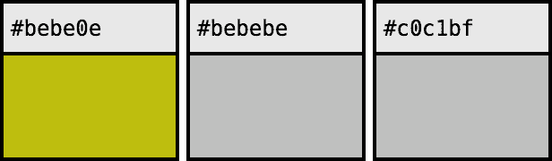
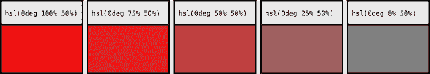
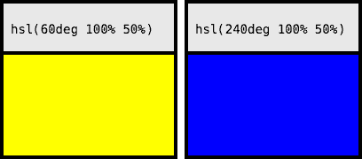
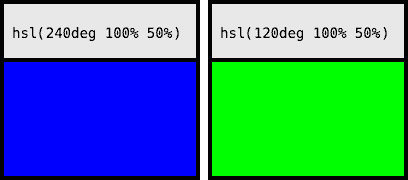
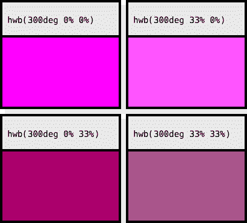
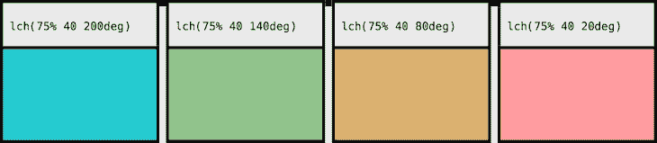
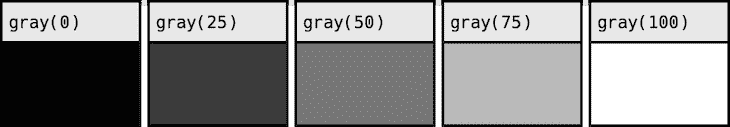

# CSS 中的颜色:现在和未来

> 原文：<https://blog.logrocket.com/colors-in-css-present-and-future/>

在 LogRocket 之前的一篇博文中，我介绍了 RGB 和 HSL 颜色模型以及如何操作它们的各种颜色属性。我没有机会介绍的一个方面是 CSS 即将推出的一些模型。这篇文章将概述所有的颜色模型，新的和旧的，这将是 [CSS 颜色模块级别 4](https://www.w3.org/TR/css-color-4/) 的一部分，它们的属性，以及它们可能有用的时候。

## RGB

RGB 是 CSS 的原始颜色模型。红、绿、蓝的缩写，RGB 模型是一个加色模型，这意味着该系统通过将彩色光加在一起产生新的颜色来工作。

例如，“纯”红色的红色值为`100%`，绿色和蓝色值为`0%`。“纯”黄色的红色和绿色值为`100%`，蓝色值为`0%`。在 CSS 中，RGB 符号可以用`rgb()`颜色函数或十六进制符号来表示:红色分别是`rgb(255 0 0)`或`#ff0000`。

你可以在看到一种颜色之前，通过阅读它的 RGB 成分，对它做出一些推断。例如，如果各个分量都相等，那么您就知道颜色是灰度的。所有数字越高，整体颜色越亮；相反，数字越低，颜色越深。

RGB 颜色模型有一些优点。其中最大的可能是它作为一种颜色符号是多么的无处不在。十六进制记数法尤其在许多设计工具中使用。另一个可能的优势是，RGB 模型类似于计算机对颜色的“思考”:显示器将不同颜色的光组合起来显示颜色。

RGB 也有一些缺点。首先，这不是一个非常清晰的系统。特别是在十六进制和“字节”大小的符号中(分别为`#ffffff`和`rgb(255, 255, 255)`)，这种格式是为计算机而不是人类设计的。颜色之间的关系尤其困难；人们可能很难一眼看出`#bebebe`与`#c0c1bf`几乎相同，但与`#bebe0e`截然不同。

什么时候用 RGB 才有意义？例如，当您希望以编程方式实时处理颜色时。您可以通过读取和操纵 RGB 像素来操纵 HTML5 canvas 的`ImageData`对象。因为这是画布共享其颜色信息的方式，所以当以编程方式操作它时，保持“靠近金属”可能是有意义的，特别是因为昂贵的函数在大图像或视频上会迅速增加。

您可能希望使用 RGB 的另一个原因是，如果您正在一个使用多种设计工具和平台的大型团队中工作。由于 RGB 的普遍存在，为了一致性起见，使用它可能是有意义的。

## high-speedlaunch 高速快艇

CSS3 中增加了 HSL 颜色功能。代表色调，饱和度，亮度，它旨在给出一个更直观的心理模型。

色调值对应于颜色在色轮上的位置，并表示为角度(通常为度)。饱和度值是指颜色强度的百分比。明度值是指颜色亮度的百分比。在 CSS 中，红色会被描绘成`hsl(0deg, 100%, 50%)`。

与 RGB 相比，HSL 是一个更直观的模型，尤其是在处理颜色操作时。如果你想使一个色调变亮或变暗，你只需要更新一个数字。颜色之间的关系变得更容易看到。

HSL 的最大问题之一是它如何处理亮度。HSL 亮度是相对于其基色的，而不是绝对值。例如，纯黄色(`hsl(60deg, 100%, 50%)`)和纯蓝色(`hsl(240deg, 100%, 50%)`)都有 50%的亮度，尽管蓝色看起来没有那么亮。

如果我们观察用 RGB 表示的同样两种颜色，分别是`rgb(100%, 100%, 0)`和`rgb(0%, 0%, 100%)`，我们会注意到黄色发出的物理光是两倍，因为红色和绿色通道都是 100%。

除了某些颜色在物理上比其他颜色发出更多的光之外，还有一个需要考虑的奇怪现象:人眼并不认为所有波长都一样亮。例如，绿色和蓝色都发出相同量的光，但是人眼感觉绿色比蓝色更亮。

在这篇文章的后面，我将介绍 HSL 亮度的一种替代方案。

由于 HSL 已经可以从 CSS3 开始使用，而且它比 RGB 更直观，我发现它是目前许多 web 项目的最佳解决方案。当创建和查看设计系统的调色板时，HSL 模型允许更容易地操纵颜色。尽管它在处理轻量级方面并不完美，但 HSL 在简单性和实用性之间取得了很好的平衡。

## HWB

现在，让我们来看看 CSS 颜色模块级别 4 中的一些模型！首先是彩色模特 HWB。HWB 是色调、白色、黑色的首字母缩写，是由计算机动画先驱、皮克斯的联合创始人之一阿尔维·雷·史密斯提出的一种颜色模型。

HWB 颜色模型是作为 HSL(和 HSV，本文其他地方没有提到它，因为它目前没有被考虑在 CSS 中实现)的替代物而创建的，它是为了简单而创建的。用史密斯的话说，你需要做的就是:“选择一种色调。用白色使它变亮。用黑色把它变暗。”

HWB 的色调和 HSL 一样。白度和黑度属性都指定为百分比。要减轻色调，请增加白度；若要使其变暗，请增加黑度。要降低颜色的饱和度，请增加白度和黑度。

如果这两个百分比相加超过 100 %,它就是一个灰色阴影，这两个属性被规范化为相加正好是 100%。例如，`hwb(0deg 75% 75%)`的阴影与`hwb(0deg 50% 50%)`相同。`hwb(0deg 25% 100%)`的阴影被归一化为`hwb(0deg 20% 80%)`。

如果归一化白度为 100%(因此归一化黑度为 0)，则颜色为纯白色。相反，100%的标准化黑度是纯黑色。

你会在哪里使用 HWB？由于其直观性，HWB 颜色模型对于用户输入的颜色工作良好。由于 HWB 的概念类似于调漆，因此非技术用户也能理解。

## 组织郎格罕细胞增生症

我们讨论了亮度的 HSL 版本的问题。另一种方法是使用采用[国际照明委员会(CIE)](http://cie.co.at/) 亮度等级的模型。它在两个方面不同于 HSL 模型。

首先，HSL 亮度是相对于它的基色的，而 CIE 亮度是一个绝对的模型。这意味着 CIE 亮度基于发射的光总量。其次，CIE 明度针对人眼对所有颜色的感知不同这一事实进行调整。总的来说，这意味着不同色调之间的 CIE 亮度被同等地感知。

LCH 是使用 CIE 亮度的颜色模型之一。它代表亮度，色度，色调。色度与饱和度相关，但有细微的不同。

国际照明委员会(CIE)对色度的定义是“一个区域的色度，根据类似照明区域呈现白色或高透射性的亮度比例来判断。”这被描绘成一个数字。根据 [CSS 规范](https://www.w3.org/TR/css-color-4/#specifying-lab-lch)，该值“理论上是无界的(但实际上不超过 230)。”

LCH 的色调与 HSL 的相似，但在感知上是一致的。如果您比较 HSL 和 LCH 色轮的采样，您会注意到某些颜色在 HSL 色轮中被过度采样。

LCH 系统的优点是什么？简短的回答是，如果你喜欢 HSL 颜色系统，但想使用一个更均匀亮度的模型，LCH 是一个很好的选择。

## 工党

另一个使用 CIE 亮度的模型是 Lab 颜色空间。 *L* 代表 CIE 亮度。 *a* 和 *b* 是两个颜色通道: *a* 代表绿色转红色轴， *b* 代表蓝色转黄色轴。这两个值都是正数或负数。如果两个值都是`0`，则颜色为灰色。

我个人认为 LCH 的圆柱形表示比实验室的更直观，因此，我想不出你会选择实验室而不是 LCH 的任何理由。如果您有任何想法或主意，请在下面添加您的评论！

## `gray()`

还有另一种专门用来表示灰度的函数符号。`gray()`功能符号仅接受 CIE 亮度参数。这个符号相当于将 *a* 和 *b* 参数都设置为`0`的 Lab。

如果你的主要颜色模型是 Lab 或 LCH，你可能想要使用`gray()`符号，但是你想要在你的代码中明确地指出颜色是灰色的阴影。

## 用于印刷的四分色

有一种颜色模型与其他颜色模型略有不同。虽然我们到目前为止讨论的所有其他颜色都是为屏幕设计的，但下一种颜色主要是为打印机设计的。

型号是 CMYK，代表青色、品红色、黄色、钥匙色(黑色)。与 RGB 相比，CMYK 模型更容易理解:就像 RGB 是加法模型一样，CMYK 是减法模型。RGB 通过增加光线来工作，CMYK 通过减少光线来工作——即添加吸收额外光线的颜料。

由于 CMYK 是为打印机设计的，所以它是一种设备相关的颜色模型。这意味着在 CMYK 和 RGB 颜色之间转换时，结果可能会因设备的物理特性而异。如果浏览器提供了颜色配置文件，它将用于转换。否则，会使用“简单”的转换。

此外，如果没有颜色配置文件，您可以使用`device-cmyk()`颜色功能。由于这些困难，W3C 编辑草案说“如果作者在他们的文档中使用任何 CMYK 颜色，建议他们在他们的文档中只使用 CMYK 颜色，以避免任何颜色匹配的困难。”

什么时候可能需要使用 CMYK 颜色模型？这非常简单:如果您正在创建打印样式表，CMYK 非常有用。否则，其他颜色的型号可能是更好的选择。

## 结论

这些颜色模型都给 CSS 带来了新的东西:CMYK 给出了一个以打印机为中心的模型；实验室、LCH 和`gray()`提供了更一致的亮度特性；HWB 带来了令人难以置信的直观界面。CSS 中颜色的未来是光明的。

## 你的前端是否占用了用户的 CPU？

随着 web 前端变得越来越复杂，资源贪婪的特性对浏览器的要求越来越高。如果您对监控和跟踪生产环境中所有用户的客户端 CPU 使用、内存使用等感兴趣，

[try LogRocket](https://lp.logrocket.com/blg/css-signup)

.

[https://logrocket.com/signup/](https://lp.logrocket.com/blg/css-signup)

LogRocket 就像是网络和移动应用的 DVR，记录你的网络应用或网站上发生的一切。您可以汇总和报告关键的前端性能指标，重放用户会话和应用程序状态，记录网络请求，并自动显示所有错误，而不是猜测问题发生的原因。

现代化您调试 web 和移动应用的方式— [开始免费监控](https://lp.logrocket.com/blg/css-signup)。