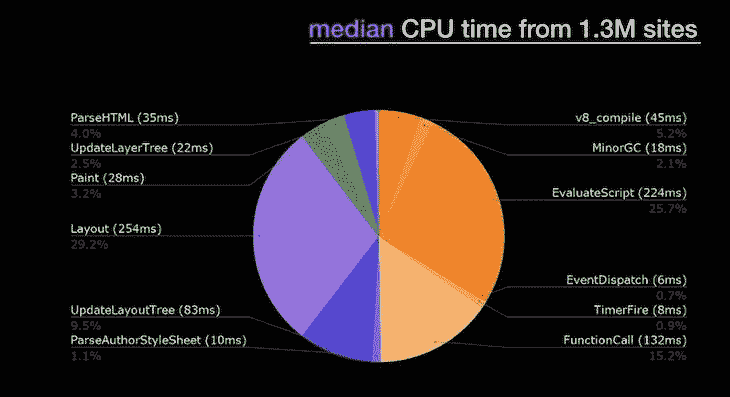
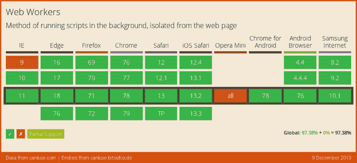

# Comlink 和 web workers:天作之合

> 原文：<https://blog.logrocket.com/comlink-web-workers-match-made-in-heaven/>

你知道吗，在过去的两年里，桌面平台上的网络用户加载了 19%多的 JavaScript 代码，而他们的移动用户在同一时间段内加载了 14%多的 JavaScript 代码。

根据 2018 年对大约 130 万个网站的分析，在设法加载这些脚本(希望是渐进的)之后，它们仍然需要被解析和执行——执行 JavaScript 代码占据了[高达 40%的 CPU 时间](https://www.youtube.com/watch?v=RwSlubTBnew&feature=youtu.be&t=1333)。



Courtesy Steve Souders’ presentation, linked above.

现在把移动网络扔进这个混合体中。由于较低的硬件价格，越来越多的人第一次上网，而且他们是在低功率的移动设备上上网的，这些设备在印度和 T2 等地的价格通常不到 200 美元。虽然今天越来越多的人开始联网，并可以轻松登陆您的 web 应用程序，但他们中的许多人都是在低端硬件上。

我知道我们在这里才刚刚开始，但是总的来说，我们正在发布更多的 JavaScript，并且要求 web 用户提供大量的 CPU 资源。更糟糕的是，大部分(如果不是全部的话)工作都是在 UI 线程上完成的，UI 线程是帮助用户与你的应用程序交互并完成任务的资源，因此降低了用户体验的优先级。

在这篇文章中，我们将讨论 web 工作者，他们解决的问题，以及在构建现代 web 应用程序时如何使用他们。我们将探索一种没有工人的用例的方法，并看看采用工人如何显著提高 UX 和性能。

然后，我们将重构我们的解决方案，使用 [Comlink](https://github.com/GoogleChromeLabs/comlink) ，这是一个相对较新的 JS 库，它使得与 web workers 一起工作就像简单地调用函数一样直观。是的，我们正在抛弃手动管理调用路由和有效载荷编组的精神负担，而没有 Comlink，你将需要这些。

最终，你会明白为什么 web workers 和 Comlink 是天作之合！

## 网络应用的现状

我们现代的网络应用变得越来越大，越来越复杂。我们经常将其归咎于这样一个事实，即这类应用程序几乎完全由 JavaScript 驱动——这意味着大量代码。

虽然使用代码分割和每页或每条路径加载包来构建 web 应用是一回事，但在 UI 线程上只运行 UI 代码很可能会对用户体验和许多 web 应用驱动的业务的底线产生最大的影响。

UI 线程(也称为主线程)应该用于 UI 工作，如布局、绘画、分派事件、从输入源(表单、相机等)捕获数据。)，并将数据呈现回 DOM。

像数据和对象操作、客户端逻辑(例如，验证、状态管理等。)，以及任何形式的与 UI 无关的工作——尤其是计算或内存密集型工作——都应该理想地生活在 web workers 中。

## 什么是网络工作者？

很有可能，你已经听说过网络工作者，你甚至可能知道他们是如何工作的，但是让我们回顾一下。 [web worker](https://developer.mozilla.org/en-US/docs/Web/API/Web_Workers_API/Using_web_workers) 是浏览器中的一种本地机制，它允许在单独的上下文或进程中后台并行执行 JavaScript 代码——实际上是一个单独的线程，不同于主线程(UI 线程)，主线程是浏览器中的默认代码执行线程。

网络工作者不同于服务工作者。它们更简单，已经存在很长时间了，并且在所有主流浏览器中都得到支持(大约 97%，根据我能使用吗… )。然而，我们今天仍然提倡 web workers，因为他们很少被使用，这意味着 web 开发人员通过尝试只在 UI 线程上执行代码而放弃了向他们的用户提供更好体验的机会。



对于这个探索，[我们的示例案例研究应用程序](https://chalu.github.io/comlink-workers/src/)允许用户在多行字段中输入自由形式的文本，并在用户仍在键入时尝试进行基本的文本分析。分析包括字符数、字数、最常用的单词和行数。为了模拟 CPU 密集型任务，分析管道还将结合一个受此示例启发的[复杂数学运算](https://gist.github.com/sqren/5083d73f184acae0c5b7)，这有助于随着输入单词数量的增加，整体文本分析变慢。

想象一下，一个 web 应用程序在用户仍在输入时进行这种文本分析，以便突出显示关于条目的元数据，并可能根据字数和正确的语法强制执行验证约束。

你必须在 Chrome Canary 上试用演示应用程序，因为它目前使用的是 worker 模块，而这种模块尚未在现代浏览器中发布。这不应该成为采用工人的障碍，因为 bundlers (webpack、Rollup 等。)为您提供了模块，如果您必须使用它们的话。我们的示例演示应用程序的完整代码在 Git [H](https://github.com/chalu/comlink-workers) [ub](https://github.com/chalu/comlink-workers) 上的[处。](https://github.com/chalu/comlink-workers)

## UI 线程上有太多代码工作(你现在可能正在做的事情)

让我们看看当所有代码都在 UI 线程上执行时，应用程序的行为如何，就像今天构建的大多数 web 一样。

```
analyzer.js
...

export const Analyzer = {
  analyzeText(text) {
    return analyze({ text });
  },

  async analyzeGrammar(text, callback) {
    const status = await checkGrammar(text);
    callback({ status });
  }
};
```

然后是使用上述代码的 HTML 文件:

```
import Analyzer from "../analyzer.js";

const takeOff = () => {
  const statsDisplays = [
    ...document.querySelectorAll("#statsplainer span")
  ];

  const inputElement = document.querySelector("textarea");
  inputElement.addEventListener("input", ({ target: field }) => {
    const text = field.value || "";
    if (text.trim() === "") return;

    const { stats } = Analyzer.analyzeText(text);
    requestAnimationFrame(() => {
      // update the UI
      statsDisplays[0].textContent = stats.chars;
      statsDisplays[1].textContent = stats.words;
      statsDisplays[2].textContent = stats.lines;
      statsDisplays[3].textContent = stats.mostUsed
        ? stats.mostUsed[0]
        : "N/A";
    });
  });
};
document.addEventListener("DOMContentLoaded", takeOff);
```

基本上，在页面加载并准备好之后，我们监听用户在`textarea`上的输入，对于每个输入变化(即有效的击键)，我们试图分析整个输入条目并取回分析的`stats`。然后我们在 UI 上显示分析的细节。

由于所有这些代码都是在 UI 线程上运行的，当用户继续在输入字段中输入时，他们开始注意到应用程序的迟缓和滞后。该应用程序很容易间歇性或完全冻结。在我的测试中，我确实目睹了整个页面陷入停顿，Chrome 发出可怕的“该页面没有响应”警告信息。

 [https://www.youtube.com/embed/lgZ6g4YNMKA?version=3&rel=1&showsearch=0&showinfo=1&iv_load_policy=1&fs=1&hl=en-US&autohide=2&wmode=transparent](https://www.youtube.com/embed/lgZ6g4YNMKA?version=3&rel=1&showsearch=0&showinfo=1&iv_load_policy=1&fs=1&hl=en-US&autohide=2&wmode=transparent)

视频

虽然您可能没有找到质数、挖掘加密货币、计算密码哈希或执行其他类似的、可能导致页面冻结的过于昂贵的任务，但您可能仍然做了太多事情，并且在应该做的时候没有退回到 UI 线程。

您可能在短时间内做了太多事情(回想一下低端硬件上的用户)，以至于用户(仍在尝试点击或滚动)会注意到响应速度明显滞后，因为 UI 线程没有喘息的空间。

根据 [RAIL 预算](https://developers.google.com/web/fundamentals/performance/rail)，用户会注意到任何占用 UI 线程超过 100ms 的工作！在这段时间内屈服于浏览器，或者根本不中断 UI 线程，是我们最终想要实现的。

## 切换到网络工作者

将我们的示例代码切换到一个 web worker 是非常琐碎的，这可能不是您的里程数——特别是对于大型的、预先存在的代码库——但即使这样也可以逐步完成。让我们仍然从我们的示例应用程序过于简化的层面来处理事情。

一旦将非 UI JavaScript 代码放在单独的文件中，就可以通过将非 UI JavaScript 文件路径传递给 web worker 构造函数来启动 web worker。worker 文件所需的任何附加脚本都可以用内置的`importScripts`函数加载，它既适用于本地 JavaScript 文件，也适用于像从 unpkg.com 加载的那些外部文件。

用`importScripts`加载额外代码的一个缺点是，您会失去从文件中加载所需内容的好处，就像 ES 模块一样。您可以使用模块语法来更好地将代码加载到 web worker 中，但是您必须首先用选项对象中的设置为`module`的`type`实例化您的 web worker ，这是构造 worker 时需要的第二个参数。

不过，浏览器对此的支持仍然有限:

```
const worker = new Worker("./webworker.js", { type: "module" });
```

专用 web worker(只能由创建它的页面或脚本控制)然后能够与父页面通信，反之亦然，通过使用`postMessage`函数发送数据，并通过侦听`message`事件接收数据。这两个调用都将接收一个事件对象，您的数据可以从它的 data 属性中访问。

```
// In the worker:
self.postMessage(someObject);

// In the main thread:
worker.addEventListener('message', msg => console.log(msg.data));
```

我们的应用程序确实做到了我们上面所描述的，下面的代码片段展示了如何做到:

```
// webworker.js

import { Analyzer } from "../analyzer.js";

self.addEventListener("message", ({ data }) => {
  const { stats } = Analyzer.analyzeText(data);
  self.postMessage({ stats });
});
```

```
// index.html

const takeOff = () => {
  const worker = new Worker("./webworker.js", { type: "module" });
  worker.addEventListener("message", ({ data }) => {
    const { stats } = data;
    requestAnimationFrame(() => {
      // update UI
    });
  });

  const inputElement = document.querySelector("textarea");
  inputElement.addEventListener("input", ({ target: field }) => {
    const text = field.value || "";
    if (text.trim() === "") return;

    worker.postMessage(text);
  });
};
document.addEventListener("DOMContentLoaded", takeOff);
```

平心而论，使用 web workers 并不一定意味着你的代码运行得更快；事实上，您可能正在卸载如此多的工作(例如，解析大型 CSV 或 JSON 数据),以至于不知道这些任务还要多久才能完成。

* * *

### 更多来自 LogRocket 的精彩文章:

* * *

它所保证的是你的 UI 线程是自由的，并保持响应。您也不希望在 UI 线程上从 worker 转储巨大的渲染请求。有了正确的设计，您可以快速地将来自工作人员的更新呈现到 UI，然后成批地引入更多的更新。

这还不是全部，因为在现实生活中使用 web workers 的情况往往更多。尽管 web workers 很简单，并且有强大的浏览器支持，但是管理起来可能很麻烦，尤其是必须弄清楚如何在一个 worker 中执行正确的代码，而这些代码仅仅来自于你用`postMessage`发送给它的数据。

这些往往要用笨拙的`if`或`switch`语句来处理，并且需要使用 web worker 与代码中几乎相同的结构保持同步。

```
// worker.js

self.addEventListener("message", ({ data }) => {
  let result = {};
  if(data.command === "ACTION_1") {
    result = actionOne(data);
  } else if(data.command === "ACTION_2") {
    result = actionTwo(data);
  } else if(data.command === "...") {
    ...
  } else if(data.command === "ACTION_50") {
    result = actionFifty(data);
  }

  self.postMessage(result);
});
```

由于捆绑器、代码分割和按需资源加载，您有机会不必将应用程序需要做的所有事情预先加载到一个 JavaScript 文件中，然后作为一个工作器运行。

见鬼，在构建 worker 时，您甚至可能没有完整的代码，因此必须有一种方法将新代码和处理逻辑吸收到现有的 worker 中，或者构建新的 worker，然后将它们作为共享的 worker 进行管理。

许多人认为这些问题阻碍了网络工作者的使用和采用，而 Comlink 在这里用一些魔法让事情变得更好！

## 务实一点:离开 Comlink 的主线

为了与另一个线程通信，web workers 提供了`postMessage` API。您可以使用`myWorker.postMessage(someObject)`将 JavaScript 对象作为消息发送，在 worker 内部触发一个`message`事件。

Comlink 通过提供 RPC 实现将这种基于消息的 API 变成了对开发人员更友好的东西:来自一个线程的值可以在另一个线程中使用(反之亦然)，就像本地值一样。

您所需要做的就是用 Comlink 从主线程中公开您想要直接调用的 worker 的方面。为了完成双向通信设置，您还将使用 Comlink 在主线程中包装 worker。

这使您能够从主线程调用 worker 中声明的函数或方法，就像它们是本地的一样，Comlink 将自动处理调用路由和数据传输。不再干预`postMessage`或进入`event`对象来路由代码或提取数据！

让我们看看这种方法在我们的示例应用程序中的位置:

```
// analyzer.js
// Analyzer "API"

export const Analyzer = {
  analyzeText(text) {
    return analyze({ text });
  },

  async analyzeGrammar(text, callback) {
    const status = await checkGrammar(text);
    callback({ status });
  }
};
export default Analyzer;
```

```
// webworker.js

import { expose } from "https://unpkg.com/[email protected]/dist/esm/comlink.mjs";
import { Analyzer } from "../analyzer.js";

// expose the Analyzer "API" with Comlink
expose(Analyzer);
```

```
// main thread javascript

import * as Comlink from "https://unpkg.com/[email protected]/dist/esm/comlink.mjs";

const takeOff = () => {
  ...
  const Analyzer = Comlink.wrap(
    new Worker("./webworker.js", {type: 'module'})
  );
  ...
  const inputElement = document.querySelector("textarea");
  inputElement.addEventListener("input", async ({ target: field }) => {
    const text = field.value || "";
    if (text.trim() === "") return;

    const { stats } = await Analyzer.analyzeText(text);
    requestAnimationFrame(() => {
      // update UI with stats
    });
  });
};
document.addEventListener("DOMContentLoaded", takeOff);
```

由于我们在另一个文件中有我们的`Analyzer`，我们将它导入到我们的 web worker 中，并使用 Comlink 来`expose`分析器 API。在主线程脚本中，我们同样使用 Comlink 来`wrap`web worker，并将对返回的包装对象的引用存储为`Analyzer`。

我们故意让返回的包装对象和公开的 API 共享相同的名称，以便客户端代码(使用 web worker 的主线程代码)可以很容易地看起来像 Comlink 不存在于组合中。你没必要这么做。

完成所有这些设置后，我们可以直接调用在 Analyzer API 中声明并由 Comlink 公开的`analyzeText()`函数。

```
...
const { stats } = await Analyzer.analyzeText(text);
...
```

在上面的代码片段中，`Analyzer`是我们实际的分析器 API 的代理，这个代理由 Comlink 创建和处理。

## 用 Comlink 将函数作为数据处理

从上面的代码中，当我们调用`Analyzer.analyzeText(text)`时，Comlink 能够将`text`数据传输给 worker，因为它是一个 JavaScript 值或对象，并且可以用[结构化克隆算法](https://developer.mozilla.org/en-US/docs/Web/API/Web_Workers_API/Structured_clone_algorithm)复制。

这适用于值和对象，但不适用于函数。回想一下，JavaScript 中的函数是一等公民，可以用作参数或从调用中返回，这就是为什么它们被用作其他函数的回调。这意味着如果上面代码中的`text`参数是一个用作回调的函数，它将不会被复制到 worker，因为结构化克隆算法将无法处理它。

在这里，Comlink 再次为我们实现了！我们需要做的就是用`Comlink.proxy()`包装这样的回调函数，并提供它的返回值(代理)作为回调。这个代理值可以像其他 JavaScript 值和对象一样进行传输。

我们的示例应用程序中的分析器 API 有一个`analyzeGrammar`函数，它不会立即返回，因为它执行异步工作，检查文本的语法和拼写错误。它期待一个回调，当准备好的时候，它可以用异步分析的结果调用这个回调。我们用`Comlink.proxy()`包装了这个回调。

```
// Analyzer API exposed by Comlink
...
async analyzeGrammar(text, callback) {
    const status = await checkGrammar(text);
    callback({ status });
}
```

```
// main thread code
...
const grammarChecked = ({ status }) => {};
inputElement.addEventListener("input", async ({ target: field }) => {
    const text = field.value || "";
    if (text.trim() === "") return;

    ...
    await Analyzer.analyzeGrammar(text, Comlink.proxy(grammarChecked));
});
```

实际上，当 worker 中的`analyzeGrammar`函数调用`callback({ status })`时，我们在主线程中的`grammarChecked`函数将被调用，并且 Comlink 为我们处理所有的管道工作。神奇！

Comlink 有更多的方法来使我们的工作更加直观和高效，包括让您通过传输而不是复制来发送大数据，这是正常的行为，因为默认情况下使用结构化克隆算法。然而，转移数据而不是复制数据超出了本文的范围。

## 您的业务和状态管理逻辑不属于主线程

为了让用户界面在使用过程中保持响应，用户界面线程不应该做非用户界面的工作，状态管理——包括隐藏在其中的应用程序的所有业务逻辑——应该脱离主线程。这与我们的分析器目前用 Comlink 设置的方式没有什么不同。

以下是实现离岸状态管理的一些步骤:

*   在 JavaScript 文件中声明您的动作、归约器和状态管理逻辑
*   将必要的文件和 Comlink 导入 web worker
*   使用 Comlink，公开一个 API 对象，该对象定义了一个与状态管理逻辑交互的接口
*   在主线程侧:
    *   导入您的状态操作并使用 Comlink 来包装 web worker
    *   声明订阅存储区并在状态改变时被调用的回调函数
    *   通过分派正确的状态动作来响应用户动作

```
// actions.js
const Actions = {
  ANALYZETEXT: "ANALYZETEXT",
  ANALYZEGRAMMAR: "ANALYZEGRAMMAR"
};
export default Actions;

// store.webworker.js
import { expose, proxy } from "https://unpkg.com/.../comlink.mjs";
import { createStore } from "https://unpkg.com/.../redux.mjs";
import { Analyzer } from "../../analyzer.js";
import Actions from "./actions.js";

const initialState = {
  stats: {
    text: "",
    chars: 0,
    words: 0,
    lines: 0,
    mostUsed: []
  }
};

const handleAnalyzeAction = (state, text) => {
  const { stats } = Analyzer.analyzeText(text);
  return { ...state, ...{ stats } };
};

const reducer = (state = initialState, { type, text }) => {
  switch (type) {
    case Actions.ANALYZETEXT:
      return handleAnalyzeAction(state, text);
    default:
      return state;
  }
};

const subscribers = new Map();
const store = createStore(reducer);

const broadcastChanges = async () => {
  await store.getState();
  subscribers.forEach(fn => fn());
};
store.subscribe(proxy(broadcastChanges));

// state management interface to expose
// the main thread will call functions in 
// this object and state management will happen
// in this worker
const StateMngr = {
  getState() {
    return store.getState();
  },
  dispatch(action) {
    store.dispatch(action);
  },
  subscribe(fn) {
    subscribers.set(subscribers.size, fn);
  }
};
expose(StateMngr);
```

现在是主线程客户端代码:

```
import * as Comlink from "https://unpkg.com/..../comlink.mjs";
import Actions from "./actions.js";

const initApp = async () => {
    ...
    const StateMngr = Comlink.wrap(
        new Worker("./store.webworker.js", { type: "module" })
    );

    // callback function called
    // when there are state changes
    const stateChanged = async () => {
        const { stats } = await StateMngr.getState();

        // In a typical reactive app, this will be 
        // handled by the render() mechanism automatically
        requestAnimationFrame(() => {
            // update the UI
        });
    };

    // wire up the callback setup a subscription for it
    StateMngr.subscribe(Comlink.proxy(stateChanged));
    const inputElement = document.querySelector("textarea");
    inputElement.addEventListener("input", async ({ target: field }) => {
        const text = field.value || "";
        if (text.trim() === "") return;

        // dispatch an action
        await StateMngr.dispatch({ type: Actions.ANALYZETEXT, text });
    });
};
document.addEventListener("DOMContentLoaded", initApp);
```

在本帖中，有一个类似的`remoteStore`例子，方法与上面的略有不同。然而，您可能还想知道如何使用所有这些设置来处理动态动作和 reducers。这超出了本文的范围，但是我将更新我们的[示例应用程序代码库](https://github.com/chalu/comlink-workers)，以包括一个这样的例子。

## Comlink 也支持服务人员

你可能会问，服务人员呢？随着企业在 PWAs 上取得成功，服务人员准备好推动类似后台同步和离线功能的出色体验，您很有可能希望您的服务人员与主线程的关系受益于 Comlink 带来的直觉。你会得到很好的照顾。

我们可能采取的与您的常规服务人员不同的主要措施有:

*   在主线程上:
    *   创建一个双向消息通道，并记下它的两个通信端口
    *   向服务人员发送“握手”消息(包含其中一个端口),我们准备好与它进行通信
    *   使用 Comlink 封装第二个通信端口
*   在维修工人中:
    *   监听“握手”消息，并使用 Comlink 在其获得的端口上公开您的“API”接口

```
// sw.js
importScripts("https://unpkg.com/[email protected]/dist/umd/comlink.js");
importScripts("./sw.analyzer.js");

addEventListener("install", () => self.skipWaiting());
addEventListener("activate", () => self.clients.claim());

addEventListener("message", ({ data }) => {
  // expose the Analyzer "API" when
  // we hear from the ui-thread that
  // it is ready to interact with this
  // ServiceWorker
  if (data.isHandshake === true) {
    Comlink.expose(Analyzer, data.port);
  }
});
```

```
// main-thread script
import * as Comlink from "https://unpkg.com/[email protected]/dist/esm/comlink.mjs";
...
let Analyzer;
const grammarChecked = ({ status }) => {};

const inputElement = document.querySelector("textarea");
inputElement.addEventListener("input", async ({ target: field }) => {
    const text = field.value || "";
    if (text.trim() === "" || !Analyzer) return;

    const { stats } = await Analyzer.analyzeText(text);
    requestAnimationFrame(() => {
        // update UI
    });
    await Analyzer.analyzeGrammar(text, Comlink.proxy(grammarChecked));
});

const initComlink = async () => {
    const { port1, port2 } = new MessageChannel();
    const initMsg = { isHandshake: true, port: port1 };

    // tell the ServiceWorker that we are ready to roll
    navigator.serviceWorker.controller.postMessage(initMsg, [port1]);
    Analyzer = Comlink.wrap(port2);
};

const initApp = async () => {
    ...
    if ("serviceWorker" in navigator) {
        if (navigator.serviceWorker.controller) {
            initComlink();
        } else {
            navigator.serviceWorker.oncontrollerchange = function() {
                this.controller.onstatechange = function() {
                    if (this.state === "activated") {
                        initComlink();
                    }
                };
            };
            navigator.serviceWorker.register("./sw.js", {
                scope: location.pathname
            });
        }
    }
};
document.addEventListener("DOMContentLoaded", initApp);
```

在服务人员设置和握手完成后，我们能够在用户输入`textarea`时调用`await Analyzer.analyzeText(text)`，尽管`Analyzer.analyzeText()`功能可能完全存在于服务人员中。

注意在对`Analyzer.analyzeGrammar(...)`的调用中，如何使用`Comlink.proxy(grammarChecked)`将`grammarChecked()`函数设置为回调函数。如前一节所述，当您希望使用 Comlink 使您的服务工作器能够调用主线程函数作为回调来响应服务工作器中发生的异步工作时，这是非常方便的。

## 结论

Web workers 非常强大，如果我们利用他们来处理设计用于 Web 的 JavaScript 代码，可以显著改善应用程序用户的体验，这些代码可以归结为大多数非 UI 代码。

Web workers 在浏览器中得到了很好的支持，但是它们的采用和使用却很差，这可能是因为在与 workers 通信的主要方式`postMessage`上覆盖任何非平凡的架构是多么的麻烦。

Comlink 允许你从工作线程中公开对象和函数，这样你就可以直接从主线程中调用它们，保护你不受`postMessage`的影响。当工作线程中的异步任务完成时，您甚至可以调用主线程函数作为回调函数。

尽管我们在本文中主要关注 web workers 和 service workers，但 Comlink 也支持 WebRTC 和 WebSockets。

许多网络用户使用慢速网络和低端设备。Comlink 将帮助您利用 web 技术，为更多的 web 应用程序用户提供出色的体验。

## 考虑和进一步阅读

1.  在撰写本文时，[跨浏览器的 workers 中还没有 ES 模块支持](https://stackoverflow.com/questions/44118600/web-workers-how-to-import-modules)。Chrome 取得了最大的进展，目前正处于实验阶段，我相信它会和 Chrome 80 一起发布。现在，你可以使用`importScripts`或者在 Chrome Canary 上测试你的应用程序！
2.  [React + Redux + Comlink =脱离主线程](https://dassur.ma/things/react-redux-comlink/)
3.  邮件发送很慢吗？
4.  [可转移物体:快如闪电！](https://developers.google.com/web/updates/2011/12/Transferable-Objects-Lightning-Fast)