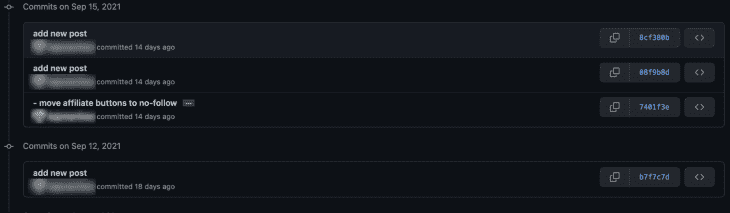

# Commitlint:写更有条理的代码日志博客

> 原文：<https://blog.logrocket.com/commitlint-write-more-organized-code/>

作为开发人员，我们经常会跳入现有的项目——有时是大型代码库——来修复一个 bug 或开发一个新功能。我们通常从浏览源代码开始，以了解它是如何构建的，以及应用程序中的组件是如何相互交互的。

但是，即使我们找到了错误发生的确切位置，也可能不清楚问题的正确解决方案是什么，或者它最初是如何出现的。

幸运的是，有一个叫做 [Git](https://blog.logrocket.com/the-git-workflow-you-need-how-to-deal-with-multiple-teams-in-a-single-repository-faf5bb17a6e4/) 的工具，当正确使用时，它可以调查谁以及为什么特定代码被更改或添加。但是，如果您的经历和我一样，那么当您访问项目的 Git 历史记录时，您可能会发现如下内容:



不是很有帮助，对吧？不可能确定哪个提交与我们相关，因为所有的描述都是相同的或者不是描述性的。

这个能修好吗？让我们讨论一下 commitlint 是如何拯救世界的。

## 什么是 commitlint？

[提交列表](https://github.com/conventional-changelog/commitlint)是您提交消息的[列表](https://eslint.org/)。它根据预定义的提交格式对任何文本执行验证。用户可以根据自己的需要配置这些格式，或者采用预先内置的约定，比如[常规提交](https://www.conventionalcommits.org/en/v1.0.0/)。

因为该工具可以通过[管道](https://opensource.com/article/18/8/introduction-pipes-linux)传输到其他流程的输出，所以通过在提交更改、推送或使用任何其他 Git 挂钩之前验证消息，它可以很容易地与您的开发工作流集成。

在学习如何设置之前，让我们先来看看它的运行情况:


## 正在安装 commitlist

Commitlint 很容易为 npm 或 Yarn 项目设置。让我们从作为开发依赖项安装该工具开始。

因为我们将使用默认配置，所以我们需要安装两个不同的 commitlint 模块、CLI 工具和实际配置。从您的终端运行:

```
npm install --save-dev @commitlint/{cli,config-conventional}
```

或者，使用纱线:

```
yarn add @commitlint/{cli,config-conventional} --dev
```

最后，您需要用您的配置选项创建一个`commitlint.config.js`文件。为此，您可以在终端中执行以下命令:

```
echo "module.exports = { extends: ['@commitlint/config-conventional'] };" > commitlint.config.js
```

## 用 commitlist 设置 git 挂钩

为了在每个 Git 提交命令上自动运行提交消息验证，我们将使用 [Husky](https://blog.logrocket.com/configuring-git-hooks-for-the-win/) ，这是一个使我们能够快速设置 Git 挂钩的工具。

这非常简单，所以让我们直接进入命令:

### 使用 npm

安装 Husky

```
npm install husky --save-dev
```

激活挂钩

```
npx husky install
```

添加提交消息挂钩

```
npx husky add .husky/commit-msg 'npx --no-install commitlint --edit $1'
```

### 用纱线

安装 Husky

```
yarn add husky --dev
```

激活挂钩

```
yarn husky install
```

添加提交消息挂钩

```
yarn husky add .husky/commit-msg 'yarn commitlint --edit $1'
```

现在一切都设置好了，我们可以尝试用无效的文本格式提交，看看会发生什么:

```
~ git commit -m "commit"

⧗ input: commit

✖ subject may not be empty [subject-empty]

✖ type may not be empty [type-empty]

✖ found 2 problems, 0 warnings

ⓘ Get help: https://github.com/conventional-changelog/commitlint/#what-is-commitlint
```

很明显，commitlint 拒绝了“提交”消息。我们也知道原因，所以让我们修正我们的消息，看看结果:

```
~ git commit -m "chore: add commitlint on commit-msg"

[master (root-commit) e0f064f] chore: add commitlint on commit-msg

5 files changed, 3412 insertions(+)

create mode 100644 .gitignore

create mode 100755 .husky/commit-msg

create mode 100644 commitlint.config.js

create mode 100644 package-lock.json

create mode 100644 package.json

```

当消息满足标准时，commit 命令继续其工作流并存储更改。

都搞定了。Commitlint 现在正在验证您的所有提交消息，并帮助您增强提交历史记录。现在让我们讨论默认约定以及如何编写高质量的提交消息。

## 编写提交消息

让我们暂时离开技术领域，专注于编写——更准确地说，如何编写好的不言自明的提交消息，并通过 commitlint 默认验证。

一个好的典型提交消息将具有以下结构:

```
<type>(<scope?>): <subject!>
<BLANK LINE>
<body?>
<BLANK LINE>
<footer?>

```

我来[解释一下各个部分](https://github.com/angular/angular/blob/22b96b9/CONTRIBUTING.md#-commit-message-guidelines)。

### 类型

`type`是强制性的，决定了改变的意图。以下是可能的值:

*   `build`:影响构建系统或外部依赖的变更
*   `ci`:更新持续集成和部署服务的配置文件
*   `chore`:更新打杂任务等。；没有生产代码变更
*   `docs`:仅文档变更
*   新功能
*   一个错误修复
*   `perf`:提高性能的代码更改
*   一个既没有修复 bug 也没有增加特性的代码变化
*   `style`:不影响代码含义的更改(空白、格式、缺少分号等)。)
*   `test`:添加缺失的测试或修正现有的测试

### 范围

范围是一个可选值，它提供了关于变更的附加上下文信息。例如，当模块名、npm 包或特定例程受到影响时。

范围(如果存在)必须包含在括号内。

### 科目

主题是提交的标题。它应该用一句话概括变化的本质。

* * *

### 更多来自 LogRocket 的精彩文章:

* * *

对于主题，请考虑以下规则:

*   使用命令式现在时:“改变”，而不是“改变”或“变化”
*   第一个字母不要大写
*   没有点(。)在最后

### 身体

正文是一个可选的空间，用于提供有关变更、变更动机和所做工作的附加信息。正如主语的情况一样，正文是用现在时态写的。

### 页脚

最后，页脚是参考信息的可选占位符，例如，重大变更警报或参考编号或参考文献。

突破性改变应该以单词“突破性改变”开始，并带有空格或两个换行符。

## 好的提交消息的例子

首先，让我们看看我创建的一些示例:

示例 1:

```
feat(payment): add a new endpoint to calculate taxes

This allows the payment module to calculate taxes for an order based on the order information. Currently only US sales tax and European VAT are supported

Refs #45621

```

示例 2:

```
build(docs-infra): regenerate docs after deployment pipeline completes

Automates the process of building the documentation portal after changes are merged into develop, release and master branches.overloads.
PR Close #43614

```

以下是来自 GitHub 的一些其他[优秀例子:](https://github.com/angular/angular/commits/master)

示例 1:

```
fix(bazel): construct a manifest file even when warnings are emitted

Previously if _any_ diagnostics were emitted, regardless of their category, the manifest would not be generated. This means that if a target emits only warnings and no errors, it would still fail to build because it does not generate all the required output files (specifically the `.es5.MF` file). Now the manifest file is generated as long as there are no error diagnostics in the result. This makes `ng_module()` support compiler warnings as a user would expect.

Added a test that uses extended template diagnostics to trigger the invalid banana in box diagnostic. This generates a warning and uses Skylib's `build_test()` to verify that it builds successfully. Unfortunately, there is no easy way to verify that the warning diagnostic is emitted at all. `expected_diagnostics` should be able to do that, but it doesn't seem to have any effect on `ng_module()` and may not be integrated. Instead, testing that a target with warnings builds correctly is the best we can easily do here without a deeper investigation.

PR Close #43582

```

示例 2:

```
docs: reviewed tag added (#43472)

PR Close #43472

```

示例 3:

```
test(router): refactor tests to not use deprecated loadChildren (#43578)

Many of the tests in the router code use the deprecated loadChildren as a string. This
has been deprecated for years and can easily be changed to just a function that
returns the module.

PR Close #43578

```

## 结论

开发人员不喜欢在格式化文本这样的琐碎任务上花费时间。这就是为什么他们建立了惊人的自动化工具，如 ESLint、Prettier 和现在的 commit lint——让他们的生活更轻松。更重要的是，他们构建这些工具是因为他们知道拥有良好格式化和标准化的代码和消息的价值。

为了它给你、你的项目和你的组织带来的价值，你会在这个自动化和过程上投入时间吗？我当然愿意！

ESLint 和 beauty 已经是我们生活的一部分了。让我们欢迎 commitlint 加入开发人员生产力工具家族。

感谢阅读！

## 使用 [LogRocket](https://lp.logrocket.com/blg/signup) 消除传统错误报告的干扰

[](https://lp.logrocket.com/blg/signup)

[LogRocket](https://lp.logrocket.com/blg/signup) 是一个数字体验分析解决方案，它可以保护您免受数百个假阳性错误警报的影响，只针对几个真正重要的项目。LogRocket 会告诉您应用程序中实际影响用户的最具影响力的 bug 和 UX 问题。

然后，使用具有深层技术遥测的会话重放来确切地查看用户看到了什么以及是什么导致了问题，就像你在他们身后看一样。

LogRocket 自动聚合客户端错误、JS 异常、前端性能指标和用户交互。然后 LogRocket 使用机器学习来告诉你哪些问题正在影响大多数用户，并提供你需要修复它的上下文。

关注重要的 bug—[今天就试试 LogRocket】。](https://lp.logrocket.com/blg/signup-issue-free)