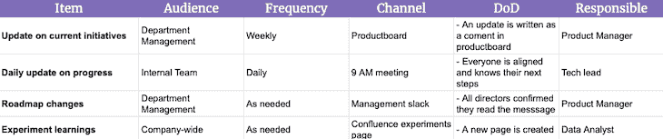

# 如何撰写沟通计划(带模板和示例)

> 原文：<https://blog.logrocket.com/product-management/communication-plan-examples-template/>

沟通是产品经理的主要职责之一。毕竟，如果没有有效地沟通风险、依赖性和变更，项目经理就无法完成他们的工作。

在小公司里，交流更加直观，也更容易管理。随着公司的发展，问题开始出现。

一个更大的公司意味着更多的团队，更多的利益相关者，更多的主动性，以及更多的一切。除了扩大规模，沟通往往变得太混乱或太不频繁。

在这种情况下，有一个强大的沟通计划可以拯救生命。在本指南中，我们将通过六个简单的步骤演示如何撰写沟通计划。您还可以使用我们免费的[沟通计划模板](https://docs.google.com/spreadsheets/d/18zsSHqWvluRuDN2nGeuWUvdoiC7ApotSQA6be1J0Opg/edit#gid=1935668551)，其中包含供您填写的空白电子表格和帮助您开始的实用示例。

* * *

## 目录

* * *

## 什么是沟通计划？

沟通计划是一个可检查的工件，它描述了必须传达什么信息，以及传达给谁、由谁、何时、何地以及通过什么媒介传达信息。此外，沟通计划概述了如何跟踪和分析沟通。

沟通计划可以采取多种形式。例如，它可能采用(n)的形式:

*   每周清单
*   试算表
*   自动特雷罗板

一般来说，沟通计划应该是对你和你的团队有用的，只要它允许你检查和调整你与他人沟通的方法。

## 沟通计划的好处

在创建和维护沟通计划上投入时间会带来许多好处。沟通计划的作用是:

### 清单和提醒

谁没有忘记将最近的变化/发现告知一些关键的利益相关者？

产品管理是一个快节奏和充满活力的职业，很容易忽略一些小细节。不幸的是，这些小细节往往是最重要的。

一份书面的沟通计划可以作为一份清单，确保微小的细节不会经常遗漏。每当有相关的事情发生时，你可以很容易地参考你的沟通计划，仔细检查你是否与每个需要了解情况的人联系上了。

### 可检查的人工制品

有形的沟通计划允许产品经理放慢速度，检查和调整他们当前的流程。

每当出现沟通失误时，他们可以回顾导致失误的原因，并调整沟通方式。一个具体的计划使“沟通”这样一个模糊的、有时令人生畏的术语变得更加具体。

### 与利益相关方保持一致

一个沟通计划，如果做得好，会带来一致性并促进其他利益相关者的投入。它还列出了对如何处理和执行沟通的期望。

如果利益相关者认为他们没有获得所有相关信息，他们可以快速检查沟通计划，看看他们错过了什么，以及沟通过程中缺少什么导致他们错过了这些信息。如果他们发现沟通不充分，他们可以与沟通计划负责人分享他们的反馈。

当一些东西写在纸上时，更容易促进反馈和协调。

## 如何用 6 个步骤创建沟通计划

如上所述，创建沟通计划有多种方法。

撰写沟通计划的一个简单方法是回答六个问题:

1.  您会产生什么类型的信息？
2.  谁应该收到这些信息？
3.  他们应该多久收到一次？
4.  什么渠道最适合这类信息？
5.  此类信息的沟通何时完成？
6.  谁应该确保它发生？

### 1.你生产什么类型的信息？

从回顾你产生和处理的信息开始。

如果您管理[路线图](https://blog.logrocket.com/product-management/what-is-a-product-roadmap-templates/)，您可能会产生许多关于路线图变更、延迟以及其他任何可能与路线图相关的信息。

如果您管理发布，您还可以生成关于发布进度、阶段以及任何其他与发布相关的信息。

全部捕捉。

* * *

订阅我们的产品管理简讯
将此类文章发送到您的收件箱

* * *

为了使它更容易，从更广泛、更一般的概念开始。如果你注意到需要更精确，把它们分成更详细的交流位置。

### 2.谁应该接收该信息？

对于您生产或处理的给定类型的信息，谁应该接收它？这些人通常是:

*   直接利益相关者
*   取决于该计划
*   为倡议做出贡献

花些时间定义收据有两个主要好处。

首先，它确保你不会错过你的沟通流程中的关键人物，但它也有助于你回答谁对某些信息不感兴趣的问题。过度沟通会产生噪音，应该避免。

### 3.他们应该多久收到一次？

您应该根据共享的信息和包括的利益相关者来确定发送更新的频率。应该是每天，每周，每两周，每月？

一开始你可能不会把它钉死，但没关系。重要的是在过度沟通和沟通不足之间寻找一个平衡点。

尽管乍一看似乎有些过分，但随着交流的数量和需求的增长，找到正确的平衡将变得越来越重要。

### 4.什么渠道最适合这类信息？

哪种媒体最适合给定类型的信息？

例如，在吉拉票据下的评论中告知某人关于任务关键的依赖性是愚蠢的。与此同时，你不应该用每一个微小的变化来浪费别人的时间。

在发送更新之前，问问自己:

*   人们会在哪里寻找这样的信息？
*   它应该多快到达观众手中？
*   有多关键？
*   是单方面的更新还是潜在的对话引子？

这些问题的答案将帮助你找到获取给定信息的最佳渠道。

### 5.这类信息的沟通何时完成？

很多人陷入概念陷阱，认为一旦你发出信息，你的沟通责任就结束了。情况并非总是如此。

如果你发送一个全公司范围的参考性更新，那么是的，当你按下发送时，你的工作可能已经完成，但是如果你有影响多个团队的路线图变更呢？你不是应该确保那些团队的每个人都知道吗？

在这种情况下，你不能仅仅因为你发出了一个信息就说你完成了。你应该追踪所有关键利益相关者，确保他们已经阅读并理解你的信息，以避免任何误解。

让我们面对现实吧:消息有时会走漏。你的工作不是发送信息，而是确保每个人都在同一页上。这不是一回事。

我喜欢用简单的[来定义沟通项目的完成](https://blog.logrocket.com/product-management/what-is-definition-of-done-agile-examples/)。有时候，这只是意味着推一个更新。其他时候，这可能意味着获得另一个利益相关者的认可签名。

### 6.谁应该让它发生？

最后但同样重要的是，如果确保沟通是每个人的责任，那就不是任何人的责任。

尽管整个团队都应该负责确保有效的沟通，但我相信对于给定的沟通流应该有一个专门的负责人。所有者可以是永久的，也可以在每次冲刺时轮换。

如果你有沟通负责人，沟通实际发生的机会就会大大增加。

## 沟通计划示例

让我们来看一个使用我刚刚概述的框架创建的沟通计划的示例:

这个沟通计划现在可以作为调整、过程改进和复查的工件，如果一切都按照需要进行了沟通的话。

因为沟通计划中的一些项目是根据需要发生的，所以定期审查工件是必要的。否则，迟早会出现细节问题。

## 沟通计划模板

为了便于开始创建您自己的沟通计划，我们为您创建了一个[沟通计划模板](https://docs.google.com/spreadsheets/d/18zsSHqWvluRuDN2nGeuWUvdoiC7ApotSQA6be1J0Opg/edit#gid=1935668551)。点击**文件** > **制作副本**定制模板。

当你开始时，问自己:

*   你想传达什么
*   给谁
*   多久一次
*   通过什么渠道
*   当你认为交流已经完成
*   谁应该拥有给定的通信项目

尽管在开始时可能缺乏，但在每次冲刺时，把它作为一个可检查的工件来改进你的沟通方法。我向你保证，这将使你作为产品经理的工作变得容易得多。

## [LogRocket](https://lp.logrocket.com/blg/pm-signup) 产生产品见解，从而导致有意义的行动

[LogRocket](https://lp.logrocket.com/blg/pm-signup) 确定用户体验中的摩擦点，以便您能够做出明智的产品和设计变更决策，从而实现您的目标。

使用 LogRocket，您可以[了解影响您产品的问题的范围](https://logrocket.com/for/analytics-for-web-applications)，并优先考虑需要做出的更改。LogRocket 简化了工作流程，允许工程和设计团队使用与您相同的[数据进行工作](https://logrocket.com/for/web-analytics-solutions)，消除了对需要做什么的困惑。

让你的团队步调一致——今天就试试 [LogRocket](https://lp.logrocket.com/blg/pm-signup) 。

[Bart Krawczyk Follow](https://blog.logrocket.com/author/bartkrawczyk/) Learning how to build beautiful products without burning myself out (again). Writing about what I discovered along the way.