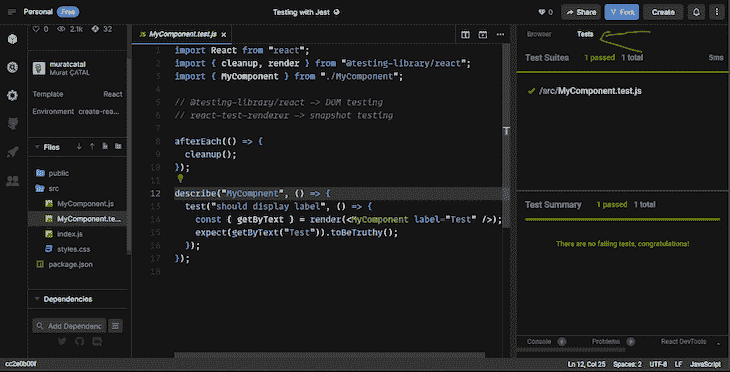
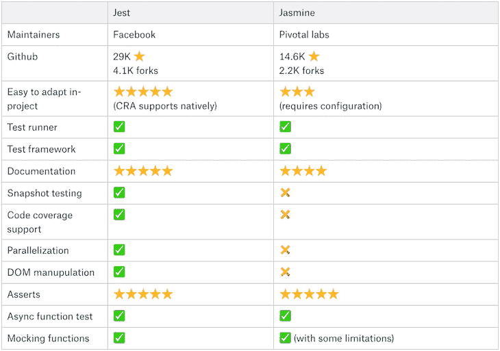
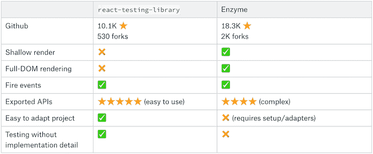
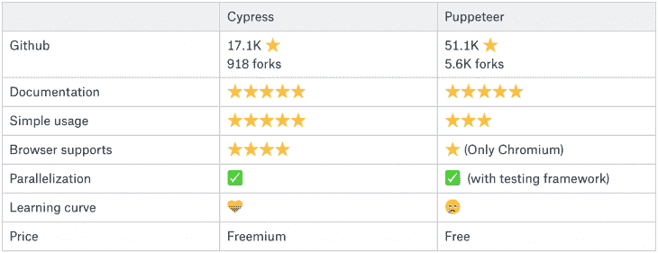

# 比较 React 测试库

> 原文：<https://blog.logrocket.com/compare-react-testing-libraries/>

***编者按:*** *这篇比较 React 测试库的帖子最后一次更新是在 2023 年 2 月 8 日，添加了关于使用 Mocha、Chai 和 TestCafe 进行测试的部分。此更新还包括代码更新和 best React 测试库的新部分。要了解更多关于测试的信息，请查看本指南。*

如果你创造了一个东西，不管是什么，你都应该在把它提供给别人之前对它进行测试。这有助于开发人员评估他们项目的稳定性。这样，在你推出成品之前，你可以对它有更多的信心和控制。让我们来看看一些 React 测试策略。

*向前跳转:*

## 反应测试策略

有几种方法可以测试 [React 应用](https://logrocket.com/for/react)，从小代码块到更一般的方面。在我们深入研究与它们相关的框架和库之前，让我们来看看一些最有用的方法来评估 React 应用程序的功能。

### 单元测试

单元测试是一种检查你的每一小段代码的测试。您可能认为这是在生命周期中测试原始组件。这通常是最简单和最便宜的测试选择。单元测试的一个例子是检查验证函数(我们的单元)是否返回预期的输出。

### 集成测试

如果您有许多组合的组件，您可能想要测试它们是如何交互的。你可以通过模仿你的端点来做到这一点，作为集成测试的一部分。然而，这可能比单元测试更昂贵、更复杂。这里，一个常见的用例是分析多个单元(例如，购物网站中的身份验证和注册组件)是否能够正常工作。

### 端到端测试

当用真实数据测试整个系统以查看是否一切都按预期运行时，端到端测试是您的最佳选择。这种测试的一个众所周知的用例是当开发人员想要确保他们的应用程序 UI(前端)和他们的数据库(后端)彼此正常工作时。

当您开始编写测试时，您可能会尝试修改组件的内部业务和测试实现细节。小心点！这会把你引入歧途。相反，您应该从用户的角度编写测试，以生成更清晰、更准确的测试用例。

毕竟，您的最终用户对您的组件的内部细节不感兴趣，而是对他们所看到的感兴趣。现在我们已经建立了一些通用的最佳实践，让我们更仔细地看看一些最常见的测试框架和运行程序。我们将研究学习曲线、能力以及与每一项相关的优缺点。

## 用 Jest 测试 React 应用

[Jest](https://blog.logrocket.com/testing-with-jest-from-zero-to-hero-85ce0e9cc953/) 是一个由脸书创建和维护的测试框架。如果你用 [Create React App](https://blog.logrocket.com/tag/create-react-app/) 构建你的 React 应用，你可以在零配置下开始使用[Jest](https://blog.logrocket.com/testing-apps-with-jest-and-react-testing-library/)。只需添加`react-test-renderer`和`@testing-library/react`库进行[快照](https://blog.logrocket.com/the-importance-of-snapshots-in-advanced-blockchain-functions/)和 DOM 测试即可。

借助 Jest，您可以:

*   进行快照、并行化和异步方法测试
*   模仿你的函数，包括第三方库
*   执行无数的[断言方法](https://jestjs.io/docs/en/expect)
*   查看代码覆盖率报告

现在，让我们动手做一些代码。让我们假设您的应用程序是通过 CRA 创建的:

```
# For snapshot test
yarn add -D react-test-renderer

# For DOM test
yarn add -D @testing-library/react

```

对于不是用 CRA 构建的现有应用程序，首先添加以下依赖项:

```
yarn add --dev jest babel-jest @babel/preset-env 
react-test-renderer

```

然后，配置 Babel，使它使用您的 Node.js 安装，如下所示:

```
// create a file called babel.config.js in the root of your project:
module.exports = {
presets: presets: [['@babel/preset-env', {targets: {node: 'current'}}]]
Add the testing command in your package.json.
// package.json
{
"scripts": {
"test": "jest"
}

```

这将告诉 Yarn，每次您执行`yarn test`命令时，Jest 将运行以在您的 web 应用程序上执行测试。

### 建立 Jest 测试结构

既然您已经将测试文件添加到了您的应用程序中，那么让我们深入研究一下测试结构的更多细节。如下所示，CRA 已经被配置为运行具有`.spec.js`和`.test.js`文件的测试:

```
// MyComponent
export const MyComponent = ({ label }) => {
  return <div>{label}</div>;
};

```

我们有一个简单的组件，它接受一个标签道具并将其显示在屏幕上:

下一步是编写一个小测试来确保它正确显示，如下所示:

```
import React from "react";
import { cleanup, render } from "@testing-library/react";
import { MyComponent } from "./MyComponent";
// @testing-library/react -> DOM testing
// react-test-renderer -> snapshot testing
afterEach(() => {
  cleanup();
});
describe("MyCompnent", () => {
  test("should display label", () => {
    const { getByText } = render(<MyComponent label="Test" />);
    expect(getByText("Test")).toBeTruthy();
  });
});

```

现在，让我们回顾一下我们想要测试的特性— `afterAll`和`beforeAll`。

### 测试我们的功能

在当前测试文件中的测试完成后，`afterAll`方法将运行代码。另一方面，`beforeAll`将在测试开始之前运行。您可以通过使用`afterAll`函数清理您的资源和在数据库上创建的模拟数据，或者您可以在`beforeAll`中设置您的配置。

该函数可能会返回一个生成器或一个承诺，并在继续之前等待您的承诺或生成器函数完成其执行。这里有一个例子:

```
// MyTestFile.test.js
afterAll(() => {
  cleanResources(); //clean all render data. This will prevent memory leaks.
});

beforeAll(() => {
   setupMyConfig(); //example: set some global state so that it can be shared with multiple test files.
});

describe("MyComponent",() => {
   test("should do this..",() => {
      expect(prop).toBeTruthy();
   });
});

```

当所有测试在当前文件中完成执行时运行。与`afterAll`和`beforeAll`不同，`afterEach`和`beforeEach`是为测试文件中的每个测试用例调用的。通过使用`beforeEach`，您可以在每个测试用例开始运行之前创建一个到数据库的连接。

作为一个最佳实践，您应该在每个测试用例运行之后使用`afterAll`删除您创建的 DOM 元素:

```
// MyTestFile.test.js
afterAll(() => {
  resetDomTree();
});

beforeAll(() => {
  createDomElement();
  connectToDB();
});

describe("MyComponent",() => {
   test("should do this..",() => {
      expect(prop).toBeTruthy();
   });
//create another test:
   test("should do that..",() => {
      expect(prop).toBeTruthy();
   });
});

```

`describe`命令允许您将相关的测试分组，以产生更清晰的输出。下面是它的样子:

```
describe("MyComponent",() => {
   test("should do this..",() => {
      expect(prop).toBeTruthy();
   });

   test("should do that..",() => {
      expect(prop).toBeTruthy();
   });
});

```

为了运行测试，我们可以在终端中使用命令`npm run test`或`yarn run test`。但是，如果您在 CodeSandbox 上，可以使用“测试”按钮，如下图所示:



### 用 Jest 进行快照测试

一个[快照测试](https://blog.logrocket.com/refactoring-legacy-code-with-jest-snapshots-e290ceccccc3/)生成一个类似 HTML 的输出来查看你的组件是如何构造的。如果你想知道你的 HTML 的结构或者你的 CSS 属性是如何根据事件注入的，这是非常有用的。本质上，当在终端中执行`npm run test`命令时，会自动创建一个`__snapshot__`文件夹。

首先，您可以克隆我创建的这个[存储库](https://github.com/bonarhyme/testing-libraries)来演示快照测试是如何工作的:

```
// Link.jsx
import React from "react";
const Link = ({ page }) => {
  return (
    <a
      className="normal"
      href={page}
      onMouseEnter={() => console.log("Mouse enter")}
      onMouseLeave={() => console.log("Mouse leave")}
    >
      My Domain
    </a>
  );
};
export default Link;

// React / JavaScript
// App.js
import React from 'react';
import './index.css';
import Link from './Link';
export default function App() {
  return (
    <div className='App'>
      <h1>Hello Codes</h1>
      <Link page='http://www.bonarhyme.com' />
    </div>
  );
}

// React / JavaScript
// Link.test.js

import renderer from 'react-test-renderer';
import Link from './Link';
it('renders correctly', () => {
  const tree = renderer
    .create(<Link page='http://www.bonarhyme.com'>Bonarhyme</Link>)
    .toJSON();
  expect(tree).toMatchSnapshot();
});

// React / JavaScript
// Generated snapshot
// __snapshot__/Link.test.js.snap

// Jest Snapshot v1, https://goo.gl/fbAQLP

exports[`renders correctly 1`] = `
<a
  className="normal"
  href="http://www.bonarhyme.com"
  onMouseEnter={[Function]}
  onMouseLeave={[Function]}
>
  My Domain
</a>
`;

```

在上面的代码中，`Link.js`包含一个`anchor`标签，当`App.js`托管组件时，我们将对其进行测试。`Link.test.js`举行我们的测试。本质上，我们是在将生成的快照与我们预期的快照进行比较。有趣的是，结果会被写入`__snapshot__/Link.test.js.snap`文件。

### 模拟功能

测试时模仿是您需要实现的核心特性之一。好消息是 Jest 非常适合模仿你的函数和模块。

例如，假设您想要测试一个获取用户的函数。它使用 [Axios](https://blog.logrocket.com/how-to-make-http-requests-like-a-pro-with-axios/) ，但是我们不想碰到真正的端点，因为那不是我们想要测试的。这是我们的代码:

```
import axios from 'axios';

const CustomersList = [
{name: 'Bob'}, 
{name: 'Jenny'},
{name: 'Philip'},
{name: 'Casandra'}
]

jest.mock('axios');

test('should fetch users', () =>; {
  const customers = [{name: 'Bob'}, {name: 'Jenny'}];
  const resp = {data: customers.find(c =>; c.name = 'Bob')};
  axios.get.mockResolvedValue(resp);

  return CustomersList.getByFilter("Bob").then(data => expect(data).toEqual({name: 'Bob'}));
});

```

在上面的代码中，Jest 可以服务于广泛的目的，比如[模仿一个 API 调用](https://blog.logrocket.com/mirage-js-tutorial-mocking-apis-in-react/)。因此，在上面的例子中，我们模拟了一个 API 调用，并比较调用返回的数据是否与我们在`CustomersList`中提供的数据相匹配。我们通过使用 `axios.get.mockResolvedValue(resp);`和`CustomersList.getByFilter("Bob").then(data => expect(data).toEqual({name: 'Bob'}));`来实现。

## 用 Jasmine 测试

像 Jest 一样， [Jasmine](https://jasmine.github.io/) 是一个 JavaScript 框架和测试运行程序。然而，您应该在开始使用 Jasmine 之前添加一些配置。

以下是你可以用 Jasmine 做的一些简单的事情:

*   异步功能测试
*   嘲弄请求
*   自定义等式检查器断言
*   自定义匹配器断言

至于缺点，这里有一些 Jasmine 不支持的东西:

*   快照测试
*   代码覆盖率工具
*   并行化(需要第三方工具)
*   原生 DOM 操作(需要 JSDOM 等第三方工具)

此外，Jasmine 只查找`.spec.js`文件，所以您需要编辑它的配置来查找`.test.js`文件。

Jasmine 通常与[酶](https://blog.logrocket.com/react-testing-library-vs-enzyme/)一起使用，因此您需要安装它并进行如下配置:

```
yarn add -D babel-cli \
            @babel/register \
            babel-preset-react-app \
            cross-env \
            enzyme \
            enzyme-adapter-react-16 \
            jasmine-enzyme \
            jsdom \
            jasmine

```

然后，用`yarn run jasmine init`命令为 Jasmine 初始化您的项目。现在，我们将把一些配置文件放在一个`spec/helper`文件夹中。它们将用于 Babel、Enzyme 和 JSDOM:

```
// babel.js
require('@babel/register');

// for typescript
require('@babel/register')({
    "extensions": [".js", ".jsx", ".ts", ".tsx"]
});

// enzyme.js or enzyme.ts 
// be sure your file extension is .ts if your project is a typescript project
import jasmineEnzyme from 'jasmine-enzyme';
import { configure } from 'enzyme';
import Adapter from 'enzyme-adapter-react-16';

configure({ adapter: new Adapter() });

beforeEach(function() {
  jasmineEnzyme(); //before each test, setup our jasmine config.
});

// jsdom.js

import {JSDOM} from 'jsdom';

const dom = new JSDOM('<html><body></body></html>');
global.document = dom.window.document;
global.window = dom.window;
global.navigator = dom.window.navigator;

```

最后，编辑 Jasmine 配置文件，确保 Babel、Enzyme 和 JSDOM 配置被正确加载。现在，是时候进入`spec/support/jasmine.json`了:

```
// the important part here is we should load babel first.

// for normal projects
"helpers": [
  "helpers/babel.js",
  "helpers/**/*.js"
],

// for typescript projects
"helpers": [
  "helpers/babel.js",
  "helpers/**/*.{js,ts}"
],

```

让我们回顾一下如何用 Jasmine 编写测试。我们还将谈到酶。

大多数助手函数，比如`afterAll`、`beforeAll`、`afterEach`和`beforeEach`，都类似于 Jest，所以让我们深入研究如何为 React 组件编写一个基本测试，以查看它的结构:

```
const Utils = React.addons.TestUtils;
let element;
beforeEach(() => {
  element = React.createElement(
      MyComponent,
      {
        label: 'Hello'
      });
});

afterEach(() => {
  element = null;
});

describe('MyComponent', function() {
  it('can render without error', function() {
    const component = Utils.renderIntoDocument(element);
    expect(component).not.toThrow();
  });
})

```

要运行它，运行`jasmine.spec.js`命令。

### 对 Jasmine 使用自定义匹配器

在 Jasmine 中，您可以编写`customMatcher`函数，以便在每个测试规范中全局重用。例如，如果您有一组经常使用的测试匹配器，那么定制匹配器就可以派上用场。

自定义匹配器应该返回一个具有`pass`和`message`属性的对象。一个`pass`属性检查条件是否处于有效状态，而`message`是显示为失败状态的字段。看起来是这样的:

```
const customMatchers = {
  toBeValidAgeRange: function() {
    return {
      compare: function(actual, expected) {
         var result = {};
         result.pass = (actual > 18 && actual <=35);
         result.message = actual + ' is not valid';   
         return result;
      }
    };
  }
};
describe("Custom matcher", function() {
  beforeEach(function() {
    // register our custom matcher with Jasmine
    jasmine.addMatchers(customMatchers);
  });
  it("should be valid age", function() {
    expect(19).toBeValidAgeRange();
  });

  it("should fail", function() {
    expect(38).toBeValidAgeRange();
  });
});

```

### 实现自定义相等检查器

有时，您可能需要比较两个对象或更改相等检查的行为来比较基元类型。Jasmine 有一个很好的 API 来覆盖等式检查。自定义 checker 函数必须有两个参数:第一个来自`expect`，第二个来自`assertion`函数。同样，它必须返回`Boolean`或`undefined`。

如果返回`undefined`，等式函数不适合这些参数。这里有一个例子:

```
function myObjectChecker(first, second) {
//check if they both are objects and have the 'name' field  
  if (typeof first === 'object' && typeof second === 'object' && 
      first.hasOwnProperty('name') && second.hasOwnProperty('name')) {
    return first.name === second.name;
  }
}

beforeEach(() => {
//now register your tester with Jasmine so that we can use it.  
jasmine.addCustomEqualityTester(myObjectChecker);
});

describe('MyComponent', function() {
  it('can render without error', function() {
    expect({name: 'John'}).toEqual({name:'John'}); //will pass the test
  });
  it('Not equal using a custom tester.', function() {
    expect({name: 'John'}).not.toEqual({age:19}); //will pass the test.
  });
});

```

## 使用 react-testing-library 测试 react 应用程序

由 Kent C. Dodds 创建并由一个庞大的开发人员社区维护的 [react-testing-library](https://blog.logrocket.com/semantic-tests-with-react-testing-library/) 使您能够在不触及组件内部业务的情况下测试组件——这使您能够在将用户体验放在首位的同时执行更强大的测试用例。

使用 react-testing-library，您可以:

*   在文本中查询您的元素，`label`、`displayValue`、`role`和`testId`
*   激发任何事件
*   等待带有`wait`的元素出现

但是，您不能:

*   进行浅层渲染
*   访问组件的内部业务，比如状态

用`yarn add -D @testing-library/react`命令安装库。现在，有趣的是…

```
import React from 'react';
import { render, RenderOptions, RenderResult, fireEvent, screen} from '@testing-library/react';

describe('MyComponent', () => {
  test('Click on item', () => {

    render() //render the component to the DOM
    fireEvent.click(screen.getByText("Click me")); //find the button and click it.
    expect(screen.getByRole('button')).toBeDisabled() //if the button is disabled, pass the test.
  });
}

```

在上面的代码中，我们从安装`@testing-library/react`作为开发依赖项开始。接下来，我们导入必要的包，并使用`describe`方法来模拟一个按钮点击，并在我们的应用程序中使用`Click me`作为文本内容。如果按钮被禁用，我们还确保测试通过。你可以在这里看到完整的 API 库[。](https://testing-library.com/docs/dom-testing-library/api-queries)

## 用酶测试反应组分

[Enzyme](https://blog.logrocket.com/getting-started-with-enzyme-for-react-a106b58fc53b/) 是一个 JavaScript 测试工具框架，旨在帮助开发人员轻松测试 React 组件。它由 Airbnb 维护，是最常用的框架之一。

酵素使您能够:

*   使用浅层渲染
*   访问组件的业务实现
*   进行完整的 DOM 渲染
*   在浅渲染中使用`react-hooks`，有一些限制

如果你想深入比较酶和反应测试库，这里有一个方便的指南。从安装以下软件开始:

```
yarn add -D enzyme enzyme-adapter-react-16

```

然后，在`src`文件夹中创建一个`enzyme.js`，如下图所示:

```
import Enzyme, { configure, shallow, mount, render } from 'enzyme';
import Adapter from 'enzyme-adapter-react-16';

configure({ adapter: new Adapter() });
export { shallow, mount, render };
export default Enzyme;
Now, let's do some coding. Here's how we're going to get started with shallow rendering:
import React from 'react';
// we are importing from our enzyme.js
import { shallow } from './enzyme';

import MyComponent from './MyComponent';

describe('MyComponent', () => {
  test('renders correct text in item', () => {
    const wrapper = shallow(<MyComponent label="Hello" />);

    //Expect the child of the first item to be an array
    expect(wrapper.find('.my-label').get(0).props.children).toEqual('Hello');
  });

```

我们还可以进行完整的 DOM 渲染:

```
describe('<Foo />', () =>; {
  it('calls componentDidMount', () =>; {
    sinon.spy(Foo.prototype, 'componentDidMount');
    const wrapper = mount(<Foo />);
    expect(Foo.prototype.componentDidMount).to.have.property('callCount', 1);
  });
}

```

当心`componentDidMount`！我们访问了组件的内部业务，如果不小心的话，这可能会导致您编写不正确的测试用例。

## 用摩卡做反应测试

Mocha 是一个 JavaScript 测试库，可以用来运行异步测试。为了理解它是如何工作的，我们将克隆下面的[库](https://github.com/mochajs/mocha-examples/tree/master/packages/react-webpack)。

一般来说，我们的测试文件将存在于`test`文件夹中，每个文件都应该有`.spec.ts`扩展名，并且与测试所针对的应用程序的名称相匹配。我们的`App.js`包含以下内容: [App.js 内容](https://github.com/mochajs/mocha-examples/blob/master/packages/react-webpack/src/app.js)。我们可以测试某些关键字的存在，比如在`h1`中返回的文本。我们可以这样打开`App.spec.ts`来测试:

```
// App.spec.ts

import React from 'react';
import { expect } from 'chai';
import { shallow } from 'enzyme';
import Enzyme from 'enzyme';
import Adapter from '@wojtekmaj/enzyme-adapter-react-17';
import App from '../src/app.js';
Enzyme.configure({ adapter: new Adapter() });

describe('<App />', () => {
  it('renders our app with welcome text', () => {
    const wrapper = shallow(<App />);
    expect(wrapper.text()).to.equal("Welcome to the React application.")
  });
});

```

最后，我们可以运行`npm test`来运行我们的测试。

## 用柴测试

[Chai](https://blog.logrocket.com/how-to-test-strapi-endpoints-with-mocha-and-chai/) 是一个断言库，在许多测试库中使用，比如 Mocha。要开始使用 Chai，我们需要使用我们选择的`npm install chai`或[安装](https://www.chaijs.com/guide/installation/)方法将其安装到我们的项目中。

一般来说，有许多我们可以使用的断言风格。它们包括`Expect`、`Assert`等等。你可以在这里看到完整的名单。

使用`Assert`样式的一个很好的例子是检查一个数组是否包含一个特定的值，如下所示:

```
// test.js
// Assert style
var assert = require('chai').assert;
var people = ["boy", "girl", "man", "woman", "ladies"];

assert.isArray(people, 'is array of strings');
assert.include(people, 'man', 'array contains man');
assert.lengthOf(people, 5, 'array contains 5 strings');

```

## 在 React 应用中执行端到端测试

到目前为止，我们已经从编写单元测试或集成测试的角度研究了测试库。然而，在投入生产之前，我们可能还需要一个与后端完全集成的测试。为此，我们将看看两个库:Cypress 和木偶师。

### 柏树

Cypress 使你能够[编写你的测试](https://blog.logrocket.com/how-to-write-useful-end-to-end-tests-with-cypress/)而不需要任何额外的测试框架。它有一个很好的 API 来与页面组件交互，并支持许多浏览器，包括 Firefox 和其他基于 Chrome 的浏览器。

以下是你可以用柏树做的事情:

*   时间旅行
*   截图和视频
*   自动等待
*   控制网络流量，而无需接触您的服务器来测试边缘情况
*   并行化

分别使用以下代码行安装和运行 Cypress:

```
yarn add -D cypress
yarn run cypress open

```

现在，让我们写一些测试。首先，创建一个名为`my-test_spec.js`的文件:

```
// my-test_spec.js

describe('My First Test', function() { //first, describe your test
  it('Gets, types and asserts', function() {
    cy.visit('https://www.mydomain.com') //visit your app. Can be localhost.
    cy.contains('login').click() //find the button that contains 'login'

    cy.url().should('include', '/login')

    cy.get('.email') //find textbox with class 'email'. Cypress uses jQuery selectors.
      .type('[email protected]')
      .should('have.value', '[email protected]')
  })
})

```

### 操纵木偶的人

[木偶师](https://blog.logrocket.com/end-to-end-testing-react-apps-with-puppeteer-and-jest-ce2f414b4fd7/)不是一个 JavaScript 测试框架——它是一个[无头铬库](https://blog.logrocket.com/setting-headless-chrome-node-js-server-docker/)主要用于[自动化目的](https://blog.logrocket.com/using-puppeteer-for-automated-ui-testing/)。您可以启动 Chromium，使用提供的 API 在页面间导航，获取按钮，并点击它们。

Puppeteer 运行在真正的浏览器上，使您能够用类似于浏览器的 API 编写端到端的测试。要安装，请输入以下代码行:

```
yarn add -D jest-puppeteer puppeteer jest

```

然后，在`package.json`中输入以下内容:

```
// package.json
{
 jest: {
    "preset": "jest-puppeteer"
  }
}

```

下面是我们端到端测试的代码:

```
beforeAll(async ()=> {
  await page.goTo('http://mydomain.com');
});

describe('Visit MyDomain', () => {
  test('should have login text', () => {
     await expect(page).toMatch('login');
  });
});

```

### 测试咖啡馆

TestCafe 是另一个端到端的测试库，用于使用 React 和其他框架构建的 web 应用。它的工作方式不同于其他测试库，因为它用于模拟主要桌面浏览器、云浏览器和移动设备上的常见用户场景。

要开始使用 TestCafe，您应该使用`npm install -g testcafe`命令在您的计算机上全局安装它。此外，您应该安装用于使用`npm install -g testcafe-react-selectors`命令从页面中选择 React 组件的`testcafe-react-selectors`。

接下来，创建一个`getting-started.js`文件，并在您喜欢的代码编辑器中打开它。出于演示的目的，我将在我的电脑[这里](https://github.com/bonarhyme/testing-libraries)启动这个 React 应用程序。接下来，我将添加以下代码来测试名为`Link`的组件是否存在:

```
// getting-started.js
import { waitForReact, ReactSelector } from 'testcafe-react-selectors';

// This is where we pass the URL of the app and also await React to load the page completely
fixture`App tests`.page('http://localhost:3000').beforeEach(async (t) => {
  await waitForReact(90000, t);
});

// We can perform any test here...
test('My first test', async (t) => {
  const AppLink = ReactSelector('Link');
  await t
    .expect(AppLink.innerText)
    .eql('My Domain');
});

```

最后，我们可以在终端中运行`testcafe edge getting-started.js`命令

> 注意:您可以使用自己选择的任何浏览器。以下是从中选择的一些选项

## 比较 React 测试库和框架

到目前为止，我们研究了库的特性以及如何在我们的项目中实现它们。现在，让我们检查一些基准并比较不同库之间的结果。

### Jest 对 Jasmine

正如开头提到的，Jest 和 Jasmine 是测试框架。你在`describe`块中分组你的测试用例，并在`test`或`it`函数中编写你的测试。

现在，让我们用一个方便易读的表格来分析我们的对比:



以下是我最喜欢 Jest 的地方:

*   不需要配置
*   快照测试支持
*   代码覆盖率支持
*   模拟功能

至于 Jasmine，最有用的功能就是它的`mocking`功能。尽管这有一定的局限性，但对于大多数用例来说已经足够了。我目前在一个产品中使用 Jest 是因为它在 React 社区中的本地支持，也因为它比 Jasmine 更能满足我们测试 React 组件的需求。

### 反应-测试-文库与酶

在为组件编写测试时，函数是最重要的考虑因素之一。他们可能会强迫你写一个更干净、更真实的测试方法，或者让你错误地编写关于导出 API 的测试。让我们一起来看看反应-测试-文库和酶:



为组件编写测试时，不要在实现细节上陷得太深。记住，试着从用户的角度去思考。这将帮助您产生更好的测试套件，这将帮助您对您的测试更有信心。

对于大多数用例，我更喜欢 react-testing-library，主要是因为它的导出 API 不允许您使用组件的内部 API，这迫使您编写更好的测试。此外，不需要任何配置。

另一方面，Enzyme 允许您使用组件的内部 API，它可以包含生命周期方法或状态。我在许多项目中使用过酶和反应测试库。然而，我经常发现 react-testing-library 使事情变得更容易。

### 赛普拉斯对木偶师

端到端测试您的关键页面可能会让您在投入生产之前不再头疼。以下是赛普拉斯和木偶师的对比概要:



因为 Cypress 是一个测试框架，当你想开发的东西需要很快时，它比 Puppeteer 有很多优势。其开发人员友好的 API 使您能够像编写单元测试一样编写测试。木偶师不是一个测试框架，而是一个浏览器。它的 API 不是开发者友好的，但是功能强大，因为你可以访问浏览器的 API。因此，它的学习曲线比 Cypress 更陡。

### Cypress vs. TestCafe

Cypress 和 TestCafe 都是优秀的测试库。但是，和其他技术一样，它们也有利弊。让我们来看看它们:

| TestCafe | Cypress | 文件上传功能 |
| 它支持开箱即用的文件上传 | 它依赖于第三方解决方案 | 证明文件 |
| 文档是惊人的 | 文档是惊人的 | 多窗口/标签支持 |
| 支持同时打开多个标签和窗口 | 它本身不支持同时打开多个标签和窗口 | 断言库 |
| 它使用内置的断言库 | 它依赖 Chai 作为断言库 | 易用性 |
| 这很容易设置 | 它很容易使用 | 结论 |

## 正如您所看到的，每种测试方法、库和框架都有自己的优点和缺点，这取决于您希望分析的用例和数据类型。

在对每个测试框架进行评估之后，很明显 react-testing-library 是单元测试和集成测试最有价值和最合理的选择。对于端到端测试，Cypress 是一个合适的选择，因为它的 API 简单易学。然而，TestCafe 似乎也很容易学习，并提供了无缝的测试体验，其中包含许多可用于测试网页的 API。

然而，最终，这一切都归结为偏好。我将选择 react-testing-library 进行单元和集成测试，选择 TestCafe 进行端到端测试。

使用 LogRocket 消除传统反应错误报告的噪音

## 是一款 React analytics 解决方案，可保护您免受数百个误报错误警报的影响，只针对少数真正重要的项目。LogRocket 告诉您 React 应用程序中实际影响用户的最具影响力的 bug 和 UX 问题。

[LogRocket](https://lp.logrocket.com/blg/react-signup-issue-free)

自动聚合客户端错误、反应错误边界、还原状态、缓慢的组件加载时间、JS 异常、前端性能指标和用户交互。然后，LogRocket 使用机器学习来通知您影响大多数用户的最具影响力的问题，并提供您修复它所需的上下文。

[ ](https://lp.logrocket.com/blg/react-signup-general) [  ](https://lp.logrocket.com/blg/react-signup-general) [LogRocket](https://lp.logrocket.com/blg/react-signup-issue-free)

关注重要的 React bug—[今天就试试 LogRocket】。](https://lp.logrocket.com/blg/react-signup-issue-free)

Focus on the React bugs that matter — [try LogRocket today](https://lp.logrocket.com/blg/react-signup-issue-free).