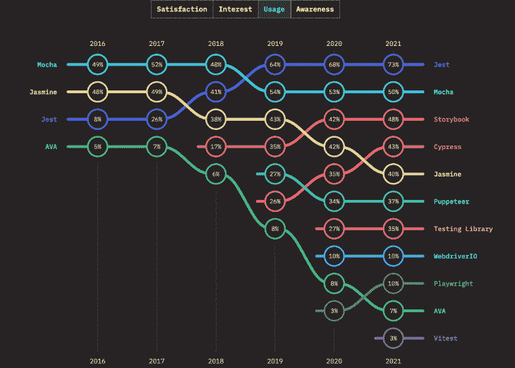

# 比较最佳 Node.js 单元测试框架

> 原文：<https://blog.logrocket.com/comparing-best-node-js-unit-testing-frameworks/>

***编者按**:node . js 单元测试框架的这一比较最后一次更新是在 2022 年 5 月 27 日，以包括最近的调查数据并删除过时的信息。*

在这篇 Node.js 单元测试指南中，我将提供一些为什么你应该对你的节点应用进行单元测试的理由，讨论什么是好的测试框架，并比较一些当今最流行的[节点单元测试框架](https://blog.logrocket.com/unit-testing-node-js-applications-using-mocha-chai-and-sinon/)。

以下是我们将要介绍的内容:

## Node.js 中的单元测试有什么好处？

单元测试是一种软件测试方法，在这种方法中，单独的代码段(通常是系统中可以逻辑隔离的最小代码段)被隔离测试。单元测试应该被隔离，这样就不会有外部依赖。

让我们看看与单元测试相关的一些优势。

首先，单元测试使得识别代码中的错误变得更加容易。应该为每段代码编写适当的测试用例，以确保它们符合规范并提供期望的输出。任何导致测试失败的变更都将表明引入了错误或缺陷。此外，单元测试使得缩小有问题的代码变得更加容易。

第二，单元测试充当自文档。一个新的团队成员可以通过单元测试更好地理解代码库。

第三，调试过程变得容易多了。这是因为当测试失败时，焦点将会集中在最新的变更上。

第四，重构代码变得更加容易，因为可以使用测试来验证更改，以确保被测试的单元仍然以期望的方式运行。

最后，减少了修复错误或系统故障的成本。

测试框架为运行自动化测试提供了一组可重用的组件或模块，比如测试运行程序和实用程序。测试框架负责:

1.  描述用于传达测试期望的格式
2.  创建访问要测试的应用程序或代码的方法
3.  执行测试
4.  报告测试结果

当测试是持续集成过程中不可或缺的一部分时，它们尤其有用。框架是为特定类型的测试而构建的:单元测试、集成测试、功能测试或者这些测试的组合。

## 是什么造就了一个好的 Node.js 测试框架？

有一千多种测试框架。为了挑选适合您的用例的东西，您需要根据您的项目需求以及您认为它对您的团队有多有效来评估每个框架。

以下是强节点的六个关键特征。JS 测试框架:

1.  易于设置:启动并运行您的测试应该花费最少的努力
2.  支持良好:有大量优秀的文档和社区可以获得帮助
3.  广泛的特性集:该框架内置了匹配器、间谍和模仿等功能
4.  速度:对于受 CPU 限制的测试，选择正确的框架可以在测试运行期间为您节省大量时间
5.  易于报告:覆盖报告应该易于使用内置报告生成，外部报告库应该易于集成
6.  易于集成:一个好的测试库应该易于集成到您的持续集成过程中

## 最好的 Node.js 单元测试框架有哪些？

根据《2021 年 JavaScript 现状》，2021 年最流行的 JavaScript 测试框架和库分别是[测试库](https://testing-library.com/)、 [Vitest](https://vitest.dev/) 、 [Jest](https://blog.logrocket.com/testing-with-jest-from-zero-to-hero-85ce0e9cc953/) 、 [Cypress](https://blog.logrocket.com/real-confidence-with-cypress-e2e-tests/) 、[剧作家](https://blog.logrocket.com/playwright-vs-puppeteer/)、[故事书](https://storybook.js.org/)。排在前十位的还有[木偶师](https://blog.logrocket.com/using-puppeteer-for-automated-ui-testing/)、[摩卡](https://blog.logrocket.com/a-quick-and-complete-guide-to-mocha-testing-d0e0ea09f09d/)、[茉莉](https://jasmine.github.io/)、 [AVA](https://github.com/avajs/ava) 和[网络驱动力](https://webdriver.io/)。



在本指南中，我们将比较其中的四个 Node.js 单元测试框架:

## 摩卡

[摩卡](https://mochajs.org/)已经有相当一段时间了；它最初于 2011 年 11 月发布。然而，与 Jest 和 Jasmine 等其他框架不同，它依赖于第三方断言、嘲讽和间谍工具，如 [Sinon](https://sinonjs.org/) 和 [Chai](https://www.chaijs.com/) 。它具有很强的可扩展性，有很多插件、扩展和库可以在其上运行。

### 赞成的意见

*   高度可扩展，支持各种断言和模拟库
*   简单的异步测试
*   向测试套件添加对生成器的支持相对容易。使用 [co-mocha](https://www.npmjs.com/package/co-mocha) 包，你所要做的就是在你的测试中需要它，然后你就可以使用生成器了
*   受一些 CI 服务器和插件的支持

### 骗局

*   使用额外的库会增加配置的复杂性并增加维护工作
*   没有自动嘲笑

样品摩卡测试:

```
const { expect } = require('chai');
    describe('Sum numbers', () => {
      it('should add two numbers correctly', () => {
        const sum = 1 + 2;
        const expectedResult = 3;
        expect(sum).to.equal(expectedResult);
      });
    });

```

## 玩笑

Jest 是由脸书开发并定期维护的 JavaScript 测试框架。自 2016 年以来，它的受欢迎程度稳步增长，当时只有 6%的受访者在当年的“[JS](http://2016.stateofjs.com/2016/testing/)状态”调查中表示，他们以前使用过 Jest，并将再次使用它。这个数字在 2017 年攀升至[四分之一的受访者，在 2018 年](https://2017.stateofjs.com/2017/testing/results/)达到[40%。截至最新版本，多达 73%的 JavaScript 开发人员尝试过 Jest，并计划再次使用它。](https://2018.stateofjs.com/testing/overview/)

### 赞成的意见

*   全面的[文档](https://jestjs.io/docs/en/getting-started)包括详细的指导来帮助你设置测试，编写各种类型的测试，使用它的许多特性，以及很棒的例子
*   设置简单，配置灵活简单，样板代码比其他框架少
*   并行测试运行已启用
*   最佳性能:通过在各自的进程中运行测试来实现测试的并行化，从而最大限度地提高性能
*   有用的功能，如快照、覆盖和测试观看

### 骗局

*   显示同一错误的多条消息
*   在初始设置期间，它可能需要更多的依赖项(例如， [Babel](https://blog.logrocket.com/why-you-dont-need-babel/)

Jest 测试示例:

```
describe("Sum numbers", () => {
  test("it should sum two numbers correctly", () => {
    const sum = 1 + 2;
    const expectedResult = 3;
    expect(sum).toEqual(expectedResult);
  })
});

```

## 茉莉

Jasmine 由 Pivotal Labs 开发，于 2010 年发布，比 Jest 存在的时间要长得多。它的目标是在任何支持 JavaScript 的平台上运行，并且高度灵活，兼容各种其他测试框架和库，包括 Sinon 和 Chai。由于它的长寿，它已经发展了一个重要的社区，并享有大量的库、博客文章和教程的支持。

### 赞成的意见

*   设置简单——Jasmine 有一个 CLI 工具，可以创建一个 spec 文件夹和一个 JSON 配置文件，所以只需一个命令就可以开始测试代码
*   经过全面测试，有文档记录，并有大量教程支持如何使用它
*   注重描述性语法的行为驱动开发
*   受许多 CI 服务器支持，并为那些没有现成支持的服务器提供插件

### 骗局

*   不友好的错误日志
*   测试文件必须有特定的后缀(如`spec.js`)
*   断言库没有柴丰富

样本茉莉测试:

```
describe("Sum numbers", function() {
  it("should sum two numbers correctly", function() {
    var sum = 1 + 2;
    var expectedResult = 3;
    expect(sum).toEqual(expectedResult);
  });
});

```

## 自动话频警报器(automatic voice alarm)ˌ视听教具(audiovisual aids)

极简主义是 AVA 的焦点。它有一个简单的 API，同时仍然支持高级功能。它通过将测试作为独立的节点进程并行运行来实现其惊人的速度。与 Jest 和 Jasmine 等其他测试框架不同，它不创建测试全局变量。

### 赞成的意见

*   好用。要安装和设置 AVA，你所要做的就是运行`npm init ava`
*   并行测试运行
*   原生 ES6/ES7 支持
*   对异步函数的内置支持
*   如果一个承诺被退回，你不需要自己结束测试；当承诺兑现时，它就结束了

### 骗局

*   AVA 相对较新。这个社区仍在发展中，不像其他测试框架那样有很多文档或教程
*   AVA 在 GitHub 上有很多未解决的问题

样本艾娃测试:

```
import test from 'ava';
test('Sum numbers', t => {
  const sum = 1 + 2;
  const expectedResult = 3;
  t.equal(sum, expectedResult);
});

```

## 为您的项目选择最佳的单元测试框架

下表比较了四个节点单元测试框架的特性:Mocha、Jest、Jasmine 和 AVA。

| 结构 | 茉莉 | 麻醉椒 | 玩笑 | 摩卡 |
| --- | --- | --- | --- | --- |
| 开源 | 是 | 是 | 是 | 是 |
| 内置覆盖率报告 | 不 | 不 | 是 | 不 |
| 并行测试运行 | 不 | 是 | 是 | 不 |
| 快照 | 不 | 是 | 是 | 不 |
| 内置间谍 | 是 | 不 | 是 | 不 |
| 内置嘲讽 | 是 | 不 | 是 | 不 |
| 内置断言 | 是 | 是 | 是 | 不 |
| ES2017 支持 | 不 | 是 | 是 | 不 |

最佳框架可以根据您的需求、项目规模和其他因素而有所不同。现在有效的可能在未来无效。在选择合适的框架时，考虑您当前和未来的需求非常重要。

如果你想马上投入工作，开玩笑是不会错的。这是一个非常快速的框架，易于设置，并且有很多内置特性。

如果你在寻找简单，AVA 是你最好的选择。它是最小的和精简的，但是能够处理各种类型的节点单元测试。它也相当快。

对于想要灵活配置的人来说，Mocha 是最好的选择，同时也是一个库的选择。

有许多节点单元测试框架和库可用。在本指南中，我们重点介绍了四种最流行的。请记住，最适合您的选择将取决于您项目的独特目标和要求。