# 比较最佳类型脚本 IDEs - LogRocket 博客

> 原文：<https://blog.logrocket.com/comparing-best-typescript-ides/>

***编者按**:本文最后一次更新是在 2022 年 9 月 16 日，包含了 Visual Studio 2022 中发布的新特性。*

TypeScript 是一种广泛流行的语言，用于支持从大型 web 框架(如 Angular)到小型个人项目的所有内容。但是，在处理任何 TypeScript 项目之前，开发人员必须从许多可用的集成开发环境(ide)中进行选择。

有许多可用于 TypeScript 的 ide，每一个都有不同的特性集和设计理念。在本文中，我们将根据易用性、插件的可扩展性和可用性、性能和调试能力来比较一些最流行的 ide。这些 ide 包括 Visual Studio Code、WebStorm 和 Visual Studio 2022。

为了帮助指导我们进行比较，我们将使用这个[示例类型脚本项目](https://github.com/microsoft/TypeScript-Node-Starter)。

请记住，无论您选择哪种 IDE，都将在很大程度上取决于您的个人偏好以及您喜欢开发环境中的哪些特性。你会惊讶于“我的 IDE 比你的 IDE 更好”的争论有多激烈；最后，你应该选择对你有用的东西，记住你可以随时转换。

## 目录

## Visual Studio 代码

Visual Studio Code (VS Code)可能是最显而易见的 IDE 了。超过 2400 万开发者使用 VS Code，VS Code 拥有相当健康的追随者，主要是因为它几乎可以在任何地方运行，并且有合理的硬件要求。VS 代码支持 Windows、Linux 和 macOS 平台。

### 易用性

VS Code 的 UI 对于任何打开它的开发者来说都是直观的。大文本编辑窗口使代码易于查看，左侧的文件夹结构让您可以轻松浏览项目:

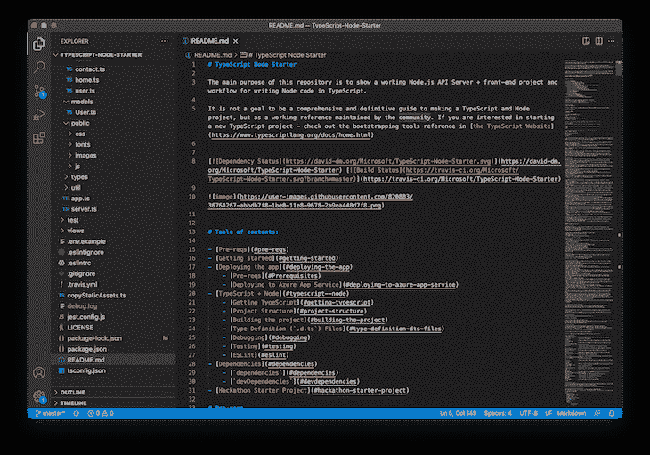

您还可以通过窗口的左下方轻松地在分支之间切换，并且可以通过右下方的语言切换器在 HTML、TypeScript 和 CSS 之间切换语言。

因为 VS 代码和 TypeScript 都是微软创建的，所以编辑器对 TypeScript 的支持可想而知的强大。

### 展开性

就可扩展性而言，[VS 代码](https://marketplace.visualstudio.com/search?target=VSCode&category=All%20categories&sortBy=Installs)有超过 30，000 个扩展可用，所以[很有可能找到你想要的](https://blog.logrocket.com/top-10-vs-code-extensions-2021/)。

### 表演

VS 代码基本上可以在任何工作站上运行良好，甚至可以在像 Raspberry Pi 这样的低功耗设备上运行。在我的 32GB 内存的锐龙 3700X 工作站上，VS 代码只需要几秒钟就可以加载我们的示例项目:

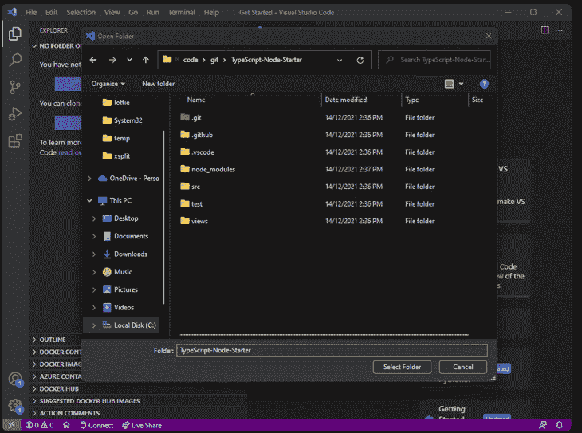

在上面的动画中需要注意的另一件事是关于安装什么扩展来帮助管理您的项目的上下文建议。在这种情况下，它是 ESLint 和 Azure 数据库扩展。

ESLint 向开发人员提供关于他们的代码是否符合最佳实践的反馈，而 [Azure Databases](https://azure.microsoft.com/en-us/updates/azure-databases-extension-for-visual-studio-code/) 帮助管理样本项目使用的数据库。

有时候，扩展的质量会有很大的不同。如果你安装了大量的扩展，或者使用了优化很差的扩展，VS Code 的性能真的会开始下降。很难确定是哪个扩展导致了缓慢的性能，这很快就会变得令人沮丧。

在我们的项目打开的情况下，Visual Studio 代码仅使用 258MB，这对于工作站资源较少的人来说是一个不错的选择:

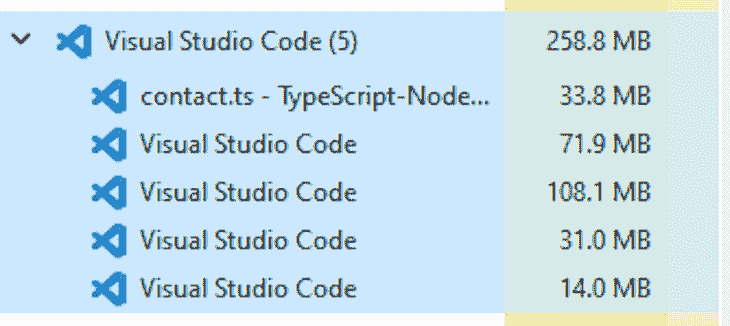

### 调试能力

使用 VS 代码，我们可以轻松地为 TypeScript 应用程序设置断点，并在应用程序暂停在断点上时查看变量的值。您曾经想要或需要对一个类型脚本应用程序进行故障诊断的一切都在这里。

然而，对此的一个主要警告是 VS 代码中不能将标签撕下来放在屏幕上的其他地方。当您对一个相当大的应用程序进行故障诊断时，如果不能在屏幕上分割打开的文件，跟踪多个文件中的函数调用并不容易。

这个[问题的问题跟踪从 2016 年](https://github.com/microsoft/vscode/issues/8171)就开始了，没有迹象表明会很快改变。对我个人来说，在 VS 代码中无法做到这一点是一个障碍，我不能在更大的项目中使用它。

### VS 代码优缺点

总之，使用 VS 代码作为 IDE 的优点包括:

*   几乎可以在任何地方运行
*   出色的表现
*   拥有庞大的用户群，有很多扩展和配置选项
*   开源并免费使用

然而，VS 代码的缺点包括:

*   它不能在新窗口中撕下标签
*   扩展会大大降低性能

## 网络风暴

另一个在类型脚本领域流行的编辑器是 JetBrains 的 WebStorm。WebStorm 更像一个传统的 IDE，因为它包含了比 VS 代码更多的现成功能。然而，它也有更大的性能需求与之匹配。

我们几乎可以立即看到这一点，因为 WebStorm 正确地可视化了`README.md`文件，而 VS 代码则保持了它的原始格式:

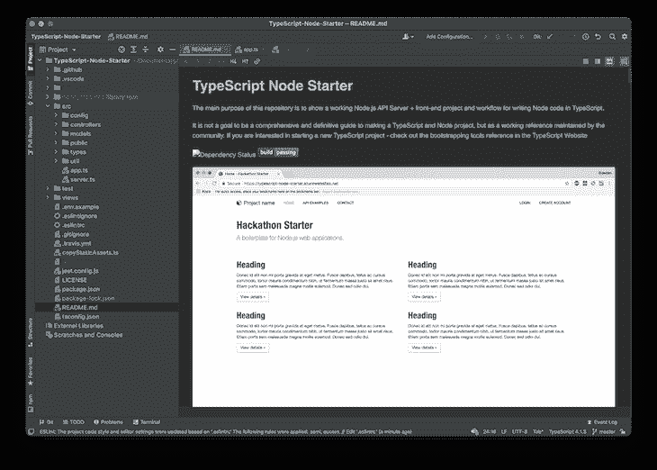

WebStorm 支持 Windows、macOS 和 Linux 平台。

### 易用性

因为 WebStorm 包含了如此多的功能，所以很容易迷失其中，或者很难熟悉编辑器。然而，在使用大约一个星期后，你就会知道大多数主要功能在哪里。

WebStorm 包括对 TypeScript 项目所需的一切的支持。无论你有一个小型的打字稿项目还是一个巨大的 Angular 项目，WebStorm 都可以相对轻松地处理。

WebStorm 还使用 [TypeScript 语言服务](https://www.jetbrains.com/help/webstorm/typescript-support.html#ws_verify_typescript)对您的 TypeScript 代码执行运行时检查，因此您可以尽早发现问题。这种 TypeScript 支持的一个例子是 WebStorm 如何通告在函数上使用的参数名称。

有时，很难知道构造函数签名的意图是什么，尤其是当您从使用 TypeScript 的某个库或框架开始时。但是，WebStorm 会告诉您正在使用的构造函数参数的名称，这在您不记得参数的用途时非常有用，比如:

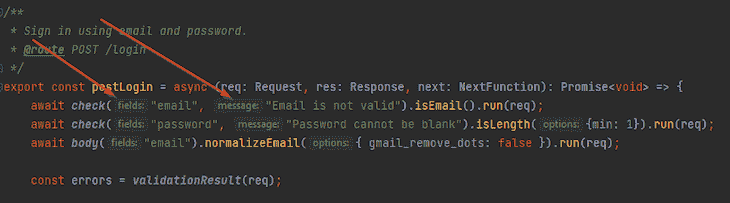

您在 TypeScript 中工作的大多数项目可能会包含一个`package.json`文件，用于通过 npm 安装在您的项目中的其他包。WebStorm 提供了显示运行选项的选项，只需右击文件并选择**显示 npm 脚本:**

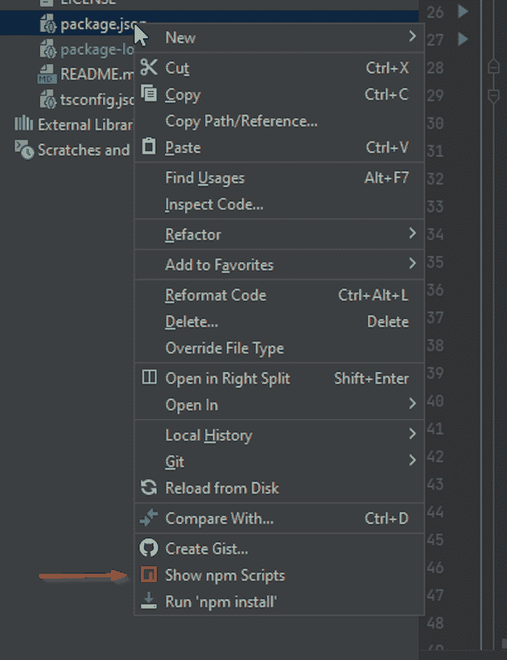

这向我们显示了为此项目配置的所有 npm 脚本，因此我们可以轻松运行任何`package.json`脚本:

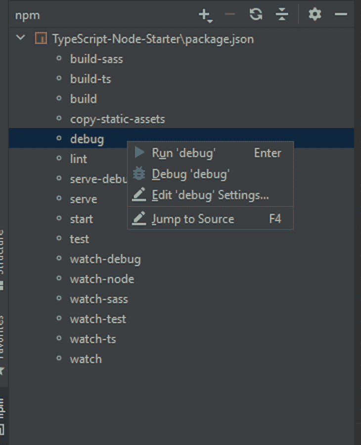

直接从 IDE 执行 npm 脚本的能力加快了您的开发工作流程，因为您不需要一直在终端中编写`npm run`。

最后，WebStorm 还为使用 TypeScript 的框架提供了强大的工具支持，比如 Angular。这稍微超出了本文的范围，但是如果您使用类似 Angular 的框架，这是值得记住的。

### 展开性

在撰写本文时，WebStorm 只有 3402 个插件可用，但是因为你需要的很多功能已经是 WebStorm 的一部分，所以对第三方插件的依赖肯定会减少。我曾经在一个相当大的 Angular 项目中使用过 WebStorm，我不需要安装任何第三方库或插件。

例如，对于 VS 代码，您必须为 TypeScript 和其他功能(如 npm)安装工具支持。Visual Studio 的 2019 和 2022 版本都提供了 TypeScript 支持，但缺少现成的 npm 支持。

因为第三方开发人员维护这些扩展，所以质量可能会有所不同。但是，WebStorm 附带了 TypeScript 功能，这意味着它是第一方组件，质量和功能是核心产品的一部分。

我需要的所有功能都是核心 WebStorm 产品的一部分，因此，我可以对工具的质量和支持充满信心，而不是 GitHub 上随时可能被放弃的开源插件。

### 表演

因为 WebStorm 更像是传统的 IDE，需要更好的硬件组件才能很好的运行。虽然它使用更多的内存，可能需要更长的时间来启动，但一旦它打开，性能会非常好。

根据 Task Manager 的说法，加载我们的项目后，内存占用接近 1gb，总共 982.7MB。

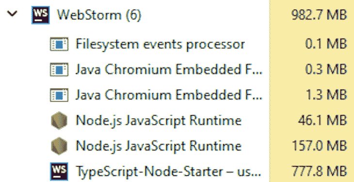

VS 代码使用的内存比 WebStorm 少得多。当然，WebStorm 有更多的功能，比 VS 代码更先进，所以这可以解释内存使用的差异。

尽管内存使用大幅增加，WebStorm 仍然可以快速打开和使用。在第一次启动时，WebStorm 会对您的 TypeScript 项目进行索引，因此搜索您的项目并执行重构是一种快速的体验。

如下图所示，WebStorm 只需几秒钟就能在我的电脑上打开一个项目。

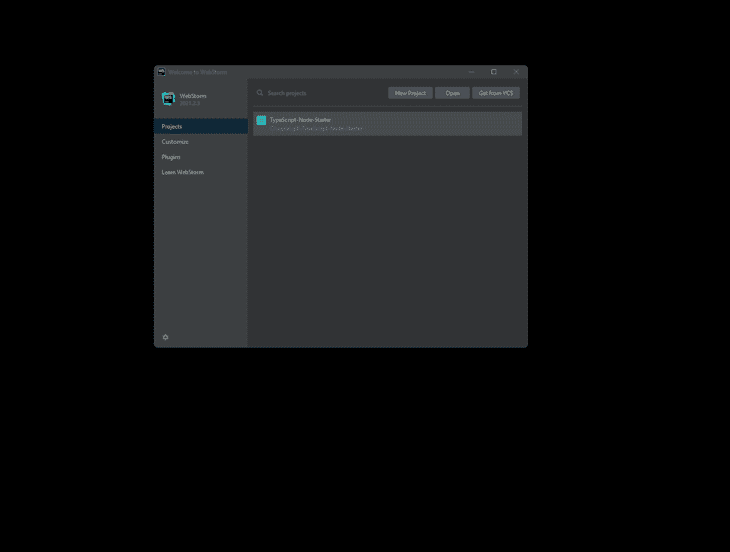

你更有可能使用内置的 WebStorm 功能，而不是依赖于可能很慢的插件，所以 WebStorm 本身以相当一致的速度运行。

### 调试能力

简而言之，WebStorm 拥有你想要的所有调试功能。您可以像往常一样设置断点，也可以设置条件断点。

WebStorm 附带了对 TypeScript 的强大支持，因此您从一开始就可以获得支持，而无需安装任何对核心应用程序的扩展。这也扩展了 WebPack 配置文件和`packages.json`的集成，有助于任何开发工作流。

此外，您可以在编辑器中去掉标签，这样您就可以轻松地一次跟踪多个文件，找到您正在追踪的特定问题或 bug。它还对 Git 提供了很好的内置支持，因此您可以很容易地看到谁对某一行进行了更改。

我个人很喜欢 WebStorm。它为我节省了大量编写和调试我的 TypeScript 应用程序的时间。虽然它不是免费的，但它有 30 天的免费试用期。

### 网络风暴的利弊

总而言之，WebStorm 的优点包括:

*   出色的内置功能集
*   良好的性能
*   可以撕下标签制作新的窗口

我认为 WebStorm 的唯一缺点是成本。但是对于[开源项目](https://www.jetbrains.com/community/opensource/#support)或者[学术使用](https://www.jetbrains.com/community/education/#students)是免费的。

## Visual Studio 2019/2022

WebStorm 和 VS Code 无疑是这一领域最大的竞争者，但许多拥有 Visual Studio 2019 或 2022 的 Windows 开发人员[发现，在他们已经知道并喜欢的 IDE 中工作他们的 TypeScript 项目很容易。](https://visualstudio.microsoft.com/thank-you-downloading-visual-studio/?sku=Community&rel=17)

请注意，此信息专门针对 Visual Studio for Windows。虽然 Visual Studio 也适用于 Mac，但它是一个完全不同的产品，功能远少于 Windows。

### 易用性

Visual Studio 已经存在很长时间了，它受益于大量了解其工作原理的开发人员。它主要是为。NET 开发，所以虽然它支持 TypeScript，但功能与 VS Code 或 WebStorm 不是一个级别的。

### 展开性

Visual Studio 还为开发人员提供了大量的扩展，您肯定需要使用它们。例如，Visual Studio 本身并不知道 npm 任务之类的事情，所以[您需要使用扩展](https://marketplace.visualstudio.com/items?itemName=MadsKristensen.NPMTaskRunner)来为您处理这些事情。

开箱即用，Visual Studio 并不是真正为纯 TypeScript 项目设计的，但一些初学者项目使用 Angular，它使用 TypeScript，因此它可能足以让您完成较小的项目。

### 表演

虽然 Visual Studio 并不迟缓，但它的速度没有 VS Code 或 WebStorm 快。如果您正在开发一个使用。NET 用于 API 或网站，TypeScript 用于客户端应用程序，那么 Visual Studio 是一个可以接受的折衷方案。

通过打开我们的示例应用程序，我们开始了解这种性能。您会注意到，在我们的其他选项中，Visual Studio 打开项目的速度无疑是最慢的。

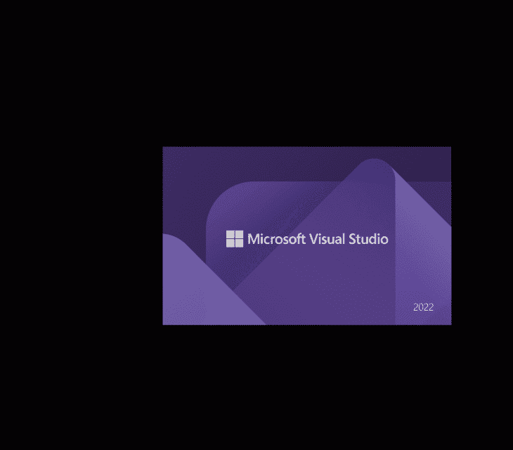

Visual Studio 也不知道我们的`packages.json`文件，这意味着我们必须安装一个扩展来运行我们的 npm 任务。我们也不像在 WebStorm 中那样得到函数调用的上下文提示，所以它不太精确。

就内存使用而言，Visual Studio 处于中间位置，在加载我们的示例项目时，它占用了将近 300MB:

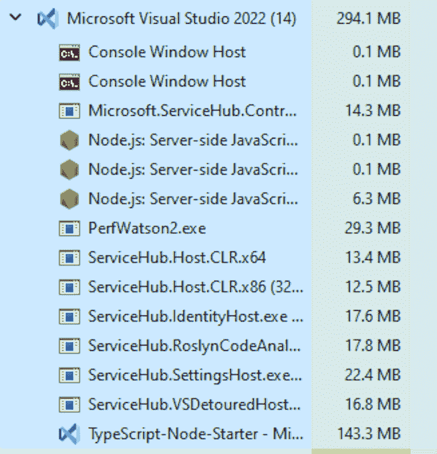

Visual Studio 最适合使用 TypeScript 和其他技术的项目。例如，如果您有一个使用. NET Web API 后端的 TypeScript 项目，您可以在一个编辑器中管理项目的两端。而且，随着最近在 [Visual Studio 2022](https://devblogs.microsoft.com/visualstudio/the-new-javascript-typescript-experience-in-vs-2022-preview-3/) 中的更新，你可以很容易地集成这些。

Visual Studio 对 TypeScript 的支持将来可能会继续改进。但是，如果您只是编写一个 TypeScript web 应用程序，这可能不是最佳选择。

### 调试能力

经过一些初始设置后，您可以设置断点并在 Visual Studio 中运行时检查您的代码，但是，这种支持不如 WebStorm 或 VS 代码好。

### Visual Studio 的利与弊

根据我们对 Visual Studio 的了解，让我们来看看它的优点:

*   许多 Windows 开发人员已经知道
*   可以撕下标签制作新的窗口
*   免费[有一些限制](https://visualstudio.microsoft.com/vs/community/#:~:text=In%20non%2Denterprise%20organizations%2C%20up,learning%20environment%20scenarios%20described%20above.)

然而，弊可能大于利:

*   没有 VS Code 或 WebStorm 快
*   基本产品不知道 npm 任务，需要插件才能工作

## 结论

在决定为 TypeScript 项目使用什么 IDE 时，我们并不缺少选择。简而言之，如果你刚刚起步，负担不起完整的 WebStorm 许可，你应该使用 VS 代码。但是，如果你正在从事更大的项目，并且能够负担得起许可费用，你绝对应该使用 WebStorm。

最后，即使您已经有了 Visual Studio，您也更适合使用另一个 IDE 来处理项目的 TypeScript 部分。在我的例子中，我通常为我的。NET API 工作，而 WebStorm 为我的 Angular 工作打开。在这种配置下，我发现它非常好用。

但是，最终，无论你用什么都取决于你自己。所以，选择一个 IDE，享受开发吧！我希望你喜欢这篇文章，如果你有任何问题，一定要留下评论。编码快乐！

## [LogRocket](https://lp.logrocket.com/blg/typescript-signup) :全面了解您的网络和移动应用

LogRocket 是一个前端应用程序监控解决方案，可以让您回放问题，就像问题发生在您自己的浏览器中一样。LogRocket 不需要猜测错误发生的原因，也不需要向用户询问截图和日志转储，而是让您重放会话以快速了解哪里出错了。它可以与任何应用程序完美配合，不管是什么框架，并且有插件可以记录来自 Redux、Vuex 和@ngrx/store 的额外上下文。

除了记录 Redux 操作和状态，LogRocket 还记录控制台日志、JavaScript 错误、堆栈跟踪、带有头+正文的网络请求/响应、浏览器元数据和自定义日志。它还使用 DOM 来记录页面上的 HTML 和 CSS，甚至为最复杂的单页面和移动应用程序重新创建像素级完美视频。

[Try it for free](https://lp.logrocket.com/blg/typescript-signup)

.