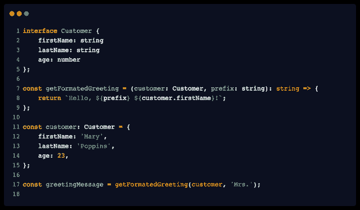
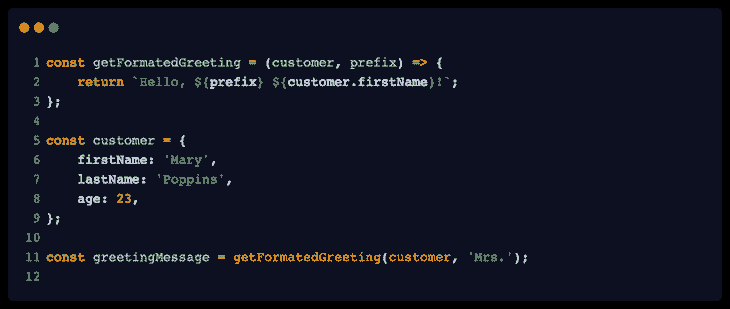
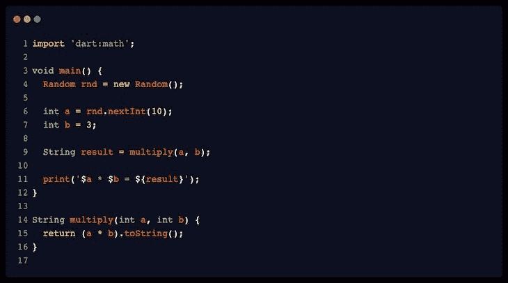
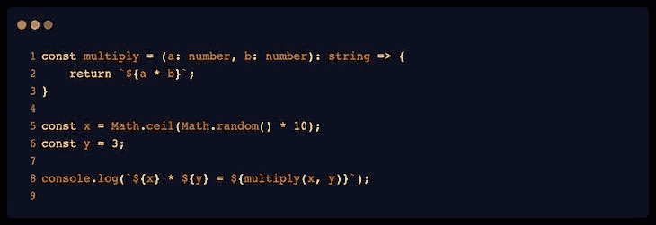
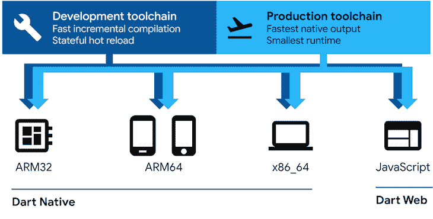

# 比较 Dart 和 TypeScript 

> 原文：<https://blog.logrocket.com/comparing-dart-typescript/>

如今，当构建应用程序时，我们可能会对旨在帮助我们将更可靠的代码交付给产品的各种工具和概念感到受宠若惊。有很多方法可以让我们对自己编写的代码更加自信。

交付可靠代码的选项之一是[静态类型](https://developer.mozilla.org/en-US/docs/Glossary/Static_typing)，这是在开发周期早期捕捉错误的好方法。静态类型允许更快的开发过程，同时帮助检查我们代码的正确性。在本文中，我们将讨论两种提供静态类型的语言: [Dart](https://dart.dev/) 和 [TypeScript](https://www.typescriptlang.org/) 。

我们将涵盖:

## 为什么是静态类型检查？

虽然本文的重点不是定义静态类型，但是重新审视一下为什么编写静态类型代码对开发体验有很大好处是很重要的。

静态类型允许我们在编译时分析变量类型，这意味着在执行你的代码之前，你将能够知道你使用变量的方式是否有错误，例如，你赋给它们什么类型的值。

这有助于减少调试运行时可能发生的错误所花费的时间，原因很简单，例如，您在代码中的某个点对保存整数值的变量调用与字符串相关的方法。

因为没有什么是不付出代价的，所以在定义具有显式类型的函数和变量时，我们应该考虑到我们必须做的额外工作。这项工作可以是多种多样的，从一些额外的击键到定义一个完整的对象结构，为其键和值指定类型，同时考虑如何组织这些类型以实现可重用性。

以下示例分别展示了在 TypeScript 和普通 JavaScript 中实现相同功能的简单代码:

## Dart 和 TypeScript 的一般特征

在静态类型化语言中，Dart 和 TypeScript 是众所周知的成熟选项，它们各有不同的特性。本文的目标不是支持哪一方，而是回顾每种语言的特性以及它们之间的比较。希望这能给你关于何时以及如何使用它们的有用见解。

Dart 由谷歌开发，于 2011 年首次宣布作为 JavaScript 的替代品。根据他们的官方网站，“Dart 是一种客户端优化语言，用于在任何平台*上开发快速应用。* *"* Dart 是一种更通用的语言，不仅为 web，也为其他面向客户端的项目，如移动应用程序，提供了编写和发布代码的优化。

从[官方 TypeScript 网站](https://www.typescriptlang.org/)，“TypeScript 是带有类型*语法的 JavaScript。**这个定义本身已经阐明了语言是什么。该语言由微软于 2012 年推出，是 JavaScript 的超集，这意味着它建立在 JavaScript 之上，并添加了新功能，如类型检查和经典面向对象编程的资源。*

 *[Dart](https://github.com/dart-lang/language) 和 [TypeScript](https://github.com/microsoft/TypeScript) 都是开源语言，托管在 GitHub 上。

根据上面简要描述的特征，人们可能会认为比较这两种语言是不合逻辑的，因为 TypeScript 是 JavaScript 的超集，而 Dart 是一种全新的脚本语言，不是建立在 JavaScript 之上的。然而，在这篇文章中，我们从它们可以成为静态类型语言的一个选项的角度来看待这两者。此外，当试图从 JavaScript 转移到一种更健壮的、专注于构建大规模应用程序的语言时，Dart 和 TypeScript 都是可以考虑的好选择。

## 按类别比较 Dart 和 TypeScript

为了便于比较，让我们选择两种语言显示差异和相似之处的几个要点。

### 多范例语言

Dart 和 TypeScript 都被认为是多范例语言，这意味着它们提供的特性允许使用包含在不止一个编程范例中的技术。

例如，在遵循函数范式时，可以使用 Dart 或 TypeScript，在函数范式中，程序是围绕应该处理不可变数据并避免共享状态的函数构建的。当您想使用面向对象的范例时也是如此，因为它们都提供了经典 OOP 编程中包含的特性，比如类、继承、封装和多态。

开发人员可能更喜欢 Dart 或 TypeScript，因为它们在实现这些功能的方式上有一些不同。Dart 中没有提供的一个例子是[方法重载](https://en.wikipedia.org/wiki/Function_overloading)，这是一种有用的技术，其中一个方法名用于多个方法，这些方法根据方法的输入实现不同的行为。

试图用 Dart 实现方法重载将需要您实现看起来不太好的变通方法。同时，TypeScript [正式支持技术](https://www.typescriptlang.org/docs/handbook/2/functions.html#function-overloads)，该技术的实现有其自身的特性和限制，比如不能为每个方法定义提供不同的主体，这迫使您在一个范围内处理不同的输入类型。

在选择 Dart 或 TypeScript 之前，您可能不仅要研究您的代码计划遵循哪种范式，还要研究每种语言中如何提供特定的功能或模式。

### Dart 和 TypeScript 语法

说到语法，如果您来自 JavaScript，Dart 可能是一个更大的飞跃。这是因为 Dart 是一种完整的编程语言，具有更强大的功能，而不是 JavaScript 的超集，这可能会导致更陡峭的学习曲线。

如果您来自 C#和 Java 之类的语言，Dart 可能是一个更合适的选择，因为它有一个与它们相似的语法。Dart 离 JavaScript 并不太远，但是学习曲线是你应该记住的。

下面分别是 Dart 和 Typescript 中相同程序的示例。两个脚本都采用一个随机整数和一个硬编码整数，将它们相乘，并打印结果:

如前所述，这两种语言都是开源的，并为投稿提供了一个友好的环境。这是需要记住和跟踪的事情，因为它告诉你开发人员有多愿意帮助改进这种语言并围绕它构建工具。

在撰写本文时，GitHub 上的 Dart [sdk 库](https://github.com/dart-lang/sdk)拥有超过 85000 个 stars，其针对该语言和 Flutter [的包库(](https://pub.dev/packages?q) [pub.dev](https://pub.dev/) )拥有超过 29000 个包。

至于 TypeScript 的 GitHub 储存库，截至发稿时，它已经有 84.7K 的星星了。对于这个比较，带有 npm 上托管的库的类型声明的 npm 包的总数是 8，803。当然，这不包括所有其他没有以“@types/”为前缀的与 TypesScript 相关的包([NPM](https://www.npmjs.com/search?q=%40types)中用于搜索的术语)。

Dart 已经变得越来越有名，特别是在发布了 [Flutter](https://flutter.dev/) 之后，这是一个开源框架，使用单一代码库帮助将代码运送到不同的平台。与 JavaScript 世界类似的是 [React Native](https://reactnative.dev/) ，它默认提供对 TypeScript 的支持。然而，在构建移动应用程序时考虑选择哪一个是一个更强大的博客帖子的主题。

### Dart 和 TypeScript 的使用和应用

如前所述，Dart 是一种通用语言，这意味着即使它围绕以客户端为中心的项目进行了优化，它也可以用于服务器端，应用于[命令行应用](https://dart.dev/tutorials/server/cmdline)和物联网项目。这里有一个[的例子](https://github.com/JobinBiju/Home-Fi)。

这是可能的，因为 Dart 具有多平台特性，可针对不同平台编译优化的代码:

当谈到 TypeScript 时，如果我们考虑到无论在什么环境中可以使用 JavaScript，也可以与 TypeScript 一起使用，那么它的使用范围很广。从构建服务器到游戏开发和智能手表应用，TypeScript 有着广泛的应用，因为它是 JavaScript 语言的一个版本，具有额外的功能。

## 结论

为您的下一个项目选择 Dart 或 TypeScript 是一个权衡您要处理的因素和项目目标的问题。它们都将为您提供开发可靠的大规模应用程序的特性。但是时间、开发者经验、社区和你正在开发的应用程序类型都是帮助你做出选择的变量。

## [LogRocket](https://lp.logrocket.com/blg/typescript-signup) :全面了解您的网络和移动应用

LogRocket 是一个前端应用程序监控解决方案，可以让您回放问题，就像问题发生在您自己的浏览器中一样。LogRocket 不需要猜测错误发生的原因，也不需要向用户询问截图和日志转储，而是让您重放会话以快速了解哪里出错了。它可以与任何应用程序完美配合，不管是什么框架，并且有插件可以记录来自 Redux、Vuex 和@ngrx/store 的额外上下文。

除了记录 Redux 操作和状态，LogRocket 还记录控制台日志、JavaScript 错误、堆栈跟踪、带有头+正文的网络请求/响应、浏览器元数据和自定义日志。它还使用 DOM 来记录页面上的 HTML 和 CSS，甚至为最复杂的单页面和移动应用程序重新创建像素级完美视频。

[Try it for free](https://lp.logrocket.com/blg/typescript-signup)

.*