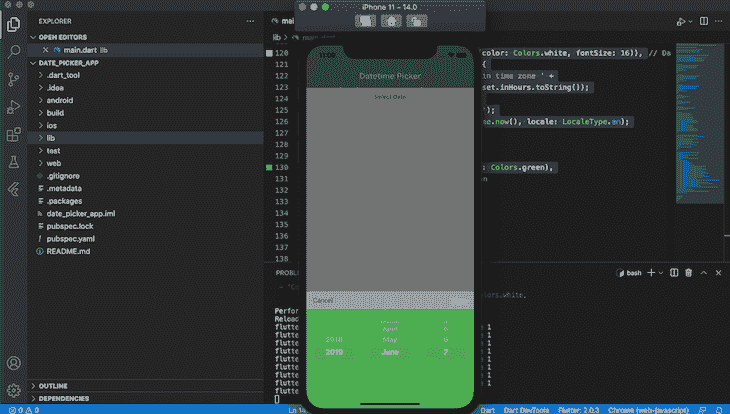
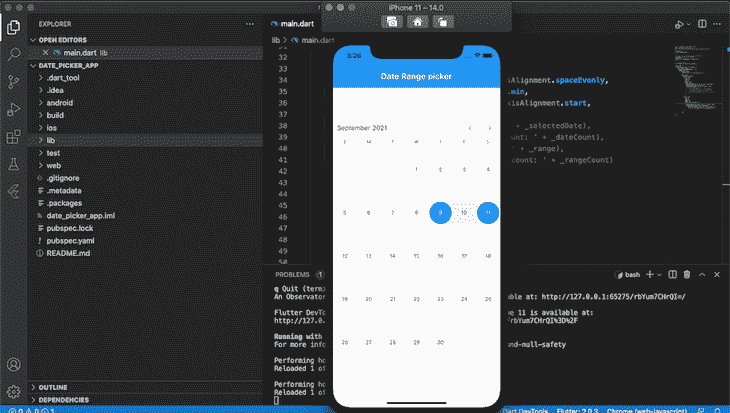
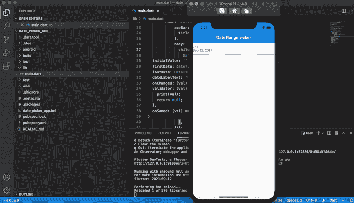
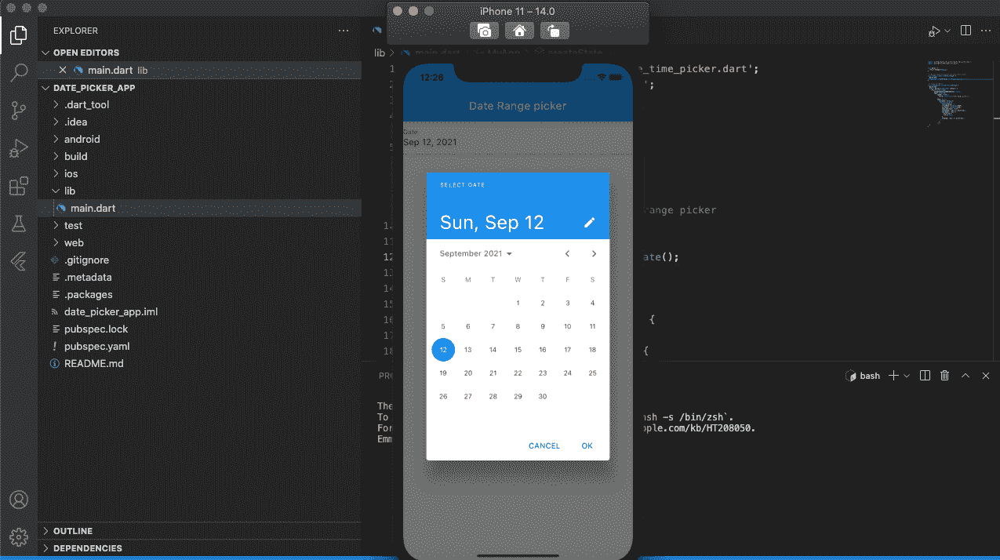

# 比较 Flutter 日期选择器库

> 原文：<https://blog.logrocket.com/comparing-flutter-date-picker-libraries/>

日期选择器是对用户界面的一个有益补充，使应用程序用户可以轻松地从日历中选择日期。无论是在注册表单中添加出生日期字段，还是为用户提供预约时间段，都可以使用日期选择器库来简化过程。

在本教程中，我们将探索三个流行的 Flutter 日期选择器库，Flutter 日期选择器、Flutter 日期范围选择器和 Flutter `date_time_picker`。我们将检查每个库的功能，并在一个简单的移动应用程序中安装每个库。

要跟随本教程，您需要:

*   安装在您机器上的颤振
*   颤振的基本知识
*   熟悉 Dart
*   您机器上安装的 Xcode 或 Android Studio
*   用于测试的 iOS 模拟器或 Android 模拟器
*   代码编辑器，即 VS 代码

我们开始吧！

## 颤动日期选择器

[Flutter Datetime Picker](https://pub.dev/packages/flutter_datetime_picker) 易于定制，支持多种语言的日期和时间选择。Flutter Datetime Picker 易于安装，并提供了一个时尚、用户友好的界面。

为了用 Flutter Datetime Picker 构建我们的日期选取器，我们将初始化一个新的 Flutter 应用程序并安装一个 Flutter Datetime Picker 包的副本。如果您使用的是 Mac，请从终端导航到您的工作目录；如果您使用的是 Windows，请从命令提示符导航到工作目录。运行下面的代码:

```
flutter create date_picker_app

```

初始化完成后，导航到`date_picker_app`文件夹并运行下面的命令来安装 Flutter Datetime 选择器包:

```
flutter pub add flutter_datetime_picker

```

现在，让我们构建一个基本的日期和时间选择器，一旦用户选择一个按钮，它就会显示出来。将以下代码添加到`main.dart`:

```
TextButton(
    onPressed: () {
        DatePicker.showDatePicker(context,
                              showTitleActions: true,
                              minTime: DateTime(2018, 3, 5),
                              maxTime: DateTime(2019, 6, 7), onChanged: (date) {
                            print('change $date');
                          }, onConfirm: (date) {
                            print('confirm $date');
                          }, currentTime: DateTime.now(), locale: LocaleType.en);
    },
    child: Text(
        'show date time picker',
        style: TextStyle(color: Colors.blue),
    ));

```

在上面的代码中，每当用户点击**显示日期时间选择器**按钮时，我们用`TextButton`触发`showDatePicker`。回想一下，该软件包附带了对多种语言的支持；在我们的例子中，我们将`currentTime`的地区设置为`LocaleType.en`，将默认语言设置为英语。

接下来，打开您的 Android 模拟器或 iOS 模拟器，使用下面的命令运行应用程序:

```
flutter run 

```

您的应用程序应该类似于下图:


Flutter Datetime Picker 也有对主题化的[支持，允许你定制颜色以获得你想要的外观和感觉。让我们通过创建一个新的带有题名`Date`的`buttonText`组件来为我们的应用程序添加定制样式。在`main.dart`文件中，将以下代码添加到新的`buttonText`组件中:](https://blog.logrocket.com/theming-your-app-flutter-guide/)

```
import 'package:flutter/material.dart';
import 'package:flutter_datetime_picker/flutter_datetime_picker.dart';
void main() => runApp(new MyApp());
class MyApp extends StatelessWidget {
  // This widget is the root of your application.
  @override
  Widget build(BuildContext context) {
    return new MaterialApp(
      title: 'Flutter Demo',
      debugShowCheckedModeBanner: false,
      theme: new ThemeData(
        primarySwatch: Colors.green,
      ),
      home: new HomePage(),
    );
  }
}
class HomePage extends StatelessWidget {
  @override
  Widget build(BuildContext context) {
    return Scaffold(
      appBar: AppBar(
        title: Text('Datetime Picker'),
      ),
      body: Center(
        child: Column(
          children: <Widget>[
            //new buttonText starts
            TextButton(
                onPressed: () {
                  DatePicker.showDatePicker(context,
                      showTitleActions: true,
                      minTime: DateTime(2018, 3, 5),
                      maxTime: DateTime(2019, 6, 7),
                      theme: DatePickerTheme(
                          headerColor: Colors.grey,
                          backgroundColor: Colors.green,
                          itemStyle: TextStyle(
                              color: Colors.white,
                              fontWeight: FontWeight.bold,
                              fontSize: 18),
                          doneStyle:
                              TextStyle(color: Colors.white, fontSize: 16)),
                      onChanged: (date) {
                    print('change $date in time zone ' +
                        date.timeZoneOffset.inHours.toString());
                  }, onConfirm: (date) {
                    print('confirm $date');
                  }, currentTime: DateTime.now(), locale: LocaleType.en);
                },
                child: Text(
                  'Date with theme',
                  style: TextStyle(color: Colors.green),
                )),
              //new buttonText ends.
          ],
        ),
      ),
    );
  }
}

```

通过在终端或命令提示符下按下 **r** 来重启你的应用程序。现在，当你点击主题为的**日期按钮时，你的应用程序应该类似于下面的截图:**



## Flutter 日期范围选择器

使用 [Flutter 日期范围选择器](https://pub.dev/packages/syncfusion_flutter_datepicker)，用户可以轻松选择单个日期、多个日期或一个日期范围。要限制日期选择，您可以设置最小或最大天数供用户选择。您还可以封锁或限制日期，以防止用户选择它们。

要使用 Flutter 日期范围选择器创建日期选择器，首先，通过在终端或命令提示符下运行以下代码来安装小部件:

```
flutter pub add syncfusion_flutter_datepicker

```

安装完成后，用下面的代码更新`main.dart`文件:

```
import 'package:flutter/material.dart';
import 'package:intl/intl.dart';
import 'package:syncfusion_flutter_datepicker/datepicker.dart';
void main() {
  return runApp(MyApp());
}
/// My app class to display the date range picker
class MyApp extends StatefulWidget {
  @override
  MyAppState createState() => MyAppState();
}
/// State for MyApp
class MyAppState extends State<MyApp> {
  @override
  Widget build(BuildContext context) {
    return MaterialApp(
      debugShowCheckedModeBanner: false,
        home: Scaffold(
            appBar: AppBar(
              title: const Text('Date Range picker'),
            ),
            body: Stack(
              children: <Widget>[
                Positioned(
                  left: 0,
                  right: 0,
                  top: 0,
                  height: 80,
                  child: Column(
                    mainAxisAlignment: MainAxisAlignment.spaceEvenly,
                    mainAxisSize: MainAxisSize.min,
                    crossAxisAlignment: CrossAxisAlignment.start,
                  ),
                ),
                Positioned(
                  left: 0,
                  top: 80,
                  right: 0,
                  bottom: 0,
                  child: SfDateRangePicker(
                    selectionMode: DateRangePickerSelectionMode.range,
                    initialSelectedRange: PickerDateRange(
                        DateTime.now().subtract(const Duration(days: 4)),
                        DateTime.now().add(const Duration(days: 3))),
                  ),
                )
              ],
            )));
  }
}

```

`SfDateRangePicker`类的第一个参数`selectionMode`表示要显示的日期类型。在本例中，我们显示了一个`range`，但是，您可以选择显示一个`single`日期。

第二个参数`initialSelectedRange`负责默认选定的日期。我们使用`DateTime`类创建日期范围。

您的应用程序应该类似于下面的截图:



只用几行代码，我们就创建了一个有组织的日期选择器，它有一个令人愉快的 UI。

## 颤动`date_time_picker`

`[date_time_picker](https://pub.dev/packages/date_time_picker)`是一个 Flutter 小部件，使用文本表单字段显示日期和时间。

通过在终端或命令提示符下运行以下代码来安装软件包:

```
flutter pub add date_time_picker

```

要用 Flutter `date_time_picker`创建一个简单的日期选择器，只需添加下面的代码:

```
DateTimePicker(
  initialValue: '',
  firstDate: DateTime(2000),
  lastDate: DateTime(2100),
  dateLabelText: 'Date',
  onChanged: (val) => print(val),
  validator: (val) {
    print(val);
    return null;
  },
  onSaved: (val) => print(val),
);

```

在上面的代码片段中，我们利用了`DateTimepicker`类。`initialValue`保存`date`文本字段的值。`firstDate`是日历开始显示的年份，而`lastDate`是日历结束的最后一年。

既然我们理解了`date_time_picker`包的基本原理，让我们构建并定制我们自己的包。要创建日期和时间选择器对话框，请用下面的代码替换您的`main.dart`文件中的代码:

```
import 'package:date_time_picker/date_time_picker.dart';
import 'package:flutter/material.dart';

void main() {
  return runApp(MyApp());
}
/// My app class to display the date range picker
class MyApp extends StatefulWidget {
  @override
  MyAppState createState() => MyAppState();
}
/// State for MyApp
class MyAppState extends State<MyApp> {
  @override
  Widget build(BuildContext context) {
    return MaterialApp(
        debugShowCheckedModeBanner: false,
        home: Scaffold(
            appBar: AppBar(
              title: const Text('Date Range picker'),
            ),
            body: Stack(
              children: <Widget>[
                DateTimePicker(
                  initialValue: '',
                  firstDate: DateTime(2000),
                  lastDate: DateTime(2100),
                  dateLabelText: 'Date',
                  onChanged: (val) => print(val),
                  validator: (val) {
                    print(val);
                    return null;
                  },
                  onSaved: (val) => print(val),
                )
              ],
            )));
  }
}

```

您的应用程序应该类似于下面的屏幕截图:



当您点击`date`文本字段时，您应该会看到一个类似于下面截图的日历对话框:



## 结论

在研究了三个流行的 Flutter 日期选择器库之后，您现在应该能够选择一个最适合您需求的库，并将其安装到您自己的应用程序中。虽然这些工具是相似的，但正确的选择可能取决于您项目的独特性质。

例如，如果您的应用程序使用英语以外的语言，那么使用 Flutter Datetime Picker 可能会更好。要轻松限制日期选择，Flutter 日期范围选择器是一个不错的选择。

这三个工具都提供了有组织的、有吸引力的、可定制的界面，您可以在几分钟内完成设置。

## 使用 [LogRocket](https://lp.logrocket.com/blg/signup) 消除传统错误报告的干扰

[](https://lp.logrocket.com/blg/signup)

[LogRocket](https://lp.logrocket.com/blg/signup) 是一个数字体验分析解决方案，它可以保护您免受数百个假阳性错误警报的影响，只针对几个真正重要的项目。LogRocket 会告诉您应用程序中实际影响用户的最具影响力的 bug 和 UX 问题。

然后，使用具有深层技术遥测的会话重放来确切地查看用户看到了什么以及是什么导致了问题，就像你在他们身后看一样。

LogRocket 自动聚合客户端错误、JS 异常、前端性能指标和用户交互。然后 LogRocket 使用机器学习来告诉你哪些问题正在影响大多数用户，并提供你需要修复它的上下文。

关注重要的 bug—[今天就试试 LogRocket】。](https://lp.logrocket.com/blg/signup-issue-free)