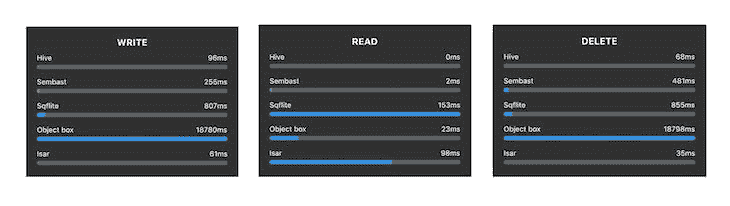
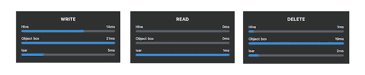
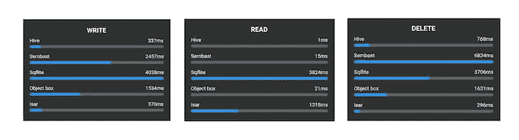
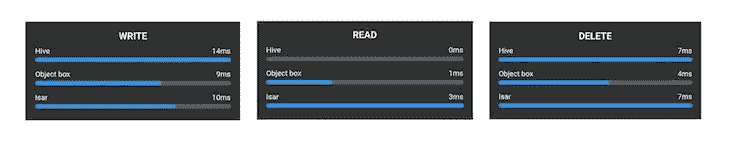

# 将 Hive 与其他 Flutter 应用程序数据库选项进行比较

> 原文：<https://blog.logrocket.com/comparing-hive-other-flutter-app-database-options/>

在今天总是在线的世界里，仍然有很多离线存储数据的用例；尤其是涉及到移动开发的时候，但是应该用哪个数据库呢？

在 Flutter 中，如果您需要一个离线数据库解决方案，您有一系列选项可以选择。您最终选择哪个选项取决于您，但是有一些因素会影响这个决定(除了它们可能提供的独特功能之外)，这些因素通常归结为入门的简单程度和它们的速度，这两者我们都将在本文中讨论。

在这篇博客文章中，我们将看看 Hive 和其他[数据库](https://blog.logrocket.com/choosing-right-database-flutter-application/)的设置是如何工作的，并比较和对比每个数据库预期具有的基本功能(特别是 CRUD，即创建、读取、更新、删除)。

我们将进行一些基准测试，以确定每个数据库选项执行这些操作需要多长时间，因此您可以清楚地了解哪个数据库选项适合您的 Flutter 应用程序项目，Hive 或其他。

让我们开始吧。

## create, read, update, and delete

前面提到的 CRUD 操作将使用一个`User`对象来执行，即将 *n* 个用户对象写入数据库等。这是用户对象的样子:

```
class UserModel {
  final int id;
  final DateTime createdAt;
  final String username;
  final String email;
  final int age;

  UserModel(...);

  factory UserModel.fromMap(Map<String, dynamic> map) {
    return UserModel(...);
  }
  Map<String, dynamic> toMap() {
    return {...};
  }
}

```

要在应用程序中使用离线数据库，首先要做的是获取应用程序目录的位置，数据库将存储在该目录中。Flutter `path_provider`和`path`包可用于轻松检索这些信息:

```
import 'package:path_provider/path_provider.dart';
import 'package:path/path.dart' as path;

final dir = await getApplicationDocumentsDirectory();
// For hive, isar and objectbox
final dbPath = dir.path;
// For sembast and sqflite
final dbPath = path.join(dir.path, 'databaseName.db');

```

## 储备

Hive 是纯 Dart 编写的键值数据库，没有原生依赖。这使得它真正跨平台，因为它能够在所有支持 Dart 编程语言的平台上运行。

应用程序启动后，通常会立即初始化数据库。一旦您有了存储数据库的路径，初始化配置单元数据库就像调用:

```
Hive.init(dbPath);

```

要使用 Hive 执行 CRUD 操作，需要一个`Box`实例。

```
final box = await Hive.openBox('users');

```

要向数据库添加/更新用户(创建/更新)，您必须向`put()`方法提供一个惟一的键和值:

```
final user = UserModel(...);
await box.put(user.id, user.toMap());

```

要从数据库中获取一个用户(Read ),只需使用提供的密钥请求用户，如下所示:

```
final userMap = box.get(user.id);
return UserModel.fromMap(userMap);

```

要从数据库中删除一个用户(delete ),需要将键传递给`delete`方法。

```
final user = UserModel(...);
await box.delete(user.id);

```

## 森巴特

Sembast 是一个 NoSQL 数据库，它使用一个文本文档，其中每个条目都是一个 JSON 对象。Sembast 使构建反应式应用程序变得容易，因为当文档发生变化时，您可以监听并触发某些操作。

准备好数据库路径后，您可以通过调用以下命令来初始化数据库:

```
final db = await databaseFactoryIo.openDatabase(dbPath);

```

要使用 Sembast 执行 CRUD 操作，需要一个`StoreRef`实例:

```
final store = StoreRef('users');

```

要向数据库添加/更新用户，您必须向`record`函数传递一个键，并链接`put`方法，该方法将数据库和值作为参数:

```
final user = UserModel(...);
await store.record(user.id).put(db, user.toMap());

```

要从数据库中获取用户，必须将密钥传递给`record`并链接`get`方法:

```
final userMap = await store.record(user.id).get(db);
return UserModel.fromMap(userMap);

```

要从数据库中删除一个用户，需要将键传递给`record`并链接`delete`方法:

```
final user = UserModel(...);
await store.record(user.id).delete(db);

```

## Sqflite

Sqflite 是一个 SQL 数据库，它提供了编写原始 SQL 命令的能力，当您知道该做什么时，这些命令是非常强大的。您还可以选择使用帮助函数。

准备好数据库路径后，通过执行以下操作初始化数据库并创建一个表来存储用户:

```
static const String USER_TABLE = "users";
final db = await openDatabase(
      dbPath,
      onCreate: (db, version) async {
        await db.execute(
          'CREATE TABLE $USER_TABLE (id TEXT PRIMARY KEY, createdAt TEXT, 
          username TEXT, email TEXT, age INTEGER)',
        );
      },
      version: 1,
    );

```

要向数据库添加/更新用户，您必须传递要插入到`insert`或`update`助手函数中的表名和值。

```
final user = UserModel(...);
await db.insert(USER_TABLE, user.toMap());
// to update the user defined above
await db.update(USER_TABLE, user.toMap(), where: "id = ?", whereArgs: [user.id]);

```

要从数据库中获取用户，可以使用查询字符串进行搜索。这将返回一个匹配列表，以及一个惟一的用户 ID；它应该返回一个只包含一个项目的地图:

```
final users = await db.query(USER_TABLE, where: "id = ?", whereArgs: [user.id]);
return UserModel.fromMap(users.first);

```

要从数据库中删除一个用户，需要传递给`delete`方法、表名和一个查询字符串来标识要删除的用户:

```
final user = UserModel(...);
await db.delete(USER_TABLE, where: "id = ?", whereArgs: [user.id]);

```

要继续使用 Isar 和 ObjectBox，我们将需要项目的更多依赖项，因为它们都使用类型注释和代码生成，这使您能够直接向数据库读取/写入 Dart 对象(Hive 也提供了这一选项)。

## information storage and retrieval 信息存储和检索

Isar 是一个功能丰富的离线数据库，具有强大的查询、过滤和排序功能。

你也可以用它来构建非常被动的应用程序，因为它能够监听数据的变化。对于 Isar，依赖项和模型类看起来是这样的:

```
dependencies:
  ...
  isar: $latest
  isar_flutter_libs: $latest
dev_dependencies:
  ...
  build_runner: $latest
  isar_generator: $latest

```

```
import 'package:isar/isar.dart';
part 'isar_user.g.dart';

@Collection() // Anotate the user model using Collection()
class UserModel {
  int id;
  ...
  UserModel(...);
}

```

要获得自动生成的代码，只需运行`flutter pub run build_runner build`。

准备好数据库路径后，通过调用以下命令初始化数据库:

```
final isar = await Isar.open(
        schemas: [UserModelSchema], // A list of anotated collections
        directory: dbPath,
      );

```

要向数据库添加/更新用户，您必须将用户模型直接传递给`put`方法:

```
final user = UserModel(...);
isar.writeTxn((isar) async {
  await isar.isarUserModels.put(user);
}

```

要从数据库中获取一个用户，可以使用`get`方法，该方法获取用户的`id`:

```
final user = await isar.isarUserModels.get(user.id);

```

要从数据库中删除一个用户，可以使用`delete`方法，该方法获取用户的`id`:

```
isar.writeTxn((isar) async {
  await isar.isarUserModels.delete(user.id);
}

```

## ObjectBox

ObjectBox 是一个用纯 Dart 编写的 NoSQL 数据库。对于 ObjectBox，这是依赖项和模型类的样子:

```
dependencies:
  ...
  objectbox: $latest
  objectbox_flutter_libs: $latest
dev_dependencies:
  ...
  build_runner: $latest
  objectbox_generator: $latest

```

```
@Entity() // Anotate the user model using Entity()
class UserModel {
  int id;
  ...
  UserModel(...);
}

```

要获得自动生成的代码，只需运行`flutter pub run build_runner build`，与 Isar 完全相同。准备好数据库路径后，您可以通过调用以下命令来初始化数据库:

```
final store = await openStore(directory: dbPath);
final box = store.box<UserModel>();

```

要向数据库添加/更新用户，您必须将`UserModel`直接传递给`put`方法:

```
final user = UserModel(...);
box.put(user);;

```

要从数据库中获取一个用户，可以使用`get`方法，该方法获取用户的`id`:

```
final user = box.get(user.id);

```

要从数据库中删除一个用户，可以使用`remove`方法，该方法获取用户的`id`;

```
box.remove(user.id);
```

## 基准测试结果

首先，我们将查看每个数据库选项执行 *n* 次写入、读取和删除需要多长时间。

其次，考虑到这些数据库选项(Hive、Isar 和 ObjectBox)中的一些有更优化的方法来执行 CRUD 操作——比如使用单一方法写入、读取或删除多个项目——我们还将看看从数据库中写入、读取和删除 *n* 个用户需要多长时间。

```
final users = [UserModel(...), UserModel(...), UserModel(...)];
// Hive
box.putAll(data), .deleteAll(userIds)
// Isar
isar.isarUserModels.putAll(users), .getAll(userIds), .deleteAll(userIds)
// Objectbox
box.putMany(users), .getMany(userIds), .removeMany(userIds)

```

第三，由于不同设备操作系统上的差异，基准测试将在 Android 和 iOS 物理设备上进行，同时在发布模式下运行以获得最佳性能。

## iOS v15.6 (iPhone 12)

以下是在运行 iOS v15.6 的 iPhone 12 上以发布模式运行[项目](https://github.com/o-ifeanyi/db_benchmarks)时获得的基准测试结果。

下面是执行 1，000 次单独的写入、读取和删除操作时连续 10 次运行的结果(时间单位为毫秒)。

### 写

|  | 平均值(毫秒) |  |  |  |  |  |  |  |  |  |  |
| --- | --- | --- | --- | --- | --- | --- | --- | --- | --- | --- | --- |
| information storage and retrieval 信息存储和检索 | 65 | 73 | 68 | 68 | 71 | 69 | 73 | 69 | 68 | 70 | 69.7 |
| 储备 | 86 | 85 | 97 | 93 | 91 | 87 | 85 | 90 | 91 | 100 | 90.5 |
| 森巴斯特 | 241 | 252 | 263 | 257 | 258 | 240 | 236 | 253 | 257 | 246 | 250.3 |
| Sqflite | 774 | 653 | 665 | 697 | 757 | 757 | 769 | 836 | 758 | 819 | 751.2 |
| ObjectBox | 18686 | 18705 | 18806 | 18790 | 18767 | 18724 | 18763 | 18717 | 18739 | 18744 | 18744.1 |

### 阅读

|  | 平均值(毫秒) |  |  |  |  |  |  |  |  |  |  |
| --- | --- | --- | --- | --- | --- | --- | --- | --- | --- | --- | --- |
| 储备 | 0 | 0 | 0 | 0 | 0 | 0 | 0 | 0 | 0 | 0 | 0.0 |
| 森巴斯特 | 2 | 2 | 2 | 2 | 2 | 2 | 2 | 2 | 2 | 2 | 2.0 |
| ObjectBox | 14 | 24 | 24 | 23 | 30 | 24 | 24 | 24 | 23 | 23 | 23.3 |
| information storage and retrieval 信息存储和检索 | 103 | 99 | 98 | 116 | 99 | 98 | 111 | 98 | 98 | 108 | 102.8 |
| Sqflite | 135 | 133 | 136 | 151 | 134 | 132 | 133 | 131 | 155 | 140 | 138.0 |

### 删除

| 平均值(毫秒) | Avg (ms) |  |  |  |  |  |  |  |  |  | information storage and retrieval 信息存储和检索 |
| --- | --- | --- | --- | --- | --- | --- | --- | --- | --- | --- | --- |
| 41 | 32 | 33 | 34 | 36 | 32 | 34 | 33 | 36 | 36 | 34.7 | 储备 |
| 73 | 86 | 73 | 78 | 92 | 76 | 80 | 64 | 65 | 71 | 75.8 | 森巴斯特 |
| 485 | 507 | 491 | 481 | 503 | 491 | 497 | 523 | 503 | 515 | 499.6 | Sqflite |
| 733 | 750 | 743 | 741 | 748 | 743 | 749 | 754 | 842 | 830 | 763.3 | ObjectBox |
| 18771 | 18784 | 18684 | 18698 | 18761 | 18680 | 18738 | 18683 | 18744 | 18739 | 18782.2 |  |

下面是使用优化的方法(针对 Hive、Isar 和 ObjectBox)写入、读取和删除 1，000 个用户时，连续 10 次运行的结果(以毫秒为单位的时间)。

写

### Write

| 平均值(毫秒) | Avg (ms) |  |  |  |  |  |  |  |  |  | information storage and retrieval 信息存储和检索 |
| --- | --- | --- | --- | --- | --- | --- | --- | --- | --- | --- | --- |
| 6 | 3 | 6 | 5 | 七 | 5 | 5 | 5 | 5 | 6 | 5.3 | 储备 |
| 14 | 16 | 12 | 15 | 15 | 17 | 15 | 15 | 14 | 13 | 14.6 | ObjectBox |
| 20 | 19 | 23 | 18 | 19 | 23 | 20 | 20 | 19 | 20 | 20.1 | 阅读 |

### Read

| 平均值(毫秒) | Avg (ms) |  |  |  |  |  |  |  |  |  | 储备 |
| --- | --- | --- | --- | --- | --- | --- | --- | --- | --- | --- | --- |
| 0 | 0 | 0 | 0 | 0 | 0 | 0 | 0 | 0 | 0 | 0.0 | 对象框 |
| 0 | 0 | 0 | 0 | 0 | 0 | 0 | 0 | 0 | 0 | 0.0 | information storage and retrieval 信息存储和检索 |
| 一 | 0 | 一 | 一 | 0 | 一 | 一 | 一 | 一 | 一 | 0.8 | 删除 |

### Delete

| 平均值(毫秒) | Avg (ms) |  |  |  |  |  |  |  |  |  | 储备 |
| --- | --- | --- | --- | --- | --- | --- | --- | --- | --- | --- | --- |
| 一 | 一 | 一 | 2 | 一 | 一 | 一 | 一 | 2 | 2 | 1.3 | information storage and retrieval 信息存储和检索 |
| 一 | 3 | 一 | 2 | 一 | 一 | 一 | 一 | 2 | 四 | 1.7 | ObjectBox |
| 19 | 19 | 21 | 19 | 19 | 20 | 18 | 19 | 19 | 18 | 19.1 |  |

安卓 11 (Galaxy A31)

## 以下基准测试结果是在运行 Android 11 的三星 Galaxy A31 上以发布模式运行项目时获得的。

下面是执行 1，000 次单独的写入、读取和删除操作时，连续 10 次运行的结果(时间单位为毫秒)。

写

### Write

| 平均值(毫秒) | Avg (ms) |  |  |  |  |  |  |  |  |  | 储备 |
| --- | --- | --- | --- | --- | --- | --- | --- | --- | --- | --- | --- |
| 322 | 321 | 322 | 402 | 380 | 287 | 340 | 303 | 300 | 320 | 329.7 | information storage and retrieval 信息存储和检索 |
| 382 | 431 | 311 | 351 | 346 | 377 | 323 | 363 | 262 | 363 | 350.9 | ObjectBox |
| 1614 | 1525 | 1608 | 1502 | 1473 | 1522 | 1583 | 1522 | 1619 | 1521 | 1548.9 | 森巴斯特 |
| 2666 | 2352 | 2600 | 2507 | 2416 | 2297 | 2712 | 2641 | 2399 | 2508 | 2509.8 | Sqflite |
| 3968 | 5281 | 4122 | 3448 | 3767 | 3641 | 4280 | 3609 | 3828 | 4026 | 3997.0 | 阅读 |

### 平均值(毫秒)

|  | Avg (ms) |  |  |  |  |  |  |  |  | 储备 | 一 |
| --- | --- | --- | --- | --- | --- | --- | --- | --- | --- | --- | --- |
| 一 | 一 | 一 | 一 | 一 | 一 | 一 | 一 | 一 | 1.0 | 森巴斯特 | 17 |
| 17 | 16 | 16 | 18 | 17 | 16 | 17 | 15 | 15 | 16.4 | ObjectBox | 18 |
| 22 | 19 | 17 | 21 | 18 | 20 | 20 | 17 | 10 | 19.2 | information storage and retrieval 信息存储和检索 | 1142 |
| 1497 | 1380 | 1162 | 1305 | 1200 | 1240 | 1194 | 1206 | 1349 | 1267.5 | Sqflite | 3148 |
| 3275 | 3209 | 2696 | 2691 | 2723 | 2731 | 2660 | 2680 | 2654 | 2846.7 | 删除 | 2846.7 |

### 平均值(毫秒)

|  | Avg (ms) |  |  |  |  |  |  |  |  | information storage and retrieval 信息存储和检索 | 358 |
| --- | --- | --- | --- | --- | --- | --- | --- | --- | --- | --- | --- |
| 380 | 322 | 347 | 354 | 375 | 341 | 321 | 318 | 353 | 346.9 | 储备 | 763 |
| 873 | 860 | 721 | 879 | 801 | 848 | 819 | 868 | 772 | 820.4 | ObjectBox | 1566 |
| 1740 | 1580 | 1574 | 1650 | 2167 | 1575 | 1546 | 1586 | 1572 | 1655.6 | Sqflite | 3896 |
| 4026 | 3946 | 3878 | 3610 | 3889 | 3558 | 4315 | 3554 | 3509 | 3818.1 | 森巴斯特 | 6349 |
| 6729 | 7375 | 6575 | 6585 | 6980 | 6321 | 6770 | 6256 | 6756 | 6689.0 |  | 下面是使用优化的方法(针对 Hive、Isar 和 ObjectBox)写入、读取和删除 1，000 个用户时，连续 10 次运行的结果(以毫秒为单位的时间)。 |

写

Below are the results (time in milliseconds) from 10 consecutive runs when optimized methods are used (for Hive, Isar, and ObjectBox) to write, read, and delete 1,000 users.

### 平均值(毫秒)

|  | Avg (ms) |  |  |  |  |  |  |  |  | 对象框 | 四 |
| --- | --- | --- | --- | --- | --- | --- | --- | --- | --- | --- | --- |
| 6 | 6 | 10 | 5 | 四 | 5 | 5 | 5 | 5 | 五点五 | 伊莎贝 | 9 |
| 10 | 9 | 9 | 8 | 7 | 7 | 9 | 7 | 8 | 八点三分 | 他妈的 | 14 |
| 20 | 18 | 14 | 13 | 16 | 15 | 14 | 16 | 13 | 15.3 | 阅读 | 平均值(毫秒) |

### Read

|  | Avg (ms) |  |  |  |  |  |  |  | 储备 | 0 | 0 |
| --- | --- | --- | --- | --- | --- | --- | --- | --- | --- | --- | --- |
| 0 | 0 | 0 | 0 | 0 | 0 | 0 | 0 | 0.0 | 对象框 | 一 | 一 |
| 一 | 一 | 一 | 一 | 一 | 一 | 一 | 一 | 1.0 | information storage and retrieval 信息存储和检索 | 6 | 七 |
| 3 | 5 | 6 | 四 | 6 | 四 | 3 | 四 | 4.8 | 删除 | 4 | 平均值(毫秒) |

### ObjectBox

| 3 | 2 | 2 | 2 | 3 | 3 | 2 | 2 | 3 | 3 | 2.5 | Hive |
| --- | --- | --- | --- | --- | --- | --- | --- | --- | --- | --- | --- |
| 5 | 6 | 7 | 5 | 5 | 七 | 5 | 6 | 6 | 四 | 5.6 | information storage and retrieval 信息存储和检索 |
| 8 | 8 | 5 | 四 | 四 | 5 | 5 | 8 | 9 | 3 | 5.9 |  |
| **最终结果** | 对于 iOS 上的写操作，Isar 是最快的。平均在 69.7 毫秒内执行 1，000 次单独的写入操作，平均在 5.3 毫秒内写入 1，000 个用户 | 与此同时，在 Android 上，Hive 是最快的，在执行 1，000 个单独的写操作时平均为 329.7 毫秒——尽管经过优化，ObjectBox 能够在 5.5 毫秒内将 1，000 个用户写入数据库，比 Hive(15.3 毫秒)和 Isar(8.3 毫秒)都要好。 | 对于读取操作，Hive 在 iOS 和 Android 上都是最快的。平均在 0 毫秒(不到 1 毫秒)内执行 1，000 个单独的读取操作和读取 1，000 个用户。ObjectBox 在 iOS 上平均 0 毫秒，在 Android 上平均 1 毫秒，读取 1000 个用户，但在 iOS 上平均 23.3 毫秒，在 Android 上平均 19.2 毫秒，执行 1000 个单独的读取操作。 | 对于删除操作，Isar 在 iOS 和 Android 上都是最快的。在 iOS 上执行 1，000 次单独删除操作的平均时间为 34.7 毫秒，在 Android 上为 346.9 毫秒。Hive 在 iOS 上删除 1，000 个用户(平均 1.3 毫秒)时的性能略好于 Isar(平均 1.7 毫秒)，而在 Android 上。从数据库中删除 1，000 个用户时，ObjectBox 是最快的，平均为 2.5 毫秒 | 结论 | 对于讨论的所有选项，设置都非常简单，所以易用性可能归结于语法偏好，在我个人看来是 Hive。Isar 和 ObjectBox 可能需要额外的设置，但确实允许您直接向数据库读写 Dart 对象(Hive 也为此提供了一个选项，带有相同的注释和代码生成的额外设置)。 | 感谢你在我的实验中坚持到底——我希望这篇文章能帮助你决定哪个 Flutter 应用数据库最适合你的项目。如果你想自己运行基准测试，为了方便起见，这里有 GitHub 上项目的[链接。](https://github.com/o-ifeanyi/db_benchmarks) | 使用 [LogRocket](https://lp.logrocket.com/blg/signup) 消除传统错误报告的干扰 | [LogRocket](https://lp.logrocket.com/blg/signup) 是一个数字体验分析解决方案，它可以保护您免受数百个假阳性错误警报的影响，只针对几个真正重要的项目。LogRocket 会告诉您应用程序中实际影响用户的最具影响力的 bug 和 UX 问题。 | 然后，使用具有深层技术遥测的会话重放来确切地查看用户看到了什么以及是什么导致了问题，就像你在他们身后看一样。 | LogRocket 自动聚合客户端错误、JS 异常、前端性能指标和用户交互。然后 LogRocket 使用机器学习来告诉你哪些问题正在影响大多数用户，并提供你需要修复它的上下文。 |

关注重要的 bug—[今天就试试 LogRocket】。](https://lp.logrocket.com/blg/signup-issue-free)

## **Final results**

For write operations on iOS, Isar was the fastest. Performing 1,000 individual write operations in an average of 69.7ms and writing 1,000 users in an average of 5.3ms.

On Android, meanwhile, Hive was the fastest with an average of 329.7ms when performing 1,000 individual write operations — though, when optimized, ObjectBox was able to write 1,000 users to the database in 5.5ms, performing better than both Hive (15.3ms) and Isar (8.3ms).

For read operations, Hive was the fastest on both iOS and Android. Performing both 1,000 individual read operations and reading 1,000 users in an average of 0ms (less than 1ms). ObjectBox also read 1,000 users in an average of 0ms on iOS and 1ms on Android, but performed 1,000 individual read operations in an average of 23.3ms on iOS and 19.2ms on Android.

For delete operations, Isar was the fastest on both iOS and Android. Performing 1,000 individual delete operations in an average of 34.7ms on iOS and 346.9 on Android. Hive performed slightly better when deleting 1,000 users (average of 1.3ms) as compared to Isar (average of 1.7ms) on iOS while on Android. ObjectBox was the fastest when deleting 1,000 users from the database, with an average of 2.5ms.

## Conclusion

Setup was quite straightforward for all options discussed, so ease of use probably comes down to syntax preference, which in my personal opinion would be Hive. Isar and ObjectBox might require extra setup, but do allow you to read and write Dart objects directly to the database (Hive also provides an option for this, with the same extra setup of annotations and code generation).

Thank you for making it to the bottom of my experiment — I hope this article has helped you come to a decision about which Flutter app database works best for your project. If you would like to run the benchmarks yourself, here’s the [link to the project](https://github.com/o-ifeanyi/db_benchmarks) on GitHub for your convenience.

## Cut through the noise of traditional error reporting with [LogRocket](https://lp.logrocket.com/blg/signup)

[](https://lp.logrocket.com/blg/signup)

[LogRocket](https://lp.logrocket.com/blg/signup) is a digital experience analytics solution that shields you from the hundreds of false-positive errors alerts to just a few truly important items. LogRocket tells you the most impactful bugs and UX issues actually impacting users in your applications.

Then, use session replay with deep technical telemetry to see exactly what the user saw and what caused the problem, as if you were looking over their shoulder.

LogRocket automatically aggregates client side errors, JS exceptions, frontend performance metrics, and user interactions. Then LogRocket uses machine learning to tell you which problems are affecting the most users and provides the context you need to fix it.

Focus on the bugs that matter — [try LogRocket today](https://lp.logrocket.com/blg/signup-issue-free).