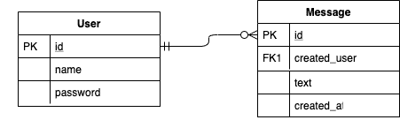
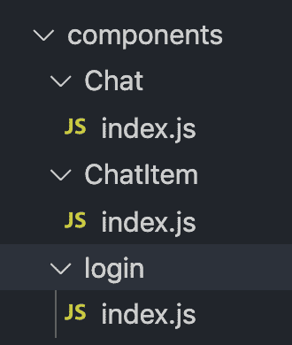

# 比较 GraphQL 的钩子库

> 原文：<https://blog.logrocket.com/comparing-hooks-libraries-for-graphql/>

React 挂钩是有状态函数，用于维护功能组件中的状态。基本上，它们通过将复杂的 React 组件分解成更小的功能块来实现。

React 类组件的主要问题是需要维护大量的抽象，比如高阶组件(hoc)和渲染道具。React 钩子将逻辑作为一个函数来维护，不需要封装它。

看看下面的例子。

> LucaColonnello 使用 react、react-dom、react-scripts 编写的类与 React 挂钩

GraphQL 是一种数据查询语言，它只获取自己需要的数据，而不是从 API 获取所有数据。它有两个操作:[查询](https://blog.logrocket.com/graphql-queries-in-simple-terms/)和[突变](https://blog.logrocket.com/robust-graphql-mutations-the-relay-way/)。对于实时数据，GraphQL 使用了一个叫做[订阅](https://blog.logrocket.com/graphql-subscriptions-with-node-js/)的概念。

有两大 React 钩子库:`[graphql-hooks](https://github.com/nearform/graphql-hooks)`和`[apollo/react-hooks](https://www.apollographql.com/docs/react/api/react-hooks/)`。为了帮助您确定哪个库最适合您的下一个 GraphQL 项目，让我们比较它们，检查它们的特性，并权衡利弊。

## 项目场景

我们将快速启动一个项目，以方便我们进行比较。让我们实现一个聊天应用程序，使用户能够登录并发送群发消息。


### **后端设置**

我不会在后端上花太多时间，但这里可以快速浏览一下我是如何为这个应用程序设置它的:



基本上，我使用 [Hasura](https://blog.logrocket.com/building-a-product-hunt-clone-app-using-hasura-and-next-js/) 来建立 GraphQL 和一个 [Postgres 数据库](https://blog.logrocket.com/getting-started-with-postgres-in-your-react-app/)。这个易于使用的工具使您能够在几分钟内创建一个后端。

我们的后端包含两个表:

*   用户，包括关于用户的信息
*   消息，存储所有用户的消息

后端网址为[https://hasura-infite-loader . heroku app . com/v1 alpha 1/graph QL](https://hasura-infiite-loader.herokuapp.com/v1alpha1/graphql)；WebSocket 的 URL 是 ws://hasura-infite-loader . heroku app . com/v1 alpha 1/graph QL。

## 阿波罗和反应钩

要使用 Apollo、React Hooks 和 React 实现我们的应用程序，我们必须首先使用下面的命令建立一个 React 项目。

```
npx create-react-app apollo-react-hook-example

```

之后，安装`@apollo/react-hooks`包的所有依赖项。

```
npm install @apollo/react-hooks apollo-client apollo-link-http apollo-link-ws apollo-link apollo-utilities apollo-cache-inmemory subscriptions-transport-ws

```

那可是好多包啊！让我们一个一个地分解它们。

*   `[@apollo/react-hooks](https://www.apollographql.com/docs/react/api/react-hooks/)`提供了使用 GraphQL 和`apollo-client`所需的所有 React 钩子。它包含执行所有 GraphQL 操作的`useQuery`、`useMutation`和`useSubscription`
*   `[apollo-client](https://github.com/apollographql/apollo-client)`提供了在客户端运行缓存操作所需的所有包。常与`[apollo-link-http](https://www.apollographql.com/docs/link/links/http/)`和`[apollo-cache-memory](https://www.apollographql.com/docs/react/caching/cache-configuration/)`连用
*   `[apollo-link-http](https://www.apollographql.com/docs/link/links/http/)`是一个可链接的操作单元，您可以将其应用于您的 GraphQL 请求。它一个接一个地执行单元。这里我们使用一个 HTTP 链接来执行 GraphQL HTTP 请求
*   `[apollo-link-ws](https://www.apollographql.com/docs/link/links/ws/)`为 GraphQL 客户端创建一个 WebSocket 链接
*   `[apollo-link](https://www.apollographql.com/docs/link/#usage)`上述两种功能属于`[apollo-link](https://www.apollographql.com/docs/link/#usage)`
*   `[apollo-utilities](https://www.npmjs.com/package/apollo-utilities)`为`apollo-client`提供实用功能
*   `[apollo-cache-inmemory](https://www.npmjs.com/package/apollo-cache-inmemory)`为 GraphQL 请求提供缓存功能
*   `[subscription-transport-ws](https://github.com/apollographql/subscriptions-transport-ws)`与`apollo-link-ws`一起使用，以方便 GraphQL 订阅

现在是时候用我们的应用程序设置`@apollo/react-hooks`了。将所有包导入`App.js`。

```
import ApolloClient from "apollo-client";
import { ApolloProvider } from "@apollo/react-hooks";
import { WebSocketLink } from "apollo-link-ws";
import { HttpLink } from "apollo-link-http";
import { split } from "apollo-link";
import { getMainDefinition } from "apollo-utilities";
import { InMemoryCache } from "apollo-cache-inmemory";

```

建立与服务器的 HTTP 和 WebSocket 链接。

```
const httpLink = new HttpLink({
  uri: "https://hasura-infiite-loader.herokuapp.com/v1alpha1/graphql" // use https for secure endpoint
});
// Create a WebSocket link:
const wsLink = new WebSocketLink({
  uri: "ws://hasura-infiite-loader.herokuapp.com/v1alpha1/graphql", // use wss for a secure endpoint
  options: {
    reconnect: true
  }
});

```

一旦我们有了`httpLink`和`wsLink`，我们需要分割请求链接，这样我们就可以向每个链接发送不同的数据。

```
// using the ability to split links, you can send data to each link
// depending on what kind of operation is being sent
const link = split(
  // split based on operation type
  ({ query }) => {
    const { kind, operation } = getMainDefinition(query);
    return kind === "OperationDefinition" && operation === "subscription";
  },
  wsLink,
  httpLink
);

```

让我们创建 Apollo 客户机，并将其配置为 Apollo 提供者

```
// Instantiate client
const client = new ApolloClient({
  link,
  cache: new InMemoryCache()
});

function App() {
  return (
    <ApolloProvider client={client}>
      <ThemeProvider theme={customTheme}>
        <div className="App">
          <Routes />
        </div>
      </ThemeProvider>
    </ApolloProvider>
  );
}

```

完成`App.js`的源代码。

```
import React from "react";
import logo from "./logo.svg";
import "./App.css";
import customTheme from "./theme";
import { ThemeProvider } from "@chakra-ui/core";
import Routes from "./routes";
import ApolloClient from "apollo-client";
import { ApolloProvider } from "@apollo/react-hooks";
import { WebSocketLink } from "apollo-link-ws";
import { HttpLink } from "apollo-link-http";
import { split } from "apollo-link";
import { getMainDefinition } from "apollo-utilities";
import { InMemoryCache } from "apollo-cache-inmemory";
const httpLink = new HttpLink({
  uri: "https://hasura-infiite-loader.herokuapp.com/v1alpha1/graphql" // use https for secure endpoint
});
// Create a WebSocket link:
const wsLink = new WebSocketLink({
  uri: "ws://hasura-infiite-loader.herokuapp.com/v1alpha1/graphql", // use wss for a secure endpoint
  options: {
    reconnect: true
  }
});
// using the ability to split links, you can send data to each link
// depending on what kind of operation is being sent
const link = split(
  // split based on operation type
  ({ query }) => {
    const { kind, operation } = getMainDefinition(query);
    return kind === "OperationDefinition" && operation === "subscription";
  },
  wsLink,
  httpLink
);
// Instantiate client
const client = new ApolloClient({
  link,
  cache: new InMemoryCache()
});
function App() {
  return (
    <ApolloProvider client={client}>
      <ThemeProvider theme={customTheme}>
        <div className="App">
          <Routes />
        </div>
      </ThemeProvider>
    </ApolloProvider>
  );
}
export default App;

```

现在我们将为我们的应用程序创建`Routes.js`。

```
import React from "react";
import { BrowserRouter as Router, Route, Switch } from "react-router-dom";
import LoginComponent from "./components/login";
import Chat from "./components/Chat";
const Routes = () => (
  <Router>
    <Route exact path="/" component={LoginComponent} />
    <Route path="/chat" component={Chat} />
  </Router>
);
export default Routes;

```

我们有三个主要组件:

1.  注册
2.  闲谈
3.  聊天项目


让我们更详细地检查这些。

### 登录组件

登录组件的功能非常简单。我们的应用程序将有一个用户输入名称和密码的形式。

这里我们需要的 GraphQL 操作是突变。我们将使用一个名为`useMutation`的 React 钩子。我们还将使用`[react-hook-form](https://github.com/react-hook-form/react-hook-form)`进行表单验证，使用`[chakraUI](https://chakra-ui.com/)`进行 UI 验证。

```
import { useMutation } from "@apollo/react-hooks";

import gql from "graphql-tag";
const LOGIN_USER = gql`
  mutation InsertUsers($name: String!, $password: String!) {
    insert_users(objects: { name: $name, password: $password }) {
      returning {
        id
        name
      }
    }
  }
`;

```

我们有一个突变 GraphQL 操作，它将`name`和`password`作为参数，并执行`insert_users`突变。

* * *

### 更多来自 LogRocket 的精彩文章:

* * *

接下来，用变异 GraphQL 定义登录组件内部的`useMutation`钩子。

```
  const [insert_users, { data }] = useMutation(LOGIN_USER);

```

以下是`Login` / `index.js`的完整源代码:

```
import React, { useState, useEffect } from "react";
import { useForm } from "react-hook-form";
import {
  FormErrorMessage,
  FormLabel,
  FormControl,
  Input,
  Button,
  Box
} from "@chakra-ui/core";
import { useMutation } from "@apollo/react-hooks";
import gql from "graphql-tag";
const LOGIN_USER = gql`
  mutation InsertUsers($name: String!, $password: String!) {
    insert_users(objects: { name: $name, password: $password }) {
      returning {
        id
        name
      }
    }
  }
`;
const Login = ({ history }) => {
  const [state, setState] = useState({
    name: "",
    password: ""
  });
  const [insert_users, { data }] = useMutation(LOGIN_USER);
  useEffect(() => {
    const user = data && data.insert_users.returning[0];
    if (user) {
      localStorage.setItem("user", JSON.stringify(user));
      history.push("/chat");
    }
  }, [data]);
  const { handleSubmit, errors, register, formState } = useForm();
  function validateName(value) {
    let error;
    if (!value) {
      error = "Name is required";
    }
    return error || true;
  }
  function validatePassword(value) {
    let error;
    if (value.length <= 4) {
      error = "Password should be 6 digit long";
    }
    return error || true;
  }
  const onInputChange = e => {
    setState({ ...state, [e.target.name]: e.target.value });
  };
  const onSubmit = () => {
    insert_users({ variables: { name: state.name, password: state.password } });
    setState({ name: "", password: "" });
  };
  return (
    <Box>
      <form onSubmit={handleSubmit(onSubmit)}>
        <FormControl isInvalid={errors.name}>
          <FormLabel htmlFor="name">Name</FormLabel>
          <Input
            name="name"
            placeholder="name"
            onChange={onInputChange}
            ref={register({ validate: validateName })}
          />
          <FormErrorMessage>
            {errors.name && errors.name.message}
          </FormErrorMessage>
        </FormControl>
        <FormControl isInvalid={errors.password}>
          <FormLabel htmlFor="name">Password</FormLabel>
          <Input
            name="password"
            type="password"
            placeholder="password"
            onChange={onInputChange}
            ref={register({ validate: validatePassword })}
          />
          <FormErrorMessage>
            {errors.password && errors.password.message}
          </FormErrorMessage>
        </FormControl>
        <Button
          mt={4}
          variantColor="teal"
          isLoading={formState.isSubmitting}
          type="submit"
        >
          Submit
        </Button>
      </form>
    </Box>
  );
};
export default Login;

```

### 聊天组件

聊天组件将主要使用两个 GraphQL 操作:变异和订阅。由于我们的聊天应用程序是一个实时应用程序，我们需要订阅以获取更新的数据。

为此，我们需要用`useSubscription` React 钩子来订阅，用`useMutation`钩子在 GraphQL 上发出 HTTP POST 请求。

```
import { useMutation, useSubscription } from "@apollo/react-hooks";
import gql from "graphql-tag";
const MESSAGES_SUBSCRIPTION = gql`
  subscription {
    messages {
      id
      text
      users {
        id
        name
      }
    }
  }
`;
const SUBMIT_MESSAGES = gql`
  mutation InsertMessages($text: String!, $userid: Int!) {
    insert_messages(objects: { text: $text, created_user: $userid }) {
      returning {
        text
        created_user
        users {
          name
          id
        }
        id
      }
    }
  }
`;

```

`MESSAGES_SUBSCRIPTION`是一个订阅 GraphQL 模式定义。`SUBMIT_MESSAGES`是一个突变 GraphQL 模式定义。

我们将在我们的聊天组件中使用这两者。

```
const [insert_messages, { returnData }] = useMutation(SUBMIT_MESSAGES);

const { loading, error, data: { messages } = [] } = useSubscription(
    MESSAGES_SUBSCRIPTION
  );

```

每当来自 GraphQL 的消息发生变化时，来自`useSubscription`的消息将返回更新的数据。

以下是`Chat` / `index.js`的完整源代码:

```
import React, { useState, useEffect } from "react";
import { Box, Flex, Input } from "@chakra-ui/core";
import ChatItem from "../ChatItem";
import { useMutation, useSubscription } from "@apollo/react-hooks";
import gql from "graphql-tag";
const MESSAGES_SUBSCRIPTION = gql`
  subscription {
    messages {
      id
      text
      users {
        id
        name
      }
    }
  }
`;
const SUBMIT_MESSAGES = gql`
  mutation InsertMessages($text: String!, $userid: Int!) {
    insert_messages(objects: { text: $text, created_user: $userid }) {
      returning {
        text
        created_user
        users {
          name
          id
        }
        id
      }
    }
  }
`;
const Chat = () => {
  const [state, setState] = useState({
    text: ""
  });
  const [insert_messages, { returnData }] = useMutation(SUBMIT_MESSAGES);
  const { loading, error, data: { messages } = [] } = useSubscription(
    MESSAGES_SUBSCRIPTION
  );
  const onInputChage = e => {
    setState({ [e.target.name]: e.target.value });
  };
  const onEnter = e => {
    if (e.key === "Enter") {
      let user = localStorage.getItem("user");
      user = JSON.parse(user);
      insert_messages({ variables: { text: state.text, userid: user.id } });
      setState({ text: "" });
    }
  };
  return (
    <Box h="100vh" w="40%" margin="auto">
      <Flex direction="column" h="100%">
        <Box bg="blue" h="90%" w="100%" border="solid 1px" overflowY="scroll">
          {messages &&
            messages.map(message => {
              return <ChatItem item={message} />;
            })}
        </Box>
        <Box bg="green" h="10%" w="100%">
          <Input
            placeholder="Enter a message"
            name="text"
            value={state.text}
            onChange={onInputChage}
            onKeyDown={onEnter}
            size="md"
          />
        </Box>
      </Flex>
    </Box>
  );
};
export default Chat;

```

`ChatItem` / `index.js`:

```
import React from "react";
import { Box, Flex, Avatar, Heading, Text } from "@chakra-ui/core";
const ChatItem = ({ item }) => {
  return (
    <Box h="60px">
      <Flex direction="row" alignItems="center" height="100%">
        <Avatar size="sm" padding="4px" marginLeft="10px" />
        <Flex direction="column" margin="5px">
          <Text fontSize="xl" margin="0">
            {item.users.name}
          </Text>
          <Text margin="0">{item.text}</Text>
        </Flex>
      </Flex>
    </Box>
  );
};
export default ChatItem;

```

## GraphQL 挂钩并做出反应

到目前为止，我们已经展示了如何将`[@apollo/react-hooks](https://www.apollographql.com/docs/react/api/react-hooks/)`与 React 一起使用。现在让我们看看如何在 React 应用程序中设置和使用`[graphql-hooks](https://github.com/nearform/graphql-hooks)`。

```
npm install graphql-hooks subscriptions-transport-ws

```

*   `[graphql-hooks](https://github.com/nearform/graphql-hooks)`提供 GraphQL 操作的钩子，如`useQuery`、`useMutation`和`useSubscriptions`
*   `[subscriptions-transport-ws](https://github.com/apollographql/subscriptions-transport-ws)`-为 WebSocket 提供`SubscriptionClient`以在 GraphQL 订阅中使用

`App.js`:

```
import React from "react";
import customTheme from "./theme";
import { ThemeProvider } from "@chakra-ui/core";
import { GraphQLClient, ClientContext } from "graphql-hooks";
import { SubscriptionClient } from "subscriptions-transport-ws";
import Routes from "./routes";
import "./App.css";
const client = new GraphQLClient({
  url: "https://hasura-infiite-loader.herokuapp.com/v1alpha1/graphql",
  subscriptionClient: new SubscriptionClient(
    "ws://hasura-infiite-loader.herokuapp.com/v1alpha1/graphql"
  )
});
function App() {
  return (
    <ClientContext.Provider value={client}>
      <ThemeProvider theme={customTheme}>
        <div className="App">
          <Routes />
        </div>
      </ThemeProvider>
    </ClientContext.Provider>
  );
}
export default App;

```

我们创建了一个带有 HTTP 和 WebSocket 链接的 GraphQL 客户端，并将其用于上下文提供者。

既然我们已经设置了 GraphQL 钩子，我们可以在我们的组件中使用它。我们将创建与在`@apollo/react-hooks`设置中创建的组件相同的组件。

剧透:组件没有太大变化。



### 登录组件

这将类似于 Apollo 设置，除了两件事:我们将导入`graphql-hooks`，并且我们不需要`graphql-tags`来定义模式。

否则，步骤相同。

```
import React, { useState, useEffect } from "react";
import { useForm } from "react-hook-form";
import {
  FormErrorMessage,
  FormLabel,
  FormControl,
  Input,
  Button,
  Box
} from "@chakra-ui/core";
import { useMutation } from "graphql-hooks";
const LOGIN_USER = `
  mutation InsertUsers($name: String!, $password: String!) {
    insert_users(objects: { name: $name, password: $password }) {
      returning {
        id
        name
      }
    }
  }
`;
const Login = ({ history }) => {
  const [state, setState] = useState({
    name: "",
    password: ""
  });
  const [insert_users, { data }] = useMutation(LOGIN_USER);
  useEffect(() => {
    const user = data && data.insert_users.returning[0];
    if (user) {
      localStorage.setItem("user", JSON.stringify(user));
      history.push("/chat");
    }
  }, [data]);
  const { handleSubmit, errors, register, formState } = useForm();
  function validateName(value) {
    let error;
    if (!value) {
      error = "Name is required";
    }
    return error || true;
  }
  function validatePassword(value) {
    let error;
    if (value.length <= 4) {
      error = "Password should be 6 digit long";
    }
    return error || true;
  }
  const onInputChange = e => {
    setState({ ...state, [e.target.name]: e.target.value });
  };
  const onSubmit = () => {
    insert_users({ variables: { name: state.name, password: state.password } });
    setState({ name: "", password: "" });
  };
  return (
    <Box w="50%" margin="auto">
      <form onSubmit={handleSubmit(onSubmit)}>
        <FormControl isInvalid={errors.name}>
          <FormLabel htmlFor="name">Name</FormLabel>
          <Input
            name="name"
            placeholder="name"
            onChange={onInputChange}
            ref={register({ validate: validateName })}
          />
          <FormErrorMessage>
            {errors.name && errors.name.message}
          </FormErrorMessage>
        </FormControl>
        <FormControl isInvalid={errors.password}>
          <FormLabel htmlFor="name">Password</FormLabel>
          <Input
            name="password"
            type="password"
            placeholder="password"
            onChange={onInputChange}
            ref={register({ validate: validatePassword })}
          />
          <FormErrorMessage>
            {errors.password && errors.password.message}
          </FormErrorMessage>
        </FormControl>
        <Button
          mt={4}
          variantColor="teal"
          isLoading={formState.isSubmitting}
          type="submit"
        >
          Submit
        </Button>
      </form>
    </Box>
  );
};
export default Login;

```

### 聊天组件

`Chat` / `index.js`

```
import React, { useState, useEffect } from "react";
import { Box, Flex, Input } from "@chakra-ui/core";
import ChatItem from "../ChatItem";
import { useMutation, useSubscription } from "graphql-hooks";
const MESSAGES_SUBSCRIPTION = `
  subscription {
    messages {
      id
      text
      users {
        id
        name
      }
    }
  }
`;
const SUBMIT_MESSAGES = `
  mutation InsertMessages($text: String!, $userid: Int!) {
    insert_messages(objects: { text: $text, created_user: $userid }) {
      returning {
        text
        created_user
        users {
          name
          id
        }
        id
      }
    }
  }
`;
const Chat = () => {
  const [state, setState] = useState({
    text: "",
    data: []
  });
  const [errors, setErrors] = useState(null);
  const [insert_messages, { returnData }] = useMutation(SUBMIT_MESSAGES);
  //   const { loading, error, data: { messages } = [] } = useSubscription(
  //     MESSAGES_SUBSCRIPTION
  //   );
  useSubscription({ query: MESSAGES_SUBSCRIPTION }, ({ data, error }) => {
    if (errors && errors.length > 0) {
      setErrors(errors[0]);
      return;
    }
    setState({ ...state, data: data.messages });
  });
  const onInputChage = e => {
    setState({ ...state, [e.target.name]: e.target.value });
  };
  const onEnter = e => {
    if (e.key === "Enter") {
      let user = localStorage.getItem("user");
      user = JSON.parse(user);
      insert_messages({ variables: { text: state.text, userid: user.id } });
      setState({ ...state, text: "" });
    }
  };
  return (
    <Box h="100vh" w="40%" margin="auto">
      <Flex direction="column" h="100%">
        <Box bg="blue" h="90%" w="100%" border="solid 1px" overflowY="scroll">
          {state.data.map(message => {
            return <ChatItem item={message} />;
          })}
        </Box>
        <Box bg="green" h="10%" w="100%">
          <Input
            placeholder="Enter a message"
            name="text"
            value={state.text}
            onChange={onInputChage}
            onKeyDown={onEnter}
            size="md"
          />
        </Box>
      </Flex>
    </Box>
  );
};
export default Chat;

```

`ChatItem` / `index.js`

```
import React from "react";
import { Box, Flex, Avatar, Heading, Text } from "@chakra-ui/core";
const ChatItem = ({ item }) => {
  return (
    <Box h="60px">
      <Flex direction="row" alignItems="center" height="100%">
        <Avatar
          size="sm"
          name={item.users.name}
          padding="4px"
          marginLeft="10px"
        />
        <Flex direction="column" margin="5px">
          <Text fontSize="xl" margin="0">
            {item.users.name}
          </Text>
          <Text margin="0">{item.text}</Text>
        </Flex>
      </Flex>
    </Box>
  );
};
export default ChatItem;

```

## 关键要点

下面我们通过分析一些主要概念来总结一下`graphql-hooks`和`apollo-react-hooks`的区别。

### GraphQL 操作

就查询、变异和订阅等 GraphQL 操作而言，这两个库是相似的。它们都有相同的钩子集，可用于 GraphQL 操作。

### 贮藏

Apollo 钩子和 GraphQL 钩子都有缓存选项。

GraphQL 钩子包括`[graphql-hooks-memcache](https://github.com/nearform/graphql-hooks/tree/master/packages/graphql-hooks-memcache)`。

```
import { GraphQLClient } from 'graphql-hooks'
import memCache from 'graphql-hooks-memcache'

const client = new GraphQLClient({
  url: '/graphql',
  cache: memCache()
})

```

同时，阿波罗·胡克斯提供了`[apollo-cache-inmemory](https://www.apollographql.com/docs/react/caching/cache-configuration/)`。

```
import { InMemoryCache } from 'apollo-cache-inmemory';
import { HttpLink } from 'apollo-link-http';
import { ApolloClient } from 'apollo-client';

const client = new ApolloClient({
  link: new HttpLink(),
  cache: new InMemoryCache()
});

```

[Apollo 缓存](https://www.apollographql.com/docs/react/caching/cache-configuration/#configuring-the-cache)的另一个优点是有额外的选项来配置缓存，比如从对象获取数据 ID 和缓存重定向。Apollo 还提供了[缓存交互](https://www.apollographql.com/docs/react/caching/cache-interaction/)的选项。

## 中间件

由于 Apollo 提供了一个 [Apollo 链接](https://blog.apollographql.com/apollo-link-the-modular-graphql-network-stack-3b6d5fcf9244)，我们可以通过提供链接来控制 GraphQL 操作的执行。常见的 Apollo link 功能包括重试、实时查询、备用缓存层和离线支持。

### 服务器端渲染

GraphQL 钩子和 T2 阿波罗都为服务器端渲染提供了包。根据我的经验，两者都很好。

## 结论

现在，您应该对用于实现 GraphQL 的 React 挂钩的包有了基本的了解。那么哪个最适合你的 GraphQL 项目呢？没有正确或错误的答案，这完全取决于你的应用程序的独特需求和你的个人偏好。我倾向于`graphql-hooks`因为它简单易用，易于实现，但是我鼓励你两者都尝试一下，看看你最喜欢哪一个。

## 监控生产中失败和缓慢的 GraphQL 请求

虽然 GraphQL 有一些调试请求和响应的特性，但确保 GraphQL 可靠地为您的生产应用程序提供资源是一件比较困难的事情。如果您对确保对后端或第三方服务的网络请求成功感兴趣，

[try LogRocket](https://lp.logrocket.com/blg/graphql-signup)

.

[](https://lp.logrocket.com/blg/graphql-signup)[https://logrocket.com/signup/](https://lp.logrocket.com/blg/graphql-signup)

LogRocket 就像是网络和移动应用的 DVR，记录下你网站上发生的每一件事。您可以汇总并报告有问题的 GraphQL 请求，以快速了解根本原因，而不是猜测问题发生的原因。此外，您可以跟踪 Apollo 客户机状态并检查 GraphQL 查询的键值对。

LogRocket 检测您的应用程序以记录基线性能计时，如页面加载时间、到达第一个字节的时间、慢速网络请求，还记录 Redux、NgRx 和 Vuex 操作/状态。

[Start monitoring for free](https://lp.logrocket.com/blg/graphql-signup)

.