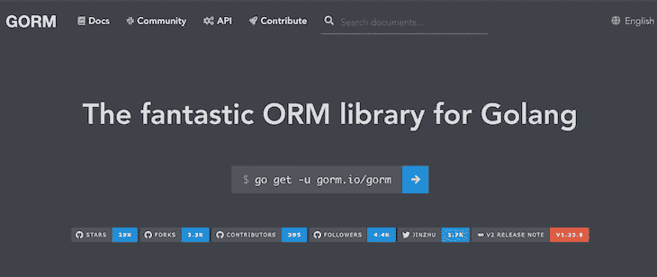
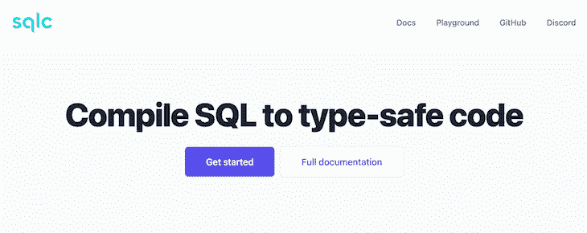
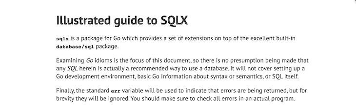
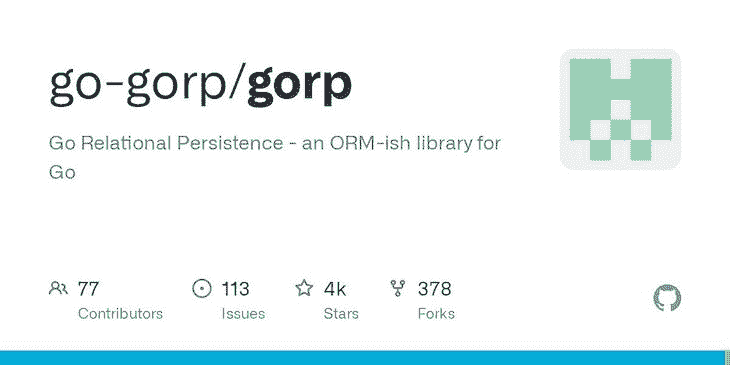
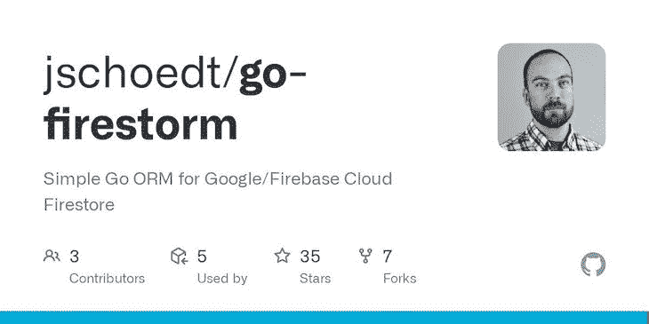
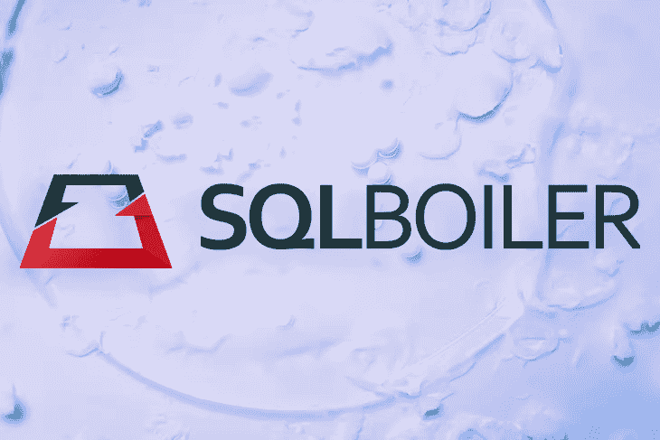

# 比较 Go 中的 7 个最佳 ORM 包

> 原文：<https://blog.logrocket.com/comparing-orm-packages-go/>

对象关系映射器(ORM)是使用首选编程语言的数据类型和语法提供与 SQL 数据库交互功能的工具。您可以使用 ORM 对数据库进行操作，而无需编写纯 SQL，因为典型的 ORM 提供了数据库抽象。

使用 ORM 代替使用内置数据类型的数据库有很多好处。例如，您可以在 ORM 中使用任何受支持的数据库，而不需要对现有代码做很多修改。此外，ORM 提高了开发人员的生产率，降低了开发成本。

Go 不是纯面向对象的语言，但是使用 ORM 的体验和纯面向对象的语言类似，比如 Python 和 C++。

Go 生态中有[多个 ORM 包](https://github.com/d-tsuji/awesome-go-orms)；大多数模式根据它们的方法使用结构和接口。

本文概述并比较了 Go 生态系统中的七个 ORM 包，为您的下一个项目提供最佳 ORM 的见解。

向前跳:

## 1.戈尔姆



GORM (Go-ORM)包是 Go 生态系统中最流行的 ORM 包。GORM 是一个开发人员友好的、功能丰富的 ORM，构建在`database/sql`包之上，拥有 ORM 中需要的许多功能。

GORM 提供了模式自动迁移、日志记录、上下文、预处理语句、关联、约束、高级数据库操作(如分片)等功能。

GORM 包采用代码优先的方法，并使用结构作为与数据库交互的模型。该软件包还提供了为不支持的操作在数据库上构建原始 SQL 查询的功能。

要使用 GORM 包并与数据库进行交互，您需要在工作区中安装一个数据库驱动程序和 GORM 包。GORM 为流行的 SQL 数据库(MySQL、SQLite、MSSQL、PostgreSQL)提供了一套数据库驱动程序，您可以使用定制的数据库驱动程序与您的数据库进行交互。

在工作目录的终端中运行这个命令来安装 GORM 包。

```
go get -u gorm.io/gorm

```

GORM 包有很好的文档，有概述其所有特性、类型和方法的示例。查看[软件包文档](https://gorm.io/)了解更多信息。

GORM 对开发人员非常友好，并且很受欢迎，因为一旦开发人员理解了如何使用 Go 结构，GORM 包就可以直观地使用。

此外，GORM 不会牺牲您从编写原始 SQL 查询中获得的大部分功能。

## 2.SQLC:SQL 编译器



[SQLC](https://sqlc.dev/) 是一个 SQL 编译器 ORM 包，它从 SQL 生成类型安全的代码，以与具有 Go 数据类型的 SQL 数据库进行交互。SQLC 包实现了来自`database/sql`包数据类型的功能，如果您以前使用过`sql`包，您会发现这个包很容易使用。

SQLC 采用模式优先的方法。在定义了模式和 SQL 查询之后，您将运行 SQLC 命令来为您的查询生成类型安全的代码接口，并继续编写调用 SQLC 生成的代码的代码。

SQLC 包提供了数据库查询、事务、配置和功能。

开始使用 SQLC 包是一个漫长的过程。根据您的操作系统和软件包，您必须在您的机器上安装二进制文件。

查看[官方文档页面](https://docs.sqlc.dev/en/latest/index.html)以了解关于 SQLC 包、[安装说明](https://docs.sqlc.dev/en/latest/overview/install.html)以及如何使用该包的更多信息。

## 3\. SQLX



[SQLX 库](https://github.com/jmoiron/sqlx)为 Go 的内置`database/sql`包提供了扩展，以便与 Go 中的数据库进行更高效、更全面的交互。SQLX 包是向后兼容和可扩展的，所以您可以很容易地将它与`database/sql`包和许多其他 ORM 包一起使用。

SQLX 包采用架构优先的方法，并提供了将行封送到具有嵌入式结构支持的结构中的功能，以及封送到映射和切片、预处理语句等中的功能。

如果您不喜欢全功能的 ORM，并且喜欢使用具有额外支持和功能的`database/sql`包，您会发现 SQLX 包很有用。

查看 [SQLX 官方文档](https://pkg.go.dev/github.com/jmoiron/sqlx)了解如何使用该软件包，查看[该指南](http://jmoiron.github.io/sqlx/)了解如何使用带有`database/sql`软件包的 SQLX。

## 4.比戈


Beego ORM 是一个强大的 ORM，灵感来自流行的 Python ORMs，如 Django ORM 和 SQLAlchemy，用于 go 中简单的数据库交互。Beego ORM 是流行的 Beego web 框架的一部分，用于在 go 中构建 web 应用程序。

Beego ORM 采用代码优先的方法，并通过流行的 [MySQL](https://github.com/go-sql-driver/mysql) 、 [PQ](https://github.com/lib/pq) 和 [Go-Sqlite3](https://github.com/mattn/go-sqlite3) 驱动程序为与 MySQL、PostgreSQL 和 SQLite3 的交互提供支持。

Beego ORM 支持所有 go 数据类型、数据库查询、表连接、原始 SQL 查询、映射、关系等等。

使用 Beego ORM 与数据库交互类似于使用 GORM，Beego ORM 提供了 GORM 中所没有的命令行功能。

Beego ORM 在使用 Beego 框架构建 web 应用程序的开发人员中很受欢迎，这是 go 生态系统中最受欢迎的框架之一。

## 5.高能量小吃食品



[GORP](https://github.com/go-gorp/gorp) 是一个使用 Go 内置数据类型与 Go 的 SQL 数据库交互的包。尽管技术上不是 ORM，因为 Go 不是面向对象的，Go 关系持久化包拥有 ORM 提供的大部分功能。

GORP 创建 Go 结构和 SQL 表之间的映射，并且您可以使用具有多种 SQL 方言的包。该包支持嵌入式结构映射、事务、从结构向前工程数据库模式、钩子、数据库查询、切片绑定、测试、日志等等。

GORP 包采用代码优先的方法，就像 GORM 一样，您可以使用标签来规范。GORP 使用反射来构造 SQL 查询和绑定参数，而没有牺牲太多的性能。

## 6.去火风暴



Go-Firestore 包是一个快速、易用、非侵入性、非独占的 orm 包，在 Go 中用于 Google Cloud Firestore。该软件包支持新的 Firestore 本地模式，但不支持旧的[数据存储](https://cloud.google.com/datastore/docs/firestore-or-datastore)模式。

Go-firestorm 包采用代码优先的方法，支持 CRUD 操作、搜索、并发请求、嵌套事务、循环引用、子集合、嵌入式结构、自定义映射、缓存，以及在 Go 版本高于 1.11 的 Google App Engine 上操作。

## 7.SQLBoiler



[SQLBoiler](https://github.com/volatiletech/sqlboiler) 包是一个模式优先的 ORM，主要用于类型安全和性能，同时减少了使用 ORM 的缺点。SQLboiler 从您定义的数据库模式生成类型安全模型。

SQLBoiler 包提供了完整模型生成、快速加载、原始 SQL 回退、事务、模型挂钩、多模式支持和处理复杂表关系的功能。

您可以查看本文以了解更多关于 SQLBoiler 包的信息，以及如何在您的 Go 应用程序中使用 ORM。

## 比较 GO ORM 包

Go 生态系统中的 ORM 具有不同的特性、功能和专业领域。

选择 ORM 将取决于您正在构建的项目的因素，例如项目规模、您首选的数据库和 ORM 方法，以及软件包的受欢迎程度。

如果您在开发过程中需要帮助，您可能更喜欢流行的包，如 GORM 和 Beego，它们有许多教程和更多的社区支持。

下面的表格比较了本教程中讨论的 ORM 包、它们的方法、支持的数据库、开发人员的经验和受欢迎程度。

| 戈尔姆 | SQLC | SQLX | 比格 | 高能量小吃食品 | 去火风暴 | SQLBoiler | 方法 |
| 代码优先 | 模式优先 | 模式优先 | 代码优先 | 代码优先 | 代码优先 | 模式优先 | 支持的数据库 |
| MySQL、MSSQL、PostgreSQL、SQLite 等等 | `database/sql`支持的数据库 | `database/sql`支持的数据库 | MySQL、SQLite、PostgreSQL | MySQL、SQLite、PostgreSQL 等等 | 谷歌云第一商店 | MySQL，MSSQL，PostgreSQL，SQLite，蟑螂数据库 | 开发者体验 |
| 从初学者到专家，非常开发友好，易于使用 | 为类型安全做好准备 | 这使得使用`database/sql`库变得值得 | 通常与 Beego 框架一起使用 | 易于使用的代码优先 ORM | 从 go apps 与谷歌云风暴互动 | 高性能、直观且易于使用 | 人气(GitHub) |
| 29.4k 星
497 看
3.3k 叉 | 6.2k 星
64 看
427 叉 | 12.5k 星
196 看
961 叉 | 28.8k 星
1.2k 看
5.5k 叉 | 3.6k 星
111 看
378 叉 | 35 星
2 看点
7 叉 | 5.1k 星
77 看
455 叉 | **注意:**Beego 流行度数据来自 web 框架，而不仅仅是 ORM。 |

GORM 是列表中最受欢迎的 ORM，基于 GitHub stars，在支持许多数据库的同时，对开发人员非常友好。

如果您不确定选择哪个 ORM，我的建议是如果您喜欢代码优先的方法，就选择 GORM、Beego 或 GORP。

如果您对`database/sql`包感到满意，并且您需要额外的功能，我会推荐 SQLX 或 SQLC。

如果您更喜欢模式优先的方法，并且关注类型安全和性能，请选择 SQLBoiler 包。

最后，如果你使用 Google Cloud Firestore 作为数据库，我推荐 Go-firestorm 软件包。

结论

## 本文概述了 Go 生态系统中七个流行的 ORM 包、它们的特性、方法等等。希望有了这些信息，您可以选择最适合您项目的 ORM。

祝你好运！

使用 [LogRocket](https://lp.logrocket.com/blg/signup) 消除传统错误报告的干扰

## [LogRocket](https://lp.logrocket.com/blg/signup) 是一个数字体验分析解决方案，它可以保护您免受数百个假阳性错误警报的影响，只针对几个真正重要的项目。LogRocket 会告诉您应用程序中实际影响用户的最具影响力的 bug 和 UX 问题。

[](https://lp.logrocket.com/blg/signup)

然后，使用具有深层技术遥测的会话重放来确切地查看用户看到了什么以及是什么导致了问题，就像你在他们身后看一样。

LogRocket 自动聚合客户端错误、JS 异常、前端性能指标和用户交互。然后 LogRocket 使用机器学习来告诉你哪些问题正在影响大多数用户，并提供你需要修复它的上下文。

关注重要的 bug—[今天就试试 LogRocket】。](https://lp.logrocket.com/blg/signup-issue-free)

Focus on the bugs that matter — [try LogRocket today](https://lp.logrocket.com/blg/signup-issue-free).