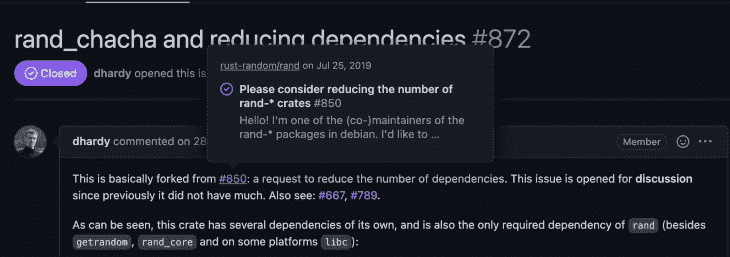
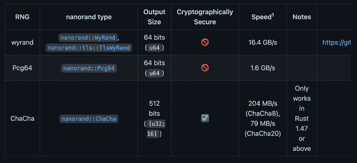
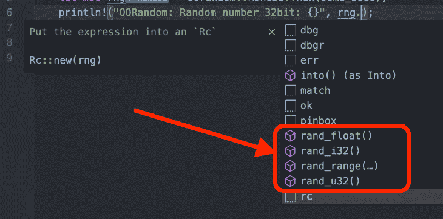

# Rust 中的随机数生成器比较

> 原文：<https://blog.logrocket.com/comparing-random-number-generators-rust/>

[随机性](https://en.wikipedia.org/wiki/Randomness)是网络发展和我们今天生活中不可或缺的一部分。如果没有随机性，[比特币](https://blog.logrocket.com/sending-bitcoin-with-javascript/)和[加密货币](https://blog.logrocket.com/how-to-create-cryptocurrency-javascript/)，银行系统[，像骰子或轮盘这样的机会游戏](https://en.wikipedia.org/wiki/Game_of_chance)，当然，所有的加密操作，都将是可预测的和不安全的。

在 Rust 中，有几个随机数生成器实现板条箱。下面，我们将看看流行的随机数生成器，比较和对比它们，并探讨它们的优缺点及其用例。

*注意:与 JavaScript 不同，Rust 中目前没有* `Math.random` *的等效方法。*

## 使用 Rand，一个流行的随机数生成器

Rand 是 Rust 生态系统中最受欢迎的随机数生成器，由 rust-random 和 229 名贡献者维护。它的 GitHub 评分超过了[1090](https://github.com/rust-random/rand/stargazers)颗星。Rand 提供了许多功能，您可以在 Rust 中针对不同的随机情况使用这些功能，它目前使用 12 轮的 [ChaCha](https://www.cryptopp.com/wiki/ChaCha20) 分组密码算法，该算法速度快、统计性强且不可预测，因此它可以充分生成密码安全的伪随机数(CSPRNG)。

Rand 的文件很小，只有 87.1KB，下载量很大。截至本文撰写之时，它已被下载了 116，114，195 次。

### Rand 的主要特性

#### 1.确定性随机数生成器

确定性随机数是从一个种子(一组定义的数字)中生成的。任何有那个种子的人都可以重新生成同样的数字。以下面这段代码为例:

```
use rand_chacha;

fn generate_random_numbers_with_a_seed(seed : u64) {
    let mut rng = rand_chacha::ChaCha8Rng::seed_from_u64(seed);
    println!("Deterministic Random numbers with seed:{}", rng.gen::<i32>());
}

fn main(){
generate_random_numbers_with_a_seed(200); 
//Result : -416273517
}

```

只要你在使用种子`200`，结果总是`-416273517`。为了让这个例子工作，您需要将`rand_chacha`作为一个依赖项添加到您的`Cargo.toml`文件中，如下所示:

```
[dependencies]
rand_chacha = "0.3.1"

```

在之前的 Rand 版本中，你只需要安装 Rand 就可以使用`rand_chacha`，因为它是一个依赖项。但是，截至 2019 年 8 月，`[rand_chacha](https://github.com/rust-random/rand/issues/872)`是[单独的](https://github.com/rust-random/rand/issues/872)，因为团队希望减少依赖性。



#### 2.非确定性随机数生成器

Rand 还允许你创建没有种子的随机数，因为它是由系统播种的，只在必要时重新播种。您可以手动触发重新播种过程，如下所示:

```
use rand::rngs::OsRng;
use rand::rngs::adapter::ReseedingRng;
use rand::prelude::*;
use rand_chacha::ChaCha20Core; 

fn main(){
    let prng = ChaCha20Core::from_entropy();
    let mut reseeding_rng = ReseedingRng::new(prng, 0, OsRng); //Reseeding
    println!("Random number: {}", reseeding_rng.gen::<u64>());
}

```

在发生[旁道攻击和/或误用](https://en.wikipedia.org/wiki/Side-channel_attack)的情况下，重新播种可以提高您的安全性。本质上，重新播种意味着你从系统产生的熵中产生一个新的种子。

然而，在大多数情况下，您可能会更频繁地使用线程本地生成器`thread_rng()`来用 Rand 生成随机数。这是因为它通常足以产生你需要的随机性(并且是由你的系统设定的)。关键是你必须为每个随机数使用一个新的种子。下面是一个在 Rand 中使用线程本地生成器的例子。

```
let mut rng = rand::thread_rng();
println!("{}", rng.gen::<i32>()); //Result is an unknown value
println!("{}", rng.gen::<i64>()); //Result is an unknown value
println!("{}", rng.gen::<u32>()); //Result is an unknown value
println!("{}", rng.gen::<u64>()); //Result is an unknown value

```

Rand crate 中有几个函数—查看 Rand 的[文档以了解更多](https://rust-random.github.io/book/intro.html)。

那么，在 Rust 应用程序中使用 Rand 有什么好处和坏处呢？最重要的是，Rand 拥有几乎所有你需要的安全随机性，这很好。然而，如果您希望实现基本的随机性，而不太担心复杂性或安全性，那么 Rand 对于您的项目来说可能是多余的。

### 在 Rust 中使用 Rand

下面我们来介绍一些 Rand 的使用案例。借助 Rand，您可以:

1.  从一系列数字`.gen_range(1.0..100.0)` :

    ```
    let mut rng = thread_rng(); let random_number = rng.gen_range(1.0..100.0); println!("Random from range {}", random_number);
    ```

    中生成随机数
2.  通过混洗数组产生一个随机数:

    ```
    let mut rng = rand::thread_rng(); let mut arr = (1..100).collect::<Vec<i32>>(); arr.shuffle(&mut rng); println!("Shuffle array: {:?}", arr);
    ```

3.  从种子生成随机数:

    ```
    let mut rng = rand_chacha::ChaCha8Rng::seed_from_u64(1000); println!("Deterministic Random numbers with seed:{}", rng.gen::<i32>()); // Ghan
    ```

4.  抛硬币:

    ```
    fn flip_coin() {     let mut rng = rand::thread_rng();     if rng.gen::<bool>() {         println!("heads");     } else {         println!("tails");     } }
    ```

你可以用 Rand 做更多的事情，但是你应该检查一下[文档来了解更多](https://rust-random.github.io/book/intro.html)。

## 对 Rust 使用 Fastrand

[Fastrand](https://github.com/smol-rs/fastrand) 是基于 [WyRand](https://github.com/wangyi-fudan/wyhash) 的小型快速随机数生成器，是一种现代的非密码哈希函数和伪随机数生成器。它是两年前发布的，与 Rand 不同，Fastrand 不是密码安全的，所以它不应该用于那个目的。它也只有一个依赖项`[Instant](https://github.com/sebcrozet/instant)`，而 Rand 有六个。

### Fastrand 的特点

Fastrand 的随机数仅基于预先确定的种子生成，因此任何拥有该种子的人都可以生成相同的数字。

### 使用 Fastrand 的利与弊

Fastrand 简单紧凑。最重要的是，速度快。然而，Fastrand 在密码方面并不安全。因此，如果您正在寻找更安全的加密方法，请使用 Rand。

### 社区支持

在撰写本文时，使用 Fastrand 时没有[栈溢出问题](https://stackoverflow.com/questions/tagged/fastrand+rust)，GitHub 上只有几个[问题](https://github.com/smol-rs/fastrand/issues?q=)。该项目目前有八个以上的贡献者和 10，976，949 次下载。与其他随机数生成器相比，Fastrand 周围的社区发展很快，但没有 rand 快。

### 在 Rust 中使用 Fastrand

让我们来看一些使用 Fastrand 可以做些什么的例子。

1.  首先，您可以生成一个随机的布尔值和`true`或`false`值，这对于抛硬币的场景来说很好。

    ```
    // Flip a coin: if fastrand::bool() {       println!("Fast Rand: heads");     } else {       println!("Fast Rand: tails"); }
    ```

2.  使用 Fastrand，可以根据类型生成随机数，以及有符号和无符号数:

    ```
    println!("Fast Rand: Unsigned Random number 32bit: {}", fastrand::u32(..));     println!("Fast Rand: Unsigned Random unsigned number 64bit: {}", fastrand::u64(..));     println!("Fast Rand: Signed Random number 64bit: {}", fastrand::i64(..)); } 
    ```

3.  你也可以从一个集合中选择一个随机数，就像这样:

    ```
    let i = fastrand::usize(vec![1,3,5,6,7,8]); let element = arr[i]; println!("Fast Rand: Random number from array {:?}: is {}", arr, elem);
    ```

4.  你可以通过打乱一个数组来产生随机数:

    ```
    fn shuffle(mut arr: Vec<u32>) {     let shuffled = fastrand::shuffle(&mut arr);     println!("Random numbers from Shuffled array {:?}", shuffled); }
    ```

你应该查看文档中更多的用例。

## 在 rust 中使用非品牌随机性

Nanorand 是一个有趣的随机数生成器，它很简单，即使它允许你使用一种以上的算法。您可以根据需要选择要使用的算法。

### 非品牌的特征

首先也是最重要的，Nanorand 允许你使用多种算法，比如`WyRand`、`ChaCha`和`Pcg64`。



因此，无论您是希望生成一个密码安全的 PRNG，还是一个编译时间短的不安全随机数，您都可以使用 Nanorand 来完成。

### 使用非品牌的利弊

Nanorand 是轻量级的，大约 18.4KB，并且速度很快，这取决于您试图生成的随机数的类型。记住:加密安全的随机数比非加密安全的随机数生成要慢得多。

目前，Nanorand 没有太多的社区支持，除了`WyRand`之外，文档没有涉及它实现的其他算法。然而，Nanorand 已经安装了 834，185 次，有 11 个贡献者，在 GitHub 上几乎没有问题。

### 用例

Nanorand 的用例就像我们已经讨论过的其他随机数生成器一样。

1.  根据类型生成随机数，如`u64`、`u32`、`i32`等。

    ```
    let mut rng = WyRand::new(); println!("Nano Rand: random number 64bit: {}", rng.generate::<u64>()); println!("Nano Rand: random number 32bit: {}", rng.generate::<u32>());
    ```

2.  通过混洗数组来生成随机数:

    ```
    let mut rng = WyRand::new(); let mut items = vec![1, 2, 3, 4, 5, 6, 7, 8, 9, 10]; rng.shuffle(&mut items); println!("Nano: Shuffled array vec {:?}", items);
    ```

3.  生成一系列数字之间的随机数。

    ```
    let mut rng = WyRand::new(); println!(     "Random number between 1 and 100: {}",     rng.generate_range(1_u64..=100) );
    ```

## 在 Rust 中使用 oorandom

[Oorandom](https://crates.io/crates/oorandom) 是一个确定性随机数生成器，实现了[置换同余生成器(PCG)](https://en.wikipedia.org/wiki/Permuted_congruential_generator) 。如果您发现 rand 板条箱对于您的项目来说太大，而只是想要更紧凑和具体的东西，请使用 oorandom。更重要的是，它是`#[no_std]`，如果你正在为裸机设备构建一个项目，这是非常好的。

要生成随机数，您需要从种子中生成它。如果您想生成一个不确定的随机数，使用`getrandom`箱从您的系统生成随机种子。

### 使用 oorandom 的利与弊

*   它的文件大小约为 10.1KB，并且没有依赖关系
*   它使用 PCG，这提供了出色的统计性能

不幸的是，Oorandom 没有密码安全。

### 社区

Oorandom 非常受欢迎，已经安装了 8107644 次。对于大多数需要一个简单的随机数生成器的人来说，oorandom 是一个很好的选择。

### 用例

Oorandom 只实现了少数几个功能:`rand_float`、`rand_i32`、`rand_range`和`rand_u32`。



下面是一个如何使用它的示例:

```
use oorandom;

fn main(){
  let seed = 4;
  let mut rng = oorandom::Rand32::new(seed);
  println!("OORandom: Random number 32bit: {}", rng.rand_i32());
  println!("OORandom: Random number range: {}", rng.rand_range(1..100));
  println!("OORandom: Random number with float: {}", rng.rand_float());
}

```

## 结论

有了 Rust，我们可以通过使用随机数生成器做很多事情。虽然这个列表中的生成器可能会随着时间的推移而改变，因为创建了更强的算法，但我们在本文中讨论了开发人员使用 Rust、security 和/或 cryptography 的一些常用选项。黑客快乐！

## [log rocket](https://lp.logrocket.com/blg/rust-signup):Rust 应用的 web 前端的全面可见性

调试 Rust 应用程序可能很困难，尤其是当用户遇到难以重现的问题时。如果您对监控和跟踪 Rust 应用程序的性能、自动显示错误、跟踪缓慢的网络请求和加载时间感兴趣，

[try LogRocket](https://lp.logrocket.com/blg/rust-signup)

.

[](https://lp.logrocket.com/blg/rust-signup)

LogRocket 就像是网络和移动应用程序的 DVR，记录你的 Rust 应用程序上发生的一切。您可以汇总并报告问题发生时应用程序的状态，而不是猜测问题发生的原因。LogRocket 还可以监控应用的性能，报告客户端 CPU 负载、客户端内存使用等指标。

现代化调试 Rust 应用的方式— [开始免费监控](https://lp.logrocket.com/blg/rust-signup)。