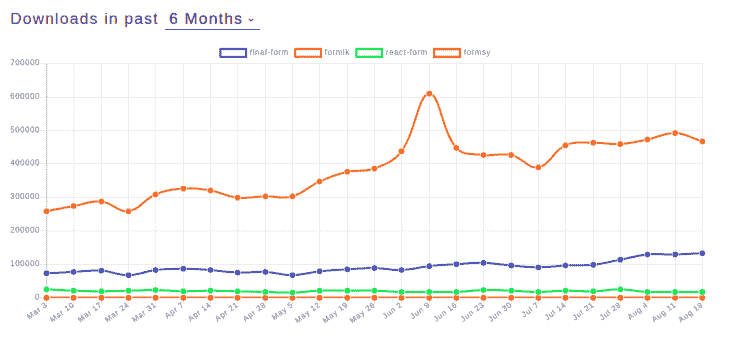

# 比较 React 表单生成器:Formik 与 unim-log rocket 博客

> 原文：<https://blog.logrocket.com/comparing-react-form-builders-formik-vs-unform/>

***编者按**:本帖更新于 2021 年 11 月 1 日。*

应用程序越现代，开发人员就越有可能需要使用特殊的功能和有用的提示来确保要求苛刻的客户对他们的用户体验感到满意。

在 React 的世界里，表单给了我们输入组件的所有能力——但是这种能力还不够。

我们需要更好、更快的方法来创建定制的组件，包括输入、选择、按钮和潜在的新组件，这些组件不能被我们的浏览器隐式地识别(例如，根据组件创建新的 UI 体验)。

我们需要以多种不同的形式验证数据，有时通过复杂的正则表达式或 JavaScript 验证函数，有时通过外部资源。在某些情况下，可能需要在导航器中本地存储数据，并明智地恢复它。其他人可能需要以他们自己的方式与这些组件通信。

React 没有给开发者提供处理自定义高亮的方法，所以社区想出了自己做的方法。

有许多不同的选项，比如用于基本表单操作的库、与 Redux 的集成等等。在这一点上，用户的最佳选择似乎是[Formik](https://jaredpalmer.com/formik/)——至少数字是这么告诉我们的。

## 什么是福米克？

下图显示了在 npmtrends.com 的[下载最多的](https://www.npmtrends.com/)著名 React 表单库的[NPM 包(根据本文的撰写):](https://www.npmtrends.com/final-form-vs-formik-vs-react-form-vs-formsy)



福米克是目前最受欢迎的。它不仅灵活，而且可以与 React 通信，还允许开发人员轻松地与 [Yup](https://github.com/jquense/yup) (一种流行的 JavaScript 对象模式验证器和对象解析器)集成。

也许它最重要的特性是表单状态管理——我们不再需要在每次击键时都调用 Redux store 的状态(这确实是一种不好的做法),因为状态是由 Formik 在本地自动维护的。

## 什么是制服？

虽然 Formik 擅长处理受控组件，但它不擅长处理非受控组件。

另一方面，Unform 致力于为 React 表单和嵌套结构(尤其是深层结构)提供高性能。Unform 还允许您在组件之间建立牢固的关系，甚至是不受控制的组件，而不会牺牲任何性能。这个巴西 React 库与 React [钩子](https://reactjs.org/docs/hooks-intro.html)配合得非常好。

在本文中，我们将通过几个例子来展示这个库的潜力。

## 使用 formik 和 uniform 创建表单

首先，让我们看看这两个库是如何处理表单创建的。下面，我们可以看到 Formik 表单的基本用法:

```
import React from 'react';
import { Formik } from 'formik';

const SampleForm = () => (
  <div>
    <Formik
      initialValues={{ email: '', password: '' }}
      validate={values => {
        const errors = {};

        // error validations here

        return errors;
      }}
      onSubmit={(values, { setSubmitting }) => {
        setTimeout(() => {
          console.log(values);

          // submit logic here

          setSubmitting(false);
        }, 400);
      }}
    >
      {({
        values,
        errors,
        touched,
        handleChange,
        handleBlur,
        handleSubmit,
        isSubmitting,
      }) => (
        <form onSubmit={handleSubmit}>
          // fields
          {errors.email && touched.email && errors.email}

          <button type="submit" disabled={isSubmitting}>
            Submit
          </button>
        </form>
      )}
    </Formik>
  </div>
);

export default SampleForm;

```

有关 React 规格，请参考 React 官方文档。大多数库通常建议开发者从 JavaScript 提交函数开始。

在我们的例子中，这个函数有两个参数:`values`，它表示表单字段的值，第二个对象包含 Formik 的属性和函数，可以在 submit body 函数中免费使用。

例如，`setSubmitting`(布尔值)是分析请求当前是否正在发生的有用机制。

每种形式都由主要元素`<Formik>`和一些重要道具组成:

*   `initialValues`:每个后续受控组件的本地状态值
*   `validate`:接收表单的所有值作为参数。您可以使用这个函数来执行您想要的任何验证。您还可以使用它来设置和返回正确的错误代码/消息
*   `onSubmit`:决定哪个函数将处理提交事件
*   `render`:隐式表单渲染函数本身。确定表单中哪些是受控制的 Formik 组件，哪些是不受控制的 HTML 组件

很简单，不是吗？让我们看看下面等价的 Unform 形式。确保已经安装了`react`、`react-dom`和`yup`软件包。

```
import React from 'react'
import { Form } from '@unform/web'
import { useField } from '@unform/core'
import * as Yup from 'yup';

function Input({ name, ...rest }) {
    const inputRef = React.useRef(null)
    const { fieldName, defaultValue, registerField, error } = useField(name)

    React.useEffect(() => {
      registerField({
        name: fieldName,
        ref: inputRef,
        getValue: ref => {
          return ref.current.value
        },
        setValue: (ref, value) => {
          ref.current.value = value
        },
        clearValue: ref => {
          ref.current.value = ''
        },
      })
    }, [fieldName, registerField])

    return <input ref={inputRef} defaultValue={defaultValue} {...rest} />
  }

  function SampleForm() {
    const formRef = React.useRef(null);

    const initialValues = {
        email: '',
        document: ''
    };

    async function handleSubmit(data) {
        try {
            // Remove all previous errors
            formRef.current.setErrors({});
            const schema = Yup.object().shape({
              email: Yup.string()
                .email()
                .required(),
              password: Yup.string()
                .min(6)
                .required(),
            });
            await schema.validate(data, {
              abortEarly: false,
            });

            // Validation passed
            console.log(data);
        } catch (err) {
            const validationErrors = {};
            if (err instanceof Yup.ValidationError) {
              err.inner.forEach(error => {
                validationErrors[error.path] = error.message;
              });
              formRef.current.setErrors(validationErrors);
            }
        }
    }

    return (
      <Form ref={formRef} initialData={initialValues} onSubmit={handleSubmit}>
        <Input name="email" type="email" />
        <Input name="password" type="password" />

        <button type="submit">Sign in</button>
      </Form>
    )
  }

  render(
    <>
      <SampleForm />
    </>
  )

```

首先，我们需要通过安装 Unform

```
yarn add @unform/web @unform/core
# or
npm i @unform/web @unform/core

```

现在我们需要从 Unform 导入各自的`Form`和`Input`组件。您将看到的第二件事与一个 Yup 验证模式有关。

像 Formik 一样，通过提供一个`schema`属性，您可以稍后使用它来验证表单输入值，从而轻松地与 Yup 模式集成。因为到目前为止，Yup 是最流行的输入值验证库，所以使用起来非常简单。

这段代码提供了一个例子来帮助您更好地理解带有验证的格式，比如电子邮件、必填字段和最小值长度。

当 un format 与钩子一起工作时，基于类的组件风格被抛弃，取而代之的是单功能组件。

Formik 中的`initialValues`在这里转化为`initialData`——确保将每个对象属性与每个输入名称相匹配，以确保正确应用值。`handleSubmit`函数从 Formik 中丢失参数，只是接收值以便在提交事件中操作。

最后，没有内部的`render`函数，这意味着`<Form>`必须与其他组件混合。

* * *

### 更多来自 LogRocket 的精彩文章:

* * *

您还可以使用其他常见属性，如`placeholder`、`style`等。

## formik 和 uniform 中的附加元素

### **选择下拉菜单**

让我们分析第二个组合框的例子，它是表单中非常常见的元素。

在 Formik 中，选择下拉菜单通常是这样的:

```
<Field as="select" name="color">
    <option value="red">Red</option>
    <option value="green">Green</option>
    <option value="blue">Blue</option>
</Field>

```

不复杂。另一方面，un format 与 react-select 合作来实现这一目标。下面是一个如何将外部 dropdown 组件与 Unform 结合的示例:

```
import React, { useRef, useEffect } from 'react';
import ReactSelect, {
  OptionTypeBase,
  Props as SelectProps,
} from 'react-select';
import { useField } from '@unform/core';

interface Props extends SelectProps<OptionTypeBase> {
  name: string;
}

export default function Select({ name, ...rest }: Props) {
  const selectRef = useRef(null);
  const { fieldName, defaultValue, registerField, error } = useField(name);

  useEffect(() => {
    registerField({
      name: fieldName,
      ref: selectRef.current,
      getValue: (ref: any) => {
        if (rest.isMulti) {
          if (!ref.state.value) {
            return [];
          }
          return ref.state.value.map((option: OptionTypeBase) => option.value);
        }
        if (!ref.state.value) {
          return '';
        }
        return ref.state.value.value;
      },
    });
  }, [fieldName, registerField, rest.isMulti]);

  return (
    <ReactSelect
      defaultValue={defaultValue}
      ref={selectRef}
      classNamePrefix="react-select"
      {...rest}
    />
  );
};
```

特别注意连接字段与其对应字段`ReactSelect`的`useRef`函数。

### **嵌套元素**

当涉及到多个嵌套元素时，没有一个库能够提供完全可适应的工作解决方案。

Formik 有一个非常方便的对象叫做`[<FieldArray>](https://jaredpalmer.com/formik/docs/api/fieldarray)`，它有助于常见的数组/列表操作:

```
let countries = ['andorra', 'argentina', 'aruba'];

<Form>
   <FieldArray
      name="countries"
      render={arrayHelpers => (
          // defining your form, loop through `countries`
     )}
    />
</Form>
```

它还有一堆熟悉的功能，比如`pop`、`replace`、`push`、`insert`，以及其他自动注入的`arrayHelpers`来帮助操作物品。

然而，每当您想要嵌套条目、应用验证或者以更接近实体模型的方式组织表单时，Formik 就缺少选项。

un format 有一个有趣的处理嵌套对象的机制。以下面的代码为例:

```
import React from 'react';
import { Form, Input, Scope } from '@rocketseat/unform';

function App() {
  function handleSubmit(values) {
    console.log(values);
  }

  return (
    <Form onSubmit={handleSubmit}>
      <Input name="name" />

      <Scope path="address">
        <Input name="country" />
        <Input name="zipCode" />
      </Scope>

      <button type="submit">Submit</button>
    </Form>
  );
}
```

`Scope`是一个未格式化的组件，它标记了嵌套元素的根。这只是为了标记，不包含任何值。

当您提交表单时，您的`values`对象将如下所示:

```
{
   name: '',
   address: { country: "", zipCode: "" }
}
```

每当您更新状态的值时，它将反映在您的表单域中。

### 结论

在 Formik 和 Unform 之间进行选择时，最重要的是找到最适合您项目目的的产品。

Unform 是一个很棒的库，特别是因为它是轻量级的、可执行的，并且足够灵活，允许与其他库集成。您可能希望在表单中使用第三方组件，比如 [react-select](https://github.com/JedWatson/react-select) 和 [react-datepicker](https://github.com/Hacker0x01/react-datepicker/) 。使用 un format，这很容易做到。

去吧，你自己试试。迁移一些组件，或者从头开始创建组件。利用 React 钩子获得更简洁的代码，并测试嵌套元素的不同字段组织。

别忘了查看[官方文档](https://github.com/Rocketseat/unform)了解更多关于其他元素的信息，以及每个元素的示例。

## 使用 LogRocket 消除传统反应错误报告的噪音

[LogRocket](https://lp.logrocket.com/blg/react-signup-issue-free)

是一款 React analytics 解决方案，可保护您免受数百个误报错误警报的影响，只针对少数真正重要的项目。LogRocket 告诉您 React 应用程序中实际影响用户的最具影响力的 bug 和 UX 问题。

[ ](https://lp.logrocket.com/blg/react-signup-general) [  ](https://lp.logrocket.com/blg/react-signup-general) [LogRocket](https://lp.logrocket.com/blg/react-signup-issue-free)

自动聚合客户端错误、反应错误边界、还原状态、缓慢的组件加载时间、JS 异常、前端性能指标和用户交互。然后，LogRocket 使用机器学习来通知您影响大多数用户的最具影响力的问题，并提供您修复它所需的上下文。

关注重要的 React bug—[今天就试试 LogRocket】。](https://lp.logrocket.com/blg/react-signup-issue-free)