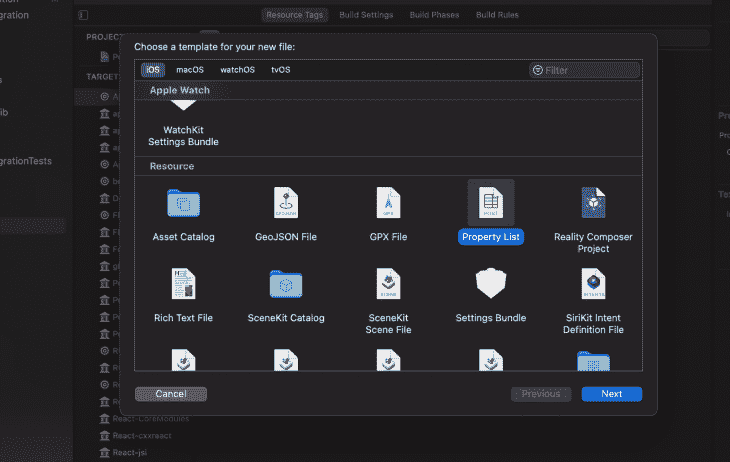
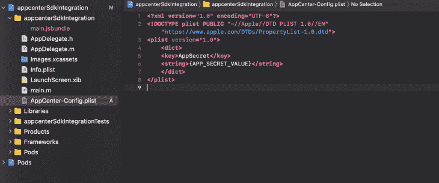
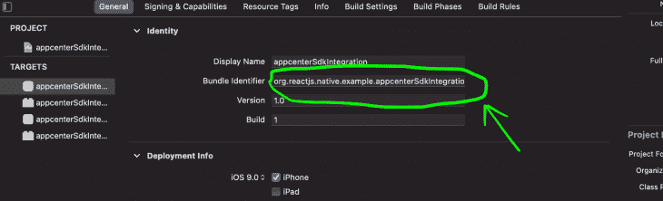
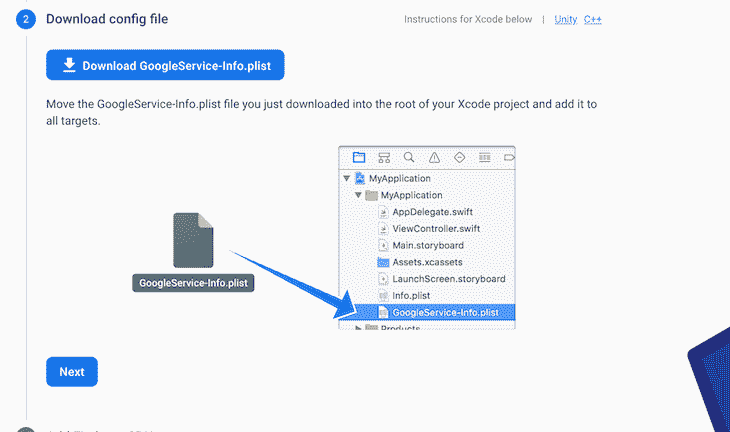
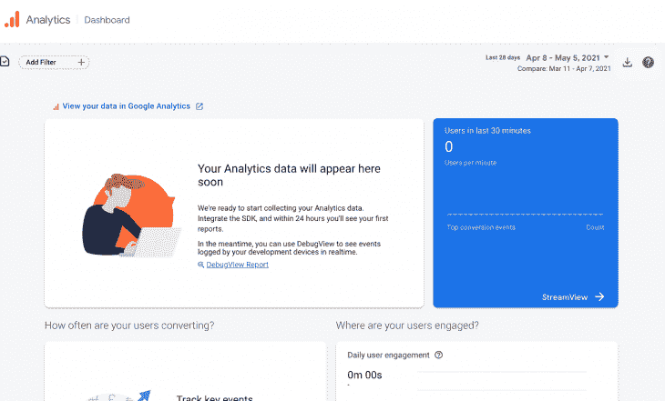
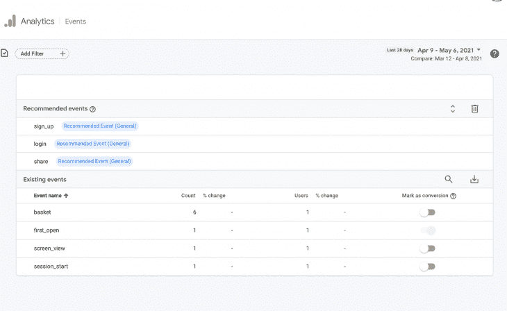
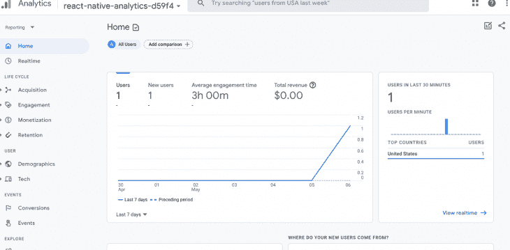

# 比较 React 本地分析工具

> 原文：<https://blog.logrocket.com/comparing-react-native-analytics-tools/>

通过尝试了解用户行为和应用程序内的交互，分析在改善用户体验方面发挥着重要作用。React Native 与三个主要的分析工具兼容，这些工具有助于改善 React Native 应用程序的体验:微软的 App Center Analytics、谷歌的 Firebase Analytics 和 Segment。

在本帖中，我们将探讨每个工具的优势，以及它们如何帮助开发人员在 React Native 中导航和利用分析。

## 微软的应用中心分析

由[微软](https://blog.logrocket.com/continuous-deployment-of-react-native-app-with-azure-devops/)创建的 App Center Analytics 是 [App Center SDK](https://docs.microsoft.com/en-us/appcenter/sdk/) 的一部分，它可以捕获用户会话并跟踪与应用程序的所有交互，同时收集设备和操作系统信息。

### 应用中心分析使用

要使用 App Center Analytics，我们必须安装 [App Center React Native SDK](https://docs.microsoft.com/en-us/appcenter/sdk/getting-started/react-native) 。

首先，我们必须在 [appcenter.ms](https://appcenter.ms/) 上创建一个帐户和一个新应用。 [React 原生文档](https://docs.microsoft.com/en-us/appcenter/sdk/getting-started/react-native)展示了如何为 iOS 和 Android 安装软件包和集成 SDK。在这篇文章中，我们将涵盖一个高层次的安装概述。

### 应用中心分析安装

首先使用 Yarn 安装 SDK:

```
yarn add appcenter appcenter-analytics appcenter-crashes --exact

```

在`app`目录下，运行`cd ios && pod install` `--repo-update`安装 iOS 依赖项。

接下来，使用 [Xcode](https://blog.logrocket.com/xcode-for-react-native-developers-tutorial-and-best-practices/) 创建一个新文件并命名为`AppCenter-Config.plist`。右键单击根文件夹；选择**添加新文件**和`Property List file`。



打开文件，将下面的代码复制并粘贴到我们刚刚创建的文件中:

```
<?xml version="1.0" encoding="UTF-8"?>
<!DOCTYPE plist PUBLIC "-//Apple//DTD PLIST 1.0//EN" "https://www.apple.com/DTDs/PropertyList-1.0.dtd">
<plist version="1.0">
    <dict>
    <key>AppSecret</key>
    <string>{APP_SECRET_VALUE}</string>
    </dict>
</plist>

```

使用我们在 appcenter.ms 中创建的应用程序中的`APP_SECRET`键更改`{APP_SECRET_VALUE}`。

`AppCenter-Config.plist`中的内容应该如下图所示:



要初始化 SDK，将这些代码行添加到`AppDelegate.m`文件的顶部:

```
#import <AppCenterReactNative.h>
#import <AppCenterReactNativeAnalytics.h>
#import <AppCenterReactNativeCrashes.h>

```

在`didFinishLaunchingWithOptions`中，添加以下几行:

```
[AppCenterReactNative register];
  [AppCenterReactNativeAnalytics registerWithInitiallyEnabled:true];
  [AppCenterReactNativeCrashes registerWithAutomaticProcessing];

```

现在，单击**构建**图标或键入 Command + B 来构建应用程序。

#### Android 的安装差异

对于 Android 应用程序，在`android/app/src/main/assets`中添加`appcenter-config.json`文件。

文件中的内容应该类似于下面的代码；我们还必须用有效的应用程序密码替换`{APP_SECRET_VALUE}`:

```
{
    "app_secret": "{APP_SECRET_VALUE}"
}

```

Android 应用程序的最后一步是将这些行添加到`res/values/strings.xml`:

```
<string name="appCenterCrashes_whenToSendCrashes" moduleConfig="true" translatable="false">DO_NOT_ASK_JAVASCRIPT</string>
<string name="appCenterAnalytics_whenToEnableAnalytics" moduleConfig="true" translatable="false">ALWAYS_SEND</string>

```

为了使 SDK 正常工作，请避免使用除 AppCenter SDK 之外的任何其他崩溃报告服务。

### 使用应用中心分析方法收集数据

安装完成后，在 React 本机代码中使用 [AppCenter 分析方法](https://docs.microsoft.com/en-us/appcenter/sdk/analytics/react-native#custom-events)来收集用户数据。

在本例中，我们将使用`trackEvent()`方法报告销售额并跟踪用户如何浏览在线商店应用程序。

这个方法在用户采取行动时触发，比如点击**购买**按钮。然后，它报告并跟踪事件，收集关于用户购买的数据，如购买的产品类型、价格和数量。

[在](https://gist.github.com/hayanisaid/a5e51e65acffc7559860638d3c6fc40c)代码中，`trackEvent()`的用法如下:

```
import {View,Text, TouchableOpacity, TouchableHighlight} from 'react-native';
import Analytics from 'appcenter-analytics';

export default App(){
const __OnBuyButtonPressed=()=>{

  Analytics.trackEvent('Purchase', { price: '9.99', type: 'cloth' });
}
return(
  <View>
        <TouchableHighlight  onPress={__OnBuyButtonPressed}>
          <View
            style={{
              flexDirection: "row",
              justifyContent: "space-around"
            }}
          >
            <Text style={styles.signInButtonTextStyle}>Continue</Text>
          </View>
        </TouchableHighlight>
      </View>
)}

```

自定义事件也可以收集独特的数据。例如，我们可以为导航操作创建一个自定义事件，以查看用户如何在应用程序中导航。

通过收集事件数据并发送到 App Center 仪表盘，我们可以看到所有日志、事件、操作系统数据、设备信息等，从而帮助我们确定如何为用户体验提供最佳服务。

使用 AppCenter Analytics 的另一个好处是，数据可以链接并导出到 Azure，这使用户可以访问 Azure Application Insights 等功能来帮助分析数据。

## Firebase 的谷歌分析

以前被称为简单的 Firebase Analytics，[Google Analytics for Firebase](https://blog.logrocket.com/storing-retrieving-data-react-native-apps-firebase/)也支持 React Native。它使用自定义和预定义的事件来跟踪用户行为，并且可以与 Firebase SDK 集成。

作为移动开发中最受欢迎的云服务之一，Firebase 支持大多数平台，可以在任何地方使用。它很容易与 React Native 集成，其简单的功能使它在开发人员社区中很受欢迎。

### Firebase 使用

为了在 React Native 中使用 Firebase SDK 功能，我们将安装`[react-native-firebase](https://rnfirebase.io/analytics/usage)`，这是一个将 Firebase SDK 集成到 React Native 中的开源项目。

### Firebase 设置

首先，我们必须在 [Firebase 控制台](https://console.firebase.google.com/)上创建一个新的应用程序，并生成凭证。在控制台中，选择**创建一个项目**来创建一个新的 app，并按照提示进行操作。

项目创建完成后，点击 **iOS** 按钮。


出现一个新窗口，提示我们输入 iOS 捆绑包标识符的信息 I 来注册我们的应用程序。


要获得捆绑包标识符，请在 Xcode 中打开项目，打开 **General** 选项卡，并复制**捆绑包标识符**字段中的文本。



点击**注册 app** ，包含 Firebase 凭证的`GoogleService-Info.plist`文件自动生成；我们现在可以下载文件了。



然后，将文件复制粘贴到 Xcode 中的`project`目录下。


### 将 React 本机依赖项安装到 Firebase 中

在 Firebase 控制台上创建新的应用程序后，我们就可以安装 React 本机依赖项了。

使用[纱线或 npm](https://blog.logrocket.com/javascript-package-managers-compared/) 添加包装，如下所示:

```
yarn add @react-native-firebase/app
// with npm
npm install @react-native-firebase/app

```

接下来，添加分析模块:

```
yarn add @react-native-firebase/analytics

```

如果使用早于 0.60 的 React 原生版本，运行`react-native link`来链接包。否则，使用新版本将自动链接包。

链接软件包后，通过运行下面的命令在`project`目录中安装 iOS pods:

```
cd iOS && pod install

```

这将安装 iOS 所需的依赖项。

要初始化 Firebase 应用程序，请将以下代码行添加到`AppDelegate.m`:

```
@import UIKit;
@import Firebase;

@implementation AppDelegate

- (BOOL)application:(UIApplication *)application
    didFinishLaunchingWithOptions:(NSDictionary *)launchOptions {
  [FIRApp configure];
  return YES;
}

```

现在，点击**构建**图标或者在 Xcode 里面输入 Command + B。如果没有问题，我们可以在 Firebase 控制台的仪表板上看到日志和细节。但是，填充数据可能需要一些时间。



### 为 Firebase 运行谷歌分析

带有 [React 本机代码](https://gist.github.com/hayanisaid/00c8631305609a27731c7db47cd5f61a)的 Google Analytics for Firebase 的基本用法类似于我们在这篇文章中讨论的其他分析工具。然而，不同之处在于方法的名称。

因为 Firebase 有许多带有有意义的事件名称的内置方法，所以开发人员在使用这些方法时会有更轻松、更高效的体验。

React 本机代码的基本用法如下所示。通过模拟用户点击**购买**按钮时的`Purchase`事件，`Analytics().logEvent()`方法记录购买细节:

```
import Analytics from '@react-native-firebase/analytics';
import {View,Text, TouchableOpacity, TouchableHighlight} from 'react-native';
import Analytics from 'appcenter-analytics';

export default App(){
const __OnBuyButtonPressed= async()=>{
   await Analytics().logEvent('Purchase', { price: '9.99', type: 'cloth' });
}
return(
  <View>
        <TouchableHighlight  onPress={__OnBuyButtonPressed}>
          <View
            style={{
              flexDirection: "row",
              justifyContent: "space-around"
            }}
          >
            <Text style={styles.signInButtonTextStyle}>Continue</Text>
          </View>
        </TouchableHighlight>
      </View>
)}

```

例如，如果我们的应用程序提供电子商务服务或在线商店，Firebase 提供了[特定方法来跟踪在线商店事件](https://rnfirebase.io/reference/analytics#logAddToCart)，如添加到购物车事件，它使用了`logAddToCart()`方法。

其他方法包括:

*   `logLogin()`跟踪登录事件
*   应用程序打开时会调用`logAppOpen()`
*   `logShare()`追踪应用程序中的分享活动

你可以在这里找到所有其他[预定义的 Firebase 方法。](https://rnfirebase.io/reference/analytics#methods)

因为 Firebase 支持许多跨平台的应用程序，所以即使在从一种编程语言切换到另一种编程语言时，Firebase 方法也很容易使用。例如，在 Swift 中使用 Firebase 代码和方法与在 JavaScript 中是一样的，这使得转换更加容易。

为了找到我们将使用的方法，让我们转到下面所示的**事件**选项卡中的事件日志。



我们也可以通过[谷歌分析](https://analytics.google.com/analytics)本身来观察洞察力。然而，我们必须为 Firebase 设置与谷歌分析帐户相同的帐户。



## 细分分析

[Segment](https://segment.com/) 是一个数据收集器和分析平台，支持跨平台和流行技术，如 iOS、Android、.NET 和 Python。通过我们选择的主机在任何地方托管数据，Segment 可以将收集的数据发送到其服务器或任何其他受支持的 Segment [服务](https://segment.com/docs/connections/destinations/catalog/)如谷歌分析。

通过 Segment，我们可以使用 SQL 查询获取数据，如下所示:

```
/*
@copyright https://github.com/segmentio/analytics-react-native
*/
select * from app.order_completed
order by price desc

```

使用段的另一个好处是能够控制数据。例如，如果我们希望[关注用户隐私](https://segment.com/product/privacy-portal/?ref=nav)，Segment 允许我们控制和设置应该收集哪些数据的规则，并对特定类型的数据进行分类和限制访问。

### 段设置和使用

要为段安装 [analytics-react-native 包，我们可以使用 Yarn 或 npm。](https://github.com/segmentio/analytics-react-native)

在本例中，我们将通过在终端中安装以下代码来使用 Yarn:

```
yarn add @segment/analytics-react-native-firebase
// install pods
 cd ios && pod install 

```

要启动并连接细分市场 API，请使用细分市场分析模块在`app.js`或任何其他文件中添加以下代码:

```
await analytics.setup('YOUR_WRITE_KEY', {
  // Record screen views automatically!
  recordScreenViews: true,
  // Record certain application events automatically!
  trackAppLifecycleEvents: true
}) 

```

查看[段的文档](https://segment.com/docs/connections/find-writekey/)以生成写密钥。

然后，我们可以定制设置，定义如何收集数据，并启用一些基于平台的功能，如下面的代码所示:

```
// @ https://github.com/segmentio/analytics-react-native#cloud-based-connection-modes

import analytics from '@segment/analytics-react-native'
import firebase from '@segment/analytics-react-native-firebase'

analytics
    .setup('writeKey', {
        using: [mixpanel, firebase],
        recordScreenViews: true,
        trackAppLifecycleEvents: true,

        android: {
            flushInterval: 60000, // 60 seconds
            collectDeviceId: true
        },
        ios: {
            trackAdvertising: true,
            trackDeepLinks: true
        }
    })
    .then(() =>
        console.log('Analytics is ready')
    )
    .catch(err =>
        console.error('Something went wrong', err)
    )

analytics.track('Pizza Eaten')
analytics.screen('Home')

```

让我们来分解一些属性及其意义:

*   `Using`是与 Segment 一起使用的一系列外部分析工具，可以将数据发送到第三方分析服务，如 Google Analytics
*   `recordScreenViews`跟踪用户查看屏幕的次数
*   `trackAppLifecycleEvents`跟踪应用程序生命周期事件，如应用程序何时安装，应用程序是在后台还是在前台

定制设置后，我们可以开始使用`Analytics.track()`方法调度事件:

```
analytics.track('Purchase',null,context:{price:"9.99",productType:"auto"})
analytics.screen('Product')

```

Segment 提供了许多其他跟踪方法，例如`analytics.identify()`，它将事件附加到特定用户，在跟踪唯一用户时很有帮助:

```
# /*https://segment.com/docs/connections/sources/catalog/libraries/mobile/react-native/#tracking-methods */
analytics.identify("userId", {
  email: "[email protected]"
  name: "John Smith"
})

```

## 奖励工具:脸书分析

由于其早期对 React Native 的直接支持，[脸书分析](https://github.com/facebookarchive/react-native-fbsdk)成为最受欢迎的 React Native 分析工具之一。不幸的是，React Native 的脸书 SDK 现已过时，自 2021 年 6 月 30 日起将不再受支持。但是，仍然有一个社区分支可供您选择: [react-native-dbsdk-next](https://github.com/thebergamo/react-native-fbsdk-next/) 。

## 包扎

使用这些流行的 React Native 分析工具，每种工具都有好处，但是选择使用哪种工具取决于项目的类型和项目的需求。虽然 Segment 是控制数据和隐私的最佳选择，但 Google Analytics for Firebase 在 React Native 中有更好的支持，App Center Analytics 可以访问 Azure 功能。有了这些分析工具，它们不同的功能使得 React Native 中的应用程序的分析更容易、更高效。

## [LogRocket](https://lp.logrocket.com/blg/react-native-signup) :即时重现 React 原生应用中的问题。

[](https://lp.logrocket.com/blg/react-native-signup)

[LogRocket](https://lp.logrocket.com/blg/react-native-signup) 是一款 React 原生监控解决方案，可帮助您即时重现问题、确定 bug 的优先级并了解 React 原生应用的性能。

LogRocket 还可以向你展示用户是如何与你的应用程序互动的，从而帮助你提高转化率和产品使用率。LogRocket 的产品分析功能揭示了用户不完成特定流程或不采用新功能的原因。

开始主动监控您的 React 原生应用— [免费试用 LogRocket】。](https://lp.logrocket.com/blg/react-native-signup)