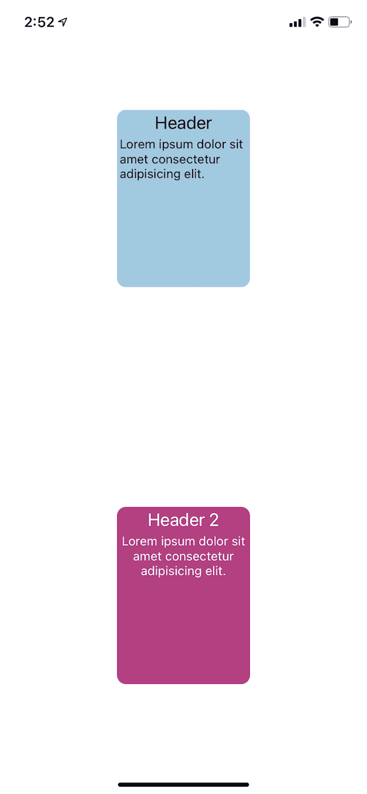
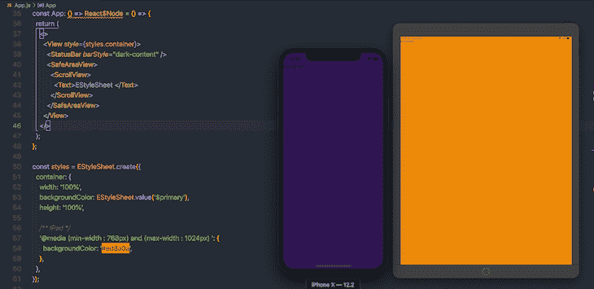
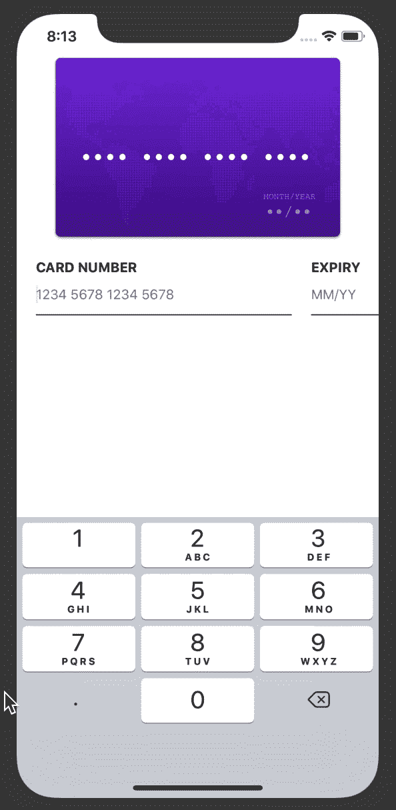
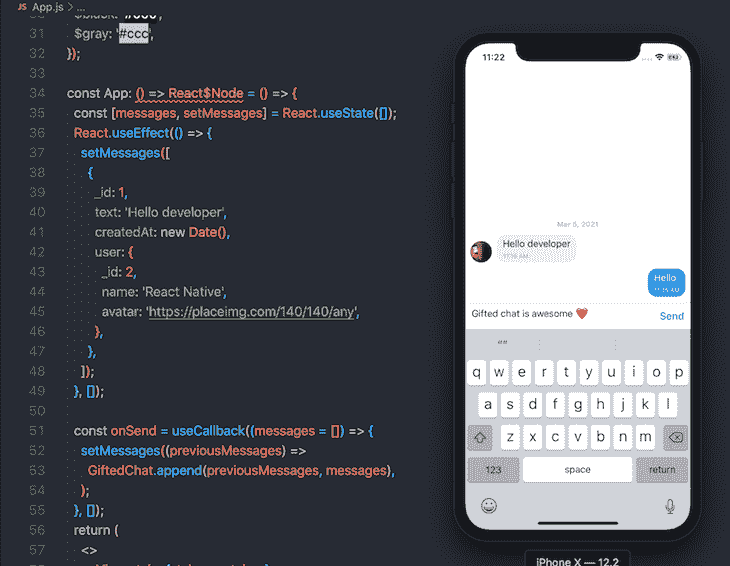
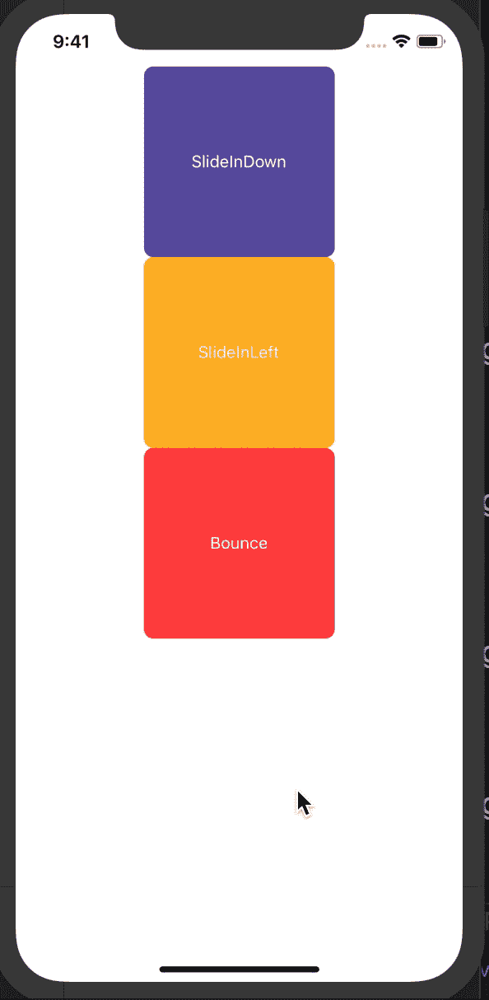
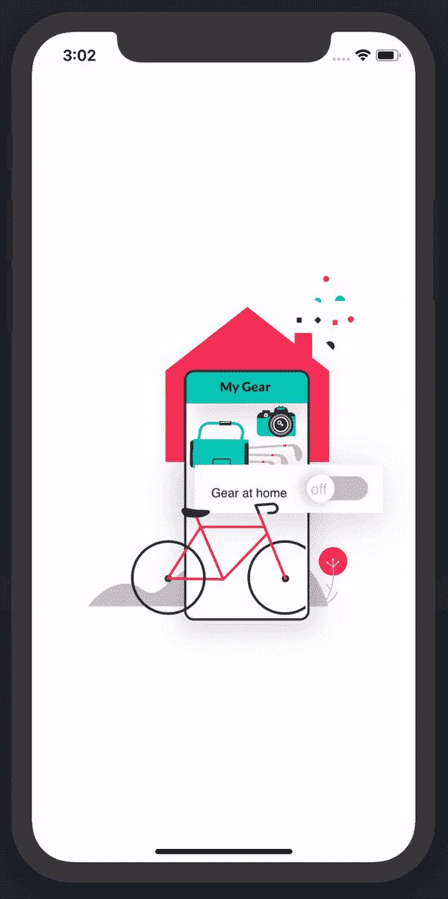
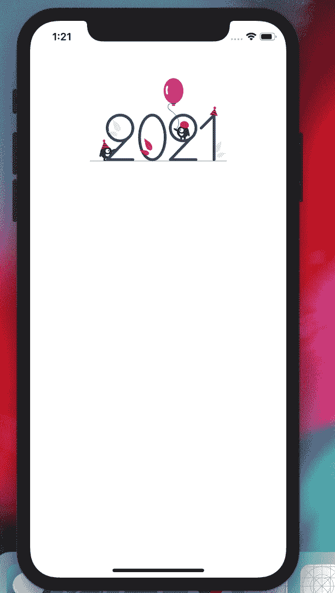

# 比较 React 原生 UI 库

> 原文：<https://blog.logrocket.com/comparing-react-native-ui-libraries/>

React Native 用于使用 JavaScript 和 React 构建跨平台的移动应用。自 2015 年首次发布以来，该库不断发展，如今已在移动开发人员社区中得到广泛采用。

事实上，社区是 React Native 成功的重要因素。似乎每天都有人发布新的库，使得用 React Native 构建应用程序变得更加容易。

在本指南中，我们将比较 React Native 最常用的 10 个 UI 库:

1.  [样式化组件](#1styledcomponents)
2.  [React 原生扩展样式表](#reactnativeextendedstylesheet)
3.  [反应原生元素](#reactnativeelements)
4.  [React 原生纸](#reactnativepaper)
5.  [反应原生信用卡输入](#reactnativecreditcardinput)
6.  [React Native 天才聊天](#reactnativegiftedchat)
7.  [react-native-animatable](#reactnativeanimatable)
8.  [反应本土洛蒂](#reactnativelottie)
9.  [反应原生矢量图标](#reactnativevectoricons)
10.  [反应原生 SVG](#reactnativesvg)

## 1.样式组件

[styled-components](https://styled-components.com/docs/basics#react-native) 使您能够[将 CSS 编写为 React 组件](https://blog.logrocket.com/build-your-own-styled-components-library/)，这允许动态样式和自动前缀。它还支持 React Native。

在 React Native 中，您通常会将样式编写为 JavaScript 对象。然而，将样式编写为组件允许您编写可读的代码和可重用的组件，并多次使用您的样式，这意味着代码更少。

例如，您可以使用经典样式对象，如下所示:

```
import {StyleSheet, Text, View} from 'react-native'
export default function App() {

return (
  <View
        style={{
          backgroundColor: '#a1cae2',
          borderRadius: 10,
          height: 200,
          width: 150
        }}
      >
        <View
          style={{
            padding: 2
          }}
        >
          <Text
            style={{
              fontSize: 20,
              color: '#000',
              textAlign: 'center'
            }}
          >
            Header
          </Text>
        </View>
        <View
          style={{
            padding: 2,
            display: 'flex',
            alignItems: 'center'
          }}
        >
          <Text
            style={{
              fontSize: 14
            }}
          >
            Lorem ipsum dolor sit amet consectetur adipisicing elit.
          </Text>
        </View>
      </View>

)

}

```

但是使用样式化组件，您可以使代码更具可读性和一致性:

```
import {StatusBar} from 'expo-status-bar'
import React from 'react'
import {StyleSheet, Text, View} from 'react-native'
import styled from 'styled-components/native'

const CardContainer = styled.View`
  background-color: #b34180;
  height: 200px;
  border-radius: 10px;
  width: 150px;
`
const CardHeader = styled.View`
  padding: 2px;
  text-align: center;
`
const CardTitle = styled.Text`
  font-size: 20px;
  text-align: center;
  color: #fff;
`

const CardBody = styled.View`
  padding: 2px;
  align-items: center;
  display: flex;
`
const CardDescription = styled.Text`
  font-size: 14px;
  color: #fff;
  text-align: center;
`

export default function App() {
  return (
    <View style={styles.container}>

      {/* styled component */}
      <CardContainer>
        <CardHeader>
          <CardTitle>Header 2</CardTitle>
        </CardHeader>
        <CardBody>
          <CardDescription>Lorem ipsum dolor sit amet consectetur adipisicing elit.</CardDescription>
        </CardBody>
      </CardContainer>
    </View>
  )
}

```

您可以看到这两个示例在代码可读性和组件一致性方面的主要区别。

用户界面中的结果仍然相同:



使用样式化组件的另一个原因是，如果您来自 CSS 世界，它使您能够使用您已经熟悉的 CSS 语法。

## 2.React 本机扩展样式表

这是我在 React Native 中最喜欢的样式工具之一。虽然与 React Native 附带的 [React Native 样式表](https://reactnative.dev/docs/stylesheet)抽象类似， [React Native 扩展样式表](https://github.com/vitalets/react-native-extended-stylesheet)提供了额外的优势，如媒体查询、变量、动态样式和主题。使用 React 本机扩展样式表使您能够使 UI 跨多个设备做出响应。

一般来说，React 本机扩展样式表的用法与 React 本机样式表相同。下面是一个实际例子，说明如何通过 [React 原生样式表](https://reactnative.dev/docs/stylesheet)同时使用变量和媒体查询。

首先，用`EStyleSheet.build()`方法定义全局变量。通常，你会把这段代码放在主入口文件`App.jsx`中:

```
EStyleSheet.build({
  /* Smartphones (portrait and landscape) ----------- */
  $primary: '#301551',
  $green:"green",
  $white:'#fff',
  $black:"#000",
  $gray:"#ccc"

});

```

接下来，使用`EStyleSheet.value('variableName')`获得任何变量的值:

```
const styles = EStyleSheet.create({
  container: {
    backgroundColor: EStyleSheet.value('$primary'),

  },
});

```

下面是完整的例子:

```
/**
 * Sample React Native App
 * https://github.com/facebook/react-native
 *
 * @format
 * @flow strict-local
 */

import React from 'react';
import {
  SafeAreaView,
  StyleSheet,
  ScrollView,
  View,
  Text,
  StatusBar,
} from 'react-native';

import EStyleSheet from 'react-native-extended-stylesheet';
// This file is for a reusable grouping of Theme items.
// Similar to an XML fragment layout in Android

EStyleSheet.build({
  /* Smartphones (portrait and landscape) ----------- */
  $primary: '#301551',
  $green:"green",
  $white:'#fff',
  $black:"#000",
  $gray:"#ccc"

});

const App: () => React$Node = () => {
  return (
    <>
      <View style={styles.container}>
        <StatusBar barStyle="dark-content" />
        <SafeAreaView>
          <ScrollView>
            <Text>EStyleSheet </Text>
          </ScrollView>
        </SafeAreaView>
      </View>
    </>
  );
};

const styles = EStyleSheet.create({
  container: {
    width: '100%',
    backgroundColor: EStyleSheet.value('$primary'),
    height: '100%',

    /** IPad */
    '@media (min-width : 768px) and (max-width : 1024px) ': {
      backgroundColor: '#ed8a0a',
    },
  },
});

export default App;

```

上面，当在 iPad 上访问应用程序时，我们改变了`backgroundColor`:



## 3.反应本地元素

在 web 开发的广阔世界中，有许多 UI 库，如 Bootstrap 和 MaterialUI，可以省去从头编写自己的 UI 库的麻烦。您可以享受负责任设计的好处，并改进跨浏览器的支持。

[React Native Elements](https://reactnativeelements.com/) 是我最喜欢的 React Native 的 UI 库，因为它使用简单，文档丰富，并且支持 iOS 和 Android。

以下是如何使用 React 原生元素的示例:

```
@copyrights https://reactnativeelements.com/docs/tooltip

import { Tooltip, Text } from 'react-native-elements';

...

<Tooltip popover={<Text>Info here</Text>}>
  <Text>Press me</Text>
</Tooltip>

```

## 4.反应原生纸

[React Native Paper](https://callstack.github.io/react-native-paper/) 与 React Native Elements 非常相似。主要区别在于 React Native Paper 使用材质设计 UI 作为其 UI 组件的基础。如果你是材质 UI 设计系统的粉丝，React Native Paper 就是适合你的 UI 库。

当使用 React Native Paper 时，您可能会经常使用[主题化](https://callstack.github.io/react-native-paper/theming.html)功能。主题化允许你集成你自己的定制设计系统，该系统可以与库的设计相结合。例如，你可以整合你自己的配色方案，排版，等等。

在 React Native 中使用主题化功能很简单:只需用`PaperProvider`包装你的应用程序，并将你的主题对象传递给它:

```
import { DefaultTheme, Provider as PaperProvider } from 'react-native-paper';
import Home from '/home'

const theme = {
  colors: {
    primary: '#90eee1',
    accent: '#6356e5',
  },
  fonts:{
    regular:16,
    small:12,
  },
  typography:{
  title:'Roboto',
   paragraph:'Open Sans'  

  }
};

export default function App() {
  return (

  );
}

```

现在，您可以在应用的任何地方访问主题值，并享受一致的设计系统。要访问任何组件中的主题，您必须使用`withTheme`高阶组件包装它:

```
import {View,Text} from 'react-native'
import { withTheme } from 'react-native-paper';

const CardTitle = ({theme})=>{

 return (

     Headline 3

 )
}

export default withTheme(CardTitle)

```

对于移动开发人员来说，构建表单可能很棘手。我们将从这里探索的 UI 库可以帮助您节省时间，并避免常见的键盘相关问题，例如当用户键入时 UI 视图没有响应。

## 5.对本机信用卡输入做出反应

[React 原生信用卡输入](https://github.com/sbycrosz/react-native-credit-card-input)超级好用。它有一个很好的用户界面和引人入胜的动画，通过使输入信用卡信息变得容易，产生了很好的用户体验。



以下是如何使用 React 原生信用卡输入的简单示例:

```
import React from 'react';
import {
  SafeAreaView,
  StyleSheet,
  ScrollView,
  View,
  Text,
  StatusBar,
} from 'react-native';
import {
  CreditCardInput,

} from 'react-native-credit-card-input';

const App: () => React$Node = () => {
  const _onChange = (e) => {
    /**
     *
     *
     * {"status": {"cvc": "incomplete", "expiry": "incomplete", "number": "invalid"}, "valid": false, "values": {"cvc": "", "expiry": "", "number": "8", "type": undefined}}
     */
    console.log(e.values.number);
    console.log(e.valid);
    console.log(e.values.cvc);
    console.log(e.values.expiry);
  };
  return (
    <>
      <StatusBar barStyle="dark-content" />
      <SafeAreaView>
        <View>
          <CreditCardInput onChange={_onChange} />
        </View>
      </SafeAreaView>
    </>
  );
};

```

React 原生信用卡输入使输入支付信息更加直观。它具有自动完成功能，并处理信用卡号的验证，因此您不必编写任何额外的代码来净化输入。React 原生信用卡输入还带有自定义样式，使您能够集成自己的样式和图标。

使用 React 原生信用卡输入最大的好处就是它是一个纯粹的 React 组件，所以你不需要做任何链接，而使用 [`react-native-awesome-card-io`](https://github.com/Kerumen/react-native-awesome-card-io) 这种类似的工具就不是这样了。

## 6.React Native 天才聊天

如果你想在 React Native 应用中加入聊天功能，那么 react-native-gifted-chat 是一个非常棒的库，它可以让你通过几个简单的步骤创建一个 UI 聊天框。该库支持 iOS、Android 和 web。



react-native-gifted-chat 不需要任何链接，因为它不包含任何本机代码。您可以使用 Yarn 或 npm 简单地安装软件包:

```
yarn add react-native-gifted-chat

```

下面是如何开始使用 Box UI 组件的示例:

```
# copyright https://github.com/FaridSafi/react-native-gifted-chat
import {GiftedChat} from 'react-native-gifted-chat';
import React, {useCallback,useState} from 'react';

const App: () => React$Node = () => {
  const [messages, setMessages] = React.useState([]);
  React.useEffect(() => {
    setMessages([
      {
        _id: 1,
        text: 'Hello developer',
        createdAt: new Date(),
        user: {
          _id: 2,
          name: 'React Native',
          avatar: 'https://placeimg.com/140/140/any',
        },
      },
    ]);
  }, []);

  const onSend = useCallback((messages = []) => {
    setMessages((previousMessages) =>
      GiftedChat.append(previousMessages, messages),
    );
  }, []);
  return (
    <>
      <View style={styles.container}>
        <StatusBar barStyle="dark-content" />

        <GiftedChat
          messages={messages}
          onSend={(messages) => onSend(messages)}
          user={{
            _id: 1,
          }}
        />
      </View>
    </>
  );
};

```

## 7.反应-原生-可动画



[r](https://github.com/oblador/react-native-animatable)[eact-Native-animatable](https://github.com/oblador/react-native-animatable)使您能够在 React Native 中向 UI 添加过渡和动画。它有一个声明性的 API 组件，您可以将它用作您想要制作动画的组件的包装器，或者向它添加一个过渡。最重要的是，它是可定制的，因此您可以控制过渡的持续时间、延迟和方向。

下面是一个简单转换的示例:

```
import React from 'react';
import {
  SafeAreaView,
  StyleSheet,
  ScrollView,
  View,
  Text,
  StatusBar,
  TouchableHighlight,
} from 'react-native';

import * as Animatable from 'react-native-animatable';

const App: () => React$Node = () => {
  const phoneRef = React.useRef(null);
  return (
    <>
      <StatusBar barStyle="dark-content" />
      <SafeAreaView>
        <ScrollView>
          <View
            style={{
              borderColor: 'red',
              flex: 1,
              alignItems: 'center',
              justifyContent: 'center',
            }}>
            {/* <LiteCreditCardInput onChange={_onChange} /> */}
            {/* <PhoneInput ref={phoneRef} /> */}
            <Animatable.View animation="slideInDown">
              <TouchableHighlight
                style={{
                  width: 160,
                  height: 160,
                  borderRadius: 8,

                  backgroundColor: '#6155a6',
                  alignItems: 'center',
                  justifyContent: 'center',
                }}>
                <Text
                  style={{
                    color: '#fff',
                  }}>
                  SlideInDown
                </Text>
              </TouchableHighlight>
            </Animatable.View>
            <Animatable.View animation="slideInLeft">
              <TouchableHighlight
                style={{
                  width: 160,
                  height: 160,
                  borderRadius: 8,

                  backgroundColor: '#fdb827',
                  alignItems: 'center',
                  justifyContent: 'center',
                }}>
                <Text
                  style={{
                    color: '#fff',
                  }}>
                  SlideInLeft
                </Text>
              </TouchableHighlight>
            </Animatable.View>

            <Animatable.View animation="bounce">
              <TouchableHighlight
                style={{
                  width: 160,
                  height: 160,
                  borderRadius: 8,

                  backgroundColor: '#ff4646',
                  alignItems: 'center',
                  justifyContent: 'center',
                }}>
                <Text
                  style={{
                    color: '#fff',
                  }}>
                  Bounce
                </Text>
              </TouchableHighlight>
            </Animatable.View>
          </View>
        </ScrollView>
      </SafeAreaView>
    </>
  );
};

```

### 8.反应本土洛蒂

[Lottie](https://airbnb.io/lottie/#/) 是 Airbnb 开发的一个库，用于转换 Adobe After Effect 动画。它支持 iOS、Android 和 web。

在 React Native `[react-native-lottie](https://github.com/lottie-react-native/lottie-react-native)`中，你可以通过提供组件包装 API 来使用 Lottie 动画。它可以像任何 React 本地库一样安装。可以将`LottieView`作为组件导入，并传递动画文件路径。

你可以在[洛蒂文件](https://lottiefiles.com/)上获得洛蒂动画。

以下是如何在 React Native 中使用 Lottie 的示例:

```
import LottieView from 'lottie-react-native';

<LottieView
  source={require('./images/lottie-af-animation.json')}
  loop
  autoPlay
/>

```



### 9.反应原生矢量图标

移动应用程序中的图标的作用类似于道路上的标志:没有它们你无法导航。简单地说，图标帮助用户理解如何与你的应用程序交互。

我推荐使用`[react-native-vector-icons](https://github.com/oblador/react-native-vector-icons)`,因为:

*   它具有跨平台支持(iOS、Android、web、Windows 等。)
*   它带有流行的图标库，如 [FontAwesome](https://fontawesome.com/) 和 [MaterialIcons](https://material.io/resources/icons/?style=baseline)
*   超级易于使用和定制

这里有一个如何使用`react-native-vector-icons`的例子:

```
import React from 'react';
import {
  SafeAreaView,
  StyleSheet,
  ScrollView,
  TouchableOpacity,
  View,
  Text,
  StatusBar,
} from 'react-native';
import Icon from 'react-native-vector-icons/FontAwesome';
const myIcon = <Icon name="rocket" size={30} color="#900" />;

const App: () => React$Node = () => {
  return (
    <>
      <View style={styles.container}>
        <StatusBar barStyle="dark-content" />
        <SafeAreaView>
          <TouchableOpacity>
            <Icon name="chevron-left" color="#000" size={20}/>
            <Text>Click Here</Text>
          </TouchableOpacity>
        </SafeAreaView>
      </View>
    </>
  );
};

```

### 10.反应本地 SVG

可缩放矢量图形(SVG)是一种基于 XML 的标记语言，用于描述二维矢量图形。SVG 文件被设计成在任何大小下都可以清晰地呈现，并且符合其他流行的 web 标准，如 JavaScript、CSS、DOM 和 SMIL。根据 MDN T1 的说法，“SVG 对于图形来说，就像 HTML 对于文本一样。”

在 React Native 中，默认情况下不支持 SVG。 [react-native-svg](https://github.com/react-native-svg/react-native-svg) 让你可以在 iOS 和 Android 上用 React Native 渲染 svg。

安装非常简单。用[纱](https://classic.yarnpkg.com/en/https://classic.yarnpkg.com/en/)，只需运行下面的命令行:

```
 yarn add react-native-svg 

```

接下来，用 [cocoapods](https://cocoapods.org/) 为 iOS 安装 pods。在您的终端中，导航到`ios`文件夹:

```
cd ios 

```

然后，运行:

```
pod install

```

如果您使用的是旧版本的 React Native (0.60 或更早版本)，您必须通过运行以下命令行来手动链接该包:

```
react-native link react-native-svg

```

有两种方法可以使用 r [eac-native-svg](https://github.com/react-native-svg/react-native-svg) 。您可以将您的 SVG 包含为一个文件，如下所示:

```
import {SvgXml} from 'react-native-svg';
import SVGImage from './images/undraw_happy_2021_h01d.svg';
const App: () => React$Node = () => {
  return (
    <>
      <View style={styles.container}>
        <StatusBar barStyle="dark-content" />
        <SafeAreaView>
          <ScrollView>
            <SvgXml width="200" height="200" xml={SVGImage} />  
          </ScrollView>
        </SafeAreaView&gt;
      </View>
    </>
  );
};

```



或者，您可以将它作为一个组件使用，就像这样:

```
#@copyrights https://github.com/react-native-svg/react-native-svg
<Svg
  width="130"
  height="130"
  fill="blue"
  stroke="red"
  color="green"
  viewBox="-16 -16 544 544"
>
  <Path
    d="M318.37,85.45L422.53,190.11,158.89,455,54.79,350.38ZM501.56,60.2L455.11,13.53a45.93,45.93,0,0,0-65.11,0L345.51,58.24,449.66,162.9l51.9-52.15A35.8,35.8,0,0,0,501.56,60.2ZM0.29,497.49a11.88,11.88,0,0,0,14.34,14.17l116.06-28.28L26.59,378.72Z"
    strokeWidth="32"
  />
  <Path d="M0,0L512,512" stroke="currentColor" strokeWidth="32" />
</Svg>

```

## 结论

现在，您应该有了为下一个 React 原生项目选择正确的 UI 库集所需的所有基本信息。然而，值得注意的是，React 原生生态系统是巨大的，并且随着社区不断推出工具以使开发者体验更好，它将变得越来越庞大。

要了解 React Native 生态系统还能提供什么，请加入开源社区 [Awesome React Native](https://github.com/jondot/awesome-react-native#ui) 。

## [LogRocket](https://lp.logrocket.com/blg/react-native-signup) :即时重现 React 原生应用中的问题。

[](https://lp.logrocket.com/blg/react-native-signup)

[LogRocket](https://lp.logrocket.com/blg/react-native-signup) 是一款 React 原生监控解决方案，可帮助您即时重现问题、确定 bug 的优先级并了解 React 原生应用的性能。

LogRocket 还可以向你展示用户是如何与你的应用程序互动的，从而帮助你提高转化率和产品使用率。LogRocket 的产品分析功能揭示了用户不完成特定流程或不采用新功能的原因。

开始主动监控您的 React 原生应用— [免费试用 LogRocket】。](https://lp.logrocket.com/blg/react-native-signup)