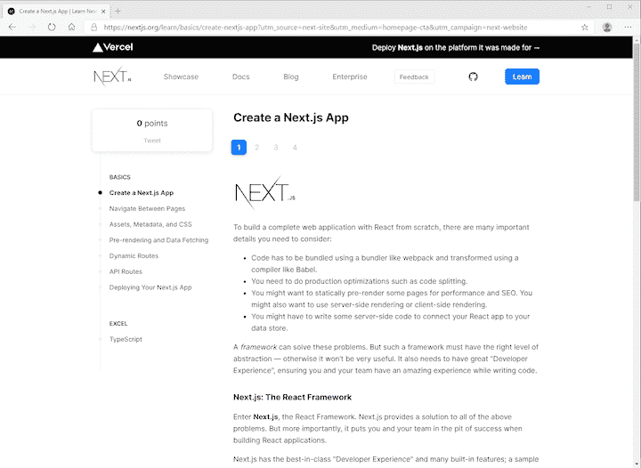
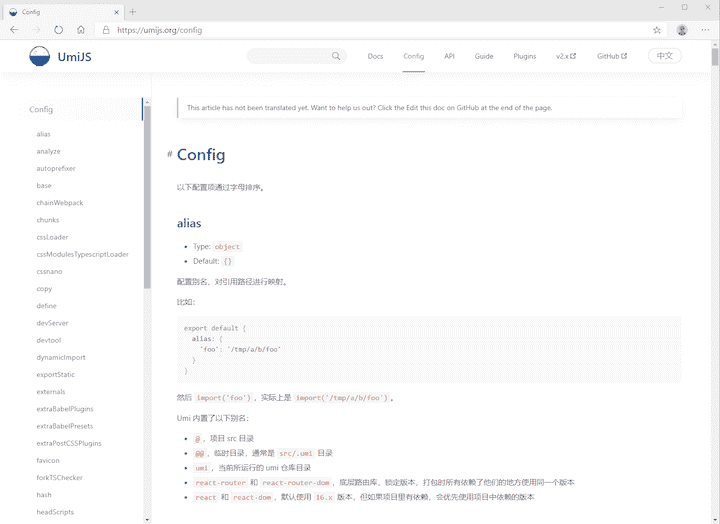

# UmiJS 与 Next.js 相比如何？

> 原文：<https://blog.logrocket.com/comparing-react-ssr-frameworks-umi-vs-next/>

UmiJS 是一个可扩展的企业级 React 框架，由[支付宝的开发团队](https://github.com/sorrycc)创作。支付宝在其内部项目中使用它，其他几家公司也是如此，如[优酷](https://www.youku.com/)和[网易](https://www.neteasegames.com/)。

在探索这个框架时，我发现它在一些有趣的方面与 Next.js 相似。两者都支持开箱即用的路由和服务器端呈现以及 TypeScript。

一路走来，我对海产生了好奇，并决定更深入地研究这个框架，看看它与 Next 相比如何。我根据下面列出的标准评估了这两个框架。这是我的发现。

## csm 支持

Next 支持所有的 CSS 样式方法，包括 JS，Sass，Stylus，Less，CSS 模块和 Post CSS。在常规 css 的情况下，您可以将 CSS 文件导入到您的页面中:

```
// styles.css
body {
  font-family: 'SF Pro Text', 'SF Pro Icons', 'Helvetica Neue', 'Helvetica',
    'Arial', sans-serif;
  padding: 20px 20px 60px;
  max-width: 680px;
  margin: 0 auto;
}

// pages/_app.js
import '../styles.css'

// This default export is required in a new `pages/_app.js` file.
export default function MyApp({ Component, pageProps }) {
  return <Component {...pageProps} />
}

```

Next 有官方插件，可以使用 Sass、Stylus 等工具编写 CSS。如果你使用 CSS 模块，你需要遵循 Next 的命名约定，`[name].module.css`。

```
// Button.module.css
/*
You do not need to worry about .error {} colliding with any other `.css` or
`.module.css` files!
*/
.error {
  color: white;
  background-color: red;
}

// Button.js
import styles from './Button.module.css'

export function Button() {
  return (
    <button
      type="button"
      // Note how the "error" class is accessed as a property on the imported
      // `styles` object.
      className={styles.error}
    >
      Destroy
    </button>
  )
}

```

另一方面，海已经放弃了对 Sass 的支持，目前支持常规 CSS、CSS 模块等等。如果您想使用 Sass 或 Stylus，您需要配置 webpack config 来实现。海自动识别 CSS 模块的使用。

```
// Example of CSS Modules
import styles from './foo.css';

// Example of Non-CSS Modules
import './foo.css';

```

## webpack 定制

接下来的特性，比如代码分割、热代码重载和服务器端渲染已经可以开箱即用了。但是如果你需要额外的能量或者只是一个不同的配置，Next 允许你通过它的 [`next.config.js`](https://nextjs.org/docs/api-reference/next.config.js/introduction) 模块编写你自己的配置。配置文件是常规的 Node.js 模块，而不是 JSON 文件。

```
module.exports = {
  /* config options here */
}

```

海也有自己的配置文件，但它是 JSON 文件的形式。

```
export default {
  base: '/docs/',
  publicPath: '/static/',
  hash: true,
  history: {
    type: 'hash',
  },
}

```

## 证明文件

我发现 Next 的文档在解释如何使用每个特性方面更加详细。

为了展示每个功能是如何工作的，文档会带你构建一个简单的博客应用。



另一件需要考虑的事情是:海的部分文档还没有翻译成英语(海的主要用户群位于中国)。我不得不使用谷歌翻译功能来帮助我阅读文档。



## CLI 支持

海有一些有趣的 CLI 支持来生成页面和检查当前的 webpack 配置。

```
  Usage: umi <command> [options]

  Commands:

    build     build application for production
    config    umi config cli
    dev       start a dev server for development
    generate  generate code snippets quickly
    help      show command helps
    plugin    inspect umi plugins
    version   show umi version
    webpack   inspect webpack configurations
    dva       
    test      test with jest

  Run `umi help <command>` for more information of specific commands.
  Visit https://umijs.org/ to learn more about Umi.

```

Next 的 CLI 支持专注于帮助您部署应用程序。

```
Usage
  $ next <command>

Available commands
  build, start, export, dev, telemetry

Options
  --version, -v   Version number
  --help, -h      Displays this message

For more information run a command with the --help flag
  $ next build --help

```

## 插件系统

海的内部功能都是第三方插件。文档涵盖了它的[插件系统](https://umijs.org/plugins/api)如何工作，以及一个[测试框架](https://umijs.org/plugins/test)。

Next 有自己的[插件集](https://github.com/vercel/next-plugins)，但我似乎找不到如何创建一个并与其他开发者共享的说明。

## 为什么 Next 有优势

Next 和海都完全支持在几乎不需要配置的情况下构建 React 应用程序。Next 对编写 CSS 和定制它的 webpack 配置有更完整的支持，而海更固执己见，没有给 webpack 配置太多支持。

现在，我更喜欢海，因为我发现海的文档有点难以理解。我还找到了更多用 Next 搭建东西的指南，比如电商网站、[静态网站](https://scotch.io/@sw-yx/using-nextjs-as-a-static-site-generator-for-netlify)。

## 您是否添加了新的 JS 库来提高性能或构建新特性？如果他们反其道而行之呢？

毫无疑问，前端变得越来越复杂。当您向应用程序添加新的 JavaScript 库和其他依赖项时，您将需要更多的可见性，以确保您的用户不会遇到未知的问题。

LogRocket 是一个前端应用程序监控解决方案，可以让您回放 JavaScript 错误，就像它们发生在您自己的浏览器中一样，这样您就可以更有效地对错误做出反应。

[](https://lp.logrocket.com/blg/javascript-signup)[https://logrocket.com/signup/](https://lp.logrocket.com/blg/javascript-signup)

[LogRocket](https://lp.logrocket.com/blg/javascript-signup) 可以与任何应用程序完美配合，不管是什么框架，并且有插件可以记录来自 Redux、Vuex 和@ngrx/store 的额外上下文。您可以汇总并报告问题发生时应用程序的状态，而不是猜测问题发生的原因。LogRocket 还可以监控应用的性能，报告客户端 CPU 负载、客户端内存使用等指标。

自信地构建— [开始免费监控](https://lp.logrocket.com/blg/javascript-signup)。