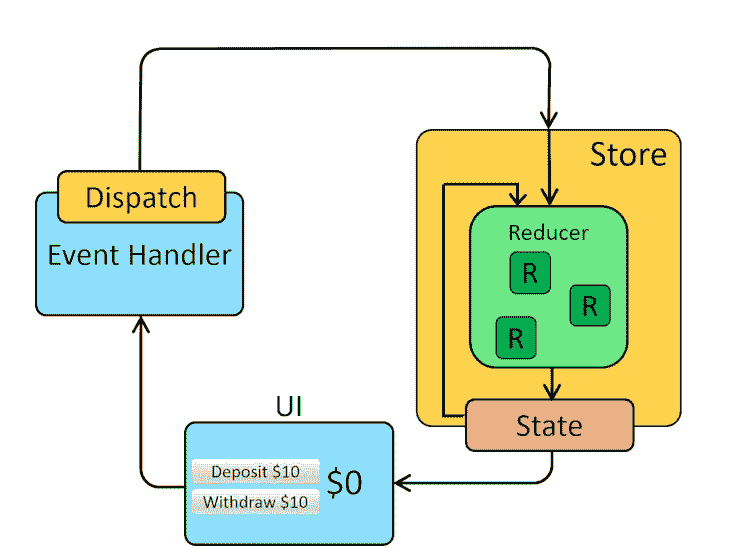
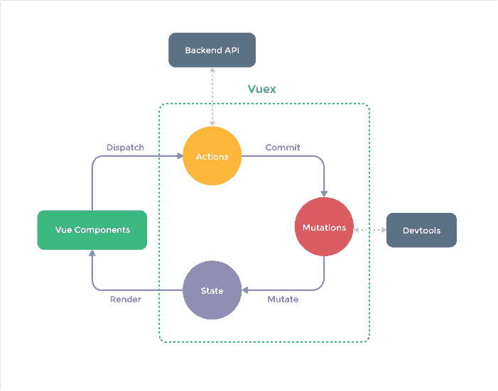

# Redux vs. Vuex 比较

> 原文：<https://blog.logrocket.com/comparing-redux-vs-vuex/>

状态是任何应用程序的关键部分，因为它处理数据如何在应用程序内部传递。随着应用程序变得越来越大，状态的管理变得越来越复杂，需要使用中央存储库来访问应用程序数据。这个中央存储库有助于确保应用程序中的状态管理是简单的、原子的和可扩展的。

在本文中，我们将仔细观察并比较当前前端生态系统中最流行的两个状态管理库: [Redux](https://redux.js.org) 和 [Vuex](https://vuex.vuejs.org) 。

## 内容

## 什么是状态管理，我们为什么需要它？

状态管理是读取和更改在应用程序的各个组件之间共享的状态(即数据)的方法。

状态并不总是复杂的。在某些情况下，州可以很小，很容易在本地管理。例如，处理从父组件 A 到子组件 b 的数据传递是非常简单的，但是，如果在外部组件 J 中需要来自组件 A 的一条信息呢？

在这种情况下，管理状态的一种方法可能是传播数据。然而，这并不总是有效的做法。

如前所述，当应用程序变大时，数据管理往往会变得更加复杂。这推动了对用于存储状态的集中式存储库的需求，这种存储库可以跨各种组件(甚至是不相关的组件)使用，这与钻取相反，钻取对于深度嵌套的组件来说可能是一个难题。

这促进了对全局状态的需求，全局状态是所有应用程序组件可以轻松访问所有应用程序状态的核心来源，几乎没有任何限制。

## Redux 是什么？

自 2015 年创建以来，Redux 已经发展成为 React 应用程序开发中最受欢迎的[状态管理库](https://blog.logrocket.com/redux-vs-mobx/)。它是一个可预测的状态容器，允许我们使用普通的 JavaScript，同时强制执行一致的模式，以确保我们的应用程序在客户端、服务器和本机环境中是可靠的，并且易于测试。

除了 React，Redux 还可以与任何其他 JavaScript 框架或库一起使用，如 Vue.js。然而，Redux 最近受到了一些批评[，声称它很难使用](https://blog.logrocket.com/redux-isnt-dead/)。这种负面反馈可能是因为编写动作来定义每一个可能的状态变化，然后创建多个 reducers 来控制这些动作会导致大量的代码，这些代码会很快变得难以管理。

为了解决这个问题，脸书的软件工程师丹·阿布拉莫夫和安德鲁·克拉克以及 React 的核心团队成员创造了 Redux Toolkit。它简化了存储设置，减少了所需的样板文件，使其成为高效 Redux 开发的首选工具。默认情况下，Redux Toolkit 也遵循最佳实践。

## Redux 是如何工作的？

在我们了解 Redux 如何用于管理 React 应用程序中的状态之前，让我们先了解一下它是如何工作的。

典型的 Redux 设置包括以下内容:

*   **状态**:app 中的数据；当组件连接到状态时，状态的更新会导致组件重新呈现
*   **Reducers**:Redux 存储更新的媒介；reducer 接收一个动作，存储中的状态根据动作类型和有效负载进行操作
*   **动作**:由 UI 组件触发的功能，目的是更新店铺；动作有一个类型和一个有效负载，它通过一个调度程序发送。虽然类型从字面上定义了发送给缩减器的动作的类型，但是有效负载是由缩减器在存储中更新的数据

这里有一张来自[redux.js.org](https://redux.js.org/tutorials/essentials/part-1-overview-concepts)的图表，展示了 Redux 状态管理库中的数据流:



## 如何使用 Redux 管理 React 中的状态

让我们仔细看看 Redux 是如何用于管理 React 应用程序中应用程序范围的状态的。在本演示中，我们将通过构建一个基本的计数器应用程序来展示实现，从而使事情变得简单。

### 项目设置

首先，使用下面的命令创建一个 React 项目，并将其命名为`redux-demo`:

```
create-react-app redux-demo

```

现在，安装`redux`包(这将使我们能够在应用程序中使用 Redux)和另一个名为`react-redux`的包，它使得将 React 应用程序连接到 Redux 存储和 reducers 非常简单:

```
npm install redux react-redux
>
```

接下来，启动服务器:

```
npm start

```

因为我们关注的是使用 Redux，所以我们不会详细讨论构建 React 组件的细节。

在`src`文件夹中，创建一个名为`components`的新文件夹，然后创建两个名为`Counter.js`和`Counter.css`的文件。将以下代码添加到`Counter.js`文件中:

```
const Counter = () => {
  return (
    <main>
      <h1>Redux Counter</h1>
      <div>{counter}</div>
      <button>Increment Counter</button>
      <button>Decrement Counter</button>
    </main>
  );
};

export default Counter;

```

这里，我们有两个按钮，稍后我们将使用它们来增加或减少`counter`值。

接下来，将`Counter.js`导入到`App.js`中。更新后的`App.js`文件应该是这样的:

```
import Counter from './components/Counter';

function App() {
  return <Counter />;
}

export default App;

```

### 设置 Redux

在`src`文件夹中，创建另一个名为`store`的文件夹；在这个文件夹中创建一个名为`index.js`的文件。我们还不会订阅商店，因为我们只是在设置`counter`值；我们还没有准备好开始监听它的状态变化。

接下来，将应用程序连接到 Redux 商店，以便应用程序内的组件可以使用商店；并导出`counterReducer`的一个实例。

`src/store/index.js`文件现在应该看起来像这样:

```
import { createStore } from "redux";

const counterReducer = (state = { counter: 0 }, action) => {
    if (action.type === "increment") {
        return {
            counter: state.counter + 1,
        };
    }
    if (action.type === "decrement") {
        return {
            counter: state.counter - 1,
        };
    }
    return state
};

const store = createStore(counterReducer);
export default store;

```

### 提供存储并访问由存储管理的数据

为了让应用程序组件使用商店作为中央状态存储库，我们必须用从`react-redux`导入的`Provider`组件包装根`App`组件。然后，我们将通过将它作为道具传递给`Provider`组件来引用商店。

为此，更新`src/index.js`文件，如下所示:

```
import React from 'react';
import ReactDOM from 'react-dom/client';
import './index.css';
import App from './App';
import { Provider } from 'react-redux';
import store from './store/index'

const root = ReactDOM.createRoot(document.getElementById('root'));
root.render(
  <Provider store={store}>
    <App />
  </Provider>
);

```

为了从`Counter`组件访问存储中的数据，我们将从`react-redux`库导入`useSelector`钩子。这个挂钩将使我们能够利用我们希望使用的商店的特定部分。

`useSelector`的另一个好处是它在幕后管理订阅。

我们将使用`useSelector`钩子从存储中提取`counter`状态。接下来，我们将传递一个函数，该函数接收由 Redux 管理的状态和我们想要提取的状态部分。然后，我们将输出`counter`值，如下所示:

```
import { useSelector } from 'react-redux';

const Counter = () => {
  const counter = useSelector((state) => state.counter);

  return (
    <main>
      <h1>Redux Counter</h1>
      <div>{counter}</div>
      <button>Increment Counter</button>
      <button>Decrement Counter</button>
    </main>
  );
};

export default Counter;

```

到目前为止，我们已经看到了如何检索由 Redux 管理的数据。现在，让我们看看如何更新数据。

### 调度操作以更新数据

为了将`counter`值增加或减少`1`，我们将使用`react-redux`包中的`useDispatch`钩子。

* * *

### 更多来自 LogRocket 的精彩文章:

* * *

首先，我们将调用`useDispatch`，它给了我们一个调度函数，我们可以调用它来调度对 Redux 存储的操作。接下来，我们将创建可以使用各种按钮调用的方法。我们还将传递类型标识符。

更新后的`Counter.js`文件如下所示:

```
import { useSelector, useDispatch } from 'react-redux';

const Counter = () => {
  const counter = useSelector((state) => state.counter);
  const dispatch = useDispatch();
  const incrementHandler = () => {
    dispatch({ type: 'increment' });
  };
  const decrementHandler = () => {
    dispatch({ type: 'decrement' });
  };
  return (
    <main>
      <h1>Redux Counter</h1>
      <div>{counter}</div>
      <button onClick={incrementHandler}>Increment Counter</button>
      <button onClick={decrementHandler}>Increment Counter</button>
    </main>
  );
};

export default Counter;

```

现在，当点击`increment`或`decrement`按钮时，会发生适当的动作，将`counter`值增加或减少`1`。

我们已经仔细研究了如何使用 Redux 来管理 React 应用程序中的状态。现在，让我们看看如何使用 Vuex 来管理 Vue 应用程序中的状态。

## 什么是 Vuex？

Vue 由尤雨溪创建，由 Vue 核心团队维护。Vuex 基于与 Redux 相同的[通量架构。Vuex 是 Vue.js 应用程序的状态管理模式和库。](https://blog.logrocket.com/pinia-vs-vuex/)

有了这个库，应用程序的状态就集中起来了，这样应用程序中的每个组件都可以随时访问应用程序所需的状态。有了 Vuex，获取状态变得很容易，而改变状态是有目的的。

## Vuex 是如何工作的？

Vuex 是状态、getters、突变和动作的集合:

*   **State** :就像 Redux 中一样，State 定义了整个应用程序的全局数据属性；这使得定位特定的数据变得容易，并且允许开发人员容易地拍摄当前应用状态的快照，用于调试或其他目的
*   **Getters** :存储中的计算值。在构建时，我们可能需要基于某个时间点计算派生状态，例如，过滤帖子列表并获得总数。如果这个值将被多个组件使用，那么我们通过使用 getters 来实现。这将防止我们在不同组件中重复实现相同结果的功能
*   **突变**:提交突变是有效更新 Vuex 存储中状态的唯一方式。突变就像事件；每个突变都有一个字符串类型和一个处理程序；状态修改由突变处理器执行
*   **动作**:在工作方式上非常类似于突变，但是，不是直接突变状态，动作提交突变，突变状态需要异步操作

这里有一张来自[vuex.vuejs.org](https://vuex.vuejs.org/#what-is-a-state-management-pattern)的图表，展示了 Vuex 状态管理库中的数据流:



## 如何使用 Vuex 管理 Vue.js 中的状态？

为了展示 Vuex 如何用于管理 Vue 应用程序中的状态，让我们从 Redux 演示中构建一个计数器应用程序的副本，具有相同的结构和功能。

### 项目设置和创建 Vuex 商店

首先使用下面的命令创建 Vue 项目名`vuex-demo`:

```
vue create vuex-demo

```

在 Vue 项目设置期间，我们会被问及一系列问题。对于本教程，我们采用以下配置:

| **提示** | **选项** |
| --- | --- |
| 请选择一个预设 | 手动选择功能 |
| 检查项目所需的功能 | 所有预选选项+ Vuex |
| 选择您想要用来启动项目的 Vue.js 版本 | 3.x |
| 选择棉绒/格式化程序配置 | 仅带防错功能的 ESLint |
| 挑选附加棉绒特征 | 保存时 Lint |
| 你更喜欢把 Babel，ESLint 等的配置放在哪里？ | 在专用配置文件中 |
| 将此存储为未来项目的预置？ | 普通 |

请注意，从 Vuex 创建之初就将其安装到我们的应用程序中是多么容易，这可以通过导航到`src/store/index`找到。

如果应用程序没有 Vuex，只需使用以下命令安装库:

```
npm install [email protected] --save

```

***注意，*** *在上面的代码中添加* @next *安装 Vuex 的最新版本*

继续，因为我们专注于使用 Vuex，我们将保持`Counter`组件简单。

导航到`src`文件夹，创建一个名为`Counter.vue`的文件，并添加以下代码:

```
<template>
  <main>
    <h1>Vuex Counter</h1>
    <div>0</div>
    <button>Increment Counter</button>
    <button>Decrement Counter</button>
  </main>
</template>

```

接下来，将`Counter.vue`导入到`App.vue`文件中。`App.vue`文件应该是这样的:

```
<template>
  <Counter />
</template>
<script>
import Counter from './components/Counter.vue';
export default {
  name: 'App',
  components: {
    Counter
  }
}
</script>

export default App;

```

接下来，我们需要为演示创建一个适当的状态、突变、动作和 getters。

### 在 Vue.js 组件中使用 Vuex 存储

状态是存储中的一包属性。因此，为了定义`counter`值的状态，我们将它作为键值插入到存储中的状态对象。我们也给它一个初始值`0`，如下所示:

```
import { createStore } from 'vuex';

export default createStore({
  state: {
    counter: 0,
  },
  mutations: {},
  actions: {},
  modules: {},
});

```

为了访问`Counter`组件中的`counter`值，我们首先导入商店，然后定位所需的州(在本例中是`counter`):

```
<template>
  <main>
    <h1>Vuex Counter</h1>
    <div>{{counter}}</div>
    <button>Increment Counter</button>
    <button>Decrement Counter</button>
  </main>
</template>
<script>

import { computed } from '@vue/reactivity';
import store from '../store';

export default {
  setup() {
    const counter = computed(() => {
      return store.state.counter
    })
    return {
      counter
    };
  },
};
</script>

```

为了让按钮更新`counter`值，我们将在`Counter`组件中创建方法，并分派一个调用突变的动作(在这里我们传递一个有效载荷)来更新状态。从`Counter`组件传递来的有效载荷用于更新`counter`状态(通过`1`对其进行递减或递增)。

为了实现这一点，我们将更新`Counter.vue`，如下所示:

```
<template>
  <main>
    <h1>Vuex Counter</h1>
    <div>{{ counter }}</div>
    <button @click="increment">Increment Counter</button>
    <button @click="decrement">Decrement Counter</button>
  </main>
</template>

<script>
import { computed } from '@vue/reactivity';
import store from '../store';
export default {
  setup() {
    const counter = computed(() => {
      return store.state.counter
    })
    const increment = () => {
      store.commit('increment', { value: 1 })
    }
    const decrement = () => {
      store.commit('decrement', { value: 1 })
    }
    return {
      counter
    };
  },
};
</script>

```

接下来，更新商店:

```
import { createStore } from 'vuex';
export default createStore({
  state: {
    counter: 0,
  },
  mutations: {
    increment(state, payload) {
      state.counter = state.counter + payload.value;
    },
    decrement(state, payload) {
      state.counter = state.counter - payload.value;
    },
  },
  actions: {},
  modules: {},
});

```

### 使用字母读取状态

假设我们想读取一个状态的值，也许用它来执行一个外部操作。我们可以使用吸气剂来实现这一点。

在计数器演示中，我们将读取`counter`值，并在 DOM 上呈现乘以`2`的值。

让我们更新存储以使用 getters，如下所示:

```
import { createStore } from 'vuex';

export default createStore({
  state: {
    counter: 0,
  },
  mutations: {
    increment(state, payload) {
      state.counter = state.counter + payload.value;
    },
    decrement(state, payload) {
      state.counter = state.counter - payload.value;
    },
  },
  actions: {},
  getters: {
    modifiedCounterValue(state) {
      return state.counter * 2;
    },
  },
  modules: {},
});

```

我们现在可以从`App.vue`文件中访问`modifiedCounterValue`。我们使用一个`computed`属性来实现，如下所示:

```
<template>
  <Counter />
  <div>Modified counter value: {{modifiedCounterValue}}</div>
</template>

<script>
import { computed } from '@vue/reactivity';
import Counter from './components/Counter.vue';
import store from './store';

export default {
  name: 'App',
  components: {
    Counter,
  },
  setup() {
    const modifiedCounterValue = computed(() => {
      return store.getters.modifiedCounterValue
    })
    return {
      modifiedCounterValue,
    }
  }
}
</script>

```

### 调度操作以更新数据

在 Vue 中，最好的做法是只在执行异步操作时使用动作。因为我们的小演示不是异步的，所以我们可以仔细阅读 [Vuex docs](https://vuex.vuejs.org/guide/actions.html) 来了解如何在使用异步操作和处理承诺(比如从 API 获取数据)时使用动作来调度数据。

## 结论

Redux 和 Vuex 状态管理库在开发者生态系统中广泛使用。在本文中，我们探索了这两个库，展示了它们是如何工作的，并演示了如何使用它们。我们还查看了 Redux 工具包，并展示了它如何帮助简化 Redux 设置、帮助避免常见错误，以及用名为`configureStore`的改进版本替换`createStore`。

你可以在[官方文档](https://redux.js.org/introduction/why-rtk-is-redux-today)中阅读更多关于 Redux Toolkit 的内容。同样，你可以从它的[官方文档](https://vuex.vuejs.org)中了解更多关于 Vuex 的信息。

这些库可以作为所有应用程序状态的可预测的中央存储，但是最好避免在不太复杂的应用程序中使用它们，因为这可能会成为一种乏味而繁琐的方法。

与 Vuex 相比，Redux 是一个更受欢迎和支持更好的库，但 Vuex 似乎是一个更好的维护性能的状态管理库。然而，选择权在你，取决于你具体的项目需求。

我希望这篇文章能帮助你更好地理解 Redux 和 Vuex 是如何工作的，并为你提供有用的信息来决定哪个解决方案最适合你的项目。

## 像用户一样体验您的 Vue 应用

调试 Vue.js 应用程序可能会很困难，尤其是当用户会话期间有几十个(如果不是几百个)突变时。如果您对监视和跟踪生产中所有用户的 Vue 突变感兴趣，

[try LogRocket](https://lp.logrocket.com/blg/vue-signup)

.

[](https://lp.logrocket.com/blg/vue-signup)[https://logrocket.com/signup/](https://lp.logrocket.com/blg/vue-signup)

LogRocket 就像是网络和移动应用程序的 DVR，记录你的 Vue 应用程序中发生的一切，包括网络请求、JavaScript 错误、性能问题等等。您可以汇总并报告问题发生时应用程序的状态，而不是猜测问题发生的原因。

LogRocket Vuex 插件将 Vuex 突变记录到 LogRocket 控制台，为您提供导致错误的环境，以及出现问题时应用程序的状态。

现代化您调试 Vue 应用的方式- [开始免费监控](https://lp.logrocket.com/blg/vue-signup)。