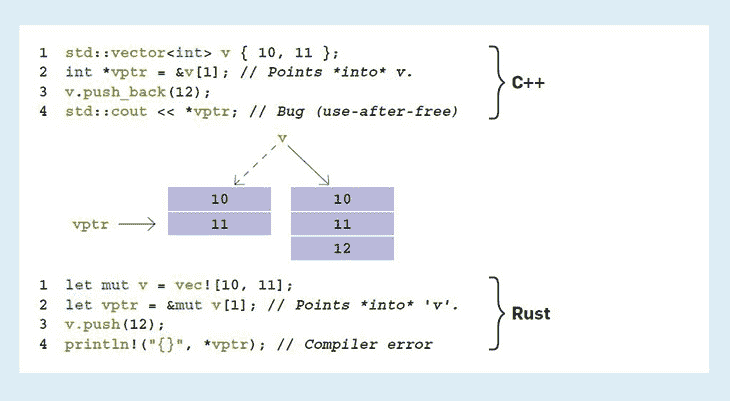

# Rust 和 Nim 的比较

> 原文：<https://blog.logrocket.com/comparing-rust-nim/>

在技术生态系统中，比较编程语言并不是一个新话题。开发人员不断评估语言、框架和工具。

Rust 和 Nim 在设计、语法、用例等方面有很多相似和不同之处，这使得它们成为彼此可行的替代方案。

本文将向您概述 Rust 和 Nim 编程语言，以及它们的优缺点和特性。我们开始吧！

## 什么是铁锈？


Rust 是一种多范例、静态类型、通用编程语言。它因其性能、类型安全、内存安全和并发性而最受欢迎。

Mozilla 基金会建立了 Rust，自其发布以来，开发人员生态系统一直在增长，使该语言成为许多调查中的首选，包括年度 Stack Overflow 开发人员调查。

## 生锈特征

Rust 是一种功能丰富的编程语言。c 绑定、内存安全和表达能力只是该语言的几个卖点。我们将在下面更深入地讨论这些问题。

### 高效的 C 绑定

Rust 被设计来违反 C 的技术债务；因此，Rust 可以与 C 互操作。换句话说，您可以从 Rust 调用 C 代码，并与现有的库和代码库进行交互。Rust 使用外来函数接口与 C 进行通信，为了安全起见，您可以保留自己喜欢的 Rust 特性。

```
extern fn callback(a: i32) {
    println!("I'm called from C with value {0}", a);
}

#[link(name = "extlib")]
extern {
   fn register_callback(cb: extern fn(i32)) -> i32;
   fn trigger_callback();
}

fn main() {
    unsafe {
        register_callback(callback);
        trigger_callback(); // Triggers the callback
    }
}

// C
typedef void (*rust_callback)(int32_t);
rust_callback cb;

int32_t register_callback(rust_callback callback) {
    cb = callback;
    return 1;
}

void trigger_callback() {
  cb(7); // Will call callback(7) in Rust
}

```

在这个例子中，Rust 的`main()`将调用 C 中的`trigger_callback()`，这将依次回调 Rust 中的`callback()`。

### 内存安全

内存安全无疑是 Rust 的卖点。与 Nim 等使用垃圾收集器的其他编程语言不同(我们稍后会谈到这一点)，Rust 使用借用检查器和自定义所有权模型来保证内存安全。借用检查器确保程序有效地使用内存并遵守所有权规则。



### 表达性

Rust 具有高度的表现力和灵活性。Rust 作为一种多范例编程语言，为开发人员的生产力提供了简单的错误处理、多种数据类型和模式匹配系统。

## Rust 用例


Rust 是一种多用途的编程语言，你几乎可以在任何地方运行 Rust。这里有几个你可以使用 Rust 编程语言的热门领域:

### 系统编程

Rust 是系统编程领域的一个大竞争者。Rust 的低级表达能力赋予了这种语言与嵌入式系统交互的优势。

### Web 开发

Rust 是许多 web 框架的家园，许多项目都采用 Rust 作为他们的服务器端编程语言，以利用 Rust 的安全性、性能等等。你可以使用像 Yew 和 Moonzoon 这样的框架作为 web 应用的前端，使用 Actix、Rocket、Warp 或 Tide 作为应用的后端。有像 Diesel 和 SQLX 这样的 ORM，也有数据库驱动程序来提供完整的体验。

你可以借助 Rust 来构建其他语言的库和工具。此外，Rust 适用于构建工具，如浏览器、操作系统、网络和需要低级资源交互的服务。

## 使用铁锈的好处

Rust 是构建您希望长期支持的安全程序的首选语言。如果你使用 Rust，你几乎不会遇到生产中的错误，因为 Rust 提供了类型安全和内存安全。

此外，Rust 是一种多用途的通用编程语言，这意味着您可以在多种环境中使用和运行 Rust，并在许多用例中使用 Rust。Rust 非常有表现力，生态系统正在不断发展，以支持更多的用例和功能。

最后，Rust 支持现代编程语言中的大多数特性。铁锈表现力极强；该语言支持泛型、丰富模式、语法和多种范式的编程。

## 使用铁锈的缺点

现在，我们将讨论伴随 Rust 令人敬畏的特性而来的一些缺点。

在编译时，Rust code 输出的二进制文件比 C 和 C++等类似语言更大，后者的文件大小针对可移植性进行了优化。此外，Rust 编译器相当慢，因为借用检查器必须在编译和执行程序之前仔细检查程序的内存安全。

* * *

### 更多来自 LogRocket 的精彩文章:

* * *

由于 Rust 在其设计和实现中有一些在其他语言中找不到的更新的概念，学习 Rust 的体验是缓慢的，开发人员必须花更多的时间来学习 Rust 的各个方面，以编写安全高效的代码。

Rust 的开发人员有限，这是由于掌握这门语言需要的时间、这门语言的年龄(这反映在软件包和构建工具的生态系统中)以及其他一些普遍的不利因素。

## 开始使用 Rust

Rust 也有干净的语法；任何人都能理解一个简单的 Rust 程序。Rust 中有一个简单的“hello world”程序。

```
fn main() {
    println!("Hello World!");
}

```

每个 Rust 程序都必须有一个`main`函数——程序的入口点。`println`宏在执行时将文本参数写入控制台。

Rust 有很多用例，包括 web 开发。[如果你想开始写 Rust 程序，推荐 Rust book](https://doc.rust-lang.org/book/) 。

## 尼姆是什么？


Nim 是一种动态的、静态类型的、编译过的系统编程语言，语言相对简洁。Nim 的设计受到 Ada、Python 和 Modula 的启发，拥有每个开发人员都喜欢的更多功能。

Nim 也是面向社区的，这与现代编程语言如 Go、TypeScript 和 Rust 不同。总的来说，Nim 也有良好的治理。

## 尼姆的特征

Nim 是优雅的、富于表现力的、高效的，它包含了你想要的许多未来的“即将流行的”编程语言。以下是 Nim 编程语言中一些有前途的特性:

### 多语言互操作性

令人印象深刻的是，Nim 可以通过一个外来的函数接口与 C 和 C++进行互操作。您可以将 Nim 代码编译成 C、C++和 JavaScript，并在您喜欢的任何环境中运行它。

由于 Nim 是可移植的和可互操作的，希望利用 Nim 特性的公司和开发者可以快速地将现有的开发者加入到 Nim 生态系统的语言特性中。

```
int addTwoIntegers(int a, int b)
{
  return a + b;
}

// nim
{.compile: "logic.c".}
proc addTwoIntegers(a, b: cint): cint {.importc.}

when isMainModule:
  echo addTwoIntegers(3, 7)

```

在这个例子中，除了 nim 文件之外，Nim 编译器还将编译`logic.c`文件，并将两者链接成一个可执行文件，该文件在运行时输出`10`。

### 内存管理

Nim 是提供多种内存管理策略范例的语言之一。借助 Nim 的超高效垃圾收集器，Nim 提供了手动和自动内存管理功能。根据您的用例，您可以[调整垃圾收集器](https://nim-lang.org/1.4.0/gc.html#tweaking-the-refc-gc)以获得更大的灵活性和控制力，从而使 Nim 成为更广泛应用的理想选择。

### 表达性

Nim 无疑是最具表现力的编程语言之一。Nim 的语法易于阅读和理解，尤其是因为流行语言启发了它的语法。

Nim 有多种数据类型，可以用于多种目的，并且该语言支持函数式和面向对象范式的编程。

此外，Nim 是自包含的(Nim 编译器内置于 Nim 中)，具有一个宏系统，提供操作抽象语法树的功能。

## Nim 用例

尽管 Nim 是一种相对较新的语言，但是开发者和公司已经在用 Nim 构建并投资于这种语言。以下是 Nim 编程语言蓬勃发展的几个广泛使用的案例:

### 游戏开发

游戏开发者正在快速采用 Nim，主要是因为 Nim 的基础更适合游戏开发。Nim 提供了性能、简单的抽象和资源管理。

要构建功能游戏，可以使用 Nim 生态系统中的游戏开发引擎包、框架和仿真器包。

### Web 开发

考虑到性能、易用性和许多其他指标，Nim 是一种很好的服务器端编程语言。

在 Nim 生态系统中，您会发现框架、路由器、ORM、SQL 和 NoSQL 数据库包有助于加快您的 web 应用程序开发。

因为您可以将 Nim 代码转换成 JavaScript，所以您也可以在 web 应用程序的前端探索使用 Nim。

### 图形用户界面

Nim 广泛用于开发图形用户界面(GUI ),工具包类似于其他语言的 GUI 包。

你可以使用像受 GTK 工具包启发的 Gintro 库这样的包来构建跨平台的 GUI 应用程序、web 应用程序、交互式命令行界面等等。Nim 的生态系统正在增长，并且有针对众多用例的包。查看由 Nim 贡献者提供的[资源](https://github.com/nim-lang/Nim/wiki/Curated-Packages#games)，获得 Nim 生态系统中的软件包列表。

## 使用 Nim 的优点

如果您在项目中使用 Nim，Nim 的互操作性是您将享受的乐趣之一。如果您选择改变语言，如果 Nim 支持的话，您可以很容易地将代码转换成您喜欢的语言。最终，您可以为更多的用例及环境编写 Nim 代码。

Nim 是一种通用的、完全开源的语言，在其生态系统中有许多生产就绪的库，并且由于生态系统正在快速发展，不久之后，您将能够在社区支持的任何应用程序中使用 Nim。

开发人员害怕编程语言的原因之一是学习曲线。Nim 表达能力强，简洁，易于使用。这种语言的学习曲线不像 Rust 和 C++那样复杂，而且你可以获得相同水平的性能和特性。

## 使用 Nim 的缺点

Nim 是新的，虽然它是一种现代编程语言，提供了如此多的东西，但这种语言并不那么流行。这意味着雇佣开发人员和在 Nim 生态系统中寻找支持可能是一项艰巨的任务，并且在关键应用程序的生产中使用 Nim 可能不是最佳解决方案。

Nim 没有 Rust 那样丰富的并发编程和线程支持。并发对于许多用例越来越重要，而 Nim 缺乏支持限制了开发人员从使用 Nim 中获得的性能。

## Nim 入门

Nim 简单而优雅，其他语言的成功启发了它的语法。Nim 中的打印与 bash 中的打印非常相似。Nim 中有一个简单的“hello world”程序:

```
echo "Hello World"

```

关键字`echo`将文本打印到控制台。您可以查阅 [Nim 文档](https://nim-lang.org/documentation.html)或 [Nim by Example](https://nim-by-example.github.io/hello_world/) 资源，开始编写 Nim 程序。

## Rust 和 Nim 编程语言的比较

Rust 和 Nim 是为解决类似问题而设计的现代编程语言，它们有相似的优缺点、设计和原则。

Rust 比 Nim 更受欢迎，这可以归功于 Mozilla。与此同时，Nim 没有得到大公司的支持，几乎没有任何有影响力的技术人物承认在生产中使用这种语言。

Rust 和 Nim 是静态类型的，非常有表现力，它们支持多种范例的编程，使它们适用于相同的目的。

这里有一个对照表，概括了这些语言的相似之处和不同之处。

在我看来，你应该在你能使用的地方使用 Rust，在你必须使用的地方使用 Nim。这是因为开发者池和 Nim 的状态。找到 Rust 开发人员比 Nim 开发人员更容易，而且 Rust 生态系统比 Nim 的重要得多，对开发中使用的流行软件有更多的支持。

Nim 是一种很有前途的语言，可能很快就会吸引更多的注意力，但同时，你会希望需要一种与更多人相关的软件，这就是我选择 Rust 的原因。

假设拉斯特和尼姆两个人都一样成熟。在这种情况下，我会选择 Nim，因为它更容易从这种语言中获得很多东西，比如性能，而不必担心借用检查器和许多其他令人不安的概念，作为 Rust 开发人员，您必须学习这些概念才能编写安全的 Rust 代码。

## 结论

Rust 和 Nim 是优秀的编程语言，具有现代编程特性和性能。

在本教程中，您了解了 Rust 和 Nim 编程语言、它们的特性、用例、优缺点、帮助您入门的见解、两种语言之间的比较以及我的个人观点。

## [log rocket](https://lp.logrocket.com/blg/rust-signup):Rust 应用的 web 前端的全面可见性

调试 Rust 应用程序可能很困难，尤其是当用户遇到难以重现的问题时。如果您对监控和跟踪 Rust 应用程序的性能、自动显示错误、跟踪缓慢的网络请求和加载时间感兴趣，

[try LogRocket](https://lp.logrocket.com/blg/rust-signup)

.

[](https://lp.logrocket.com/blg/rust-signup)

LogRocket 就像是网络和移动应用程序的 DVR，记录你的 Rust 应用程序上发生的一切。您可以汇总并报告问题发生时应用程序的状态，而不是猜测问题发生的原因。LogRocket 还可以监控应用的性能，报告客户端 CPU 负载、客户端内存使用等指标。

现代化调试 Rust 应用的方式— [开始免费监控](https://lp.logrocket.com/blg/rust-signup)。