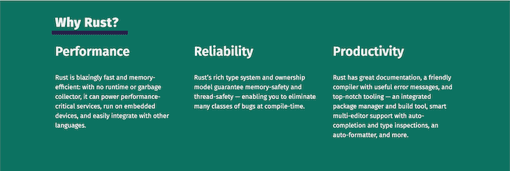
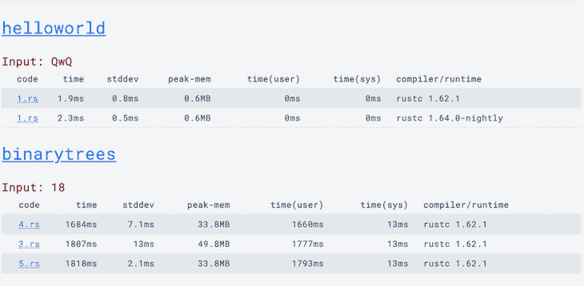
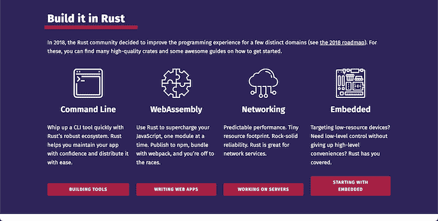
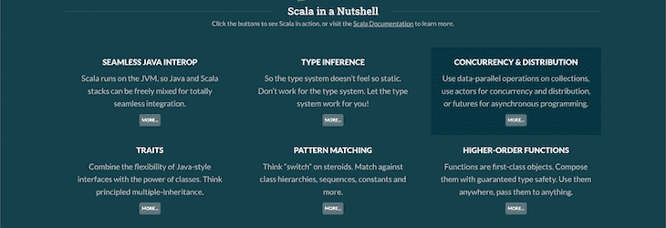
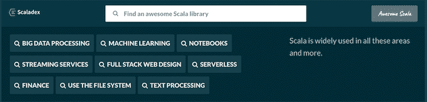
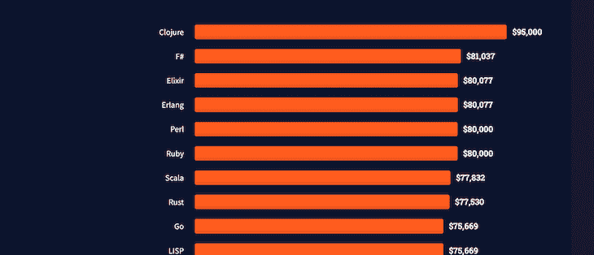

# Rust 和 Scala 的比较

> 原文：<https://blog.logrocket.com/comparing-rust-scala/>

Rust 和 T2 Scala 都是流行的编程语言，被广泛采用和使用，都因其对并发性、速度、表现性和可伸缩性的出色支持而受到赞赏。

Rust 和 Scala 是作为强大语言的替代品而构建的，这些语言已经获得了技术债务，并且缺乏现代编程实践。

本文将比较 Rust 和 Scala，让您深入了解它们的用例，为什么以及何时应该使用它们中的任何一个，等等。

向前跳:

## 什么是铁锈？

Rust 是一种快速的、静态类型的、编译的、多用途的编程语言，以其速度、内存安全、并发模型和富类型系统而闻名。

自 2016 年以来，Rust 一直是 Stack Overflow 开发者调查中最受欢迎的编程语言，因为它有很多好处。Rust 支持多种编程范式，提供了良好的表达能力，并且具有易于理解和使用的语法。



Rust 旨在解决对 C++的批评，该语言被广泛用于针对低资源设备的系统编程中。Rust 在 web 前端(通过 WebAssembly)用于运行高性能的 web 应用程序，在后端用于快速 I/O 操作，构建可分发的命令行应用程序，以及联网以提高性能和可靠性。

## 铁锈的特征

Rust 正在成为主流，许多公司和开发者正在他们的项目中使用它——下面是一些原因。

### 内存安全

Rust 既不是垃圾编译，也不像 C 和 C++那样支持快速内存管理。Rust 使用所有权模型进行内存管理，使用[借用检查器](https://blog.logrocket.com/introducing-the-rust-borrow-checker/)来执行所有权规则，所有权规则是编译器在编译时检查的一组规则。

所有权模型和借用检查器确保 Rust 程序是内存安全和高效的。尽管它们有助于 Rust 陡峭的学习曲线——特别是如果你来自一个垃圾编译语言——当你写更多的代码时，你会开始欣赏借用检查器并理解为什么开发人员喜欢 Rust。

### 并发

Rust 和 Go 等现代编程语言中的并发性是一个卖点。并发不是新趋势，现代编程语言已经实现了理想的模式。

Rust 的[无畏并发](https://doc.rust-lang.org/book/ch16-00-concurrency.html)概念独特地处理并发，并通过服务于许多用例的抽象帮助最大化性能和最小化错误。Rust 提供了创建线程、线程间通信和线程间共享状态的功能，所有这些都内置于标准库中。

编译器保证 Rust 程序是无数据竞争的，并发程序不会行为不当。

### Rust 的互操作性

Rust 可以通过其外部函数接口(FFI)与许多语言进行互操作，比如 C 和 C++。与 C 互操作要求您包装公开的 C API 或构建 Rust 集成的代码。C++没有稳定的应用程序二进制接口(ABI)，所以你必须使用 C ABI。

C 和 C++是许多代码库中使用的流行语言。随着它们变得越来越老，并且由于获得的技术债务而变得不愉快，现代编程语言需要与它们互操作以继续繁荣。Rust 符合 C 和 C++的大多数特性和体验，使它成为一个可行的选择或替代品。

### 表演

在性能方面，Rust 经常与 Go、C++和 Zig 等语言相提并论。性能是 Rust 适合广泛用例的原因之一，尤其是嵌入式系统和 web 应用程序。



根据[编程语言和编译器基准](https://programming-language-benchmarks.vercel.app/rust) [，](https://programming-language-benchmarks.vercel.app/rust)没有并行化，这些分别是来自打印`helloworld`和`binarytrees`的基准。

## 剖析一个简单的 Rust 程序

开始使用 Rust 很容易。安装说明和成为 Rust 编程专家所需的一切都在 [Rust book](https://doc.rust-lang.org/book/) 中提供。

这是一句最简单的“你好，世界！”Rust 中的程序:

```
fn main() {
    println!(“Hello, world!”);
}

```

Rust 程序的入口点是`main`函数，`println!`宏将文本打印在新的一行上。

在 LogRocket 博客的 Rust 版块[，你还可以找到许多 Rust 资源，从 web 开发到区块链，以及许多其他资源。](https://blog.logrocket.com/tag/rust/)

## 流行的 Rust 用例

开发人员喜欢 Rust，因此在许多用例中使用这种语言。这里有几个著名的 Rust 用例。



### Web 开发

无论是你的 web 应用的前端还是后端，都可以使用 Rust。Rust 生态系统是奇妙的前端框架的家园，如 stdweb，用于与 DOM APIs、Yew、Actix、Rocket 和 Warp 等后端框架以及部分由 WebAssembly 支持的全栈框架如 Yew、Percy 和 MoonZoon 进行通信。

### 区块链发展

因为 Rust 是一种安全第一、高效的现代编程语言，所以它适合构建区块链和分散式应用程序。

Rust 是在 [Polkadot](https://polkadot.network/) 和 [Solana](https://solana.com/) 上构建应用程序的主要语言，你会发现 Rust SDKs 用于构建许多其他流行的区块链。

### 嵌入式系统编程

Rust 在嵌入式系统编程中非常普遍，并且正在慢慢取代 C 和 C++。Rust 的低级表达能力使该语言成为构建嵌入式系统，尤其是物联网设备的绝佳选择。Rust 生态系统中甚至有许多基于微控制器的项目，包括 [Arduino](https://www.arduino.cc/) 。

在许多其他领域，开发人员喜欢使用 Rust 大多数库通常易于使用，并且受到开发人员习惯使用的旧库的启发。Rust 生态系统还很年轻，很多库还在开发中。

## 使用铁锈的好处

以下是开发人员喜欢 Rust 的原因概述。

1.  与许多其他语言相比，Rust 简洁且非常灵活。在 Rust 中实现任何设计模式都很容易。Rust 在标准库中也实现了泛型
2.  在选择系统编程语言时，并发是一个需要考虑的特性，Rust 提供了安全的并发特性
3.  与现代和旧的编程语言相比，Rust 速度快，效率高。你会经常发现 [Rust 被拿来和 C、C++比较，并且在速度方面和](https://blog.logrocket.com/when-to-use-rust-when-to-use-golang/#:~:text=For%20all%20of%20the%20tested,the%20most%20optimized%20Go%20code)进行比较，Rust 经常在基准测试中胜出
4.  Rust 开发团队优先考虑并保证语言的向后兼容性。Rust 的 crater 工具编译并测试板条箱，以确保新版本与所有板条箱兼容
5.  所有权模型和 Rust 借用检查器是开发人员喜欢 Rust 的一个特性。内存安全是 C 和 C++的问题，缺乏灵活性是垃圾编译语言的顺序。Rust 解决了这些问题

## 使用铁锈的缺点

带锈的不全是玫瑰和青鸟；在使用之前，有一些缺点需要考虑。

1.  初学者友好？不生锈！Rust 有一个非常陡峭的学习曲线。无论你来自哪种语言，都有许多新概念需要适应。对于初学者来说，借书检查器也是非常令人沮丧的
2.  如果你考虑开发人员的生产力，Rust 不是你可能会选择的语言。好的东西需要时间，就像 Rust 程序一样，如果你想快速构建一个产品，你最好使用 Go、JavaScript 等。
3.  Rust 是一种相对较新的语言，虽然它的特性很有前途，但是对于您可能想用它探索的许多用例来说，Rust 生态系统仍然非常不成熟
4.  随着程序大小的增加，Rust 程序的编译时间会很长。这是因为借用检查器必须验证程序及其所有依赖项是内存安全的

尽管有这些缺点，许多开发人员仍然选择 Rust 作为他们最喜欢的语言。您将需要考虑是否有任何不利因素会影响您使用 Rust 的理由，并进行权衡。

## 什么是 Scala？

Scala(可扩展语言)是一种多范例、强大、静态类型、通用的编程语言，旨在解决 Java 的遗留问题。Scala 是简洁的，并且被设计成基于用户需求而增长。

Scala 运行在 Java 虚拟机(JVM)上，这意味着您可以编写 Scala 代码在任何地方运行。Scala 还有一个编译器，将 Scala 代码编译成 Java 字节码执行，还有一个解释器。



Scala 提供了面向对象语言(每个值都是一个对象)和函数式编程的特性，类似于 [Haskell](https://www.haskell.org/) 。

你可以把 Scala 代码编译成 Java 字节码，在 JVM (Java 虚拟机)上运行，这里的语言与 Java 有双向互操作性，可以使用 Scala 中已有的 Java 库，也可以使用 Java 中的 Scala 库。

开发者和公司在许多用例中使用 Scala，比如机器学习、金融、全栈 web 开发、数据处理、分布式系统等等。

## Scala 的特性

Scala 是一种优雅的编程语言，提供了广泛的简单特性。

> [如果有一个精灵窃听每一个 Java 开发人员，当他们诅咒他们的构建由于缺少分号而崩溃时，Scala 就会发生什么，然后从他们的抱怨中推断出一个愿望—](https://medium.com/knerd/java-scala-interoperability-83b2d8438ac0)Knewton。

下面是 Scala 的一些优秀特性，这些特性使得这种语言非常值得使用。

### 函数式编程

Scala 是为数不多的同时提供开箱即用的函数式编程特性的面向对象语言之一，增加了它的表达能力。Scala 提供了函数式编程特性，包括不变性、currying、模式匹配、惰性求值，以及一个支持匿名类型、代数类型、高阶类型、运算符重载、命名参数、可选参数和代数效果的高级类型系统。

Scala 的多范式特性是该语言的卖点之一，也使它适合学术目的和更广泛的用例。

### 跨语言互操作性

Scala 是最具互操作性的语言之一。Scala 可以与 Java、JavaScript 和。NET 框架。此外，您可以在 LLVM 上运行 Scala(目前是 beta 版)。

因为 Scala 是 JVM 生态系统的一部分，所以让 Scala 代码与 Java 互操作是一个很好的开发决策。因为 Java 可以和。NET，Scala 同样可以与. NET 互操作。

对于前端 web 应用，可以将 Scala 编译成 JavaScript 在浏览器中执行，或者将 Scala 编译成 WebAssembly 绕过 JavaScript 直接在浏览器中运行 Scala。Scala 生态系统也是一些后端 web 框架的所在地，提供全栈体验。

互操作性使 Scala 开发人员能够在许多用例中使用 Scala 程序，而不必使用或学习新的语言。

### 并发

Scala 的并发模型建立在 Java 的并发模型之上。您可以在一台机器上运行无限的线程，并且线程不是程序中并发的唯一选择——您还可以使用 Scala 的特性和特性参与者来提高程序的并发性和灵活性。Scala 提供的多种并发选项使其成为数据处理和许多其他应用程序的可行选项。

## 剖析一个简单的 Scala 程序

每个 Scala 程序都以`main`方法、对象和表达式开始。

```
object LogRocket {
  def main(args: Array[String]) {
    println(“Hello world!”)
  }
}

```

数组是基于您的操作可以使用的命令行参数的列表，`println`方法在新的一行中打印数据参数。

## 流行的 Scala 用例



### 大数据处理

当主题是大数据处理时，Scala 最出彩，因为它提供了函数式编程。像 Apache Spark、Kafka 和 Flink 这样的大数据解决方案都是用 Scala 编写的，因为 Scala 提供了处理大型数据集的功能。

### Web 开发

你可以用 Scala 构建全栈 [web 应用。有前端 web 和后端框架，因为 Scala 可以与 JavaScript 互操作，所以用 Scala 构建 web 应用程序更容易。](https://blog.logrocket.com/strongly-typed-frontend-code-scala-js/)

### 你可以在任何地方使用 JavaScript

Scala 程序可以与 Java 互操作，所以你可以使用 Scala 而不是 Java 来保留你喜欢的 Scala 特性，并使你的程序更容易构建和维护。

## 使用 Scala 的好处

你会喜欢 Scala 的原因有很多。以下是 Scala 出名的几个原因:

1.  与 Java 和大多数函数式编程语言相比，Scala 代码更加易读和简洁
2.  Scala 与其他语言和平台的互操作性给了它一个优势，因为你可以写一次程序，然后在任何地方运行它们
3.  Scala 是非常可扩展的，因为它结合了多种范例，所以思想表达能力增加了。您可以使用 Scala 构建容错、高度并发的系统
4.  Scala 的多范例特性使得这种语言对许多用例及领域都很有用

## 使用 Scala 的缺点

你很难找到像 Scala 这样为美学语言编写 Scala 代码的开发人员。原因如下:

1.  尽管 Scala 已经存在了 17 年，但 Scala 生态系统仍在发展，寻找 Scala 开发人员是一项挑战
2.  Scala 有一个艰难的学习曲线，如果你以前没有使用过像 Java 或 Kotlin 这样的 JVM 语言，你可能不会完全理解它和它的功能
3.  Scala 继承了 Java 的一些缺点，尤其是 JVM 的缺点，包括没有合适的尾部递归优化

尽管如此，Scala 已经在高端技术中得到了应用，许多公司正在投资将该语言作为其基础设施的一部分。

## 比较 Scala 和 Rust

Scala 和 Rust 有很多相似之处，你可以在一些相同的用例中使用这两种语言，而不会影响基本特性。Scala 在大数据、数据处理和流处理领域找到了最受欢迎的应用，而 Rust 则在游戏开发、区块链开发和嵌入式系统编程等更高性能的应用领域找到了自己的一席之地。

你会想要使用正确的工具来完成正确的工作，所以你不会想要在容易生锈的地方使用 Scala，反之亦然。您的选择应该基于用例、表现性、开发人员社区支持以及适合您的用例的库。

您可以轻松地使用任何一种语言进行 web 开发，因为它们的生态系统是许多强大的 web 框架的家园。

| 斯卡拉 | 锈 | 表示 |
| --- | --- | --- |
| 非常有表现力和灵活性 | 富有表现力和灵活性 | 范例 |
| 函数式和面向对象的 | 面向对象和并发 | 类型系统 |
| 强静态类型 | 使用泛型进行强静态类型化 | 流行的使用案例 |
| 数据处理、分布式系统、web 开发等。 | 通用应用程序、web 和服务器端应用程序、区块链开发、游戏等。 | 根据 [Stack Overflow 开发者调查](https://survey.stackoverflow.co/2022/)显示，Scala 和 Rust 都在付费最高的十大编程语言之列，证明这两种语言的价值和需求都很高。 |



我的建议是，如果你以前使用过基于 JVM 的语言，尤其是 Java，就选择 Scala，以便充分利用 Scala，并在学习和掌握过程中坚持下去。

如果你是一个探索者，想要尝试一门新的语言，你可以选择 Rust。Rust train 才刚刚起步，更多的开发人员正在加入，社区正在扩展 crates 和 libraries 的生态系统，以便在更多领域获得更流畅的 Rust 体验。

结论

## 本文向您介绍了 Scala 和 Rust，它们的特性、用例、优缺点，并为您的下一个项目提供了这两种语言之间的比较。

Rust 和 Scala 都是优秀的编程语言——无论你选择哪一种，你都会有一次值得的经历。

[log rocket](https://lp.logrocket.com/blg/rust-signup):Rust 应用的 web 前端的全面可见性

## 调试 Rust 应用程序可能很困难，尤其是当用户遇到难以重现的问题时。如果您对监控和跟踪 Rust 应用程序的性能、自动显示错误、跟踪缓慢的网络请求和加载时间感兴趣，

.

[try LogRocket](https://lp.logrocket.com/blg/rust-signup)

LogRocket 就像是网络和移动应用程序的 DVR，记录你的 Rust 应用程序上发生的一切。您可以汇总并报告问题发生时应用程序的状态，而不是猜测问题发生的原因。LogRocket 还可以监控应用的性能，报告客户端 CPU 负载、客户端内存使用等指标。

[](https://lp.logrocket.com/blg/rust-signup)

现代化调试 Rust 应用的方式— [开始免费监控](https://lp.logrocket.com/blg/rust-signup)。

Modernize how you debug your Rust apps — [start monitoring for free](https://lp.logrocket.com/blg/rust-signup).