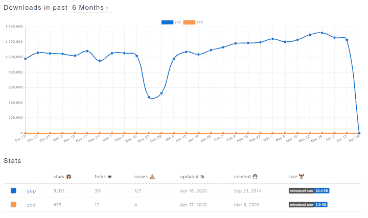

# 比较模式验证库:Zod 与 Yup - LogRocket 博客

> 原文：<https://blog.logrocket.com/comparing-schema-validation-libraries-zod-vs-yup/>

Web 开发人员必须在他们的应用程序中处理大量复杂的数据交换。应用程序验证它们发送或接收的任何数据是很重要的，因为任何错误的数据类型都可能导致错误。意外的数据类型或值也可能会使处理它的应用程序崩溃，并导致其他不良后果，这是您希望不惜一切代价避免的。

模式验证是通过创建模式来验证数据的过程。模式的定义可以根据实现的不同而不同，但是在 JavaScript 中，模式通常是一种对象数据类型，用于验证所讨论的数据。

下面是一个简单的例子。

```
var userDataSchema = {
  name: "string",
  age: "number"
}

var userData = {
  name: "Peter",
  age: "15"
}

function validateSchema(schema, data){
  for (var property in schema) {
    if(data[property] === undefined){
      console.error(property + " is required.")
    } else if ( typeof data[property] !== schema[property] ){
      console.error(property+ " must be of type "+ schema[property] + ", " +typeof data[property]+ " found.")
    } else {
      console.log(property + " is validated!")
    }
  }
}

validateSchema(userDataSchema, userData)

```

在上面的代码中，`userDataSchema`对象充当模式，验证`userData`对象具有`name`和`age`的属性。它还验证这些值的类型:`name`必须是一个`string`，而`age`必须是一个`number`。

当然，`validateSchema`函数对于任何严肃的应用来说都是不够的。要验证一个复杂的数据结构并确保它不会导致不必要的行为，您需要更强大的工具。这就是模式验证库的用武之地。

幸运的是，世界各地慷慨的 JavaScript 开发人员已经在 npm 上共享了无数开源模式验证库。到目前为止，[是的](https://github.com/jquense/yup)是最流行的 JavaScript 模式验证库之一。但是最近出现了一个新的验证库，自从它在三月份发布以来，已经抢了一些 Yup 的风头。

Zod 是一个模式验证库，旨在增强开发人员在处理模式验证时的体验。在本指南中，我将比较这些库，看看它们在验证常见数据模式(如原语、对象和数组)方面的表现如何。

## npm 趋势

首先，让我们回顾一下我在 2020 年 4 月 19 日从 npm trends 获得的一些一般图书馆统计数据。



六年前发布的 Yep 显然是此时更受欢迎的选择。Zod 的尺寸更小，可能是因为它没有 Yup 那么多 API，但随着更多功能的开发，它肯定会增长。

## 基本对象验证

让我们从比较如何用每个服务验证一个简单对象及其属性开始。

下面是如何开始使用 Yup 进行验证。

```
let yup = require('yup')

let schema = yup.object({
  name: yup.string().required(),
  age: yup.number()
})

schema
.isValid({
  name: 'John',
  age: true // wrong value
})
.then(function(valid) {
  console.log(valid)
})

```

我们用 Yup 的`.object`函数创建了一个对象模式。该模式有两个属性:

1.  一个`name`属性，它是一个字符串类型并且是必需的
2.  一个数字类型的`age`属性，但不是必需的

模式准备好之后，我们通过调用`.isValid`函数来验证数据。我们将具有`age`属性的对象作为布尔类型而不是数字，这导致函数返回`false`。

下面是如何用 Zod 进行验证。

```
const userSchema = zod.object({
  name: zod.string(),
  age: zod.number().optional(),
})

userSchema.parse({
  name: "Jane",
  age: true // wrong value
})

```

与 Yup 不同，Zod 假定所有的验证都是默认需要的。如果你想让它可选，用`.optional()`函数链接你的验证。

这两种验证一开始看起来是一样的，但是 Zod 实际上是在解析对象，而不是验证它。这意味着 Zod 获取给定的数据并试图将其返回。如果解析器遇到错误，它将终止运行时并抛出一个错误。

尽管 Yup 只验证数据并将错误处理留给您，但是 Zod 通过抛出错误将验证向前推进了一步。确保你写的程序不能继续运行。
如果你想捕捉错误，将解析函数放在`try-catch`块中。

```
try {
  userSchema.parse({
    name: "Jane",
    age: true // wrong value
  })
} catch (err) {
  console.log(err.message)
}

```

现在，您可以将错误优雅地记录到控制台中。

## 原始数据类型

现在让我们比较一下库如何验证原始数据类型。下面是如何用 Yup 验证一个字符串:

```
let schema = yup.string()

schema.isValid('hello')
.then(function(valid) {
  console.log(valid)
})

```

让我们对佐德做同样的事。

```
let schema = zod.string()

try {
  schema.parse('hello')
} catch (err) {
  console.log(err.message)
}

```

如果解析没有通过，就会记录一个错误。到目前为止，Zod 和 Yup 似乎都能够验证原始数据类型。此外，两者还可以检查您的字符串是否是有效的电子邮件地址:

```
let yup = require('yup')

let schema = yup.string().email() // validate if the string is also a valid email address format

schema.isValid('[email protected]')
.then(function(valid) {
  console.log(valid)
})

```

你需要用 Zod 手动验证电子邮件地址。可以使用 regex，如下所示。

```
let zod= require('zod')

let schema = zod.string().email()

try {
  schema.parse('hellomail.com')
} catch (err) {
  console.log(err.message)
}

```

Zod 为验证数据类型实现了广泛的扩展。在下面的例子中，它验证数据是数字类型并且有一个正值——一个整数而不是一个浮点数。

```
let schema = zod.object({
  age: zod
    .number()
    .positive()
    .int()
})

```

Yup 也有自己的[数字模式](https://github.com/vriad/zod#numbers),有更多的验证，比如 truncate 和 round，但是由于 Zod 正在积极开发中，它可能很快就会赶上来。

## 文字验证

下面是如何用 Yup 执行文字验证。

* * *

### 更多来自 LogRocket 的精彩文章:

* * *

```
let schema = yup.mixed().oneOf(['Tomato'])

schema.isValid('Tomato')
.then(function(valid){
  console.log(valid)
})

```

Yup 的`mixed`函数可以匹配所有类型，通过使用`oneOf`函数，可以输入一个按字面意思取的值。

下面是 Zod 的文字验证:

```
let schema = zod.literal('Tomato')

try {
  schema.parse('Tomato')
} catch (err) {
  console.log(err.message)
}

```

Zod 中的文字验证更简单，因为它有一个`literal`函数可以用来做这件事。

## 数组验证

对于数组类型，Yup 有几个有用的扩展来验证它的值。例如，您可以用`.min`和`.max`函数验证数组的最小或最大长度。您也可以使用`.of`功能检查其值的类型。

```
// validate that the data is an array with number as its value. 
// The minimum value of the array is two
// The minimum length of the array is four
let schema = yup.array().of(yup.number().min(2)).min(4);

schema.isValid([2])
.then(function(valid) {
  console.log(valid) // false
})

```

Zod 也可以像 Yup 一样验证数组，但是语法上有一点不同:

```
let schema = zod.array(zod.string()).min(2).max(5)

try {
  schema.parse(['fish', 'meat', 'banana'])
} catch (err) {
  console.log(err.message) // Error non-number type
}

```

## 功能验证

Zod 可以验证一个函数并确保它的输入和输出类型是正确的。函数模式接受两个参数:形式为`tuple`的参数(`args`)和函数的返回类型。

`tuple`是另一个特殊的 Zod API，它创建一个具有固定数量的元素和各种数据类型的数组。

```
const athleteSchema = zod.tuple([
  // takes an array of schemas
  zod.string(), // a string for name
  zod.number(), // a number for jersey
  zod.object({
    pointsScored: zod.number(),
  }), // an object with property pointsScored that has number value
]);
try {
  athleteSchema.parse(["James", 23, { pointsScored: 7 }])
} catch (err) {
  console.log(err.message)
}

```

解析到元组中的数据必须是与模式结构完全匹配的数组。通过使用元组，您可以根据需要向函数传递任意多的参数。

下面是函数模式的代码示例。它采用两个数字作为参数，并返回一个字符串。

```
const args = zod.tuple([
  zod.number(), // arg1
  zod.number() // arg2
])
const returnType = zod.string()
const fnSumSchema = zod.function(args, returnType)

const mySum = fnSumSchema.validate((arg1, arg2) => {
  return arg1 + arg2 // TypeError. Should be string
})
const sumAsString = mySum(3, 4)

```

与我们目前看到的其他验证不同，Zod 中的函数验证不使用相同的`.parse`来验证函数。

函数验证是 Zod 特有的；Yup 没有等效的 API 来执行这项任务。

## 类型脚本支持

两个库都支持 TypeScript。Zod 提供了一流的 TypeScript 支持。这些库使您能够推断可用于验证数据的 TypeScript 类型别名。

简单地说，您可以通过从 Yup 或 Zod 的模式中创建一个 [`type`别名](https://www.typescriptlang.org/docs/handbook/advanced-types.html#type-aliases)来验证一个变量是否是正确的数据类型。

```
import * as yup from "yup";
import * as zod from "zod";

const yupSchema = yup.string()
type A = yup.InferType<typeof yupSchema>
const x: A = 12 // wrong, but nothing happens

const zodSchema = zod.string();
type B = zod.infer<typeof zodSchema>; // string
const y: B = 12; // TypeError

```

您可以使用 TypeScript 运行上面的脚本。注意，Zod 实际上会抛出一个错误，而 Yup 什么也不做，尽管`x`的值应该是一个字符串而不是一个数字。

## 佐德联合函数

Zod 还有一些独特的 API 来定义可选的模式。例如，[联合方法](https://github.com/vriad/zod#unions)可以用来组合“或”类型。例如，要创建数据为字符串或数字的模式:

```
let zod= require('zod')

const stringOrNumber = zod.union([zod.string(), zod.number()]);

try {
  stringOrNumber.parse({});
} catch (err) {
  console.log(err.message) // Error non-string, non-number type
}

```

## 佐德相交函数

Zod 的另一个独特 API 是[交集方法](https://github.com/vriad/zod#unions)，它对于组合两个模式，创建“模式混合”特别有用。例如:

```
let zod= require('zod')

const HasId = zod.object({
  id: zod.number(),
});

const BaseTeacher = zod.object({
  name: zod.string(),
});

const Teacher = zod.intersection(BaseTeacher, HasId);

type Teacher = zod.infer<typeof Teacher>;
// { id:number; name:string };

```

## 结论

从上面的比较中可以看出，Zod 和 Yup 都有简单的 API 来使用模式验证数据。除了验证数据之外，Yup 还有一些功能，比如 number 模式的 truncate 和 round 方法，这在特定情况下可能会派上用场。

就像 Yup 一样，Zod 能够验证函数的输入和输出，以确保它拥有所有正确的数据。它还具有强大的 TypeScript 支持，可以在出现错误时终止运行时，而当推断的类型错误时，Yup 什么也不做。更重要的是，Zod 有一些独特的特性来定义可选的模式，比如 union 和 intersection。

那么，您应该为您的下一个项目使用哪个模式验证库呢？这在很大程度上取决于您的应用需求。如果您要进行大量的表单验证，我建议您使用 Yup，因为它的广泛功能涵盖了表单中使用的许多模式，甚至是您必须进行舍入的情景模式。

但是，如果您有大量的 API 数据交换，并且需要验证在客户端和服务器之间传递的所有数据，Zod 可能是您的最佳选择——尤其是如果您使用 TypeScript 的话。

## 使用 [LogRocket](https://lp.logrocket.com/blg/signup) 消除传统错误报告的干扰

[](https://lp.logrocket.com/blg/signup)

[LogRocket](https://lp.logrocket.com/blg/signup) 是一个数字体验分析解决方案，它可以保护您免受数百个假阳性错误警报的影响，只针对几个真正重要的项目。LogRocket 会告诉您应用程序中实际影响用户的最具影响力的 bug 和 UX 问题。

然后，使用具有深层技术遥测的会话重放来确切地查看用户看到了什么以及是什么导致了问题，就像你在他们身后看一样。

LogRocket 自动聚合客户端错误、JS 异常、前端性能指标和用户交互。然后 LogRocket 使用机器学习来告诉你哪些问题正在影响大多数用户，并提供你需要修复它的上下文。

关注重要的 bug—[今天就试试 LogRocket】。](https://lp.logrocket.com/blg/signup-issue-free)