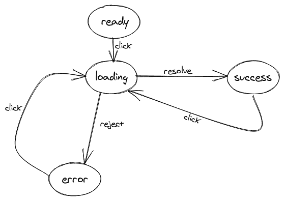

# 比较状态机:XState 与 Robot 

> 原文：<https://blog.logrocket.com/comparing-state-machines-xstate-vs-robot/>

随着应用程序逻辑变得越来越复杂，在 React 中管理状态会变得很麻烦。Redux、Flux 和 MobX 等第三方库有所帮助，但即使是这些工具也有自己的开销。

[状态机](https://en.wikipedia.org/wiki/Finite-state_machine)，也称为有限状态机或有限状态自动机，是计算的数学模型。它是一个抽象的机器，在任何给定的时间都有有限数量的[状态](https://en.wikipedia.org/wiki/State_(computer_science))。

在本指南中，我们将回顾两种状态机——x state 和 Robot——的相似性、差异、优缺点，并介绍如何使用它们来简化 React 应用程序中的状态管理。

## 为什么要使用状态机？

状态是大多数前端应用程序的重要组成部分，尤其是在 React 中。可以把状态看作是应用程序中发生变化的部分的表示。

考虑一个从 API 获取数据的组件。

```
const Todo = () => {
  const [data, setData] = useState([]);

  const handleClick = () => {
    fetch('https://jsonplaceholder.typicode.com/todos/1')
    .then(response => response.json())
    .then(todo => setData(data.push(todo))
    .catch(error => console.error(error) )
  }
  return(
    <div>
      <button onClick={handleClick}> Fetch Data </button>
      {data && data.map(todo => (<p key={todo.id}> {todo.title} <span> {todo.completed} </span></p>) )}
    </div>
  ); 
}

```

在这个例子中，数据是我们的状态，因为它是应用程序的一部分，在事件发生时会发生变化——在这个例子中，是单击按钮。这种设置的问题是它会变得复杂。

当用户等待获取记录时，或者在获取过程中发生错误时，会发生什么情况？我们需要增加更多的州来处理这些问题。

```
const Todo = () => {
  const [isLoading, setIsLoading] = useState(false);
  const [data, setData] = useState([]);
  const [isError, setIsError] = useState(false);

  const handleClick = () => {
    setLoading(true);
    fetch('https://jsonplaceholder.typicode.com/todos/1')
      .then(response => response.json())
      .then(todo => {
        setLoading(false);
        setData(data.push(todo));
      })
      .catch(error => {
        setLoading(false);
        setIsError(true);
      })
  }
  return(
    <div>
      {loading && <p> Loading Data... </p>}
      <button onClick={handleClick}> Fetch Data </button>
      {data && data.map(todo => (<p key={todo.id}> {todo.title} <span> {todo.completed} </span></p>) )}
      {error && <p> An error occured. Try again.</p>}
    </div>
  ); 
} 

```

如果您的应用程序很复杂，随着新功能的增加，事情会很快失控，使您的代码难以理解、测试和增强。

状态机以不同的方式处理这个独特的问题。使用状态机，您可以定义我们的应用程序可能处于的所有状态、状态之间的转换以及可能出现的副作用。这有助于避免应用程序处于不可能的状态。



我们的应用程序可以处于以下状态:

1.  `ready` —应用程序启动时的初始状态
2.  `loading` —当事件发生时，即点击按钮时
3.  `success` —当负载解决时
4.  `error` —加载被拒绝时

当一个动作被触发时，即当用户点击一个按钮时，应用程序从一种状态转换到另一种状态。当您可以预测应用程序可能处于的所有状态时，您就可以更好地控制应用程序。

## XState 和 Robot 是做什么的？

根据其官方文档，XState 是一个库，用于创建、解释和执行有限状态机和状态图，以及作为参与者管理这些机器的调用。它是由 [David Khourshid](https://twitter.com/davidkpiano) 创建的，用来解决用户界面中的状态问题。

Robot 是一个轻量级的、功能性的、不可变的库，由 Mathew Philips 为构建有限状态机而创建。它的灵感来自于 XState、Statecharts 和 P 编程语言。

## 先决条件

要跟随本教程，您需要:

*   JavaScript 知识
*   反应的知识
*   yarn 或 npm v5.2 或更高版本
*   节点版本 10 或更高版本

## 入门指南

为了演示 XState 和 Robot 之间的相似之处和不同之处，我们将创建一个从 API 获取数据的应用程序。

打开终端并初始化 React 应用程序。

```
npx create-react-app state-machine

```

这将创建一个名为状态机的 React 应用程序。

接下来，创建一个从 API 获取数据的服务。

```
cd src && touch fetchTodo.js

```

上面的命令在`src`目录中创建了一个名为`fetchTodo.js`的文件。

打开文件并输入以下内容。

```
export const fetchTodo = () => {
  return fetch('https://jsonplaceholder.typicode.com/todos/1')
    .then((response) => response.json())
    .then((todo) => todo);
};

```

基本上，无论何时调用`fetchTodo`函数，它都会返回从 API 中检索到的数据。

## 装置

可以通过使用 npm 或 yarn 或者通过 CDN 嵌入脚本来安装 XState。

* * *

### 更多来自 LogRocket 的精彩文章:

* * *

要使用 npm 安装库，请打开终端并运行:

```
npm install xstate @xstate/react

```

这将安装`xstate`核心库和一个名为`@xstate/react`的 React 包，它允许您在 React 应用程序中使用定制的 XState 钩子。

您可以使用 npm 或 yarn 安装机器人，但不能使用 CDN。

要安装 Robot，请启动终端并运行以下命令。

```
npm install robot3 react-robot

```

Robot 还提供了一个在 React 中使用定制钩子的包，名为`react-robot`

## 创建一台机器

在使用状态机之前，您必须首先定义它。

在`src`目录中，创建一个名为`xstateMachine.js`的文件。将下面的代码复制到创建的文件中。

```
import { Machine, assign } from 'xstate';
import { fetchTodo } from '../fetchTodo';
export const xstateMachine = Machine({
  id: 'clickButton',
  initial: 'ready',
  context: {
    todo: null,
  },
  states: {
    ready: {
      on: {
        CLICK: 'loading',
      },
    },
    loading: {
      invoke: {
        id: 'fetch-todo',
        src: fetchTodo,
        onDone: {
          target: 'success',
          actions: assign({
            todo: (context, event) => event.data,
          }),
        },
        onError: 'error',
      },
    },
    success: {
      on: {
        CLICK: 'loading',
      },
    },
    error: {
      on: {
        CLICK: 'loading',
      },
    },
  },
});

```

使用`Machine()`工厂功能定义机器。我们在上面的代码中定义的机器由 id、状态、上下文、动作和转换组成。id 用于标识状态节点。

机器中的状态有:

*   `ready`
*   `loading`
*   `success`
*   `error`

上下文是一种扩展状态，用于表示定量数据，如数字、任意字符串、对象等。应用程序的初始状态定义为`ready`。当点击一个按钮时，会发生一个转换，将状态从`ready`转移到`loading`。

在`loading`状态中，有一个`invoke`属性负责解析或拒绝承诺。每当`fetchTodo`承诺被解决时，`loading`状态转换到`success`状态，并且`assign`动作用从承诺获得的结果更新上下文。如果它被拒绝，它移动到`error`状态。

用机器人创造一台机器是相似的，尽管有一些关键的不同。一个主要的区别是，由于 Robot 是一个函数库，所以大多数操作都是使用函数来执行的，这与使用选项对象的 XState 不同。

在您的`src`目录中创建一个名为`robotMachine.js`的文件，并粘贴以下内容。

```
 import { createMachine, invoke, reduce, state, transition } from 'robot3';
import { fetchTodo } from '../fetchTodo';
const context = () => ({
  todo: {},
});
export const robotMachine = createMachine(
  {
    ready: state(transition('CLICK', 'loading')),
    loading: invoke(
      fetchTodo,
      transition(
        'done',
        'success',
        reduce((ctx, evt) => ({ ...ctx, todo: evt.data }))
      ),
      transition(
        'error',
        'error', 
        reduce((ctx, ev) => ({ ...ctx, error: ev.error }))
      )
    ),
    success: state(transition('CLICK', 'loading')),
    error: state(transition('CLICK', 'loading')),
  },
  context
);

```

在 Robot 中，使用接受一个对象的`createMachine`函数来创建机器。使用`state`函数定义一个状态，并且可以接受一个`transition`作为参数。

从一个状态转移到另一个状态是通过`transition`函数完成的，它接受事件和下一个状态作为参数。可选地，`reduce`函数可以作为第三个参数添加到`transition`中。Reduce 函数将 reducer 函数作为参数，用于更新上下文。

Robot 也有一个`invoke`函数，类似于 XState 中的`invoke`属性。当应用程序处于`loading`状态时，调用`invoke`函数。`invoke`函数是一种调用承诺并返回函数或另一台机器的状态。如果`invoke`函数解析了承诺，它将发送一个`done`事件。如果被拒绝，它会发送一个`error`事件。

## 构建组件

现在我们的机器已经准备好了，下一步是构建一个将利用该机器的组件。

在您的`src`目录中为组件创建一个文件，并粘贴以下内容。

```
import React from 'react';
import { useMachine } from '@xstate/react';
import { xstateMachine } from './stateMachine';

function Todo() {
  const [current, send] = useMachine(xstateMachine);
  const { todo } = current.context;
  return (
    <div>
      <button onClick={() => send('CLICK')}>Fetch Todo XState</button>
      {current.matches('loading') && <p>loading...</p>}
      {current.matches('success') && (
        <p key={todo.id}>
          {todo.title} <span> {todo.completed} </span>
        </p>
      )}
      {current.matches('error') && <p>An error occured</p>}
    </div>
  );
}
export default Todo;

```

要使用机器，我们必须从`@xstate/react library`导入`useMachine`钩子，以及我们之前创建的机器。

`useMachine`钩子是一个解释机器的 React 钩子。它负责在组件的整个生命周期中启动服务。

`useMachine`钩子接受一个机器作为参数并返回一个数组。该数组包含`current`状态和`send`，后者是一个向由`useMachine`钩子创建的服务发送事件的函数。

`current`状态是一个包含状态、上下文和一些实用函数的对象。要检查当前状态，使用`matches`属性，该属性返回一个布尔值。当用户单击按钮时，它会向服务发送一个事件。然后，它检查机器的当前状态，并根据状态呈现适当的 UI。

机器人建造组件的方法也是类似的。用 Robot 构建的组件如下所示:

```
import React from 'react';
import { useMachine } from 'react-robot';
import { robotMachine } from './robotMachine';

function Todo() {
  const [current, send] = useMachine(robotMachine);
  const { todo } = current.context;
  return (
    <div>
      <button onClick={() => send('CLICK')}>Fetch Todo Robot</button>
      {current.name === 'loading' && <p>loading...</p>}
      {current.name === 'success' && (
        <p key={todo.id}>
          {todo.title} <span> {todo.completed} </span>
        </p>
      )}
      {current.name === 'error' && <p>An error occured</p>}
    </div>
  );
}
export default RobotTodo;

```

机器人还有一个`useMachine`钩子，可以通过导入`react-robot library`来访问。实现的不同之处在于比较状态的方式。XState 使用`matches`属性，这是一个接受我们试图比较的字符串的函数，而 Robot 使用`name`属性在比较之前检查当前状态。

## 结论

状态机为管理 React 应用程序中的状态提供了一种组织得更好的方式，并且与其他替代方案相比，它们易于扩展。XState 和 Robot 是两个非常流行的库，虽然非常相似，但从非常不同的角度来处理机器。

本教程的资源库可以在 [GitHub](https://github.com/sa-ma/xstate-robot-example/) 上找到。

要了解更多信息，请查阅以下资源。

## 使用 LogRocket 消除传统反应错误报告的噪音

[LogRocket](https://lp.logrocket.com/blg/react-signup-issue-free)

是一款 React analytics 解决方案，可保护您免受数百个误报错误警报的影响，只针对少数真正重要的项目。LogRocket 告诉您 React 应用程序中实际影响用户的最具影响力的 bug 和 UX 问题。

[ ](https://lp.logrocket.com/blg/react-signup-general) [  ](https://lp.logrocket.com/blg/react-signup-general) [LogRocket](https://lp.logrocket.com/blg/react-signup-issue-free)

自动聚合客户端错误、反应错误边界、还原状态、缓慢的组件加载时间、JS 异常、前端性能指标和用户交互。然后，LogRocket 使用机器学习来通知您影响大多数用户的最具影响力的问题，并提供您修复它所需的上下文。

关注重要的 React bug—[今天就试试 LogRocket】。](https://lp.logrocket.com/blg/react-signup-issue-free)