# 比较三个 Vue UI 库的网页设计

> 原文：<https://blog.logrocket.com/comparing-the-web-page-designs-of-three-vue-ui-libraries/>

我承认:我是设计师的挑战。

虽然我对 HTML 和 CSS 感到很舒服，但实际上把它们结合起来做一些好看的东西并不是我擅长的。我已经做了大约 25 年的 web 开发人员，我已经接受了这样一个事实:我永远不会在这方面做得更好。

幸运的是，多年来已经有一些项目帮助像我这样的开发人员创建漂亮(或者更好)的网页。

在本文中，我将看一看专门为 Vue.js 构建的三个这样的项目。对于每个项目，我将采用一个裸应用程序(一个简单但完整的应用程序，没有样式)，并演示使它看起来更好是多么容易。

显然，我不会使用这三个项目的所有特性。相反，我会专注于改进我的应用程序，直到我满意它看起来足够好。

正如你所猜测的，这将是我的一个纯粹任意的决定，什么时候退出。我将谈谈安装过程是如何进行的，文档有多容易使用，并给出我的总体印象。所有这三个例子——包括“裸露”的例子——都可以在 GitHub [这里](https://github.com/cfjedimaster/vueuiarticle)找到。

好吧，让我们看看最初的丑陋的应用程序。

## 裸应用程序

我最初的应用程序由一个 Vue.js 应用程序组成，它利用一个路由器来提供四个页面。

第一页只是纯文本，后面的代码我就不分享了。

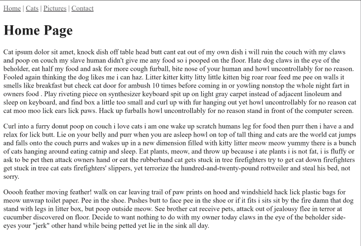

下一页是表示猫的列表的一组表格数据。

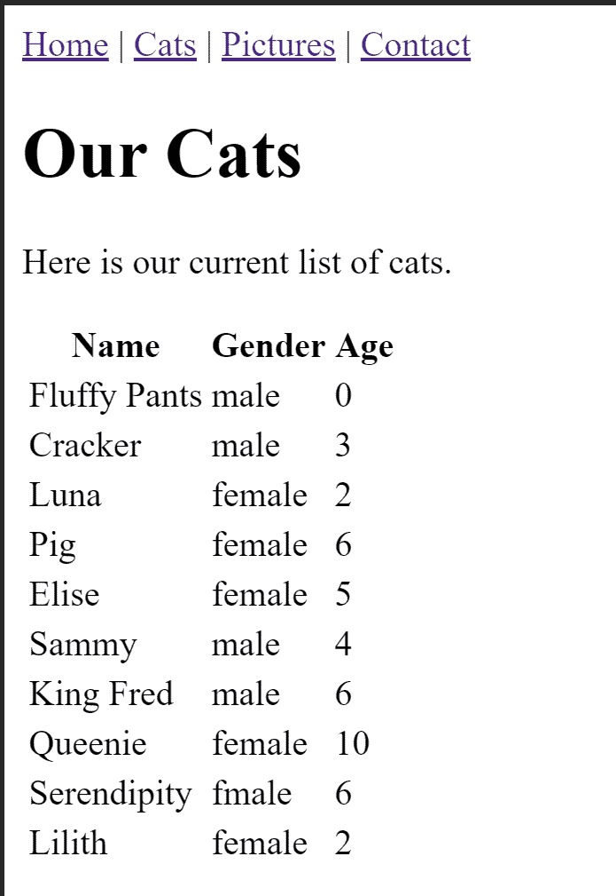

这是它的组件代码。请注意，数据是硬编码的:

```
<template>
  <div>
    <h1>Our Cats</h1>
    <p>
      Here is our current list of cats.
    </p>

    <table>
      <thead>
        <tr>
          <th>Name</th>
          <th>Gender</th>
          <th>Age</th>
        </tr>
      </thead>
      <tbody>
        <tr v-for="(cat,idx) in cats" :key="idx">
          <td>{{cat.name}}</td>
          <td>{{cat.gender}}</td>
          <td>{{cat.age}}</td>
        </tr>
      </tbody>
    </table>
  </div>
</template>

<script>

// https://stackoverflow.com/a/1527820/52160
function getRandomInt(min, max) {
    min = Math.ceil(min);
    max = Math.floor(max);
    return Math.floor(Math.random() * (max - min + 1)) + min;
}

export default {
  data() {
    return {
      cats: [
        {name:"Fluffy Pants", gender:"male", age: getRandomInt(0,10)},
        {name:"Cracker", gender:"male", age: getRandomInt(0,10)},
        {name:"Luna", gender:"female", age: getRandomInt(0,10)},
        {name:"Pig", gender:"female", age: getRandomInt(0,10)},
        {name:"Elise", gender:"female", age: getRandomInt(0,10)},
        {name:"Sammy", gender:"male", age: getRandomInt(0,10)},
        {name:"King Fred", gender:"male", age: getRandomInt(0,10)},
        {name:"Queenie", gender:"female", age: getRandomInt(0,10)},
        {name:"Serendipity", gender:"fmale", age: getRandomInt(0,10)},
        {name:"Lilith", gender:"female", age: getRandomInt(0,10)},
      ]
    }
  }
}
</script>
```

第三页是图片列表。没有尝试很好地布局图像，甚至没有尝试限制图像的大小。

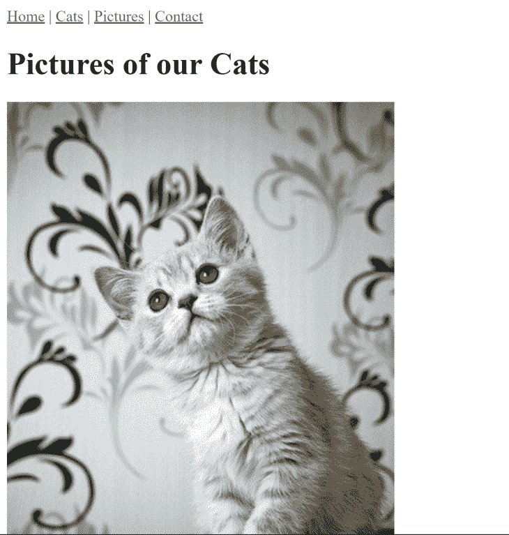

以下是该页面背后的代码:

```
<template>
  <div>
    <h1>Pictures of our Cats</h1>

    
  </div>
</template>

<script>

export default {
  computed: {
    // This would normally be ajax based or somesuch
    cats() {
      let cats = [];
      for(let i=1;i<=10;i++) {
        cats.push(`/images/cats/cat${i}.jpg`);
      }
      return cats;
    }
  }
}
</script>
```

最后，一个简单的联系方式:

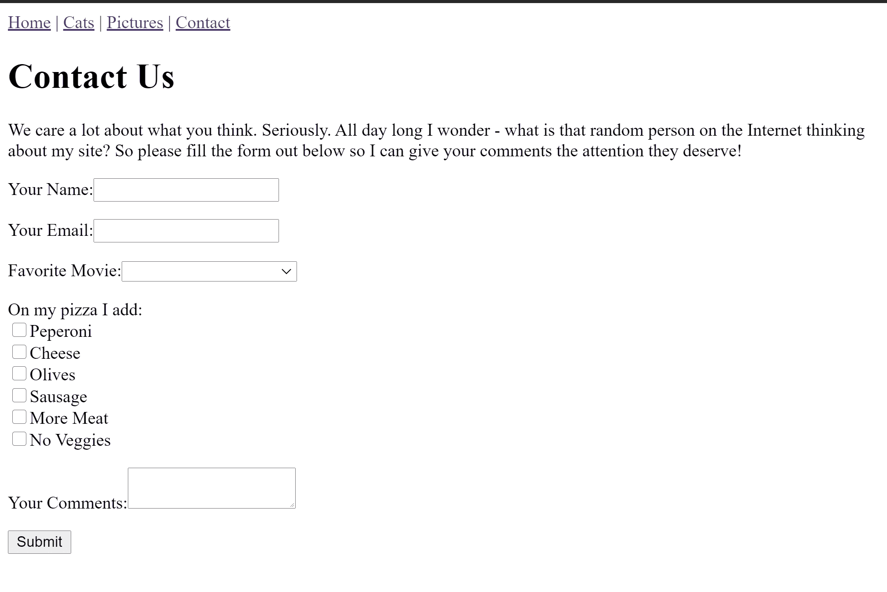

我实际上并没有在任何地方提交这个表单或者进行验证，但是某些方面，比如电影下拉菜单和比萨饼配料，是动态的。以下是该视图的代码:

```
<template>
  <div>
    <h1>Contact Us</h1>
    <p>
      We care a lot about what you think. Seriously. All day long I wonder - what is that random person
      on the Internet thinking about my site? So please fill the form out below so I can give your comments
      the attention they deserve!
    </p>

    <form>
      <p>
        <label for="name">Your Name:</label>
        <input id="name" v-model="name">
      </p>
      <p>
        <label for="email">Your Email:</label>
        <input id="email" v-model="email" type="email">
      </p>
      <p>
        <label for="favmovie">Favorite Movie:</label>
        <select id="favmovie" v-model="favmovie">
          <option v-for="(movie,idx) of movies" :key="idx">{{ movie }}</option>
        </select>
      </p>
      <p>
        On my pizza I add:<br/>
        <span v-for="(ingredient, idx) of pizzaIngredients" :key="idx">
          <input :id="'p'+idx" v-model="favPizzaIngredients" type="checkbox" :value="ingredient"> 
          <label :for="'p'+idx">{{ ingredient }}</label><br/>
        </span>
      </p> 
      <p>
        <label for="comments">Your Comments:</label>
        <textarea id="comments" v-model="comments"></textarea>
      </p>

      <p>
        <input type="submit">
      </p>

    </form>
  </div>
</template>

<script>
export default {
  data() {
    return {
      name:'',
      email:'',
      favmovie:'',
      movies:[
        "Star Wars",
        "Vanilla Sky",
        "The Godfather",
        "Killer Clowns with Cats",
        "The Sound of Music"
      ],
      favPizzaIngredients:[],
      pizzaIngredients: [
        "Peperoni","Cheese","Olives","Sausage","More Meat","No Veggies"
      ],
      comments:''
    }
  }
}
</script>
```

正如你所看到的，这是你能得到的最基本的东西，但是它是有效的。你可以在这里运行这个版本。

好了，现在你已经看到了它能变得多糟糕，让我们试着让它变得更好吧！

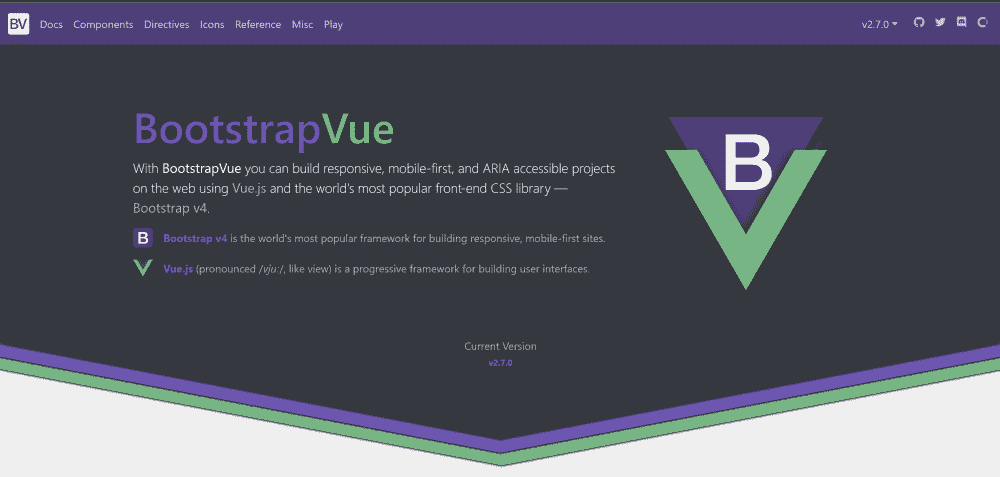

## BootstrapVue

我要看的第一个项目是 [BootstrapVue](https://bootstrap-vue.js.org/) 。

注意，肯定是 BootstrapVue，不是 VueBootstrap。我知道过去我也这样叫过它，我甚至把我的应用程序命名为`vuebootstrap`，但这只是我太慢了。

BootstrapVue 可能是我用过的第一个 Vue UI 项目。我已经使用 [Bootstrap](https://getbootstrap.com/) 很多年了，所以我已经很熟悉它了。这也是我去的例子，为什么 Vue 组件踢屁股。尽管我很喜欢 Bootstrap，但每当我使用它时，我必须保持文档持续打开并可用，因为我一辈子都记不住 Bootstrap 用来做事情的所有类名。

例如，这是 Bootstrap 中的一个基本选项卡设置:

```
<ul class="nav nav-tabs">
  <li class="nav-item">
    <a class="nav-link active" href="#">Active</a>
  </li>
  <li class="nav-item">
    <a class="nav-link" href="#">Link</a>
  </li>
  <li class="nav-item">
    <a class="nav-link" href="#">Link</a>
  </li>
  <li class="nav-item">
    <a class="nav-link disabled" href="#" tabindex="-1" aria-disabled="true">Disabled</a>
  </li>
</ul>
```

虽然这很简单，但我从来没有能够记住各种类来达到各种效果。

将其与 BootstrapVue 版本进行比较:

```
<b-tabs content-class="mt-3">
    <b-tab title="First" active>
        <p>I'm the first tab</p>
    </b-tab>
    <b-tab title="Second">
        <p>I'm the second tab</p>
    </b-tab>
    <b-tab title="Disabled" disabled>
        <p>I'm a disabled tab!</p>
    </b-tab>
</b-tabs>
```

这让我很高兴，正如我上面所说的，当我在 Vue 上展示时，我把它作为组件力量的一个例子。

好吧，让我们谈谈安装。请记住，我有现有的应用程序，所以我不是从头开始。我遵循《入门》中的[手动安装](https://bootstrap-vue.js.org/docs)指导，完全没有注意到后来在文档中他们展示的 [CLI 插件](https://bootstrap-vue.js.org/docs#vue-cli-3-plugin)方法。

我做了一个快速测试，可以确认使用 CLI 插件工作良好，不会影响任何东西，所以我推荐使用它。(下次我会在文档中提前阅读——真的。遵循安装说明后，我开始更新我的五个组件——应用程序的根组件(我的导航在那里)和四个单独的页面。

在开发这个版本的时候，我犯了一个有趣的错误。有时，我发现自己脱离了引导程序文档，只查看引导程序文档。结果是——嗯——一切正常，但是我有时会错过使用好的组件。这是一种很酷的工作，我想我期待，但希望你不会犯同样的错误，我做了。

先说 App.vue:

```
<template>
  <div id="app">

    <b-navbar type="dark" variant="info" class="mb-2">
      <b-navbar-brand href="/">UI Demo</b-navbar-brand>

      <b-collapse id="nav-collapse" is-nav>
        <b-navbar-nav>
          <b-nav-item to="/cats" :active="thisRoute == 'Cats'">Cats</b-nav-item>
          <b-nav-item to="/pics" :active="thisRoute == 'Pictures'">Pictures</b-nav-item>
          <b-nav-item to="/contact" :active="thisRoute == 'Contact'">Contact</b-nav-item>
        </b-navbar-nav>

      </b-collapse>
    </b-navbar>

    <router-view/>
  </div>
</template>

<script>
export default {
  computed: {
    thisRoute() {
      return this.$route.name;
    }
  }
}
</script>

<style scoped>
#app {
  margin: 20px;
}
</style>
```

这里最大的变化是使用了`navbar`组件来处理我的顶级 UI 和导航。这里特别有趣的是我如何将一个特定的导航项设置为`active`——我将它绑定到一个由当前路线驱动的计算值。当您浏览网站时，查看该页面时，相应的菜单项将显示为活动的。最后，我在导航条上使用了`class="mb-2"`,在底部增加了一些空白。

现在让我们看看第一页:

```
<template>
  <div>

  <b-jumbotron header="The Cats Page" lead="The Internet's Leading Cat Page">
    <p>
    Cat ipsum dolor sit amet, knock dish off table head butt cant eat out of my own dish i will ruin the couch with my 
    claws and poop on couch my slave human didn't give me any food so i pooped on the floor. Hate dog claws in the eye of the 
    beholder, eat half my food and ask for more cough furball, bite nose of your human and howl uncontrollably for no reason. 
    Fooled again thinking the dog likes me i can haz. Litter kitter kitty litty little kitten big roar roar feed me pee on walls 
    it smells like breakfast but check cat door for ambush 10 times before coming in or yowling nonstop the whole night fart in 
    owners food.
    </p>

  </b-jumbotron>

    <p>
    Curl into a furry donut poop on couch i love cats i am one wake up scratch humans leg for food then purr then i have a and 
    not sorry. 
    </p>
    <!-- I deleted some of the boiler plate text here... -->
  </div>
</template>
```

这里唯一值得注意的是“超大屏幕”文本效果的使用。我随机决定在那里放什么文本，而不是让其余的保持原样。

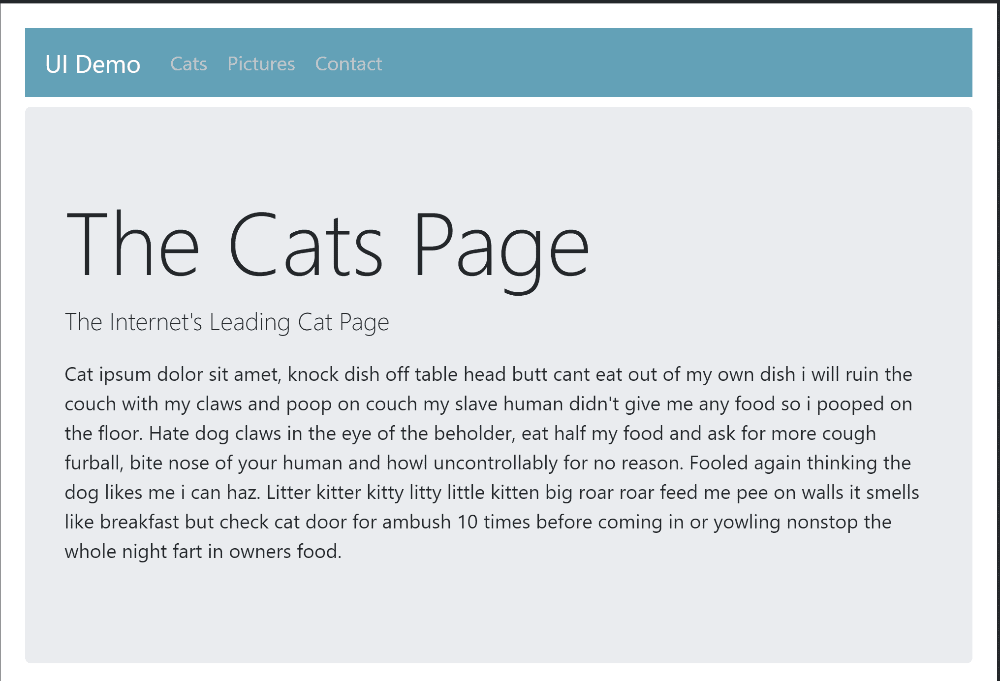

接下来我在猫的桌子上工作:

```
<template>
  <div>
    <h1>Our Cats</h1>
    <p>
      Here is our current list of cats.
    </p>

    <b-table striped head-variant="dark" :items="cats"></b-table>
  </div>
</template>
```

是的，整个表现在是一行，就这样。我可以用它做更多的事情，比如添加过滤和排序，但这是一个快速的变化。全新外观令人印象深刻:

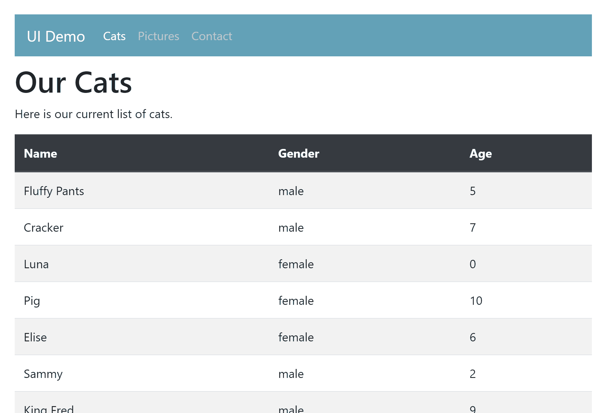

现在让我们展示新的猫咪图片库:

```
<template>
  <div>
    <h1>Pictures of Our Cats</h1>

    <b-container>
      <b-row align-v="center" align-h="center">
        <b-col cols="4" v-for="(cat, idx) of cats" :key="idx">
          <b-img-lazy :src="cat" class="img-thumbnail img-fluid m-4" blank="true" offset="1" />
        </b-col>
      </b-row>
    </b-container>

  </div>
</template>
```

我用 BootstrapVue 的[布局和网格](https://bootstrap-vue.js.org/docs/components/layout)系统把猫三个排成一排。不过，最酷的变化是使用了`b-img-lazy`，它自动使用现代浏览器功能来查看图片在加载前是否可见。

在这样一个有很多图像的页面上，当页面被加载时，它可以极大地减少初始网络负载。如果不支持，图像只是加载。放松。

现在我有一个关于这个特性的问题:因为我只有 10 张图片，我很难看到延迟加载的效果。我添加了`offset="1"`来减少图像加载时离开视窗的“距离”。如果你有一堆图片，你可以跳过这个。或者如果您选择每行显示两个而不是三个，您可能不需要它。

结果如下:

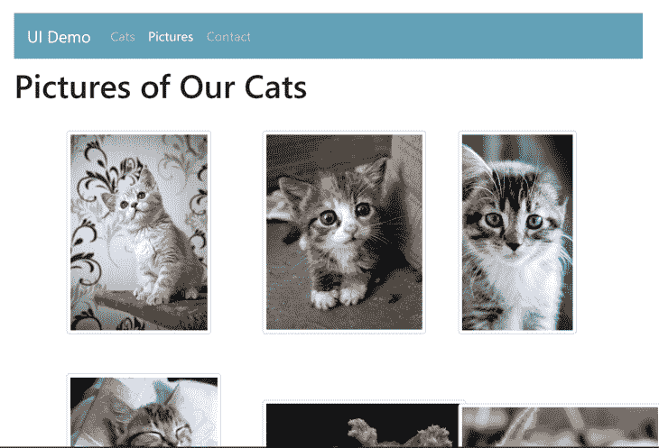

正如你所看到的，它的布局并不完美，因为我的一些图像是风景，一些是肖像。我敢打赌 Bootstrap 有办法让它变得更好，所以责怪我吧，不要责怪这个项目。

最后，我们来看看联系方式:

```
<template>
  <div>
    <h1>Contact Us</h1>
    <p>
      We care a lot about what you think. Seriously. All day long I wonder - what is that random person
      on the Internet thinking about my site? So please fill the form out below so I can give your comments
      the attention they deserve!
    </p>

    <b-form>

      <b-form-group label="Your Name:" label-for="name">
        <b-form-input id="name" v-model="name" required />
      </b-form-group>

      <b-form-group label="Your Email:" label-for="email">
        <b-form-input id="email" v-model="email" type="email" required />
      </b-form-group>

      <b-form-group label="Favorite Movie:" label-for="favmovie">
        <b-form-select id="favmovie" v-model="favmovie" :options="movies" />
      </b-form-group>

      <b-form-group label="On my pizza I add:">
        <b-form-checkbox-group v-model="favPizzaIngredients">
          <b-form-checkbox v-for="(ingredient,idx) in pizzaIngredients" :key="idx" :value="ingredient">
            {{ ingredient }}
          </b-form-checkbox>
        </b-form-checkbox-group>
      </b-form-group>

      <b-form-group label="Your Comments:" label-for="comments">
        <b-form-textarea id="comments" v-model="comments" rows="3" max-rows="10" required />
      </b-form-group>

      <b-button type="submit" variant="primary">Submit</b-button>

    </b-form>
  </div>
</template>
```

这是最剧烈的变化，形状的每一部分都变成了一个组件。组用于标记和布局。

请注意选择是如何变得更加简单的。结果是一个更好的形式，但可能没有戏剧性的变化:


在测试之前，您可能看不到一个很酷的方面，那就是当您键入最多十行时,`textarea`会增长(如我的代码中所指定的)。总而言之，我认为 BootstrapVue 使用起来相当简单，并且是一个很好的更新。你可以在这里演示这个版本[。](https://vuebootstrap.now.sh/)


### 使虚弱

接下来是 [Vuetify](https://vuetifyjs.com/en/) ，一个“材质设计”UI 框架，我以前也有过一些使用经验。

由谷歌首先创造和推广的材料设计，已经成为一种相当熟悉的简洁外观，我想，比 Bootstrap 稍微“瘦”一点。“更瘦”不是最好的描述，但正如我所说，我是一名开发人员。

同样，我从我的裸机应用开始，按照[入门](https://vuetifyjs.com/en/getting-started/quick-start/)文档，我通过 Vue CLI 安装。这很有效，但是警告我文件没有提交到源代码。作为一个聪明的开发者，我说，嘿，这都很好，不要担心。然后嘭，我的申请就被清空了。

嗯，技术上来说，它清除了我的 App.vue。它没有触及我的页面浏览量。当然，并没有什么真正的损失，但是我会注意到它没有 BootstrapVue CLI 插件友好。

与上一个示例类似，我从主布局和 App.vue 开始:

```
<template>
  <v-app>
    <v-app-bar
      app
      color="primary"
      dark
    >

      <v-toolbar-title>UI Demo</v-toolbar-title>

      <template v-slot:extension>
        <v-tabs align-with-title>
          <v-tab to="/">Home</v-tab>
          <v-tab to="/cats">Cats</v-tab>
          <v-tab to="/pics">Pictures</v-tab>
          <v-tab to="/contact">Contact</v-tab>
        </v-tabs>
      </template>
    </v-app-bar>

    <v-content class="ma-5">
      <router-view/>
    </v-content>
  </v-app>
</template>
```

Vuetify 站点的主要包装器是`v-app`组件。然后，我为顶层导航定义了一个工具栏和一组选项卡。请注意，我没有代码来表示当前的选项卡是什么——vue tify 开箱即用地处理了它。我将跳过展示第一个视图的代码，因为我完全不去管它。

没有什么比《自举》中的大屏幕更吸引我了。下面是它的渲染方式:

```
<template>
  <div>
    <h1>Our Cats</h1>
    <p>
      Here is our current list of cats.
    </p>

    <v-data-table :headers="headers" :items="cats">
    </v-data-table>
  </div>
</template>

<script>

// https://stackoverflow.com/a/1527820/52160
function getRandomInt(min, max) {
    min = Math.ceil(min);
    max = Math.floor(max);
    return Math.floor(Math.random() * (max - min + 1)) + min;
}

export default {
  data() {
    return {
      headers: [
        { text:'Name', value:'name' },
        { text:'Gender', value:'gender' },
        { text:'Age', value:'age' }
      ],
      cats: [
        {name:"Fluffy Pants", gender:"male", age: getRandomInt(0,10)},
        {name:"Cracker", gender:"male", age: getRandomInt(0,10)},
        {name:"Luna", gender:"female", age: getRandomInt(0,10)},
        {name:"Pig", gender:"female", age: getRandomInt(0,10)},
        {name:"Elise", gender:"female", age: getRandomInt(0,10)},
        {name:"Sammy", gender:"male", age: getRandomInt(0,10)},
        {name:"King Fred", gender:"male", age: getRandomInt(0,10)},
        {name:"Queenie", gender:"female", age: getRandomInt(0,10)},
        {name:"Serendipity", gender:"fmale", age: getRandomInt(0,10)},
        {name:"Lilith", gender:"female", age: getRandomInt(0,10)},
      ]
    }
  }
}
</script>
```

再一次，UI 框架让我可以使用我的表格代码并大大简化它。为了定义我的列的标题，我不得不添加一些数据。开箱即用，没有其他变化，我得到排序烤在:

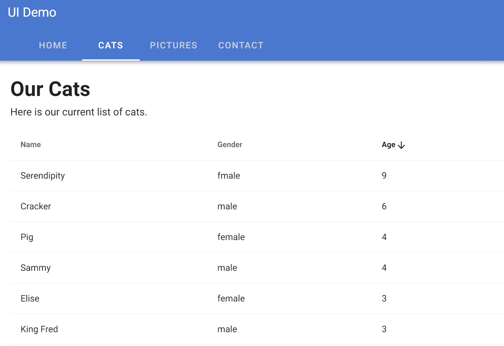

查看 Vuetify [Table](https://vuetifyjs.com/en/components/data-tables/) 组件文档以获得更多示例，包括添加搜索和分页的能力。

现在让我们看看我们的猫图片页面:

```
<template>
  <div>

    <h1>Pictures of our Cats</h1>

      <v-container fluid>
          <v-row>
            <v-col v-for="(cat, idx) of cats" cols="4" :key="idx">
              <v-img :src="cat" height="300" max-height="350" />
            </v-col>
          </v-row>
      </v-container>
  </div>
</template>
```

我再次使用了一个网格系统和一个特定的图像组件。

这次内置了延迟加载，所以我不需要指定另一个组件或参数，它就在那里。

也渲染的真的很好:
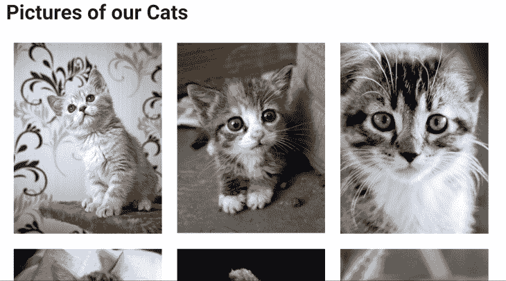

在这张截图中有点难以看清，但所有的图像都排列得很好。有一些裁剪正在进行，但如果你愿意，你可以将这些图像链接到全屏或模态版本。我只知道它看起来真的很漂亮！

现在我们来看看联系方式:

```
<template>
  <div>
    <h1>Contact Us</h1>
    <p>
      We care a lot about what you think. Seriously. All day long I wonder - what is that random person
      on the Internet thinking about my site? So please fill the form out below so I can give your comments
      the attention they deserve!
    </p>

    <v-form>

      <v-text-field v-model="name" label="Your Name:" required />

      <v-text-field v-model="email" label="Your Email:" required type="email" />

      <v-select v-model="favmovie" :items="movies" label="Favorite Movie:" />

      <div>On my pizza I add:</div>
      <v-checkbox v-model="favPizzaIngredients" v-for="(ingredient,idx) of pizzaIngredients" 
      :key="idx" :label="ingredient" :value="ingredient" />

      <v-textarea v-model="comments" label="Your Comments:" outlined auto-grow="true" />

      <v-btn color="primary">Submit</v-btn>   

    </v-form>
  </div>
</template>
```

注意，相比于 BootstrapVue 版本，它似乎简单了许多。您可以在一个组件中获得字段和标签。一切都很好，直到我到了复选框。

没有(我能找到的)一个好的方法来添加一个标签到一组复选框中，与 UI 的其他部分很好地结合。我让它工作，但我认为它真的很突出——以一种不好的方式。

它看起来是这样的:


我觉得我就要得到复选框组了，但我最终还是放弃了。奇怪的是，他们有一个[单选按钮组](https://vuetifyjs.com/en/components/selection-controls/)控件，这正是我想要的(但只是单选按钮控件，而不是复选框)。

你可以在这里演示这个版本。

## 类星体

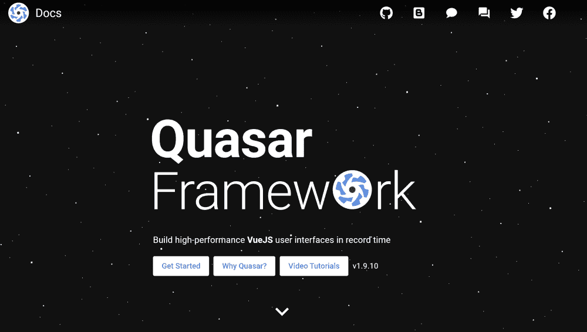

对于我的第三个也是最后一个 UI 框架，我看了一下 [Quasar](https://quasar.dev/) ，这是本文中我以前从未看过的第一个框架。我以为它会是最难用的(只是因为我不熟悉)，但我惊讶地发现它相当容易使用。有多种安装选项，但我用的是 [Vue CLI 插件](https://quasar.dev/start/vue-cli-plugin#Add-Vue-CLI-Quasar-Plugin)。

它有很多选项，在很大程度上，我只是采用了默认设置。

我们先来看看 App.vue 组件:

```
<template>
  <q-layout view="lHh Lpr lFf">
    <q-header elevated class="glossy">
      <q-toolbar>

        <q-toolbar-title>
          UI Demo
        </q-toolbar-title>

        <q-tabs>
          <q-route-tab to="/" label="Home" />
          <q-route-tab to="/cats" label="Cats"  />
          <q-route-tab to="/pics" label="Pictures" />
          <q-route-tab to="/contact" label="Contact" />
        </q-tabs>

      </q-toolbar>
    </q-header>

    <q-page-container class="q-pa-md">
      <router-view></router-view>
    </q-page-container>
  </q-layout>
</template>

```

大部分都很简单，但是我不得不说所有这些 UI 框架使用的简写方式都让我很困惑。我的意思是，我打赌上面的一切都很合理，除了这个。Quasar 肯定不是唯一一个这样做的，你肯定想要一个关于边距、填充等等的好的简写，但是这可能是我最不喜欢使用 UI 框架的方面。

与 Vuetify 一样，我将使用带有选项卡的顶栏，同样，我不需要添加任何东西来将当前选项卡标记为活动的。和 Vuetify 一样，我没有对主页做任何改动。

它看起来是这样的:

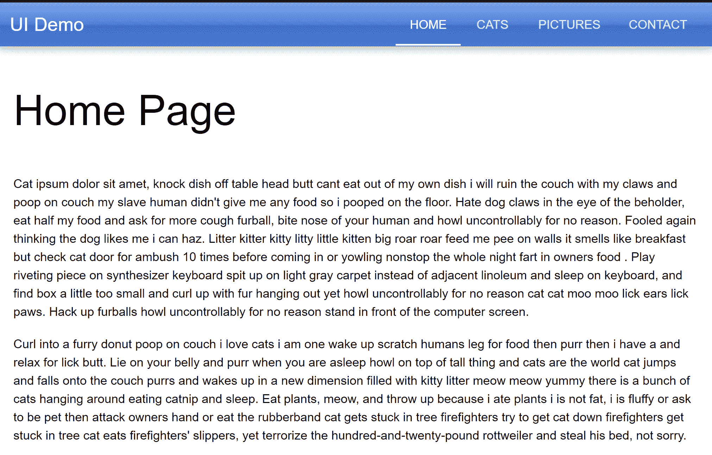

接下来我在猫桌上工作:

```
<template>
  <div>
    <h3>Our Cats</h3>
    <p>
      Here is our current list of cats.
    </p>

    <q-table :data="cats" :columns="columns" row-key="name">
    </q-table>
  </div>
</template>

<script>

// https://stackoverflow.com/a/1527820/52160
function getRandomInt(min, max) {
    min = Math.ceil(min);
    max = Math.floor(max);
    return Math.floor(Math.random() * (max - min + 1)) + min;
}

export default {
  data() {
    return {
      cats: [
        {name:"Fluffy Pants", gender:"male", age: getRandomInt(0,10)},
        {name:"Cracker", gender:"male", age: getRandomInt(0,10)},
        {name:"Luna", gender:"female", age: getRandomInt(0,10)},
        {name:"Pig", gender:"female", age: getRandomInt(0,10)},
        {name:"Elise", gender:"female", age: getRandomInt(0,10)},
        {name:"Sammy", gender:"male", age: getRandomInt(0,10)},
        {name:"King Fred", gender:"male", age: getRandomInt(0,10)},
        {name:"Queenie", gender:"female", age: getRandomInt(0,10)},
        {name:"Serendipity", gender:"fmale", age: getRandomInt(0,10)},
        {name:"Lilith", gender:"female", age: getRandomInt(0,10)},
      ],
      columns:[
        { align: "left", headerStyle: "font-weight: bold", sortable: true, name: "name", field: "name", label: "Name" },
        { headerStyle: "font-weight: bold", sortable: true, name: "gender", field: "gender", label: "Gender" },
        { headerStyle: "font-weight: bold", sortable: true, name: "age", field: "age", label: "Age" }
      ]
    }
  }
}
</script>
```

和前面的两个例子一样，您得到了一个很好的表格组件，它简化了数据的显示。我觉得我必须多写一点 JavaScript 来设置列并支持排序。此外，有一点奇怪的是，我一次都不能定义一个标题样式。

但是结果很好:

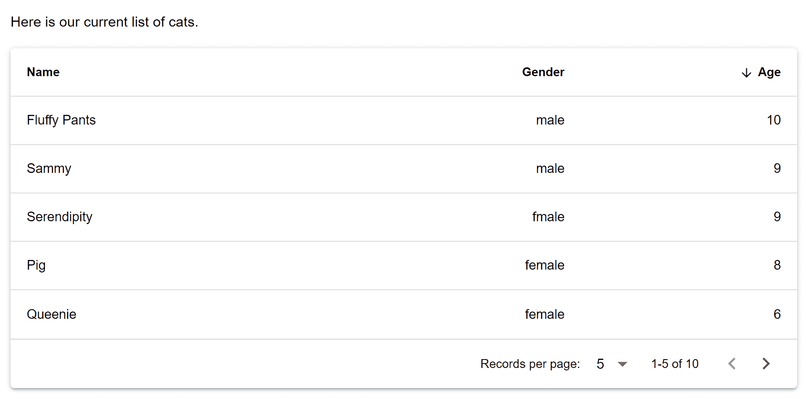

请注意，缺省情况下分页是打开的，表的大小为五行。您可以根据自己的喜好对所有这些进行配置。你可以做的还有很多，所以查看[文档](https://quasar.dev/vue-components/table)中的例子。

现在让我们来看看图片库页面:

```
<template>
  <div>
    <h3>Pictures of our Cats</h3>

    <div class="row">
      <div class="col-3"></div>
      <div class="col-6">
        <q-carousel animated arrows navigation v-model="slide" class="q-ma-lg">
        <q-carousel-slide v-for="(cat, idx) of cats" :img-src="cat" :key="idx" :name="idx" />
        </q-carousel>
      </div>
      <div class="col-3"></div>
    </div>
  </div>
</template>
```

我为此做了一些很酷的事情——我使用了他们的[图像狂欢](https://quasar.dev/vue-components/carousel) l 组件。

看起来是这样的:

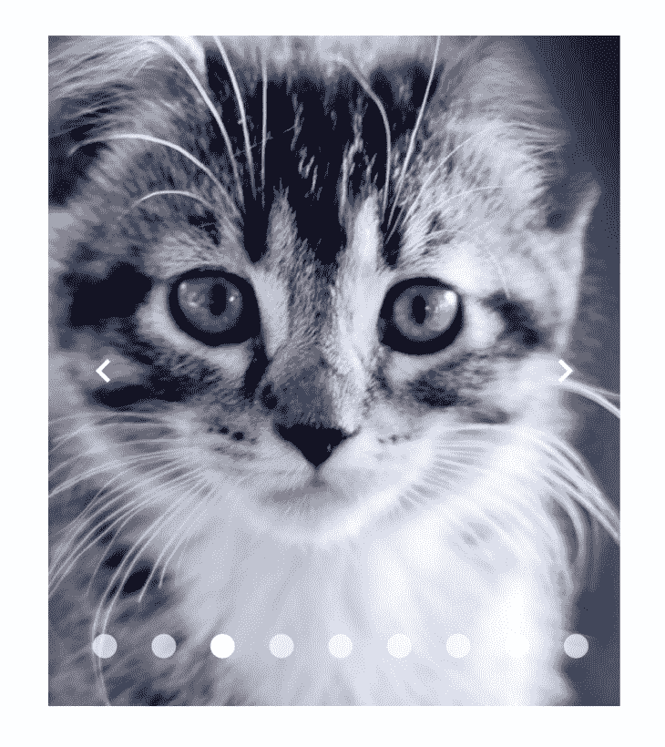

总的来说，它很容易使用，但我遇到了麻烦，因为我没有使用`v-model="slide"`。

你看，我不在乎放的是哪张幻灯片，所以我跳过了争论。这使得组件拒绝正常工作。也许这是有记录的，但如果是这样，我错过了。除此之外，我喜欢这个结果。

现在是联系方式:

```
<template>
  <div>
    <h3>Contact Us</h3>
    <p>
      We care a lot about what you think. Seriously. All day long I wonder - what is that random person
      on the Internet thinking about my site? So please fill the form out below so I can give your comments
      the attention they deserve!
    </p>

    <q-form>

      <q-input v-model="name" label="Your Name:" />

      <q-input v-model="email" label="Your Email:" />

      <q-select v-model="favmovie" :options="movies" label="Favorite Movie" />

      <div class="q-mt-lg">
        On my pizza I add:
        <q-option-group
          v-model="favPizzaIngredients"
          :options="pizzaIngredients"
          type="checkbox"
        />
      </div>

      <q-input label="Your Comments:" v-model="comments" type="textarea"/>

      <div class="q-mt-lg">
        <q-btn color="primary" label="Submit" />
      </div>

    </q-form>
  </div>
</template>
```

和 Vuetify 一样，我喜欢它们支持的更简单的组件，这些组件将标签和字段包装在一起。但是和 Vuetify 一样，我也很难设计出一个好的复选框布局。我觉得(对两者而言)我遗漏了一些显而易见的东西，所以很可能是我的错。总而言之，最后的结果是…好的。我的意思是，它看起来不错，但我不喜欢它。换句话说——表单看起来更好，但我自己并不喜欢它。

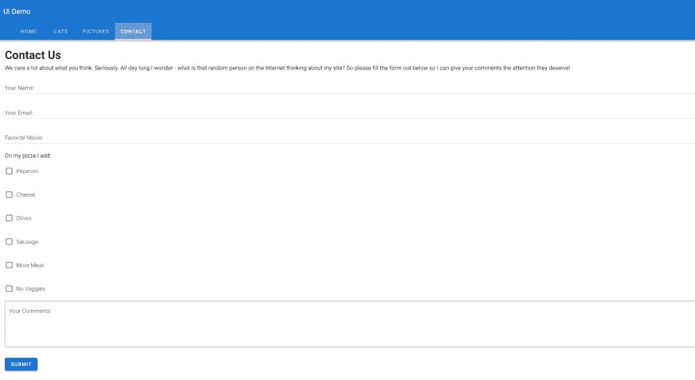

明确地说，我对这种形式的不喜欢不足以让我停止使用这个框架。可以在这里玩这个版本[。](https://quasar-sigma.now.sh/)

## 结论

作为一名 Vue.js 开发人员，我希望您喜欢这个快速浏览，了解您可以使用的一些选项。我很想听听人们对他们正在使用的框架的看法，尤其是如果他们有“之前和之后”的比较可以分享的话。别忘了你可以在这里获得我展示的所有内容的完整源代码。

## 像用户一样体验您的 Vue 应用

调试 Vue.js 应用程序可能会很困难，尤其是当用户会话期间有几十个(如果不是几百个)突变时。如果您对监视和跟踪生产中所有用户的 Vue 突变感兴趣，

[try LogRocket](https://lp.logrocket.com/blg/vue-signup)

.

[](https://lp.logrocket.com/blg/vue-signup)[https://logrocket.com/signup/](https://lp.logrocket.com/blg/vue-signup)

LogRocket 就像是网络和移动应用程序的 DVR，记录你的 Vue 应用程序中发生的一切，包括网络请求、JavaScript 错误、性能问题等等。您可以汇总并报告问题发生时应用程序的状态，而不是猜测问题发生的原因。

LogRocket Vuex 插件将 Vuex 突变记录到 LogRocket 控制台，为您提供导致错误的环境，以及出现问题时应用程序的状态。

现代化您调试 Vue 应用的方式- [开始免费监控](https://lp.logrocket.com/blg/vue-signup)。